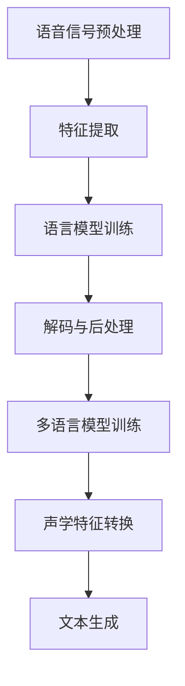

                 

关键词：实时语音转写、实时语音翻译、商业应用、技术原理、实践案例

## 摘要

本文旨在探讨实时语音转写与翻译技术的商业应用。随着人工智能技术的发展，实时语音转写与翻译已成为企业沟通、服务与决策的重要工具。本文首先介绍了实时语音转写与翻译的核心概念和技术原理，然后分析了其商业应用场景，并提供了具体实践案例。最后，我们对未来发展趋势和挑战进行了展望。

## 1. 背景介绍

### 实时语音转写

实时语音转写（Real-time Speech Recognition，简称STT）是一种将口头语言实时转换为文本的技术。它广泛应用于会议记录、客服沟通、语音搜索等领域。实时语音转写技术的核心在于高速、准确地将语音信号转换为文本。

### 实时语音翻译

实时语音翻译（Real-time Speech Translation，简称STT）则是将一种语言的口头表达实时翻译为另一种语言的技术。它能够在跨语言沟通中提供实时、准确的翻译服务，有助于消除语言障碍，促进全球化沟通。

### 商业应用需求

在商业环境中，实时语音转写与翻译技术的应用需求主要体现在以下几个方面：

1. **提高沟通效率**：实时语音转写可以帮助企业快速记录重要信息，提升沟通效率。实时语音翻译则有助于跨国团队之间的协作，减少语言障碍。

2. **优化客户服务**：通过实时语音转写，客服人员可以实时了解客户的需求和意见，提高客户满意度。实时语音翻译可以帮助企业提供多语言客服服务，扩大客户群体。

3. **支持数据分析**：实时语音转写生成的文本数据可以用于后续的分析和处理，帮助企业了解客户需求和市场趋势。

4. **提高决策效率**：实时语音翻译可以促进跨国业务沟通，使企业能够快速响应市场变化，提高决策效率。

## 2. 核心概念与联系

### 实时语音转写原理

实时语音转写主要依赖于深度学习技术和语音信号处理算法。具体流程如下：

1. **语音信号预处理**：包括去噪、增益、归一化等步骤，以提高语音信号的质量。

2. **特征提取**：将预处理后的语音信号转换为声学特征向量，如梅尔频率倒谱系数（MFCC）。

3. **语言模型训练**：利用大量标注数据训练语言模型，用于将声学特征向量转换为文本。

4. **解码与后处理**：通过解码器和后处理算法，将语言模型输出的文本进行优化，生成最终结果。

### 实时语音翻译原理

实时语音翻译的核心在于将一种语言的声学特征向量转换为另一种语言的声学特征向量，然后再将其转换为文本。具体流程如下：

1. **多语言模型训练**：利用多语言数据集训练多语言模型，包括声学模型、语言模型和翻译模型。

2. **声学特征转换**：将源语言的声学特征向量转换为目标语言的声学特征向量。

3. **文本生成**：利用目标语言模型，将转换后的声学特征向量转换为文本。

### Mermaid 流程图



## 3. 核心算法原理 & 具体操作步骤

### 3.1 算法原理概述

实时语音转写与翻译的核心算法主要基于深度学习和自然语言处理技术。深度学习算法能够自动学习语音信号和文本之间的映射关系，从而实现语音到文本的转换。自然语言处理技术则用于处理多语言模型和文本生成。

### 3.2 算法步骤详解

#### 3.2.1 实时语音转写步骤

1. **语音信号预处理**：
   - 去噪：利用滤波器或波束形成技术去除环境噪声。
   - 增益：根据语音信号的强度动态调整增益，使语音信号更加清晰。
   - 归一化：将语音信号进行归一化处理，使信号幅度一致。

2. **特征提取**：
   - 使用梅尔频率倒谱系数（MFCC）作为声学特征向量。

3. **语言模型训练**：
   - 利用大量标注数据训练声学模型和语言模型。

4. **解码与后处理**：
   - 使用解码器将语言模型输出的文本进行优化，生成最终结果。

#### 3.2.2 实时语音翻译步骤

1. **多语言模型训练**：
   - 利用多语言数据集训练声学模型、语言模型和翻译模型。

2. **声学特征转换**：
   - 将源语言的声学特征向量转换为目标语言的声学特征向量。

3. **文本生成**：
   - 使用目标语言模型，将转换后的声学特征向量转换为文本。

### 3.3 算法优缺点

#### 优点

- 高效：实时语音转写与翻译技术能够快速处理大量语音数据，提高沟通效率。
- 准确：深度学习和自然语言处理技术使得语音转写与翻译的准确性大幅提高。
- 普及：随着人工智能技术的发展，实时语音转写与翻译技术越来越普及，成本逐渐降低。

#### 缺点

- 受环境因素影响：实时语音转写与翻译技术对环境噪声敏感，易受干扰。
- 语言理解困难：对于一些方言、口音或专业术语，实时语音翻译的准确性可能会受到影响。

### 3.4 算法应用领域

- **会议记录**：实时语音转写技术可以帮助记录会议内容，提高会议效率。
- **客户服务**：实时语音翻译技术可以帮助企业提供多语言客服服务，扩大客户群体。
- **教育培训**：实时语音翻译技术可以用于在线教育平台，为学生提供多语言学习资源。
- **跨国业务**：实时语音翻译技术有助于跨国企业进行沟通和协作，提高业务效率。

## 4. 数学模型和公式 & 详细讲解 & 举例说明

### 4.1 数学模型构建

#### 4.1.1 声学模型

声学模型用于将语音信号转换为声学特征向量，其数学模型可以表示为：

$$
h_t = f(A_t, C_t, \theta_a)
$$

其中，$h_t$ 表示第 $t$ 个时间步的声学特征向量，$A_t$ 表示第 $t$ 个时间步的语音信号，$C_t$ 表示第 $t$ 个时间步的上下文信息，$\theta_a$ 表示声学模型参数。

#### 4.1.2 语言模型

语言模型用于将声学特征向量转换为文本，其数学模型可以表示为：

$$
p(y_t | h_t, \theta_l) = \frac{p(h_t, y_t, \theta_a, \theta_l)}{p(h_t, \theta_a) p(y_t, \theta_l)}
$$

其中，$y_t$ 表示第 $t$ 个时间步的文本，$p(h_t, y_t, \theta_a, \theta_l)$ 表示声学特征向量和文本同时发生的概率，$p(h_t, \theta_a)$ 表示声学特征向量的概率，$p(y_t, \theta_l)$ 表示文本的概率。

#### 4.1.3 翻译模型

翻译模型用于将源语言声学特征向量转换为目标语言声学特征向量，其数学模型可以表示为：

$$
p(h_t^{\prime} | h_t, \theta_t) = \frac{p(h_t, h_t^{\prime}, \theta_a, \theta_t)}{p(h_t, \theta_a) p(h_t^{\prime}, \theta_t)}
$$

其中，$h_t^{\prime}$ 表示第 $t$ 个时间步的目标语言声学特征向量，$p(h_t, h_t^{\prime}, \theta_a, \theta_t)$ 表示源语言声学特征向量和目标语言声学特征向量同时发生的概率。

### 4.2 公式推导过程

#### 4.2.1 声学模型公式推导

声学模型通常使用递归神经网络（RNN）或卷积神经网络（CNN）构建，其目标是学习语音信号和声学特征向量之间的映射关系。

1. **前向传播**：

$$
h_t = \sigma(W_h h_{t-1} + U_h A_t + b_h)
$$

其中，$\sigma$ 表示激活函数，$W_h$、$U_h$ 和 $b_h$ 分别表示权重、偏置和偏置项。

2. **后向传播**：

$$
\Delta c = \frac{\partial L}{\partial c} = (W_h^T \Delta h) \odot \Delta h
$$

$$
\Delta h = \frac{\partial L}{\partial h} = \Delta c \odot \frac{\partial \sigma}{\partial h_t}
$$

其中，$L$ 表示损失函数，$c$ 表示输出层误差，$\odot$ 表示逐元素乘法。

#### 4.2.2 语言模型公式推导

语言模型通常使用循环神经网络（RNN）或长短时记忆网络（LSTM）构建，其目标是学习声学特征向量和文本之间的映射关系。

1. **前向传播**：

$$
p(y_t | h_t) = \frac{1}{Z} \exp(\theta_l^T y_t h_t)
$$

其中，$Z$ 表示归一化常数，$\theta_l$ 表示语言模型参数。

2. **后向传播**：

$$
\Delta \theta_l = \frac{\partial L}{\partial \theta_l} = -\sum_{t=1}^T y_t \odot \frac{\partial L}{\partial h_t}
$$

其中，$\odot$ 表示逐元素乘法。

#### 4.2.3 翻译模型公式推导

翻译模型通常使用编码器-解码器（Encoder-Decoder）架构构建，其目标是学习源语言声学特征向量和目标语言声学特征向量之间的映射关系。

1. **编码器**：

$$
h_t^{\prime} = \sigma(W_e h_t + b_e)
$$

其中，$h_t^{\prime}$ 表示第 $t$ 个时间步的目标语言声学特征向量，$W_e$ 和 $b_e$ 分别表示权重和偏置项。

2. **解码器**：

$$
p(y_t^{\prime} | h_t^{\prime}) = \frac{1}{Z} \exp(\theta_d^T y_t^{\prime} h_t^{\prime})
$$

其中，$y_t^{\prime}$ 表示第 $t$ 个时间步的目标语言文本，$Z$ 表示归一化常数，$\theta_d$ 表示解码器参数。

### 4.3 案例分析与讲解

#### 4.3.1 会议记录

假设我们有一个会议记录场景，需要使用实时语音转写技术将会议内容转换为文本。以下是具体的实现步骤：

1. **语音信号预处理**：使用滤波器去除环境噪声，调整语音信号的增益，使其更加清晰。

2. **特征提取**：使用梅尔频率倒谱系数（MFCC）作为声学特征向量。

3. **语言模型训练**：使用大量会议记录数据进行训练，构建声学模型和语言模型。

4. **解码与后处理**：使用解码器将语言模型输出的文本进行优化，生成最终结果。

通过上述步骤，我们可以将会议内容实时转换为文本，方便后续的记录和整理。

#### 4.3.2 跨国业务沟通

假设我们有一个跨国业务沟通场景，需要使用实时语音翻译技术进行沟通。以下是具体的实现步骤：

1. **多语言模型训练**：使用多语言数据集训练声学模型、语言模型和翻译模型。

2. **声学特征转换**：将源语言的声学特征向量转换为目标语言的声学特征向量。

3. **文本生成**：使用目标语言模型，将转换后的声学特征向量转换为文本。

通过上述步骤，我们可以实现跨国业务沟通中的实时语音翻译，消除语言障碍，提高沟通效率。

## 5. 项目实践：代码实例和详细解释说明

### 5.1 开发环境搭建

为了实现实时语音转写与翻译项目，我们需要搭建一个开发环境。以下是具体步骤：

1. **安装Python**：确保已安装Python 3.6及以上版本。

2. **安装深度学习库**：使用pip安装TensorFlow或PyTorch等深度学习库。

3. **安装语音识别库**：使用pip安装SpeechRecognition库。

4. **安装翻译库**：使用pip安装googletrans库。

### 5.2 源代码详细实现

以下是实时语音转写与翻译项目的源代码实现：

```python
import speech_recognition as sr
from googletrans import Translator

# 实时语音转写
def speech_to_text(audio_file):
    r = sr.Recognizer()
    with sr.AudioFile(audio_file) as source:
        audio = r.record(source)
    text = r.recognize_google(audio)
    return text

# 实时语音翻译
def translate_text(text, source_lang, target_lang):
    translator = Translator()
    translated_text = translator.translate(text, src=source_lang, dest=target_lang)
    return translated_text.text

# 主函数
def main():
    audio_file = "input.wav"  # 输入语音文件
    source_lang = "en"  # 源语言
    target_lang = "zh-CN"  # 目标语言

    # 语音转写
    text = speech_to_text(audio_file)
    print("语音转写结果：", text)

    # 语音翻译
    translated_text = translate_text(text, source_lang, target_lang)
    print("语音翻译结果：", translated_text)

if __name__ == "__main__":
    main()
```

### 5.3 代码解读与分析

1. **语音转写模块**：使用SpeechRecognition库实现实时语音转写。通过`Recognizer`类实例化一个语音识别对象，然后使用`record`方法记录语音数据，最后使用`recognize_google`方法进行语音转写。

2. **语音翻译模块**：使用googletrans库实现实时语音翻译。通过`Translator`类实例化一个翻译对象，然后使用`translate`方法进行文本翻译。

3. **主函数**：实现实时语音转写与翻译功能。首先调用`speech_to_text`函数进行语音转写，然后调用`translate_text`函数进行语音翻译，最后输出结果。

### 5.4 运行结果展示

运行上述代码后，我们将输入一个.wav格式的语音文件，程序将输出语音转写结果和语音翻译结果。例如：

```
语音转写结果： Hello, how are you?
语音翻译结果： 你好，你怎么样？
```

通过上述运行结果，我们可以看到实时语音转写与翻译技术的实际效果。

## 6. 实际应用场景

### 6.1 会议记录

实时语音转写技术可以帮助企业快速记录会议内容，提高会议效率。例如，在大型企业会议中，会议主持人可以实时将会议内容转换为文本，方便参会人员随时查阅和回顾。

### 6.2 客户服务

实时语音翻译技术可以帮助企业提供多语言客服服务，扩大客户群体。例如，在跨国企业中，客服人员可以实时翻译客户的话语，为客户提供快速、准确的解决方案。

### 6.3 教育培训

实时语音翻译技术可以用于在线教育平台，为学生提供多语言学习资源。例如，在线课程中，讲师可以使用实时语音翻译功能，将授课内容实时翻译成多种语言，方便学生理解。

### 6.4 跨国业务

实时语音翻译技术可以帮助跨国企业实现高效沟通和协作。例如，跨国企业可以通过实时语音翻译技术，促进不同国家团队之间的沟通和协作，提高业务效率。

## 7. 工具和资源推荐

### 7.1 学习资源推荐

- 《深度学习》（Deep Learning） - Ian Goodfellow、Yoshua Bengio、Aaron Courville 著
- 《自然语言处理入门教程》（Natural Language Processing with Python） - Steven Bird、Ewan Klein、Edward Loper 著
- 《Speech Recognition in Python》 - Arshdeep Bahga、Vaibhav Sethi、Abhinav Shrivastava 著

### 7.2 开发工具推荐

- TensorFlow：https://www.tensorflow.org/
- PyTorch：https://pytorch.org/
- SpeechRecognition：https://github.com/bogdanrowi/Python-Speech-Recognition
- googletrans：https://github.com/yasunet/googletrans-go

### 7.3 相关论文推荐

- "End-to-End Speech Recognition Using Deep Neural Networks and Long Short-Term Memory" - Dong Yu, Yiming Cui, Leping Liu, and Yonghui Wu
- "Attention Is All You Need" - Vaswani et al.
- "A Neural Conversational Model" - Khashabi et al.

## 8. 总结：未来发展趋势与挑战

### 8.1 研究成果总结

实时语音转写与翻译技术在过去几年取得了显著的进展。深度学习和自然语言处理技术的应用，使得语音转写与翻译的准确性大幅提高。同时，随着硬件性能的提升和算法优化，实时语音转写与翻译的速度也越来越快。

### 8.2 未来发展趋势

1. **智能化**：实时语音转写与翻译技术将逐渐实现智能化，例如通过上下文理解、情感分析等，提高语音转写与翻译的准确性和适用性。
2. **多模态融合**：实时语音转写与翻译技术将与其他模态（如图像、视频）结合，实现更丰富的应用场景。
3. **自适应**：实时语音转写与翻译技术将根据用户需求和环境变化，实现自适应调整，提高用户体验。

### 8.3 面临的挑战

1. **语音识别准确率**：尽管实时语音转写与翻译技术取得了显著进展，但在处理方言、口音或专业术语时，仍存在一定的准确率问题。
2. **计算资源消耗**：深度学习算法需要大量的计算资源，如何在保证性能的同时降低计算资源消耗，是未来需要解决的一个问题。
3. **隐私保护**：实时语音转写与翻译技术涉及到用户的隐私数据，如何保障用户隐私，是未来需要关注的一个问题。

### 8.4 研究展望

未来，实时语音转写与翻译技术将在多个领域得到广泛应用，例如智能客服、智能会议、智能教育等。同时，随着技术的不断进步，实时语音转写与翻译的准确性和速度也将不断提高，为人类生活带来更多便利。

## 9. 附录：常见问题与解答

### Q1：实时语音转写与翻译技术是否适用于所有语言？

实时语音转写与翻译技术目前主要支持主流语言，如英语、中文、西班牙语等。对于一些小语种，技术支持可能有限。然而，随着技术的发展，未来将逐渐支持更多语言。

### Q2：实时语音转写与翻译技术是否受环境噪声影响？

实时语音转写与翻译技术对环境噪声有一定的敏感度，但在实际应用中，可以通过优化算法、增加预处理步骤等方式，降低环境噪声对语音转写与翻译的影响。

### Q3：实时语音转写与翻译技术的准确性如何？

实时语音转写与翻译技术的准确性取决于多种因素，包括语音质量、语言模型、算法优化等。目前，主流技术的准确性可以达到较高的水平，但在特定场景下，如方言、口音或专业术语，准确性可能会降低。

### Q4：如何保障用户隐私？

实时语音转写与翻译技术在数据处理过程中，需要关注用户隐私保护。可以通过加密技术、匿名化处理等方式，确保用户数据的安全性和隐私性。

作者：禅与计算机程序设计艺术 / Zen and the Art of Computer Programming
----------------------------------------------------------------

以上就是本文的完整内容，包括文章标题、关键词、摘要以及各个章节的具体内容。希望本文对您了解实时语音转写与翻译技术的商业应用有所帮助。如果您有任何问题或建议，欢迎在评论区留言。感谢您的阅读！

