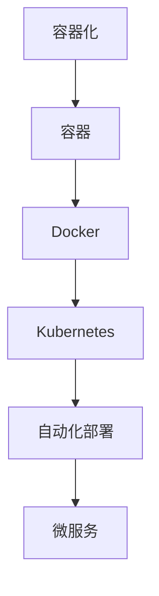

                 

关键词：容器化，Docker，Kubernetes，微服务，持续集成，持续交付

> 摘要：本文将深入探讨容器化技术的发展，重点介绍Docker和Kubernetes这两个关键工具。通过实例和详细解释，我们将理解容器化技术的核心概念、原理及其在实际应用中的价值。

## 1. 背景介绍

在软件开发领域，传统的软件部署方式常常面临诸多挑战，如环境不一致、部署复杂、维护困难等。这些问题的根源在于软件运行环境的多样性。容器化技术的出现，为解决这些问题提供了一种新的思路。Docker和Kubernetes是容器化技术中最为重要的工具。

Docker是一个开源的应用容器引擎，它允许开发者将应用程序及其依赖项打包到一个可移植的容器中，然后这个容器可以在任何支持Docker的操作系统上运行。这使得开发环境与生产环境之间的差异大大减小，从而简化了软件的部署过程。

Kubernetes是一个开源的容器编排系统，它用于自动化容器的部署、扩展和管理。通过Kubernetes，开发者可以轻松地管理跨多个主机的容器化应用程序，提高其可用性、伸缩性和灵活性。

## 2. 核心概念与联系

### 2.1 容器化概念

容器是一种轻量级的、可执行的软件包，包含应用程序及其依赖项。容器与虚拟机相比，具有更高的性能和更小的资源占用。容器通过操作系统级虚拟化实现，不需要额外的操作系统来运行，从而极大地提高了效率。

### 2.2 Docker概念

Docker是一种容器化技术，它提供了一种将应用程序打包成容器的工具。Docker使用Dockerfile来定义容器的构建过程，通过docker命令行工具进行容器的创建、启动和管理。

### 2.3 Kubernetes概念

Kubernetes是一个用于容器编排的开源系统。它提供了自动化容器操作的功能，如部署、扩展和管理容器化应用程序。Kubernetes通过Pods、Services、Deployments等资源对象来组织和管理容器。

### 2.4 Mermaid流程图



## 3. 核心算法原理 & 具体操作步骤

### 3.1 算法原理概述

容器化技术的核心在于将应用程序及其依赖项打包成一个容器，使得应用程序在不同的环境中运行时保持一致性。Docker通过镜像和容器的概念实现这一目标。Kubernetes则通过编排和管理容器来简化应用程序的部署和管理。

### 3.2 算法步骤详解

#### 3.2.1 Docker安装与配置

1. 安装Docker
    ```bash
    sudo apt-get update
    sudo apt-get install docker-ce docker-ce-cli containerd.io
    ```
2. 配置Docker
    ```bash
    sudo groupadd docker
    sudo usermod -aG docker $USER
    newgrp docker
    ```

#### 3.2.2 创建Docker镜像

1. 编写Dockerfile
    ```Dockerfile
    FROM ubuntu:18.04
    RUN apt-get update && apt-get install -y python3
    COPY . /app
    WORKDIR /app
    RUN python3 setup.py install
    ```
2. 构建Docker镜像
    ```bash
    docker build -t myapp .
    ```

#### 3.2.3 运行Docker容器

1. 运行Docker容器
    ```bash
    docker run -d -p 8080:80 myapp
    ```

#### 3.2.4 Kubernetes安装与配置

1. 安装Kubernetes集群
    ```bash
    kubeadm init
    ```
2. 配置Kubectl
    ```bash
    mkdir -p $HOME/.kube
    sudo cp -i /etc/kubernetes/admin.conf $HOME/.kube/config
    sudo chown $(id -u):$(id -g) $HOME/.kube/config
    ```

#### 3.2.5 Kubernetes部署应用

1. 创建deployment.yaml
    ```yaml
    apiVersion: apps/v1
    kind: Deployment
    metadata:
      name: myapp
      labels:
        app: myapp
    spec:
      replicas: 3
      selector:
        matchLabels:
          app: myapp
      template:
        metadata:
          labels:
            app: myapp
        spec:
          containers:
          - name: myapp
            image: myapp:latest
            ports:
            - containerPort: 80
    ```
2. 部署应用
    ```bash
    kubectl apply -f deployment.yaml
    ```

### 3.3 算法优缺点

#### 优点：

- 提高开发效率：容器化技术使得应用程序的部署和运维变得更加简单和高效。
- 环境一致性：容器确保了应用程序在不同环境中的一致性，减少了环境差异带来的问题。
- 资源优化：容器轻量级、高效，可以在有限的资源上运行更多应用程序。

#### 缺点：

- 学习成本：容器化技术需要一定的学习成本，特别是对于传统开发者来说。
- 安全风险：容器本身是一个沙盒环境，但如果配置不当，可能会引入安全漏洞。

### 3.4 算法应用领域

容器化技术在现代软件开发和运维中得到了广泛应用，包括：

- 微服务架构：容器化技术使得微服务架构的实现变得更加简单和高效。
- 持续集成和持续交付（CI/CD）：容器化技术简化了应用程序的构建、测试和部署过程。
- 容器编排：Kubernetes等容器编排工具可以自动化管理大规模的容器化应用程序。

## 4. 数学模型和公式 & 详细讲解 & 举例说明

### 4.1 数学模型构建

在容器化技术中，我们可以使用以下数学模型来衡量容器性能：

- 响应时间（Response Time, RT）：容器处理请求的时间。
- 资源利用率（Resource Utilization, RU）：容器使用的资源比例。

### 4.2 公式推导过程

- 响应时间（RT）的公式为：
  $$ RT = \frac{1}{\lambda} + \frac{1}{\mu} $$
  其中，$\lambda$ 为请求到达率，$\mu$ 为服务速率。

- 资源利用率（RU）的公式为：
  $$ RU = \frac{\lambda}{\mu} $$

### 4.3 案例分析与讲解

假设一个容器化应用程序的请求到达率 $\lambda$ 为 10 次/秒，服务速率 $\mu$ 为 20 次/秒。根据上述公式，我们可以计算出：

- 响应时间（RT）为：
  $$ RT = \frac{1}{10} + \frac{1}{20} = 0.1 + 0.05 = 0.15 \text{秒} $$
- 资源利用率（RU）为：
  $$ RU = \frac{10}{20} = 0.5 $$

这意味着该容器化应用程序的响应时间为 0.15 秒，资源利用率为 50%。

## 5. 项目实践：代码实例和详细解释说明

### 5.1 开发环境搭建

为了演示Docker和Kubernetes的实践，我们首先需要搭建一个开发环境。

#### 5.1.1 Docker环境搭建

1. 安装Docker
    ```bash
    sudo apt-get update
    sudo apt-get install docker-ce docker-ce-cli containerd.io
    ```
2. 配置Docker
    ```bash
    sudo groupadd docker
    sudo usermod -aG docker $USER
    newgrp docker
    ```

#### 5.1.2 Kubernetes环境搭建

1. 安装Kubernetes集群
    ```bash
    kubeadm init
    ```
2. 配置Kubectl
    ```bash
    mkdir -p $HOME/.kube
    sudo cp -i /etc/kubernetes/admin.conf $HOME/.kube/config
    sudo chown $(id -u):$(id -g) $HOME/.kube/config
    ```

### 5.2 源代码详细实现

我们使用一个简单的Python Flask应用程序作为示例。

#### 5.2.1 Flask应用程序

1. 创建一个名为 `app.py` 的Python文件，内容如下：

    ```python
    from flask import Flask

    app = Flask(__name__)

    @app.route('/')
    def hello():
        return 'Hello, World!'

    if __name__ == '__main__':
        app.run(host='0.0.0.0', port=8080)
    ```

2. 创建一个名为 `Dockerfile` 的文件，内容如下：

    ```Dockerfile
    FROM python:3.9
    WORKDIR /app
    COPY . .
    RUN pip install -r requirements.txt
    EXPOSE 8080
    CMD ["python", "app.py"]
    ```

3. 创建一个名为 `requirements.txt` 的文件，内容如下：

    ```plaintext
    Flask==2.0.1
    ```

### 5.3 代码解读与分析

#### 5.3.1 Flask应用程序解读

- `app.py` 是一个简单的Flask应用程序，定义了一个路由 `/`，返回字符串 `'Hello, World!'`。

#### 5.3.2 Dockerfile解读

- `FROM python:3.9`：基于Python 3.9镜像创建新镜像。
- `WORKDIR /app`：将工作目录设置为 `/app`。
- `COPY . .`：将当前目录（包含 `app.py` 和 `Dockerfile`）的文件复制到镜像的 `/app` 目录。
- `RUN pip install -r requirements.txt`：安装Python依赖项。
- `EXPOSE 8080`：暴露端口 8080。
- `CMD ["python", "app.py"]`：运行应用程序。

### 5.4 运行结果展示

#### 5.4.1 Docker容器运行

1. 构建Docker镜像
    ```bash
    docker build -t myapp .
    ```
2. 运行Docker容器
    ```bash
    docker run -d -p 8080:80 myapp
    ```

3. 访问应用程序
    ```bash
    open http://localhost
    ```

#### 5.4.2 Kubernetes部署

1. 创建deployment.yaml
    ```yaml
    apiVersion: apps/v1
    kind: Deployment
    metadata:
      name: myapp
      labels:
        app: myapp
    spec:
      replicas: 3
      selector:
        matchLabels:
          app: myapp
      template:
        metadata:
          labels:
            app: myapp
        spec:
          containers:
          - name: myapp
            image: myapp:latest
            ports:
            - containerPort: 80
    ```

2. 部署应用
    ```bash
    kubectl apply -f deployment.yaml
    ```

3. 查看部署状态
    ```bash
    kubectl get pods
    ```

## 6. 实际应用场景

容器化技术在现代软件开发和运维中得到了广泛应用，以下是一些实际应用场景：

- **微服务架构**：容器化技术使得微服务架构的实现变得更加简单和高效。每个微服务都可以独立部署和扩展，从而提高了系统的可维护性和可伸缩性。
- **持续集成和持续交付（CI/CD）**：容器化技术简化了应用程序的构建、测试和部署过程。通过自动化工具，可以实现持续集成和持续交付，从而提高开发效率。
- **容器编排**：Kubernetes等容器编排工具可以自动化管理大规模的容器化应用程序，提高其可用性、伸缩性和灵活性。

## 7. 工具和资源推荐

### 7.1 学习资源推荐

- **Docker官方文档**：<https://docs.docker.com/>
- **Kubernetes官方文档**：<https://kubernetes.io/docs/>
- **《容器化与Docker》**：张宁，电子工业出版社

### 7.2 开发工具推荐

- **Docker Desktop**：<https://www.docker.com/products/docker-desktop>
- **Kubernetes CLI（kubectl）**：<https://kubernetes.io/docs/tasks/tools/>

### 7.3 相关论文推荐

- **"Docker: Lightweight Linux Containers for Developing, Shipping, and Running Applications"**：Sosnitsky, M., & Chacon, S. (2014).
- **"Kubernetes: System Architecture"**：Heptio (2018).

## 8. 总结：未来发展趋势与挑战

### 8.1 研究成果总结

容器化技术已经成为现代软件开发和运维的基石。Docker和Kubernetes等工具的成熟，使得容器化技术的应用更加广泛。通过容器化技术，开发者可以简化软件部署，提高开发效率，降低运维成本。

### 8.2 未来发展趋势

- **容器化技术的普及**：随着云计算和微服务架构的普及，容器化技术将在更多领域得到应用。
- **容器编排的智能化**：未来容器编排工具将更加智能化，提供自动化的部署、扩展和管理功能。
- **容器安全性的提升**：容器安全性的问题将得到更多关注，未来将出现更多容器安全解决方案。

### 8.3 面临的挑战

- **容器安全性的挑战**：容器化技术的普及带来了新的安全挑战，如何确保容器安全是一个重要问题。
- **容器管理的复杂性**：随着容器数量的增加，容器管理的复杂性也会增加，如何高效管理大量容器是一个挑战。

### 8.4 研究展望

未来，容器化技术将继续发展，为软件开发和运维带来更多便利。研究者应关注容器安全、智能化容器编排和高效容器管理等领域，推动容器化技术的持续创新。

## 9. 附录：常见问题与解答

### 9.1 Docker和虚拟机的区别是什么？

Docker是基于操作系统级的虚拟化技术，而虚拟机是基于硬件的虚拟化技术。因此，Docker比虚拟机更轻量级、高效。

### 9.2 Kubernetes的优势是什么？

Kubernetes提供了自动化容器部署、扩展和管理功能，使得容器化应用程序的管理更加高效和灵活。

### 9.3 如何在Kubernetes中实现服务发现？

在Kubernetes中，可以通过配置Service资源来实现服务发现。Service可以根据标签选择器（Label Selector）将流量路由到相应的Pods。

---

作者：禅与计算机程序设计艺术 / Zen and the Art of Computer Programming

