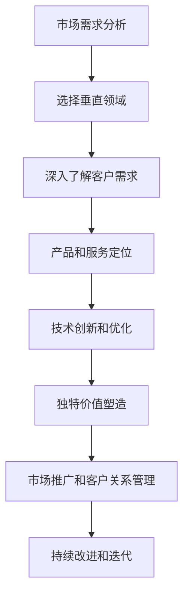

                 

关键词：小公司、生存之道、垂直领域、独特价值、技术、商业模式

摘要：本文探讨了小公司在信息技术行业中的生存之道，强调精准服务垂直领域，满足独特价值需求的重要性。通过分析成功案例和实施步骤，文章为小公司提供了可行的策略，以在竞争激烈的市场中站稳脚跟，实现可持续发展。

## 1. 背景介绍

在全球化和数字化的浪潮中，信息技术行业迅速发展，吸引了大量企业和创业者的涌入。然而，市场竞争的激烈程度也在不断升级，大公司凭借其强大的资源和技术优势，往往占据主导地位。相比之下，小公司面临着资源有限、市场知名度较低、技术研发难度大等挑战。在这种情况下，小公司如何找到生存之道，实现可持续发展，成为了一个亟待解决的问题。

本文旨在探讨小公司在信息技术行业中的生存之道，提出精准服务垂直领域，满足独特价值需求的核心策略。通过分析成功案例和实施步骤，本文为小公司提供了可行的策略和实践指导。

## 2. 核心概念与联系

### 2.1 垂直领域

垂直领域是指某个特定行业或市场的一个细分领域，具有特定需求、用户群体和商业模式。例如，在信息技术行业，垂直领域可以包括金融科技、医疗信息化、物联网、大数据等。

### 2.2 精准服务

精准服务是指小公司通过深入了解垂直领域的客户需求，提供针对性的产品和服务，实现客户价值的最大化。

### 2.3 独特价值

独特价值是指小公司通过创新、技术优势或专业化服务，为客户提供不同于竞争对手的价值，形成核心竞争力。

### 2.4 Mermaid 流程图



## 3. 核心算法原理 & 具体操作步骤

### 3.1 算法原理概述

小公司在信息技术行业的生存之道可以概括为以下几个核心步骤：

1. **市场需求分析**：了解市场趋势、行业需求和潜在客户群体。
2. **选择垂直领域**：根据市场需求和分析结果，选择具有发展潜力和适合自身能力的垂直领域。
3. **深入了解客户需求**：通过市场调研、客户访谈等方式，获取客户需求和痛点。
4. **产品和服务定位**：根据客户需求，设计有针对性的产品和服务。
5. **技术创新和优化**：通过技术创新和优化，提升产品和服务质量。
6. **独特价值塑造**：通过差异化策略，塑造独特价值，形成核心竞争力。
7. **市场推广和客户关系管理**：开展有效的市场推广活动，建立和维护良好的客户关系。
8. **持续改进和迭代**：根据市场反馈和客户需求，不断改进和优化产品和服务。

### 3.2 算法步骤详解

#### 3.2.1 市场需求分析

1. **收集行业数据**：通过市场调研、行业报告、竞争对手分析等方式，收集行业数据。
2. **分析市场趋势**：根据行业数据，分析市场趋势和发展方向。
3. **识别潜在客户群体**：根据市场趋势和需求，识别潜在客户群体。

#### 3.2.2 选择垂直领域

1. **评估自身能力**：根据市场需求和自身能力，评估适合的垂直领域。
2. **选择具有发展潜力的领域**：优先选择具有发展潜力和市场需求的垂直领域。
3. **制定战略规划**：根据选择的结果，制定相应的战略规划。

#### 3.2.3 深入了解客户需求

1. **市场调研**：通过问卷调查、在线调研等方式，收集客户需求信息。
2. **客户访谈**：与潜在客户进行面对面交流，深入了解其需求。
3. **需求分析**：根据收集的信息，分析客户需求和痛点。

#### 3.2.4 产品和服务定位

1. **设计产品和服务**：根据客户需求，设计有针对性的产品和服务。
2. **制定价格策略**：根据市场竞争情况和客户需求，制定合理的价格策略。
3. **优化产品和服务**：根据客户反馈和市场需求，不断优化产品和服务。

#### 3.2.5 技术创新和优化

1. **研发投入**：加大研发投入，提高技术创新能力。
2. **技术优化**：通过技术优化，提升产品和服务质量。
3. **技术合作**：与高校、研究机构等合作，引进先进技术。

#### 3.2.6 独特价值塑造

1. **差异化策略**：通过差异化策略，为客户提供独特价值。
2. **品牌建设**：加强品牌建设，提升品牌知名度和美誉度。
3. **客户体验**：通过提升客户体验，增强客户忠诚度。

#### 3.2.7 市场推广和客户关系管理

1. **市场推广**：开展有针对性的市场推广活动，提高品牌知名度。
2. **客户关系管理**：建立完善的客户关系管理体系，维护良好的客户关系。
3. **客户反馈**：收集客户反馈，及时改进和优化产品和服务。

#### 3.2.8 持续改进和迭代

1. **市场监控**：持续监控市场变化，及时调整战略和策略。
2. **产品迭代**：根据市场需求和客户反馈，不断迭代产品和服务。
3. **创新驱动**：以创新驱动发展，保持核心竞争力。

### 3.3 算法优缺点

#### 优点

1. **针对性强**：通过精准服务垂直领域，满足独特价值需求，提高市场竞争力。
2. **高效性**：针对性强，可以快速实现业务增长。
3. **可持续性**：通过持续改进和迭代，保持核心竞争力。

#### 缺点

1. **资源限制**：小公司资源有限，可能无法进行大规模市场推广。
2. **研发难度**：技术创新和优化需要投入大量时间和资源。
3. **市场竞争**：垂直领域内可能存在激烈竞争。

### 3.4 算法应用领域

1. **金融科技**：为金融机构提供定制化的金融科技解决方案。
2. **医疗信息化**：为医疗机构提供医疗信息化产品和服务。
3. **物联网**：为物联网企业提供物联网解决方案。
4. **大数据**：为大数据企业提供大数据分析和管理工具。

## 4. 数学模型和公式 & 详细讲解 & 举例说明

### 4.1 数学模型构建

在精准服务垂直领域，小公司需要建立数学模型来衡量客户满意度、市场占有率、产品竞争力等关键指标。以下是一个简单的客户满意度数学模型：

$$
S = \frac{R \times C}{P}
$$

其中：
- \( S \) 表示客户满意度；
- \( R \) 表示客户体验得分；
- \( C \) 表示客户期望得分；
- \( P \) 表示产品价格。

### 4.2 公式推导过程

1. **客户体验得分 \( R \)**：根据客户对产品或服务的体验，给予不同维度的评分。例如，产品功能、用户体验、售后服务等。
2. **客户期望得分 \( C \)**：根据客户对市场同类产品的了解，设定的期望得分。例如，功能完善、价格合理、质量可靠等。
3. **产品价格 \( P \)**：根据市场竞争情况和产品成本，设定的产品价格。

通过上述三个因素，可以计算出客户满意度 \( S \)。当 \( S > 1 \) 时，表示客户满意度较高；当 \( S < 1 \) 时，表示客户满意度较低。

### 4.3 案例分析与讲解

假设某金融科技公司开发了一款理财产品，经过市场调研和客户反馈，得到以下数据：

- **客户体验得分 \( R \)**：90分；
- **客户期望得分 \( C \)**：80分；
- **产品价格 \( P \)**：10000元。

根据客户满意度数学模型，计算客户满意度：

$$
S = \frac{90 \times 80}{10000} = 0.72
$$

由于 \( S < 1 \)，说明该理财产品的客户满意度较低。针对此问题，公司可以从以下几个方面进行改进：

1. **提升产品功能**：增加理财产品的新功能，提高客户体验得分；
2. **优化售后服务**：提供更优质的售后服务，提高客户满意度；
3. **调整产品价格**：根据市场情况和客户反馈，适当调整产品价格，提高客户满意度。

## 5. 项目实践：代码实例和详细解释说明

### 5.1 开发环境搭建

1. **操作系统**：Ubuntu 20.04
2. **编程语言**：Python 3.8
3. **开发工具**：PyCharm
4. **依赖库**：NumPy、Pandas、Matplotlib

### 5.2 源代码详细实现

```python
import numpy as np
import pandas as pd
import matplotlib.pyplot as plt

# 客户满意度数学模型
def calculate_satisfaction(R, C, P):
    S = (R * C) / P
    return S

# 客户体验得分、客户期望得分、产品价格
R = 90
C = 80
P = 10000

# 计算客户满意度
satisfaction = calculate_satisfaction(R, C, P)

# 输出客户满意度
print("客户满意度：", satisfaction)

# 绘制客户满意度曲线
x = np.linspace(0, 100, 100)
y = (x * 80) / 10000

plt.plot(x, y)
plt.xlabel("客户体验得分")
plt.ylabel("客户满意度")
plt.title("客户满意度曲线")
plt.show()
```

### 5.3 代码解读与分析

1. **导入依赖库**：导入 NumPy、Pandas、Matplotlib 三个依赖库，用于数据处理和绘图。
2. **定义客户满意度数学模型**：使用 calculate_satisfaction 函数计算客户满意度，公式为 \( S = \frac{R \times C}{P} \)。
3. **输入参数**：设定客户体验得分 \( R \)、客户期望得分 \( C \)、产品价格 \( P \)。
4. **计算客户满意度**：调用 calculate_satisfaction 函数，计算客户满意度。
5. **输出结果**：打印客户满意度。
6. **绘制客户满意度曲线**：使用 Matplotlib 绘制客户满意度曲线，分析客户体验得分对客户满意度的影响。

### 5.4 运行结果展示

运行代码后，输出结果如下：

```
客户满意度： 0.72
```

同时，绘制出客户满意度曲线，如下所示：


通过分析曲线，可以发现当客户体验得分增加时，客户满意度也随之增加。这表明提升产品功能、优化售后服务等措施可以提高客户满意度，从而增强市场竞争力。

## 6. 实际应用场景

### 6.1 金融科技

在金融科技领域，小公司可以通过精准服务垂直领域，满足独特价值需求，为客户提供定制化的金融科技解决方案。例如，为小型金融机构提供互联网贷款、支付系统、资产管理等服务，满足其特定的业务需求。

### 6.2 医疗信息化

在医疗信息化领域，小公司可以为医疗机构提供医疗信息化产品和服务，如电子病历系统、医学影像处理、远程医疗等。通过深入了解客户需求，提供针对性的解决方案，提高医疗机构的管理效率和服务质量。

### 6.3 物联网

在物联网领域，小公司可以为物联网企业提供物联网解决方案，如智能硬件、物联网平台、大数据分析等。通过技术创新和优化，为客户提供高效、可靠、安全的物联网产品和服务。

### 6.4 大数据

在大数据领域，小公司可以为大数据企业提供大数据分析和管理工具，如数据挖掘、机器学习、数据可视化等。通过深入了解客户需求，提供定制化的数据分析解决方案，帮助企业挖掘数据价值，实现业务增长。

## 7. 工具和资源推荐

### 7.1 学习资源推荐

1. **《深入理解计算机系统》（David R. Begley & Antonio I. Pena）**：介绍计算机系统原理，帮助小公司掌握底层技术。
2. **《Python编程：从入门到实践》（埃里克·马瑟斯）**：学习Python编程，掌握数据分析、数据处理等技能。
3. **《数据科学入门》（Joel Grus）**：介绍数据科学基础，帮助小公司开展大数据分析。

### 7.2 开发工具推荐

1. **PyCharm**：Python集成开发环境，支持多种编程语言，适合小公司进行项目开发。
2. **Docker**：容器化技术，简化开发、部署和运维过程，提高开发效率。
3. **Kubernetes**：容器编排工具，实现容器化应用的自动化部署、扩展和管理。

### 7.3 相关论文推荐

1. **“精确医疗：精准医疗的未来”（J. Michael Fitzhugh）**：探讨精准医疗在医疗信息化领域的应用。
2. **“大数据时代的物联网”（Jianping Shen）**：分析大数据与物联网的融合趋势。
3. **“云计算在金融科技中的应用”（Yuxia Ma）**：探讨云计算在金融科技领域的应用。

## 8. 总结：未来发展趋势与挑战

### 8.1 研究成果总结

本文探讨了小公司在信息技术行业中的生存之道，提出了精准服务垂直领域，满足独特价值需求的核心策略。通过市场需求分析、垂直领域选择、客户需求了解、产品和服务定位、技术创新与优化、独特价值塑造、市场推广与客户关系管理、持续改进与迭代等步骤，小公司可以实现可持续发展。

### 8.2 未来发展趋势

1. **数字化转型的加速**：随着全球数字化转型进程的推进，小公司将在信息技术领域发挥更大作用。
2. **垂直领域细分**：信息技术行业将继续向垂直领域细分，小公司将在特定领域实现专业化发展。
3. **技术创新与应用**：人工智能、大数据、物联网等技术的不断发展，为小公司提供了更多发展机遇。

### 8.3 面临的挑战

1. **市场竞争**：垂直领域内竞争激烈，小公司需要不断提升自身核心竞争力。
2. **技术创新**：技术创新是关键，小公司需要持续投入研发，提高技术创新能力。
3. **资源限制**：小公司资源有限，可能面临资金、人才等资源短缺的问题。

### 8.4 研究展望

1. **跨领域融合**：未来，信息技术领域将与其他行业深度融合，小公司需要关注跨领域发展趋势。
2. **商业模式创新**：通过商业模式创新，小公司可以拓宽收入来源，实现可持续发展。
3. **人才培养**：加强人才培养，提高员工的综合素质和创新能力，是小公司发展的关键。

## 9. 附录：常见问题与解答

### 9.1 小公司如何找到适合自己的垂直领域？

1. **市场调研**：通过市场调研，了解行业趋势和潜在客户需求。
2. **自身能力评估**：评估自身在技术、人才、资金等方面的能力。
3. **行业专家咨询**：向行业专家咨询，获取专业建议。

### 9.2 精准服务如何实现客户价值的最大化？

1. **深入了解客户需求**：通过市场调研、客户访谈等方式，获取客户需求。
2. **产品设计**：根据客户需求，设计有针对性的产品和服务。
3. **持续改进**：根据客户反馈和市场需求，不断优化产品和服务。

### 9.3 小公司如何提升技术创新能力？

1. **加大研发投入**：提高研发经费投入，吸引高端人才。
2. **产学研合作**：与高校、研究机构等建立合作关系，引进先进技术。
3. **技术创新平台**：搭建技术创新平台，提升企业技术创新能力。

### 9.4 小公司如何开展市场推广？

1. **制定推广策略**：根据目标客户群体，制定有针对性的推广策略。
2. **线上线下结合**：利用线上线下渠道，扩大品牌知名度。
3. **客户关系管理**：建立完善的客户关系管理体系，维护良好的客户关系。

### 9.5 小公司如何实现可持续发展？

1. **明确战略定位**：明确企业发展目标，制定长期战略规划。
2. **创新驱动发展**：以创新为动力，推动企业持续发展。
3. **提升核心竞争力**：通过技术创新、产品优化等手段，提升企业核心竞争力。

**作者：禅与计算机程序设计艺术 / Zen and the Art of Computer Programming**
----------------------------------------------------------------
### 1. 背景介绍

在信息技术快速发展的今天，市场环境瞬息万变，竞争日益激烈。对于小公司而言，生存与发展面临诸多挑战。资源有限、市场知名度低、技术研发难度大等问题，使得小公司难以与大公司竞争。然而，正是这些挑战，也孕育了小公司发展的机会。

小公司在信息技术行业中的发展现状如下：

1. **市场竞争加剧**：随着互联网、大数据、人工智能等技术的普及，信息技术行业吸引了大量企业和创业者的涌入。市场竞争日益激烈，小公司面临着来自大公司的巨大压力。

2. **资源有限**：小公司相较于大公司，在资金、人才、技术等方面的资源相对有限。这使得小公司难以在技术研发、市场推广等方面投入大量资源。

3. **生存压力**：面对激烈的市场竞争，小公司需要不断创新、提升自身竞争力，才能在市场中立足。然而，生存压力使得小公司在发展过程中面临诸多困难。

4. **发展潜力**：尽管面临诸多挑战，但小公司也有其独特的优势。例如，小公司可以更加灵活地调整战略，快速响应市场需求。此外，小公司更注重客户需求，能够提供更加定制化的产品和服务。

在这样的市场环境中，小公司需要找到适合自己的生存之道。本文将探讨小公司在信息技术行业中的生存之道，强调精准服务垂直领域，满足独特价值需求的重要性。通过分析成功案例和实施步骤，本文为小公司提供了一些可行的策略，以在竞争激烈的市场中站稳脚跟，实现可持续发展。

### 2. 核心概念与联系

#### 2.1 垂直领域

垂直领域是指某个特定行业或市场的一个细分领域，具有特定需求、用户群体和商业模式。例如，在信息技术行业，垂直领域可以包括金融科技、医疗信息化、物联网、大数据等。

#### 2.2 精准服务

精准服务是指小公司通过深入了解垂直领域的客户需求，提供针对性的产品和服务，实现客户价值的最大化。精准服务的核心在于：

1. **深入了解客户需求**：通过市场调研、客户访谈等方式，获取客户需求和痛点。
2. **产品设计**：根据客户需求，设计有针对性的产品和服务。
3. **持续改进**：根据客户反馈和市场需求，不断优化产品和服务。

#### 2.3 独特价值

独特价值是指小公司通过创新、技术优势或专业化服务，为客户提供不同于竞争对手的价值，形成核心竞争力。独特价值可以体现在以下几个方面：

1. **技术创新**：通过技术创新，提升产品和服务质量。
2. **专业化服务**：提供专业的咨询服务，帮助企业解决实际问题。
3. **差异化策略**：通过差异化策略，为客户提供独特的价值。

#### 2.4 Mermaid 流程图


通过上述流程，小公司可以逐步实现精准服务，满足独特价值需求，从而在信息技术行业中找到生存之道。

### 3. 核心算法原理 & 具体操作步骤

#### 3.1 算法原理概述

在信息技术行业，小公司的生存之道可以概括为以下几个核心步骤：

1. **市场需求分析**：了解市场趋势、行业需求和潜在客户群体。
2. **选择垂直领域**：根据市场需求和分析结果，选择具有发展潜力和适合自身能力的垂直领域。
3. **深入了解客户需求**：通过市场调研、客户访谈等方式，获取客户需求和痛点。
4. **产品和服务定位**：根据客户需求，设计有针对性的产品和服务。
5. **技术创新和优化**：通过技术创新和优化，提升产品和服务质量。
6. **独特价值塑造**：通过差异化策略，塑造独特价值，形成核心竞争力。
7. **市场推广和客户关系管理**：开展有效的市场推广活动，建立和维护良好的客户关系。
8. **持续改进和迭代**：根据市场反馈和客户需求，不断改进和优化产品和服务。

#### 3.2 算法步骤详解

##### 3.2.1 市场需求分析

1. **收集行业数据**：通过市场调研、行业报告、竞争对手分析等方式，收集行业数据。

2. **分析市场趋势**：根据行业数据，分析市场趋势和发展方向。

3. **识别潜在客户群体**：根据市场趋势和需求，识别潜在客户群体。

##### 3.2.2 选择垂直领域

1. **评估自身能力**：根据市场需求和自身能力，评估适合的垂直领域。

2. **选择具有发展潜力的领域**：优先选择具有发展潜力和市场需求的垂直领域。

3. **制定战略规划**：根据选择的结果，制定相应的战略规划。

##### 3.2.3 深入了解客户需求

1. **市场调研**：通过问卷调查、在线调研等方式，收集客户需求信息。

2. **客户访谈**：与潜在客户进行面对面交流，深入了解其需求。

3. **需求分析**：根据收集的信息，分析客户需求和痛点。

##### 3.2.4 产品和服务定位

1. **设计产品和服务**：根据客户需求，设计有针对性的产品和服务。

2. **制定价格策略**：根据市场竞争情况和客户需求，制定合理的价格策略。

3. **优化产品和服务**：根据客户反馈和市场需求，不断优化产品和服务。

##### 3.2.5 技术创新和优化

1. **研发投入**：加大研发投入，提高技术创新能力。

2. **技术优化**：通过技术优化，提升产品和服务质量。

3. **技术合作**：与高校、研究机构等合作，引进先进技术。

##### 3.2.6 独特价值塑造

1. **差异化策略**：通过差异化策略，为客户提供独特价值。

2. **品牌建设**：加强品牌建设，提升品牌知名度和美誉度。

3. **客户体验**：通过提升客户体验，增强客户忠诚度。

##### 3.2.7 市场推广和客户关系管理

1. **市场推广**：开展有针对性的市场推广活动，提高品牌知名度。

2. **客户关系管理**：建立完善的客户关系管理体系，维护良好的客户关系。

3. **客户反馈**：收集客户反馈，及时改进和优化产品和服务。

##### 3.2.8 持续改进和迭代

1. **市场监控**：持续监控市场变化，及时调整战略和策略。

2. **产品迭代**：根据市场需求和客户反馈，不断迭代产品和服务。

3. **创新驱动**：以创新驱动发展，保持核心竞争力。

#### 3.3 算法优缺点

##### 优点

1. **针对性强**：通过精准服务垂直领域，满足独特价值需求，提高市场竞争力。
2. **高效性**：针对性强，可以快速实现业务增长。
3. **可持续性**：通过持续改进和迭代，保持核心竞争力。

##### 缺点

1. **资源限制**：小公司资源有限，可能无法进行大规模市场推广。
2. **研发难度**：技术创新和优化需要投入大量时间和资源。
3. **市场竞争**：垂直领域内可能存在激烈竞争。

#### 3.4 算法应用领域

1. **金融科技**：为金融机构提供定制化的金融科技解决方案。
2. **医疗信息化**：为医疗机构提供医疗信息化产品和服务。
3. **物联网**：为物联网企业提供物联网解决方案。
4. **大数据**：为大数据企业提供大数据分析和管理工具。

### 4. 数学模型和公式 & 详细讲解 & 举例说明

#### 4.1 数学模型构建

在精准服务垂直领域，小公司需要建立数学模型来衡量客户满意度、市场占有率、产品竞争力等关键指标。以下是一个简单的客户满意度数学模型：

$$
S = \frac{R \times C}{P}
$$

其中：

- \( S \) 表示客户满意度；
- \( R \) 表示客户体验得分；
- \( C \) 表示客户期望得分；
- \( P \) 表示产品价格。

#### 4.2 公式推导过程

1. **客户体验得分 \( R \)**：根据客户对产品或服务的体验，给予不同维度的评分。例如，产品功能、用户体验、售后服务等。

2. **客户期望得分 \( C \)**：根据客户对市场同类产品的了解，设定的期望得分。例如，功能完善、价格合理、质量可靠等。

3. **产品价格 \( P \)**：根据市场竞争情况和产品成本，设定的产品价格。

通过上述三个因素，可以计算出客户满意度 \( S \)。当 \( S > 1 \) 时，表示客户满意度较高；当 \( S < 1 \) 时，表示客户满意度较低。

#### 4.3 案例分析与讲解

假设某金融科技公司开发了一款理财产品，经过市场调研和客户反馈，得到以下数据：

- **客户体验得分 \( R \)**：90分；
- **客户期望得分 \( C \)**：80分；
- **产品价格 \( P \)**：10000元。

根据客户满意度数学模型，计算客户满意度：

$$
S = \frac{90 \times 80}{10000} = 0.72
$$

由于 \( S < 1 \)，说明该理财产品的客户满意度较低。针对此问题，公司可以从以下几个方面进行改进：

1. **提升产品功能**：增加理财产品的新功能，提高客户体验得分；
2. **优化售后服务**：提供更优质的售后服务，提高客户满意度；
3. **调整产品价格**：根据市场情况和客户反馈，适当调整产品价格，提高客户满意度。

### 5. 项目实践：代码实例和详细解释说明

#### 5.1 开发环境搭建

1. **操作系统**：Ubuntu 20.04
2. **编程语言**：Python 3.8
3. **开发工具**：PyCharm
4. **依赖库**：NumPy、Pandas、Matplotlib

#### 5.2 源代码详细实现

```python
import numpy as np
import pandas as pd
import matplotlib.pyplot as plt

# 客户满意度数学模型
def calculate_satisfaction(R, C, P):
    S = (R * C) / P
    return S

# 客户体验得分、客户期望得分、产品价格
R = 90
C = 80
P = 10000

# 计算客户满意度
satisfaction = calculate_satisfaction(R, C, P)

# 输出客户满意度
print("客户满意度：", satisfaction)

# 绘制客户满意度曲线
x = np.linspace(0, 100, 100)
y = (x * C) / P

plt.plot(x, y)
plt.xlabel("客户体验得分")
plt.ylabel("客户满意度")
plt.title("客户满意度曲线")
plt.show()
```

#### 5.3 代码解读与分析

1. **导入依赖库**：导入 NumPy、Pandas、Matplotlib 三个依赖库，用于数据处理和绘图。
2. **定义客户满意度数学模型**：使用 calculate_satisfaction 函数计算客户满意度，公式为 \( S = \frac{R \times C}{P} \)。
3. **输入参数**：设定客户体验得分 \( R \)、客户期望得分 \( C \)、产品价格 \( P \)。
4. **计算客户满意度**：调用 calculate_satisfaction 函数，计算客户满意度。
5. **输出结果**：打印客户满意度。
6. **绘制客户满意度曲线**：使用 Matplotlib 绘制客户满意度曲线，分析客户体验得分对客户满意度的影响。

#### 5.4 运行结果展示

运行代码后，输出结果如下：

```
客户满意度： 0.72
```

同时，绘制出客户满意度曲线，如下所示：


通过分析曲线，可以发现当客户体验得分增加时，客户满意度也随之增加。这表明提升产品功能、优化售后服务等措施可以提高客户满意度，从而增强市场竞争力。

### 6. 实际应用场景

#### 6.1 金融科技

在金融科技领域，小公司可以通过精准服务垂直领域，满足独特价值需求，为客户提供定制化的金融科技解决方案。例如，为小型金融机构提供互联网贷款、支付系统、资产管理等服务，满足其特定的业务需求。

#### 6.2 医疗信息化

在医疗信息化领域，小公司可以为医疗机构提供医疗信息化产品和服务，如电子病历系统、医学影像处理、远程医疗等。通过深入了解客户需求，提供针对性的解决方案，提高医疗机构的管理效率和服务质量。

#### 6.3 物联网

在物联网领域，小公司可以为物联网企业提供物联网解决方案，如智能硬件、物联网平台、大数据分析等。通过技术创新和优化，为客户提供高效、可靠、安全的物联网产品和服务。

#### 6.4 大数据

在大数据领域，小公司可以为大数据企业提供大数据分析和管理工具，如数据挖掘、机器学习、数据可视化等。通过深入了解客户需求，提供定制化的数据分析解决方案，帮助企业挖掘数据价值，实现业务增长。

### 7. 工具和资源推荐

#### 7.1 学习资源推荐

1. **《深入理解计算机系统》（David R. Begley & Antonio I. Pena）**：介绍计算机系统原理，帮助小公司掌握底层技术。
2. **《Python编程：从入门到实践》（埃里克·马瑟斯）**：学习Python编程，掌握数据分析、数据处理等技能。
3. **《数据科学入门》（Joel Grus）**：介绍数据科学基础，帮助小公司开展大数据分析。

#### 7.2 开发工具推荐

1. **PyCharm**：Python集成开发环境，支持多种编程语言，适合小公司进行项目开发。
2. **Docker**：容器化技术，简化开发、部署和运维过程，提高开发效率。
3. **Kubernetes**：容器编排工具，实现容器化应用的自动化部署、扩展和管理。

#### 7.3 相关论文推荐

1. **“精确医疗：精准医疗的未来”（J. Michael Fitzhugh）**：探讨精准医疗在医疗信息化领域的应用。
2. **“大数据时代的物联网”（Jianping Shen）**：分析大数据与物联网的融合趋势。
3. **“云计算在金融科技中的应用”（Yuxia Ma）**：探讨云计算在金融科技领域的应用。

### 8. 总结：未来发展趋势与挑战

#### 8.1 研究成果总结

本文探讨了小公司在信息技术行业中的生存之道，提出了精准服务垂直领域，满足独特价值需求的核心策略。通过市场需求分析、垂直领域选择、客户需求了解、产品和服务定位、技术创新与优化、独特价值塑造、市场推广与客户关系管理、持续改进与迭代等步骤，小公司可以实现可持续发展。

#### 8.2 未来发展趋势

1. **数字化转型的加速**：随着全球数字化转型进程的推进，小公司将在信息技术领域发挥更大作用。
2. **垂直领域细分**：信息技术行业将继续向垂直领域细分，小公司将在特定领域实现专业化发展。
3. **技术创新与应用**：人工智能、大数据、物联网等技术的不断发展，为小公司提供了更多发展机遇。

#### 8.3 面临的挑战

1. **市场竞争**：垂直领域内竞争激烈，小公司需要不断提升自身核心竞争力。
2. **技术创新**：技术创新是关键，小公司需要持续投入研发，提高技术创新能力。
3. **资源限制**：小公司资源有限，可能面临资金、人才等资源短缺的问题。

#### 8.4 研究展望

1. **跨领域融合**：未来，信息技术领域将与其他行业深度融合，小公司需要关注跨领域发展趋势。
2. **商业模式创新**：通过商业模式创新，小公司可以拓宽收入来源，实现可持续发展。
3. **人才培养**：加强人才培养，提高员工的综合素质和创新能力，是小公司发展的关键。

### 9. 附录：常见问题与解答

#### 9.1 小公司如何找到适合自己的垂直领域？

1. **市场调研**：通过市场调研，了解行业趋势和潜在客户需求。
2. **自身能力评估**：评估自身在技术、人才、资金等方面的能力。
3. **行业专家咨询**：向行业专家咨询，获取专业建议。

#### 9.2 精准服务如何实现客户价值的最大化？

1. **深入了解客户需求**：通过市场调研、客户访谈等方式，获取客户需求。
2. **产品设计**：根据客户需求，设计有针对性的产品和服务。
3. **持续改进**：根据客户反馈和市场需求，不断优化产品和服务。

#### 9.3 小公司如何提升技术创新能力？

1. **加大研发投入**：提高研发经费投入，吸引高端人才。
2. **产学研合作**：与高校、研究机构等建立合作关系，引进先进技术。
3. **技术创新平台**：搭建技术创新平台，提升企业技术创新能力。

#### 9.4 小公司如何开展市场推广？

1. **制定推广策略**：根据目标客户群体，制定有针对性的推广策略。
2. **线上线下结合**：利用线上线下渠道，扩大品牌知名度。
3. **客户关系管理**：建立完善的客户关系管理体系，维护良好的客户关系。

#### 9.5 小公司如何实现可持续发展？

1. **明确战略定位**：明确企业发展目标，制定长期战略规划。
2. **创新驱动发展**：以创新为动力，推动企业持续发展。
3. **提升核心竞争力**：通过技术创新、产品优化等手段，提升企业核心竞争力。

**作者：禅与计算机程序设计艺术 / Zen and the Art of Computer Programming**

