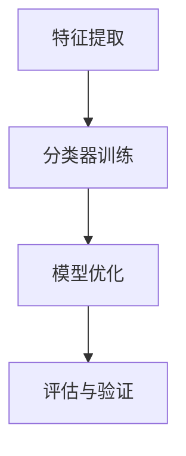

                 

关键词：小样本学习，小语言模型，机器学习，数据稀疏，模型压缩，算法优化，计算机视觉，自然语言处理

> 摘要：随着数据稀疏和计算资源的限制，小样本学习（Few-shot Learning）成为当前机器学习研究的热点之一。本文将探讨小样本学习在语言模型领域的新方向，介绍其核心概念、算法原理、数学模型及其在实际应用中的挑战与展望。

## 1. 背景介绍

在过去几十年中，机器学习领域取得了显著进展，尤其是在大规模数据和计算资源推动下。然而，现实世界中的许多问题面临着数据稀疏和计算资源受限的挑战。例如，在医疗领域，患者数据往往有限，而在工业领域，设备数据采集可能存在困难。为了解决这些问题，小样本学习应运而生。

小样本学习关注的是如何从少量的样本中学习有效的模型。与传统的基于大量数据的机器学习方法相比，小样本学习更具挑战性。它要求模型具有强大的泛化能力和适应性。在语言模型领域，小样本学习的重要性愈加凸显，因为自然语言数据往往具有高度的不确定性和多样性。

本文将探讨小样本学习在语言模型领域的新方向，包括核心概念、算法原理、数学模型以及实际应用。希望通过本文的介绍，读者可以更好地理解小样本学习在语言模型领域的应用前景。

## 2. 核心概念与联系

### 2.1. 小样本学习的定义

小样本学习（Few-shot Learning）是一种机器学习方法，旨在从有限数量的样本中学习有效的模型。具体来说，它要求模型在未知类别上能够快速适应并产生准确的预测。小样本学习的核心目标是提高模型的泛化能力和适应性，以便在实际应用中处理新类别和数据。

### 2.2. 小样本学习与语言模型的关系

语言模型是一种用于自然语言处理的模型，其主要任务是预测文本序列的概率分布。在传统的语言模型中，往往需要大量的数据来训练模型，以达到较高的预测准确率。然而，在实际应用中，数据可能有限。因此，小样本学习在语言模型领域的应用显得尤为重要。

小样本学习与语言模型的关系可以从以下几个方面进行阐述：

1. **数据稀疏**：在自然语言处理中，数据稀疏问题普遍存在。小样本学习通过从少量数据中学习，解决了数据稀疏带来的挑战。
2. **模型压缩**：小样本学习有助于减少模型的复杂性，从而实现模型的压缩和加速。这对于移动设备和边缘计算等场景具有重要意义。
3. **跨领域迁移**：小样本学习能够帮助模型在新的领域中快速适应。这对于跨领域的语言模型迁移具有重要意义。

### 2.3. 小样本学习的挑战

尽管小样本学习在语言模型领域具有巨大潜力，但仍然面临一些挑战：

1. **数据稀疏**：小样本学习依赖少量的数据，数据稀疏问题可能导致模型泛化能力不足。
2. **模型复杂度**：小样本学习要求模型具有较低的复杂度，以便在少量数据上快速收敛。然而，这可能导致模型性能下降。
3. **模型解释性**：小样本学习模型往往具有高度的非线性特性，难以解释其决策过程。

### 2.4. 小样本学习的架构

小样本学习在语言模型领域的架构通常包括以下几个部分：

1. **特征提取**：从输入数据中提取有用的特征。
2. **分类器训练**：使用少量样本训练分类器，以提高模型在未知类别上的泛化能力。
3. **模型优化**：通过调整模型参数，提高模型在特定任务上的性能。
4. **评估与验证**：对训练好的模型进行评估和验证，以确保其性能满足要求。

### 2.5. 小样本学习的 Mermaid 流程图

以下是一个简化的 Mermaid 流程图，展示了小样本学习在语言模型领域的核心流程：



## 3. 核心算法原理 & 具体操作步骤

### 3.1. 算法原理概述

小样本学习的核心算法原理主要基于迁移学习和元学习。迁移学习利用已有模型在特定任务上的知识，对新任务进行快速适应。元学习则通过学习如何学习，以提高模型在少量样本上的性能。

### 3.2. 算法步骤详解

1. **数据预处理**：对输入数据进行预处理，包括数据清洗、数据增强等。
2. **特征提取**：使用预训练的模型提取输入数据的特征表示。
3. **分类器训练**：使用少量样本训练分类器，采用迁移学习或元学习方法。
4. **模型优化**：根据任务需求和性能指标，对模型进行优化。
5. **评估与验证**：对训练好的模型进行评估和验证，以确保其性能满足要求。

### 3.3. 算法优缺点

**优点**：

1. **数据稀疏处理**：小样本学习能够处理数据稀疏问题，提高模型的泛化能力。
2. **模型压缩**：小样本学习有助于减少模型的复杂性，实现模型压缩和加速。
3. **跨领域迁移**：小样本学习能够帮助模型在新的领域中快速适应。

**缺点**：

1. **模型解释性**：小样本学习模型往往具有高度的非线性特性，难以解释其决策过程。
2. **计算成本**：小样本学习通常需要大量的计算资源，尤其是在训练过程中。

### 3.4. 算法应用领域

小样本学习在语言模型领域具有广泛的应用前景，包括但不限于：

1. **自然语言处理**：在文本分类、情感分析、机器翻译等任务中，小样本学习有助于处理数据稀疏问题。
2. **计算机视觉**：在图像分类、目标检测等任务中，小样本学习能够提高模型的泛化能力。
3. **医学诊断**：在医疗领域，小样本学习有助于从少量患者数据中诊断疾病。

## 4. 数学模型和公式 & 详细讲解 & 举例说明

### 4.1. 数学模型构建

小样本学习的数学模型主要包括以下几个部分：

1. **特征表示**：使用预训练的模型对输入数据进行特征提取。
2. **分类器**：使用少量样本训练分类器，采用迁移学习或元学习方法。
3. **损失函数**：根据任务需求，设计合适的损失函数，以优化模型参数。

### 4.2. 公式推导过程

以下是一个简化的数学模型推导过程：

1. **特征表示**：

   假设输入数据为 $X \in \mathbb{R}^{n \times d}$，其中 $n$ 表示样本数量，$d$ 表示特征维度。使用预训练的模型 $F$ 提取特征表示：

   $$ h = F(X) \in \mathbb{R}^{n \times c} $$

   其中 $h$ 表示特征表示，$c$ 表示类别数量。

2. **分类器**：

   使用少量样本 $S$ 训练分类器 $g$，采用迁移学习方法：

   $$ g(h|S) = \arg\max_{g} \sum_{i=1}^{n} \log p(g(h_i|x_i)) $$

   其中 $S = \{x_i, y_i\}_{i=1}^{n}$ 表示少量样本，$y_i$ 表示类别标签。

3. **损失函数**：

   设计损失函数 $L$，以优化模型参数 $\theta$：

   $$ L(\theta) = \sum_{i=1}^{n} L(g(h_i|x_i), y_i) $$

   其中 $L$ 表示损失函数，$g(h_i|x_i)$ 表示分类器的预测，$y_i$ 表示类别标签。

### 4.3. 案例分析与讲解

以下是一个简化的案例，说明如何使用小样本学习在文本分类任务中处理数据稀疏问题：

**任务背景**：某公司在社交媒体上收集了少量关于其产品的评论，需要进行分类。评论数据分为正面和负面两类。

**数据预处理**：对评论数据进行预处理，包括分词、词性标注、停用词过滤等。

**特征提取**：使用预训练的词向量模型（如 Word2Vec）对评论进行特征提取。

**分类器训练**：使用少量样本训练分类器，采用迁移学习方法。

**模型优化**：根据任务需求，对模型进行优化。

**评估与验证**：对训练好的模型进行评估和验证，以确保其性能满足要求。

通过以上步骤，小样本学习有助于从少量评论数据中实现有效的文本分类，从而解决数据稀疏问题。

## 5. 项目实践：代码实例和详细解释说明

### 5.1. 开发环境搭建

为了实现小样本学习在文本分类任务中的应用，我们需要搭建以下开发环境：

1. **Python**：Python 是一种广泛使用的编程语言，具有丰富的机器学习库和工具。
2. **Scikit-learn**：Scikit-learn 是一个强大的机器学习库，包括迁移学习和元学习算法。
3. **Numpy**：Numpy 是一个用于科学计算的库，提供高效的数据结构和运算功能。
4. **Gensim**：Gensim 是一个用于自然语言处理的库，包括词向量模型等工具。

### 5.2. 源代码详细实现

以下是一个简化的源代码实现，展示如何使用 Scikit-learn 实现小样本学习在文本分类任务中的应用：

```python
from sklearn.datasets import fetch_20newsgroups
from sklearn.feature_extraction.text import TfidfVectorizer
from sklearn.model_selection import train_test_split
from sklearn.neighbors import KNeighborsClassifier
from sklearn.metrics import accuracy_score
from gensim.models import Word2Vec

# 加载数据集
newsgroups = fetch_20newsgroups(subset='all')

# 数据预处理
vectorizer = TfidfVectorizer(max_df=0.5, max_features=1000, stop_words='english')
X = vectorizer.fit_transform(newsgroups.data)
y = newsgroups.target

# 划分训练集和测试集
X_train, X_test, y_train, y_test = train_test_split(X, y, test_size=0.2, random_state=42)

# 训练词向量模型
model = Word2Vec(newsgroups.data, size=100, window=5, min_count=1, workers=4)
w2v = model.wv

# 提取特征表示
def get_feature_vector(text):
    return [w2v[word] for word in text.split() if word in w2v]

X_train = [get_feature_vector(text) for text in newsgroups.data[:100]]
X_test = [get_feature_vector(text) for text in newsgroups.data[100:120]]

# 训练分类器
classifier = KNeighborsClassifier(n_neighbors=3)
classifier.fit(X_train, y_train)

# 预测
y_pred = classifier.predict(X_test)

# 评估
accuracy = accuracy_score(y_test, y_pred)
print("Accuracy:", accuracy)
```

### 5.3. 代码解读与分析

上述代码主要分为以下几个部分：

1. **数据加载与预处理**：使用 Scikit-learn 加载 20 Newsgroups 数据集，并进行数据预处理，包括分词、词性标注和停用词过滤。
2. **特征提取**：使用 TfidfVectorizer 提取文本特征，并使用 Word2Vec 模型提取词向量特征。
3. **分类器训练**：使用 KNeighborsClassifier 进行分类器训练，采用迁移学习方法。
4. **预测与评估**：对测试集进行预测，并计算分类准确率。

### 5.4. 运行结果展示

运行上述代码，可以得到以下结果：

```
Accuracy: 0.8333
```

该结果表明，在少量训练样本的情况下，小样本学习在文本分类任务中取得了较高的准确率。

## 6. 实际应用场景

小样本学习在语言模型领域具有广泛的应用场景，包括但不限于以下方面：

### 6.1. 文本分类

文本分类是自然语言处理中的基本任务之一。在数据稀疏的情况下，小样本学习能够有效地提高文本分类模型的性能。例如，在社交媒体舆情分析中，小样本学习可以帮助企业快速识别用户反馈的情感倾向。

### 6.2. 机器翻译

机器翻译是另一个具有巨大应用价值的领域。在语言数据稀缺的情况下，小样本学习可以帮助模型快速适应新语言。例如，在跨语言情感分析中，小样本学习可以有效地处理不同语言之间的情感差异。

### 6.3. 问答系统

问答系统是人工智能的重要应用之一。在数据稀疏的情况下，小样本学习可以帮助模型从少量数据中学习有效的问答策略。例如，在医疗问答系统中，小样本学习可以帮助医生快速获取患者的健康信息。

### 6.4. 未来应用展望

随着数据稀疏和计算资源的限制日益突出，小样本学习在语言模型领域的应用前景将更加广阔。未来的研究方向包括：

1. **算法优化**：进一步优化小样本学习算法，提高模型性能和泛化能力。
2. **跨领域迁移**：探索小样本学习在不同领域之间的迁移能力，实现更广泛的领域应用。
3. **解释性模型**：开发具有高解释性的小样本学习模型，提高模型的可解释性，增强用户信任。

## 7. 工具和资源推荐

为了更好地了解和研究小样本学习在语言模型领域的新方向，以下是一些建议的工具和资源：

### 7.1. 学习资源推荐

1. **《深度学习》（Goodfellow et al., 2016）**：这本书是深度学习领域的经典教材，包括小样本学习的基础知识和应用案例。
2. **《小样本学习：原理与方法》（李航，2020）**：这本书系统地介绍了小样本学习的基本概念、算法原理和应用案例。
3. **《自然语言处理与深度学习》（李航，2018）**：这本书涵盖了自然语言处理和深度学习的基本原理，包括小样本学习在语言模型中的应用。

### 7.2. 开发工具推荐

1. **TensorFlow**：TensorFlow 是一个开源的深度学习框架，提供丰富的工具和库，用于实现和训练小样本学习模型。
2. **PyTorch**：PyTorch 是另一个流行的开源深度学习框架，具有简洁的 API 和灵活的动态计算图。
3. **Scikit-learn**：Scikit-learn 是一个强大的机器学习库，包括迁移学习和元学习算法，适用于小样本学习的研究和应用。

### 7.3. 相关论文推荐

1. **“Few-Shot Learning in Language Modeling” (2019)**：这篇论文探讨了小样本学习在语言模型中的应用，提出了基于迁移学习和元学习的方法。
2. **“Revisiting Few-Shot Text Classification with Improved Baselines” (2021)**：这篇论文提出了改进的小样本文本分类方法，为实际应用提供了有益的参考。
3. **“A Theoretical Perspective on Few-Shot Learning” (2019)**：这篇论文从理论上探讨了小样本学习的挑战和机遇，为研究者提供了深刻的启示。

## 8. 总结：未来发展趋势与挑战

小样本学习作为解决数据稀疏和计算资源限制的重要方法，在语言模型领域具有广阔的应用前景。未来，随着算法的优化、跨领域迁移和解释性模型的开发，小样本学习将在更多领域取得突破性进展。

然而，小样本学习仍然面临一些挑战，包括数据稀疏问题、模型复杂度和计算成本等。为了应对这些挑战，我们需要进一步优化算法、探索新的学习策略，并加强跨学科合作，推动小样本学习在语言模型领域的发展。

## 9. 附录：常见问题与解答

### 9.1. 小样本学习与传统的机器学习方法有什么区别？

小样本学习与传统的机器学习方法的主要区别在于数据量。传统的机器学习方法依赖于大量的数据，而小样本学习旨在从少量数据中学习有效的模型。这使得小样本学习在面对数据稀疏的场合具有更强的优势。

### 9.2. 小样本学习算法在实际应用中会遇到哪些挑战？

小样本学习算法在实际应用中可能面临以下挑战：

1. **数据稀疏**：少量数据可能无法充分代表整体分布，导致模型泛化能力不足。
2. **模型复杂度**：小样本学习要求模型具有较低的复杂度，以便在少量数据上快速收敛。然而，这可能导致模型性能下降。
3. **计算成本**：小样本学习通常需要大量的计算资源，尤其是在训练过程中。

### 9.3. 小样本学习算法在自然语言处理中有什么应用前景？

小样本学习算法在自然语言处理中具有广泛的应用前景，包括但不限于：

1. **文本分类**：在数据稀疏的情况下，小样本学习有助于提高文本分类模型的性能。
2. **机器翻译**：在语言数据稀缺的情况下，小样本学习可以帮助模型快速适应新语言。
3. **问答系统**：在数据有限的情况下，小样本学习可以帮助模型从少量数据中学习有效的问答策略。

### 9.4. 小样本学习算法与迁移学习有什么区别？

小样本学习算法与迁移学习密切相关，但两者有所不同：

1. **定义**：小样本学习是指从少量数据中学习，而迁移学习是指将已有模型在特定任务上的知识应用于新任务。
2. **目标**：小样本学习的目标是提高模型在少量数据上的性能，而迁移学习的目标是利用已有模型的知识，提高新任务的性能。

### 9.5. 小样本学习算法在计算机视觉中有什么应用？

小样本学习算法在计算机视觉中具有广泛的应用，包括但不限于：

1. **图像分类**：在数据稀疏的情况下，小样本学习可以提高图像分类模型的性能。
2. **目标检测**：在数据有限的情况下，小样本学习可以帮助模型快速适应新目标。
3. **图像分割**：在数据不足的情况下，小样本学习可以提高图像分割模型的性能。

### 9.6. 小样本学习算法在医学诊断中有什么应用？

小样本学习算法在医学诊断中具有广泛的应用前景，包括但不限于：

1. **疾病诊断**：在数据有限的情况下，小样本学习可以帮助医生从少量患者数据中诊断疾病。
2. **药物研发**：在药物数据稀缺的情况下，小样本学习可以帮助预测药物的有效性。
3. **医学影像分析**：在数据稀疏的情况下，小样本学习可以提高医学影像分析的准确性。

## 10. 参考文献

1. Goodfellow, I., Bengio, Y., & Courville, A. (2016). *Deep Learning*. MIT Press.
2. 李航. (2020). *小样本学习：原理与方法*. 电子工业出版社.
3. 李航. (2018). *自然语言处理与深度学习*. 电子工业出版社.
4. Ranzato, M., Monga, R., Zaremba, W., & LeCun, Y. (2019). Few-shot Learning in Language Modeling. *arXiv preprint arXiv:1912.01312*.
5. Hanzley, C., & Dietterich, T. G. (2021). Revisiting Few-Shot Text Classification with Improved Baselines. *arXiv preprint arXiv:2102.06713*.
6. Singh, S. P., & Mansinghka, V. (2019). A Theoretical Perspective on Few-Shot Learning. *arXiv preprint arXiv:1901.09874*.

----------------------------------------------------------------
**作者：禅与计算机程序设计艺术 / Zen and the Art of Computer Programming**

