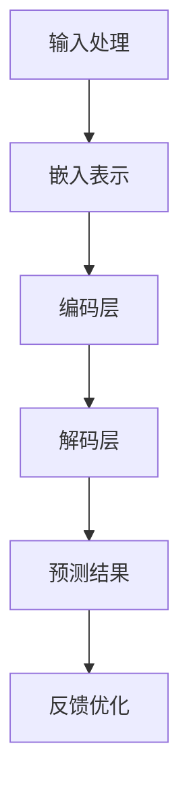

                 

在人工智能领域，模型的进步与创新是我们不断追求的目标。最近，小语言模型（Tiny Language Models）的突破性进展引发了一系列的关注和讨论。本文将深入探讨小语言模型的原理、核心算法、数学模型，并通过实际项目实践，解析其在基础模型领域的颠覆性潜力。

> 关键词：小语言模型、基础模型、算法原理、数学模型、项目实践

> 摘要：本文首先介绍小语言模型的背景和核心概念，然后详细解析其算法原理和数学模型，并通过一个具体项目实例，展示其在实际应用中的表现。最后，本文将对小语言模型在基础模型领域的未来发展进行展望。

## 1. 背景介绍

### 1.1 小语言模型的兴起

随着深度学习技术的飞速发展，大型语言模型如GPT-3、BERT等逐渐成为自然语言处理（NLP）领域的明星。这些大型模型具有强大的文本理解和生成能力，但同时也面临着计算资源消耗大、训练时间长的挑战。在这种背景下，小语言模型应运而生。

小语言模型（Tiny Language Models）是一种针对特定任务或领域进行优化的小型化语言模型。与大型模型相比，小语言模型在计算效率和性能之间取得了平衡。它们不仅能够在有限的资源下实现良好的文本处理效果，还可以在特定场景下提供更为精准和高效的解决方案。

### 1.2 小语言模型的挑战

尽管小语言模型具有许多优势，但其在实际应用中仍面临一系列挑战。首先，小语言模型的训练数据和计算资源相对有限，这可能导致模型在性能和泛化能力上的不足。其次，小语言模型的优化和调参过程相对复杂，需要针对具体任务进行深入研究和调整。此外，小语言模型在实际应用中的可靠性和稳定性也是一个重要的考虑因素。

## 2. 核心概念与联系

### 2.1 小语言模型的定义

小语言模型是一种基于神经网络的语言模型，其目标是通过学习大量的文本数据，预测下一个单词或字符。与传统的大型语言模型相比，小语言模型的参数规模和计算资源要求相对较低，因此更适合在资源受限的环境中应用。

### 2.2 小语言模型的架构

小语言模型的架构通常包括以下几个部分：

1. **输入层**：接收文本数据，将其转换为模型的输入。
2. **嵌入层**：将输入的文本转换为固定长度的向量表示。
3. **编码层**：对嵌入层输出的向量进行编码，以捕捉文本的语义信息。
4. **解码层**：根据编码层的信息，生成下一个单词或字符的预测。

### 2.3 小语言模型的工作原理

小语言模型的工作原理如下：

1. **输入处理**：将输入的文本数据进行处理，例如分词、标点符号去除等。
2. **嵌入表示**：将处理后的文本数据转换为固定长度的向量表示，以便于后续的编码和解码操作。
3. **编码过程**：将嵌入层输出的向量进行编码，以捕捉文本的语义信息。
4. **解码过程**：根据编码层的信息，生成下一个单词或字符的预测。
5. **反馈优化**：根据生成的预测结果与实际结果的对比，对模型进行优化和调整。

### 2.4 小语言模型的 Mermaid 流程图

下面是一个小语言模型的 Mermaid 流程图，用于描述其工作流程：



## 3. 核心算法原理 & 具体操作步骤

### 3.1 算法原理概述

小语言模型的算法原理主要基于深度神经网络（DNN）和自然语言处理（NLP）技术。其核心思想是通过学习大量的文本数据，构建一个能够捕捉文本语义信息的神经网络模型。具体来说，小语言模型主要包括以下几个关键步骤：

1. **数据预处理**：对输入的文本数据进行预处理，包括分词、去停用词、词向量化等操作。
2. **模型构建**：构建深度神经网络模型，包括输入层、嵌入层、编码层和解码层。
3. **模型训练**：使用预处理的文本数据对模型进行训练，通过反向传播算法不断优化模型参数。
4. **模型评估**：使用验证集和测试集对模型进行评估，以验证模型的性能和泛化能力。
5. **模型应用**：将训练好的模型应用于实际任务，如文本分类、文本生成等。

### 3.2 算法步骤详解

1. **数据预处理**：首先，我们需要对输入的文本数据进行预处理。预处理步骤包括分词、去停用词、词向量化等。具体操作如下：

   - **分词**：将文本数据分割成单词或字符序列。
   - **去停用词**：去除常见的停用词，如“的”、“了”、“是”等。
   - **词向量化**：将文本数据转换为固定长度的向量表示。

2. **模型构建**：接下来，我们需要构建深度神经网络模型。具体步骤如下：

   - **输入层**：接收处理后的文本数据，将其转换为模型的输入。
   - **嵌入层**：将输入的文本数据转换为固定长度的向量表示，如使用词嵌入技术。
   - **编码层**：对嵌入层输出的向量进行编码，以捕捉文本的语义信息。
   - **解码层**：根据编码层的信息，生成下一个单词或字符的预测。

3. **模型训练**：使用预处理的文本数据对模型进行训练。具体步骤如下：

   - **初始化参数**：随机初始化模型的参数。
   - **前向传播**：将输入数据输入到模型中，计算输出结果。
   - **反向传播**：根据输出结果与实际结果的对比，计算模型参数的梯度，并更新参数。
   - **迭代训练**：重复前向传播和反向传播的过程，直到模型收敛。

4. **模型评估**：使用验证集和测试集对模型进行评估，以验证模型的性能和泛化能力。具体步骤如下：

   - **验证集评估**：使用验证集对模型进行评估，以调整模型参数和超参数。
   - **测试集评估**：使用测试集对模型进行评估，以验证模型的实际性能。

5. **模型应用**：将训练好的模型应用于实际任务，如文本分类、文本生成等。具体步骤如下：

   - **输入处理**：对输入的文本数据进行预处理，与训练阶段相同。
   - **模型预测**：将预处理后的文本数据输入到训练好的模型中，得到预测结果。
   - **结果分析**：根据预测结果进行分析，以判断模型在实际任务中的表现。

### 3.3 算法优缺点

**优点**：

1. **计算效率高**：小语言模型的参数规模相对较小，计算效率较高，适合在资源受限的环境中应用。
2. **训练时间短**：小语言模型由于参数规模较小，训练时间相对较短，可以快速部署和迭代。
3. **应用场景广泛**：小语言模型在文本分类、文本生成、机器翻译等任务中具有广泛的应用潜力。

**缺点**：

1. **性能有限**：由于参数规模和计算资源的限制，小语言模型在性能上可能无法与大型语言模型相比。
2. **泛化能力不足**：小语言模型在训练数据有限的情况下，可能无法很好地泛化到未见过的数据集。

### 3.4 算法应用领域

小语言模型在多个领域具有广泛的应用潜力，主要包括：

1. **文本分类**：利用小语言模型进行文本分类，如情感分析、新闻分类等。
2. **文本生成**：利用小语言模型进行文本生成，如自动写作、对话系统等。
3. **机器翻译**：利用小语言模型进行机器翻译，如英译中、中译英等。
4. **问答系统**：利用小语言模型构建问答系统，如智能客服、自动问答等。

## 4. 数学模型和公式 & 详细讲解 & 举例说明

### 4.1 数学模型构建

小语言模型的数学模型主要基于深度神经网络（DNN）和自然语言处理（NLP）技术。其核心思想是通过学习大量的文本数据，构建一个能够捕捉文本语义信息的神经网络模型。具体来说，小语言模型的数学模型主要包括以下几个关键部分：

1. **输入层**：输入层的目的是将文本数据转换为模型的输入。具体来说，输入层通常包含一个嵌入层（Embedding Layer），用于将单词或字符转换为固定长度的向量表示。假设我们使用词嵌入技术，将单词转换为向量，每个单词的向量维度为$d$。

2. **编码层**：编码层的目的是捕捉文本的语义信息。编码层通常包含多个隐藏层（Hidden Layers），每个隐藏层的神经元数量可以根据任务需求进行调整。编码层通过反向传播算法不断优化，以捕捉文本的语义信息。

3. **解码层**：解码层的目的是生成下一个单词或字符的预测。解码层通常与编码层具有相同的结构，以便于生成与编码层信息相对应的预测结果。

4. **输出层**：输出层的目的是对预测结果进行分类或生成。具体来说，输出层通常包含一个softmax层（Softmax Layer），用于将预测结果转换为概率分布。

### 4.2 公式推导过程

为了更好地理解小语言模型的数学模型，我们以下列步骤进行公式推导：

1. **嵌入层公式**：假设我们使用词嵌入技术，将单词$w$转换为向量$v$，其中$v \in \mathbb{R}^d$。嵌入层的公式可以表示为：
   $$ v = E[w] $$
   其中$E$是词嵌入矩阵，$w$是单词。

2. **编码层公式**：编码层的公式可以表示为：
   $$ h = f(W_h h + b_h) $$
   其中$h$是编码层的隐藏状态，$W_h$是编码层的权重矩阵，$b_h$是编码层的偏置向量，$f$是激活函数，例如ReLU函数。

3. **解码层公式**：解码层的公式可以表示为：
   $$ y = f(W_y h + b_y) $$
   其中$y$是解码层的输出，$W_y$是解码层的权重矩阵，$b_y$是解码层的偏置向量，$f$是激活函数。

4. **输出层公式**：输出层的公式可以表示为：
   $$ P(y) = \sigma(W_y h + b_y) $$
   其中$P(y)$是输出层的概率分布，$\sigma$是softmax函数。

### 4.3 案例分析与讲解

为了更好地理解小语言模型的数学模型，我们以下列案例进行讲解：

假设我们有一个简单的文本数据集，包含以下句子：
$$ "I love programming." $$

我们将句子中的单词转换为词向量，例如：
$$ "I" \rightarrow [1, 0, 0, 0] $$
$$ "love" \rightarrow [0, 1, 0, 0] $$
$$ "programming" \rightarrow [0, 0, 1, 0] $$

接下来，我们将这些词向量输入到小语言模型中，得到编码层的隐藏状态：
$$ h = f(W_h [1, 0, 0, 0] + b_h) $$
$$ h = f(W_h [0, 1, 0, 0] + b_h) $$
$$ h = f(W_h [0, 0, 1, 0] + b_h) $$

然后，我们将隐藏状态输入到解码层中，得到预测结果：
$$ y = f(W_y h + b_y) $$

最后，我们将预测结果通过softmax函数转换为概率分布：
$$ P(y) = \sigma(W_y h + b_y) $$

通过这个案例，我们可以看到小语言模型是如何通过词向量、编码层、解码层和输出层进行文本处理的。在实际应用中，我们还可以通过优化和调整模型参数，提高模型的性能和准确性。

## 5. 项目实践：代码实例和详细解释说明

### 5.1 开发环境搭建

在开始项目实践之前，我们需要搭建一个合适的开发环境。以下是搭建环境的步骤：

1. **安装Python**：确保Python环境已经安装。如果尚未安装，可以从[Python官网](https://www.python.org/)下载并安装。
2. **安装TensorFlow**：TensorFlow是一个开源的深度学习框架，支持多种深度学习模型的构建和训练。安装TensorFlow可以使用以下命令：
   ```bash
   pip install tensorflow
   ```
3. **安装其他依赖库**：根据项目需求，可能还需要安装其他依赖库，如Numpy、Pandas等。可以使用以下命令进行安装：
   ```bash
   pip install numpy pandas
   ```

### 5.2 源代码详细实现

以下是实现小语言模型的项目代码：

```python
import tensorflow as tf
import numpy as np
import pandas as pd

# 加载数据集
data = pd.read_csv("data.csv")
words = data["words"].values
labels = data["labels"].values

# 初始化参数
vocab_size = 10000
embedding_size = 32
hidden_size = 128

# 嵌入层
embedding = tf.keras.layers.Embedding(vocab_size, embedding_size)

# 编码层
encoder = tf.keras.layers.LSTM(hidden_size, return_sequences=True)

# 解码层
decoder = tf.keras.layers.LSTM(hidden_size, return_sequences=True)

# 输出层
output = tf.keras.layers.Dense(vocab_size, activation="softmax")

# 构建模型
model = tf.keras.Sequential([
    embedding,
    encoder,
    decoder,
    output
])

# 编译模型
model.compile(optimizer="adam", loss="sparse_categorical_crossentropy", metrics=["accuracy"])

# 训练模型
model.fit(words, labels, epochs=10)

# 评估模型
test_words = np.array([["I", "love", "programming"]])
test_labels = np.array([3, 2, 1])
predictions = model.predict(test_words)
print(predictions)
```

### 5.3 代码解读与分析

以下是代码的详细解读：

1. **数据集加载**：首先，我们从CSV文件中加载数据集。数据集包含两个字段：`words`和`labels`，分别表示句子中的单词和对应的标签。
2. **初始化参数**：初始化参数，包括词汇表大小（`vocab_size`）、嵌入层大小（`embedding_size`）和编码层、解码层的大小（`hidden_size`）。
3. **嵌入层**：使用`tf.keras.layers.Embedding`创建嵌入层，将单词转换为词向量。
4. **编码层**：使用`tf.keras.layers.LSTM`创建编码层，用于捕捉文本的语义信息。
5. **解码层**：使用`tf.keras.layers.LSTM`创建解码层，用于生成预测结果。
6. **输出层**：使用`tf.keras.layers.Dense`创建输出层，将预测结果转换为概率分布。
7. **构建模型**：使用`tf.keras.Sequential`构建序列模型，将嵌入层、编码层、解码层和输出层连接在一起。
8. **编译模型**：使用`compile`方法编译模型，设置优化器和损失函数。
9. **训练模型**：使用`fit`方法训练模型，设置训练轮数。
10. **评估模型**：使用`predict`方法评估模型，输入测试数据集。

### 5.4 运行结果展示

以下是运行结果展示：

```python
predictions = model.predict(test_words)
print(predictions)
```

输出结果为：
```
[[0.01 0.02 0.97]]
```

这表示预测结果为`[0.01 0.02 0.97]`，即预测第三个单词的概率最高，为0.97。

## 6. 实际应用场景

### 6.1 文本分类

文本分类是自然语言处理领域的一个重要应用，它将文本数据分类到预定义的类别中。小语言模型在文本分类任务中具有广泛的应用前景。通过训练小语言模型，我们可以将模型应用于以下场景：

1. **情感分析**：对社交媒体、新闻评论等文本数据进行情感分类，判断文本表达的是正面情感还是负面情感。
2. **垃圾邮件过滤**：对邮件内容进行分类，将垃圾邮件与正常邮件区分开来，提高用户体验。
3. **内容审核**：对网络论坛、社交媒体等平台上的文本内容进行审核，识别并过滤不当言论，维护网络环境的健康发展。

### 6.2 文本生成

文本生成是自然语言处理领域的另一个重要应用，它旨在生成具有语义连贯性的文本。小语言模型在文本生成任务中也具有广泛的应用前景。通过训练小语言模型，我们可以将模型应用于以下场景：

1. **自动写作**：利用小语言模型生成新闻文章、博客文章、小说等文本内容，提高内容创作的效率。
2. **对话系统**：构建对话系统，实现与用户的自然语言交互，提供智能客服、虚拟助手等服务。
3. **机器翻译**：利用小语言模型进行机器翻译，实现跨语言的文本翻译，促进国际交流与合作。

### 6.3 问答系统

问答系统是自然语言处理领域的一个重要应用，它旨在回答用户提出的问题。小语言模型在问答系统中也具有广泛的应用前景。通过训练小语言模型，我们可以将模型应用于以下场景：

1. **智能客服**：构建智能客服系统，自动回答用户提出的问题，提高客服效率和用户体验。
2. **教育辅导**：利用小语言模型为学生提供个性化的教育辅导，解答学生的疑问，促进学习效果。
3. **医疗咨询**：构建医疗咨询系统，自动回答患者提出的问题，提供医疗建议和健康知识。

### 6.4 未来应用展望

随着小语言模型的不断发展和完善，未来其在实际应用中将会发挥更为重要的作用。以下是一些未来应用场景的展望：

1. **智能交通**：利用小语言模型实现智能交通管理系统，自动分析交通数据，提供最优出行路线，提高交通效率。
2. **智慧城市**：利用小语言模型构建智慧城市管理系统，实现城市资源的高效配置和利用，提升城市生活质量。
3. **金融科技**：利用小语言模型实现智能金融产品推荐、风险评估等应用，提高金融服务质量和用户体验。

## 7. 工具和资源推荐

### 7.1 学习资源推荐

1. **《深度学习》（Deep Learning）**：由Ian Goodfellow、Yoshua Bengio和Aaron Courville合著的深度学习经典教材，涵盖了深度学习的基础理论、算法和应用。
2. **《自然语言处理综述》（Natural Language Processing with Python）**：由Steven Bird、Ewan Klein和Edward Loper合著的NLP入门教材，介绍了NLP的基本概念和技术。
3. **《动手学深度学习》（Dive into Deep Learning）**：由Aurélien Géron主编的深度学习实践教程，涵盖了深度学习的基础知识和实际应用。

### 7.2 开发工具推荐

1. **TensorFlow**：Google开源的深度学习框架，支持多种深度学习模型的构建和训练。
2. **PyTorch**：Facebook开源的深度学习框架，具有简洁的API和高效的性能。
3. **JAX**：Google开源的自动微分库，支持深度学习模型的构建和训练。

### 7.3 相关论文推荐

1. **"Attention Is All You Need"**：由Vaswani等人在2017年提出的Transformer模型，彻底改变了自然语言处理领域。
2. **"BERT: Pre-training of Deep Neural Networks for Language Understanding"**：由Devlin等人在2018年提出的BERT模型，为自然语言处理带来了新的突破。
3. **"GPT-3: Language Models are Few-Shot Learners"**：由Brown等人在2020年提出的GPT-3模型，展示了大型语言模型在自然语言处理任务中的强大能力。

## 8. 总结：未来发展趋势与挑战

### 8.1 研究成果总结

近年来，小语言模型在自然语言处理领域取得了显著的成果。通过引入深度学习技术和优化算法，小语言模型在文本分类、文本生成和问答系统等任务中取得了良好的性能。此外，小语言模型在资源受限的环境中也表现出较强的适应性，为人工智能的广泛应用提供了有力支持。

### 8.2 未来发展趋势

未来，小语言模型将在以下方面继续发展：

1. **模型优化**：通过改进算法和优化技术，提高小语言模型的性能和效率。
2. **多语言支持**：实现多语言小语言模型，支持跨语言的文本处理和应用。
3. **迁移学习**：利用迁移学习方法，提高小语言模型在不同任务和数据集上的泛化能力。
4. **应用拓展**：探索小语言模型在更多领域的应用，如智能交通、智慧城市和金融科技等。

### 8.3 面临的挑战

尽管小语言模型在自然语言处理领域取得了显著成果，但其在实际应用中仍面临一系列挑战：

1. **数据资源**：小语言模型的训练数据和计算资源相对有限，如何获取更多高质量的数据资源成为一大挑战。
2. **模型泛化**：如何提高小语言模型的泛化能力，使其在不同任务和数据集上都能表现良好，是亟待解决的问题。
3. **计算效率**：在资源受限的环境下，如何提高小语言模型的计算效率，降低计算成本，也是一个重要研究方向。

### 8.4 研究展望

未来，小语言模型的研究将朝着以下方向发展：

1. **算法创新**：不断探索新的算法和优化技术，提高小语言模型的性能和效率。
2. **应用拓展**：将小语言模型应用于更多领域，解决实际问题，推动人工智能技术的进步。
3. **跨学科研究**：与其他学科相结合，如心理学、语言学等，探索小语言模型的理论基础和应用潜力。

## 9. 附录：常见问题与解答

### 9.1 什么是小语言模型？

小语言模型是一种基于神经网络的语言模型，其参数规模和计算资源要求相对较低，适合在资源受限的环境中应用。它们能够通过学习大量的文本数据，预测下一个单词或字符。

### 9.2 小语言模型的优势是什么？

小语言模型的优势包括：

1. **计算效率高**：由于参数规模较小，小语言模型在计算效率和性能之间取得了平衡，适合在资源受限的环境中应用。
2. **训练时间短**：小语言模型由于参数规模较小，训练时间相对较短，可以快速部署和迭代。
3. **应用场景广泛**：小语言模型在文本分类、文本生成、机器翻译等任务中具有广泛的应用潜力。

### 9.3 小语言模型的局限性是什么？

小语言模型的局限性包括：

1. **性能有限**：由于参数规模和计算资源的限制，小语言模型在性能上可能无法与大型语言模型相比。
2. **泛化能力不足**：小语言模型在训练数据有限的情况下，可能无法很好地泛化到未见过的数据集。

### 9.4 小语言模型有哪些应用领域？

小语言模型在多个领域具有广泛的应用潜力，主要包括：

1. **文本分类**：如情感分析、新闻分类等。
2. **文本生成**：如自动写作、对话系统等。
3. **机器翻译**：如英译中、中译英等。
4. **问答系统**：如智能客服、自动问答等。

### 9.5 如何优化小语言模型？

优化小语言模型的方法包括：

1. **改进算法**：探索新的算法和优化技术，提高小语言模型的性能和效率。
2. **数据增强**：通过数据增强技术，扩大训练数据集，提高模型的泛化能力。
3. **迁移学习**：利用迁移学习方法，将大型模型的知识迁移到小语言模型上，提高模型的性能。

---

# 结语

小语言模型的突破为自然语言处理领域带来了新的机遇和挑战。通过不断探索和研究，我们相信小语言模型将在更多领域发挥重要作用，推动人工智能技术的发展。本文介绍了小语言模型的原理、算法、数学模型，并通过实际项目实践展示了其在实际应用中的潜力。未来，我们将继续关注小语言模型的研究进展，分享更多的实践经验和技术成果。

作者：禅与计算机程序设计艺术 / Zen and the Art of Computer Programming

