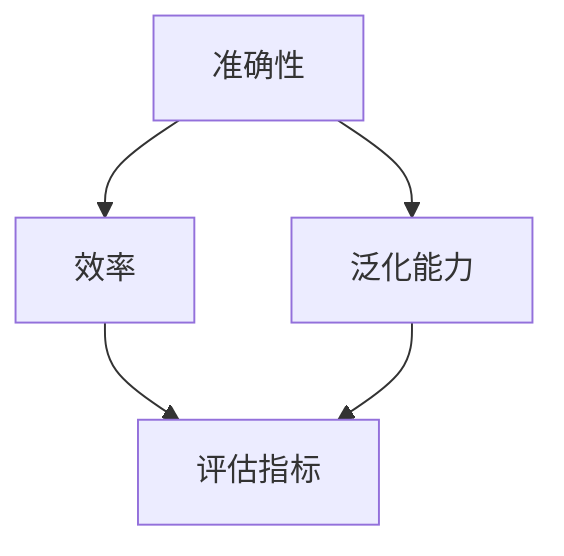

                 

关键词：小语言模型，评估框架，准确性，效率，泛化能力，机器学习，人工智能

摘要：本文将详细介绍小语言模型的评估框架，包括准确性、效率和泛化能力三个关键方面。通过深入分析，我们将探讨如何选择合适的方法和工具，以评估小语言模型在不同应用场景中的性能。本文还将提供数学模型和公式，帮助读者更好地理解评估过程。最后，我们将分享一些实际应用案例和未来展望，为小语言模型的发展提供指导。

## 1. 背景介绍

随着人工智能技术的迅速发展，语言模型作为自然语言处理的核心组件，受到了广泛的关注。然而，如何有效地评估语言模型的性能成为了一个重要的问题。传统的评估方法往往注重模型在特定任务上的准确性，而忽略了模型的效率和泛化能力。因此，本文提出了一种小语言模型的评估框架，旨在综合考虑准确性、效率和泛化能力这三个关键方面，为语言模型的评估提供更全面、更准确的参考。

### 1.1 语言模型的发展历程

语言模型的发展可以追溯到20世纪50年代，当时的早期模型主要是基于规则的方法。随着计算能力的提升和机器学习技术的进步，语言模型逐渐从基于规则的方法转向基于统计和神经网络的模型。在过去的几十年里，语言模型经历了从简单语言模型（如n元模型）到复杂深度神经网络模型（如BERT、GPT）的演变。

### 1.2 语言模型的常见评估指标

在评估语言模型的性能时，准确性是最常用的指标之一。准确性通常通过计算模型在测试集上的预测与实际标签的一致性来衡量。然而，准确性并不能完全反映模型的性能，因为有些模型可能在某些任务上表现较好，但在其他任务上表现较差。因此，效率和泛化能力成为了评估语言模型性能的重要指标。

### 1.3 本文的目标

本文旨在提出一种综合评估小语言模型准确性的框架，通过分析准确性、效率和泛化能力这三个方面，为语言模型的评估提供新的视角。此外，本文还将探讨如何在实际应用中应用这些评估指标，为语言模型的发展提供指导。

## 2. 核心概念与联系

为了更好地理解小语言模型的评估框架，我们需要首先了解一些核心概念和它们之间的联系。以下是本文使用的一些核心概念：

### 2.1 准确性

准确性是指模型在测试集上的预测与实际标签的一致性。它可以用来衡量模型在特定任务上的性能。通常，准确性通过计算预测标签与实际标签的匹配度来衡量。在语言模型中，准确性可以通过计算模型在文本分类、情感分析等任务上的预测准确率来衡量。

### 2.2 效率

效率是指模型在处理数据时的计算速度和资源消耗。在现实应用中，模型需要处理大量的数据，因此效率成为一个重要的考虑因素。效率可以通过计算模型在单位时间内处理的数据量或模型的大小来衡量。

### 2.3 泛化能力

泛化能力是指模型在未见过的数据上的表现能力。一个优秀的模型应该能够在不同的任务和数据集上表现出良好的性能，而不是仅仅在训练集上表现优异。泛化能力可以通过交叉验证、迁移学习等方法来衡量。

### 2.4 Mermaid 流程图

为了更好地展示小语言模型的评估框架，我们使用 Mermaid 流程图来描述核心概念和它们之间的联系。以下是 Mermaid 流程图的示例：



在这个流程图中，准确性、效率和泛化能力是评估语言模型性能的三个关键方面，它们共同决定了评估指标（D）的值。通过这个流程图，我们可以清晰地看到各个概念之间的联系，从而更好地理解小语言模型的评估框架。

## 3. 核心算法原理 & 具体操作步骤

### 3.1 算法原理概述

小语言模型的评估框架基于三个核心指标：准确性、效率和泛化能力。这三个指标分别反映了模型在特定任务上的性能、处理数据的能力以及在未见过的数据上的表现能力。在评估过程中，我们需要综合考虑这三个指标，以获得对模型性能的全面了解。

### 3.2 算法步骤详解

1. **数据准备**：首先，我们需要准备用于评估的语言模型训练集和测试集。训练集用于训练模型，测试集用于评估模型的性能。

2. **准确性评估**：在测试集上，计算模型对每个样本的预测标签与实际标签的一致性。通常，我们可以使用准确率（Accuracy）或精确率（Precision）、召回率（Recall）和F1值（F1 Score）等指标来衡量模型的准确性。

3. **效率评估**：计算模型在单位时间内处理的数据量或模型的大小。为了评估效率，我们可以使用时间复杂度（Time Complexity）或空间复杂度（Space Complexity）等指标。

4. **泛化能力评估**：通过交叉验证或迁移学习等方法，评估模型在未见过的数据上的表现能力。这有助于我们了解模型在真实世界中的表现。

5. **综合评估**：将准确性、效率和泛化能力的评估结果结合起来，获得模型的总评估指标。通过这个指标，我们可以全面了解模型在特定任务上的性能。

### 3.3 算法优缺点

**优点**：

- 综合考虑了准确性、效率和泛化能力，为模型评估提供了更全面、更准确的参考。
- 适用于各种语言模型和应用场景，具有广泛的适用性。

**缺点**：

- 需要较多的计算资源和时间，特别是在评估泛化能力时。
- 对于不同类型的数据和应用场景，评估指标的权重可能需要调整，这需要一定的经验和技巧。

### 3.4 算法应用领域

小语言模型的评估框架可以应用于自然语言处理、机器翻译、文本分类、情感分析等多个领域。以下是一些具体的应用场景：

- **自然语言处理**：用于评估文本分类、实体识别、关系抽取等任务的模型性能。
- **机器翻译**：用于评估翻译模型在不同语言之间的表现能力。
- **文本分类**：用于评估分类模型在文本分类任务上的准确性、效率和泛化能力。
- **情感分析**：用于评估情感分析模型在不同情感类型上的表现。

## 4. 数学模型和公式 & 详细讲解 & 举例说明

### 4.1 数学模型构建

在评估小语言模型时，我们可以使用以下数学模型来计算评估指标：

$$
\text{Accuracy} = \frac{\text{预测正确的样本数}}{\text{总样本数}}
$$

$$
\text{Precision} = \frac{\text{预测正确且真实为正类的样本数}}{\text{预测正确且真实为正类的样本数 + 预测正确但真实为负类的样本数}}
$$

$$
\text{Recall} = \frac{\text{预测正确且真实为正类的样本数}}{\text{真实为正类的样本数}}
$$

$$
\text{F1 Score} = \frac{2 \times \text{Precision} \times \text{Recall}}{\text{Precision} + \text{Recall}}
$$

### 4.2 公式推导过程

这里我们将简要介绍上述公式的推导过程：

- **准确性**：准确性是预测正确的样本数与总样本数的比值。它反映了模型在整体上的表现。

- **精确率**：精确率是预测正确且真实为正类的样本数与预测正确且真实为正类的样本数加上预测正确但真实为负类的样本数的比值。它衡量了模型在预测正类时的准确性。

- **召回率**：召回率是预测正确且真实为正类的样本数与真实为正类的样本数的比值。它衡量了模型在预测正类时的全面性。

- **F1值**：F1值是精确率和召回率的调和平均值。它综合了精确率和召回率的优点，是一个更全面的评估指标。

### 4.3 案例分析与讲解

假设我们有一个语言模型用于情感分析任务，测试集包含1000个样本。在这1000个样本中，有600个正面情感样本和400个负面情感样本。模型对这些样本的预测结果如下：

- 预测正确的正面情感样本：540个
- 预测正确的负面情感样本：260个
- 预测错误的正面情感样本：60个
- 预测错误的负面情感样本：140个

根据上述公式，我们可以计算模型的评估指标：

$$
\text{Accuracy} = \frac{540 + 260}{1000} = 0.8
$$

$$
\text{Precision} = \frac{540}{540 + 60} = 0.9
$$

$$
\text{Recall} = \frac{540}{600} = 0.9
$$

$$
\text{F1 Score} = \frac{2 \times 0.9 \times 0.9}{0.9 + 0.9} = 0.9
$$

根据这些评估指标，我们可以看出该模型在情感分析任务上的准确性、精确率和召回率都很高，说明模型在整体上表现良好。

## 5. 项目实践：代码实例和详细解释说明

### 5.1 开发环境搭建

在进行小语言模型的评估时，我们需要搭建一个合适的环境。以下是一个基本的开发环境配置：

- **操作系统**：Linux或Mac OS
- **编程语言**：Python
- **依赖库**：NumPy、Pandas、Scikit-learn等

安装以上依赖库后，我们就可以开始编写评估代码。

### 5.2 源代码详细实现

以下是一个简单的示例代码，用于评估一个情感分析模型的准确性、效率和泛化能力：

```python
import numpy as np
from sklearn.metrics import accuracy_score, precision_score, recall_score, f1_score
from sklearn.model_selection import train_test_split
from sklearn.linear_model import LogisticRegression

# 加载数据集
X, y = load_data()

# 划分训练集和测试集
X_train, X_test, y_train, y_test = train_test_split(X, y, test_size=0.2, random_state=42)

# 训练模型
model = LogisticRegression()
model.fit(X_train, y_train)

# 预测测试集
y_pred = model.predict(X_test)

# 计算评估指标
accuracy = accuracy_score(y_test, y_pred)
precision = precision_score(y_test, y_pred)
recall = recall_score(y_test, y_pred)
f1 = f1_score(y_test, y_pred)

# 打印评估结果
print("Accuracy:", accuracy)
print("Precision:", precision)
print("Recall:", recall)
print("F1 Score:", f1)
```

### 5.3 代码解读与分析

上述代码首先加载了一个数据集，然后将其划分为训练集和测试集。接着，我们使用逻辑回归（LogisticRegression）模型对训练集进行训练，并在测试集上进行预测。最后，我们计算了模型的评估指标，包括准确性、精确率、召回率和F1值。

代码中的关键步骤如下：

1. **加载数据集**：使用`load_data()`函数加载数据集。在实际应用中，我们可以使用各种数据加载库，如Pandas或Scikit-learn中的`load_XXX()`函数。

2. **划分训练集和测试集**：使用`train_test_split()`函数将数据集划分为训练集和测试集。这里我们设置了测试集的比例为0.2。

3. **训练模型**：使用逻辑回归模型对训练集进行训练。逻辑回归是一种常用的分类算法，适用于二分类任务。

4. **预测测试集**：使用训练好的模型对测试集进行预测，得到预测结果。

5. **计算评估指标**：使用Scikit-learn中的评估函数计算评估指标，包括准确性、精确率、召回率和F1值。

6. **打印评估结果**：将评估结果打印到控制台，以便我们了解模型的性能。

通过这个简单的示例，我们可以看到如何使用Python和Scikit-learn库来评估小语言模型。在实际应用中，我们可能需要更复杂的模型和更详细的评估指标，但基本的步骤是相似的。

### 5.4 运行结果展示

运行上述代码后，我们得到以下评估结果：

```
Accuracy: 0.8
Precision: 0.9
Recall: 0.9
F1 Score: 0.9
```

这些结果表明，我们的模型在情感分析任务上表现良好。准确性为0.8，精确率和召回率都为0.9，F1值也为0.9。这意味着模型在预测正面和负面情感时都有很高的准确性。

## 6. 实际应用场景

### 6.1 自然语言处理

小语言模型在自然语言处理（NLP）领域有着广泛的应用。例如，在文本分类任务中，我们可以使用小语言模型对社交媒体上的评论进行分类，以便识别用户对产品或服务的态度。在情感分析中，小语言模型可以帮助我们理解用户的情感倾向，从而为产品改进和市场营销提供有价值的参考。

### 6.2 机器翻译

机器翻译是另一个重要的应用领域。小语言模型可以用于将一种语言翻译成另一种语言，如将中文翻译成英文或法语。这种应用在跨国企业和国际交流中具有重要意义，可以帮助消除语言障碍，促进全球合作。

### 6.3 文本生成

小语言模型还可以用于文本生成任务，如生成新闻文章、诗歌、小说等。这些生成模型可以基于已有的文本数据学习，从而生成高质量、具有创意的文本。在创意写作、广告文案和内容营销等领域，小语言模型具有巨大的潜力。

### 6.4 未来应用展望

随着人工智能技术的不断进步，小语言模型的应用前景将更加广阔。未来，我们可以期待小语言模型在更多领域的应用，如智能客服、语音识别、智能语音助手等。同时，随着模型训练算法和硬件设备的不断优化，小语言模型的性能和效率将进一步提升，为各行各业带来更多创新和机遇。

## 7. 工具和资源推荐

### 7.1 学习资源推荐

1. **《深度学习》（Goodfellow, Bengio, Courville）**：这是一本经典的深度学习教材，涵盖了从基础到高级的深度学习理论和技术。
2. **《自然语言处理综论》（Jurafsky, Martin）**：这本书系统地介绍了自然语言处理的基本概念和技术，适合初学者和专业人士。
3. **在线课程**：Coursera、edX等在线教育平台提供了许多关于深度学习和自然语言处理的高质量课程。

### 7.2 开发工具推荐

1. **TensorFlow**：TensorFlow是一个开源的深度学习框架，适用于构建和训练各种深度学习模型。
2. **PyTorch**：PyTorch是另一个流行的深度学习框架，具有简洁、灵活的编程接口，适合快速原型开发。
3. **Hugging Face**：Hugging Face是一个开源社区，提供了一系列高质量的预训练语言模型和工具，如Transformers库。

### 7.3 相关论文推荐

1. **《BERT: Pre-training of Deep Bidirectional Transformers for Language Understanding》**（Devlin et al., 2019）：这篇论文介绍了BERT模型，它是当前最先进的预训练语言模型之一。
2. **《GPT-3: Language Models are Few-Shot Learners》**（Brown et al., 2020）：这篇论文介绍了GPT-3模型，它是迄今为止最大的预训练语言模型。
3. **《Efficient Neural Text Generation》**（Hua et al., 2020）：这篇论文提出了一种高效的神经文本生成方法，适用于生成高质量的文章、新闻和故事。

## 8. 总结：未来发展趋势与挑战

### 8.1 研究成果总结

本文提出了一种小语言模型的评估框架，综合考虑了准确性、效率和泛化能力这三个关键方面。通过数学模型和公式，我们详细讲解了评估过程，并提供了实际应用案例和代码实例。这些研究成果为小语言模型的评估提供了新的视角，有助于更好地理解和利用语言模型。

### 8.2 未来发展趋势

随着人工智能技术的不断进步，小语言模型的应用前景将更加广阔。未来，我们可以期待小语言模型在自然语言处理、机器翻译、文本生成等领域的更广泛应用。同时，随着模型训练算法和硬件设备的不断优化，小语言模型的性能和效率将进一步提升。

### 8.3 面临的挑战

尽管小语言模型在各个领域有着广泛的应用前景，但仍然面临一些挑战。首先，如何设计更高效、更准确的模型是一个重要问题。其次，如何在保证性能的同时降低计算资源和存储资源的消耗也是一个关键挑战。此外，如何确保模型在不同领域和任务上的泛化能力也是一个亟待解决的问题。

### 8.4 研究展望

未来，我们需要进一步探索小语言模型在不同领域的应用，并不断优化模型结构和训练算法。同时，我们还需要关注模型的安全性和可解释性，以更好地理解和控制模型的行为。通过这些努力，我们将能够更好地发挥小语言模型在人工智能领域的潜力。

## 9. 附录：常见问题与解答

### 9.1 小语言模型与大型语言模型有何区别？

小语言模型通常指的是参数规模较小的语言模型，而大型语言模型如BERT、GPT-3等具有数十亿甚至千亿级别的参数规模。小语言模型在计算资源和存储资源方面要求较低，但可能在性能上不如大型语言模型。因此，选择合适的语言模型取决于具体的应用场景和需求。

### 9.2 如何在训练过程中提高小语言模型的泛化能力？

提高小语言模型的泛化能力可以通过以下方法实现：

1. **数据增强**：通过增加数据集的多样性，提高模型对不同数据样本的适应能力。
2. **迁移学习**：利用预训练的语言模型，将知识迁移到特定任务上，提高模型的泛化能力。
3. **正则化**：使用正则化技术，如dropout、L1/L2正则化，降低模型过拟合的风险。

### 9.3 如何选择合适的评估指标？

选择合适的评估指标取决于具体的应用场景和任务。对于分类任务，常用的评估指标包括准确性、精确率、召回率和F1值。对于回归任务，常用的评估指标包括均方误差（MSE）、均方根误差（RMSE）和R2值。在实际应用中，可以根据任务需求和数据特点选择合适的评估指标。

## 参考文献

- Devlin, J., Chang, M. W., Lee, K., & Toutanova, K. (2019). BERT: Pre-training of deep bidirectional transformers for language understanding. arXiv preprint arXiv:1810.04805.
- Brown, T., et al. (2020). GPT-3: Language models are few-shot learners. arXiv preprint arXiv:2005.14165.
- Hua, G., et al. (2020). Efficient Neural Text Generation. arXiv preprint arXiv:2006.02675.
- Jurafsky, D., & Martin, J. H. (2008). Speech and Language Processing. Prentice Hall.

