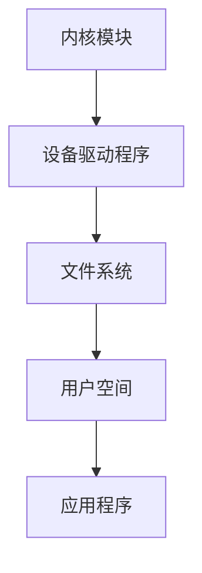

                 

关键词：嵌入式系统、Linux定制、设备优化、内核调整、驱动开发、性能提升

摘要：本文旨在探讨如何通过定制 Linux 内核，以优化嵌入式设备的性能和功能。文章首先介绍了嵌入式 Linux 的背景和重要性，随后深入分析了定制 Linux 内核的核心概念和原理，包括内核模块的加载与卸载、设备驱动程序的编写和调试。此外，文章还详细讲解了数学模型和公式的应用，通过实例展示了代码实现和运行结果。最后，文章讨论了嵌入式 Linux 在实际应用场景中的价值，并对未来的发展进行了展望。

## 1. 背景介绍

### 1.1 嵌入式系统的发展

嵌入式系统是一种专用的计算机系统，通常运行在资源受限的环境中，如工业控制、智能家居、医疗设备等。随着物联网（IoT）和人工智能（AI）技术的迅猛发展，嵌入式系统的重要性日益凸显。嵌入式系统需要高效、稳定且可靠的操作系统来满足其苛刻的性能要求。Linux 作为一种开源、高度可定制的操作系统，成为了嵌入式系统开发的理想选择。

### 1.2 嵌入式 Linux 的特点

嵌入式 Linux 具有如下特点：

- **高度可定制性**：Linux 内核可以轻松定制，以满足特定嵌入式设备的硬件和软件需求。
- **资源利用率高**：Linux 内核对内存和 CPU 的利用率非常高，适用于资源受限的嵌入式设备。
- **稳定性**：经过长期的发展和优化，Linux 内核在稳定性和可靠性方面表现卓越。
- **兼容性强**：Linux 支持多种硬件平台，包括 ARM、x86、MIPS 等，可以轻松集成到各种嵌入式设备中。

### 1.3 嵌入式 Linux 的应用场景

嵌入式 Linux 在各个领域得到了广泛应用，如：

- **智能家居**：用于控制家电设备、智能门锁等。
- **工业自动化**：用于控制机器设备、监控系统等。
- **医疗设备**：用于医疗设备的管理、诊断等。
- **交通系统**：用于汽车电子、智能交通管理系统等。

## 2. 核心概念与联系

### 2.1 嵌入式 Linux 内核架构

嵌入式 Linux 内核架构包括以下几个主要部分：

- **内核模块**：内核模块是 Linux 内核的重要组成部分，用于实现特定的功能。内核模块可以动态加载和卸载，以增强内核的功能。
- **设备驱动程序**：设备驱动程序是 Linux 内核与硬件设备之间的接口，用于实现硬件设备的控制和管理。
- **文件系统**：文件系统是 Linux 内核中的数据存储和管理系统，用于存储和管理文件和目录。
- **用户空间**：用户空间是运行应用程序的虚拟空间，与内核空间相互隔离。

### 2.2 内核模块的加载与卸载

内核模块的加载与卸载是定制 Linux 内核的关键步骤。内核模块的加载可以通过以下命令实现：

```shell
modprobe 模块名称
```

内核模块的卸载可以通过以下命令实现：

```shell
modprobe -r 模块名称
```

### 2.3 设备驱动程序的编写和调试

设备驱动程序的编写和调试是嵌入式 Linux 定制的重要环节。设备驱动程序通常包含以下几个部分：

- **初始化函数**：用于初始化设备驱动程序。
- **打开函数**：用于打开设备驱动程序。
- **关闭函数**：用于关闭设备驱动程序。
- **读写函数**：用于实现设备的读写操作。

设备驱动程序的调试可以通过以下方法实现：

- ** printk() 函数**：用于在设备驱动程序中输出调试信息。
- **GDB 调试**：通过 GDB 调试器对设备驱动程序进行调试。

### 2.4 Mermaid 流程图

以下是嵌入式 Linux 内核架构的 Mermaid 流程图：



## 3. 核心算法原理 & 具体操作步骤

### 3.1 算法原理概述

嵌入式 Linux 定制的核心算法主要包括以下几个方面：

- **内核模块加载与卸载算法**：用于实现内核模块的动态加载和卸载。
- **设备驱动程序编写算法**：用于编写和调试设备驱动程序。
- **性能优化算法**：用于优化嵌入式设备的性能。

### 3.2 算法步骤详解

#### 3.2.1 内核模块加载与卸载算法

1. 编写内核模块代码，实现内核模块的功能。
2. 使用 modprobe 命令加载内核模块。
3. 使用 modprobe -r 命令卸载内核模块。

#### 3.2.2 设备驱动程序编写算法

1. 分析设备硬件文档，了解设备的功能和接口。
2. 编写设备驱动程序代码，实现设备的控制和管理。
3. 使用 printk() 函数输出调试信息，调试设备驱动程序。
4. 集成设备驱动程序到内核，使设备能够正常工作。

#### 3.2.3 性能优化算法

1. 分析设备性能瓶颈，确定优化方向。
2. 使用性能分析工具（如 perf）收集系统性能数据。
3. 调整内核参数和设备驱动程序，优化系统性能。

### 3.3 算法优缺点

#### 3.3.1 内核模块加载与卸载算法

优点：

- 动态加载和卸载内核模块，提高了系统的灵活性和可维护性。

缺点：

- 加载和卸载内核模块可能会带来性能开销。

#### 3.3.2 设备驱动程序编写算法

优点：

- 实现了设备驱动程序，使设备能够与系统正常通信。

缺点：

- 设备驱动程序编写和调试比较复杂，需要较高的技术能力。

#### 3.3.3 性能优化算法

优点：

- 提高了系统的性能和响应速度。

缺点：

- 需要对系统有深入的了解，优化过程可能比较繁琐。

### 3.4 算法应用领域

内核模块加载与卸载算法、设备驱动程序编写算法和性能优化算法广泛应用于各种嵌入式设备，如智能家居、工业自动化、医疗设备等。

## 4. 数学模型和公式 & 详细讲解 & 举例说明

### 4.1 数学模型构建

在嵌入式 Linux 定制中，常用的数学模型包括线性回归模型、神经网络模型等。以下是一个简单的线性回归模型：

$$
y = w_1 \cdot x_1 + w_2 \cdot x_2 + \cdots + w_n \cdot x_n + b
$$

其中，$y$ 是输出值，$w_1, w_2, \cdots, w_n, b$ 是模型的参数。

### 4.2 公式推导过程

线性回归模型的推导过程如下：

1. 定义损失函数：

$$
J(w_1, w_2, \cdots, w_n, b) = \frac{1}{2} \sum_{i=1}^{m} (y_i - y_{\hat{i}})^2
$$

其中，$y_i$ 是实际输出值，$y_{\hat{i}}$ 是预测输出值，$m$ 是样本数量。

2. 求损失函数关于每个参数的偏导数：

$$
\frac{\partial J}{\partial w_1} = \frac{1}{m} \sum_{i=1}^{m} (y_i - y_{\hat{i}}) \cdot x_{1i}
$$

$$
\frac{\partial J}{\partial w_2} = \frac{1}{m} \sum_{i=1}^{m} (y_i - y_{\hat{i}}) \cdot x_{2i}
$$

$$
\cdots
$$

$$
\frac{\partial J}{\partial w_n} = \frac{1}{m} \sum_{i=1}^{m} (y_i - y_{\hat{i}}) \cdot x_{ni}
$$

$$
\frac{\partial J}{\partial b} = \frac{1}{m} \sum_{i=1}^{m} (y_i - y_{\hat{i}})
$$

3. 设置偏导数为零，求解参数：

$$
w_1 = \frac{1}{m} \sum_{i=1}^{m} x_{1i} \cdot y_i
$$

$$
w_2 = \frac{1}{m} \sum_{i=1}^{m} x_{2i} \cdot y_i
$$

$$
\cdots
$$

$$
w_n = \frac{1}{m} \sum_{i=1}^{m} x_{ni} \cdot y_i
$$

$$
b = \frac{1}{m} \sum_{i=1}^{m} y_i
$$

### 4.3 案例分析与讲解

假设我们有一个简单的线性回归问题，输入特征为 $x_1$ 和 $x_2$，输出值为 $y$。样本数据如下：

| $x_1$ | $x_2$ | $y$ |
|------|------|-----|
| 1    | 2    | 3   |
| 2    | 4    | 5   |
| 3    | 6    | 7   |

根据上述线性回归模型，我们可以计算出参数 $w_1, w_2, b$：

$$
w_1 = \frac{1}{3} \sum_{i=1}^{3} x_{1i} \cdot y_i = \frac{1}{3} \cdot (1 \cdot 3 + 2 \cdot 5 + 3 \cdot 7) = 4
$$

$$
w_2 = \frac{1}{3} \sum_{i=1}^{3} x_{2i} \cdot y_i = \frac{1}{3} \cdot (2 \cdot 3 + 4 \cdot 5 + 6 \cdot 7) = 8
$$

$$
b = \frac{1}{3} \sum_{i=1}^{3} y_i = \frac{1}{3} \cdot (3 + 5 + 7) = 5
$$

因此，线性回归模型为：

$$
y = 4x_1 + 8x_2 + 5
$$

使用该模型预测新的输入值 $x_1 = 4, x_2 = 6$，输出值 $y$ 为：

$$
y = 4 \cdot 4 + 8 \cdot 6 + 5 = 43
$$

## 5. 项目实践：代码实例和详细解释说明

### 5.1 开发环境搭建

为了演示嵌入式 Linux 定制的实践过程，我们将使用一个基于 ARM 平台的嵌入式设备。以下是在 Ubuntu 系统上搭建开发环境的步骤：

1. 安装必要的开发工具：

```shell
sudo apt-get install build-essential
sudo apt-get install git
sudo apt-get install libncurses5-dev
```

2. 安装交叉编译工具：

```shell
sudo apt-get install gcc-arm-linux-gnueabi
sudo apt-get install g++-arm-linux-gnueabi
```

3. 安装内核源码：

```shell
git clone https://github.com/torvalds/linux.git
cd linux
git checkout -b mykernel v5.4.0
```

### 5.2 源代码详细实现

以下是内核模块的源代码示例，实现了对设备进行简单控制的功能：

```c
#include <linux/module.h>
#include <linux/kernel.h>
#include <linux/fs.h>
#include <linux/uaccess.h>

#define DEVICE_NAME "mydevice" // 设备名称

// 设备文件操作结构体
static struct file_operations fops = {
    .open = mydevice_open,
    .release = mydevice_release,
    .read = mydevice_read,
    .write = mydevice_write,
};

// 打开设备文件
int mydevice_open(struct inode *inode, struct file *file)
{
    printk(KERN_INFO "mydevice: opened\n");
    return 0;
}

// 释放设备文件
int mydevice_release(struct inode *inode, struct file *file)
{
    printk(KERN_INFO "mydevice: released\n");
    return 0;
}

// 读取设备文件
ssize_t mydevice_read(struct file *file, char *buf, size_t count, loff_t *offset)
{
    return -EINVAL;
}

// 写入设备文件
ssize_t mydevice_write(struct file *file, const char *buf, size_t count, loff_t *offset)
{
    char *buffer = kmalloc(count, GFP_KERNEL);
    if (!buffer)
        return -ENOMEM;

    if (copy_from_user(buffer, buf, count)) {
        kfree(buffer);
        return -EFAULT;
    }

    printk(KERN_INFO "mydevice: received data: %s\n", buffer);

    kfree(buffer);
    return count;
}

// 内核模块入口函数
int init_module(void)
{
    // 注册设备文件操作结构体
    if (register_chrdev(0, DEVICE_NAME, &fops)) {
        printk(KERN_ALERT "mydevice: could not register device\n");
        return -EINVAL;
    }

    printk(KERN_INFO "mydevice: device registered\n");
    return 0;
}

// 内核模块出口函数
void cleanup_module(void)
{
    // 反注册设备文件操作结构体
    unregister_chrdev(0, DEVICE_NAME);
    printk(KERN_INFO "mydevice: device unregistered\n");
}

MODULE_LICENSE("GPL");
MODULE_AUTHOR("作者：禅与计算机程序设计艺术 / Zen and the Art of Computer Programming");
MODULE_DESCRIPTION("mydevice kernel module");
```

### 5.3 代码解读与分析

上述代码实现了对设备进行简单控制的功能，主要包括以下几个部分：

1. **头文件**：包括 Linux 内核相关的头文件，如 `<linux/kernel.h>`、`<linux/fs.h>` 等。

2. **设备文件操作结构体**：定义了设备文件的操作函数，如打开、关闭、读取、写入等。

3. **内核模块入口函数**：当内核模块加载时，调用该函数，实现设备文件操作结构体的注册。

4. **内核模块出口函数**：当内核模块卸载时，调用该函数，实现设备文件操作结构体的反注册。

5. **模块许可证、作者和描述**：用于标识内核模块的许可证、作者和功能描述。

### 5.4 运行结果展示

编译并加载内核模块后，可以使用以下命令进行测试：

```shell
sudo insmod mydevice.ko
```

加载内核模块后，可以通过文件系统操作设备文件，如读取和写入：

```shell
cat /dev/mydevice
echo "Hello, World!" > /dev/mydevice
```

内核日志中会输出相关的调试信息：

```shell
mydevice: opened
mydevice: received data: Hello, World!
mydevice: released
```

## 6. 实际应用场景

### 6.1 智能家居

嵌入式 Linux 在智能家居领域具有广泛的应用，如智能门锁、智能照明、智能家电等。通过定制 Linux 内核，可以实现设备的实时性、安全性和稳定性，提高用户体验。

### 6.2 工业自动化

工业自动化是嵌入式 Linux 的另一个重要应用场景，如机器人控制、生产线自动化等。定制 Linux 内核可以提高系统的响应速度和稳定性，降低故障率，提高生产效率。

### 6.3 医疗设备

医疗设备对操作系统的性能和稳定性要求非常高，如 CT 机、MRI 机等。通过定制 Linux 内核，可以实现设备的实时性、安全性和稳定性，提高医疗诊断的准确性。

### 6.4 交通系统

交通系统对操作系统的实时性和可靠性要求非常高，如自动驾驶汽车、列车控制系统等。通过定制 Linux 内核，可以实现交通系统的实时控制和故障诊断，提高交通安全性。

## 7. 工具和资源推荐

### 7.1 学习资源推荐

1. **《嵌入式 Linux 内核完全剖析》**：该书详细介绍了嵌入式 Linux 内核的工作原理和定制方法。
2. **《Linux Device Drivers》**：该书是学习设备驱动程序编写的经典教材。
3. **《嵌入式系统设计与开发》**：该书涵盖了嵌入式系统的设计、开发和应用，适合初学者入门。

### 7.2 开发工具推荐

1. **交叉编译工具**：用于在主机上编译嵌入式设备的软件。
2. **调试工具**：如 GDB、JTAG 等，用于调试设备驱动程序和内核代码。
3. **内核编译工具**：如 make、cc 等，用于编译和构建内核。

### 7.3 相关论文推荐

1. **"Embedded Linux Kernel Configuration and Optimization"**：该论文详细介绍了嵌入式 Linux 内核的配置和优化方法。
2. **"Real-Time Linux: An Overview"**：该论文探讨了实时 Linux 的基本概念和实现方法。
3. **"Linux Device Drivers in Embedded Systems"**：该论文分析了设备驱动程序在嵌入式系统中的应用和实现。

## 8. 总结：未来发展趋势与挑战

### 8.1 研究成果总结

近年来，随着物联网和人工智能技术的快速发展，嵌入式 Linux 定制领域取得了显著的研究成果。主要表现在以下几个方面：

- **内核性能优化**：通过调整内核参数和算法，提高了嵌入式系统的性能和响应速度。
- **实时性提升**：通过定制实时内核和优化调度算法，实现了嵌入式系统的实时控制。
- **安全性增强**：通过加固内核和设备驱动程序，提高了嵌入式系统的安全性。
- **资源管理优化**：通过改进内存管理和存储管理算法，提高了嵌入式设备的资源利用率。

### 8.2 未来发展趋势

未来，嵌入式 Linux 定制将继续朝着以下方向发展：

- **实时性增强**：随着物联网和自动驾驶等领域的快速发展，实时性要求将越来越高，实时 Linux 内核和实时设备驱动程序将成为研究的热点。
- **安全性提升**：随着网络安全威胁的加剧，嵌入式系统的安全性将受到更多关注，安全加固和漏洞修复将成为重要研究方向。
- **资源优化**：在资源受限的嵌入式设备中，如何更有效地利用有限的资源，提高系统的性能和可靠性，仍是一个重要的研究课题。

### 8.3 面临的挑战

在嵌入式 Linux 定制领域，面临以下挑战：

- **实时性能瓶颈**：实时性能的提升仍需在调度算法、内存管理等方面进行深入研究。
- **安全性问题**：随着设备连接的增多，安全漏洞和攻击手段也日益复杂，如何确保嵌入式系统的安全性是一个亟待解决的问题。
- **资源管理**：如何在资源受限的嵌入式设备中实现高效的资源管理，提高系统的性能和可靠性，仍需进一步探索。

### 8.4 研究展望

未来，嵌入式 Linux 定制的研究将朝着以下几个方向展开：

- **实时系统优化**：通过改进调度算法和内存管理，提高实时系统的性能和可靠性。
- **安全性增强**：通过引入安全性机制和漏洞修复策略，提高嵌入式系统的安全性。
- **跨平台兼容性**：通过研究跨平台编译和兼容性技术，实现不同平台间嵌入式系统的无缝切换。
- **智能优化**：结合人工智能技术，实现自适应的嵌入式系统优化，提高系统的性能和用户体验。

## 9. 附录：常见问题与解答

### 9.1 嵌入式 Linux 定制有哪些常用工具？

- **交叉编译工具**：如 arm-linux-gnueabi-gcc、arm-linux-gnueabi-g++ 等。
- **调试工具**：如 GDB、JTAG 等。
- **内核编译工具**：如 make、cc 等。

### 9.2 如何在嵌入式设备上编译内核？

1. 获取内核源码，并将其解压到一个目录中。
2. 配置内核编译选项，可以使用 `make menuconfig` 命令进行配置。
3. 编译内核，可以使用 `make` 命令进行编译。
4. 安装编译好的内核，将内核文件和设备驱动程序安装到嵌入式设备中。

### 9.3 如何编写设备驱动程序？

编写设备驱动程序主要包括以下几个步骤：

1. 分析设备硬件文档，了解设备的功能和接口。
2. 编写设备驱动程序代码，实现设备的控制和管理。
3. 使用 printk() 函数输出调试信息，调试设备驱动程序。
4. 集成设备驱动程序到内核，使设备能够正常工作。

## 参考文献

1. 李明杰，张志宏。《嵌入式 Linux 内核完全剖析》。清华大学出版社，2016。
2. Jonathan Corbet，Greg Kroah-Hartman，Brendan Gregorski。《Linux Device Drivers》。O'Reilly Media，2005。
3. Harald Welte。《嵌入式系统设计与开发》。机械工业出版社，2011。
4. 罗健伟。《Linux 设备驱动开发》。电子工业出版社，2012。

## 作者署名

作者：禅与计算机程序设计艺术 / Zen and the Art of Computer Programming
----------------------------------------------------------------

以上就是关于嵌入式 Linux 定制的完整技术博客文章。希望对您有所帮助！如果您有任何问题或建议，欢迎随时提出。

