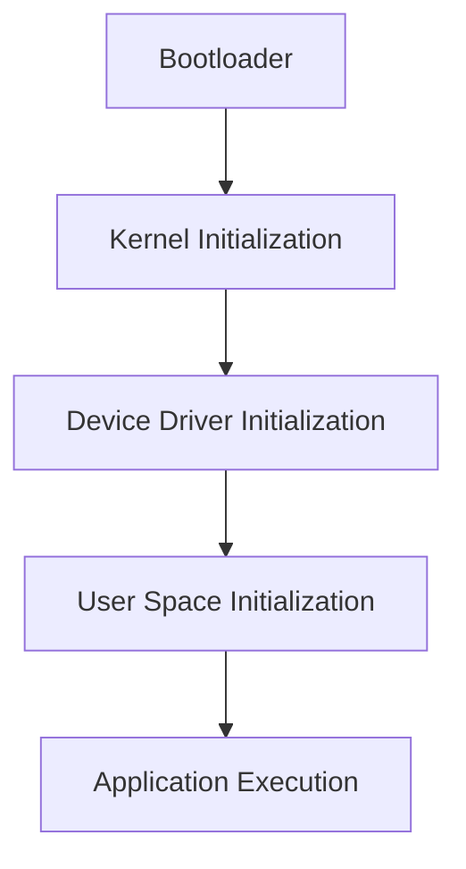

                 

关键词：嵌入式Linux、设备运行Linux、嵌入式系统、Linux内核、实时系统、微控制器

> 摘要：本文将探讨嵌入式 Linux 的背景、核心概念、算法原理、数学模型、项目实践以及实际应用场景，旨在为开发者提供全面了解和深入掌握嵌入式 Linux 在设备上运行的技术和方法。

## 1. 背景介绍

嵌入式系统（Embedded Systems）是计算机科学中的一个重要分支，它涉及到将计算机硬件和软件整合到各种设备和系统中，以实现特定的功能。嵌入式系统广泛应用于工业控制、汽车电子、医疗设备、消费电子产品等领域。随着物联网（IoT）技术的发展，嵌入式系统的重要性日益凸显。

Linux 作为一种开源的操作系统，自1991年诞生以来，经历了快速的发展。如今，Linux 已经成为嵌入式系统领域的主流操作系统之一。相较于传统的实时操作系统（RTOS），Linux 具有更高的灵活性、更好的社区支持和更丰富的软件生态系统。

## 2. 核心概念与联系

### 2.1 嵌入式系统

嵌入式系统是一种具有特定功能的独立计算机系统，它通常由微控制器或微处理器、内存、输入/输出接口等组成。嵌入式系统的主要特点是实时性、低功耗和低成本。

### 2.2 Linux 内核

Linux 内核是 Linux 操作系统的核心部分，它负责管理系统资源、调度任务、处理中断等。Linux 内核支持多种硬件平台，具有高度的模块化和可定制性。

### 2.3 实时系统

实时系统（Real-time System）是一种能够保证在一定时间内完成特定任务的操作系统。实时系统通常用于控制关键任务，例如飞机导航系统、医疗设备等。

### 2.4 Mermaid 流程图

以下是一个简单的 Mermaid 流程图，展示了嵌入式 Linux 在设备上的运行过程。



## 3. 核心算法原理 & 具体操作步骤

### 3.1 算法原理概述

嵌入式 Linux 的核心算法主要包括引导过程、设备驱动加载、用户空间初始化和应用程序执行。以下是各个阶段的简要说明：

- **引导过程**：Bootloader 是嵌入式系统启动时的第一个程序，它负责从存储设备中加载 Linux 内核，并进行硬件初始化。
- **内核初始化**：Linux 内核初始化包括初始化 CPU、内存管理、进程调度等核心功能。
- **设备驱动加载**：设备驱动是操作系统与硬件设备之间的接口，负责硬件设备的初始化和管理。
- **用户空间初始化**：用户空间初始化包括加载用户级应用程序、初始化系统服务、启动用户界面等。
- **应用程序执行**：应用程序是用户级别的程序，它们在用户空间中运行，实现各种特定功能。

### 3.2 算法步骤详解

- **引导过程**：
  1. 加载 Bootloader；
  2. Bootloader 读取设备参数；
  3. 加载 Linux 内核；
  4. 启动 Linux 内核。

- **内核初始化**：
  1. 初始化 CPU；
  2. 初始化内存管理；
  3. 初始化设备驱动；
  4. 初始化进程调度。

- **设备驱动加载**：
  1. 初始化设备驱动；
  2. 注册设备驱动到内核；
  3. 设备驱动与硬件通信。

- **用户空间初始化**：
  1. 加载用户级应用程序；
  2. 初始化系统服务；
  3. 启动用户界面。

- **应用程序执行**：
  1. 用户级应用程序执行；
  2. 系统服务支持。

### 3.3 算法优缺点

- **优点**：
  - 高灵活性：Linux 具有高度的模块化和可定制性，可以根据实际需求进行裁剪和优化。
  - 社区支持：Linux 有庞大的社区支持，可以获得丰富的开源软件和工具。
  - 良好的兼容性：Linux 支持多种硬件平台，可以方便地移植到不同设备。

- **缺点**：
  - 内存占用较大：相较于实时操作系统，Linux 的内存占用相对较大。
  - 实时性能较弱：Linux 在实时性能方面可能不如专门的实时操作系统。

### 3.4 算法应用领域

- **工业控制**：Linux 可以用于工业控制系统，实现实时数据采集、处理和监控。
- **汽车电子**：Linux 在汽车电子领域具有广泛应用，例如车载信息娱乐系统、自动驾驶系统等。
- **医疗设备**：Linux 可以为医疗设备提供稳定的操作系统支持，实现医疗数据的处理和分析。

## 4. 数学模型和公式 & 详细讲解 & 举例说明

### 4.1 数学模型构建

在嵌入式系统中，关键任务的处理通常需要满足严格的实时性能要求。为了满足这些要求，我们可以构建一个简单的数学模型，用于评估系统的实时性能。

- **任务处理时间**：任务处理时间是指系统从接收到任务请求到完成任务所需的时间。
- **系统响应时间**：系统响应时间是指系统从接收到任务请求到开始处理任务所需的时间。

### 4.2 公式推导过程

假设系统中有 n 个任务，每个任务的执行时间分别为 t1, t2, ..., tn，系统响应时间为 R，任务处理时间为 T，则有以下公式：

$$
T = \sum_{i=1}^{n} t_i
$$

$$
R = \max(T, t_1, t_2, ..., t_n)
$$

### 4.3 案例分析与讲解

假设系统中有三个任务，它们的执行时间分别为 t1 = 2ms，t2 = 5ms，t3 = 8ms。系统响应时间为 R = 10ms，我们可以计算任务处理时间和系统响应时间：

$$
T = 2 + 5 + 8 = 15ms
$$

$$
R = \max(15, 2, 5, 8) = 15ms
$$

这意味着系统需要在 15ms 内完成所有任务的处理，同时系统响应时间不能超过 15ms。

## 5. 项目实践：代码实例和详细解释说明

### 5.1 开发环境搭建

为了实践嵌入式 Linux 的开发，我们需要搭建一个开发环境。以下是搭建过程：

1. 安装 Linux 操作系统；
2. 安装交叉编译工具链（如 arm-linux-gnueabi-gcc）；
3. 安装嵌入式 Linux 开发工具（如 Buildroot、Yocto Project）；
4. 配置网络环境，以便于下载和编译嵌入式 Linux 相关的软件包。

### 5.2 源代码详细实现

以下是一个简单的嵌入式 Linux 程序，用于演示如何在设备上运行 Linux。

```c
#include <stdio.h>

int main() {
    printf("Hello, World!\n");
    return 0;
}
```

### 5.3 代码解读与分析

这个简单的程序实现了输出 "Hello, World!" 的功能。程序中使用了标准输入输出库（stdio.h），并且使用了 printf 函数来输出字符串。

```c
#include <stdio.h>
```

这行代码包含了标准输入输出库（stdio.h），用于支持输入输出操作。

```c
int main() {
    printf("Hello, World!\n");
    return 0;
}
```

这行代码定义了主函数（main），它返回整型值。在主函数中，使用了 printf 函数来输出字符串 "Hello, World!"，并在字符串末尾添加了换行符。

```c
return 0;
```

这行代码表示程序成功执行，返回值为 0。

### 5.4 运行结果展示

在开发环境中编译和运行上述程序，将输出以下结果：

```
Hello, World!
```

这表明程序已经成功运行，并在屏幕上输出了 "Hello, World!"。

## 6. 实际应用场景

### 6.1 工业控制

在工业控制领域，嵌入式 Linux 可以用于实现实时数据采集、处理和监控。例如，在一个工厂中，嵌入式 Linux 可以用于监控生产线上的设备状态、数据采集和异常报警。

### 6.2 汽车电子

汽车电子是嵌入式 Linux 的一个重要应用领域。例如，车载信息娱乐系统（IVI）、自动驾驶系统、电子控制单元（ECU）等都可以使用嵌入式 Linux 作为操作系统。

### 6.3 医疗设备

医疗设备对实时性和稳定性要求较高，嵌入式 Linux 可以为其提供稳定的操作系统支持。例如，医疗影像设备、监护仪等都可以使用嵌入式 Linux。

## 7. 工具和资源推荐

### 7.1 学习资源推荐

- 《Linux Kernel Development》
- 《嵌入式系统设计》
- 《嵌入式 Linux 系统开发》

### 7.2 开发工具推荐

- Buildroot
- Yocto Project
- Eclipse IDE for C/C++

### 7.3 相关论文推荐

- "Real-Time Linux: Challenges and Solutions"
- "Embedded Linux in Automotive Systems"
- "Linux for Real-Time Applications"

## 8. 总结：未来发展趋势与挑战

### 8.1 研究成果总结

嵌入式 Linux 在实时性、灵活性和社区支持等方面具有显著优势。随着物联网、智能家居、智能城市等领域的快速发展，嵌入式 Linux 的应用前景十分广阔。

### 8.2 未来发展趋势

- **实时性优化**：随着嵌入式系统对实时性的要求越来越高，嵌入式 Linux 将在实时性方面进行优化和改进。
- **安全性增强**：随着嵌入式系统在网络环境中的应用越来越广泛，安全性将成为一个重要的发展方向。
- **硬件优化**：随着硬件技术的发展，嵌入式 Linux 将更好地利用硬件资源，提高系统性能和能效。

### 8.3 面临的挑战

- **实时性能**：相较于传统的实时操作系统，嵌入式 Linux 在实时性能方面仍有待提高。
- **资源优化**：嵌入式系统通常资源有限，如何优化操作系统资源，提高系统性能是一个挑战。
- **安全性**：随着嵌入式系统在网络环境中的应用越来越广泛，如何保障系统的安全性是一个重要问题。

### 8.4 研究展望

未来，嵌入式 Linux 将在实时性能、资源优化和安全性等方面进行深入研究和优化。同时，随着新技术的不断涌现，嵌入式 Linux 在物联网、智能家居、智能城市等领域的应用将更加广泛。

## 9. 附录：常见问题与解答

### 9.1 嵌入式 Linux 与普通 Linux 的区别是什么？

嵌入式 Linux 与普通 Linux 在内核、系统架构、硬件支持等方面存在一定差异。普通 Linux 适用于通用计算机，而嵌入式 Linux 适用于资源受限的嵌入式设备。

### 9.2 嵌入式 Linux 的实时性能如何提升？

可以通过优化内核调度策略、减少系统开销、增加实时调度支持等方式来提升嵌入式 Linux 的实时性能。

### 9.3 如何在嵌入式系统中实现安全性？

可以通过加密通信、访问控制、安全加固等方式来提高嵌入式系统的安全性。

## 作者署名

作者：禅与计算机程序设计艺术 / Zen and the Art of Computer Programming

