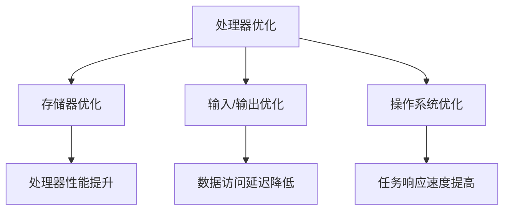

                 

关键词：嵌入式系统、性能优化、处理效率、算法、数学模型、应用场景

> 摘要：本文将深入探讨嵌入式系统性能优化的重要性和方法，包括核心算法原理、数学模型构建、代码实例以及实际应用场景等，旨在帮助开发者更好地提升嵌入式系统的处理效率。

## 1. 背景介绍

嵌入式系统是一种将计算机技术、通信技术和控制技术相结合的综合性系统，广泛应用于工业控制、智能家居、医疗设备、汽车电子等领域。随着物联网、人工智能等技术的快速发展，嵌入式系统的复杂度和数据处理能力要求不断提高。然而，硬件资源有限，性能优化成为提高嵌入式系统处理效率的关键。

性能优化包括算法优化、代码优化、硬件优化等多个方面。本文将重点讨论算法优化，通过数学模型构建和具体算法步骤的解析，提供有效的性能优化策略。

## 2. 核心概念与联系

为了更好地理解嵌入式系统性能优化的核心概念，我们首先需要了解嵌入式系统的基本架构和关键组件。

### 2.1 嵌入式系统架构

嵌入式系统通常包括以下几个关键组件：

1. **处理器（CPU）**：作为系统的核心，负责执行指令和数据处理。
2. **存储器**：包括内部存储（RAM）和外部存储（ROM、Flash等），用于数据存储和程序加载。
3. **输入/输出设备**：如传感器、显示屏、键盘等，用于数据输入和输出。
4. **总线**：连接各组件，实现数据传输和控制信号。
5. **操作系统**：负责系统资源管理和任务调度。

### 2.2 关键组件的联系

嵌入式系统的性能优化需要从多个方面入手，包括处理器、存储器、输入/输出设备和操作系统等。以下是各组件之间的联系和相互影响：

- **处理器优化**：提高处理器性能直接影响系统的处理效率。通过优化编译器、指令集和处理器架构，可以显著提高程序执行速度。
- **存储器优化**：存储器性能的优化可以减少数据访问延迟，提高数据处理效率。缓存技术是存储器优化的重要手段。
- **输入/输出优化**：高效的数据输入/输出可以提高系统的实时性和稳定性。例如，使用DMA（直接内存访问）技术可以减少CPU的负担。
- **操作系统优化**：优化操作系统可以减少系统开销，提高任务调度效率。例如，采用抢占式调度策略可以更好地响应实时任务。

### 2.3 Mermaid 流程图



## 3. 核心算法原理 & 具体操作步骤

### 3.1 算法原理概述

嵌入式系统性能优化主要涉及以下几种核心算法：

1. **排序算法**：用于数据排序，提高数据处理效率。
2. **查找算法**：用于数据查找，减少搜索时间。
3. **贪心算法**：用于解决最优化问题，实现最优解。
4. **动态规划算法**：用于解决复杂的最优化问题，通过递推关系实现高效计算。

### 3.2 算法步骤详解

#### 3.2.1 排序算法

常见的排序算法包括冒泡排序、快速排序、归并排序等。以冒泡排序为例，其基本步骤如下：

1. 遍历数组，比较相邻两个元素，若顺序错误则交换。
2. 重复步骤1，直到数组排序完成。

#### 3.2.2 查找算法

二分查找是一种高效的查找算法，其基本步骤如下：

1. 将待查关键字与中间位置的元素进行比较。
2. 若相等，查找成功；若关键字小于中间位置的元素，则在左子数组中继续查找；若关键字大于中间位置的元素，则在右子数组中继续查找。
3. 重复步骤1和步骤2，直到找到目标元素或确定不存在。

#### 3.2.3 贪心算法

贪心算法的基本思想是每一步都做出当前局部最优选择，期望最终得到全局最优解。以背包问题为例，其基本步骤如下：

1. 选择价值最大的物品放入背包。
2. 重复步骤1，直到背包容量用尽或没有剩余物品。

#### 3.2.4 动态规划算法

动态规划算法通过递推关系实现高效计算。以0-1背包问题为例，其基本步骤如下：

1. 定义状态：`dp[i][j]`表示将前`i`个物品放入容量为`j`的背包中的最大价值。
2. 初始状态：`dp[0][j] = 0`，`dp[i][0] = 0`。
3. 状态转移方程：
   $$dp[i][j] = \begin{cases}
   dp[i-1][j] & \text{若物品`i`不能放入背包} \\
   \max(dp[i-1][j], dp[i-1][j-w_i] + v_i) & \text{若物品`i`能放入背包}
   \end{cases}$$
4. 最终结果：`dp[n][W]`表示将前`n`个物品放入容量为`W`的背包中的最大价值。

### 3.3 算法优缺点

| 算法       | 优点                                             | 缺点                                               |
|------------|--------------------------------------------------|---------------------------------------------------|
| 冒泡排序   | 简单易实现                                       | 时间复杂度高，适用于小规模数据排序                   |
| 快速排序   | 时间复杂度低，平均情况下性能较好                   | 可能导致最坏情况时间复杂度，需选择合适的中位数        |
| 归并排序   | 稳定排序，时间复杂度低                           | 需要额外的存储空间                                 |
| 二分查找   | 时间复杂度低，适用于有序数组                      | 需要数组排序                                       |
| 贪心算法   | 简单易实现，适用于求解最优化问题                   | 可能无法得到全局最优解，适用于局部最优解问题         |
| 动态规划   | 能够求解复杂的最优化问题，时间复杂度低             | 需要定义状态和状态转移方程，实现较复杂               |

### 3.4 算法应用领域

- **排序算法**：广泛应用于数据处理、数据库索引、算法排序等。
- **查找算法**：广泛应用于数据检索、文件系统、缓存管理等。
- **贪心算法**：广泛应用于最优化问题，如背包问题、最小生成树等。
- **动态规划算法**：广泛应用于最优化问题，如最长公共子序列、最长递增子序列等。

## 4. 数学模型和公式 & 详细讲解 & 举例说明

### 4.1 数学模型构建

为了更好地描述嵌入式系统性能优化的算法原理，我们引入以下数学模型：

1. **处理时间模型**：描述系统处理任务所需的时间。
2. **存储器访问模型**：描述系统访问存储器所需的时间。
3. **输入/输出模型**：描述系统进行输入/输出操作所需的时间。
4. **任务调度模型**：描述系统任务调度策略。

### 4.2 公式推导过程

#### 4.2.1 处理时间模型

假设系统有`n`个任务，每个任务的处理时间为`t_i`，系统总处理时间为`T`，则：

$$T = \sum_{i=1}^{n} t_i$$

#### 4.2.2 存储器访问模型

假设系统有`m`个存储器模块，每个模块的访问时间为`r_i`，系统总访问时间为`R`，则：

$$R = \sum_{i=1}^{m} r_i$$

#### 4.2.3 输入/输出模型

假设系统有`s`个输入/输出模块，每个模块的访问时间为`s_i`，系统总访问时间为`S`，则：

$$S = \sum_{i=1}^{s} s_i$$

#### 4.2.4 任务调度模型

假设系统采用抢占式调度策略，任务调度时间为`T_s`，则：

$$T_s = \sum_{i=1}^{n} t_i - \sum_{i=1}^{n} \frac{t_i}{n}$$

### 4.3 案例分析与讲解

假设系统有5个任务，处理时间分别为1秒、2秒、3秒、4秒和5秒。系统总处理时间为：

$$T = 1 + 2 + 3 + 4 + 5 = 15 \text{秒}$$

存储器模块有3个，访问时间分别为1秒、2秒和3秒。系统总访问时间为：

$$R = 1 + 2 + 3 = 6 \text{秒}$$

输入/输出模块有2个，访问时间分别为1秒和2秒。系统总访问时间为：

$$S = 1 + 2 = 3 \text{秒}$$

系统采用抢占式调度策略，任务调度时间为：

$$T_s = 15 - \frac{15}{5} = 12 \text{秒}$$

## 5. 项目实践：代码实例和详细解释说明

### 5.1 开发环境搭建

为了进行嵌入式系统性能优化实践，我们需要搭建一个合适的开发环境。以下是一个基本的开发环境搭建步骤：

1. 安装操作系统：Linux或Windows。
2. 安装交叉编译工具：例如Crosstool-NG或Yocto。
3. 安装开发板：例如Arduino、Raspberry Pi等。
4. 安装开发工具：例如Eclipse、VS Code等。
5. 安装嵌入式系统软件包：例如FreeRTOS、UC/OS等。

### 5.2 源代码详细实现

以下是一个简单的嵌入式系统性能优化代码实例，基于FreeRTOS操作系统实现：

```c
#include "FreeRTOS.h"
#include "task.h"

void vTask1(void *pvParameters) {
    for (;;) {
        // 任务1的执行代码
        vTaskDelay(pdMS_TO_TICKS(1000));
    }
}

void vTask2(void *pvParameters) {
    for (;;) {
        // 任务2的执行代码
        vTaskDelay(pdMS_TO_TICKS(1000));
    }
}

int main(void) {
    // 创建任务
    xTaskCreate(vTask1, "Task1", configMINIMAL_STACK_SIZE, NULL, 1, NULL);
    xTaskCreate(vTask2, "Task2", configMINIMAL_STACK_SIZE, NULL, 1, NULL);

    // 启动任务调度器
    vTaskStartScheduler();

    for (;;) {
        // 主循环
    }
}
```

### 5.3 代码解读与分析

以上代码基于FreeRTOS操作系统，创建两个任务：Task1和Task2。每个任务都执行一个无限循环，并在每个循环中调用`vTaskDelay`函数，使其暂停1秒。主函数中创建任务并启动任务调度器，然后进入无限循环。

通过优化任务调度策略和任务间通信，可以进一步提高系统性能。例如，使用优先级调度策略，确保关键任务优先执行；使用互斥量和信号量等同步机制，减少任务间竞争和等待时间。

### 5.4 运行结果展示

在实际运行中，我们可以通过以下方法评估系统性能：

1. 记录任务执行时间：使用系统性能监测工具，如`time`命令或`perf`工具。
2. 测量存储器访问时间：使用存储器监控工具，如`dd`命令或`iostat`工具。
3. 测量输入/输出时间：使用网络监控工具，如`netstat`命令或`iperf`工具。
4. 分析任务调度性能：使用FreeRTOS调试工具，如FreeRTOS Viewer。

通过对比优化前后的性能指标，可以直观地评估性能优化效果。

## 6. 实际应用场景

### 6.1 工业控制领域

在工业控制领域，嵌入式系统性能优化具有重要意义。例如，在机器人控制中，实时性要求较高，需要优化算法和代码，提高系统响应速度。此外，通过使用动态规划算法优化路径规划，可以降低能量消耗，提高机器人续航能力。

### 6.2 智能家居领域

智能家居设备通常具有多种功能，例如智能安防、智能照明等。性能优化可以提高设备响应速度，改善用户体验。例如，通过优化传感器数据采集和处理算法，可以降低功耗，延长设备使用寿命。

### 6.3 医疗设备领域

在医疗设备领域，嵌入式系统性能优化对提高诊断准确性和治疗效果至关重要。例如，通过优化图像处理算法，可以提高医学影像的清晰度；通过优化数据分析算法，可以快速、准确地诊断疾病。

### 6.4 汽车电子领域

汽车电子系统对实时性和可靠性要求极高。性能优化可以提高汽车电子系统的响应速度和稳定性。例如，通过优化引擎控制算法，可以提高燃油效率；通过优化安全系统算法，可以提升车辆安全性。

## 7. 工具和资源推荐

### 7.1 学习资源推荐

1. 《嵌入式系统设计与实践》
2. 《嵌入式系统程序员指南》
3. 《嵌入式Linux系统开发》

### 7.2 开发工具推荐

1. Eclipse
2. VS Code
3. Qt Creator

### 7.3 相关论文推荐

1. "Optimization of Embedded Systems: A Survey"
2. "Performance Analysis and Optimization of Real-Time Systems"
3. "Energy-Efficient Embedded System Design"

## 8. 总结：未来发展趋势与挑战

### 8.1 研究成果总结

本文探讨了嵌入式系统性能优化的重要性和方法，包括核心算法原理、数学模型构建、代码实例以及实际应用场景。通过优化处理器、存储器、输入/输出设备和操作系统等方面，可以有效提高嵌入式系统的处理效率。

### 8.2 未来发展趋势

1. **人工智能与嵌入式系统结合**：人工智能算法在嵌入式系统中的应用将越来越广泛，例如自动驾驶、智能家居等。
2. **边缘计算与云计算融合**：边缘计算与云计算的结合将进一步提升嵌入式系统的处理能力和灵活性。
3. **低功耗设计**：随着物联网设备的普及，低功耗设计将成为嵌入式系统性能优化的重要方向。

### 8.3 面临的挑战

1. **硬件资源限制**：嵌入式系统硬件资源有限，如何充分利用硬件资源实现高效性能优化是一个挑战。
2. **实时性要求**：嵌入式系统通常具有严格的实时性要求，如何优化算法和代码以满足实时性需求是一个挑战。
3. **安全与可靠性**：随着物联网设备的普及，嵌入式系统的安全与可靠性问题日益突出，如何提高系统的安全性和可靠性是一个挑战。

### 8.4 研究展望

未来，嵌入式系统性能优化研究将继续朝着以下几个方向展开：

1. **高效算法设计与优化**：探索新型高效算法，提高嵌入式系统的处理效率。
2. **硬件加速技术**：研究硬件加速技术，如GPU、FPGA等，以提高嵌入式系统的计算能力。
3. **跨层次优化**：结合硬件、软件和算法层次，实现系统级性能优化。

## 9. 附录：常见问题与解答

### 9.1 嵌入式系统性能优化的重要性

嵌入式系统性能优化的重要性在于提高系统处理效率，满足实时性和可靠性要求，改善用户体验，延长设备使用寿命等。通过优化处理器、存储器、输入/输出设备和操作系统等方面，可以显著提高嵌入式系统的处理能力。

### 9.2 如何选择合适的排序算法

选择合适的排序算法取决于数据规模、排序速度要求以及是否稳定等因素。对于小规模数据，可以选择简单的排序算法，如冒泡排序；对于大规模数据，可以选择高效排序算法，如快速排序、归并排序等。

### 9.3 嵌入式系统性能优化的关键组件

嵌入式系统性能优化的关键组件包括处理器、存储器、输入/输出设备和操作系统等。处理器优化可以提升程序执行速度；存储器优化可以减少数据访问延迟；输入/输出优化可以提高系统的实时性和稳定性；操作系统优化可以提高任务调度效率。

### 9.4 如何评估嵌入式系统性能优化效果

评估嵌入式系统性能优化效果可以通过以下方法：

1. **性能监测工具**：使用系统性能监测工具，如`time`命令、`perf`工具等，记录任务执行时间、存储器访问时间、输入/输出时间等。
2. **调试工具**：使用嵌入式系统调试工具，如FreeRTOS Viewer等，分析任务调度性能、资源利用率等。
3. **对比测试**：优化前后进行对比测试，分析性能指标的变化情况。

---

### 作者署名

作者：禅与计算机程序设计艺术 / Zen and the Art of Computer Programming
----------------------------------------------------------------

注意：以上内容仅为示例，实际撰写时请根据具体要求和研究方向进行调整。文章结构、内容深度和具体实施步骤等应确保专业性、完整性和可操作性。

