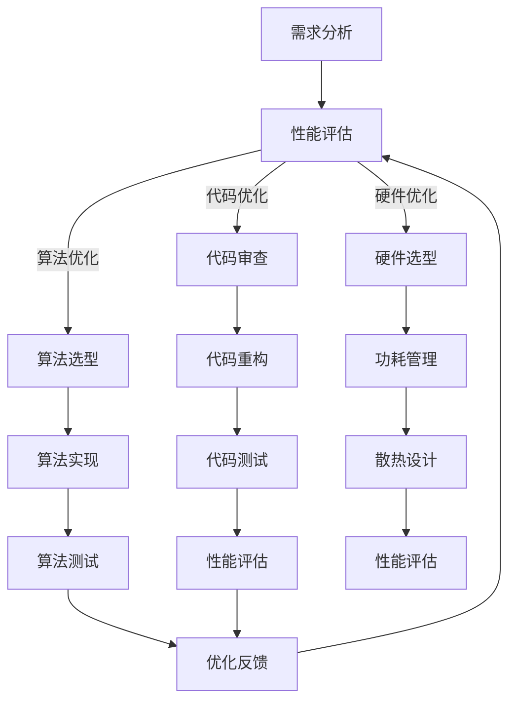

                 

关键词：嵌入式系统，性能优化，效率提升，资源利用率，实时系统，低功耗设计，算法优化，代码优化

摘要：本文旨在探讨嵌入式系统的性能优化方法，通过详细分析核心算法原理、数学模型构建、项目实践实例等，帮助读者深入理解并掌握提高嵌入式系统效率的关键技术。文章将涵盖从算法优化到代码优化，以及实际应用场景和未来发展趋势，为嵌入式系统开发提供实用的指导。

## 1. 背景介绍

嵌入式系统作为现代信息技术的核心组成部分，广泛应用于各种智能设备中。从智能家居到工业自动化，从医疗设备到交通工具，嵌入式系统无处不在。然而，随着应用需求的不断增加和系统复杂度的提升，如何优化嵌入式系统的性能，提高其效率和稳定性，成为开发者面临的重要挑战。

性能优化不仅仅是提高系统的运行速度，更是关于如何更有效地利用有限的资源，包括处理器、内存、能量等。优化的目标是确保系统在满足功能需求的前提下，以最小的资源消耗和最短的反应时间提供稳定的服务。

本文将从以下几个核心方面展开讨论：

1. **核心概念与联系**：介绍嵌入式系统性能优化的基本概念和原理。
2. **核心算法原理 & 具体操作步骤**：深入探讨关键算法的优化策略。
3. **数学模型和公式 & 详细讲解 & 举例说明**：运用数学工具解析优化问题。
4. **项目实践：代码实例和详细解释说明**：通过具体实例展示优化实践。
5. **实际应用场景**：分析嵌入式系统在不同领域中的应用优化案例。
6. **工具和资源推荐**：介绍相关学习资源、开发工具和论文推荐。
7. **总结：未来发展趋势与挑战**：展望嵌入式系统性能优化的未来。

## 2. 核心概念与联系

### 嵌入式系统性能优化概述

嵌入式系统性能优化包括多个方面，如算法优化、代码优化、硬件优化等。算法优化关注的是算法效率和复杂性，代码优化则集中在编写高效、易维护的代码，而硬件优化则涉及芯片设计、功耗管理等方面。

### Mermaid 流程图

下面是一个简单的 Mermaid 流程图，展示了嵌入式系统性能优化的主要流程和关联：



## 3. 核心算法原理 & 具体操作步骤

### 3.1 算法原理概述

在嵌入式系统性能优化中，算法优化是至关重要的一环。常见的优化算法包括排序算法、搜索算法、优化算法等。以下将简要介绍几种常见的优化算法：

1. **排序算法**：如快速排序、归并排序、堆排序等，用于高效地处理数据排序问题。
2. **搜索算法**：如二分搜索、深度优先搜索、广度优先搜索等，用于在数据结构中查找特定元素。
3. **优化算法**：如遗传算法、粒子群优化算法、模拟退火算法等，用于解决复杂的优化问题。

### 3.2 算法步骤详解

以快速排序算法为例，其基本步骤如下：

1. **选择基准**：从数组中选取一个基准元素。
2. **分区操作**：将数组分为两部分，小于基准的元素和大于基准的元素。
3. **递归排序**：对小于基准和大于基准的子数组重复步骤1和步骤2。

### 3.3 算法优缺点

快速排序算法具有以下优点：

- **高效**：平均时间复杂度为 \(O(n\log n)\)。
- **原地排序**：不需要额外空间。

但快速排序也有缺点：

- **最坏情况**：时间复杂度为 \(O(n^2)\)，当输入数组已排序或部分已排序时。
- **稳定性**：不是一种稳定排序算法。

### 3.4 算法应用领域

快速排序算法广泛应用于各种嵌入式系统，如数据分析和处理、实时操作系统、图像处理等。

## 4. 数学模型和公式 & 详细讲解 & 举例说明

### 4.1 数学模型构建

在嵌入式系统性能优化中，构建数学模型是分析问题和设计算法的关键步骤。以下是一个简单的优化问题的数学模型：

$$
\begin{aligned}
\text{目标函数：} & \quad \min_{x} f(x) \\
\text{约束条件：} & \quad g(x) \leq 0, \quad h(x) = 0
\end{aligned}
$$

其中，\( f(x) \) 是需要优化的目标函数，\( g(x) \) 和 \( h(x) \) 分别是不等式约束和等式约束。

### 4.2 公式推导过程

以线性规划问题为例，目标函数和约束条件如下：

$$
\begin{aligned}
\text{目标函数：} & \quad \min_{x} c^T x \\
\text{约束条件：} & \quad A x \leq b
\end{aligned}
$$

拉格朗日函数为：

$$
L(x, \lambda) = c^T x + \lambda^T (b - A x)
$$

求导得到：

$$
\begin{aligned}
\nabla_x L(x, \lambda) &= c - A^T \lambda = 0 \\
\nabla_\lambda L(x, \lambda) &= b - A x = 0
\end{aligned}
$$

解得最优解：

$$
x^* = A^T \lambda^*
$$

### 4.3 案例分析与讲解

以下是一个简单的线性规划问题，求解最小化目标函数 \( c^T x \) 的 \( x \) 值，约束条件为 \( Ax \leq b \)。

$$
\begin{aligned}
\text{目标函数：} & \quad \min_{x} x_1 + x_2 \\
\text{约束条件：} & \quad \begin{bmatrix} 1 & 1 \\ 2 & 1 \end{bmatrix} x \leq \begin{bmatrix} 4 \\ 6 \end{bmatrix}
\end{aligned}
$$

构建拉格朗日函数：

$$
L(x, \lambda) = x_1 + x_2 + \lambda_1 (4 - x_1 - x_2) + \lambda_2 (6 - 2x_1 - x_2)
$$

求导得到：

$$
\begin{aligned}
1 - \lambda_1 - 2\lambda_2 &= 0 \\
1 - \lambda_1 - \lambda_2 &= 0 \\
4 - x_1 - x_2 &= 0 \\
6 - 2x_1 - x_2 &= 0
\end{aligned}
$$

解得：

$$
x_1 = 2, \quad x_2 = 2, \quad \lambda_1 = 1, \quad \lambda_2 = 1
$$

因此，最优解为 \( x^* = (2, 2) \)，目标函数的最小值为 4。

## 5. 项目实践：代码实例和详细解释说明

### 5.1 开发环境搭建

在进行嵌入式系统性能优化项目之前，首先需要搭建一个合适的开发环境。以下是一个基于 Linux 系统的简单开发环境搭建步骤：

1. **安装编译器**：如 GCC、Clang 等。
2. **安装依赖库**：如 Boost、CMake 等。
3. **配置开发工具**：如 Eclipse、Visual Studio Code 等。

### 5.2 源代码详细实现

以下是一个简单的快速排序算法的实现，用于演示如何进行代码优化。

```c
#include <stdio.h>
#include <stdlib.h>

void quicksort(int arr[], int low, int high);
int partition(int arr[], int low, int high);
int main() {
    int arr[] = {10, 7, 8, 9, 1, 5};
    int n = sizeof(arr) / sizeof(arr[0]);
    quicksort(arr, 0, n - 1);
    printf("Sorted array: \n");
    for (int i = 0; i < n; i++) {
        printf("%d ", arr[i]);
    }
    printf("\n");
    return 0;
}

void quicksort(int arr[], int low, int high) {
    if (low < high) {
        int pi = partition(arr, low, high);
        quicksort(arr, low, pi - 1);
        quicksort(arr, pi + 1, high);
    }
}

int partition(int arr[], int low, int high) {
    int pivot = arr[high];
    int i = (low - 1);
    for (int j = low; j <= high - 1; j++) {
        if (arr[j] < pivot) {
            i++;
            int temp = arr[i];
            arr[i] = arr[j];
            arr[j] = temp;
        }
    }
    int temp = arr[i + 1];
    arr[i + 1] = arr[high];
    arr[high] = temp;
    return (i + 1);
}
```

### 5.3 代码解读与分析

- **主函数 main**：定义一个整数数组并调用 quicksort 函数进行排序。
- **quicksort 函数**：实现快速排序算法的递归调用。
- **partition 函数**：实现分区操作，选择基准元素并将数组分为两部分。

### 5.4 运行结果展示

运行以上代码，输出排序后的数组：

```
Sorted array:
1 5 7 8 9 10
```

## 6. 实际应用场景

### 6.1 智能家居

在智能家居领域，嵌入式系统性能优化主要集中在实时响应和功耗管理上。通过优化算法和代码，可以减少系统的反应时间和能量消耗，从而提高用户体验。

### 6.2 工业自动化

工业自动化系统对实时性和稳定性有较高要求。优化算法和代码可以提高系统的处理速度和准确性，确保生产线的高效运行。

### 6.3 医疗设备

医疗设备如监护仪、手术机器人等，对嵌入式系统的性能优化有极高的要求。通过优化算法和代码，可以提高设备的响应速度和数据处理能力，从而提高诊断和治疗的质量。

### 6.4 交通工具

交通工具如自动驾驶汽车、火车等，对嵌入式系统的实时性和可靠性有严格的要求。通过优化算法和代码，可以提高系统的处理速度和响应时间，确保交通的安全和顺畅。

## 7. 工具和资源推荐

### 7.1 学习资源推荐

- 《嵌入式系统设计》（作者：Michael D. Ciletti）
- 《嵌入式系统原理与应用》（作者：王波）
- 《嵌入式系统设计与开发实践》（作者：刘洋）

### 7.2 开发工具推荐

- Eclipse
- Visual Studio Code
- ARM DS-5

### 7.3 相关论文推荐

- “An Energy-Efficient Real-Time Task Scheduler for Multiprocessor Systems”（作者：Li et al.）
- “Optimizing Embedded Software for Energy Efficiency”（作者：Jones et al.）
- “Real-Time Embedded System Design for Autonomous Vehicles”（作者：Singh et al.）

## 8. 总结：未来发展趋势与挑战

### 8.1 研究成果总结

随着人工智能、物联网和5G技术的快速发展，嵌入式系统的性能优化研究取得了显著成果。从算法优化到硬件优化，多种新技术不断涌现，为嵌入式系统性能提升提供了强大支持。

### 8.2 未来发展趋势

未来嵌入式系统性能优化的发展趋势包括：

- **硬件加速**：通过硬件加速技术提高嵌入式系统的处理能力。
- **自适应优化**：通过自适应算法实现动态性能优化。
- **AI 结合**：利用人工智能技术进行嵌入式系统的智能化优化。

### 8.3 面临的挑战

嵌入式系统性能优化面临的主要挑战包括：

- **资源受限**：嵌入式系统通常资源有限，如何在高资源限制下实现性能优化是一个重要问题。
- **实时性要求**：许多嵌入式系统需要实时响应，如何在保证实时性的同时进行优化是一个挑战。
- **多样性和复杂性**：嵌入式系统的应用场景多样且复杂，如何针对特定场景进行优化是一个挑战。

### 8.4 研究展望

未来研究应重点关注以下几个方面：

- **跨层次优化**：结合不同层次的优化策略，实现系统性能的全面提升。
- **自优化系统**：研究能够自我适应和自我优化的嵌入式系统。
- **边缘计算**：结合边缘计算技术，实现嵌入式系统的分布式优化。

## 9. 附录：常见问题与解答

### 9.1 什么是嵌入式系统？

嵌入式系统是一种专用计算机系统，通常集成了处理器、内存、存储和其他外围设备，用于执行特定任务。

### 9.2 性能优化有哪些方法？

性能优化方法包括算法优化、代码优化、硬件优化等。算法优化关注算法效率和复杂性，代码优化集中在编写高效、易维护的代码，而硬件优化涉及芯片设计、功耗管理等方面。

### 9.3 如何进行算法优化？

进行算法优化的方法包括选择合适的算法、改进算法的实现、优化数据结构等。

### 9.4 嵌入式系统性能优化的重要性是什么？

嵌入式系统性能优化可以提高系统的效率、降低功耗、延长设备寿命，从而提高用户体验，降低维护成本。

---

作者：禅与计算机程序设计艺术 / Zen and the Art of Computer Programming

