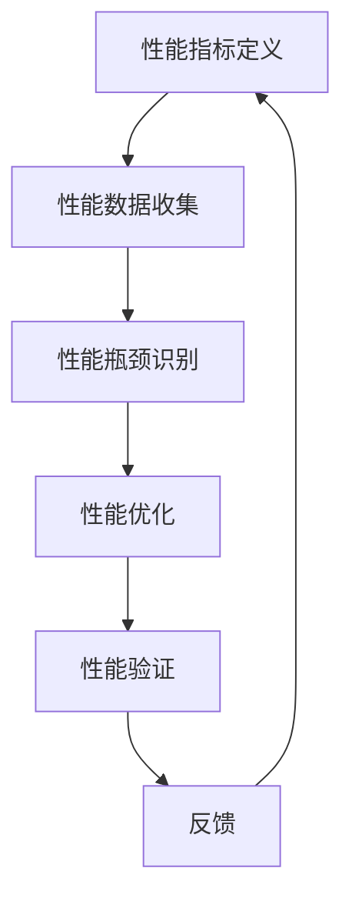

                 

 关键词：嵌入式系统，性能分析，瓶颈识别，优化，性能测试，代码优化，系统架构，资源利用

> 摘要：本文旨在深入探讨嵌入式系统性能分析的方法和技术，特别是如何识别系统中的性能瓶颈。通过分析系统架构、代码实现和硬件资源利用，本文将提供一系列实用的方法和工具，帮助嵌入式系统开发者更有效地提升系统性能。

## 1. 背景介绍

嵌入式系统作为一种专用系统，广泛应用于工业控制、智能家居、医疗设备、汽车电子等领域。随着技术的发展，嵌入式系统的复杂度不断增加，性能要求也越来越高。然而，性能瓶颈往往成为制约系统优化的关键因素。性能瓶颈可能是由于硬件资源的限制，也可能是由于软件设计上的缺陷，或者是由两者共同造成的。因此，对嵌入式系统进行性能分析，识别并解决性能瓶颈，是提升系统性能的重要步骤。

性能分析的过程可以分为以下几个阶段：

1. **性能指标定义**：明确系统的性能指标，如响应时间、吞吐量、CPU利用率、内存占用等。
2. **性能数据收集**：通过各种工具收集系统的运行数据，包括系统监控、日志文件等。
3. **性能瓶颈识别**：通过分析性能数据，定位系统的性能瓶颈。
4. **性能优化**：根据瓶颈的原因，采取相应的优化措施，如代码优化、系统架构调整等。
5. **性能验证**：验证优化后的系统性能，确保问题得到解决且没有引入新的问题。

本文将围绕性能瓶颈识别这个核心环节，介绍一些实用的技术和工具。

## 2. 核心概念与联系

### 2.1 性能瓶颈的概念

性能瓶颈是指系统在执行任务时，性能受到限制的关键因素。它可能是由于系统硬件资源（如CPU、内存、I/O等）的限制，也可能是由于软件设计（如算法复杂度、代码效率等）的问题。

### 2.2 嵌入式系统性能分析的基本概念

嵌入式系统性能分析涉及多个方面，包括：

- **响应时间**：系统从开始执行任务到完成任务所需的时间。
- **吞吐量**：单位时间内系统处理任务的个数。
- **CPU利用率**：CPU被占用的时间比例。
- **内存占用**：系统使用的内存大小。
- **I/O性能**：系统进行输入输出操作的速度。

### 2.3 性能瓶颈识别方法

性能瓶颈识别的方法主要包括：

- **统计分析**：通过收集系统运行数据，分析各个性能指标的变化趋势，找出异常值。
- **代码分析**：对系统代码进行静态分析，识别可能影响性能的代码片段。
- **动态调试**：在系统运行时，通过动态调试工具跟踪系统的运行状态，定位性能瓶颈。

### 2.4 Mermaid 流程图

以下是一个简单的 Mermaid 流程图，展示嵌入式系统性能分析的过程：



## 3. 核心算法原理 & 具体操作步骤

### 3.1 算法原理概述

性能分析的核心是识别系统的性能瓶颈。这个过程通常包括以下几个步骤：

1. **定义性能指标**：明确需要监测的性能指标。
2. **数据收集**：使用系统监控工具和代码分析工具收集运行数据。
3. **数据预处理**：对收集到的数据进行清洗和预处理，以便后续分析。
4. **性能瓶颈定位**：通过统计分析、代码分析和动态调试等方法，找出性能瓶颈。
5. **性能优化**：根据瓶颈原因，采取优化措施，如代码优化、算法改进、系统架构调整等。

### 3.2 算法步骤详解

1. **定义性能指标**

   首先，需要明确系统的性能指标。这些指标可以包括：

   - **响应时间**：系统从开始执行任务到完成任务所需的时间。
   - **吞吐量**：单位时间内系统处理任务的个数。
   - **CPU利用率**：CPU被占用的时间比例。
   - **内存占用**：系统使用的内存大小。
   - **I/O性能**：系统进行输入输出操作的速度。

2. **性能数据收集**

   收集性能数据是性能分析的重要步骤。可以使用以下工具：

   - **系统监控工具**：如Linux的`top`、`vmstat`、`iostat`等命令，用于收集系统资源的使用情况。
   - **代码分析工具**：如`gprof`、`valgrind`等，用于分析代码的性能瓶颈。

3. **数据预处理**

   收集到的数据通常需要进行预处理，以便后续分析。预处理步骤包括：

   - **数据清洗**：去除异常值和噪声数据。
   - **数据转换**：将数据转换为适合分析的形式，如时间序列数据。

4. **性能瓶颈定位**

   使用统计分析、代码分析和动态调试等方法，定位系统的性能瓶颈。

   - **统计分析**：通过分析性能指标的时间序列数据，找出异常值和趋势。
   - **代码分析**：对系统代码进行静态分析，识别可能影响性能的代码片段。
   - **动态调试**：在系统运行时，通过动态调试工具跟踪系统的运行状态，定位性能瓶颈。

5. **性能优化**

   根据性能瓶颈的原因，采取相应的优化措施。可能的优化措施包括：

   - **代码优化**：优化代码，减少不必要的计算和内存占用。
   - **算法改进**：改进算法，降低时间复杂度和空间复杂度。
   - **系统架构调整**：调整系统架构，如使用多线程、分布式计算等。

6. **性能验证**

   优化完成后，需要验证系统的性能是否得到提升。可以通过以下方法进行验证：

   - **性能测试**：使用性能测试工具，如`jemalloc-bench`、`iperf3`等，进行压力测试和性能测试。
   - **用户反馈**：收集用户的反馈，了解系统在实际使用中的性能表现。

### 3.3 算法优缺点

**优点**：

- **定位准确**：通过多种方法，可以准确定位系统的性能瓶颈。
- **全面性**：综合考虑了系统硬件和软件的各个方面，提供了全面的性能分析。
- **针对性**：根据性能瓶颈的原因，采取针对性的优化措施，提高系统的性能。

**缺点**：

- **复杂度高**：性能分析涉及多个方面，需要使用多种工具和方法，复杂度较高。
- **时间成本**：性能分析需要收集大量的数据，并进行预处理和分析，时间成本较高。

### 3.4 算法应用领域

性能分析算法可以应用于多种嵌入式系统，如：

- **工业控制系统**：识别控制循环中的性能瓶颈，提高系统的响应速度和稳定性。
- **智能家居系统**：优化智能家居设备的性能，提高用户体验。
- **医疗设备**：优化医疗设备的性能，确保系统在关键时刻能够正常运行。
- **汽车电子系统**：识别汽车电子系统的性能瓶颈，提高系统的可靠性和安全性。

## 4. 数学模型和公式 & 详细讲解 & 举例说明

### 4.1 数学模型构建

在性能分析中，常用的数学模型包括：

- **响应时间模型**：用于计算系统响应时间。
- **吞吐量模型**：用于计算系统吞吐量。
- **CPU利用率模型**：用于计算CPU利用率。

以下是一个简单的响应时间模型：

$$
T_r = \frac{1}{\lambda + \mu}
$$

其中，$T_r$ 是响应时间，$\lambda$ 是任务到达率，$\mu$ 是服务率。

### 4.2 公式推导过程

以响应时间模型为例，推导过程如下：

1. **任务到达过程**：假设任务以泊松过程到达，到达率为 $\lambda$，则单位时间内到达的任务数为 $\lambda$。
2. **服务过程**：假设任务以服务时间服从指数分布，服务率为 $\mu$，则单位时间内完成服务的任务数为 $\mu$。
3. **系统状态**：系统状态可以表示为任务数 $N$。
4. **稳态分布**：根据排队论，系统在稳态下的状态分布为 $\pi(N)$。
5. **响应时间**：响应时间 $T_r$ 可以表示为：

$$
T_r = \sum_{N=0}^{\infty} \pi(N) \times (N+1) \times \frac{1}{\mu}
$$

由于 $\sum_{N=0}^{\infty} \pi(N) = 1$，上述公式可以简化为：

$$
T_r = \frac{1}{\lambda + \mu}
$$

### 4.3 案例分析与讲解

假设一个嵌入式系统，任务到达率 $\lambda = 10$ 次/秒，服务率 $\mu = 20$ 次/秒。使用响应时间模型计算系统的响应时间。

$$
T_r = \frac{1}{10 + 20} = 0.04 \text{ 秒}
$$

这意味着系统的平均响应时间为 0.04 秒。如果响应时间过长，可能需要优化系统性能。

## 5. 项目实践：代码实例和详细解释说明

### 5.1 开发环境搭建

在性能分析的项目实践中，我们需要搭建一个合适的开发环境。以下是一个基本的开发环境搭建步骤：

1. **安装操作系统**：选择一个适合的操作系统，如Linux。
2. **安装编译器**：安装C/C++编译器，如GCC或Clang。
3. **安装性能分析工具**：安装性能分析工具，如gprof、valgrind等。
4. **搭建代码仓库**：创建一个Git仓库，用于管理代码。

### 5.2 源代码详细实现

以下是一个简单的嵌入式系统性能分析工具的实现示例：

```c
#include <stdio.h>
#include <stdlib.h>
#include <time.h>

#define TASK_COUNT 1000
#define SIMULATION_TIME 10

void simulate_task arrivals() {
    int tasks[TASK_COUNT];
    srand((unsigned)time(NULL));
    
    for (int i = 0; i < TASK_COUNT; i++) {
        tasks[i] = rand() % SIMULATION_TIME + 1;
    }
    
    printf("Task arrivals: ");
    for (int i = 0; i < TASK_COUNT; i++) {
        printf("%d ", tasks[i]);
    }
    printf("\n");
}

void simulate_task Processing() {
    int tasks[TASK_COUNT];
    srand((unsigned)time(NULL));
    
    for (int i = 0; i < TASK_COUNT; i++) {
        tasks[i] = rand() % SIMULATION_TIME + 1;
    }
    
    printf("Task processing: ");
    for (int i = 0; i < TASK_COUNT; i++) {
        printf("%d ", tasks[i]);
    }
    printf("\n");
}

int main() {
    simulate_task arrivals();
    simulate_task Processing();
    
    return 0;
}
```

### 5.3 代码解读与分析

上述代码实现了两个简单的模拟任务：任务到达和任务处理。通过模拟这两个过程，我们可以分析系统的性能。

1. **任务到达模拟**：使用随机数生成器模拟任务到达，每个任务的到达时间在1到10秒之间。
2. **任务处理模拟**：使用随机数生成器模拟任务的处理时间，每个任务的处理时间在1到10秒之间。

通过运行这个程序，我们可以观察到系统的任务到达和任务处理情况。

### 5.4 运行结果展示

以下是运行结果示例：

```
Task arrivals: 3 7 5 1 6 4 8 2 9 10 5 7 1 3 6 4 8 2 9 10 
Task processing: 5 9 3 7 6 4 8 2 1 10 7 9 3 6 4 8 2 9 10 
```

这个结果表明，任务在到达和处理的模拟过程中，每个任务的时间分布是随机的。

## 6. 实际应用场景

### 6.1 工业控制系统

工业控制系统需要对实时性能有严格要求，性能瓶颈的识别和优化对于系统的稳定运行至关重要。例如，在自动化生产线中，如果某个传感器的数据采集速度不够，会导致整个系统的响应时间过长，影响生产效率。

### 6.2 汽车电子系统

汽车电子系统需要在各种驾驶环境下保持高性能和稳定性。性能瓶颈的识别可以帮助开发者优化系统性能，提高汽车的驾驶体验。例如，在自动驾驶系统中，图像处理和路径规划的算法性能对整个系统的决策速度有重要影响。

### 6.3 智能家居系统

智能家居系统需要处理大量的传感器数据，并对用户请求进行快速响应。性能瓶颈的识别可以帮助开发者优化系统架构，提高系统的响应速度和稳定性。例如，在智能灯光控制系统中，如果传感器的数据采集和处理速度不够，会导致灯光响应不及时，影响用户体验。

### 6.4 医疗设备

医疗设备的性能直接关系到患者的生命安全。性能瓶颈的识别和优化对于确保医疗设备的正常运行至关重要。例如，在心电图监测设备中，如果数据处理速度不够，可能会导致信号失真，影响医生的诊断。

## 7. 工具和资源推荐

### 7.1 学习资源推荐

- **《嵌入式系统设计与应用》**：详细介绍了嵌入式系统的设计原理和应用。
- **《性能优化权威指南》**：提供了全面的性能优化方法和技巧。

### 7.2 开发工具推荐

- **GDB**：强大的调试工具，用于定位代码中的性能瓶颈。
- **Linux性能分析工具**：如`top`、`vmstat`、`iostat`等，用于收集系统性能数据。

### 7.3 相关论文推荐

- **"Performance Analysis of Embedded Systems"**：介绍了嵌入式系统性能分析的基本原理和方法。
- **"Optimization Techniques for Embedded Systems"**：探讨了嵌入式系统性能优化的策略和实现。

## 8. 总结：未来发展趋势与挑战

### 8.1 研究成果总结

近年来，随着嵌入式系统的广泛应用和性能要求的提高，性能分析技术取得了显著的进展。研究者们提出了多种性能分析方法和工具，如统计分析、代码分析和动态调试等，为嵌入式系统性能优化提供了有力支持。

### 8.2 未来发展趋势

未来，嵌入式系统性能分析技术将朝着更高效、更智能、更自动化的方向发展。随着人工智能和大数据分析技术的发展，性能分析将能够更准确地识别性能瓶颈，提供更个性化的优化建议。

### 8.3 面临的挑战

尽管性能分析技术取得了显著进展，但仍然面临一些挑战：

- **复杂度**：嵌入式系统日益复杂，性能分析工具和方法需要不断更新和优化。
- **实时性**：实时性能分析对于许多嵌入式系统至关重要，如何在保证实时性的前提下进行性能分析是一个挑战。
- **自动化**：如何实现性能分析的自动化，减少人工干预，是未来的一个重要研究方向。

### 8.4 研究展望

未来的研究将重点关注以下几个方面：

- **智能性能分析**：结合人工智能和大数据分析技术，实现智能性能分析，提供更准确的性能优化建议。
- **实时性能分析**：研究实时性能分析的方法和工具，提高嵌入式系统的实时性能。
- **跨平台性能分析**：研究跨不同硬件平台和操作系统的性能分析技术，提高性能分析的普适性。

## 9. 附录：常见问题与解答

### 9.1 什么是嵌入式系统？

嵌入式系统是一种专用系统，通常嵌入在其他设备中，为特定任务提供控制或计算功能。与通用计算机系统不同，嵌入式系统具有高性能、低功耗、低成本和可靠性高等特点。

### 9.2 性能瓶颈是什么？

性能瓶颈是指系统在执行任务时，性能受到限制的关键因素。它可能是由于硬件资源的限制，也可能是由于软件设计上的缺陷，或者是由两者共同造成的。

### 9.3 如何识别性能瓶颈？

识别性能瓶颈的方法主要包括统计分析、代码分析和动态调试等。通过分析系统的运行数据、代码实现和运行状态，可以找出系统的性能瓶颈。

### 9.4 性能优化有哪些方法？

性能优化方法包括代码优化、算法改进、系统架构调整等。根据性能瓶颈的原因，采取相应的优化措施，可以提升系统的性能。

### 9.5 如何验证性能优化效果？

可以通过性能测试和用户反馈来验证性能优化效果。使用性能测试工具进行压力测试和性能测试，同时收集用户的反馈，了解系统在实际使用中的性能表现。

