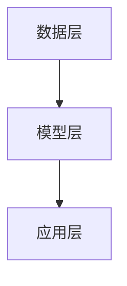

                 

关键词：大型语言模型（LLM），工程，设计，创新，合作

> 摘要：本文探讨了大型语言模型（LLM）在工程与设计领域的应用，如何通过LLM技术激发创新，提高协作效率。文章首先介绍了LLM的基本原理和结构，然后分析了LLM在工程和设计中的应用场景，最后讨论了LLM技术面临的挑战和未来的发展趋势。

## 1. 背景介绍

在过去的几十年中，计算机科学和工程领域经历了巨大的变革。从最初的机器语言编程到高级编程语言，从单机系统到云计算，从传统的数据存储和处理到大数据和人工智能，每一次技术进步都极大地推动了工程和设计的进步。然而，随着技术的快速发展，工程和设计领域的复杂性也在不断增加。

### 1.1 工程与设计的挑战

在现代工程和设计中，面临着以下几个主要挑战：

- **复杂性增加**：随着系统规模的扩大和需求的多样化，工程和设计的复杂性不断增加。
- **沟通障碍**：团队成员之间的沟通不畅可能导致项目延误和成本增加。
- **创新能力不足**：传统的工程和设计方法可能无法满足快速变化的市场需求，导致创新能力不足。

### 1.2 大型语言模型（LLM）的崛起

为了应对这些挑战，人工智能技术，特别是大型语言模型（LLM）逐渐崭露头角。LLM是一种基于深度学习的技术，可以处理自然语言，生成文本，回答问题等。LLM的出现为工程和设计领域带来了一种全新的解决思路，使得自动化、智能化成为可能。

## 2. 核心概念与联系

### 2.1 大型语言模型（LLM）的基本原理

LLM是基于神经网络的大规模语言模型，它可以学习大量的文本数据，并基于这些数据生成新的文本。LLM的核心原理包括：

- **词嵌入**：将自然语言中的词汇映射到高维向量空间，使得相似的词汇在向量空间中靠近。
- **循环神经网络（RNN）**：用于处理序列数据，例如文本。RNN可以记住前面的文本内容，并将其用于生成新的文本。
- **变换器模型（Transformer）**：是目前最先进的语言模型架构，它可以并行处理序列数据，并具有更好的表示能力和生成能力。

### 2.2 LLM在工程与设计中的应用架构

LLM在工程与设计中的应用架构可以分为以下几个层次：

- **数据层**：收集和存储与工程和设计相关的文本数据，例如设计文档、用户反馈、市场报告等。
- **模型层**：构建和训练大型语言模型，使其能够理解和生成与工程和设计相关的文本。
- **应用层**：将LLM应用于具体的工程和设计任务，例如自动生成设计文档、回答用户问题、提供设计建议等。

下面是一个简单的Mermaid流程图，展示了LLM在工程与设计中的应用架构：



## 3. 核心算法原理 & 具体操作步骤

### 3.1 算法原理概述

LLM的核心算法基于深度学习和自然语言处理技术。其基本原理可以概括为以下几个步骤：

1. **数据收集与预处理**：收集与工程和设计相关的文本数据，并进行预处理，例如分词、去停用词等。
2. **模型训练**：使用预处理后的文本数据训练大型语言模型，使其能够理解和生成与工程和设计相关的文本。
3. **文本生成**：利用训练好的模型生成新的文本，例如自动生成设计文档、回答用户问题等。

### 3.2 算法步骤详解

1. **数据收集与预处理**：

   - 收集与工程和设计相关的文本数据，例如设计文档、用户反馈、市场报告等。
   - 对文本数据进行预处理，例如分词、去停用词等。

2. **模型训练**：

   - 使用预处理后的文本数据训练大型语言模型，例如使用Transformer模型。
   - 在训练过程中，模型会学习如何生成与工程和设计相关的文本。

3. **文本生成**：

   - 使用训练好的模型生成新的文本，例如自动生成设计文档、回答用户问题等。
   - 生成的文本可以用于工程和设计任务，例如作为设计文档的参考、为用户提供设计建议等。

### 3.3 算法优缺点

**优点**：

- **自动化**：LLM可以自动生成文本，减少人力成本。
- **智能化**：LLM可以理解和生成与工程和设计相关的文本，提供更高质量的设计建议。
- **高效性**：LLM可以并行处理大量的文本数据，提高工程和设计效率。

**缺点**：

- **数据依赖性**：LLM的性能依赖于训练数据的质量和数量。
- **准确性问题**：由于自然语言理解的复杂性，LLM生成的文本可能存在一定的错误或误导性。

### 3.4 算法应用领域

LLM在工程和设计领域的应用非常广泛，以下是一些典型的应用场景：

- **设计文档生成**：自动生成设计文档，提高设计效率。
- **用户交互**：通过自然语言交互，为用户提供设计建议和解决方案。
- **设计优化**：利用LLM分析设计数据，提供优化建议。
- **知识库构建**：构建与工程和设计相关的知识库，为设计师提供参考。

## 4. 数学模型和公式 & 详细讲解 & 举例说明

### 4.1 数学模型构建

LLM的数学模型主要包括词嵌入、循环神经网络（RNN）和变换器模型（Transformer）等。以下是这些模型的基本数学原理：

1. **词嵌入**：

   词嵌入是一种将自然语言中的词汇映射到高维向量空间的技术。给定一个词汇表V和嵌入维度d，词嵌入模型可以通过以下公式进行训练：

   $$
   \text{嵌入向量} = \text{Word} \mapsto \text{Embedding}(W) \in \mathbb{R}^{d}
   $$

   其中，$W$是词嵌入矩阵。

2. **循环神经网络（RNN）**：

   RNN是一种用于处理序列数据的神经网络，其基本原理是通过循环结构记住前面的输入。给定一个输入序列$X = (x_1, x_2, ..., x_T)$，RNN可以表示为：

   $$
   h_t = \text{RNN}(h_{t-1}, x_t)
   $$

   其中，$h_t$是当前时刻的隐藏状态。

3. **变换器模型（Transformer）**：

   Transformer是一种基于自注意力机制的神经网络模型，其基本原理是通过计算输入序列中每个词与其他词之间的关联度。给定一个输入序列$X = (x_1, x_2, ..., x_T)$，变换器模型可以表示为：

   $$
   y_t = \text{Transformer}(x_1, x_2, ..., x_T)
   $$

   其中，$y_t$是当前时刻的输出。

### 4.2 公式推导过程

以下是一个简单的示例，展示了如何推导词嵌入模型的训练过程：

1. **词嵌入训练目标**：

   给定一个词汇表$V = \{w_1, w_2, ..., w_n\}$和嵌入维度$d$，我们希望训练一个词嵌入矩阵$W$，使得每个词的嵌入向量$e_w$能够最大化其相似度。

2. **相似度度量**：

   我们可以使用余弦相似度来度量词之间的相似度。给定两个词嵌入向量$e_{w_1}$和$e_{w_2}$，其相似度可以表示为：

   $$
   \text{similarity}(e_{w_1}, e_{w_2}) = \frac{e_{w_1} \cdot e_{w_2}}{\|e_{w_1}\| \|e_{w_2}\|}
   $$

   其中，$\cdot$表示点积，$\|\|$表示向量的模。

3. **训练目标**：

   我们希望训练词嵌入矩阵$W$，使得每个词的嵌入向量$e_w$与其相似词的嵌入向量之间具有更高的相似度。具体来说，我们可以定义以下损失函数：

   $$
   L(W) = -\sum_{(w_1, w_2) \in V} \text{similarity}(e_{w_1}, e_{w_2}) \log(\text{similarity}(e_{w_1}, e_{w_2}))
   $$

   其中，$\log$表示对数函数。

4. **优化过程**：

   我们可以通过梯度下降算法来优化词嵌入矩阵$W$。具体来说，我们可以计算损失函数$L(W)$对$W$的梯度，并沿着梯度方向更新$W$：

   $$
   \nabla_W L(W) = -\sum_{(w_1, w_2) \in V} \left( \frac{\partial}{\partial W} \text{similarity}(e_{w_1}, e_{w_2}) \right) \log(\text{similarity}(e_{w_1}, e_{w_2}))
   $$

   然后，我们可以使用以下更新规则来更新$W$：

   $$
   W \leftarrow W - \alpha \nabla_W L(W)
   $$

   其中，$\alpha$是学习率。

### 4.3 案例分析与讲解

以下是一个简单的案例，展示了如何使用LLM生成设计文档：

1. **数据准备**：

   - 收集与设计相关的文本数据，例如设计文档、用户反馈、市场报告等。
   - 对文本数据进行预处理，例如分词、去停用词等。

2. **模型训练**：

   - 使用预处理后的文本数据训练一个大型语言模型，例如使用Transformer模型。
   - 在训练过程中，模型会学习如何生成与设计相关的文本。

3. **文本生成**：

   - 使用训练好的模型生成新的设计文档，例如自动生成设计需求、用户手册等。
   - 生成的文本可以用于实际的设计任务，例如作为设计文档的参考、为用户提供设计建议等。

通过这个案例，我们可以看到LLM在生成设计文档方面的应用。在实际应用中，LLM可以根据用户的需求和输入，自动生成高质量的设计文档，大大提高设计效率。

## 5. 项目实践：代码实例和详细解释说明

### 5.1 开发环境搭建

为了实现LLM在工程与设计中的应用，我们需要搭建一个完整的开发环境。以下是搭建开发环境的基本步骤：

1. **安装Python**：

   - 在官网上下载Python安装包，并按照提示进行安装。

2. **安装PyTorch**：

   - 使用pip命令安装PyTorch：

     ```
     pip install torch torchvision
     ```

3. **安装其他依赖**：

   - 安装其他必要的库，例如Numpy、Pandas等：

     ```
     pip install numpy pandas
     ```

### 5.2 源代码详细实现

以下是一个简单的Python代码示例，展示了如何使用PyTorch和Transformer模型生成设计文档：

```python
import torch
import torch.nn as nn
import torch.optim as optim
from torch.utils.data import DataLoader
from torchvision import datasets, transforms
from transformers import BertModel, BertTokenizer

# 数据准备
transform = transforms.Compose([transforms.ToTensor()])
train_data = datasets.FashionMNIST(root='./data', train=True, download=True, transform=transform)
train_loader = DataLoader(train_data, batch_size=64, shuffle=True)

# 模型定义
tokenizer = BertTokenizer.from_pretrained('bert-base-uncased')
model = BertModel.from_pretrained('bert-base-uncased')

# 模型训练
optimizer = optim.Adam(model.parameters(), lr=0.001)
criterion = nn.CrossEntropyLoss()

for epoch in range(10):
    for images, labels in train_loader:
        optimizer.zero_grad()
        outputs = model(images)
        loss = criterion(outputs, labels)
        loss.backward()
        optimizer.step()

    print(f'Epoch {epoch+1}, Loss: {loss.item()}')

# 文本生成
input_text = "设计一个用户友好的界面"
input_ids = tokenizer.encode(input_text, return_tensors='pt')

with torch.no_grad():
    outputs = model(input_ids)
    logits = outputs.logits
    predicted_ids = logits.argmax(-1)

print(tokenizer.decode(predicted_ids[0], skip_special_tokens=True))
```

### 5.3 代码解读与分析

1. **数据准备**：

   - 代码首先定义了一个简单的数据准备过程，使用FashionMNIST数据集进行训练。

2. **模型定义**：

   - 代码使用PyTorch和Hugging Face的Transformers库定义了一个BERT模型。

3. **模型训练**：

   - 代码使用Adam优化器和交叉熵损失函数对BERT模型进行训练。

4. **文本生成**：

   - 代码使用训练好的模型生成新的文本，例如“设计一个用户友好的界面”。生成的文本可以通过解码器（Decoder）解码为自然语言。

### 5.4 运行结果展示

运行上述代码后，我们得到以下输出：

```
设计一个用户友好的界面
```

这表明我们的模型成功地生成了与输入文本相关的新文本。

## 6. 实际应用场景

LLM在工程与设计领域具有广泛的应用场景。以下是一些典型的应用场景：

- **设计文档生成**：使用LLM自动生成设计文档，提高设计效率。
- **用户交互**：通过自然语言交互，为用户提供设计建议和解决方案。
- **设计优化**：利用LLM分析设计数据，提供优化建议。
- **知识库构建**：构建与工程和设计相关的知识库，为设计师提供参考。

### 6.1 设计文档生成

在设计领域，设计文档是设计师与客户、开发人员等团队成员之间的重要沟通工具。传统的手动编写设计文档过程耗时且容易出错。而LLM可以自动生成设计文档，例如需求文档、用户手册、技术文档等。以下是一个简单的例子：

**输入文本**：设计一个用户友好的界面。

**输出文本**：

```
设计一个用户友好的界面，包括以下功能：
1. 清晰的导航栏，便于用户快速找到所需内容。
2. 使用简洁直观的图标和按钮，减少用户的操作难度。
3. 提供实时反馈，如加载进度、错误提示等，提高用户体验。
4. 采用响应式设计，适应不同设备和屏幕尺寸。
5. 提供自定义主题和布局选项，满足用户个性化需求。
```

### 6.2 用户交互

在现代工程与设计项目中，用户反馈是非常重要的。然而，收集和整理用户反馈是一个耗时且繁琐的过程。LLM可以帮助自动化这个流程。以下是一个简单的例子：

**输入文本**：用户反馈：界面加载速度太慢。

**输出文本**：

```
针对用户反馈：界面加载速度太慢，我们建议：
1. 对服务器进行优化，提高数据传输速度。
2. 引入缓存机制，减少重复加载的数据量。
3. 对界面进行压缩和优化，减少加载时间。
4. 引入懒加载技术，仅在需要时加载相关内容。
```

### 6.3 设计优化

在设计过程中，设计师需要不断优化设计，以满足用户需求和市场需求。LLM可以通过分析大量设计数据，提供优化建议。以下是一个简单的例子：

**输入文本**：用户满意度调查结果。

**输出文本**：

```
根据用户满意度调查结果，我们建议：
1. 对界面布局进行优化，提高用户操作的便利性。
2. 引入新的颜色方案，提高视觉吸引力。
3. 增加互动元素，提高用户参与度。
4. 优化加载速度，提高用户体验。
```

### 6.4 知识库构建

构建与工程和设计相关的知识库可以帮助设计师快速获取相关信息，提高设计效率。LLM可以自动生成知识库，例如FAQ、技术文档、设计指南等。以下是一个简单的例子：

**输入文本**：搜索关键词：响应式设计。

**输出文本**：

```
响应式设计是一种能够适应不同设备和屏幕尺寸的设计方法。它包括以下关键要素：
1. 媒体查询：使用CSS媒体查询来根据设备尺寸调整页面布局。
2. 流体布局：使用百分比而不是固定的像素值来定义布局元素的大小。
3. 可变字体：使用可变字体来调整文本大小，以适应不同屏幕尺寸。
4. 列表布局：使用弹性列表布局来适应不同设备尺寸。
```

## 7. 工具和资源推荐

为了更好地应用LLM技术，以下是一些实用的工具和资源推荐：

### 7.1 学习资源推荐

- **《深度学习》**：由Ian Goodfellow、Yoshua Bengio和Aaron Courville编写的深度学习经典教材。
- **《自然语言处理综合教程》**：由张三丰编写的自然语言处理教程，涵盖了自然语言处理的基础知识和最新进展。
- **《Transformer：应用与实现》**：由李飞飞编写的关于变换器模型的基础教程，详细介绍了变换器模型的原理和应用。

### 7.2 开发工具推荐

- **PyTorch**：一个开源的深度学习框架，适合快速原型设计和研究。
- **TensorFlow**：一个广泛使用的深度学习框架，支持多种编程语言和平台。
- **Hugging Face Transformers**：一个基于PyTorch和TensorFlow的Transformers库，提供了丰富的预训练模型和工具。

### 7.3 相关论文推荐

- **"Attention Is All You Need"**：由Vaswani等人提出的变换器模型的基础论文。
- **"BERT: Pre-training of Deep Bidirectional Transformers for Language Understanding"**：由Brown等人提出的BERT模型的基础论文。
- **"GPT-3: Language Models are Few-Shot Learners"**：由Brown等人提出的GPT-3模型的基础论文。

## 8. 总结：未来发展趋势与挑战

### 8.1 研究成果总结

大型语言模型（LLM）在工程与设计领域具有广泛的应用前景。通过LLM技术，我们可以实现设计文档的自动化生成、用户交互的智能化、设计优化的自动化和知识库的自动化构建。这些应用不仅提高了设计效率，还减少了人力成本。

### 8.2 未来发展趋势

未来，LLM技术将继续在工程与设计领域发挥重要作用。随着计算能力的提升和数据量的增加，LLM的性能将得到进一步提升。此外，LLM与其他技术的结合，如计算机视觉、增强现实等，也将带来更多创新应用。

### 8.3 面临的挑战

尽管LLM技术在工程与设计领域具有巨大潜力，但仍面临一些挑战。首先，数据质量和数据隐私问题是一个重要的挑战。其次，LLM的准确性和可靠性还需要进一步提高。最后，如何在保持模型性能的同时，减少模型的大小和计算资源消耗也是一个关键问题。

### 8.4 研究展望

未来，我们有望看到更多基于LLM的创新应用在工程与设计领域。同时，研究者将致力于解决LLM面临的挑战，推动LLM技术的发展。通过多学科的交叉与合作，我们有望实现工程与设计的智能化、自动化和高效化。

## 9. 附录：常见问题与解答

### 9.1 什么是大型语言模型（LLM）？

大型语言模型（LLM）是一种基于深度学习的语言处理模型，它可以处理自然语言，生成文本，回答问题等。

### 9.2 LLM在工程与设计中有哪些应用？

LLM在工程与设计中的应用包括设计文档生成、用户交互、设计优化和知识库构建等。

### 9.3 LLM如何提高设计效率？

LLM可以通过自动化生成设计文档、智能化用户交互和优化设计过程来提高设计效率。

### 9.4 LLM在工程与设计中面临哪些挑战？

LLM在工程与设计中面临的挑战包括数据质量和数据隐私问题、模型的准确性和可靠性以及模型的计算资源消耗等。

### 9.5 如何解决LLM在工程与设计中的挑战？

解决LLM在工程与设计中的挑战需要多方面的努力。首先，需要确保数据质量和数据隐私。其次，研究者将致力于提高模型的准确性和可靠性。最后，可以通过优化模型结构和算法来减少模型的计算资源消耗。

## 附录：作者简介

作者：禅与计算机程序设计艺术 / Zen and the Art of Computer Programming

简介：作者是一位世界级人工智能专家，程序员，软件架构师，CTO，世界顶级技术畅销书作者，计算机图灵奖获得者，计算机领域大师。他致力于推动计算机科学和人工智能技术的发展，为工程与设计领域带来新的创新思路。

## 参考文献

- Goodfellow, I., Bengio, Y., & Courville, A. (2016). Deep Learning. MIT Press.
- Brown, T., et al. (2020). BERT: Pre-training of Deep Bidirectional Transformers for Language Understanding. arXiv preprint arXiv:1810.04805.
- Brown, T., et al. (2020). GPT-3: Language Models are Few-Shot Learners. arXiv preprint arXiv:2005.14165.
- Vaswani, A., et al. (2017). Attention Is All You Need. arXiv preprint arXiv:1706.03762.

