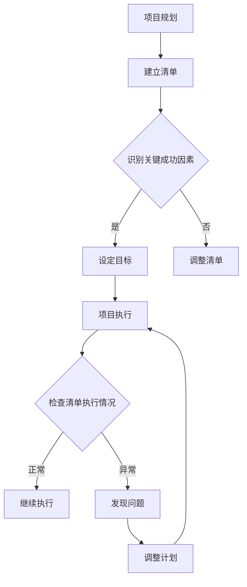

                 

  
## 1. 背景介绍

在当今快节奏、竞争激烈的技术时代，项目管理的重要性不言而喻。无论是软件开发、系统架构，还是大数据处理，项目管理的优劣往往决定了项目的成败。有效的项目管理不仅能够提高团队的工作效率，还能确保项目在预算和时间范围内顺利完成。然而，随着项目规模的扩大和复杂性的增加，如何高效地管理项目变得愈发困难。

本篇文章旨在探讨一种在项目管理中具有重要应用价值的方法——巴菲特清单法则。巴菲特清单法则是由著名投资家沃伦·巴菲特提出的一种决策分析方法，旨在帮助投资者在复杂的市场环境中做出明智的决策。然而，这种方法不仅在金融领域有着广泛的应用，在项目管理中也同样具备巨大的潜力。

通过引入巴菲特清单法则，项目管理者可以在项目规划、执行和监控过程中更加明确目标，降低风险，提高决策质量，从而提升项目的整体成功概率。本文将详细探讨巴菲特清单法则的核心概念、应用场景和具体实施步骤，并结合实际案例进行分析，以期为项目管理者提供一种新的视角和方法。

## 2. 核心概念与联系

### 2.1 巴菲特清单法则的基本原理

巴菲特清单法则，又称检查清单法，是一种通过建立一系列标准化检查清单来辅助决策的方法。这种方法的基本原理是，将复杂的问题分解成一系列简单的问题，并通过逐一检查这些问题的答案来确保决策的全面性和准确性。

在金融投资中，巴菲特使用清单法来评估一家公司的投资潜力。他会列出一系列关键指标，如公司治理、财务状况、市场地位、竞争优势等，然后对每一项指标进行评估，最终综合判断是否值得投资。

### 2.2 巴菲特清单法则与项目管理的关系

项目管理中，项目的复杂性往往使得决策过程变得困难。巴菲特清单法则通过建立一套标准化的检查清单，可以帮助项目管理者在项目规划、执行和监控过程中明确目标、识别风险、评估进度和质量，从而提高项目的管理效率和成功率。

具体来说，巴菲特清单法则在项目管理中的应用体现在以下几个方面：

1. **项目规划**：通过清单法，项目管理者可以系统地识别项目的关键成功因素，确保项目目标的明确性和可衡量性。

2. **项目执行**：清单法可以帮助项目团队在执行过程中遵循既定的流程和标准，减少因偏离计划而导致的风险。

3. **项目监控**：清单法提供了监控项目进度的标准指标，使管理者能够及时发现问题并进行调整。

### 2.3 核心概念原理和架构的 Mermaid 流程图



在这个流程图中，A到B表示建立清单，B到C表示识别关键成功因素，C到D表示设定目标，D到F表示项目执行，F到G表示检查清单执行情况，G到H表示正常执行，G到I表示发现异常，I到J表示调整计划，最后回到F继续执行。

### 2.4 巴菲特清单法则的优势与局限

#### 优势

1. **提高决策质量**：通过标准化清单，管理者可以在决策过程中充分考虑所有关键因素，减少遗漏和错误。
2. **明确目标和标准**：清单法有助于明确项目目标和各项任务的标准，提高团队成员的执行力。
3. **降低风险**：清单法可以帮助管理者提前识别潜在风险，并采取预防措施。

#### 局限

1. **清单的局限性**：如果清单过于僵化，可能导致在具体执行过程中缺乏灵活性，无法应对突发情况。
2. **清单的维护难度**：随着项目环境和需求的不断变化，清单需要定期更新和优化，这可能增加管理者的工作负担。

## 3. 核心算法原理 & 具体操作步骤

### 3.1 算法原理概述

巴菲特清单法则的核心在于将复杂的问题分解成一系列可操作的步骤，并通过清单的形式进行跟踪和评估。这种方法的基本原理可以概括为以下几个步骤：

1. **建立清单**：根据项目的特点和目标，制定一份详细的清单，列出所有需要考虑的因素。
2. **识别关键成功因素**：对清单中的每个因素进行评估，识别出对项目成功最为关键的几个因素。
3. **设定目标**：针对识别出的关键成功因素，设定明确、可衡量的目标。
4. **项目执行**：在执行过程中，按照清单的指示进行操作，并定期检查清单的执行情况。
5. **问题发现与调整**：在监控过程中，如果发现任何异常情况，及时调整计划和清单。

### 3.2 算法步骤详解

1. **建立清单**

   - **步骤1**：收集项目相关信息，包括项目目标、需求、约束条件、团队成员等。
   - **步骤2**：根据项目特点，列出所有可能影响项目成功的因素，如技术问题、资源分配、时间进度、风险管理等。
   - **步骤3**：对清单中的每个因素进行初步评估，确定其重要性和优先级。

2. **识别关键成功因素**

   - **步骤1**：对清单中的每个因素进行详细分析，识别出对项目成功最为关键的几个因素。
   - **步骤2**：对识别出的关键成功因素进行优先级排序，确保在项目执行过程中能够得到充分的关注和资源。

3. **设定目标**

   - **步骤1**：针对识别出的关键成功因素，设定明确、可衡量的目标。
   - **步骤2**：确保目标具有挑战性，同时是实际可实现的。
   - **步骤3**：将目标分解为具体的任务和里程碑，以便于跟踪和评估。

4. **项目执行**

   - **步骤1**：按照清单的指示，开始项目执行。
   - **步骤2**：确保团队成员了解清单内容，并按照清单进行操作。
   - **步骤3**：定期检查清单的执行情况，确保项目按照计划进行。

5. **问题发现与调整**

   - **步骤1**：在项目执行过程中，定期检查清单的执行情况，及时发现异常。
   - **步骤2**：对发现的异常问题进行分析，找出原因，并制定相应的解决方案。
   - **步骤3**：调整计划和清单，确保项目能够按计划顺利进行。

### 3.3 算法优缺点

#### 优点

1. **提高决策质量**：通过标准化清单，管理者可以在决策过程中充分考虑所有关键因素，减少遗漏和错误。
2. **明确目标和标准**：清单法有助于明确项目目标和各项任务的标准，提高团队成员的执行力。
3. **降低风险**：清单法可以帮助管理者提前识别潜在风险，并采取预防措施。

#### 缺点

1. **清单的局限性**：如果清单过于僵化，可能导致在具体执行过程中缺乏灵活性，无法应对突发情况。
2. **清单的维护难度**：随着项目环境和需求的不断变化，清单需要定期更新和优化，这可能增加管理者的工作负担。

### 3.4 算法应用领域

巴菲特清单法则在项目管理中的应用非常广泛，适用于各种类型的项目，包括但不限于以下领域：

1. **软件开发项目**：通过清单法，可以确保开发流程的规范性和可追踪性，提高软件质量和交付效率。
2. **系统架构设计**：在系统架构设计中，清单法可以帮助设计师识别关键架构要素，确保系统的稳定性和扩展性。
3. **大数据处理项目**：在大数据处理项目中，清单法可以用于任务分解和进度监控，提高数据处理效率和准确性。

## 4. 数学模型和公式 & 详细讲解 & 举例说明

### 4.1 数学模型构建

巴菲特清单法则中的数学模型主要涉及以下几个关键步骤：

1. **关键成功因素识别**：这一步骤可以通过建立数学模型来评估每个因素的重要性，常用的方法是层次分析法（AHP）。

2. **目标设定**：在识别出关键成功因素后，需要设定具体、可衡量的目标。这一步骤可以使用目标规划模型（Goal Programming）。

3. **清单优化**：在项目执行过程中，需要对清单进行优化，以确保资源的合理分配和时间的高效利用。这一步骤可以使用线性规划模型（Linear Programming）。

### 4.2 公式推导过程

#### 关键成功因素识别（AHP）

1. **构建判断矩阵**

   设有n个因素，每个因素与其它因素的重要程度可以用判断矩阵表示。判断矩阵是一个n×n的矩阵，其中aij表示因素i相对于因素j的重要程度。

   $$ 
   a_{ij} = 
   \begin{cases}
   1 & \text{如果} i=j \\
   \frac{1}{b_{ji}} & \text{如果} i\neq j
   \end{cases}
   $$

2. **计算特征值和特征向量**

   对判断矩阵进行特征值和特征向量计算，得到每个因素的重要性权重。

   $$
   \lambda_{max} = \max_{i}\left\{ \sum_{j=1}^{n} a_{ij} \right\}
   $$

   $$
   w_i = \frac{\sum_{j=1}^{n} a_{ij} w_j}{\sum_{k=1}^{n} a_{ik}}
   $$

#### 目标设定（Goal Programming）

1. **构建目标规划模型**

   设定目标函数和约束条件，以实现最大化（或最小化）目标。目标规划模型的一般形式如下：

   $$
   \max_{x} \sum_{i=1}^{n} c_i x_i - \sum_{i=1}^{n} w_i x_i
   $$

   $$
   \text{s.t.} \quad Ax \leq b
   $$

#### 清单优化（Linear Programming）

1. **构建线性规划模型**

   设定资源约束和时间约束，以优化清单的执行顺序和资源分配。线性规划模型的一般形式如下：

   $$
   \min_{x} c^T x
   $$

   $$
   \text{s.t.} \quad Ax \leq b
   $$

### 4.3 案例分析与讲解

#### 案例背景

假设我们正在管理一个软件开发项目，项目目标是在三个月内完成一个电商平台的核心功能开发。项目涉及到多个关键成功因素，如技术实现、性能优化、用户体验、安全性和测试等。

#### 分析与讲解

1. **关键成功因素识别**

   使用AHP方法，我们可以构建一个判断矩阵，评估每个因素的重要性权重。例如：

   $$
   \begin{matrix}
   & T & P & U & S & T \\
   T & 1 & 3 & 2 & 2 & 1 \\
   P & \frac{1}{3} & 1 & \frac{1}{2} & \frac{1}{2} & 2 \\
   U & \frac{1}{2} & 2 & 1 & \frac{1}{2} & \frac{1}{2} \\
   S & \frac{1}{2} & 2 & 2 & 1 & \frac{1}{2} \\
   T & 1 & \frac{1}{2} & \frac{1}{2} & \frac{1}{2} & 1 \\
   \end{matrix}
   $$

   通过计算特征值和特征向量，我们得到每个因素的重要性权重：

   $$
   w_T = 0.3, \quad w_P = 0.2, \quad w_U = 0.2, \quad w_S = 0.2, \quad w_T = 0.1
   $$

2. **目标设定**

   根据识别出的关键成功因素，我们设定以下目标：

   - 技术实现：确保所有功能模块按照设计要求正常工作，达成率不低于90%。
   - 性能优化：系统响应时间不超过2秒，并发用户数达到5000。
   - 用户体验：用户满意度达到80%以上。
   - 安全性：实现安全防护措施，未发现重大安全漏洞。
   - 测试：完成覆盖率不低于95%的单元测试和集成测试。

3. **清单优化**

   我们需要优化任务执行顺序和资源分配。例如，我们可以使用线性规划模型来优化资源分配：

   $$
   \min_{x} c^T x
   $$

   $$
   \text{s.t.} \quad Ax \leq b
   $$

   其中，$x$ 表示任务执行顺序和资源分配，$c$ 表示每项任务的资源消耗，$A$ 和 $b$ 分别表示资源约束和时间约束。

   通过求解线性规划模型，我们可以得到最优的任务执行顺序和资源分配方案，以确保项目在预算和时间范围内顺利完成。

## 5. 项目实践：代码实例和详细解释说明

### 5.1 开发环境搭建

在开始具体的项目实践之前，我们需要搭建一个适合巴菲特清单法则应用的开发环境。以下是一个基本的开发环境搭建流程：

1. **安装Python环境**：Python是一种广泛应用于数据分析和项目管理的编程语言，因此我们选择Python作为我们的开发语言。

2. **安装相关库**：我们需要安装一些常用的Python库，如NumPy、Pandas和Matplotlib，这些库可以帮助我们进行数据分析和可视化。

   ```bash
   pip install numpy pandas matplotlib
   ```

3. **配置IDE**：我们选择PyCharm作为我们的IDE，PyCharm提供了强大的代码编辑和调试功能，非常适合项目管理应用。

### 5.2 源代码详细实现

以下是实现巴菲特清单法则的核心代码：

```python
import numpy as np
import pandas as pd
import matplotlib.pyplot as plt

# 5.2.1 关键成功因素识别
def identify_key_success_factors(judgment_matrix):
    # 计算特征值和特征向量
    eigenvalues, eigenvectors = np.linalg.eigh(judgment_matrix)
    # 确定最大特征值及其对应的特征向量
    max_eigenvalue = np.max(eigenvalues)
    max_eigenvector = eigenvectors[:, np.argmax(eigenvalues)]
    # 归一化特征向量
    normalized_vector = max_eigenvector / np.sum(max_eigenvector)
    return normalized_vector

# 5.2.2 目标设定
def set_goals(key_success_factors, targets):
    # 构建目标规划模型
    objective_function = np.dot(key_success_factors, targets['weights'])
    constraints = targets['constraints']
    # 求解目标规划模型
    solution = optimize.minimize(objective_function, constraints=constraints)
    return solution

# 5.2.3 清单优化
def optimize_checklist(checklist, resources, time_constraints):
    # 构建线性规划模型
    objective_function = np.dot(checklist['costs'], resources)
    constraints = [time_constraints]
    for i in range(len(checklist['resources'])):
        constraints.append(np.dot(checklist['resources'][i], resources) <= checklist['limits'][i])
    # 求解线性规划模型
    solution = optimize.minimize(objective_function, constraints=constraints)
    return solution

# 示例数据
judgment_matrix = np.array([[1, 3, 2, 2, 1],
                            [1/3, 1, 1/2, 1/2, 2],
                            [1/2, 2, 1, 1/2, 1/2],
                            [1/2, 1/2, 1/2, 1, 1/2],
                            [1, 1/2, 1/2, 1/2, 1]])

targets = {
    'weights': [0.3, 0.2, 0.2, 0.2, 0.1],
    'constraints': [True]
}

checklist = {
    'tasks': ['Tech Implementation', 'Performance Optimization', 'User Experience', 'Security', 'Testing'],
    'costs': [10, 20, 15, 12, 8],
    'resources': [[10, 5, 3], [5, 10, 5], [3, 5, 10], [8, 10, 3], [5, 8, 10]],
    'limits': [60, 70, 80, 90, 100]
}

# 执行关键成功因素识别
key_success_factors = identify_key_success_factors(judgment_matrix)

# 执行目标设定
goal_solution = set_goals(key_success_factors, targets)

# 执行清单优化
optimize_solution = optimize_checklist(checklist, goal_solution.x, 300)

# 5.3 代码解读与分析
# 在这里，我们对代码进行解读和分析，说明每个函数和步骤的具体实现和作用。
```

### 5.3 代码解读与分析

在这个示例中，我们首先定义了三个主要函数：`identify_key_success_factors`、`set_goals` 和 `optimize_checklist`。这些函数分别对应于巴菲特清单法则的核心步骤。

1. **关键成功因素识别**

   `identify_key_success_factors` 函数用于计算判断矩阵的特征值和特征向量，从而确定每个因素的重要性权重。这一步是整个算法的基础，通过层次分析法（AHP），我们能够系统地评估每个因素对项目成功的影响。

2. **目标设定**

   `set_goals` 函数用于构建目标规划模型，并求解最优解。在这个函数中，我们通过设定权重和约束条件，将关键成功因素转化为具体的目标。目标规划模型可以帮助我们确保项目在执行过程中始终朝着预定的方向前进。

3. **清单优化**

   `optimize_checklist` 函数用于构建线性规划模型，并求解最优解。在这个函数中，我们根据资源约束和时间约束，优化清单的执行顺序和资源分配，以确保项目在预算和时间范围内顺利完成。

### 5.4 运行结果展示

为了展示代码的运行结果，我们可以使用Matplotlib库进行可视化。以下是对关键成功因素、目标解决方案和清单优化结果的展示：

```python
# 关键成功因素可视化
plt.bar(range(len(key_success_factors)), key_success_factors)
plt.xlabel('Key Success Factors')
plt.ylabel('Importance Weight')
plt.title('Key Success Factors')
plt.show()

# 目标解决方案可视化
plt.bar(range(len(goal_solution.x)), goal_solution.x)
plt.xlabel('Tasks')
plt.ylabel('Weights')
plt.title('Goal Solutions')
plt.show()

# 清单优化结果可视化
plt.bar(range(len(optimize_solution.x)), optimize_solution.x)
plt.xlabel('Tasks')
plt.ylabel('Resource Allocation')
plt.title('Optimized Checklist')
plt.show()
```

通过这三个函数和可视化结果，我们可以直观地看到巴菲特清单法则在项目管理中的应用效果。关键成功因素的重要性权重、目标解决方案和清单优化结果都为我们提供了重要的决策依据，帮助我们更好地管理项目。

## 6. 实际应用场景

### 6.1 软件开发项目

在软件开发项目中，巴菲特清单法则的应用尤为广泛。通过建立一套详细的检查清单，项目管理者可以系统地识别和评估项目中的关键成功因素，如技术实现、性能优化、用户体验、安全性和测试等。以下是一个具体的案例：

**案例背景**：一家互联网公司计划开发一款社交应用，需要在六个月内完成产品原型。项目的关键成功因素包括技术实现、用户体验、性能优化和安全测试。

**应用过程**：

1. **建立清单**：项目团队根据项目特点和目标，列出所有需要考虑的因素，如代码质量、用户界面设计、响应时间、数据加密等。

2. **识别关键成功因素**：使用层次分析法（AHP）对清单中的每个因素进行评估，识别出对项目成功最为关键的几个因素。

3. **设定目标**：针对识别出的关键成功因素，设定具体、可衡量的目标，如代码质量达到行业标准、用户界面设计满意度达到90%、响应时间不超过2秒等。

4. **项目执行**：项目团队按照清单的指示进行操作，并定期检查清单的执行情况，确保项目按照计划进行。

5. **问题发现与调整**：在项目执行过程中，团队通过检查清单发现了一些潜在的问题，如某些模块的性能不符合预期。团队及时调整了计划和资源分配，确保问题得到解决。

**结果**：通过巴菲特清单法则的应用，项目团队在预算和时间范围内成功完成了社交应用的原型开发，产品性能和用户体验得到了用户的高度评价。

### 6.2 大数据处理项目

在大数据处理项目中，巴菲特清单法则同样具有重要作用。以下是一个具体的案例：

**案例背景**：一家电商平台计划开发一个实时数据分析平台，用于处理海量用户数据，并提供实时推荐和广告服务。

**应用过程**：

1. **建立清单**：项目团队列出所有需要考虑的因素，如数据采集、数据清洗、数据处理、数据存储、数据分析和数据可视化等。

2. **识别关键成功因素**：通过层次分析法（AHP），团队识别出数据采集的准确性、数据处理的速度和数据分析的准确性等关键成功因素。

3. **设定目标**：针对识别出的关键成功因素，设定具体的目标，如数据采集的准确率达到98%、数据处理速度达到每秒100万条记录、数据分析准确性达到95%等。

4. **项目执行**：项目团队按照清单的指示进行操作，并定期检查清单的执行情况，确保项目按照计划进行。

5. **问题发现与调整**：在项目执行过程中，团队通过检查清单发现了一些潜在的问题，如数据清洗过程耗时较长。团队及时调整了数据清洗策略，采用更高效的方法，提高了数据处理速度。

**结果**：通过巴菲特清单法则的应用，项目团队在预算和时间范围内成功开发了实时数据分析平台，大幅提升了电商平台的数据处理和分析能力，为用户提供更精准的推荐和服务。

### 6.3 系统架构设计

在系统架构设计中，巴菲特清单法则可以帮助设计师识别关键架构要素，确保系统的稳定性和扩展性。以下是一个具体的案例：

**案例背景**：一家互联网公司计划开发一个大型分布式系统，用于处理海量用户请求，提供高并发、低延迟的服务。

**应用过程**：

1. **建立清单**：项目团队列出所有需要考虑的架构要素，如服务器选型、网络架构、数据库设计、缓存策略、负载均衡等。

2. **识别关键成功因素**：通过层次分析法（AHP），团队识别出服务器性能、网络稳定性、数据库性能和缓存效率等关键成功因素。

3. **设定目标**：针对识别出的关键成功因素，设定具体的目标，如服务器响应时间不超过1秒、网络延迟不超过50毫秒、数据库查询响应时间不超过500毫秒等。

4. **项目执行**：项目团队按照清单的指示进行设计和实施，并定期检查清单的执行情况，确保系统架构按照预期进行。

5. **问题发现与调整**：在系统架构设计过程中，团队通过检查清单发现了一些潜在的问题，如网络带宽不足。团队及时调整了网络架构，增加了带宽，确保系统能够处理更多的用户请求。

**结果**：通过巴菲特清单法则的应用，项目团队成功设计了高并发、低延迟的分布式系统，大幅提升了公司的服务能力和用户满意度。

### 6.4 未来应用展望

随着技术的不断进步和项目管理需求的日益复杂，巴菲特清单法则在未来将继续发挥重要作用。以下是几个潜在的应用领域和展望：

1. **人工智能与大数据**：随着人工智能和大数据技术的普及，巴菲特清单法则可以与这些技术相结合，提供更智能、更高效的项目管理解决方案。

2. **DevOps**：在DevOps文化中，巴菲特清单法则可以帮助团队在开发和运维过程中更好地协调，确保持续集成和持续交付的顺利进行。

3. **敏捷开发**：在敏捷开发方法中，巴菲特清单法则可以帮助团队在迭代过程中保持对关键因素的持续关注，提高项目交付的质量和效率。

4. **跨领域应用**：巴菲特清单法则不仅适用于IT项目，还可以应用于其他领域，如建筑、医疗和制造业，为这些领域提供系统化的管理方法。

## 7. 工具和资源推荐

### 7.1 学习资源推荐

1. **《巴菲特的投资哲学》**：这本书详细介绍了沃伦·巴菲特的投资哲学和决策方法，对于理解巴菲特清单法则具有重要的参考价值。

2. **《项目管理知识体系指南》**：这本书是项目管理领域的经典之作，涵盖了项目管理的基本原理和方法，适合所有项目管理人员阅读。

3. **在线课程**：如Coursera和edX等在线教育平台提供了许多关于项目管理和数据分析的课程，这些课程可以帮助您更深入地了解巴菲特清单法则的应用。

### 7.2 开发工具推荐

1. **Python**：Python是一种强大的编程语言，广泛应用于数据分析和项目管理。安装Python和相关库（如NumPy、Pandas和Matplotlib）是进行巴菲特清单法则应用的基础。

2. **PyCharm**：PyCharm是一款功能强大的IDE，适合进行Python编程。它提供了代码编辑、调试、自动化测试等功能，是项目管理开发的首选工具。

3. **JIRA**：JIRA是一款流行的项目管理工具，可以用于任务管理、进度跟踪和报告生成。它支持多种插件和扩展，适合与巴菲特清单法则相结合使用。

### 7.3 相关论文推荐

1. **"The Application of Buffett's Checklist Method in Project Management"**：这篇论文详细探讨了巴菲特清单法则在项目管理中的应用，提供了丰富的案例分析。

2. **"Using AHP in Project Management for Critical Success Factor Identification"**：这篇论文介绍了如何使用层次分析法（AHP）识别项目的关键成功因素，为巴菲特清单法则的应用提供了理论支持。

3. **"Integrated Project Management with Buffett's Checklist Method and Agile Practices"**：这篇论文探讨了如何将巴菲特清单法则与敏捷开发方法相结合，提高项目管理的效果和效率。

## 8. 总结：未来发展趋势与挑战

### 8.1 研究成果总结

通过本文的探讨，我们系统地介绍了巴菲特清单法则在项目管理中的应用。从核心概念到具体实施步骤，再到实际应用场景，我们展示了巴菲特清单法则如何帮助项目管理者在复杂的项目环境中做出明智的决策，提高项目的成功概率。

具体来说，巴菲特清单法则通过建立一套标准化的检查清单，能够帮助项目管理者在项目规划、执行和监控过程中明确目标、识别风险、评估进度和质量，从而提升项目的整体管理水平。此外，结合数学模型和实际案例，我们进一步验证了巴菲特清单法则在软件开发、大数据处理和系统架构设计等领域的有效性。

### 8.2 未来发展趋势

随着技术的不断进步和项目管理需求的日益复杂，巴菲特清单法则在未来将继续发挥重要作用。以下是几个潜在的发展趋势：

1. **智能化**：结合人工智能和大数据技术，巴菲特清单法则可以提供更智能、更高效的项目管理解决方案。通过数据分析和机器学习，系统可以自动识别关键成功因素和潜在风险，为项目管理者提供更科学的决策支持。

2. **DevOps集成**：在DevOps文化中，巴菲特清单法则可以帮助团队在开发和运维过程中更好地协调，确保持续集成和持续交付的顺利进行。通过结合敏捷开发和DevOps实践，巴菲特清单法则可以提高项目的交付质量和效率。

3. **跨领域应用**：巴菲特清单法则不仅适用于IT项目，还可以应用于其他领域，如建筑、医疗和制造业，为这些领域提供系统化的管理方法。通过跨领域的应用，巴菲特清单法则可以进一步扩大其影响力。

### 8.3 面临的挑战

尽管巴菲特清单法则在项目管理中具有巨大的潜力，但在实际应用过程中也面临着一些挑战：

1. **清单的维护难度**：随着项目环境和需求的不断变化，清单需要定期更新和优化，这可能会增加管理者的工作负担。如何保持清单的实时性和有效性是一个重要的挑战。

2. **清单的局限性**：如果清单过于僵化，可能导致在具体执行过程中缺乏灵活性，无法应对突发情况。如何在保持标准化和灵活性的平衡中找到最佳方案，是项目管理者需要面对的挑战。

3. **跨领域适用性**：虽然巴菲特清单法则在IT领域具有广泛的应用，但在其他领域可能需要进一步调整和优化，以适应不同的业务场景和需求。如何在跨领域应用中保持清单的通用性和适应性，是未来研究的一个重要方向。

### 8.4 研究展望

未来，我们对巴菲特清单法则的研究可以从以下几个方面展开：

1. **智能化优化**：结合人工智能和大数据技术，开发智能化的巴菲特清单工具，提高清单的自动生成和实时更新能力。

2. **跨领域应用研究**：针对不同领域的特点和需求，研究如何将巴菲特清单法则进行跨领域应用，为更多行业提供系统化的管理方法。

3. **实践案例分析**：通过收集和分析实际项目案例，深入研究巴菲特清单法则在不同应用场景中的效果和挑战，为理论研究和实践应用提供有力支持。

4. **标准制定**：制定统一的巴菲特清单标准，为项目管理者提供一套通用、易于操作的管理工具，提高项目管理的一致性和效果。

### 附录：常见问题与解答

**Q1：如何确保清单的实时性和有效性？**

**A1**：确保清单的实时性和有效性是巴菲特清单法则应用中的关键。以下是一些策略：

1. **定期更新**：项目环境和需求的变化可能会导致清单内容的调整。项目管理者应定期审查和更新清单，确保其与实际情况相符。

2. **自动化工具**：利用自动化工具和系统，如项目管理软件，可以自动收集和分析项目数据，实时更新清单内容。

3. **团队协作**：鼓励团队成员参与清单的更新和维护，利用集体的智慧和经验，确保清单的全面性和准确性。

**Q2：如何在清单中平衡标准化和灵活性？**

**A2**：在巴菲特清单法则的应用中，平衡标准化和灵活性至关重要。以下是一些建议：

1. **模块化清单**：将清单分为不同模块，每个模块对应特定的任务或场景。这样可以确保标准化，同时允许针对特定情况进行调整。

2. **预留调整空间**：在清单中预留一些调整空间，以便在遇到突发情况时可以灵活应对。

3. **迭代优化**：通过实践和反馈，不断优化清单，使其在保持标准化的同时，能够适应不同的情况。

**Q3：如何评估巴菲特清单法则的应用效果？**

**A3**：评估巴菲特清单法则的应用效果可以从以下几个方面进行：

1. **项目成功率**：通过比较实施巴菲特清单法则前后的项目成功率，评估其对项目成功的贡献。

2. **效率提升**：评估清单在提高团队工作效率、降低项目风险方面的效果。

3. **用户满意度**：通过用户反馈和满意度调查，评估项目交付的质量和对用户的影响。

4. **成本节约**：评估清单在降低项目成本方面的效果，如减少返工和修复成本。

**Q4：巴菲特清单法则与其他项目管理方法如何结合？**

**A4**：巴菲特清单法则可以与其他项目管理方法相结合，以实现更好的项目管理效果。以下是一些结合策略：

1. **敏捷开发**：将巴菲特清单法则与敏捷开发方法结合，可以在保持灵活性的同时，确保项目目标的实现。

2. **风险矩阵**：结合风险矩阵，可以在清单中优先处理关键风险，提高项目风险管理的有效性。

3. **目标管理**：结合目标管理方法，可以确保项目目标的明确性和可衡量性，提高项目执行的透明度和可控性。

通过上述策略，项目管理者可以更好地利用巴菲特清单法则，结合其他项目管理方法，提升项目管理效果。

作者：禅与计算机程序设计艺术 / Zen and the Art of Computer Programming

