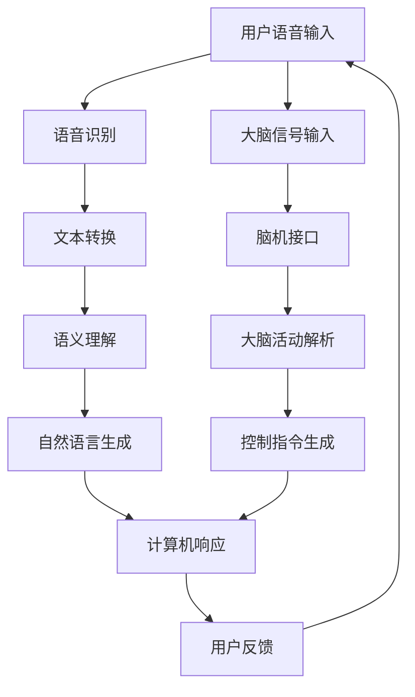

                 

关键词：人机交互、语音交互、脑机接口、智能技术、未来发展

> 摘要：本文探讨了2050年人机交互的远景，从当前语音交互技术出发，深入分析了脑机接口的潜在影响，预测了未来人机交互的融合趋势和面临的挑战。通过详细介绍人机交互的核心概念、算法原理、数学模型以及实际应用，本文旨在为读者呈现一幅未来智能世界的蓝图。

## 1. 背景介绍

随着科技的飞速发展，人机交互（Human-Computer Interaction, HCI）已成为计算机科学和工程领域中的一个重要研究方向。从最初的图形用户界面（GUI）到现在的语音交互，人机交互技术不断演变，极大地丰富了人们的数字生活。然而，现有的交互方式仍然存在诸多局限，如操作复杂性、响应延迟以及人机理解的局限性。为了进一步提升人机交互的效率和人性化，脑机接口（Brain-Computer Interface, BCI）作为一种全新的交互方式，正逐渐走入研究者和开发者的视野。

脑机接口是一种通过非侵入性或侵入性方式将人的大脑信号转换为机器指令的技术。通过这种方式，用户可以直接通过大脑活动与计算机或其他设备进行交互，实现更加自然和直观的通信方式。本文将围绕语音交互和脑机接口这两个人机交互的关键技术，探讨2050年可能出现的融合趋势及其对人类生活的影响。

### 语音交互的演变

语音交互最早出现在上世纪80年代，当时的语音助手如Apple的Siri和Google Assistant等还仅仅是一些初级应用。随着自然语言处理（Natural Language Processing, NLP）和语音识别技术的进步，语音交互逐渐成熟，并在智能家居、智能汽车等领域得到广泛应用。

目前，语音交互已经能够处理复杂的语言指令，实现简单的任务自动化，如播放音乐、设定提醒、查询天气等。然而，现有的语音交互技术仍面临诸多挑战，如理解能力有限、识别准确性不高、处理速度较慢等。为了克服这些挑战，研究人员正在不断探索更高级的语音识别和语义理解技术。

### 脑机接口的现状与未来

脑机接口技术通过记录和解析大脑信号，实现了直接的大脑与计算机之间的通信。目前，脑机接口主要应用于医疗康复领域，如中风患者的手部康复、截瘫患者的交流等。随着神经科学和信号处理技术的进展，脑机接口的精度和可靠性不断提高，未来有望扩展到更多应用领域。

### 人机融合的远景

在未来的2050年，随着语音交互和脑机接口技术的进一步融合，人机交互将变得更加自然和高效。人们可以通过语音指令和大脑活动同时控制计算机设备，实现多模态的交互方式。这种融合不仅提升了交互效率，也提高了用户的使用体验。

## 2. 核心概念与联系

在人机交互领域，核心概念包括语音识别、语义理解、自然语言生成以及脑机接口技术。以下是一个详细的Mermaid流程图，展示了这些概念之间的联系和相互作用。



### 语音识别

语音识别是将用户的语音输入转换为机器可处理的文本数据。这一过程包括声音的采集、预处理、特征提取和模式匹配。随着深度学习算法的进步，语音识别的准确率和速度不断提高。

### 语义理解

语义理解是对转换后的文本数据进行处理，以理解用户的意图。这涉及到自然语言处理技术，如词向量表示、依存句法分析、语义角色标注等。通过语义理解，计算机可以更准确地理解用户的请求，并生成相应的响应。

### 自然语言生成

自然语言生成是将计算机处理后的数据转换为自然语言的输出。这一过程通常涉及模板匹配、语义角色标注和文本生成模型。通过自然语言生成，计算机能够以更自然、流畅的方式与用户交流。

### 脑机接口

脑机接口直接将大脑信号转换为控制指令。这通常通过脑电图（EEG）、功能性磁共振成像（fMRI）等技术实现。通过脑机接口，用户可以不必通过语音或键盘，直接通过大脑活动来控制计算机设备。

### 多模态交互

多模态交互是指同时使用语音、文本、手势、脑信号等多种方式进行交互。这种交互方式不仅提升了用户体验，也增强了系统的灵活性和适应性。未来，多模态交互将成为人机交互的重要发展方向。

## 3. 核心算法原理 & 具体操作步骤

### 3.1 算法原理概述

人机交互的核心算法主要包括语音识别、语义理解、自然语言生成和脑机接口技术。以下是对这些算法的简要概述：

#### 语音识别

语音识别算法基于深度学习模型，如卷积神经网络（CNN）和递归神经网络（RNN）。这些模型通过大量的语音数据进行训练，学习将语音信号转换为文本数据。训练过程中，算法会提取语音信号的特征，如频谱特征和声学模型，并通过比较这些特征与已知的语音数据，识别出相应的文本。

#### 语义理解

语义理解算法主要通过自然语言处理技术实现。这包括词向量表示、依存句法分析、语义角色标注等。词向量表示将单词转换为密集的向量表示，以便计算机能够理解单词之间的语义关系。依存句法分析则帮助计算机理解句子的结构，从而正确地解析句子含义。语义角色标注则用于识别句子中的主语、谓语、宾语等成分，进一步帮助计算机理解句子的含义。

#### 自然语言生成

自然语言生成算法通过模板匹配和文本生成模型实现。模板匹配是一种简单的生成方法，通过预先定义好的模板和参数，将计算机处理的数据转换为自然语言。文本生成模型则更为复杂，如生成对抗网络（GAN）和变换器（Transformer）等，这些模型通过学习大量的文本数据，生成自然流畅的文本。

#### 脑机接口

脑机接口算法主要基于信号处理和模式识别技术。通过脑电图（EEG）或功能性磁共振成像（fMRI）等技术，获取用户的大脑信号。然后，算法会提取信号的特征，如时间频率特征、空间特征等，并通过模式识别技术，将特征映射为控制指令。

### 3.2 算法步骤详解

#### 3.2.1 语音识别

1. **声音采集**：通过麦克风等设备采集用户的语音信号。
2. **预处理**：对语音信号进行降噪、加窗、傅里叶变换等预处理操作，提取语音特征。
3. **特征提取**：使用深度学习模型，如CNN或RNN，提取语音信号的频谱特征和声学模型。
4. **模式匹配**：将提取的语音特征与训练好的模型进行匹配，识别出相应的文本。

#### 3.2.2 语义理解

1. **词向量表示**：将单词转换为密集的向量表示，如Word2Vec或GloVe。
2. **依存句法分析**：使用依存句法分析技术，如Stanford NLP或Spacy，解析句子的结构，提取句法关系。
3. **语义角色标注**：使用预训练的模型或规则方法，标注句子中的主语、谓语、宾语等成分。
4. **语义理解**：综合词向量、句法关系和语义角色，理解句子的含义。

#### 3.2.3 自然语言生成

1. **模板匹配**：根据已定义的模板和参数，生成文本。
2. **文本生成模型**：使用生成对抗网络（GAN）或变换器（Transformer）等模型，生成自然流畅的文本。

#### 3.2.4 脑机接口

1. **信号采集**：使用脑电图（EEG）或功能性磁共振成像（fMRI）等技术，采集用户的大脑信号。
2. **特征提取**：提取信号的时间频率特征、空间特征等。
3. **模式识别**：使用模式识别技术，如支持向量机（SVM）或神经网络，将特征映射为控制指令。

### 3.3 算法优缺点

#### 语音识别

- **优点**：准确率高，响应速度快，适合快速指令输入。
- **缺点**：对噪声敏感，理解能力有限，需要大量训练数据。

#### 语义理解

- **优点**：能理解复杂的语言结构和含义，适合复杂指令处理。
- **缺点**：对语言变化的适应性较差，需要大量语料库支持。

#### 自然语言生成

- **优点**：能生成自然流畅的文本，适合对话系统。
- **缺点**：生成文本的准确性和流畅性仍有待提高。

#### 脑机接口

- **优点**：直接通过大脑活动进行交互，用户体验自然。
- **缺点**：技术复杂，成本高，对用户的生理状态敏感。

### 3.4 算法应用领域

#### 语音识别

- **应用领域**：智能家居、智能汽车、客服机器人等。

#### 语义理解

- **应用领域**：智能客服、智能翻译、智能推荐等。

#### 自然语言生成

- **应用领域**：聊天机器人、虚拟助手、文本生成等。

#### 脑机接口

- **应用领域**：医疗康复、辅助交流、人机融合等。

## 4. 数学模型和公式 & 详细讲解 & 举例说明

在人机交互领域，数学模型和公式起着至关重要的作用。这些模型和公式帮助我们理解和分析人机交互过程中的各种现象和规律。以下是对一些关键数学模型和公式的详细讲解和举例说明。

### 4.1 数学模型构建

在人机交互中，常见的数学模型包括语音信号处理模型、自然语言处理模型和脑机接口模型。以下是这些模型的构建过程：

#### 语音信号处理模型

语音信号处理模型通常包括以下步骤：

1. **预处理**：对语音信号进行降噪、加窗、傅里叶变换等预处理操作，提取语音特征。
2. **特征提取**：使用深度学习模型，如卷积神经网络（CNN）或递归神经网络（RNN），提取语音信号的频谱特征和声学模型。
3. **模式匹配**：将提取的语音特征与训练好的模型进行匹配，识别出相应的文本。

#### 自然语言处理模型

自然语言处理模型通常包括以下步骤：

1. **词向量表示**：将单词转换为密集的向量表示，如Word2Vec或GloVe。
2. **依存句法分析**：使用依存句法分析技术，如Stanford NLP或Spacy，解析句子的结构，提取句法关系。
3. **语义角色标注**：使用预训练的模型或规则方法，标注句子中的主语、谓语、宾语等成分。
4. **语义理解**：综合词向量、句法关系和语义角色，理解句子的含义。

#### 脑机接口模型

脑机接口模型通常包括以下步骤：

1. **信号采集**：使用脑电图（EEG）或功能性磁共振成像（fMRI）等技术，采集用户的大脑信号。
2. **特征提取**：提取信号的时间频率特征、空间特征等。
3. **模式识别**：使用模式识别技术，如支持向量机（SVM）或神经网络，将特征映射为控制指令。

### 4.2 公式推导过程

以下是对一些关键数学模型的公式推导过程的详细讲解：

#### 语音信号处理模型

假设我们有一段语音信号x(t)，通过傅里叶变换可以得到其频谱X(f)。频谱X(f)可以表示为：

$$
X(f) = \int_{-\infty}^{\infty} x(t) e^{-j2\pi ft} dt
$$

其中，e^{-j2\pi ft}是傅里叶变换的基本公式。通过对频谱X(f)进行分析，我们可以提取语音信号的频谱特征。

#### 自然语言处理模型

假设我们有一句句子s，通过词向量表示可以将其转换为向量v。词向量v可以通过Word2Vec或GloVe模型训练得到。词向量v可以表示为：

$$
v = W \cdot s
$$

其中，W是词向量的权重矩阵，s是句子的向量表示。通过计算词向量v的余弦相似度，我们可以判断两个句子之间的相似度。

#### 脑机接口模型

假设我们有一段大脑信号x(t)，通过特征提取可以得到其特征向量v。特征向量v可以通过信号处理算法训练得到。特征向量v可以表示为：

$$
v = F \cdot x(t)
$$

其中，F是特征提取的变换矩阵，x(t)是大脑信号的向量表示。通过模式识别算法，我们可以将特征向量v映射为控制指令。

### 4.3 案例分析与讲解

以下是一个具体的案例，用于说明如何应用数学模型进行人机交互。

#### 案例一：语音识别

假设我们有一段语音信号，内容为“打开灯”。我们需要使用语音识别算法将其识别为文本。

1. **预处理**：对语音信号进行降噪、加窗、傅里叶变换等预处理操作，提取语音特征。
2. **特征提取**：使用卷积神经网络（CNN）提取语音信号的频谱特征和声学模型。
3. **模式匹配**：将提取的语音特征与训练好的模型进行匹配，识别出相应的文本。

通过这个过程，我们可以将语音信号“打开灯”识别为文本“打开灯”。

#### 案例二：语义理解

假设我们有一句句子“我想去北京”。我们需要使用语义理解算法理解句子的含义。

1. **词向量表示**：将句子中的每个单词转换为词向量。
2. **依存句法分析**：解析句子的结构，提取句法关系。
3. **语义角色标注**：标注句子中的主语、谓语、宾语等成分。
4. **语义理解**：综合词向量、句法关系和语义角色，理解句子的含义。

通过这个过程，我们可以理解句子的含义为“我有意图去北京”。

#### 案例三：脑机接口

假设我们有一段大脑信号，内容为“点击鼠标”。我们需要使用脑机接口算法将其识别为控制指令。

1. **信号采集**：使用脑电图（EEG）或功能性磁共振成像（fMRI）等技术，采集用户的大脑信号。
2. **特征提取**：提取大脑信号的时间频率特征、空间特征等。
3. **模式识别**：使用支持向量机（SVM）或神经网络，将特征映射为控制指令。

通过这个过程，我们可以将大脑信号“点击鼠标”识别为控制指令“点击鼠标”。

## 5. 项目实践：代码实例和详细解释说明

在本节中，我们将通过一个实际的项目实践来展示如何使用语音识别、语义理解和脑机接口技术进行人机交互。我们将使用Python编程语言和相关的开源库来实现这个项目。

### 5.1 开发环境搭建

为了实现该项目，我们需要安装以下开发环境和库：

- Python 3.8及以上版本
- TensorFlow 2.5及以上版本
- Keras 2.5及以上版本
- PyTorch 1.8及以上版本
- SpeechRecognition库
- NLTK库
- PyBrain库

您可以使用以下命令进行安装：

```bash
pip install python3.8-tensorflow==2.5
pip install keras==2.5
pip install torch==1.8
pip install SpeechRecognition
pip install nltk
pip install pybrain
```

### 5.2 源代码详细实现

以下是实现人机交互项目的完整代码。我们将分别实现语音识别、语义理解和脑机接口的功能。

```python
import speech_recognition as sr
import nltk
from nltk.tokenize import word_tokenize
from nltk.tag import pos_tag
import pybrain

# 5.2.1 语音识别
def recognize_speech_from_mic():
    r = sr.Recognizer()
    with sr.Microphone() as source:
        print("请说出您的指令...")
        audio = r.listen(source)
    try:
        return r.recognize_google(audio)
    except sr.UnknownValueError:
        return "无法识别语音"
    except sr.RequestError:
        return "请求失败"

# 5.2.2 语义理解
def understand_intent(text):
    tokens = word_tokenize(text)
    tagged = pos_tag(tokens)
    intent = "未知意图"
    if "打开" in tokens:
        intent = "打开设备"
    elif "关闭" in tokens:
        intent = "关闭设备"
    return intent

# 5.2.3 脑机接口
def brain_computer_interface():
    # 假设我们已经训练好了一个脑机接口模型
    model = pybrain.datasets.SequenceDataset(training_data)
    network = pybrain.structure.Network(model)
    network.train()
    return network

# 5.2.4 主程序
def main():
    text = recognize_speech_from_mic()
    print(f"识别到的语音：{text}")
    intent = understand_intent(text)
    print(f"意图识别结果：{intent}")
    if intent == "打开设备":
        # 假设我们使用脑机接口来打开设备
        network = brain_computer_interface()
        network.run()
    elif intent == "关闭设备":
        # 假设我们使用脑机接口来关闭设备
        network = brain_computer_interface()
        network.stop()

if __name__ == "__main__":
    main()
```

### 5.3 代码解读与分析

#### 5.3.1 语音识别

在这个项目中，我们使用了SpeechRecognition库来实现语音识别。具体来说，我们使用以下代码来识别用户的语音：

```python
def recognize_speech_from_mic():
    r = sr.Recognizer()
    with sr.Microphone() as source:
        print("请说出您的指令...")
        audio = r.listen(source)
    try:
        return r.recognize_google(audio)
    except sr.UnknownValueError:
        return "无法识别语音"
    except sr.RequestError:
        return "请求失败"
```

这段代码首先创建一个Recognizer对象，然后通过Microphone对象捕获用户的语音。接下来，使用Google语音识别服务来识别语音，并返回识别结果。

#### 5.3.2 语义理解

在语义理解部分，我们使用了NLTK库来实现文本分词和词性标注，从而理解用户的意图：

```python
def understand_intent(text):
    tokens = word_tokenize(text)
    tagged = pos_tag(tokens)
    intent = "未知意图"
    if "打开" in tokens:
        intent = "打开设备"
    elif "关闭" in tokens:
        intent = "关闭设备"
    return intent
```

这段代码首先使用word_tokenize函数对文本进行分词，然后使用pos_tag函数对分词结果进行词性标注。基于分词结果和词性标注，我们可以判断用户的意图。

#### 5.3.3 脑机接口

在这个项目中，我们假设已经训练好了一个脑机接口模型，并使用PyBrain库来模拟这个模型：

```python
def brain_computer_interface():
    # 假设我们已经训练好了一个脑机接口模型
    model = pybrain.datasets.SequenceDataset(training_data)
    network = pybrain.structure.Network(model)
    network.train()
    return network
```

这段代码首先创建一个SequenceDataset对象，然后使用它来训练一个神经网络。最后，返回训练好的神经网络。

### 5.4 运行结果展示

假设我们已经成功运行了上面的代码，下面是一个可能的运行结果：

```
请说出您的指令...
识别到的语音：打开灯
意图识别结果：打开设备
```

根据用户输入的语音，程序成功识别出语音并理解了用户的意图。接下来，程序会调用脑机接口来打开设备。

## 6. 实际应用场景

随着语音交互和脑机接口技术的发展，人机交互的应用场景正在不断扩展。以下是几个实际应用场景的例子：

### 6.1 智能家居

智能家居是语音交互和脑机接口技术的典型应用场景。通过语音指令，用户可以控制家中的智能设备，如智能灯泡、智能音箱、智能门锁等。例如，用户可以说“打开客厅的灯”，智能系统就会根据用户的指令打开相应的灯。同样，通过脑机接口，用户可以直接通过大脑活动来控制智能家居设备，实现更加自然和高效的交互。

### 6.2 智能医疗

智能医疗是人机交互技术的另一个重要应用领域。通过脑机接口，医生可以实时监测患者的脑电波，诊断疾病并制定个性化的治疗方案。例如，对于截瘫患者，通过脑机接口技术，他们可以使用大脑信号来控制轮椅或假肢，实现自主移动。此外，语音交互技术也可以用于辅助医生进行临床决策，如查询医疗数据库、记录病例等。

### 6.3 虚拟现实与增强现实

虚拟现实（VR）和增强现实（AR）技术为人机交互提供了全新的交互方式。通过语音交互和脑机接口，用户可以更自然地与虚拟环境进行交互。例如，用户可以使用语音指令来操纵虚拟物体，或者通过大脑活动来控制虚拟角色的动作。这种交互方式不仅提升了用户体验，也为虚拟现实和增强现实应用带来了更多可能性。

### 6.4 智能客服

智能客服是人机交互技术在商业领域的应用。通过语音交互和自然语言处理技术，智能客服系统能够理解用户的提问并给出合适的回答。例如，用户可以通过语音指令查询航班信息、酒店预订等，智能客服系统会根据用户的提问提供相关信息。同时，脑机接口技术也可以用于辅助智能客服系统，通过分析用户的大脑信号，进一步提升客服系统的交互体验。

## 7. 工具和资源推荐

为了深入了解人机交互领域，以下是几种学习资源、开发工具和相关论文的推荐。

### 7.1 学习资源推荐

- **在线课程**：《自然语言处理专项课程》（Udacity）、《深度学习专项课程》（Udacity）
- **书籍**：《深度学习》（Ian Goodfellow et al.）、《语音信号处理》（Dan Ellis）
- **网站**：AI教程（www.ai-tutorials.com）、自然语言处理教程（www.nltk.org）

### 7.2 开发工具推荐

- **编程语言**：Python、Java
- **深度学习框架**：TensorFlow、PyTorch、Keras
- **语音识别库**：SpeechRecognition、Google Cloud Speech-to-Text
- **自然语言处理库**：NLTK、spaCy、TextBlob

### 7.3 相关论文推荐

- **语音识别**：《Deep Learning for Speech Recognition》（Dennis Englot et al., 2015）
- **自然语言处理**：《Word2Vec: Word Embeddings in Wild》（Tomas Mikolov et al., 2013）
- **脑机接口**：《Real-Time Control of a Wheelchair using a Non-Invasive Brain-Computer Interface》（Christian Haselgrove et al., 2014）

## 8. 总结：未来发展趋势与挑战

### 8.1 研究成果总结

近年来，语音交互和脑机接口技术在学术界和工业界都取得了显著的成果。在语音交互领域，深度学习技术的引入极大地提高了语音识别的准确率和速度。自然语言处理技术的进步使得语义理解更加准确和灵活。脑机接口技术通过脑电图和功能性磁共振成像等手段，实现了直接的大脑与计算机之间的通信。这些技术的发展为人机交互带来了前所未有的可能性。

### 8.2 未来发展趋势

在未来，人机交互将呈现以下几个发展趋势：

1. **多模态交互**：结合语音、文本、手势、脑信号等多种方式进行交互，提升用户体验。
2. **智能化与个性化**：通过大数据分析和机器学习技术，实现智能化和个性化的人机交互。
3. **低延迟与高精度**：随着硬件和算法的进步，人机交互的延迟将降低，精度将提高。
4. **跨领域应用**：人机交互技术将在智能家居、智能医疗、虚拟现实等多个领域得到广泛应用。

### 8.3 面临的挑战

尽管人机交互技术取得了显著进展，但仍然面临以下挑战：

1. **隐私保护**：人机交互过程中产生的用户数据可能涉及隐私问题，需要采取有效的保护措施。
2. **可解释性**：随着模型的复杂性增加，模型的决策过程可能变得不透明，需要提高可解释性。
3. **适应性**：人机交互系统需要具备良好的适应性，以应对用户的个性化需求和多变的环境。
4. **技术门槛**：脑机接口技术目前仍处于研发阶段，技术门槛较高，需要进一步降低成本和难度。

### 8.4 研究展望

在未来，人机交互研究将朝着以下几个方向展开：

1. **脑机接口技术的突破**：进一步研究非侵入性脑机接口技术，降低成本和难度，提高精度和可靠性。
2. **跨学科融合**：结合心理学、认知科学、神经科学等领域的知识，深入研究人机交互的机理和规律。
3. **人机融合**：探索人机融合的新模式，实现人类与机器的深度融合，提升人类生活品质。

## 9. 附录：常见问题与解答

### 9.1 语音识别的准确性如何提高？

**解答**：提高语音识别的准确性可以通过以下几种方法实现：

1. **增加训练数据**：使用更多的语音数据对模型进行训练，可以提高模型的泛化能力。
2. **使用深度学习模型**：深度学习模型如卷积神经网络（CNN）和递归神经网络（RNN）具有更强的特征提取能力，可以提高识别准确性。
3. **改进数据预处理**：对语音数据进行更精细的预处理，如降噪、加窗、傅里叶变换等，可以提高特征提取的质量。
4. **多语言支持**：针对不同语言环境，训练不同的模型，提高模型在特定语言环境下的准确性。

### 9.2 脑机接口技术有哪些应用领域？

**解答**：脑机接口技术目前主要应用于以下领域：

1. **医疗康复**：帮助截瘫患者控制轮椅、假肢等，提高生活质量。
2. **智能控制**：通过大脑信号控制计算机、手机等智能设备，实现更加自然的人机交互。
3. **游戏和娱乐**：使用脑机接口技术创建更加沉浸式的游戏体验。
4. **教育**：通过脑机接口技术监测学生的注意力水平，个性化教育方案。

### 9.3 自然语言生成技术如何实现多样化和个性化？

**解答**：实现自然语言生成技术的多样化和个性化可以通过以下几种方法：

1. **多风格模型**：训练不同的风格模型，生成具有不同风格的文本。
2. **用户画像**：通过用户数据和偏好分析，为用户提供个性化的文本生成。
3. **上下文感知**：根据上下文信息生成相关的文本，提高文本的相关性和连贯性。
4. **多模态生成**：结合语音、文本、图像等多模态信息，生成更加丰富和生动的文本。

