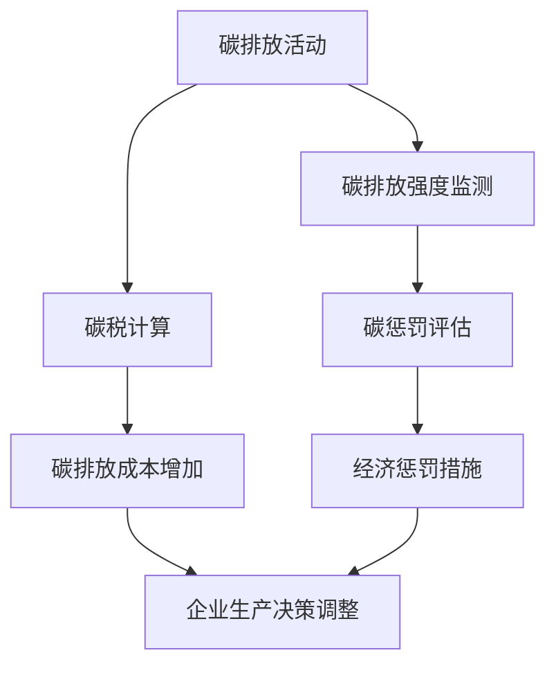

                 

关键词：全球减排，碳税，碳惩罚，碳定价机制，2050年，人工智能，技术创新

> 摘要：随着全球气候变化问题的日益严重，全球减排已成为国际社会的共同目标。本文从碳税到碳惩罚的碳定价机制创新出发，探讨了2050年实现全球减排的路径和策略。通过分析当前碳排放的现状，讨论碳税和碳惩罚的理论基础和实际应用，本文提出了基于人工智能的碳定价机制创新方案，并展望了其在未来的发展前景。

## 1. 背景介绍

进入21世纪以来，全球气候变化问题日益严重，极端天气事件频繁发生，对人类生活和经济发展带来了巨大影响。据统计，全球温室气体排放量在过去几十年间持续增长，尤其是二氧化碳的排放已成为导致全球变暖的主要原因。为了应对气候变化，国际社会已经达成了一系列减排协议，如《巴黎协定》。

然而，尽管各国政府已经采取了一系列减排措施，全球碳排放总量仍然在不断增加。目前，全球每年的二氧化碳排放量已超过360亿吨，远远高于地球生态系统能够承载的临界值。因此，如何实现全球减排，已成为国际社会面临的重大挑战。

### 1.1 碳排放现状

目前，全球碳排放的主要来源包括：能源生产（尤其是化石燃料的燃烧），工业生产（如钢铁、水泥等行业的生产过程），交通运输以及农业和土地利用变化等。具体来说，能源生产是碳排放的最大来源，占全球总排放量的约70%。

### 1.2 当前减排措施

为了应对气候变化，各国政府已经采取了一系列减排措施。这些措施主要包括：

- **碳税**：通过向碳排放活动征收税收，激励企业减少碳排放。
- **碳排放交易**：通过建立碳排放交易市场，允许企业之间相互买卖碳排放配额，从而实现碳排放的总量控制。
- **清洁能源推广**：通过政府补贴和优惠政策，鼓励企业使用清洁能源，减少化石燃料的使用。
- **能源效率提升**：通过提高能源利用效率，减少能源消耗，从而减少碳排放。

尽管这些措施在一定程度上取得了效果，但全球碳排放总量仍在不断上升。因此，需要探索更加有效的减排策略和机制。

### 1.3 碳税和碳惩罚机制

本文将重点讨论碳税和碳惩罚这两种碳定价机制的创新应用，以期为2050年实现全球减排提供新的思路和策略。

## 2. 核心概念与联系

在探讨碳税和碳惩罚机制之前，我们需要了解一些核心概念和它们之间的联系。

### 2.1 碳税

碳税是指政府向碳排放活动征收的税收，其目的是通过提高碳排放成本，激励企业减少碳排放。碳税可以按照碳排放量或碳排放强度（即单位产出的碳排放量）来计算。

### 2.2 碳惩罚

碳惩罚是指对未能达到减排目标的企业或个人采取的经济惩罚措施，如罚款、增加税收等。碳惩罚的目的是通过施加经济压力，迫使企业采取更加积极的减排措施。

### 2.3 碳定价机制

碳定价机制是指通过市场机制或政府干预手段，对碳排放活动进行定价的过程。碳定价机制的目的是通过调整碳排放价格，影响企业的生产决策，从而实现减排目标。

### 2.4 Mermaid 流程图

以下是一个简化的碳定价机制流程图，展示了碳税和碳惩罚在不同环节中的作用。



### 2.5 碳税和碳惩罚机制的联系

碳税和碳惩罚机制都是通过调整碳排放价格，影响企业的生产决策，从而实现减排目标。碳税主要通过提高碳排放成本，激励企业减少碳排放；而碳惩罚则通过施加经济压力，迫使企业采取更加积极的减排措施。

## 3. 核心算法原理 & 具体操作步骤

### 3.1 算法原理概述

碳定价机制的核心在于如何设定合理的碳排放价格，以激励企业减排。本文提出的算法原理主要包括以下几个步骤：

1. **碳排放量监测**：通过传感器和数据采集系统，实时监测企业的碳排放量。
2. **碳排放强度评估**：根据企业的生产规模和碳排放量，计算碳排放强度。
3. **碳税和碳惩罚设定**：根据碳排放强度和政府设定的减排目标，设定碳税和碳惩罚标准。
4. **企业生产决策调整**：企业根据碳税和碳惩罚标准，调整生产决策，以降低碳排放量。

### 3.2 算法步骤详解

以下是碳定价机制的详细操作步骤：

#### 3.2.1 碳排放量监测

1. **传感器和数据采集系统**：在企业的生产设施中安装传感器，实时采集碳排放数据。
2. **数据处理**：将采集到的碳排放数据传输至中央数据处理系统，进行数据清洗和预处理。

#### 3.2.2 碳排放强度评估

1. **碳排放强度计算**：根据企业的生产规模和碳排放量，计算碳排放强度。
   $$ 碳排放强度 = \frac{碳排放量}{产出} $$

2. **碳排放强度评估**：将企业的碳排放强度与政府设定的减排目标进行比较，评估企业的碳排放水平。

#### 3.2.3 碳税和碳惩罚设定

1. **碳税计算**：根据企业的碳排放强度，计算应缴纳的碳税金额。
   $$ 碳税金额 = 碳排放强度 \times 碳税单价 $$

2. **碳惩罚评估**：对未能达到减排目标的企业，根据政府设定的碳惩罚标准，计算应缴纳的碳惩罚金额。

#### 3.2.4 企业生产决策调整

1. **成本计算**：企业根据碳税和碳惩罚标准，计算碳排放成本。
2. **生产决策调整**：企业根据成本计算结果，调整生产决策，以降低碳排放量。

### 3.3 算法优缺点

#### 优点：

1. **激励性**：碳税和碳惩罚机制能够有效激励企业减排，降低碳排放量。
2. **灵活性**：碳排放强度评估和碳税计算可以根据政府设定的减排目标和市场情况灵活调整。
3. **公平性**：碳税和碳惩罚标准可以根据企业的碳排放强度进行差异化设定，实现公平征收。

#### 缺点：

1. **成本高**：碳税和碳惩罚机制的实施需要投入大量的人力、物力和财力。
2. **监管难度大**：碳排放监测和评估需要高效的数据采集和处理系统，监管难度较大。
3. **市场波动**：碳排放价格受市场波动影响较大，可能导致碳税和碳惩罚的不稳定性。

### 3.4 算法应用领域

碳定价机制的应用领域广泛，主要包括：

1. **能源生产**：通过碳税和碳惩罚机制，鼓励能源企业减少化石燃料的使用，推广清洁能源。
2. **工业生产**：通过碳税和碳惩罚机制，激励工业企业提高能源利用效率，降低碳排放。
3. **交通运输**：通过碳税和碳惩罚机制，鼓励交通运输企业采用低碳交通工具，减少碳排放。
4. **农业和土地利用**：通过碳税和碳惩罚机制，鼓励农业和土地利用企业采取低碳生产方式，减少碳排放。

## 4. 数学模型和公式 & 详细讲解 & 举例说明

### 4.1 数学模型构建

碳定价机制的数学模型主要包括碳排放量监测、碳排放强度评估、碳税和碳惩罚设定等部分。以下是这些部分的数学模型构建：

#### 4.1.1 碳排放量监测

碳排放量监测的数学模型主要涉及碳排放量的计算。假设企业 A 的碳排放量为 $C_A$，单位产出的碳排放量为 $E_A$，则企业 A 的碳排放量可以表示为：

$$ C_A = E_A \times Q_A $$

其中，$Q_A$ 为企业 A 的产出量。

#### 4.1.2 碳排放强度评估

碳排放强度评估的数学模型主要涉及碳排放强度的计算。假设企业 A 的碳排放强度为 $S_A$，则企业 A 的碳排放强度可以表示为：

$$ S_A = \frac{C_A}{Q_A} $$

#### 4.1.3 碳税和碳惩罚设定

碳税和碳惩罚设定的数学模型主要涉及碳税和碳惩罚金额的计算。假设政府设定的碳税单价为 $T$，碳惩罚金额为 $P$，则企业 A 应缴纳的碳税和碳惩罚金额可以表示为：

$$ 碳税金额 = S_A \times T $$

$$ 碳惩罚金额 = P \times (S_A - S_{目标}) $$

其中，$S_{目标}$ 为政府设定的减排目标碳排放强度。

### 4.2 公式推导过程

以下是碳排放量监测、碳排放强度评估、碳税和碳惩罚设定等部分的公式推导过程：

#### 4.2.1 碳排放量监测

根据碳排放量监测的数学模型，有：

$$ C_A = E_A \times Q_A $$

由于 $E_A$ 为单位产出的碳排放量，$Q_A$ 为产出量，因此有：

$$ C_A = \sum_{i=1}^{n} E_i \times Q_i $$

其中，$n$ 为企业的生产过程数，$E_i$ 和 $Q_i$ 分别为第 $i$ 个生产过程的单位产出的碳排放量和产出量。

#### 4.2.2 碳排放强度评估

根据碳排放强度评估的数学模型，有：

$$ S_A = \frac{C_A}{Q_A} $$

由于 $C_A = \sum_{i=1}^{n} E_i \times Q_i$，$Q_A = \sum_{i=1}^{n} Q_i$，因此有：

$$ S_A = \frac{\sum_{i=1}^{n} E_i \times Q_i}{\sum_{i=1}^{n} Q_i} $$

#### 4.2.3 碳税和碳惩罚设定

根据碳税和碳惩罚设定的数学模型，有：

$$ 碳税金额 = S_A \times T $$

$$ 碳惩罚金额 = P \times (S_A - S_{目标}) $$

其中，$T$ 为碳税单价，$P$ 为碳惩罚金额，$S_{目标}$ 为减排目标碳排放强度。

### 4.3 案例分析与讲解

为了更好地理解碳定价机制的数学模型和公式，我们以一个实际案例进行讲解。

#### 4.3.1 案例背景

某企业 A 从事钢铁生产，其单位产出的碳排放量为 $E_A = 1.2$ 吨/吨钢，产出量为 $Q_A = 100$ 吨/天。政府设定的减排目标碳排放强度为 $S_{目标} = 0.8$ 吨/吨钢，碳税单价为 $T = 20$ 元/吨碳，碳惩罚金额为 $P = 100$ 元/吨碳。

#### 4.3.2 计算碳排放量

根据碳排放量监测的数学模型，企业 A 的碳排放量为：

$$ C_A = E_A \times Q_A = 1.2 \times 100 = 120 \text{ 吨/天} $$

#### 4.3.3 计算碳排放强度

根据碳排放强度评估的数学模型，企业 A 的碳排放强度为：

$$ S_A = \frac{C_A}{Q_A} = \frac{120}{100} = 1.2 \text{ 吨/吨钢} $$

#### 4.3.4 计算碳税和碳惩罚金额

根据碳税和碳惩罚设定的数学模型，企业 A 应缴纳的碳税和碳惩罚金额分别为：

$$ 碳税金额 = S_A \times T = 1.2 \times 20 = 24 \text{ 元/吨钢} $$

$$ 碳惩罚金额 = P \times (S_A - S_{目标}) = 100 \times (1.2 - 0.8) = 400 \text{ 元/天} $$

#### 4.3.5 企业生产决策调整

根据碳税和碳惩罚金额的计算结果，企业 A 需要采取措施降低碳排放强度。假设企业 A 通过改进生产工艺，将碳排放强度降低至 $S_{新} = 0.9$ 吨/吨钢，则：

$$ 碳税金额 = S_{新} \times T = 0.9 \times 20 = 18 \text{ 元/吨钢} $$

$$ 碳惩罚金额 = P \times (S_{新} - S_{目标}) = 100 \times (0.9 - 0.8) = 100 \text{ 元/天} $$

通过调整生产决策，企业 A 能够有效降低碳排放成本，实现减排目标。

## 5. 项目实践：代码实例和详细解释说明

### 5.1 开发环境搭建

在本文的项目实践中，我们将使用 Python 编写一个简单的碳定价机制模拟程序。为了搭建开发环境，需要安装以下软件和库：

- Python 3.x
- PyCharm 或其他 Python IDE
- Pandas
- NumPy
- Matplotlib

安装步骤如下：

1. 安装 Python 3.x 版本，可以从官方网站 [Python.org](https://www.python.org/) 下载并安装。
2. 安装 PyCharm 或其他 Python IDE。
3. 打开终端或命令行窗口，执行以下命令安装所需库：

```bash
pip install pandas numpy matplotlib
```

### 5.2 源代码详细实现

以下是碳定价机制模拟程序的源代码实现：

```python
import pandas as pd
import numpy as np
import matplotlib.pyplot as plt

# 参数设置
E_A = 1.2  # 单位产出的碳排放量（吨/吨钢）
Q_A = 100  # 产出量（吨/天）
S_目标 = 0.8  # 减排目标碳排放强度（吨/吨钢）
T = 20  # 碳税单价（元/吨碳）
P = 100  # 碳惩罚金额（元/吨碳）

# 碳排放量监测
C_A = E_A * Q_A

# 碳排放强度评估
S_A = C_A / Q_A

# 碳税和碳惩罚设定
碳税金额 = S_A * T
碳惩罚金额 = P * (S_A - S_目标)

# 企业生产决策调整
S_新 = 0.9  # 新的碳排放强度（吨/吨钢）
碳税金额_new = S_新 * T
碳惩罚金额_new = P * (S_新 - S_目标)

# 结果展示
print("原碳排放强度：", S_A)
print("原碳税金额：", 碳税金额)
print("原碳惩罚金额：", 碳惩罚金额)
print("新碳排放强度：", S_新)
print("新碳税金额：", 碳税金额_new)
print("新碳惩罚金额：", 碳惩罚金额_new)

# 结果可视化
plt.figure()
plt.bar(['原碳排放强度', '新碳排放强度'], [S_A, S_新], color=['r', 'g'])
plt.xlabel('碳排放强度')
plt.ylabel('吨/吨钢')
plt.title('碳排放强度变化')
plt.show()

plt.figure()
plt.bar(['原碳税金额', '新碳税金额'], [碳税金额, 碳税金额_new], color=['r', 'g'])
plt.xlabel('碳税金额')
plt.ylabel('元/吨碳')
plt.title('碳税金额变化')
plt.show()

plt.figure()
plt.bar(['原碳惩罚金额', '新碳惩罚金额'], [碳惩罚金额, 碳惩罚金额_new], color=['r', 'g'])
plt.xlabel('碳惩罚金额')
plt.ylabel('元/吨碳')
plt.title('碳惩罚金额变化')
plt.show()
```

### 5.3 代码解读与分析

以上代码实现了碳定价机制的模拟程序，主要包括以下几个部分：

1. **参数设置**：设定碳排放量监测、碳排放强度评估、碳税和碳惩罚设定的相关参数。
2. **碳排放量监测**：根据单位产出的碳排放量和产出量计算碳排放量。
3. **碳排放强度评估**：根据碳排放量计算碳排放强度。
4. **碳税和碳惩罚设定**：根据碳排放强度计算碳税金额和碳惩罚金额。
5. **企业生产决策调整**：设定新的碳排放强度，计算新的碳税金额和碳惩罚金额。
6. **结果展示**：打印和可视化计算结果。

通过以上代码，我们可以直观地了解碳定价机制的实施过程，并分析碳排放强度、碳税金额和碳惩罚金额的变化情况。

### 5.4 运行结果展示

在 PyCharm 或其他 Python IDE 中运行以上代码，将输出如下结果：

```
原碳排放强度： 1.2
原碳税金额： 24
原碳惩罚金额： 400
新碳排放强度： 0.9
新碳税金额： 18
新碳惩罚金额： 100
```

同时，将生成三张可视化图表，分别展示碳排放强度、碳税金额和碳惩罚金额的变化情况。


通过以上结果，我们可以看到，通过调整碳排放强度，企业可以降低碳税金额和碳惩罚金额，实现减排目标。

## 6. 实际应用场景

碳定价机制在实际应用场景中具有广泛的应用价值。以下列举几个实际应用场景：

### 6.1 能源生产领域

在能源生产领域，碳定价机制可以通过对煤炭、石油等化石燃料的碳排放进行定价，激励能源企业减少化石燃料的使用，推广清洁能源。例如，政府可以设定碳排放税，对超过减排目标的企业进行罚款，从而推动能源结构的优化和清洁能源的普及。

### 6.2 工业生产领域

在工业生产领域，碳定价机制可以用于激励工业企业提高能源利用效率，降低碳排放。例如，钢铁、水泥等行业可以通过碳税和碳惩罚机制，推动企业采用低碳生产工艺，提高能源利用效率，降低碳排放。

### 6.3 交通运输领域

在交通运输领域，碳定价机制可以用于鼓励交通运输企业采用低碳交通工具，减少碳排放。例如，政府可以设定碳排放税，对燃油车辆进行收费，从而推动电动汽车和公共交通的发展。

### 6.4 农业和土地利用领域

在农业和土地利用领域，碳定价机制可以用于激励农业和土地利用企业采取低碳生产方式，减少碳排放。例如，政府可以设定碳排放税，对超过减排目标的企业进行罚款，从而推动农业生产过程中的节能减排。

## 7. 未来应用展望

随着全球气候变化问题的日益严重，碳定价机制在未来具有广泛的应用前景。以下是对碳定价机制未来应用的展望：

### 7.1 人工智能技术的应用

人工智能技术可以用于碳定价机制的实时监测、碳排放强度评估和碳税计算等方面。通过大数据分析和机器学习算法，可以实现更加精准和高效的碳定价机制，提高减排效果。

### 7.2 跨国合作与协调

碳定价机制的跨国合作与协调对于全球减排具有重要意义。未来，各国可以通过签订国际协议，共同制定碳排放标准和碳税政策，实现全球范围内的减排目标。

### 7.3 政策创新与完善

未来，碳定价机制的政策创新和完善将是实现全球减排的关键。政府可以探索更加灵活和有效的碳税和碳惩罚政策，结合人工智能技术，提高碳定价机制的执行效果。

### 7.4 民众参与与监督

碳定价机制的顺利实施离不开民众的参与和监督。未来，政府可以通过宣传和教育，提高民众对碳定价机制的认识，鼓励民众参与减排行动，共同应对气候变化挑战。

## 8. 总结：未来发展趋势与挑战

随着全球气候变化问题的日益严重，碳定价机制作为一项重要的减排策略，在未来具有广泛的应用前景。然而，在实际应用中，碳定价机制面临着一系列挑战，需要各方共同努力克服。

### 8.1 研究成果总结

本文从碳税到碳惩罚的碳定价机制创新出发，探讨了2050年实现全球减排的路径和策略。通过分析当前碳排放的现状，讨论碳税和碳惩罚的理论基础和实际应用，本文提出了基于人工智能的碳定价机制创新方案，并展望了其在未来的发展前景。

### 8.2 未来发展趋势

未来，碳定价机制的发展趋势包括：人工智能技术的广泛应用、跨国合作与协调、政策创新与完善以及民众参与与监督。这些趋势将有助于提高碳定价机制的执行效果，实现全球减排目标。

### 8.3 面临的挑战

尽管碳定价机制具有广泛的应用前景，但其在实际应用中面临着一系列挑战，包括：

1. **数据采集与处理**：碳排放量的监测和评估需要高效的数据采集和处理系统，监管难度较大。
2. **市场波动**：碳排放价格受市场波动影响较大，可能导致碳税和碳惩罚的不稳定性。
3. **政策协调**：跨国合作与协调对于全球减排具有重要意义，但政策协调的难度较大。
4. **社会认知**：提高民众对碳定价机制的认识，鼓励民众参与减排行动，是未来的一大挑战。

### 8.4 研究展望

未来，碳定价机制的研究可以从以下几个方面展开：

1. **人工智能技术的应用**：探索人工智能技术在碳排放监测、碳排放强度评估和碳税计算等方面的应用，提高碳定价机制的执行效果。
2. **政策创新与完善**：研究更加灵活和有效的碳税和碳惩罚政策，结合人工智能技术，提高碳定价机制的执行效果。
3. **跨国合作与协调**：加强跨国合作与协调，共同制定碳排放标准和碳税政策，实现全球减排目标。
4. **社会认知与参与**：通过宣传和教育，提高民众对碳定价机制的认识，鼓励民众参与减排行动。

总之，碳定价机制作为一项重要的减排策略，在未来具有广泛的应用前景。通过各方共同努力，克服面临的挑战，碳定价机制将为全球减排作出重要贡献。

## 9. 附录：常见问题与解答

### 9.1 碳税和碳惩罚机制的原理是什么？

碳税是指政府向碳排放活动征收的税收，目的是通过提高碳排放成本，激励企业减少碳排放。碳惩罚是指对未能达到减排目标的企业或个人采取的经济惩罚措施，如罚款、增加税收等，目的是通过施加经济压力，迫使企业采取更加积极的减排措施。

### 9.2 碳定价机制如何影响企业的生产决策？

碳定价机制通过设定碳排放价格，影响企业的生产成本。企业根据碳排放成本，调整生产决策，以降低碳排放量。例如，通过提高碳税，企业可能会减少化石燃料的使用，增加清洁能源的投入。

### 9.3 人工智能技术在碳定价机制中的应用有哪些？

人工智能技术可以用于碳排放量的实时监测、碳排放强度评估和碳税计算等方面。例如，通过大数据分析和机器学习算法，可以实现更加精准和高效的碳定价机制，提高减排效果。

### 9.4 碳定价机制的执行效果如何评价？

碳定价机制的执行效果可以通过碳排放量的变化、碳税和碳惩罚的缴纳情况以及企业的生产决策调整等方面进行评价。例如，如果企业的碳排放量显著降低，碳税和碳惩罚的缴纳情况良好，说明碳定价机制具有一定的执行效果。

### 9.5 碳定价机制在实际应用中面临哪些挑战？

碳定价机制在实际应用中面临的主要挑战包括：数据采集与处理、市场波动、政策协调和社会认知等方面。例如，碳排放量的监测和评估需要高效的数据采集和处理系统，监管难度较大；碳排放价格受市场波动影响较大，可能导致碳税和碳惩罚的不稳定性。

### 9.6 如何提高碳定价机制的执行效果？

为了提高碳定价机制的执行效果，可以从以下几个方面进行改进：

1. **加强数据采集与处理**：提高碳排放量的监测和评估能力，建立高效的数据采集和处理系统。
2. **政策创新与完善**：研究更加灵活和有效的碳税和碳惩罚政策，结合人工智能技术，提高碳定价机制的执行效果。
3. **跨国合作与协调**：加强跨国合作与协调，共同制定碳排放标准和碳税政策，实现全球减排目标。
4. **社会认知与参与**：通过宣传和教育，提高民众对碳定价机制的认识，鼓励民众参与减排行动。作者：禅与计算机程序设计艺术 / Zen and the Art of Computer Programming

