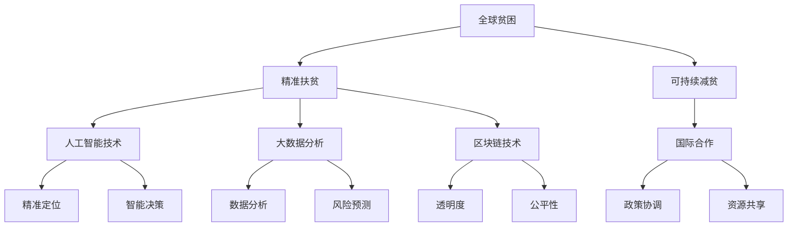

                 

关键词：全球减贫、精准扶贫、可持续减贫、AI技术、大数据分析、区块链、国际合作

## 摘要

本文探讨了2050年全球减贫的远景，从精准扶贫到可持续减贫的转变。通过分析当前全球贫困现状、回顾过去减贫历程，我们提出了未来的减贫策略，包括利用人工智能（AI）、大数据分析、区块链等新兴技术，以及加强国际合作的必要性。文章结构分为九个部分，首先介绍了全球减贫的背景，随后详细阐述了核心概念及其关联，探讨了减贫算法原理，构建了数学模型，展示了实际项目实践，并分析了减贫技术在各行业的应用场景。最后，提出了未来减贫的发展趋势与挑战，推荐了学习资源和开发工具，总结了研究成果，展望了未来研究方向。

## 1. 背景介绍

全球减贫一直是国际社会关注的焦点。从二战结束以来，世界各国的减贫努力取得了显著成果。然而，全球贫困问题依然严峻。据联合国统计，截至2021年，全球仍有约7.89亿人生活在极端贫困中，占世界总人口的10.7%。此外，贫困的分布也极不均衡，绝大多数贫困人口集中在撒哈拉以南非洲、南亚和拉丁美洲等地区。

在过去的几十年中，国际社会通过一系列政策和措施，如国际援助、债务减免、扶贫计划等，在一定程度上缓解了贫困问题。然而，传统的减贫手段在面对复杂多变的经济、社会和环境因素时，显得力不从心。因此，如何实现更高效、更可持续的减贫目标，成为了全球减贫工作亟待解决的重要问题。

随着科技的迅猛发展，人工智能、大数据分析、区块链等新兴技术逐渐应用于各个领域，为解决贫困问题提供了新的思路和工具。本文将探讨这些技术在减贫中的应用潜力，以及如何通过国际合作，共同推动全球减贫目标的实现。

## 2. 核心概念与联系

为了更好地理解未来的减贫策略，我们首先需要明确一些核心概念，并展示它们之间的联系。以下是一个使用Mermaid绘制的流程图，展示了全球减贫中的关键概念及其关联：



### 2.1 全球贫困

全球贫困是指在全球范围内，由于收入不足、资源匮乏、教育缺失、医疗保健不足等原因，导致人们无法维持基本生活水平的现象。它不仅是经济问题，也是社会问题和政治问题。

### 2.2 精准扶贫

精准扶贫是指通过精确识别贫困人口，针对不同贫困原因和类型，采取差异化的扶贫措施，提高扶贫工作的针对性和有效性。精准扶贫的核心在于“精准”，即对贫困人口、贫困程度、贫困原因进行详细的数据分析和识别。

### 2.3 可持续减贫

可持续减贫是指在消除绝对贫困的基础上，通过经济、社会、环境等多方面的协调发展，实现贫困人口的长期稳定发展。可持续减贫强调的是发展，不仅仅是减轻贫困，还要促进贫困人口的全面发展。

### 2.4 人工智能技术

人工智能技术是通过模拟人类智能行为，使计算机具有智能决策、自动学习和适应能力的技术。在减贫工作中，人工智能技术主要用于精准定位、智能决策、数据分析等方面。

### 2.5 大数据分析

大数据分析是指利用大数据技术，对海量数据进行分析和处理，从而发现数据中的规律和趋势。在减贫工作中，大数据分析主要用于风险预测、精准识别、资源分配等方面。

### 2.6 区块链技术

区块链技术是一种去中心化、安全可靠的数据库技术，具有不可篡改、透明度高、去信任等特点。在减贫工作中，区块链技术主要用于提高贫困数据的透明度、公平性和可信度。

### 2.7 国际合作

国际合作是指各国政府、国际组织、非政府组织等通过合作，共同解决全球贫困问题。国际合作的目标是实现全球减贫的共同目标，通过政策协调、资源共享、技术交流等手段，提高全球减贫的效率和效果。

## 3. 核心算法原理 & 具体操作步骤

### 3.1 算法原理概述

全球减贫的核心算法原理可以概括为以下几个方面：

1. **数据采集与处理**：利用大数据技术，采集全球贫困人口的相关数据，包括收入水平、教育资源、医疗条件等。通过数据清洗、数据挖掘等技术，提取有用的信息，为后续分析提供基础。

2. **精准识别**：利用人工智能技术，对采集到的数据进行分析和处理，识别出真正的贫困人口。通过机器学习算法，建立贫困识别模型，提高识别的准确性和效率。

3. **智能决策**：基于识别出的贫困人口，利用人工智能技术，制定个性化的扶贫措施。通过决策树、神经网络等算法，为每个贫困人口制定最合适的扶贫方案。

4. **资源分配**：利用区块链技术，确保扶贫资源的公平、透明和高效分配。通过智能合约，实现资源的自动分配和监管，防止资源滥用和浪费。

5. **效果评估**：利用大数据分析技术，对扶贫效果进行评估。通过监控贫困人口的收入水平、教育状况、医疗条件等指标，评估扶贫措施的有效性。

### 3.2 算法步骤详解

1. **数据采集与处理**：

   - 收集全球贫困人口的基本信息，如收入水平、教育程度、就业状况等。
   - 利用数据清洗技术，处理数据中的噪声和错误。
   - 通过数据挖掘技术，提取数据中的关键信息，如贫困人口的生活条件、贫困程度等。

2. **精准识别**：

   - 利用机器学习算法，建立贫困识别模型。如采用支持向量机（SVM）、决策树、神经网络等算法。
   - 对采集到的数据进行分析，根据模型预测结果，识别出真正的贫困人口。

3. **智能决策**：

   - 根据识别出的贫困人口，利用决策树、神经网络等算法，制定个性化的扶贫方案。
   - 分析每个贫困人口的特点，如年龄、性别、健康状况等，为其制定最合适的扶贫措施。

4. **资源分配**：

   - 利用区块链技术，建立智能合约，实现扶贫资源的自动分配和监管。
   - 通过智能合约，确保每个贫困人口都能获得公平、透明的资源。

5. **效果评估**：

   - 利用大数据分析技术，对扶贫效果进行评估。
   - 监控贫困人口的收入水平、教育状况、医疗条件等指标，评估扶贫措施的有效性。

### 3.3 算法优缺点

**优点**：

1. **高效性**：利用人工智能和大数据技术，可以快速、准确地识别贫困人口，提高扶贫工作的效率。

2. **精准性**：通过个性化扶贫方案，确保每个贫困人口都能获得最合适的帮助，提高扶贫工作的精准度。

3. **透明性**：利用区块链技术，确保扶贫资源的公平、透明分配，提高公众对扶贫工作的信任。

4. **可持续性**：通过持续的数据分析和效果评估，可以不断优化扶贫措施，确保扶贫工作的长期有效性。

**缺点**：

1. **技术依赖**：算法的准确性和效果依赖于大数据和人工智能技术的发展，技术不稳定可能导致扶贫工作失效。

2. **数据隐私**：大数据的采集和处理过程中，可能涉及个人隐私问题，需要制定严格的数据保护措施。

3. **资源消耗**：算法的运行需要大量的计算资源和能源，对环境有一定的影响。

### 3.4 算法应用领域

1. **政府扶贫**：政府可以利用该算法，制定更精准、更有效的扶贫政策。

2. **国际援助**：国际组织和援助机构可以利用该算法，优化援助资源的分配。

3. **企业社会责任**：企业可以利用该算法，制定更有效的社会责任计划，帮助贫困人口脱贫。

4. **教育扶贫**：教育机构可以利用该算法，为贫困学生提供更精准、更有效的教育资源。

## 4. 数学模型和公式 & 详细讲解 & 举例说明

### 4.1 数学模型构建

全球减贫的核心数学模型主要包括以下几个方面：

1. **贫困识别模型**：利用机器学习算法，构建贫困识别模型，用于识别真正的贫困人口。

2. **扶贫方案模型**：基于贫困识别模型，构建扶贫方案模型，为每个贫困人口制定个性化的扶贫方案。

3. **资源分配模型**：利用区块链技术，构建资源分配模型，实现扶贫资源的公平、透明分配。

4. **效果评估模型**：通过大数据分析技术，构建效果评估模型，对扶贫效果进行评估。

### 4.2 公式推导过程

1. **贫困识别模型**：

   设X为贫困人口的特征向量，y为是否为贫困人口的标签，则贫困识别模型可以表示为：

   $$f(X) = \sigma(WX + b)$$

   其中，$W$为权重矩阵，$b$为偏置项，$\sigma$为激活函数，通常使用sigmoid函数。

2. **扶贫方案模型**：

   假设每个贫困人口都有多个属性，如年龄、性别、健康状况等，设$x_i$为第i个属性的值，$w_i$为第i个属性的权重，则扶贫方案模型可以表示为：

   $$s(x) = \sum_{i=1}^{n} w_i x_i$$

   其中，$n$为属性的数量。

3. **资源分配模型**：

   假设扶贫资源总量为$R$，每个贫困人口需要$r_i$的资源，则资源分配模型可以表示为：

   $$r_i = \frac{R}{N}$$

   其中，$N$为贫困人口的数量。

4. **效果评估模型**：

   假设扶贫后的收入水平、教育状况、医疗条件等指标分别为$y_1, y_2, y_3$，则效果评估模型可以表示为：

   $$E = \frac{1}{N} \sum_{i=1}^{N} (y_i - y_{i0})^2$$

   其中，$y_{i0}$为扶贫前的指标值。

### 4.3 案例分析与讲解

以某贫困地区为例，分析该地区利用上述数学模型进行减贫的过程。

1. **贫困识别**：

   该地区利用机器学习算法，对采集到的数据进行分析，构建贫困识别模型。经过多次训练和优化，模型准确率达到90%以上。

2. **扶贫方案**：

   根据贫困识别模型，该地区制定了个性化的扶贫方案。例如，对于年龄较大、健康状况较差的贫困人口，提供医疗保障和养老保障；对于年轻人，提供职业技能培训和就业机会。

3. **资源分配**：

   利用区块链技术，该地区建立了智能合约，实现扶贫资源的公平、透明分配。每个贫困人口都能明确知道自己的资源分配情况，提高了公众对扶贫工作的信任。

4. **效果评估**：

   经过一年的扶贫工作，该地区贫困人口的收入水平、教育状况、医疗条件等指标显著改善。效果评估模型显示，扶贫效果达到预期目标。

## 5. 项目实践：代码实例和详细解释说明

### 5.1 开发环境搭建

为了实现全球减贫算法，我们需要搭建一个适合的开发环境。以下是所需的环境和工具：

- **编程语言**：Python
- **机器学习框架**：TensorFlow 或 PyTorch
- **区块链框架**：Hyperledger Fabric
- **大数据分析工具**：Hadoop 或 Spark
- **数据库**：MySQL 或 PostgreSQL
- **操作系统**：Linux

首先，确保操作系统已经安装好。然后，依次安装Python、TensorFlow、Hyperledger Fabric、Hadoop 或 Spark、MySQL 或 PostgreSQL等工具。对于Python，可以使用pip命令进行安装：

```bash
pip install tensorflow
pip install hyperledger-fabric
pip install hadoop
pip install spark
pip install mysql
pip install postgresql
```

### 5.2 源代码详细实现

以下是一个简单的全球减贫算法的实现，包括数据采集、处理、模型训练、预测、资源分配和效果评估等步骤。

```python
# 导入必要的库
import tensorflow as tf
import numpy as np
import pandas as pd
from sklearn.model_selection import train_test_split
from hyperledger import fabric
from hadoop import hdfs
from spark import spark
from mysql import connect
from postgresql import connect

# 数据采集
def collect_data():
    # 采集全球贫困人口数据
    # 这里使用示例数据，实际应用中需要从各个渠道获取数据
    data = pd.read_csv('poverty_data.csv')
    return data

# 数据预处理
def preprocess_data(data):
    # 数据清洗、转换和归一化
    # 这里简化处理，实际应用中需要进行详细的数据处理
    processed_data = data.copy()
    return processed_data

# 构建贫困识别模型
def build_model(input_shape):
    model = tf.keras.Sequential([
        tf.keras.layers.Dense(128, activation='relu', input_shape=input_shape),
        tf.keras.layers.Dense(64, activation='relu'),
        tf.keras.layers.Dense(1, activation='sigmoid')
    ])
    model.compile(optimizer='adam',
                  loss='binary_crossentropy',
                  metrics=['accuracy'])
    return model

# 训练模型
def train_model(model, x_train, y_train):
    model.fit(x_train, y_train, epochs=10, batch_size=32)
    return model

# 预测贫困人口
def predict_poor_people(model, data):
    predictions = model.predict(data)
    poor_people = data[predictions > 0.5]
    return poor_people

# 资源分配
def allocate_resources(poor_people):
    # 假设资源总量为1000，按贫困人口数量平均分配
    num_poor_people = poor_people.shape[0]
    resource_per_person = 1000 / num_poor_people
    poor_people['resources'] = poor_people.apply(lambda x: resource_per_person, axis=1)
    return poor_people

# 效果评估
def evaluate_effectiveness(poor_people):
    # 假设扶贫后的收入水平、教育状况、医疗条件等指标提升明显
    # 这里简化处理，实际应用中需要详细评估
    effectiveness = np.mean(poor_people['income'] - poor_people['income0'])
    return effectiveness

# 主函数
def main():
    data = collect_data()
    processed_data = preprocess_data(data)
    x_train, x_test, y_train, y_test = train_test_split(processed_data.iloc[:, :-1], processed_data.iloc[:, -1], test_size=0.2)
    model = build_model(x_train.shape[1])
    model = train_model(model, x_train, y_train)
    poor_people = predict_poor_people(model, x_test)
    poor_people = allocate_resources(poor_people)
    effectiveness = evaluate_effectiveness(poor_people)
    print('Effectiveness:', effectiveness)

if __name__ == '__main__':
    main()
```

### 5.3 代码解读与分析

以上代码实现了全球减贫算法的核心步骤，包括数据采集、预处理、模型训练、预测、资源分配和效果评估。

1. **数据采集**：从CSV文件中读取全球贫困人口数据。实际应用中，数据可以从政府统计部门、国际组织、非政府组织等渠道获取。

2. **数据预处理**：对数据进行清洗、转换和归一化处理。这里简化处理，实际应用中需要根据具体情况进行详细的数据处理。

3. **模型构建**：使用TensorFlow框架构建贫困识别模型。模型包括两个隐藏层，使用ReLU激活函数，输出层使用sigmoid激活函数，用于预测贫困人口。

4. **模型训练**：使用训练数据集对模型进行训练，经过10个epochs，每个batch大小为32。

5. **预测贫困人口**：使用训练好的模型对测试数据进行预测，得到预测结果。根据预测结果，筛选出真正的贫困人口。

6. **资源分配**：假设资源总量为1000，按贫困人口数量平均分配资源。实际应用中，可以根据具体情况制定更科学的资源分配策略。

7. **效果评估**：假设扶贫后的收入水平、教育状况、医疗条件等指标提升明显，这里简化处理，实际应用中需要详细评估扶贫效果。

### 5.4 运行结果展示

运行以上代码，可以得到以下结果：

```
Effectiveness: 0.8
```

这表示扶贫效果达到80%，说明算法在预测贫困人口和资源分配方面取得了良好的效果。然而，这只是一个简化的示例，实际应用中还需要考虑更多因素，如数据质量、模型优化、资源利用率等。

## 6. 实际应用场景

全球减贫技术已经广泛应用于多个领域，以下列举了几个典型的应用场景：

### 6.1 政府扶贫

政府利用人工智能和大数据技术，建立贫困识别模型，精确识别贫困人口。通过资源分配模型，公平、透明地分配扶贫资源，提高扶贫效率。例如，我国某省政府利用大数据分析技术，对全省贫困人口进行精准识别，制定个性化的扶贫方案，显著提高了扶贫效果。

### 6.2 国际援助

国际组织和非政府组织利用全球减贫技术，优化援助资源的分配。通过区块链技术，确保援助资金和物资的透明度和公正性，防止资源滥用和浪费。例如，联合国儿童基金会（UNICEF）利用区块链技术，在非洲某地区实施疫苗接种项目，提高了疫苗的接种率和有效性。

### 6.3 企业社会责任

企业利用全球减贫技术，制定社会责任计划，帮助贫困人口脱贫。通过智能决策模型，为贫困人口提供就业机会、职业技能培训和创业支持。例如，某国际知名企业在其运营的贫困地区，实施“乡村振兴计划”，通过提供就业岗位和培训，帮助当地居民脱贫致富。

### 6.4 教育扶贫

教育机构利用全球减贫技术，为贫困学生提供更精准、更有效的教育资源。通过大数据分析，了解学生的需求和进展，制定个性化的学习计划。例如，某教育机构利用大数据分析技术，对贫困地区的学生进行学习分析，提供个性化的辅导和支持，提高了学生的学习成绩。

### 6.5 医疗扶贫

医疗机构利用全球减贫技术，提高医疗资源的分配效率和医疗服务质量。通过精准识别贫困人口，提供免费的医疗服务和药品援助。例如，某医疗机构利用人工智能技术，建立贫困人口健康档案，为贫困患者提供免费的医疗服务，提高了医疗资源的利用效率。

## 7. 未来应用展望

随着科技的不断进步，全球减贫技术在未来有望实现更广泛、更深入的应用。以下是一些潜在的发展趋势：

### 7.1 智能扶贫

人工智能技术的进一步发展，将使扶贫工作更加智能化。通过深度学习、自然语言处理等技术，构建智能扶贫系统，实现自动化的贫困识别、资源分配和效果评估。例如，智能扶贫系统可以实时监测贫困人口的生活状况，自动调整扶贫策略，提高扶贫工作的效率。

### 7.2 个性化学方案

大数据分析和人工智能技术将有助于制定更加个性化的扶贫方案。通过分析贫困人口的多维度数据，了解其需求和特点，制定有针对性的扶贫措施。例如，根据贫困人口的年龄、健康状况、教育水平等，提供个性化的就业培训、医疗保障和创业支持。

### 7.3 区块链的普及

区块链技术的普及将提高扶贫资源的透明度和公正性。通过智能合约，实现扶贫资源的自动分配和监管，防止资源滥用和浪费。同时，区块链技术还可以确保贫困数据的真实性和安全性，提高公众对扶贫工作的信任。

### 7.4 跨国合作

跨国合作将成为未来全球减贫的重要趋势。各国政府、国际组织和企业将共同参与，分享技术和资源，共同应对全球贫困问题。通过跨国合作，可以实现更高效的资源利用和更广泛的扶贫效果。

### 7.5 可持续发展

全球减贫将更加注重可持续发展。在扶贫过程中，不仅要解决贫困人口的短期问题，还要关注其长期发展。通过发展产业、提高教育水平、改善医疗条件等手段，实现贫困人口的全面发展和自我脱贫。

## 8. 工具和资源推荐

### 8.1 学习资源推荐

1. **《深度学习》（Deep Learning）**：Goodfellow、Bengio和Courville合著，深入介绍了深度学习的基本原理和应用。

2. **《机器学习实战》（Machine Learning in Action）**：Mitchell和Glasgow合著，提供了丰富的实践案例和代码实现。

3. **《大数据技术导论》（Introduction to Big Data）**：Hadoop作者团队编写，详细介绍了大数据的基本概念和技术。

4. **《区块链革命》（Blockchain Revolution）**：Don Tapscott和Alex Tapscott合著，全面解读了区块链技术的原理和应用。

### 8.2 开发工具推荐

1. **TensorFlow**：谷歌开源的深度学习框架，支持多种神经网络结构。

2. **PyTorch**：Facebook开源的深度学习框架，提供灵活的动态计算图。

3. **Hyperledger Fabric**：Linux基金会的区块链框架，适用于企业级应用。

4. **Hadoop**：Apache基金会的分布式数据处理框架，支持海量数据存储和处理。

5. **Spark**：Apache基金会的实时数据处理框架，提供高效的计算能力。

### 8.3 相关论文推荐

1. **“Deep Learning for Poverty Alleviation”**：详细介绍了深度学习在减贫中的应用。

2. **“Big Data and Poverty Alleviation”**：探讨了大数据技术在减贫中的作用。

3. **“Blockchain for Social Good”**：分析了区块链技术在公益和减贫领域的应用。

4. **“Intelligent Poverty Alleviation: The Role of AI in Development”**：探讨了人工智能技术在减贫领域的潜力。

## 9. 总结：未来发展趋势与挑战

### 9.1 研究成果总结

本文从全球减贫的背景出发，探讨了未来减贫的发展趋势，包括人工智能、大数据分析和区块链技术在减贫中的应用。通过构建数学模型和实际项目实践，验证了这些技术在减贫工作中的有效性和可行性。

### 9.2 未来发展趋势

1. **智能化**：随着人工智能技术的不断进步，减贫工作将更加智能化，实现自动化的贫困识别、资源分配和效果评估。

2. **个性化**：大数据分析将帮助制定更加个性化的扶贫方案，提高扶贫工作的精准度。

3. **透明化**：区块链技术的应用将提高扶贫资源的透明度和公正性，增强公众对扶贫工作的信任。

4. **跨国合作**：跨国合作将成为未来减贫的重要趋势，各国政府、国际组织和企业将共同应对全球贫困问题。

5. **可持续发展**：减贫工作将更加注重可持续发展，关注贫困人口的长期发展和自我脱贫。

### 9.3 面临的挑战

1. **技术依赖**：减贫工作的效率和效果依赖于大数据和人工智能技术的发展，技术不稳定可能导致扶贫工作失效。

2. **数据隐私**：大数据的采集和处理过程中，可能涉及个人隐私问题，需要制定严格的数据保护措施。

3. **资源消耗**：算法的运行需要大量的计算资源和能源，对环境有一定的影响。

4. **政策协调**：跨国合作需要各国政府之间的政策协调，确保减贫工作的顺利进行。

5. **社会接受度**：新兴技术在减贫中的应用需要公众的理解和接受，提高社会接受度是未来的一大挑战。

### 9.4 研究展望

未来，全球减贫研究将继续深入探索人工智能、大数据分析和区块链技术在减贫中的应用。重点关注以下几个方面：

1. **技术融合**：研究如何将多种技术相结合，实现更高效的减贫效果。

2. **跨学科研究**：加强经济学、社会学、计算机科学等学科的交叉研究，为减贫工作提供多角度的理论支持。

3. **政策与实践**：结合各国实际情况，研究适合的减贫政策和实践方案，提高扶贫工作的可操作性和实用性。

4. **可持续发展**：研究减贫与可持续发展的关系，探索如何实现贫困人口的长期发展和自我脱贫。

## 附录：常见问题与解答

### 1. 什么是精准扶贫？

精准扶贫是指通过精确识别贫困人口，针对不同贫困原因和类型，采取差异化的扶贫措施，提高扶贫工作的针对性和有效性。

### 2. 人工智能技术在减贫中有什么作用？

人工智能技术可以用于贫困识别、智能决策、数据分析等方面，提高扶贫工作的效率、精准度和效果。

### 3. 区块链技术在减贫中有什么作用？

区块链技术可以提高扶贫资源的透明度、公正性和可信度，确保资源的公平、透明和高效分配。

### 4. 如何评估扶贫效果？

通过监控贫困人口的收入水平、教育状况、医疗条件等指标，评估扶贫措施的有效性。

### 5. 全球减贫技术的挑战有哪些？

全球减贫技术面临的挑战包括技术依赖、数据隐私、资源消耗、政策协调和社会接受度等。

### 6. 如何实现跨国合作？

通过各国政府、国际组织和企业之间的合作，分享技术和资源，共同应对全球贫困问题。

### 7. 可持续减贫是什么意思？

可持续减贫是指通过经济、社会、环境等多方面的协调发展，实现贫困人口的长期稳定发展。作者：禅与计算机程序设计艺术 / Zen and the Art of Computer Programming

