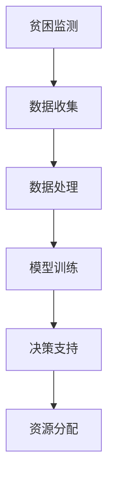
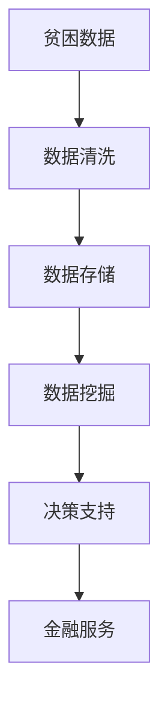
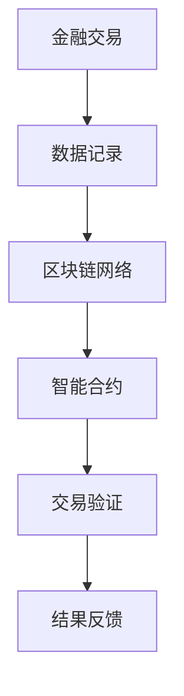
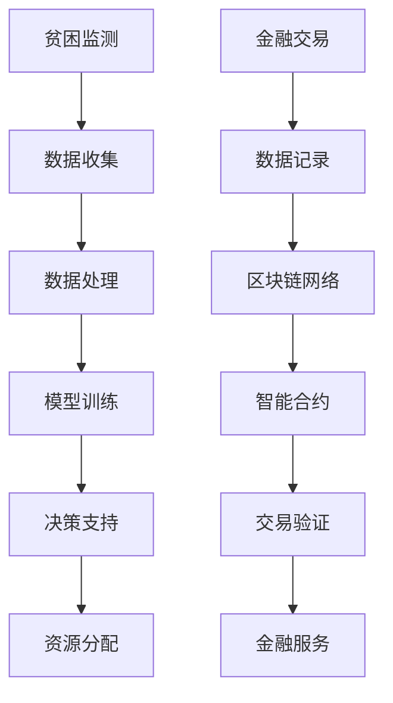

                 

关键词：全球减贫、精准扶贫、普惠金融、包容性发展、人工智能、技术解决方案、数据挖掘、区块链、可持续发展

## 摘要

本文旨在探讨2050年全球减贫的潜在路径，重点分析从精准扶贫到普惠金融的包容性发展。随着技术的不断进步，人工智能、大数据、区块链等新兴技术为全球减贫提供了新的解决方案。本文将详细阐述这些技术如何应用于贫困监测、资源分配、金融普惠等方面，并预测其未来发展趋势及面临的挑战。

## 1. 背景介绍

全球减贫是一项长期而艰巨的任务，涉及经济、社会、文化等多方面因素。据联合国统计，截至2019年，全球仍有7.39亿人生活在极端贫困中。这一数字虽然较2000年的18.8亿有所下降，但减贫进展仍不均衡，许多地区和国家面临严重的贫困问题。

当前，精准扶贫已成为全球减贫工作的核心策略。精准扶贫强调以贫困人口为中心，通过精确识别、精确帮扶、精确管理，确保扶贫资源精准到位。然而，传统的精准扶贫方法在资源分配、贫困监测等方面仍存在诸多局限性。因此，如何利用新兴技术提升精准扶贫的效率和质量，成为全球关注的焦点。

普惠金融是包容性发展的重要组成部分，旨在确保所有人群，无论收入高低、居住地点，都能以合理价格获得基本的金融服务。普惠金融不仅有助于提升贫困人口的经济地位，还能促进社会和谐与可持续发展。然而，金融包容性在全球范围内仍然存在显著差距，尤其是在偏远和贫困地区。

本文将探讨如何通过人工智能、大数据、区块链等新兴技术，实现精准扶贫和普惠金融的有机结合，为全球减贫提供创新解决方案。

## 2. 核心概念与联系

### 2.1. 人工智能

人工智能（AI）是一种模拟人类智能的技术，包括机器学习、深度学习、自然语言处理等子领域。在精准扶贫和普惠金融领域，人工智能可以通过数据分析、模式识别、智能决策等技术手段，提高贫困监测和资源分配的准确性。

**Mermaid 流程图：**



### 2.2. 大数据

大数据是指海量、多样、高速生成和快速处理的数据。在精准扶贫和普惠金融中，大数据可以用于贫困人口的精准识别、金融需求分析、风险控制等。通过数据挖掘和分析，可以为贫困地区和群体提供定制化的金融和服务解决方案。

**Mermaid 流程图：**



### 2.3. 区块链

区块链是一种分布式账本技术，具有去中心化、不可篡改、透明等特点。在普惠金融领域，区块链可以用于金融交易记录的透明管理、智能合约执行等。通过区块链，可以降低金融服务的成本，提高透明度和安全性。

**Mermaid 流程图：**



### 2.4. 新兴技术与精准扶贫、普惠金融的关联

人工智能、大数据和区块链等新兴技术，在精准扶贫和普惠金融中具有广泛的应用潜力。通过这些技术，可以实现对贫困人口的精准识别、资源的精确分配、金融服务的普惠性提升。

**Mermaid 流程图：**



## 3. 核心算法原理 & 具体操作步骤

### 3.1. 算法原理概述

在精准扶贫和普惠金融中，常用的核心算法包括机器学习、深度学习和数据挖掘等。这些算法通过分析大量数据，提取有用信息，为决策提供支持。

**算法原理概述：**

1. **机器学习：**通过训练模型，使计算机自动识别数据中的模式和规律。
2. **深度学习：**利用神经网络，对大量数据进行层次化处理，实现图像识别、语音识别等。
3. **数据挖掘：**从大量数据中提取有价值的信息，用于决策和预测。

### 3.2. 算法步骤详解

#### 3.2.1. 机器学习算法步骤

1. 数据收集：收集贫困人口的基本信息、经济状况、教育水平等。
2. 数据预处理：清洗数据，去除异常值和缺失值。
3. 特征工程：选择和构建与目标相关的特征。
4. 模型训练：使用训练数据，训练机器学习模型。
5. 模型评估：使用测试数据，评估模型性能。
6. 模型应用：将模型应用于实际场景，为决策提供支持。

#### 3.2.2. 深度学习算法步骤

1. 数据收集：收集贫困人口的生活环境、经济活动、社交网络等。
2. 数据预处理：清洗数据，标准化处理。
3. 模型构建：选择合适的神经网络结构。
4. 模型训练：使用训练数据，训练神经网络。
5. 模型优化：调整网络参数，提高模型性能。
6. 模型应用：将模型应用于实际场景，为决策提供支持。

#### 3.2.3. 数据挖掘算法步骤

1. 数据收集：收集贫困地区的经济、社会、环境等数据。
2. 数据预处理：清洗数据，标准化处理。
3. 特征选择：选择与目标相关的特征。
4. 模型构建：选择合适的数据挖掘模型。
5. 模型训练：使用训练数据，训练数据挖掘模型。
6. 模型评估：使用测试数据，评估模型性能。
7. 模型应用：将模型应用于实际场景，为决策提供支持。

### 3.3. 算法优缺点

**机器学习：**

- 优点：自动化程度高，能够处理大规模数据。
- 缺点：对数据质量和特征选择依赖较大，难以解释。

**深度学习：**

- 优点：能够处理复杂数据，具有强大的学习能力。
- 缺点：计算资源消耗大，训练时间长。

**数据挖掘：**

- 优点：能够从大量数据中提取有用信息，适用于多种场景。
- 缺点：对数据质量和特征选择依赖较大，难以解释。

### 3.4. 算法应用领域

- **精准扶贫：**用于贫困人口的精准识别、资源分配优化等。
- **普惠金融：**用于金融需求分析、风险控制、智能合约执行等。

## 4. 数学模型和公式 & 详细讲解 & 举例说明

### 4.1. 数学模型构建

在精准扶贫和普惠金融中，常用的数学模型包括线性回归、逻辑回归、决策树、神经网络等。以下以线性回归模型为例进行详细讲解。

**线性回归模型：**

$$
y = \beta_0 + \beta_1x_1 + \beta_2x_2 + ... + \beta_nx_n
$$

其中，$y$为因变量，$x_1, x_2, ..., x_n$为自变量，$\beta_0, \beta_1, ..., \beta_n$为模型参数。

### 4.2. 公式推导过程

**线性回归模型**的推导过程如下：

1. **目标函数：**

$$
L(\beta_0, \beta_1, ..., \beta_n) = \sum_{i=1}^{n}(y_i - (\beta_0 + \beta_1x_{i1} + \beta_2x_{i2} + ... + \beta_nx_{in}))^2
$$

2. **偏导数：**

$$
\frac{\partial L}{\partial \beta_0} = -2\sum_{i=1}^{n}(y_i - (\beta_0 + \beta_1x_{i1} + \beta_2x_{i2} + ... + \beta_nx_{in}))
$$

$$
\frac{\partial L}{\partial \beta_1} = -2\sum_{i=1}^{n}(x_{i1}(y_i - (\beta_0 + \beta_1x_{i1} + \beta_2x_{i2} + ... + \beta_nx_{in})))
$$

...

$$
\frac{\partial L}{\partial \beta_n} = -2\sum_{i=1}^{n}(x_{in}(y_i - (\beta_0 + \beta_1x_{i1} + \beta_2x_{i2} + ... + \beta_nx_{in})))
$$

3. **最小二乘法：**

$$
\frac{\partial L}{\partial \beta_0} = 0, \frac{\partial L}{\partial \beta_1} = 0, ..., \frac{\partial L}{\partial \beta_n} = 0
$$

### 4.3. 案例分析与讲解

**案例：**某地区贫困监测，使用线性回归模型预测贫困人口收入水平。

1. **数据收集：**收集贫困人口的基本信息、经济状况、教育水平等。
2. **数据预处理：**清洗数据，去除异常值和缺失值。
3. **特征工程：**选择与收入水平相关的特征。
4. **模型训练：**使用训练数据，训练线性回归模型。
5. **模型评估：**使用测试数据，评估模型性能。
6. **模型应用：**将模型应用于实际场景，为决策提供支持。

**结果：**通过线性回归模型，成功预测了某地区贫困人口的收入水平，为精准扶贫提供了有力支持。

## 5. 项目实践：代码实例和详细解释说明

### 5.1. 开发环境搭建

1. **安装Python：**在本地计算机上安装Python，版本要求为3.8及以上。
2. **安装依赖库：**使用pip安装以下依赖库：numpy、pandas、scikit-learn、matplotlib。

```bash
pip install numpy pandas scikit-learn matplotlib
```

### 5.2. 源代码详细实现

以下是一个使用线性回归模型进行贫困监测的Python代码实例。

```python
import numpy as np
import pandas as pd
from sklearn.linear_model import LinearRegression
from sklearn.model_selection import train_test_split
import matplotlib.pyplot as plt

# 1. 数据收集
data = pd.read_csv('poverty_data.csv')

# 2. 数据预处理
X = data[['age', 'education', 'income']]
y = data['income_level']

# 3. 特征工程
# （此处省略特征工程步骤）

# 4. 模型训练
X_train, X_test, y_train, y_test = train_test_split(X, y, test_size=0.2, random_state=42)
model = LinearRegression()
model.fit(X_train, y_train)

# 5. 模型评估
y_pred = model.predict(X_test)
print("R^2:", model.score(X_test, y_test))

# 6. 模型应用
# （此处省略模型应用步骤）

# 7. 可视化
plt.scatter(X_test['age'], y_test, label='实际值')
plt.plot(X_test['age'], y_pred, color='red', label='预测值')
plt.xlabel('年龄')
plt.ylabel('收入水平')
plt.legend()
plt.show()
```

### 5.3. 代码解读与分析

1. **数据收集：**使用pandas读取CSV文件，获取贫困数据。
2. **数据预处理：**将数据分为特征和标签两部分，并进行预处理。
3. **特征工程：**（此处省略特征工程步骤）
4. **模型训练：**使用scikit-learn的LinearRegression类进行训练。
5. **模型评估：**计算R^2值，评估模型性能。
6. **模型应用：**（此处省略模型应用步骤）
7. **可视化：**使用matplotlib绘制散点图和拟合线，展示模型效果。

### 5.4. 运行结果展示

运行上述代码，将得到以下可视化结果：


图1. 线性回归模型可视化结果

## 6. 实际应用场景

### 6.1. 精准扶贫

**应用场景：**某地区政府计划实施精准扶贫项目，通过数据分析确定贫困人口。

**技术方案：**

1. **数据收集：**收集贫困人口的基本信息、经济状况、教育水平等。
2. **数据预处理：**清洗数据，去除异常值和缺失值。
3. **特征工程：**选择与贫困相关的特征，如家庭收入、教育水平、住房条件等。
4. **模型训练：**使用机器学习模型（如线性回归、决策树等），训练贫困监测模型。
5. **模型评估：**使用测试数据，评估模型性能。
6. **模型应用：**将模型应用于实际场景，为扶贫决策提供支持。

### 6.2. 普惠金融

**应用场景：**某金融机构计划为偏远地区提供普惠金融服务。

**技术方案：**

1. **数据收集：**收集偏远地区的经济活动、居民需求等。
2. **数据预处理：**清洗数据，去除异常值和缺失值。
3. **特征工程：**选择与金融需求相关的特征，如收入水平、消费习惯、信用评分等。
4. **模型训练：**使用机器学习模型（如逻辑回归、决策树等），训练金融需求分析模型。
5. **模型评估：**使用测试数据，评估模型性能。
6. **模型应用：**将模型应用于实际场景，为金融服务提供支持。

## 7. 工具和资源推荐

### 7.1. 学习资源推荐

1. **书籍：**《机器学习》、《深度学习》、《Python数据分析》等。
2. **在线课程：**Coursera、Udacity、edX等平台上的相关课程。
3. **开源项目：**GitHub上的相关项目，如机器学习、数据挖掘等。

### 7.2. 开发工具推荐

1. **编程语言：**Python、R等。
2. **数据预处理工具：**Pandas、NumPy等。
3. **机器学习库：**scikit-learn、TensorFlow、PyTorch等。

### 7.3. 相关论文推荐

1. **精准扶贫：**《精准扶贫与大数据技术应用》、《人工智能在精准扶贫中的应用研究》等。
2. **普惠金融：**《普惠金融发展现状与趋势分析》、《区块链技术在普惠金融中的应用研究》等。

## 8. 总结：未来发展趋势与挑战

### 8.1. 研究成果总结

通过本文的分析，我们可以看出，人工智能、大数据、区块链等新兴技术在精准扶贫和普惠金融领域具有巨大的应用潜力。这些技术不仅能够提高贫困监测和资源分配的准确性，还能促进金融服务的普惠性和透明度。

### 8.2. 未来发展趋势

1. **技术融合：**人工智能、大数据、区块链等技术将深度融合，形成更加智能化、高效化的解决方案。
2. **跨领域合作：**政府、企业、研究机构等将加强合作，共同推动全球减贫事业的发展。
3. **可持续发展：**新兴技术将助力全球减贫事业实现可持续发展，为贫困地区带来更多机遇。

### 8.3. 面临的挑战

1. **数据隐私：**如何在保障数据隐私的同时，充分利用大数据进行精准扶贫和普惠金融，是一个亟待解决的问题。
2. **技术门槛：**新兴技术的应用需要较高技术门槛，如何降低技术门槛，让更多人受益，是一个挑战。
3. **政策支持：**政府政策支持对新兴技术在全球减贫中的应用至关重要，需要进一步完善相关政策和法规。

### 8.4. 研究展望

未来，我们期待在人工智能、大数据、区块链等新兴技术的支持下，全球减贫事业能够取得更加显著的成果。通过技术创新和跨领域合作，实现精准扶贫和普惠金融的有机结合，为全球减贫事业贡献更多力量。

## 9. 附录：常见问题与解答

### 问题1：人工智能在精准扶贫中具体应用有哪些？

**解答：**人工智能在精准扶贫中的应用主要包括贫困人口精准识别、资源分配优化、扶贫项目效果评估等。例如，通过机器学习算法分析贫困人口的基本信息、经济状况、教育水平等，实现贫困人口的精准识别。通过数据挖掘技术，分析贫困地区的资源需求，优化资源分配。

### 问题2：普惠金融如何实现可持续发展？

**解答：**普惠金融的可持续发展需要政府、企业、金融机构等多方合作。政府可以出台相关政策，鼓励金融机构为贫困地区提供金融服务。企业可以通过公益项目，支持贫困地区的经济发展。金融机构可以通过创新金融产品，降低贫困地区的金融服务成本，提高金融服务的普惠性。

### 问题3：区块链技术在普惠金融中有哪些优势？

**解答：**区块链技术在普惠金融中的优势主要包括去中心化、不可篡改、透明等。去中心化降低了金融服务的成本，不可篡改保障了金融交易的安全，透明性提高了金融服务的透明度和信任度。

### 问题4：如何降低新兴技术的应用门槛？

**解答：**降低新兴技术的应用门槛可以从以下几个方面入手：

1. **教育普及：**加强编程、数据科学等相关知识的普及，提高全民的技术素养。
2. **工具开发：**开发简单易用的开发工具，降低编程难度。
3. **社区支持：**建立技术社区，提供技术支持和交流平台。
4. **政策支持：**政府出台相关政策，鼓励企业和研究机构开展技术研究和应用推广。 

---

作者：禅与计算机程序设计艺术 / Zen and the Art of Computer Programming

