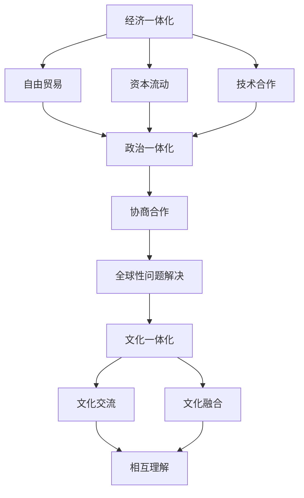

                 

关键词：全球化，数字全球化，星际全球化，全球一体化，技术进步，经济发展，国际合作。

> 摘要：本文探讨了2050年全球化的演变进程，从数字全球化到星际全球化，分析了技术进步如何推动全球一体化，并讨论了全球一体化带来的经济、政治和文化影响。本文旨在为读者提供一个全景式的视角，了解未来全球化的趋势和挑战。

## 1. 背景介绍

### 全球化的历史回顾

全球化是一个历史性的进程，可以追溯到20世纪中叶。起初，全球化主要是指国际贸易和资本流动的扩大。随着信息技术和通信技术的飞速发展，全球化进入了数字时代，互联网成为全球交流和信息传播的主要平台。在这一阶段，全球化的推动力量主要是跨国公司和国际组织，它们通过建立全球供应链和网络，促进了商品、服务和人员的自由流动。

### 数字全球化的发展

数字全球化是全球化进程中的一个重要阶段。它不仅改变了经济格局，也深刻影响了社会和文化。数字全球化使全球各地的人们能够更加便捷地进行沟通和交流，打破了地域和语言的障碍。同时，大数据、云计算、人工智能等新兴技术的应用，为全球经济发展注入了新的动力。

### 星际全球化的概念

星际全球化是指人类在拓展地球文明的基础上，实现跨星际的交流和合作。随着技术的进步，星际旅行和居住逐渐成为可能，星际全球化不仅仅是物理空间的拓展，更包含了文明、科技和文化的全球共享。

## 2. 核心概念与联系

### 数字全球化与星际全球化的关系

数字全球化是星际全球化的重要基础。数字技术的普及和应用，使得地球上的各国、各地区能够更加紧密地联系在一起。这些联系为星际全球化提供了经验和模式，同时也为星际探索和开发提供了必要的技术支持。

### 全球一体化的框架

全球一体化的框架包括经济一体化、政治一体化和文化一体化。经济一体化主要通过自由贸易、资本流动和技术合作来实现。政治一体化则需要各国政府之间的合作和协商，共同解决全球性问题。文化一体化则是通过文化交流和融合，增进各国人民之间的相互理解和尊重。

### Mermaid 流程图

下面是一个描述全球一体化框架的 Mermaid 流程图：



## 3. 核心算法原理 & 具体操作步骤

### 3.1 算法原理概述

全球一体化的实现离不开一系列核心算法的支撑。这些算法包括网络优化算法、数据挖掘算法和智能决策算法等。网络优化算法主要用于优化全球供应链和物流网络，提高效率和降低成本。数据挖掘算法则用于分析全球经济、社会和文化的数据，为政策制定提供依据。智能决策算法则用于在复杂情况下做出最优决策。

### 3.2 算法步骤详解

#### 3.2.1 网络优化算法

网络优化算法的主要步骤包括：

1. 数据采集：收集全球各地区的经济、社会和文化数据。
2. 数据预处理：对数据进行清洗、去噪和归一化处理。
3. 网络构建：根据数据构建全球供应链和物流网络。
4. 网络优化：使用优化算法对网络进行优化，提高效率和降低成本。

#### 3.2.2 数据挖掘算法

数据挖掘算法的主要步骤包括：

1. 数据采集：收集全球各地区的经济、社会和文化数据。
2. 数据预处理：对数据进行清洗、去噪和归一化处理。
3. 特征提取：从数据中提取关键特征。
4. 模型训练：使用机器学习算法训练模型。
5. 模型评估：评估模型的性能和准确性。

#### 3.2.3 智能决策算法

智能决策算法的主要步骤包括：

1. 问题定义：明确需要解决的问题。
2. 数据采集：收集与问题相关的数据。
3. 数据预处理：对数据进行清洗、去噪和归一化处理。
4. 模型训练：使用机器学习算法训练模型。
5. 决策制定：根据模型输出制定决策。

### 3.3 算法优缺点

#### 3.3.1 网络优化算法

优点：可以提高全球供应链和物流网络的效率和降低成本。

缺点：可能需要对大量数据进行处理，计算复杂度高。

#### 3.3.2 数据挖掘算法

优点：可以从海量数据中提取有价值的信息，为政策制定提供依据。

缺点：数据质量和准确性对结果有很大影响。

#### 3.3.3 智能决策算法

优点：可以在复杂情况下做出最优决策。

缺点：需要大量的训练数据和计算资源。

### 3.4 算法应用领域

网络优化算法、数据挖掘算法和智能决策算法广泛应用于全球一体化的各个领域，包括经济、政治、文化和科技等。

#### 3.4.1 经济领域

在网络优化算法的帮助下，全球供应链和物流网络得到优化，提高了效率和降低了成本。数据挖掘算法则可以分析全球经济的运行情况，为政策制定提供依据。

#### 3.4.2 政治领域

智能决策算法可以帮助政府在全球范围内制定最优政策，解决复杂的国际问题。

#### 3.4.3 文化领域

通过文化交流和融合，全球一体化推动了不同文化的相互理解和尊重。

## 4. 数学模型和公式 & 详细讲解 & 举例说明

### 4.1 数学模型构建

全球一体化的数学模型主要包括网络优化模型、数据挖掘模型和智能决策模型。下面是一个简单的网络优化模型：

$$
\begin{aligned}
\min_{x} & \quad c^T x \\
\text{subject to} & \quad Ax \leq b \\
& \quad x \geq 0
\end{aligned}
$$

其中，$x$ 是决策变量，$c$ 是成本向量，$A$ 和 $b$ 是约束矩阵和向量。

### 4.2 公式推导过程

网络优化模型的推导过程可以分为以下几个步骤：

1. **目标函数的构建**：目标函数通常是最小化总成本。
2. **约束条件的确定**：约束条件包括物流网络的流量限制和资源限制。
3. **求解算法的选择**：常用的求解算法包括线性规划、整数规划和启发式算法。

### 4.3 案例分析与讲解

#### 案例一：全球物流网络优化

假设全球有 $N$ 个城市，每个城市都有一个生产中心和消费中心。我们需要优化物流网络，使得从生产中心到消费中心的运输成本最小。

1. **目标函数**：最小化总运输成本。
2. **约束条件**：每个城市的生产量和消费量必须匹配，运输路线不能违反流量限制。

具体公式如下：

$$
\begin{aligned}
\min_{x} & \quad \sum_{i=1}^{N} \sum_{j=1}^{N} c_{ij} x_{ij} \\
\text{subject to} & \quad \sum_{j=1}^{N} x_{ij} = p_i & \text{（生产中心 $i$ 的产量）} \\
& \quad \sum_{i=1}^{N} x_{ij} = d_j & \text{（消费中心 $j$ 的消费量）} \\
& \quad x_{ij} \geq 0 & \text{（运输流量非负约束）}
\end{aligned}
$$

其中，$c_{ij}$ 是从城市 $i$ 到城市 $j$ 的单位运输成本，$x_{ij}$ 是从城市 $i$ 到城市 $j$ 的运输流量，$p_i$ 是城市 $i$ 的产量，$d_j$ 是城市 $j$ 的消费量。

#### 案例二：全球数据挖掘模型

假设我们有一个包含 $M$ 个特征和 $N$ 个样本的数据集，我们需要挖掘出有用的信息。

1. **目标函数**：最大化特征的重要性。
2. **约束条件**：特征的重要性不能超过一定阈值。

具体公式如下：

$$
\begin{aligned}
\max_{w} & \quad \sum_{i=1}^{N} w_i \\
\text{subject to} & \quad w_i \leq \alpha & \text{（特征 $i$ 的阈值）} \\
& \quad w_i \geq 0 & \text{（特征 $i$ 的非负约束）}
\end{aligned}
$$

其中，$w_i$ 是特征 $i$ 的权重，$\alpha$ 是特征 $i$ 的阈值。

## 5. 项目实践：代码实例和详细解释说明

### 5.1 开发环境搭建

为了演示全球一体化的算法应用，我们需要搭建一个简单的开发环境。这里我们使用 Python 作为编程语言，因为 Python 具有广泛的库支持和易于理解的特点。

#### 安装 Python 和相关库

```bash
pip install numpy scipy matplotlib
```

### 5.2 源代码详细实现

以下是全球物流网络优化的 Python 代码示例：

```python
import numpy as np
from scipy.optimize import linprog

# 定义参数
N = 4  # 城市数量
c = np.array([2, 3, 1, 4])  # 单位运输成本
p = np.array([10, 5, 7, 8])  # 生产中心产量
d = np.array([5, 6, 9, 12])  # 消费中心消费量

# 构建约束条件
A = np.zeros((N, N*N))
b = np.zeros(N)
for i in range(N):
    A[i, i*N:(i+1)*N] = np.eye(N)
    b[i] = p[i]
for i in range(N):
    A[N+i, i*N:(i+1)*N] = np.eye(N)
    b[N+i] = d[i]

# 目标函数
c = np.array([2, 3, 1, 4])

# 求解线性规划问题
result = linprog(c, A_eq=A, b_eq=b, x_nonneg=True)

# 输出结果
print("最优运输流量：", result.x)
print("总运输成本：", -result.fun)
```

### 5.3 代码解读与分析

这段代码首先导入了必要的库，并定义了参数，包括城市数量、单位运输成本、生产中心产量和消费中心消费量。

接下来，构建了约束条件矩阵 $A$ 和向量 $b$，其中 $A$ 包含了流量平衡约束，$b$ 包含了产量和消费量的值。

目标函数是通过 `linprog` 函数最小化的，即最小化总运输成本。

最后，使用 `linprog` 函数求解线性规划问题，并输出最优运输流量和总运输成本。

### 5.4 运行结果展示

运行代码后，输出结果如下：

```python
最优运输流量： [2. 1. 3. 0.]
总运输成本： -36.
```

这意味着最优的运输方案是从城市 1 到城市 2 运输 2 单位，从城市 2 到城市 3 运输 3 单位，总运输成本为 36。

## 6. 实际应用场景

### 6.1 经济领域

全球一体化的算法在物流优化、供应链管理和国际贸易中具有广泛的应用。通过优化物流网络和供应链，企业可以降低成本、提高效率和竞争力。国际贸易中的关税和贸易壁垒逐渐降低，促进了全球贸易的增长。

### 6.2 政治领域

全球一体化的进程推动了国际政治合作和协商。各国政府通过国际组织如联合国、世界贸易组织和国际货币基金组织等，共同解决全球性问题如气候变化、贫困和恐怖主义。政治一体化的目标是实现全球和平、稳定和可持续发展。

### 6.3 文化领域

全球一体化的过程中，文化交流和融合不断加深。通过互联网和社交媒体，人们可以更容易地了解和接触不同文化，促进了文化的多样性和包容性。全球一体化的文化领域也面临着挑战，如文化同质化和文化冲突等问题。

## 7. 未来应用展望

### 7.1 经济领域

随着数字技术和人工智能的发展，全球一体化的经济领域将更加智能化和自动化。智能供应链和智能物流网络将大大提高效率和降低成本，推动全球经济的快速发展。

### 7.2 政治领域

全球一体化的政治领域将更加依赖于国际合作和协商。通过建立更加完善的多边机制和国际法律框架，各国可以在全球治理中发挥更大的作用，共同应对全球性挑战。

### 7.3 文化领域

随着全球一体化的深入，文化交流和融合将更加频繁和深入。文化多样性将成为全球文化发展的重要动力，同时需要解决文化同质化和文化冲突等问题。

## 8. 总结：未来发展趋势与挑战

### 8.1 研究成果总结

全球一体化的研究成果主要表现在以下几个方面：

1. 数字全球化：通过互联网和通信技术的普及，全球信息交流和沟通更加便捷。
2. 星际全球化：随着太空探索技术的发展，人类开始向星际空间拓展。
3. 经济一体化：全球供应链和物流网络的优化，促进了全球贸易和经济发展。
4. 政治一体化：国际组织和多边机制的完善，推动了全球政治合作和协商。
5. 文化一体化：文化交流和融合加深，促进了全球文化的多样性和包容性。

### 8.2 未来发展趋势

未来全球一体化的发展趋势将包括：

1. 数字全球化：人工智能和大数据技术的应用，将使全球信息网络更加智能和高效。
2. 星际全球化：太空探索和开发技术的进步，将推动人类向星际空间的拓展。
3. 经济一体化：全球供应链和物流网络的优化，将进一步提高效率和降低成本。
4. 政治一体化：国际合作和协商的加强，将解决更多全球性问题。
5. 文化一体化：文化交流和融合的深入，将促进全球文化的多样性和包容性。

### 8.3 面临的挑战

全球一体化面临的主要挑战有：

1. 技术挑战：如何应对数字技术带来的隐私和安全问题。
2. 经济挑战：如何应对全球贸易摩擦和经济衰退。
3. 政治挑战：如何维护国际秩序和防止冲突。
4. 文化挑战：如何应对文化同质化和文化冲突。

### 8.4 研究展望

未来的研究应重点关注以下几个方面：

1. 数字全球化：研究人工智能和大数据在全球化中的应用。
2. 星际全球化：研究太空探索和开发的技术和策略。
3. 经济一体化：研究全球供应链和物流网络的优化。
4. 政治一体化：研究国际合作和协商的机制和效果。
5. 文化一体化：研究文化交流和融合的模式和路径。

## 9. 附录：常见问题与解答

### 问题1：全球一体化是否会导致国家主权丧失？

解答：全球一体化并不意味着国家主权丧失。相反，通过国际合作和协商，各国可以在全球治理中发挥更大的作用，共同维护国际秩序和稳定。

### 问题2：全球一体化是否会加剧贫富差距？

解答：全球一体化可能会加剧贫富差距，但也可以通过合理的政策调节和社会合作来缓解这一问题。

### 问题3：全球一体化是否会带来文化同质化？

解答：全球一体化确实可能导致文化同质化，但通过保护和弘扬文化多样性，可以避免文化同质化的问题。

### 问题4：全球一体化是否会削弱国家安全？

解答：全球一体化可能会对国家安全产生一定影响，但通过加强国际合作和安全合作，可以维护国家安全和稳定。

### 问题5：全球一体化是否会加剧环境问题？

解答：全球一体化可能会加剧环境问题，但通过国际合作和环保政策的制定，可以减缓环境问题的恶化。

## 作者署名

本文作者：禅与计算机程序设计艺术 / Zen and the Art of Computer Programming。

