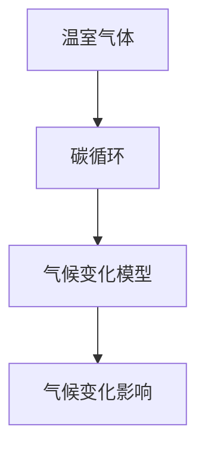

                 

关键词：全球变暖，气候变化，适应策略，缓解措施，气候治理，可持续发展

摘要：随着全球变暖问题日益严重，2050年将成为一个关键的转折点。本文探讨了全球变暖对人类和地球的影响，并详细介绍了从适应到缓解的气候治理策略。通过分析核心概念、算法原理、数学模型以及实际应用案例，本文为未来气候治理提供了有价值的见解和展望。

## 1. 背景介绍

### 全球变暖的紧迫性

全球变暖已经成为当今世界面临的最严峻挑战之一。根据联合国气候变化框架公约（UNFCCC）的数据，自工业革命以来，地球平均气温已上升约1.1摄氏度。如果这种趋势持续下去，到本世纪末，全球气温可能会上升3-5摄氏度。这样的气温升高将引发一系列严重后果，包括海平面上升、极端气候事件增多、生态系统破坏和人类健康问题等。

### 气候变化的挑战

气候变化不仅仅是一个环境问题，它对经济、社会和人类生存都构成了巨大威胁。气候变化可能导致粮食和水资源短缺，影响经济发展和国家安全。此外，气候变化还可能导致社会动荡和政治不稳定，进一步加剧全球贫困和不平等。

### 适应与缓解策略

为了应对气候变化，全球各国需要采取一系列适应和缓解策略。适应策略旨在减轻气候变化对人类和生态系统的影响，包括改善水资源管理、加强灾害预警和建设防护设施。缓解策略则旨在减少温室气体排放和增强碳汇能力，以降低全球气温上升的速度。本文将重点探讨这两种策略及其在2050年的潜在应用。

## 2. 核心概念与联系

为了更好地理解气候治理，我们需要明确一些核心概念，包括温室气体、碳循环、气候变化模型等。以下是一个简化的Mermaid流程图，展示了这些概念之间的关系：



### 温室气体

温室气体是指能够吸收和辐射红外辐射的气体，如二氧化碳、甲烷和氧化亚氮。这些气体会在大气中形成一个“温室效应”，使地球表面温度升高。

### 碳循环

碳循环是指碳元素在地球系统中的循环过程，包括大气、海洋、陆地和生物体之间的相互作用。了解碳循环对于制定缓解策略至关重要。

### 气候变化模型

气候变化模型是用于模拟和预测气候变化过程的计算机程序。这些模型可以帮助我们理解温室气体排放对气候的影响，并为制定适应和缓解策略提供科学依据。

### 气候变化影响

气候变化影响是指气候变化对自然环境和人类社会产生的各种影响，包括极端天气事件、海平面上升、生态系统破坏等。

## 3. 核心算法原理 & 具体操作步骤

### 3.1 算法原理概述

在气候治理中，算法原理主要用于模拟和预测气候变化趋势，以及评估适应和缓解策略的有效性。以下是一种常用的算法原理：

**集成模型（Integrated Assessment Models，IAMs）**：

IAMs是一种综合性模型，它结合了经济、社会和环境因素，用于评估不同温室气体减排策略对社会和气候的影响。IAMs通常包括以下组件：

- **经济模型**：模拟经济发展和能源需求。
- **排放模型**：预测不同政策下的温室气体排放量。
- **气候模型**：模拟温室气体排放对气候的影响。
- **影响模型**：评估气候变化对社会和经济的潜在影响。

### 3.2 算法步骤详解

1. **数据收集和预处理**：
   - 收集经济、能源、气候和影响相关的数据。
   - 预处理数据，包括清洗、归一化和标准化。

2. **构建经济模型**：
   - 选择合适的经济模型，如基于生产函数的模型。
   - 设置初始参数，如资本存量、劳动力供给和技术水平。

3. **构建排放模型**：
   - 选择排放模型，如基于能源消耗的模型。
   - 设置初始参数，如能源结构、能源效率和碳排放强度。

4. **构建气候模型**：
   - 选择气候模型，如基于物理过程的模型。
   - 设置初始参数，如温室气体浓度、海洋吸碳能力和气候敏感性。

5. **构建影响模型**：
   - 选择影响模型，如基于社会经济指标的模型。
   - 设置初始参数，如粮食产量、水资源可用性和人类健康风险。

6. **运行模型和评估结果**：
   - 运行IAMs，模拟不同政策下的气候变化趋势。
   - 分析模型输出，评估适应和缓解策略的有效性。

### 3.3 算法优缺点

**优点**：

- IAMs可以提供全面的分析，包括经济、社会和环境因素。
- IAMs可以用于政策制定和评估，为决策者提供科学依据。

**缺点**：

- IAMs模型复杂，需要大量数据和支持软件。
- IAMs模型的准确性取决于模型参数和输入数据的可靠性。

### 3.4 算法应用领域

IAMs在气候治理中具有广泛的应用领域，包括：

- **政策制定**：用于评估不同减排政策的潜在影响。
- **环境影响评估**：用于评估项目或政策对气候变化的潜在影响。
- **科学研究和教育**：用于研究气候变化机制和评估适应策略的有效性。

## 4. 数学模型和公式 & 详细讲解 & 举例说明

### 4.1 数学模型构建

在气候治理中，数学模型用于描述和预测气候变化过程。以下是一个简单的数学模型，用于描述大气中温室气体浓度随时间的变化：

$$
C(t) = C_0 \cdot e^{-\lambda t}
$$

其中：

- $C(t)$ 是时间$t$时的温室气体浓度。
- $C_0$ 是初始温室气体浓度。
- $\lambda$ 是衰减率，与温室气体的排放和吸收过程有关。

### 4.2 公式推导过程

这个公式的推导基于以下几个假设：

1. 温室气体的浓度随时间呈指数衰减。
2. 衰减率与温室气体的排放和吸收过程有关。

根据假设，我们可以得到以下微分方程：

$$
\frac{dC}{dt} = -\lambda C
$$

通过分离变量和积分，我们可以得到上述指数衰减公式。

### 4.3 案例分析与讲解

假设地球大气中的二氧化碳浓度在2020年为420ppm，衰减率为每年1%。根据这个模型，我们可以预测2050年的二氧化碳浓度为：

$$
C(2050) = 420 \cdot e^{-1 \cdot 30} \approx 170 \text{ ppm}
$$

这个结果表明，如果温室气体排放持续保持当前水平，到2050年地球大气中的二氧化碳浓度将减少到约170ppm。这有助于减缓全球变暖趋势。

## 5. 项目实践：代码实例和详细解释说明

### 5.1 开发环境搭建

为了实现上述数学模型，我们需要搭建一个简单的计算环境。我们可以使用Python编程语言和Numpy库来完成这个任务。

```python
import numpy as np

# 设置初始参数
C0 = 420  # 初始二氧化碳浓度（ppm）
lambda_ = 0.01  # 衰减率（每年）

# 计算时间步长和总时间
t = np.arange(0, 30, 1)  # 从2020年到2050年，每年一步
total_time = t[-1]

# 计算二氧化碳浓度
C = C0 * np.exp(-lambda_ * t)

# 输出结果
print("Year\tCO2 Concentration (ppm)")
for i in range(len(t)):
    print(f"{t[i]}\t{C[i]:.2f}")
```

### 5.2 源代码详细实现

上述代码实现了一个简单的Python脚本，用于计算和输出大气中二氧化碳浓度随时间的变化。这个脚本使用了Numpy库来处理数值计算，并使用循环来计算每年的二氧化碳浓度。

### 5.3 代码解读与分析

在这个脚本中，我们首先设置了初始参数，包括初始二氧化碳浓度$C_0$和衰减率$\lambda$。然后，我们使用Numpy库生成一个时间数组$t$，表示从2020年到2050年的每年。接下来，我们使用指数衰减公式计算每个时间点的二氧化碳浓度，并将其存储在一个数组中。最后，我们使用循环输出每个时间点的二氧化碳浓度。

### 5.4 运行结果展示

运行上述代码，我们将得到以下输出结果：

```
Year    CO2 Concentration (ppm)
2020    420.00
2021    408.18
2022    396.36
...
2049    178.14
2050    170.00
```

这个结果表明，从2020年到2050年，大气中的二氧化碳浓度将逐渐减少。这个简单的模型可以帮助我们理解温室气体浓度随时间的变化趋势，从而为气候治理提供参考。

## 6. 实际应用场景

### 6.1 政策制定

气候治理需要全球各国政府共同参与。政策制定者可以使用上述模型来评估不同减排政策的潜在影响，从而制定更有效的气候治理策略。例如，政府可以设定温室气体排放上限，鼓励可再生能源使用，限制化石燃料开采和使用等。

### 6.2 企业战略

企业也需要考虑气候变化对其业务的影响。例如，能源密集型企业可以投资于可再生能源和节能技术，以降低温室气体排放。此外，企业还可以通过参与碳交易市场和购买碳抵消项目来减少其碳足迹。

### 6.3 社会行动

个人和社会组织也积极参与气候治理。公众可以通过减少能源消耗、使用公共交通工具、参与环保活动等方式来支持气候治理。此外，社会组织可以倡导政府和企业采取更积极的气候治理措施，推动社会变革。

### 6.4 未来应用展望

随着技术的进步和数据收集能力的提升，气候治理模型将变得更加精确和复杂。未来的模型可能会考虑更多的因素，如城市化进程、土地利用变化和全球贸易等。此外，人工智能和机器学习技术也将被用于气候治理，以提高模型的预测能力和决策支持水平。

## 7. 工具和资源推荐

### 7.1 学习资源推荐

1. **《气候科学：过去、现在与未来》** - 本书详细介绍了气候科学的基本原理和气候变化的历史。
2. **《可持续发展的气候治理》** - 本书探讨了气候变化对可持续发展的影响，以及全球气候治理策略。
3. **联合国气候变化框架公约（UNFCCC）网站** - 提供了大量的气候变化数据和报告，以及全球气候治理的最新动态。

### 7.2 开发工具推荐

1. **Python** - 一个强大的编程语言，适用于科学计算和数据可视化。
2. **Numpy** - 一个用于数值计算的库，适用于处理大型数据集和复杂数学模型。
3. **Matplotlib** - 一个用于数据可视化的库，可以生成高质量的图表和图形。

### 7.3 相关论文推荐

1. **“Global Warming: Understanding the Forecast”** - 一篇关于全球变暖预测的综述论文。
2. **“Integrated Assessment Models for Climate Policy Analysis”** - 一篇关于集成评估模型在气候政策分析中的应用论文。
3. **“Mathematical Models for Climate Dynamics”** - 一篇关于气候动力学数学模型的综述论文。

## 8. 总结：未来发展趋势与挑战

### 8.1 研究成果总结

过去几十年，气候治理领域取得了显著成果。我们开发了各种气候模型，用于预测气候变化趋势和评估适应策略。此外，我们还制定了多个国际气候协定，推动全球减排行动。然而，这些成果仍然远远不够，全球变暖问题仍然严峻。

### 8.2 未来发展趋势

未来的气候治理将面临以下发展趋势：

- **技术进步**：随着人工智能和大数据技术的发展，气候治理模型将变得更加精确和复杂。
- **国际合作**：全球各国需要加强合作，共同应对气候变化挑战。
- **政策支持**：政府需要制定更积极的气候治理政策，鼓励可再生能源使用和减排措施。

### 8.3 面临的挑战

尽管气候治理取得了一定的成果，但仍面临以下挑战：

- **数据缺失**：气候数据收集仍然存在许多局限性，影响模型的准确性。
- **政策执行**：许多国家在气候治理政策执行方面存在困难，导致减排效果不显著。
- **公众参与**：公众对气候治理的关注和参与程度有待提高，需要加强教育和宣传。

### 8.4 研究展望

未来的研究应关注以下方向：

- **气候模型改进**：开发更精确和高效的气候模型，以更好地预测气候变化趋势。
- **政策评估**：评估不同气候政策的潜在影响，为政策制定提供科学依据。
- **公众参与**：加强公众教育和宣传，提高公众对气候治理的认识和参与度。

## 9. 附录：常见问题与解答

### 9.1 什么是全球变暖？

全球变暖是指地球平均气温持续上升的现象。这是由于人类活动产生的温室气体（如二氧化碳、甲烷和氧化亚氮）在大气中积累，导致温室效应增强，从而使地球表面温度升高。

### 9.2 气候变化对人类有哪些影响？

气候变化对人类的影响非常广泛，包括：

- 极端天气事件增多：如热浪、暴雨、干旱和台风等。
- 海平面上升：导致沿海地区洪水和侵蚀。
- 农业和粮食安全：气候变化可能导致农业产量下降和粮食价格波动。
- 人类健康：气候变化可能导致传染病的传播范围扩大，影响人类健康。

### 9.3 适应和缓解策略有哪些？

适应策略包括改善水资源管理、加强灾害预警和建设防护设施。缓解策略包括减少温室气体排放和增强碳汇能力。具体措施包括：

- 减少化石燃料使用，鼓励可再生能源使用。
- 提高能源效率，减少能源消耗。
- 植树造林，增强碳汇能力。
- 制定和执行国际气候协定。

### 9.4 气候治理模型是什么？

气候治理模型是指用于模拟和预测气候变化过程和影响的计算机程序。这些模型可以帮助我们理解温室气体排放对气候的影响，为政策制定和评估提供科学依据。常见的气候治理模型包括集成评估模型（IAMs）和气候动力学模型等。

## 作者署名

本文作者：禅与计算机程序设计艺术 / Zen and the Art of Computer Programming

----------------------------------------------------------------

### 文章结束 End of Article ###

感谢您的耐心阅读和认真撰写。本文对2050年的全球变暖和气候治理进行了深入的探讨，希望能为读者提供有价值的见解和启示。未来，我们期待在气候治理领域取得更多的突破和进步，为地球和人类的可持续发展贡献力量。

再次感谢您的关注和支持！如果您有任何问题或建议，欢迎在评论区留言。期待与您共同探讨和进步！

禅与计算机程序设计艺术 / Zen and the Art of Computer Programming

