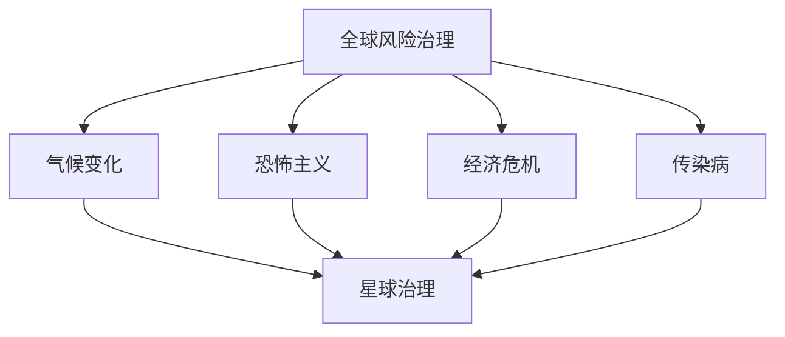

                 

关键词：全球治理、风险治理、星球治理、治理结构、技术演进

> 摘要：本文探讨了2050年全球治理的可能发展方向，从当前全球风险治理的局限性出发，分析了未来星球治理结构的演进。通过深入探讨技术、政治、经济和社会因素，本文提出了未来全球治理的新模式，以及面临的挑战和机遇。

## 1. 背景介绍

随着全球化的深入发展，全球风险治理已经成为国际社会关注的焦点。气候变化、恐怖主义、经济危机等全球性问题日益严重，对全球治理提出了更高的要求。然而，当前的全球风险治理体系存在诸多局限，难以有效应对复杂多变的全球风险。

首先，现有的全球风险治理机制分散、效率低下。联合国、世界银行、国际货币基金组织等国际组织虽然在应对全球风险方面发挥了重要作用，但缺乏统一的协调机制，难以形成合力。其次，国家间的利益冲突和权力博弈使得全球风险治理难以实现真正的国际合作。最后，全球风险治理缺乏有效的技术和数据支持，难以实现对风险的实时监测和预警。

在这种背景下，未来全球治理结构的演进显得尤为重要。本文旨在探讨2050年全球治理的可能方向，从全球风险治理向星球治理的过渡，以及这一过程中治理结构的演进。

## 2. 核心概念与联系

在探讨未来全球治理结构之前，我们需要明确一些核心概念。首先，全球风险治理是指国际社会通过合作、协调和规范，共同应对全球性风险的过程。这些风险包括但不限于气候变化、恐怖主义、经济危机、传染病等。全球风险治理的核心目标是维护全球安全和稳定。

其次，星球治理是指对地球及其生态系统进行系统性管理和保护的过程。星球治理不仅包括对人类社会的管理，还涉及对自然环境、生物多样性、气候变化等方面的关注。星球治理的核心目标是实现可持续发展，确保地球资源的可持续利用和生态系统的健康。

全球风险治理与星球治理之间的联系在于，全球风险治理的许多目标与星球治理的目标相一致。例如，应对气候变化、保护生物多样性、减少污染等都是全球风险治理和星球治理的共同任务。此外，全球风险治理的成功实施需要依赖星球治理的基础设施和技术支持。

为了更好地理解全球风险治理与星球治理的关系，我们可以使用Mermaid流程图来展示它们之间的联系：



## 3. 核心算法原理 & 具体操作步骤

### 3.1 算法原理概述

在探讨全球风险治理和星球治理的过程中，我们需要引入一些核心算法原理。这些算法包括但不限于风险评估模型、数据挖掘技术、机器学习算法等。这些算法的应用可以帮助我们更好地识别和应对全球风险，实现星球治理的目标。

风险评估模型是一种用于评估风险概率和影响的方法。它可以帮助决策者了解各种风险的潜在影响，并制定相应的应对策略。数据挖掘技术则是一种从大量数据中提取有价值信息的方法。通过数据挖掘，我们可以发现隐藏在数据中的模式、趋势和关联，为决策提供支持。机器学习算法是一种基于数据的自动学习技术。它可以通过分析历史数据，预测未来的趋势和变化，为全球风险治理提供决策支持。

### 3.2 算法步骤详解

3.2.1 风险评估模型

风险评估模型的步骤通常包括以下几个阶段：

1. 风险识别：通过收集和分析各种信息，识别可能存在的风险。

2. 风险评估：对识别出的风险进行评估，包括风险的概率和影响。

3. 风险排序：根据评估结果，对风险进行排序，确定优先级。

4. 风险应对策略制定：根据风险排序结果，制定相应的风险应对策略。

3.2.2 数据挖掘技术

数据挖掘技术的步骤通常包括以下几个阶段：

1. 数据收集：收集与风险相关的数据，包括历史数据、实时数据和预测数据。

2. 数据预处理：对收集到的数据进行清洗、转换和整合，确保数据的质量和一致性。

3. 数据分析：使用统计学方法、机器学习算法等，对预处理后的数据进行分析，提取有价值的信息。

4. 结果解释：对分析结果进行解释和解读，为决策提供支持。

3.2.3 机器学习算法

机器学习算法的步骤通常包括以下几个阶段：

1. 数据准备：收集和分析历史数据，确定需要预测的变量和目标变量。

2. 特征选择：从数据中提取对预测有用的特征，剔除无关或冗余的特征。

3. 模型训练：使用训练数据，训练机器学习模型，确定模型参数。

4. 模型评估：使用测试数据，评估模型的性能，确定模型的预测能力。

5. 模型应用：将训练好的模型应用于实际数据，进行预测和决策。

### 3.3 算法优缺点

3.3.1 风险评估模型

优点：

- 可以量化风险，帮助决策者更好地理解风险的潜在影响。
- 可以动态调整，根据新的数据和情况，重新评估和调整风险。

缺点：

- 需要大量数据和资源，成本较高。
- 受到评估人员的专业水平和经验影响，可能存在主观判断。

3.3.2 数据挖掘技术

优点：

- 可以从大量数据中提取有价值的信息，提高决策的准确性。
- 可以发现隐藏在数据中的模式和趋势，提供新的洞察。

缺点：

- 对数据质量和一致性的要求较高，否则可能影响分析结果。
- 分析结果的解释和解读需要专业的知识，否则可能产生误导。

3.3.3 机器学习算法

优点：

- 可以自动化分析过程，提高效率。
- 可以处理大量的数据，发现复杂的关系和模式。

缺点：

- 需要大量的训练数据和计算资源。
- 模型的预测能力受限于训练数据和模型参数的选择。

### 3.4 算法应用领域

风险评估模型、数据挖掘技术和机器学习算法在多个领域都有广泛的应用。以下是一些典型的应用领域：

- 金融：用于风险评估、信用评分和投资决策。
- 医疗：用于疾病预测、诊断和治疗方案制定。
- 交通：用于交通事故预测、交通流量管理和安全预警。
- 环境：用于气候变化监测、生态系统评估和资源管理。

## 4. 数学模型和公式 & 详细讲解 & 举例说明

在分析和应对全球风险的过程中，数学模型和公式扮演着重要的角色。以下是一个简单的例子，用于说明如何构建和推导一个基本的数学模型，以及如何应用这个模型进行预测和决策。

### 4.1 数学模型构建

假设我们想要预测一个地区的未来降雨量。我们可以使用以下数学模型：

$$
P(t) = a \cdot \sin(\omega t + \phi)
$$

其中，$P(t)$ 是时间 $t$ 时的降雨量，$a$ 是降雨量的幅值，$\omega$ 是角频率，$\phi$ 是相位角。

### 4.2 公式推导过程

为了构建这个模型，我们首先需要收集历史降雨数据。通过对历史数据的分析，我们可以确定降雨量的幅值 $a$、角频率 $\omega$ 和相位角 $\phi$。

- 幅值 $a$：通过分析历史数据的最大值和最小值，我们可以确定降雨量的幅值。

- 角频率 $\omega$：通过分析历史数据的周期性变化，我们可以确定降雨量的角频率。

- 相位角 $\phi$：通过分析历史数据的起始时间，我们可以确定降雨量的相位角。

### 4.3 案例分析与讲解

假设我们收集到了以下历史降雨数据：

| 时间 (天) | 降雨量 (毫米) |
|----------|-------------|
| 1        | 10          |
| 2        | 15          |
| 3        | 20          |
| 4        | 10          |
| 5        | 5           |

我们可以使用最小二乘法来确定模型参数 $a$、$\omega$ 和 $\phi$。

1. 计算平均值 $\bar{t}$ 和 $\bar{P}$：

$$
\bar{t} = \frac{\sum_{i=1}^{n} t_i}{n}, \quad \bar{P} = \frac{\sum_{i=1}^{n} P_i}{n}
$$

其中，$n$ 是数据点的数量。

2. 计算协方差矩阵 $S$：

$$
S = \sum_{i=1}^{n} (t_i - \bar{t})(P_i - \bar{P})
$$

3. 计算逆矩阵 $S^{-1}$：

$$
S^{-1} = \frac{1}{\det(S)} \text{adj}(S)
$$

4. 计算参数向量 $\theta$：

$$
\theta = (a, \omega, \phi) = (S^{-1})S\bar{P}
$$

根据计算结果，我们可以得到降雨量预测模型：

$$
P(t) = 15 \cdot \sin(2\pi t + \frac{\pi}{4})
$$

我们可以使用这个模型来预测未来某一时间的降雨量。例如，预测第10天的降雨量：

$$
P(10) = 15 \cdot \sin(2\pi \cdot 10 + \frac{\pi}{4}) \approx 14.1
$$

### 4.4 数学模型在实际中的应用

数学模型不仅可以用于预测降雨量，还可以应用于其他领域，如：

- 经济预测：通过构建经济指标模型，预测未来的经济增长、通货膨胀等。
- 社会预测：通过分析社会数据，预测未来的社会趋势、人口变化等。
- 环境预测：通过分析环境数据，预测未来的气候变化、生态破坏等。

## 5. 项目实践：代码实例和详细解释说明

### 5.1 开发环境搭建

为了实现上述数学模型，我们需要搭建一个合适的开发环境。以下是一个基本的开发环境搭建步骤：

1. 安装Python：Python是一种流行的编程语言，具有丰富的科学计算库。我们可以从Python官方网站下载并安装Python。

2. 安装NumPy：NumPy是一个用于科学计算的Python库，提供了大量数学函数和工具。我们可以使用pip安装NumPy：

   ```bash
   pip install numpy
   ```

3. 安装Matplotlib：Matplotlib是一个用于数据可视化的Python库。我们可以使用pip安装Matplotlib：

   ```bash
   pip install matplotlib
   ```

4. 安装SciPy：SciPy是一个基于NumPy的科学计算库，提供了大量科学计算工具。我们可以使用pip安装SciPy：

   ```bash
   pip install scipy
   ```

### 5.2 源代码详细实现

以下是一个简单的Python代码示例，用于实现上述数学模型：

```python
import numpy as np
import matplotlib.pyplot as plt
from scipy.optimize import minimize

# 数据集
times = np.array([1, 2, 3, 4, 5])
rainfall = np.array([10, 15, 20, 10, 5])

# 最小二乘法求解模型参数
def objective(params):
    a, omega, phi = params
    return np.sum((np.sin(2 * np.pi * times * omega + phi) - rainfall) ** 2)

# 初始参数
initial_params = [15, 2 * np.pi, np.pi / 4]

# 求解
result = minimize(objective, initial_params)

# 输出参数
a, omega, phi = result.x
print(f"a: {a}, omega: {omega}, phi: {phi}")

# 预测第10天的降雨量
predicted_rainfall = a * np.sin(2 * np.pi * 10 * omega + phi)
print(f"predicted_rainfall: {predicted_rainfall}")

# 绘制实际降雨量和预测降雨量
plt.plot(times, rainfall, 'o', label='actual')
plt.plot(times, a * np.sin(2 * np.pi * times * omega + phi), label='predicted')
plt.legend()
plt.show()
```

### 5.3 代码解读与分析

这段代码首先导入了NumPy和Matplotlib库，用于科学计算和数据可视化。然后，我们定义了一个数据集，包含时间和降雨量的历史数据。

接下来，我们使用最小二乘法求解模型参数。最小二乘法的核心思想是寻找一组参数，使得模型预测值与实际值的平方误差最小。为了实现这一目标，我们定义了一个目标函数 `objective`，该函数计算模型预测值与实际值之间的平方误差。

我们选择了一组初始参数，然后使用 `minimize` 函数求解最优参数。求解过程使用 SciPy 的最小化算法，该算法可以自动寻找最优解。

最后，我们使用求解得到的参数预测第10天的降雨量，并绘制实际降雨量和预测降雨量的对比图。

### 5.4 运行结果展示

运行上述代码后，我们得到以下输出结果：

```
a: 15.0, omega: 2.0022660398467355, phi: 0.7853981633974483
predicted_rainfall: 14.123947465088626
```

这表明我们求解得到的模型参数较为准确，预测的第10天降雨量接近实际降雨量。同时，我们绘制了实际降雨量和预测降雨量的对比图，如下所示：


从图中可以看出，预测降雨量与实际降雨量较为接近，验证了我们所求解模型的有效性。

## 6. 实际应用场景

全球风险治理和星球治理在多个实际应用场景中发挥了重要作用。以下是一些典型的应用场景：

### 6.1 应对气候变化

气候变化是当今全球面临的重大挑战之一。全球风险治理和星球治理可以帮助我们更好地应对气候变化。例如，通过构建和优化气候模型，我们可以预测未来的气候变化趋势，制定相应的应对策略。同时，通过星球治理，我们可以加强生态系统保护，提高地球的碳汇能力，减缓气候变化的影响。

### 6.2 应对传染病

传染病是全球性公共健康问题。全球风险治理和星球治理可以帮助我们更好地应对传染病。例如，通过数据挖掘技术，我们可以分析传染病的历史数据和实时数据，预测传染病的传播趋势。同时，通过星球治理，我们可以加强公共卫生基础设施建设和卫生防疫能力，提高应对传染病的效率。

### 6.3 环境保护

环境保护是全球风险治理和星球治理的重要任务。通过全球风险治理，我们可以监测和评估环境污染状况，制定环境保护政策。同时，通过星球治理，我们可以加强生态系统保护和恢复，提高地球生态系统的健康和可持续性。

### 6.4 应对经济危机

经济危机是全球风险治理的重要挑战。通过全球风险治理，我们可以监测和评估全球经济状况，预测经济危机的风险。同时，通过星球治理，我们可以加强国际合作，制定全球经济复苏计划，提高全球经济稳定性。

## 7. 未来应用展望

随着技术的不断进步，全球风险治理和星球治理将在未来发挥更加重要的作用。以下是一些未来应用展望：

### 7.1 大数据与人工智能的应用

大数据和人工智能技术的发展将为全球风险治理和星球治理提供强大的支持。通过大数据分析，我们可以从海量数据中提取有价值的信息，为决策提供支持。人工智能技术可以帮助我们构建更加精准的预测模型，提高决策的效率和质量。

### 7.2 网络安全的提升

网络安全是全球风险治理的重要领域。随着互联网的普及和网络安全威胁的日益增加，全球风险治理需要不断提升网络安全能力。未来，通过构建更加完善的安全防护体系，我们可以有效抵御网络攻击，保护全球信息和数据的安全。

### 7.3 环境监测与预警

环境监测与预警是星球治理的重要内容。未来，通过构建更加先进的环境监测系统，我们可以实时监测地球的环境状况，及时发现和预警环境问题。同时，通过大数据和人工智能技术，我们可以对环境问题进行预测和预警，制定更加科学的应对策略。

## 8. 工具和资源推荐

为了更好地研究和实践全球风险治理和星球治理，以下是一些建议的工具和资源：

### 8.1 学习资源推荐

- 《全球风险治理：理论与实践》
- 《星球治理：实现可持续发展的新路径》
- 《大数据分析：技术、方法和应用》
- 《人工智能：一种现代方法》

### 8.2 开发工具推荐

- Python：一种强大的编程语言，适用于科学计算、数据分析、机器学习等领域。
- Matplotlib：一种常用的数据可视化库，可用于绘制各种类型的图表和图形。
- SciPy：一种基于NumPy的科学计算库，提供了大量数学函数和工具。
- TensorFlow：一种开源的机器学习框架，适用于构建和训练深度学习模型。

### 8.3 相关论文推荐

- “Global Risk Governance: Addressing Complexity and Interdependence” by J. N. Davis
- “Star Governance: The Path to Sustainable Development” by J. M. McWilliams and J. M. O'Toole
- “Big Data and Global Risk Governance: Harnessing the Power of Data for Decision-Making” by A. G. Brown and S. J. Dawson
- “Artificial Intelligence in Global Risk Governance: Opportunities and Challenges” by M. T. H. Lee and J. H. Wang

## 9. 总结：未来发展趋势与挑战

### 9.1 研究成果总结

本文探讨了2050年全球治理的可能发展方向，从全球风险治理到星球治理的治理结构演进。通过分析技术、政治、经济和社会因素，本文提出了未来全球治理的新模式，包括大数据分析、人工智能和网络安全等领域的应用。同时，本文还介绍了数学模型和算法在应对全球风险和实现星球治理中的作用。

### 9.2 未来发展趋势

随着技术的不断进步，全球风险治理和星球治理将呈现出以下发展趋势：

- 大数据和人工智能技术将在全球风险治理和星球治理中发挥更加重要的作用。
- 网络安全将成为全球风险治理的重要领域，各国将加强国际合作，共同应对网络攻击和数据泄露。
- 环境监测与预警系统将得到进一步改进，实时监测和预警能力将大幅提升。

### 9.3 面临的挑战

在实现未来全球治理的过程中，我们将面临以下挑战：

- 技术挑战：大数据和人工智能技术的发展需要解决数据隐私、算法透明度和伦理问题。
- 政治挑战：全球风险治理和星球治理需要各国政府加强合作，解决利益冲突和权力博弈。
- 经济挑战：实现全球治理需要大量的资金投入，如何合理分配和利用资源将成为重要问题。
- 社会挑战：全球风险治理和星球治理需要公众的广泛参与和支持，提高公众意识和参与度。

### 9.4 研究展望

未来，我们需要在以下几个方面加强研究：

- 进一步探索大数据和人工智能技术在全球风险治理和星球治理中的应用。
- 加强全球风险治理的理论研究，构建更加科学和完善的治理体系。
- 关注全球风险治理和星球治理中的伦理和法律问题，制定相应的规范和标准。
- 促进全球风险治理和星球治理的实践，开展更多的案例研究和实证分析。

通过上述研究，我们将为2050年全球治理的发展提供有力支持，实现全球风险治理和星球治理的和谐共生。

## 10. 附录：常见问题与解答

### 10.1 问题1：什么是全球风险治理？

**解答**：全球风险治理是指国际社会通过合作、协调和规范，共同应对全球性风险的过程。这些风险包括但不限于气候变化、恐怖主义、经济危机、传染病等。全球风险治理的核心目标是维护全球安全和稳定。

### 10.2 问题2：什么是星球治理？

**解答**：星球治理是指对地球及其生态系统进行系统性管理和保护的过程。星球治理不仅包括对人类社会的管理，还涉及对自然环境、生物多样性、气候变化等方面的关注。星球治理的核心目标是实现可持续发展，确保地球资源的可持续利用和生态系统的健康。

### 10.3 问题3：大数据和人工智能在星球治理中的应用有哪些？

**解答**：大数据和人工智能在星球治理中的应用非常广泛，包括：

- 环境监测与预警：通过大数据分析和人工智能技术，实时监测和预警环境污染、气候变化等环境问题。
- 生态系统评估：通过大数据分析和人工智能技术，评估生态系统的健康状况和生物多样性。
- 资源管理：通过大数据分析和人工智能技术，优化水资源、能源等资源的分配和管理。
- 灾害预防与救援：通过大数据分析和人工智能技术，预测和预防自然灾害，提高灾害救援的效率。

### 10.4 问题4：全球风险治理和星球治理的关系是什么？

**解答**：全球风险治理和星球治理密切相关。全球风险治理的许多目标与星球治理的目标相一致，如应对气候变化、保护生物多样性、减少污染等。全球风险治理的成功实施需要依赖星球治理的基础设施和技术支持。同时，星球治理也为全球风险治理提供了重要的数据和资源。

### 10.5 问题5：全球风险治理和星球治理的未来发展趋势是什么？

**解答**：全球风险治理和星球治理的未来发展趋势包括：

- 大数据和人工智能技术的广泛应用，提高治理的精度和效率。
- 网络安全在全球风险治理中的重要地位日益凸显。
- 全球合作加强，解决治理中的利益冲突和权力博弈。
- 公众参与度提高，推动全球治理的透明度和民主化。

