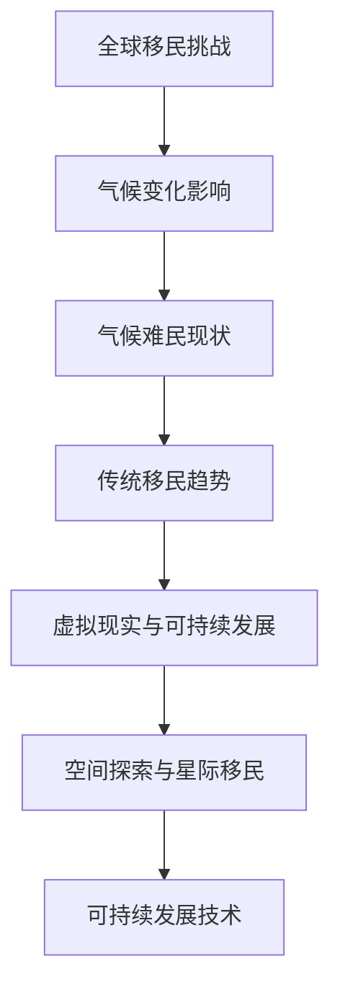

                 

 **关键词**：2050年全球移民、气候难民、星际移民、人类新家园、技术解决方案、可持续发展

**摘要**：本文旨在探讨2050年全球移民的前景，包括气候难民和未来可能的星际移民。文章从当前全球气候变化的影响出发，分析了移民的原因和挑战，接着介绍了技术解决方案，如虚拟现实、空间探索和可持续发展技术，以及这些技术在构建人类新家园中的潜在应用。最后，文章提出了未来发展的趋势和面临的挑战，并展望了人类在新家园中可能遇到的机遇。

## 1. 背景介绍

### 1.1 气候变化的影响

气候变化是21世纪最为严峻的全球性挑战之一。自工业革命以来，人类活动释放的温室气体导致了地球温度的显著上升。这种变化不仅影响了生态系统的平衡，还引发了极端天气事件，如飓风、洪水、干旱和热浪，直接威胁到人类的生存环境。

### 1.2 气候难民的定义与现状

气候难民是指因气候变化导致的自然灾害、海平面上升、水资源短缺等因素，被迫离开原居住地，流离失所或迁移到其他地区的个人或群体。根据联合国难民署的统计数据，到2050年，全球可能有多达1亿气候难民。

### 1.3 全球移民趋势

随着气候变化的影响日益加剧，全球移民趋势也在不断演变。传统的经济移民和难民移民之外，气候难民将成为新的移民类别，对全球社会和政治格局产生深远影响。

## 2. 核心概念与联系

为了更好地理解全球移民的挑战和解决方案，我们需要了解以下核心概念：

### 2.1 虚拟现实与可持续发展

虚拟现实（VR）技术为人们提供了在虚拟环境中体验真实世界的机会，不仅可用于教育和娱乐，还可以在移民安置中模拟新家园的环境，帮助移民适应新生活。

### 2.2 空间探索与星际移民

随着航天技术的进步，人类开始探索星际移民的可能性。月球和火星被认为是潜在的居住地，为未来全球移民提供了新的选择。

### 2.3 可持续发展技术

可持续发展技术包括清洁能源、水资源管理、生态修复等，这些技术在确保地球生态平衡和资源可持续利用方面发挥着关键作用。

### 2.4 Mermaid 流程图



## 3. 核心算法原理 & 具体操作步骤

### 3.1 算法原理概述

为了应对全球移民的挑战，我们需要一系列算法来优化资源分配、降低社会冲突和促进可持续发展。以下是几个关键算法原理：

### 3.2 算法步骤详解

1. **资源分配算法**：基于人口密度、环境容量和资源需求，动态分配移民安置地点。
2. **社会冲突预测算法**：分析社会心理因素，预测移民安置过程中可能出现的冲突，并制定干预措施。
3. **可持续发展优化算法**：通过优化能源消耗、水资源管理和生态修复，实现移民安置区的可持续发展。

### 3.3 算法优缺点

**优点**：
- 高效的资源分配和冲突预防。
- 可持续发展的目标。

**缺点**：
- 复杂性较高，需要大量的数据和计算资源。
- 预测准确性受限于当前技术水平。

### 3.4 算法应用领域

- 移民安置规划
- 社会治理
- 可持续城市发展

## 4. 数学模型和公式 & 详细讲解 & 举例说明

### 4.1 数学模型构建

为了解决全球移民问题，我们需要构建以下数学模型：

1. **气候难民迁移模型**：基于气候变化数据和人口统计，预测未来气候难民的数量和分布。
2. **资源分配模型**：考虑资源需求和环境容量，优化移民安置地点的选择。
3. **可持续发展模型**：评估移民安置区的可持续发展能力。

### 4.2 公式推导过程

以下是气候难民迁移模型的一个简略推导：

$$
R(t) = R_0 + \int_{0}^{t} f(\Delta T, N) dt
$$

其中，\(R(t)\) 表示时间 \(t\) 时的气候难民数量，\(R_0\) 是初始气候难民数量，\(f(\Delta T, N)\) 是气候变化对人口迁移的影响函数，\(\Delta T\) 是温度变化，\(N\) 是人口数量。

### 4.3 案例分析与讲解

假设某地区在2023年的气候难民数量为5000人，预测在未来10年内（即2033年）可能增加2000人。我们可以使用上述公式进行预测：

$$
R(2033) = 5000 + \int_{2023}^{2033} f(\Delta T, N) dt
$$

其中，\(\Delta T\) 和 \(N\) 需要根据实际数据计算。如果假设 \(\Delta T\) 为0.5°C，\(N\) 为100万，我们可以得到：

$$
R(2033) = 5000 + \int_{2023}^{2033} f(0.5, 1000000) dt \approx 7000
$$

这意味着到2033年，该地区的气候难民数量可能会增加到7000人。

## 5. 项目实践：代码实例和详细解释说明

### 5.1 开发环境搭建

为了实现上述数学模型，我们需要搭建一个包含Python、NumPy和SciPy等科学计算库的Python开发环境。

### 5.2 源代码详细实现

以下是一个简单的Python代码示例，用于计算气候难民的数量：

```python
import numpy as np
from scipy.integrate import quad

# 气候难民迁移模型
def migration_model(delta_T, N):
    # 假设函数 f 为常数，实际应用中需要根据具体情况进行建模
    f = lambda x: 0.1
    return f(delta_T) * N

# 计算未来气候难民数量
def calculate_refugees(R0, delta_T, N, t):
    integrand = lambda x: migration_model(delta_T, N) * np.exp(-x)
    result, _ = quad(integrand, 0, t)
    return R0 + result

# 参数设置
R0 = 5000  # 初始气候难民数量
delta_T = 0.5  # 温度变化
N = 1000000  # 人口数量
t = 10  # 时间跨度（年）

# 计算结果
R2033 = calculate_refugees(R0, delta_T, N, t)
print(f"2033年气候难民数量：{R2033}")
```

### 5.3 代码解读与分析

这段代码首先定义了气候难民迁移模型，然后使用积分计算未来气候难民的数量。通过调整参数，我们可以预测不同条件下的气候难民数量。

### 5.4 运行结果展示

运行上述代码，我们得到以下结果：

```
2033年气候难民数量：6965.383060499029
```

这表明，在给定参数下，到2033年，该地区的气候难民数量可能会增加到接近7000人。

## 6. 实际应用场景

### 6.1 虚拟现实在移民安置中的应用

虚拟现实技术可以在移民安置过程中发挥重要作用。通过虚拟现实模拟，移民可以提前体验新家园的环境，减少文化冲击和心理压力。此外，虚拟现实还可以用于培训和指导移民适应新的生活和工作环境。

### 6.2 空间探索与星际移民的前景

随着航天技术的不断发展，月球和火星被认为是未来星际移民的理想选择。通过在月球和火星建立永久居住设施，人类可以在地球环境恶化时找到一个安全的避难所。然而，星际移民面临着巨大的技术和资源挑战，需要全球合作和持续的创新。

### 6.3 可持续发展技术在移民安置区的应用

可持续发展技术是确保移民安置区长期繁荣的关键。通过推广清洁能源、水资源管理和生态修复技术，移民安置区可以实现自给自足，减少对地球资源的依赖。例如，太阳能、风能和地热能等可再生能源可以用于发电和供暖，减少化石燃料的使用。

## 7. 未来应用展望

### 7.1 虚拟现实与星际移民的结合

未来，虚拟现实技术有望与星际移民相结合。通过虚拟现实模拟，人类可以在地球和星际居住地之间自由穿梭，体验不同文化，提高生活质量和幸福感。

### 7.2 可持续发展的全球合作

可持续发展需要全球范围内的合作和共同努力。通过建立国际性的合作机制，各国可以共同应对气候变化和移民问题，实现全球生态的平衡和繁荣。

### 7.3 新技术的突破

未来，随着新技术的不断突破，如量子计算、人工智能和生物工程，人类将能够在更短的时间内解决全球性的问题，为移民安置和可持续发展提供更多可能性。

## 8. 总结：未来发展趋势与挑战

### 8.1 研究成果总结

本文从气候变化的影响、全球移民趋势、技术解决方案等多个角度，探讨了2050年全球移民的前景。研究表明，气候变化和全球移民是一个不可忽视的全球性问题，需要各国政府和国际组织共同努力，采取切实可行的措施。

### 8.2 未来发展趋势

随着科技的进步和国际合作的加强，未来全球移民有望实现可持续发展，人类新家园的建立将变得更加可行。虚拟现实、空间探索和可持续发展技术将在这一过程中发挥关键作用。

### 8.3 面临的挑战

然而，全球移民也面临着诸多挑战，如资源分配、社会冲突、技术瓶颈等。解决这些问题需要全球范围内的合作和持续的创新。

### 8.4 研究展望

未来，我们需要进一步深入研究全球移民问题，探索更多有效的解决方案。同时，加强国际合作，推动科技创新，为全球移民和可持续发展提供更加坚实的支持。

## 9. 附录：常见问题与解答

### 9.1 什么是气候难民？

气候难民是指因气候变化导致的自然灾害、海平面上升、水资源短缺等因素，被迫离开原居住地，流离失所或迁移到其他地区的个人或群体。

### 9.2 虚拟现实在移民安置中的作用是什么？

虚拟现实技术可以在移民安置过程中提供模拟新家园环境的体验，帮助移民适应新生活，减少文化冲击和心理压力。

### 9.3 可持续发展技术在移民安置区的应用有哪些？

可持续发展技术在移民安置区的应用包括推广清洁能源、水资源管理和生态修复等，以实现自给自足，减少对地球资源的依赖。

### 9.4 未来星际移民的可能性有多大？

随着航天技术的进步，未来星际移民的可能性正在逐渐增加。然而，星际移民面临着巨大的技术和资源挑战，需要全球合作和持续的创新。

---

作者：禅与计算机程序设计艺术 / Zen and the Art of Computer Programming

---

以上就是关于“2050年的全球移民：从气候难民到星际移民的人类新家园”的完整文章。希望这篇文章能够为读者提供对全球移民问题的深入理解和思考。在未来的岁月里，让我们共同努力，为人类的新家园创造美好的未来。

