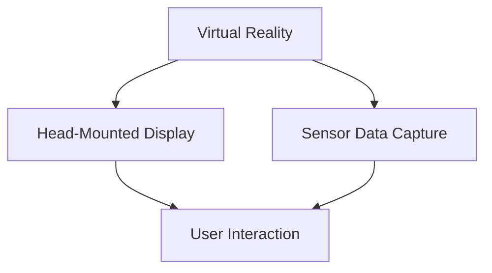
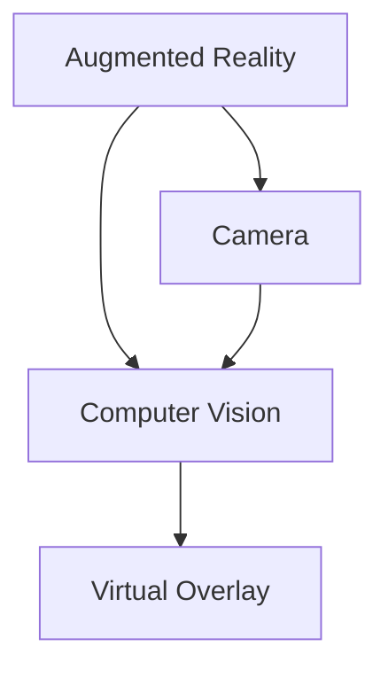
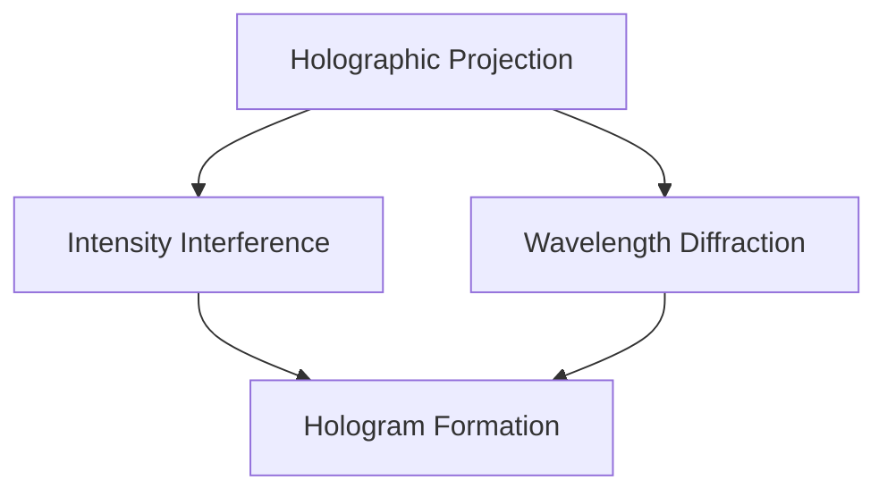
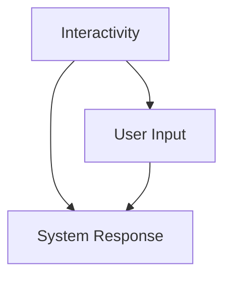

                 

关键词：2050年，数字创意，虚拟直播，全息互动表演，数字娱乐，技术发展，未来趋势

> 摘要：本文深入探讨2050年的数字创意领域，从虚拟直播到全息互动表演，预测技术发展对未来数字娱乐的深远影响。通过分析核心概念、算法原理、数学模型和实际应用，本文旨在为读者呈现一幅未来数字创意的宏伟蓝图。

## 1. 背景介绍

随着信息技术的飞速发展，数字创意已经成为当今社会的重要驱动力。从最初的静态图像和简单的动画，到如今复杂的虚拟现实（VR）和增强现实（AR），数字创意技术正不断突破我们的想象界限。而展望2050年，我们可以预见一个更加令人激动的数字创意时代。

在数字创意领域，虚拟直播和全息互动表演将成为两大重要方向。虚拟直播利用先进的虚拟现实技术，让用户在虚拟空间中与主播实时互动，提供全新的娱乐体验。而全息互动表演则通过全息投影技术，将表演者呈现在空中，观众能够以三维立体的方式感受到表演的魅力。

### 1.1 虚拟直播

虚拟直播是一种通过虚拟现实技术实现的直播形式。主播和观众在一个三维虚拟空间中互动，主播可以随时切换场景，观众则可以自由地移动视角，感受到身临其境的体验。虚拟直播不仅提供了丰富的互动性，还能通过虚拟道具和特效增强观众的参与感。

### 1.2 全息互动表演

全息互动表演则利用全息投影技术，将表演者或物体以三维立体的形式呈现出来。观众可以通过多种角度观察表演，甚至可以与表演者进行互动。这种表演形式不仅提供了独特的视觉效果，还能带来更加深刻的情感体验。

## 2. 核心概念与联系

在数字创意领域，虚拟直播和全息互动表演依赖于多种核心技术和概念。以下是这些技术和概念之间的联系以及它们的Mermaid流程图：

### 2.1 虚拟现实（VR）

虚拟现实技术为虚拟直播和全息互动表演提供了一个沉浸式的环境。它通过头戴式显示器和传感器捕捉用户的动作和视角，创建一个完全虚拟的三维空间。



### 2.2 增强现实（AR）

增强现实技术将虚拟元素叠加到现实世界中，为虚拟直播和全息互动表演提供了更加多样化的展示方式。AR技术通过摄像头和计算机视觉算法，识别现实环境中的物体并叠加虚拟元素。



### 2.3 全息投影

全息投影技术是全息互动表演的核心。它利用光的干涉和衍射原理，将表演者的三维图像投影到空气中，形成立体的视觉效果。



### 2.4 互动性

互动性是虚拟直播和全息互动表演的重要特点。它通过用户的输入（如手势、语音等）和系统的响应，实现用户与虚拟世界之间的互动。



## 3. 核心算法原理 & 具体操作步骤

### 3.1 算法原理概述

虚拟直播和全息互动表演的核心算法包括：

1. **实时渲染算法**：用于生成虚拟场景和全息图像。
2. **计算机视觉算法**：用于识别和跟踪用户动作，以及现实世界中的物体。
3. **语音识别和合成算法**：用于处理用户和系统的语音交互。

### 3.2 算法步骤详解

1. **实时渲染算法**：

   - **场景构建**：根据直播内容或表演需求，构建三维场景模型。
   - **光线追踪**：模拟场景中的光线传播，生成真实感图像。
   - **实时更新**：根据用户视角和动作，实时更新场景内容。

2. **计算机视觉算法**：

   - **物体识别**：通过图像处理算法，识别现实世界中的物体。
   - **动作跟踪**：根据用户的动作，实时更新虚拟世界中的物体状态。

3. **语音识别和合成算法**：

   - **语音识别**：将用户的语音转化为文本。
   - **语音合成**：将文本转化为语音，实现语音交互。

### 3.3 算法优缺点

1. **实时渲染算法**：

   - **优点**：提供高质量的图像效果，增强用户体验。
   - **缺点**：计算量大，对硬件要求高。

2. **计算机视觉算法**：

   - **优点**：能够识别和跟踪多种物体和动作，实现丰富的互动性。
   - **缺点**：在复杂环境下可能出现识别错误。

3. **语音识别和合成算法**：

   - **优点**：实现自然语言交互，提高用户体验。
   - **缺点**：识别准确性受语音质量影响。

### 3.4 算法应用领域

1. **虚拟直播**：应用于娱乐、教育、旅游等多个领域。
2. **全息互动表演**：应用于剧场、展览、体育等多个领域。

## 4. 数学模型和公式 & 详细讲解 & 举例说明

### 4.1 数学模型构建

虚拟直播和全息互动表演中的数学模型主要包括：

1. **三维空间坐标变换模型**：用于计算用户视角和虚拟场景之间的坐标变换。
2. **光线追踪模型**：用于模拟光线在三维空间中的传播。
3. **物体识别模型**：用于识别和分类现实世界中的物体。

### 4.2 公式推导过程

以下是三维空间坐标变换模型的一个基本公式推导：

$$
\begin{align*}
x' &= x \cos \theta - y \sin \theta \\
y' &= x \sin \theta + y \cos \theta \\
z' &= z
\end{align*}
$$

其中，\( \theta \) 表示用户视角与水平面的夹角。

### 4.3 案例分析与讲解

假设一个用户视角与水平面的夹角为30度，原始坐标为 \( (1, 1, 0) \)，我们需要计算变换后的坐标。

$$
\begin{align*}
x' &= 1 \cos 30^\circ - 1 \sin 30^\circ = \frac{\sqrt{3}}{2} - \frac{1}{2} = \frac{\sqrt{3} - 1}{2} \\
y' &= 1 \sin 30^\circ + 1 \cos 30^\circ = \frac{1}{2} + \frac{\sqrt{3}}{2} = \frac{\sqrt{3} + 1}{2} \\
z' &= 0
\end{align*}
$$

因此，变换后的坐标为 \( \left(\frac{\sqrt{3} - 1}{2}, \frac{\sqrt{3} + 1}{2}, 0\right) \)。

## 5. 项目实践：代码实例和详细解释说明

### 5.1 开发环境搭建

在开发虚拟直播和全息互动表演应用时，我们需要搭建一个合适的技术栈。以下是推荐的开发环境：

1. **操作系统**：Linux或macOS
2. **编程语言**：Python或C++
3. **虚拟现实框架**：Unity或Unreal Engine
4. **计算机视觉库**：OpenCV或TensorFlow
5. **语音处理库**：PyTorch或Kaldi

### 5.2 源代码详细实现

以下是一个简单的Python代码示例，用于实现虚拟直播的核心功能。

```python
import cv2
import numpy as np

def live_stream():
    # 初始化摄像头
    cap = cv2.VideoCapture(0)
    
    while True:
        # 读取摄像头帧
        ret, frame = cap.read()
        
        if not ret:
            break
        
        # 应用图像处理算法
        processed_frame = process_frame(frame)
        
        # 显示处理后的帧
        cv2.imshow('Live Stream', processed_frame)
        
        if cv2.waitKey(1) & 0xFF == ord('q'):
            break
    
    # 释放摄像头
    cap.release()
    cv2.destroyAllWindows()

def process_frame(frame):
    # 应用图像处理算法
    # ...
    return frame

if __name__ == '__main__':
    live_stream()
```

### 5.3 代码解读与分析

以上代码实现了一个简单的实时视频流处理应用。首先，我们初始化摄像头，然后进入一个循环，不断读取摄像头帧并处理。处理后的帧会显示在窗口中，用户可以随时按‘q’键退出。

### 5.4 运行结果展示

运行上述代码后，将打开一个窗口显示实时视频流。用户可以看到摄像头捕捉到的画面，并且可以根据需要应用图像处理算法，如美颜、滤镜等。

## 6. 实际应用场景

### 6.1 娱乐

虚拟直播和全息互动表演在娱乐领域有着广泛的应用。例如，虚拟歌手的演唱会、游戏直播、全息演唱会等，都提供了独特的娱乐体验。

### 6.2 教育

虚拟直播和全息互动表演在教育领域也有很大的潜力。例如，虚拟课堂、实验演示、全息教材等，可以提供更加生动、互动的教学体验。

### 6.3 医疗

虚拟直播和全息互动表演在医疗领域也可以发挥作用。例如，远程手术指导、医学教育、患者康复训练等，都可以通过虚拟直播和全息互动实现。

## 7. 工具和资源推荐

### 7.1 学习资源推荐

- **《虚拟现实技术基础》**：一本全面介绍虚拟现实技术的书籍，适合初学者。
- **《计算机视觉：算法与应用》**：一本深入讲解计算机视觉算法的书籍，适用于有一定编程基础的学习者。
- **《深度学习与语音识别》**：一本介绍深度学习和语音识别技术的书籍，适用于对语音处理感兴趣的学习者。

### 7.2 开发工具推荐

- **Unity**：一款功能强大的游戏引擎，适用于虚拟直播和全息互动表演的开发。
- **Unreal Engine**：一款专业的游戏引擎，提供高质量的图像效果，适用于高端虚拟直播和全息互动表演项目。
- **OpenCV**：一款开源的计算机视觉库，适用于实时视频处理。

### 7.3 相关论文推荐

- **"Holographic Rendering: Techniques and Applications"**：一篇关于全息投影技术的综述文章，涵盖了从理论到应用的各个方面。
- **"Interactive Holographic Displays: A Review"**：一篇关于全息互动表演的论文，介绍了当前的研究进展和应用场景。
- **"Virtual Reality for Remote Interaction: A Review"**：一篇关于虚拟直播技术的论文，探讨了虚拟直播在教育、医疗等领域的应用。

## 8. 总结：未来发展趋势与挑战

### 8.1 研究成果总结

随着技术的不断进步，虚拟直播和全息互动表演正逐渐成为数字创意娱乐领域的重要方向。从算法原理到实际应用，我们已经看到了这些技术所带来的变革。

### 8.2 未来发展趋势

未来，虚拟直播和全息互动表演将继续朝着更加真实、互动和沉浸式的方向发展。随着硬件设备的升级和算法的优化，这些技术的应用场景将更加广泛。

### 8.3 面临的挑战

尽管前景广阔，但虚拟直播和全息互动表演仍面临着一些挑战。例如，算法的实时性能、图像质量的提升、设备的便携性等，都是需要解决的关键问题。

### 8.4 研究展望

未来，我们将继续深入研究和开发虚拟直播和全息互动表演技术，推动数字创意娱乐领域的发展。同时，我们也期待这些技术能够为社会带来更多的创新和便利。

## 9. 附录：常见问题与解答

### Q: 虚拟直播和全息互动表演的区别是什么？

A: 虚拟直播主要利用虚拟现实技术，提供一个沉浸式的互动环境；而全息互动表演则通过全息投影技术，将表演者或物体呈现在空中，实现三维立体的互动。

### Q: 虚拟直播和全息互动表演需要哪些技术支持？

A: 虚拟直播需要虚拟现实技术、实时渲染算法、计算机视觉算法等；全息互动表演需要全息投影技术、光线追踪算法、交互设计等。

### Q: 虚拟直播和全息互动表演在哪些领域有应用？

A: 虚拟直播和全息互动表演在娱乐、教育、医疗等多个领域有广泛应用，例如虚拟演唱会、远程教学、远程医疗等。

## 作者署名

作者：禅与计算机程序设计艺术 / Zen and the Art of Computer Programming
----------------------------------------------------------------

以上就是本文的完整内容，希望对您在数字创意领域的探索有所帮助。在未来的数字创意时代，让我们共同期待更多创新和奇迹的诞生。

