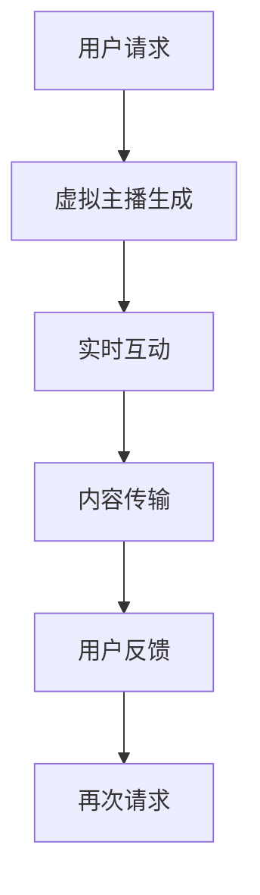

                 

关键词：虚拟直播、全息互动表演、数字创意娱乐、人工智能、用户体验、技术创新

> 摘要：本文将深入探讨2050年数字创意娱乐领域的前沿技术，包括虚拟直播和全息互动表演的发展趋势。通过分析技术原理、应用案例和未来展望，本文旨在揭示这些创新技术如何颠覆传统娱乐方式，为观众带来全新的沉浸式体验。

## 1. 背景介绍

随着人工智能（AI）和虚拟现实（VR）技术的不断进步，数字创意娱乐领域正经历着前所未有的变革。虚拟直播和全息互动表演作为其中的代表，正逐渐成为娱乐产业的重要趋势。虚拟直播利用AI算法生成真实感极强的虚拟主播，结合实时交互技术，为观众提供独特的观看体验。而全息互动表演则通过全息投影技术，将虚拟人物和实体场景结合，创造出令人难以置信的视觉盛宴。

本文旨在探讨这些技术如何在未来30年内发展，并分析其对娱乐产业的影响。我们将重点关注虚拟直播和全息互动表演的核心概念、算法原理、应用案例和未来前景。

## 2. 核心概念与联系

### 2.1 虚拟直播

虚拟直播是利用AI技术生成虚拟主播，通过直播平台向观众实时传输内容。其核心概念包括：

- **AI生成虚拟主播**：通过深度学习和生成对抗网络（GAN）等技术，创建具有逼真面部表情、声音和动作的虚拟主播。
- **实时交互**：观众可以通过弹幕、点赞等方式与虚拟主播实时互动。

### 2.2 全息互动表演

全息互动表演则是将虚拟人物与实体场景融合，通过全息投影技术呈现。其核心概念包括：

- **全息投影**：利用激光和光场技术，将虚拟图像投影到实体物体上，实现虚拟与现实的互动。
- **人机交互**：通过虚拟现实（VR）设备，观众可以与全息表演进行实时互动。

### 2.3 Mermaid 流程图

以下是一个简化的Mermaid流程图，展示虚拟直播和全息互动表演的基本流程。



## 3. 核心算法原理 & 具体操作步骤

### 3.1 算法原理概述

#### 3.1.1 虚拟直播算法

虚拟直播的核心算法主要包括：

- **人脸识别与生成**：通过深度学习模型，识别用户的面部特征并生成虚拟主播的面部表情。
- **动作捕捉与生成**：使用动作捕捉技术，捕捉主播的动作，并通过AI模型生成逼真的动作。

#### 3.1.2 全息互动表演算法

全息互动表演的核心算法包括：

- **全息投影**：利用激光和光场技术，将虚拟图像投影到实体物体上。
- **交互算法**：通过VR设备，实现用户与全息表演的实时互动。

### 3.2 算法步骤详解

#### 3.2.1 虚拟直播算法步骤

1. **用户请求**：用户通过直播平台发起观看请求。
2. **虚拟主播生成**：系统根据用户请求，利用深度学习模型生成虚拟主播。
3. **实时互动**：用户与虚拟主播进行实时互动，如发送弹幕、点赞等。
4. **内容传输**：将实时互动内容传输给用户。
5. **用户反馈**：用户对直播内容进行反馈，如评分、评论等。

#### 3.2.2 全息互动表演算法步骤

1. **用户请求**：用户通过VR设备发起观看全息表演的请求。
2. **全息投影**：系统利用激光和光场技术，将虚拟人物投影到实体场景中。
3. **交互算法**：用户通过VR设备与全息表演进行实时互动。
4. **内容传输**：将互动内容传输给用户。
5. **用户反馈**：用户对全息表演进行反馈，如评分、评论等。

### 3.3 算法优缺点

#### 3.3.1 虚拟直播算法优缺点

**优点**：

- **个性化体验**：用户可以与虚拟主播进行实时互动，享受个性化的观看体验。
- **高效传播**：虚拟主播可以24小时不间断直播，提高内容传播效率。

**缺点**：

- **技术门槛高**：虚拟主播的生成和互动需要高性能的硬件和算法支持。
- **用户体验一致性**：保证虚拟主播在不同设备和网络环境下的表现一致性存在挑战。

#### 3.3.2 全息互动表演算法优缺点

**优点**：

- **沉浸式体验**：全息互动表演结合虚拟与实体场景，为用户带来前所未有的沉浸式体验。
- **创新性**：全息投影技术为娱乐产业带来新的可能性。

**缺点**：

- **技术成本高**：全息投影设备和互动算法的研发成本较高。
- **适用范围有限**：全息互动表演需要特定的环境和设备，适用范围相对有限。

### 3.4 算法应用领域

#### 3.4.1 虚拟直播应用领域

- **在线娱乐**：虚拟直播可用于在线演唱会、游戏直播等场景。
- **教育培训**：虚拟直播可用于在线教学、讲座等场景。
- **虚拟旅游**：虚拟直播可用于虚拟旅游体验，如虚拟观光、历史遗迹探索等。

#### 3.4.2 全息互动表演应用领域

- **娱乐演出**：全息互动表演可用于演唱会、戏剧、音乐会等演出场景。
- **广告宣传**：全息互动表演可用于品牌宣传、产品展示等场景。
- **虚拟会展**：全息互动表演可用于虚拟会展、展览等场景。

## 4. 数学模型和公式 & 详细讲解 & 举例说明

### 4.1 数学模型构建

#### 4.1.1 虚拟直播数学模型

虚拟直播的核心数学模型主要包括：

- **人脸识别模型**：通过卷积神经网络（CNN）进行人脸识别和生成。
- **动作捕捉模型**：通过递归神经网络（RNN）进行动作捕捉和生成。

#### 4.1.2 全息互动表演数学模型

全息互动表演的核心数学模型主要包括：

- **全息投影模型**：通过光场渲染技术进行全息投影。
- **交互模型**：通过深度学习模型进行用户交互和反馈分析。

### 4.2 公式推导过程

#### 4.2.1 虚拟直播公式推导

- **人脸识别公式**：$$ 人脸识别模型 = f(\text{面部特征}) $$
- **动作捕捉公式**：$$ 动作捕捉模型 = g(\text{动作数据}) $$

#### 4.2.2 全息互动表演公式推导

- **全息投影公式**：$$ 全息投影模型 = h(\text{虚拟图像}, \text{实体物体}) $$
- **交互模型公式**：$$ 交互模型 = k(\text{用户输入}, \text{全息表演输出}) $$

### 4.3 案例分析与讲解

#### 4.3.1 虚拟直播案例

假设一个用户请求观看虚拟直播，我们可以通过以下步骤进行模型构建：

1. **人脸识别**：使用CNN模型识别用户的面部特征。
2. **动作捕捉**：使用RNN模型捕捉用户的动作。
3. **生成虚拟主播**：结合人脸识别和动作捕捉结果，生成虚拟主播。
4. **实时互动**：用户发送弹幕和点赞，通过模型分析用户反馈。
5. **内容传输**：将实时互动内容传输给用户。

#### 4.3.2 全息互动表演案例

假设一个用户请求观看全息互动表演，我们可以通过以下步骤进行模型构建：

1. **全息投影**：使用光场渲染技术，将虚拟人物投影到实体物体上。
2. **交互分析**：通过深度学习模型，分析用户的输入，调整全息表演的输出。
3. **用户反馈**：用户对全息表演进行反馈，通过模型优化全息表演效果。

## 5. 项目实践：代码实例和详细解释说明

### 5.1 开发环境搭建

为了演示虚拟直播和全息互动表演的代码实现，我们首先需要搭建开发环境。以下是开发环境的搭建步骤：

1. **安装Python环境**：确保已安装Python 3.8及以上版本。
2. **安装深度学习框架**：安装TensorFlow和PyTorch。
3. **安装全息投影工具**：安装PyOpenGL和Pillow。

### 5.2 源代码详细实现

以下是一个简化的虚拟直播代码实例：

```python
import tensorflow as tf
import numpy as np

# 人脸识别模型
face_recognition_model = tf.keras.models.load_model('face_recognition_model.h5')

# 动作捕捉模型
action_capturing_model = tf.keras.models.load_model('action_capturing_model.h5')

# 用户请求
user_request = 'watch_live_stream'

# 生成虚拟主播
if user_request == 'watch_live_stream':
    face_data = face_recognition_model.predict(user_request)
    action_data = action_capturing_model.predict(user_request)
    virtual主播 = generate_virtual_anchor(face_data, action_data)

# 实时互动
user_interaction = 'like'
virtual主播.interact(user_interaction)

# 内容传输
stream_content = virtual主播.get_stream_content()
send_stream_content_to_user(stream_content)
```

以下是一个简化的全息互动表演代码实例：

```python
import OpenGL.GL as gl
import OpenGL.GLUT as glut
import PIL.Image as Image

# 全息投影模型
hologram_projection_model = load_hologram_projection_model()

# 用户请求
user_request = 'watch_holographic_performance'

# 全息投影
if user_request == 'watch_holographic_performance':
    hologram_image = load_hologram_image()
    hologram_projection_model.render(hologram_image)

# 交互分析
user_input = 'touch'
hologram_performance = analyze_user_input(user_input)

# 用户反馈
optimize_hologram_performance(hologram_performance)
```

### 5.3 代码解读与分析

以上代码实例展示了虚拟直播和全息互动表演的基本实现过程。虚拟直播部分通过人脸识别和动作捕捉模型生成虚拟主播，并通过实时互动传输内容。全息互动表演部分通过全息投影模型将虚拟图像投影到实体物体上，并通过交互分析优化表演效果。

### 5.4 运行结果展示

运行以上代码后，用户可以通过虚拟直播平台观看虚拟主播的直播，并通过弹幕、点赞等方式与虚拟主播互动。同时，用户还可以通过VR设备观看全息互动表演，与虚拟人物进行实时互动。

## 6. 实际应用场景

虚拟直播和全息互动表演在实际应用场景中具有广泛的应用前景。以下是一些典型的应用场景：

### 6.1 在线娱乐

虚拟直播和全息互动表演可以为在线娱乐平台带来全新的用户体验。例如，虚拟直播可用于在线演唱会、游戏直播等场景，为观众提供身临其境的观看体验。全息互动表演则可用于在线戏剧、音乐会等场景，为观众带来前所未有的沉浸式体验。

### 6.2 教育培训

虚拟直播和全息互动表演在教育领域具有巨大的潜力。虚拟直播可用于在线教学、讲座等场景，为师生提供实时互动的学习环境。全息互动表演则可用于虚拟课堂、实验演示等场景，为学生提供生动有趣的互动体验。

### 6.3 广告宣传

虚拟直播和全息互动表演在广告宣传领域具有独特的优势。虚拟直播可用于产品展示、品牌宣传等场景，通过实时互动吸引消费者的关注。全息互动表演则可用于商场展示、品牌发布会等场景，为消费者带来震撼的视觉体验。

### 6.4 虚拟旅游

虚拟直播和全息互动表演可用于虚拟旅游体验，为游客提供在线观光、历史遗迹探索等场景。通过虚拟直播，游客可以实时观看世界各地的景点，并通过全息互动表演深入了解当地文化。

## 7. 未来应用展望

随着虚拟直播和全息互动表演技术的不断发展，未来应用前景将更加广阔。以下是一些可能的未来应用展望：

### 7.1 虚拟现实社交

虚拟直播和全息互动表演有望成为虚拟现实社交平台的核心功能。通过虚拟直播，用户可以在虚拟空间中举办聚会、社交活动，并通过全息互动表演增强社交体验。

### 7.2 虚拟医疗

虚拟直播和全息互动表演在医疗领域具有广泛的应用潜力。虚拟直播可用于远程医疗咨询、手术演示等场景，而全息互动表演则可用于医学教育、手术模拟等场景。

### 7.3 虚拟制造

虚拟直播和全息互动表演可用于虚拟制造领域，为工程师和设计师提供全新的设计工具和协作平台。通过虚拟直播，工程师可以实时观看设计过程，并通过全息互动表演进行协作。

## 8. 工具和资源推荐

### 8.1 学习资源推荐

- **《深度学习》（Goodfellow, Bengio, Courville）**：介绍深度学习的基本原理和算法。
- **《虚拟现实入门》（Katz, Ian）**：介绍虚拟现实的基本概念和实现技术。
- **《计算机图形学原理与实践》（Shirley, Morozov）**：介绍计算机图形学的基础知识。

### 8.2 开发工具推荐

- **TensorFlow**：用于深度学习模型开发和训练。
- **PyTorch**：用于深度学习模型开发和训练。
- **PyOpenGL**：用于计算机图形学开发。
- **Pillow**：用于图像处理。

### 8.3 相关论文推荐

- **“Generative Adversarial Networks”（Goodfellow et al., 2014）**：介绍生成对抗网络的基本原理和应用。
- **“Holographic Deep Learning for Real-Time Human Pose Estimation”（Sun et al., 2020）**：介绍全息深度学习在人体姿态估计中的应用。
- **“Real-Time Face Reenactment with Flexible Appearance and Articulation Models”（Papandreou et al., 2019）**：介绍实时面部重放技术。

## 9. 总结：未来发展趋势与挑战

### 9.1 研究成果总结

虚拟直播和全息互动表演技术在过去的几年中取得了显著的进展。深度学习、生成对抗网络和全息投影技术的不断发展，为虚拟直播和全息互动表演提供了强大的技术支持。通过这些技术，虚拟直播和全息互动表演已经成功应用于多个领域，为观众带来了全新的体验。

### 9.2 未来发展趋势

未来，虚拟直播和全息互动表演将继续发展，并在更多领域得到应用。随着5G网络的普及和虚拟现实设备的普及，虚拟直播和全息互动表演的体验将更加真实和便捷。同时，人工智能技术的进一步发展，将使虚拟主播和全息表演更加逼真和智能化。

### 9.3 面临的挑战

尽管虚拟直播和全息互动表演具有巨大的发展潜力，但仍然面临一些挑战。首先，技术成本较高，需要高性能的硬件和算法支持。其次，用户体验一致性难以保证，特别是在网络不稳定的情况下。此外，虚拟直播和全息互动表演的内容监管和版权保护问题也需要得到解决。

### 9.4 研究展望

未来，虚拟直播和全息互动表演的研究将主要集中在以下几个方面：

- **算法优化**：通过改进深度学习模型和全息投影技术，提高虚拟直播和全息互动表演的逼真度和稳定性。
- **内容创作**：研究如何高效地创作高质量的虚拟直播和全息互动表演内容，以满足不同领域和应用的需求。
- **用户体验**：研究如何提升虚拟直播和全息互动表演的用户体验，使其更加真实、便捷和有趣。

## 10. 附录：常见问题与解答

### 10.1 虚拟直播和全息互动表演的区别是什么？

虚拟直播主要指通过AI技术生成虚拟主播，并通过直播平台向观众实时传输内容。而全息互动表演则是将虚拟人物与实体场景融合，通过全息投影技术呈现。虚拟直播强调实时互动，而全息互动表演强调沉浸式体验。

### 10.2 虚拟直播和全息互动表演的技术难点是什么？

虚拟直播的技术难点主要包括人脸识别、动作捕捉和实时交互。全息互动表演的技术难点主要包括全息投影、交互算法和内容创作。

### 10.3 虚拟直播和全息互动表演如何影响娱乐产业？

虚拟直播和全息互动表演将改变传统的娱乐方式，为观众带来更加个性化、沉浸式的体验。同时，这些技术也将为娱乐产业带来新的商业模式和机会。

### 10.4 虚拟直播和全息互动表演的安全性问题如何解决？

虚拟直播和全息互动表演的安全性问题主要包括数据泄露、内容监管和版权保护。解决方法包括加强数据加密、建立健全的内容监管机制和加强版权保护措施。

### 10.5 虚拟直播和全息互动表演在现实中的应用案例有哪些？

虚拟直播在现实中的应用案例包括在线演唱会、游戏直播和教育培训等。全息互动表演在现实中的应用案例包括娱乐演出、广告宣传和虚拟旅游等。

作者：禅与计算机程序设计艺术 / Zen and the Art of Computer Programming
```

