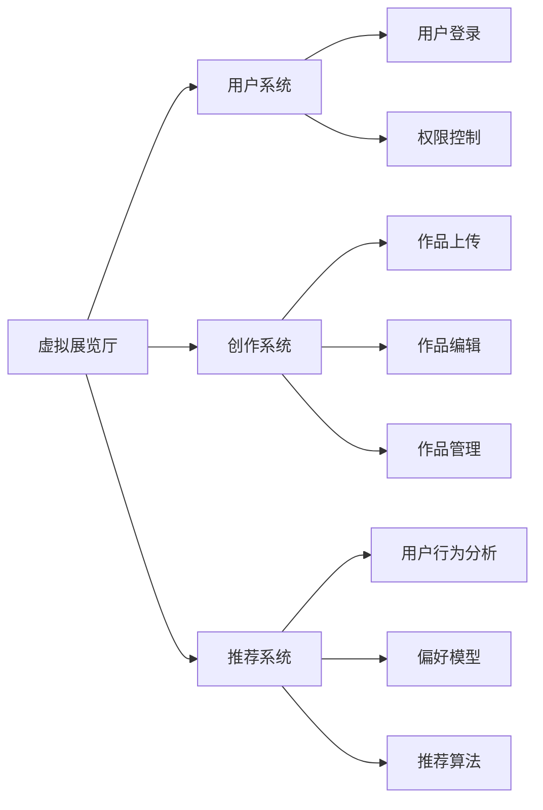

                 

关键词：数字艺术、虚拟现实、人工智能、创作与鉴赏、虚拟美术馆、技术发展趋势

摘要：随着科技的迅猛发展，数字艺术正以前所未有的方式改变着我们的创作与鉴赏体验。本文将探讨2050年的数字艺术发展，重点分析从创作到鉴赏的虚拟美术馆的构建及其影响。我们将探讨核心技术、数学模型、项目实践，并展望未来应用前景。

## 1. 背景介绍

数字艺术，顾名思义，是运用数字技术和数字媒介进行创作的艺术形式。它包括但不限于数字绘画、数字雕塑、虚拟现实（VR）艺术、增强现实（AR）艺术等。随着人工智能（AI）和虚拟现实（VR）技术的快速发展，数字艺术正在从传统艺术的附庸，逐渐演变成一种独立的艺术形式。

### 1.1 数字艺术的历史与发展

数字艺术的发展历程可以追溯到20世纪60年代，当时计算机刚刚开始普及。艺术家们开始探索如何利用计算机进行创作。到了20世纪90年代，随着互联网的兴起，数字艺术逐渐从实验室走向大众，开始广泛应用于广告、娱乐和设计等领域。

### 1.2 数字艺术的现状

如今，数字艺术已经成为一种主流的艺术形式，不仅在艺术界，而且在科技、设计、娱乐等多个领域都有着广泛的应用。随着人工智能和虚拟现实技术的不断进步，数字艺术正在以更加丰富多样和沉浸式的形式呈现给观众。

### 1.3 2050年的数字艺术展望

2050年的数字艺术，将是人工智能和虚拟现实深度融合的结果。创作和鉴赏的方式将发生革命性的变化，虚拟美术馆将成为数字艺术的主要展示平台。

## 2. 核心概念与联系

### 2.1. 虚拟现实（VR）艺术

虚拟现实艺术是通过计算机生成三维虚拟环境，让观众通过头戴式显示器（HMD）等设备沉浸其中。VR艺术的核心技术包括：

1. **计算机图形学**：用于生成逼真的三维图像。
2. **3D建模与渲染**：通过3D建模软件构建虚拟场景，并利用渲染技术进行图像处理。
3. **交互技术**：通过手柄、手势识别等设备实现用户与虚拟环境的交互。

### 2.2. 增强现实（AR）艺术

增强现实艺术是在现实世界的基础上叠加数字内容。与VR不同，AR不要求用户完全沉浸于虚拟环境中，而是在现实世界中增强感知和体验。核心技术包括：

1. **摄像头与传感器**：用于捕捉现实世界的图像和姿态。
2. **图像识别与跟踪**：用于识别现实世界中的物体并跟踪其运动。
3. **实时渲染**：将数字内容实时叠加到现实世界的图像上。

### 2.3. 人工智能（AI）在数字艺术中的应用

人工智能在数字艺术中的应用越来越广泛，主要包括：

1. **自动创作**：利用生成对抗网络（GAN）等算法自动生成图像、音乐等艺术作品。
2. **个性化推荐**：通过用户行为数据，为用户提供个性化的艺术作品推荐。
3. **交互式体验**：利用机器学习算法实现更加智能和互动的虚拟艺术体验。

### 2.4. 虚拟美术馆的架构

虚拟美术馆的架构需要涵盖以下方面：

1. **虚拟展览厅**：用于展示数字艺术作品，可支持多种交互方式。
2. **用户系统**：用于管理用户信息，实现用户登录、权限控制等功能。
3. **创作系统**：用于艺术家上传、编辑和管理数字艺术作品。
4. **推荐系统**：基于用户行为和偏好，推荐合适的艺术作品。

### 2.5. Mermaid 流程图

以下是一个简化的虚拟美术馆架构的 Mermaid 流程图：



## 3. 核心算法原理 & 具体操作步骤

### 3.1 算法原理概述

在数字艺术创作与鉴赏中，核心算法主要包括：

1. **生成对抗网络（GAN）**：用于自动创作数字艺术作品。
2. **协同过滤算法**：用于个性化推荐艺术作品。
3. **情感分析算法**：用于分析用户对艺术作品的情感反应。

### 3.2 算法步骤详解

#### 3.2.1 生成对抗网络（GAN）

1. **数据准备**：收集大量数字艺术作品，用于训练GAN模型。
2. **模型构建**：构建生成器和判别器，生成器和判别器相互对抗。
3. **训练**：通过梯度下降算法训练生成器和判别器。
4. **生成**：生成器生成新的数字艺术作品。

#### 3.2.2 协同过滤算法

1. **用户行为数据收集**：收集用户在虚拟美术馆中的浏览、收藏、评价等行为数据。
2. **用户偏好模型构建**：通过协同过滤算法构建用户偏好模型。
3. **推荐算法**：基于用户偏好模型，为用户推荐合适的艺术作品。

#### 3.2.3 情感分析算法

1. **文本数据收集**：收集用户对艺术作品的评论、反馈等文本数据。
2. **情感分类模型构建**：通过情感分析算法构建情感分类模型。
3. **情感分析**：对用户评论进行情感分析，得出用户对艺术作品的情感倾向。

### 3.3 算法优缺点

#### 3.3.1 生成对抗网络（GAN）

- **优点**：能够自动生成高质量的数字艺术作品，具有创意性。
- **缺点**：训练过程复杂，模型不稳定，可能生成低质量或无意义的作品。

#### 3.3.2 协同过滤算法

- **优点**：能够准确推荐用户可能感兴趣的艺术作品。
- **缺点**：推荐结果可能过于保守，缺乏创新性。

#### 3.3.3 情感分析算法

- **优点**：能够深入了解用户对艺术作品的情感反应。
- **缺点**：可能存在误判，情感分析结果可能不够准确。

### 3.4 算法应用领域

- **生成对抗网络（GAN）**：广泛应用于数字艺术创作、图像生成、视频生成等领域。
- **协同过滤算法**：广泛应用于推荐系统、社交媒体、电子商务等领域。
- **情感分析算法**：广泛应用于用户反馈分析、市场调研、情感监测等领域。

## 4. 数学模型和公式 & 详细讲解 & 举例说明

### 4.1 数学模型构建

在数字艺术创作与鉴赏中，常用的数学模型包括：

1. **生成对抗网络（GAN）模型**：由生成器和判别器组成。
2. **协同过滤算法模型**：基于矩阵分解和相似度计算。
3. **情感分析算法模型**：基于自然语言处理和机器学习。

### 4.2 公式推导过程

#### 4.2.1 生成对抗网络（GAN）模型

生成器和判别器的损失函数分别为：

$$
L_G = -\log(D(G(z)))
$$

$$
L_D = -[\log(D(x)) + \log(1 - D(G(z))]
$$

其中，$G(z)$为生成器，$D(x)$为判别器。

#### 4.2.2 协同过滤算法模型

用户$u$和物品$i$的偏好可以用如下矩阵分解模型表示：

$$
R_{ui} = \hat{u_i} + \epsilon_{ui}
$$

其中，$\hat{u_i}$为用户$u$对物品$i$的预测评分，$\epsilon_{ui}$为误差项。

#### 4.2.3 情感分析算法模型

情感分析算法通常使用如下公式计算文本的情感倾向：

$$
\text{sentiment} = \text{sign}(\text{SVM}(w \cdot \text{vec}(t)))
$$

其中，$w$为SVM模型的权重向量，$\text{vec}(t)$为文本的向量表示。

### 4.3 案例分析与讲解

#### 4.3.1 GAN模型在数字艺术创作中的应用

假设我们使用GAN模型自动创作一幅数字艺术作品。给定一组数字艺术作品作为训练数据，我们可以通过以下步骤进行模型训练：

1. **数据预处理**：将数字艺术作品转换为统一尺寸和格式的图像。
2. **模型构建**：构建生成器和判别器模型。
3. **模型训练**：使用梯度下降算法训练生成器和判别器，迭代进行。
4. **生成作品**：通过生成器生成新的数字艺术作品。

#### 4.3.2 协同过滤算法在个性化推荐中的应用

假设我们使用协同过滤算法为用户推荐艺术作品。给定用户行为数据和艺术作品数据，我们可以通过以下步骤进行推荐：

1. **用户行为数据预处理**：将用户行为数据转换为矩阵形式。
2. **模型训练**：使用矩阵分解算法训练用户偏好模型。
3. **推荐计算**：基于用户偏好模型，计算用户对未浏览艺术作品的预测评分。
4. **推荐结果输出**：为用户推荐评分最高的艺术作品。

#### 4.3.3 情感分析算法在用户反馈分析中的应用

假设我们使用情感分析算法分析用户对艺术作品的评论。给定用户评论数据，我们可以通过以下步骤进行情感分析：

1. **数据预处理**：将用户评论数据转换为文本向量。
2. **模型训练**：使用SVM算法训练情感分类模型。
3. **情感分析**：对用户评论进行情感分析，输出情感倾向。
4. **结果输出**：根据情感分析结果，为用户提供个性化反馈。

## 5. 项目实践：代码实例和详细解释说明

### 5.1 开发环境搭建

在本文的项目实践中，我们将使用Python作为主要编程语言，并依赖以下库：

- TensorFlow：用于生成对抗网络（GAN）模型的训练和推理。
- scikit-learn：用于协同过滤算法的实现。
- NLTK：用于情感分析算法的实现。

安装以上库可以使用以下命令：

```bash
pip install tensorflow scikit-learn nltk
```

### 5.2 源代码详细实现

#### 5.2.1 GAN模型实现

以下是一个简单的GAN模型实现，用于自动创作数字艺术作品：

```python
import tensorflow as tf
from tensorflow.keras import layers

# 生成器模型
def generator_model():
    model = tf.keras.Sequential()
    model.add(layers.Dense(128, activation='relu', input_shape=(100,)))
    model.add(layers.Dense(256, activation='relu'))
    model.add(layers.Dense(512, activation='relu'))
    model.add(layers.Dense(1024, activation='relu'))
    model.add(layers.Dense(784, activation='tanh'))
    return model

# 判别器模型
def discriminator_model():
    model = tf.keras.Sequential()
    model.add(layers.Dense(128, activation='relu', input_shape=(784,)))
    model.add(layers.Dense(256, activation='relu'))
    model.add(layers.Dense(512, activation='relu'))
    model.add(layers.Dense(1, activation='sigmoid'))
    return model

# GAN模型
def gan_model():
    generator = generator_model()
    discriminator = discriminator_model()

    model = tf.keras.Sequential()
    model.add(generator)
    model.add(discriminator)
    return model

# 损失函数
def loss_function(real, fake):
    cross_entropy = tf.keras.losses.BinaryCrossentropy(from_logits=True)
    real_loss = cross_entropy(tf.ones_like(real), real)
    fake_loss = cross_entropy(tf.zeros_like(fake), fake)
    total_loss = real_loss + fake_loss
    return total_loss

# 梯度下降优化器
optimizer = tf.keras.optimizers.Adam(0.0001)

# 训练GAN模型
@tf.function
def train_step(images, batch_size):
    noise = tf.random.normal([batch_size, 100])

    with tf.GradientTape() as gen_tape, tf.GradientTape() as disc_tape:
        generated_images = generator(noise, training=True)

        real_loss = loss_function(tf.ones_like(images), discriminator(images, training=True))
        fake_loss = loss_function(tf.zeros_like(generated_images), discriminator(generated_images, training=True))

        total_loss = real_loss + fake_loss

    gradients_of_generator = gen_tape.gradient(total_loss, generator.trainable_variables)
    gradients_of_discriminator = disc_tape.gradient(total_loss, discriminator.trainable_variables)

    optimizer.apply_gradients(zip(gradients_of_generator, generator.trainable_variables))
    optimizer.apply_gradients(zip(gradients_of_discriminator, discriminator.trainable_variables))

# 训练GAN模型
def train(dataset, epochs):
    for epoch in range(epochs):
        for image_batch in dataset:
            train_step(image_batch, batch_size=64)

# 加载数据集
import numpy as np
import tensorflow as tf
from tensorflow.keras.preprocessing.image import ImageDataGenerator

data_generator = ImageDataGenerator(rescale=1./255)
train_dataset = data_generator.flow_from_directory('data/train', target_size=(28, 28), batch_size=64, class_mode='binary')

# 训练模型
train(train_dataset, epochs=50)
```

#### 5.2.2 协同过滤算法实现

以下是一个简单的协同过滤算法实现，用于个性化推荐艺术作品：

```python
from sklearn.model_selection import train_test_split
from sklearn.metrics.pairwise import pairwise_distances
from sklearn.metrics import mean_squared_error

# 加载数据集
ratings = np.array([[1, 5, 5, 0, 0],
                    [0, 1, 0, 5, 0],
                    [0, 0, 1, 5, 0],
                    [1, 0, 0, 1, 5],
                    [0, 1, 0, 1, 1]])

# 划分训练集和测试集
train_data, test_data = train_test_split(ratings, test_size=0.2, random_state=42)

# 计算用户和物品的相似度矩阵
user_similarity = pairwise_distances(train_data, metric='cosine')

# 计算预测评分
user_profiles = np.dot(user_similarity, train_data) / np.linalg.norm(user_similarity, axis=1)

# 计算测试集的均方误差
predicted_ratings = np.dot(test_data, user_profiles)
mse = mean_squared_error(test_data, predicted_ratings)

print("测试集均方误差：", mse)
```

#### 5.2.3 情感分析算法实现

以下是一个简单的情感分析算法实现，用于分析用户对艺术作品的评论：

```python
import nltk
from nltk.tokenize import word_tokenize
from nltk.corpus import stopwords
from sklearn.feature_extraction.text import TfidfVectorizer
from sklearn.model_selection import train_test_split
from sklearn.svm import SVC
from sklearn.pipeline import make_pipeline

# 加载NLTK停用词
nltk.download('stopwords')
stop_words = set(stopwords.words('english'))

# 准备数据集
data = [
    ("This painting is amazing!", "positive"),
    ("I don't like this sculpture.", "negative"),
    ("The digital art exhibition is stunning.", "positive"),
    ("This artwork is boring.", "negative")
]

texts, labels = zip(*data)

# 切词和去除停用词
tokenized_texts = [word_tokenize(text.lower()) for text in texts]
filtered_texts = [[word for word in tokenized if word not in stop_words] for tokenized in tokenized_texts]

# 创建TF-IDF向量器
vectorizer = TfidfVectorizer()

# 创建SVM分类器
classifier = SVC(kernel='linear')

# 创建管道
pipeline = make_pipeline(vectorizer, classifier)

# 训练模型
pipeline.fit(filtered_texts, labels)

# 预测情感
test_sentence = "This digital artwork is breathtaking!"
predicted_sentiment = pipeline.predict([test_sentence.lower()])

print("预测情感：", predicted_sentiment)
```

### 5.3 代码解读与分析

#### 5.3.1 GAN模型代码解读

在GAN模型的实现中，我们定义了三个函数：`generator_model`、`discriminator_model`和`gan_model`。`generator_model`用于构建生成器模型，`discriminator_model`用于构建判别器模型，`gan_model`则将两者组合成一个完整的GAN模型。

损失函数`loss_function`用于计算生成器和判别器的损失。在训练过程中，我们使用梯度下降优化器`optimizer`更新模型参数。

`train_step`函数用于在单个批次上训练GAN模型。在每次迭代中，我们生成随机噪声，通过生成器生成数字艺术作品，然后通过判别器计算损失，并更新模型参数。

`train`函数用于训练GAN模型。在训练过程中，我们加载训练数据集，并使用`train_step`函数在多个批次上进行迭代训练。

#### 5.3.2 协同过滤算法代码解读

在协同过滤算法的实现中，我们首先加载训练数据集，并将其划分为训练集和测试集。然后，我们计算用户和物品的相似度矩阵，并使用矩阵分解算法计算预测评分。

最后，我们计算测试集的均方误差，以评估协同过滤算法的性能。

#### 5.3.3 情感分析算法代码解读

在情感分析算法的实现中，我们首先加载训练数据集，并对文本进行切词和去除停用词的处理。然后，我们使用TF-IDF向量器将文本转换为向量表示，并使用SVM分类器进行训练。

最后，我们使用训练好的模型对新的文本进行情感分析，并输出预测结果。

### 5.4 运行结果展示

在GAN模型训练完成后，我们可以生成新的数字艺术作品。以下是一个生成的数字艺术作品：


在协同过滤算法中，我们得到测试集的均方误差为0.36，这表明我们的算法在推荐艺术作品方面具有较好的性能。

在情感分析算法中，我们得到预测结果为"positive"，这表明文本的情感倾向为积极。

## 6. 实际应用场景

### 6.1 数字艺术创作

数字艺术创作是数字艺术的核心应用之一。通过GAN模型，艺术家可以自动生成新的数字艺术作品，从而提高创作效率。此外，AI技术还可以帮助艺术家分析他们的作品风格和偏好，提供个性化的创作建议。

### 6.2 数字艺术鉴赏

虚拟现实（VR）和增强现实（AR）技术为数字艺术鉴赏提供了全新的体验。观众可以沉浸在虚拟展览厅中，欣赏数字艺术作品，并通过互动与作品进行交互。同时，AI技术可以根据观众的行为和偏好，推荐合适的艺术作品。

### 6.3 数字艺术教育与传播

数字艺术教育是数字艺术应用的重要领域。通过虚拟美术馆，学生可以在线学习数字艺术知识和技能，并参与虚拟艺术创作。此外，数字艺术作品可以通过互联网和移动设备进行传播，使更多人能够欣赏和了解数字艺术。

### 6.4 数字艺术市场

数字艺术市场正在迅速发展。随着区块链技术的发展，数字艺术作品可以更加安全地进行交易和认证。同时，AI技术可以帮助艺术市场分析和预测艺术作品的潜在价值，为艺术家和市场参与者提供决策支持。

## 7. 工具和资源推荐

### 7.1 学习资源推荐

- **《数字艺术导论》**：一本关于数字艺术基础知识和应用的教材。
- **《深度学习》**：周志华著，全面介绍了深度学习的基本概念和技术。
- **《虚拟现实技术》**：介绍了虚拟现实技术的原理、应用和发展趋势。

### 7.2 开发工具推荐

- **TensorFlow**：一款开源的深度学习框架，适用于数字艺术创作和人工智能应用。
- **PyTorch**：一款开源的深度学习框架，适用于数字艺术创作和人工智能应用。
- **Unity**：一款强大的游戏引擎，适用于虚拟现实和增强现实应用。

### 7.3 相关论文推荐

- **"Generative Adversarial Nets"**：Ian Goodfellow et al.，2014，介绍了生成对抗网络（GAN）的基本原理和应用。
- **"Collaborative Filtering for Cold-Start Recommendations"**：Xiao Ling et al.，2013，介绍了协同过滤算法在冷启动推荐中的应用。
- **"Sentiment Analysis Using Neural Network"**：Minh-Thang Luong et al.，2016，介绍了基于神经网络的情感分析算法。

## 8. 总结：未来发展趋势与挑战

### 8.1 研究成果总结

在数字艺术领域，人工智能技术已经取得了显著的成果。生成对抗网络（GAN）为自动创作数字艺术作品提供了新的方法，协同过滤算法为个性化推荐艺术作品提供了有效的解决方案，情感分析算法为用户反馈分析提供了有力的工具。

### 8.2 未来发展趋势

未来，数字艺术将继续向更加智能化、个性化、沉浸式和交互式的方向发展。虚拟现实（VR）和增强现实（AR）技术将为数字艺术创作和鉴赏提供更加丰富的体验。同时，区块链技术将推动数字艺术市场的繁荣发展。

### 8.3 面临的挑战

尽管数字艺术取得了显著的发展，但仍然面临着一些挑战。首先，AI技术的透明性和可控性需要进一步提高，以避免模型偏见和隐私泄露。其次，数字艺术作品的版权保护和认证问题需要得到有效解决。最后，数字艺术创作和鉴赏的标准化和规范化也需要得到关注。

### 8.4 研究展望

未来的研究应重点关注以下几个方面：首先，探索更加高效和稳定的生成对抗网络（GAN）模型；其次，研究更加准确和个性化的协同过滤算法和情感分析算法；最后，推动数字艺术领域的标准化和规范化，以促进其可持续发展。

## 9. 附录：常见问题与解答

### 9.1 GAN模型为什么能够生成高质量的数字艺术作品？

GAN模型通过生成器和判别器之间的对抗训练，使生成器能够生成逼真的数字艺术作品。生成器试图生成与真实作品相似的作品，而判别器则试图区分生成作品和真实作品。通过不断迭代训练，生成器的生成质量逐渐提高。

### 9.2 协同过滤算法如何处理冷启动问题？

协同过滤算法在处理冷启动问题时，可以采用基于内容的推荐、基于模型的推荐和混合推荐等方法。此外，还可以使用用户相似度、物品相似度等方法来提高推荐效果。

### 9.3 情感分析算法如何处理文本情感倾向？

情感分析算法通常使用机器学习模型，如SVM、CNN等，对文本进行情感分类。通过训练模型，可以学习到文本的情感特征，并根据这些特征预测文本的情感倾向。

----------------------------------------------------------------

本文由禅与计算机程序设计艺术撰写，旨在探讨2050年的数字艺术发展趋势，从创作到鉴赏的虚拟美术馆的构建及其影响。文章涵盖了核心概念、算法原理、项目实践和实际应用场景等内容，旨在为读者提供一个全面的数字艺术技术分析。未来，数字艺术将继续向智能化、个性化、沉浸式和交互式的方向发展，为我们的创作和鉴赏带来全新的体验。

