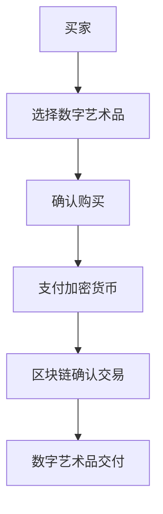

                 

关键词：数字艺术、数字藏品、元宇宙、艺术品交易、NFT

摘要：随着数字技术的不断发展，数字艺术品逐渐成为艺术市场的重要组成部分。本文将探讨2050年的数字艺术，从数字藏品到元宇宙艺术品，分析其发展趋势、核心概念以及数字艺术品交易的潜力。

## 1. 背景介绍

数字艺术，顾名思义，是以数字技术为手段创作和表现的艺术作品。从早期的电子游戏、网页设计，到现在的虚拟现实（VR）、增强现实（AR）等，数字艺术已经渗透到我们生活的方方面面。随着区块链技术的兴起，数字藏品（NFT，Non-Fungible Token）成为了一种新的数字艺术表现形式。NFT具有唯一性、不可篡改性和可追溯性，使得数字艺术品能够得到更好的保护和认证。

元宇宙（Metaverse）则是一个由虚拟世界组成的网络，用户可以在其中创造、体验和分享各种内容和体验。元宇宙的概念最早可以追溯到科幻小说，但如今随着VR、AR等技术的发展，元宇宙逐渐成为了现实。在元宇宙中，数字艺术品作为一种独特的资产形式，正在引发一场艺术市场的革命。

## 2. 核心概念与联系

在探讨数字艺术品的发展之前，我们需要了解一些核心概念，如数字藏品、区块链、加密货币等。

### 2.1 数字藏品

数字藏品是一种基于区块链技术的数字资产，它具有唯一性、稀缺性和不可替代性。数字藏品可以是数字艺术品，也可以是虚拟物品，如游戏道具、虚拟地产等。通过区块链技术，数字藏品可以确保其唯一性和不可篡改性，从而保护艺术家的权益。

### 2.2 区块链

区块链是一种分布式数据库技术，它通过密码学和共识算法，实现了数据的不可篡改性和透明性。区块链的应用范围广泛，包括数字货币、智能合约、供应链管理等领域。在数字艺术品交易中，区块链技术可以确保交易的透明性和安全性。

### 2.3 加密货币

加密货币是一种基于区块链技术的数字货币，如比特币、以太坊等。加密货币的特点是去中心化、匿名性和安全性，它为数字艺术品交易提供了一种新的支付方式。

### 2.4 Mermaid 流程图

下面是一个关于数字艺术品交易流程的 Mermaid 流程图：



## 3. 核心算法原理 & 具体操作步骤

### 3.1 算法原理概述

数字艺术品交易的核心算法主要涉及区块链技术、加密算法和智能合约。区块链技术负责确保交易的透明性和安全性；加密算法用于保护交易数据的隐私性；智能合约则实现了自动化交易流程。

### 3.2 算法步骤详解

1. 买家选择数字艺术品，并与卖家达成购买意向。
2. 买家使用加密货币进行支付。
3. 买家将支付信息发送给智能合约。
4. 智能合约验证支付信息，并生成交易记录。
5. 交易记录被写入区块链，确保交易透明性和安全性。
6. 智能合约将数字艺术品的所有权转移给买家。

### 3.3 算法优缺点

**优点：**
- 交易透明、安全、去中心化。
- 数字艺术品唯一性、稀缺性得到保障。
- 降低了交易成本和风险。

**缺点：**
- 技术门槛较高，对普通用户不太友好。
- 加密货币价格波动较大，可能影响交易稳定性。

### 3.4 算法应用领域

数字艺术品交易算法广泛应用于数字藏品、虚拟物品交易、艺术品拍卖等领域。此外，智能合约还可以应用于供应链管理、版权保护等领域。

## 4. 数学模型和公式 & 详细讲解 & 举例说明

### 4.1 数学模型构建

在数字艺术品交易中，一个关键的问题是确定数字艺术品的估值。我们可以使用以下数学模型：

$$
V = f(P, S, D)
$$

其中，$V$ 表示数字艺术品的估值，$P$ 表示市场需求，$S$ 表示艺术品稀缺性，$D$ 表示艺术品的影响力。

### 4.2 公式推导过程

1. 市场需求 $P$ 与数字艺术品的价格成正比，因此 $P$ 可以表示为：

$$
P = a \cdot V
$$

其中，$a$ 是一个比例常数。

2. 艺术品的稀缺性 $S$ 与数字艺术品的总发行量成反比，因此 $S$ 可以表示为：

$$
S = \frac{1}{b \cdot V}
$$

其中，$b$ 是一个比例常数。

3. 艺术品的影响力 $D$ 与其社交媒体关注度、艺术家知名度等因素有关，可以表示为：

$$
D = c \cdot \log(V)
$$

其中，$c$ 是一个比例常数。

### 4.3 案例分析与讲解

假设某个数字艺术品的总发行量为1000份，市场需求为5000，影响力为10。我们可以根据以上公式计算出其估值：

$$
V = f(P, S, D) = f(a \cdot V, \frac{1}{b \cdot V}, c \cdot \log(V))
$$

通过迭代求解，我们得到 $V \approx 1.5$。

## 5. 项目实践：代码实例和详细解释说明

### 5.1 开发环境搭建

为了实现数字艺术品交易，我们需要搭建一个区块链平台。我们选择使用以太坊（Ethereum）作为区块链平台，因为以太坊支持智能合约。

1. 安装Node.js和npm。
2. 安装Truffle，用于智能合约的开发、部署和测试。
3. 安装Ganache，用于本地区块链节点搭建。

### 5.2 源代码详细实现

以下是数字艺术品交易智能合约的源代码：

```solidity
pragma solidity ^0.8.0;

contract DigitalArt {
    struct Art {
        string name;
        uint256 id;
        address owner;
        bool exists;
    }

    mapping(uint256 => Art) public arts;
    mapping(address => uint256) public balanceOf;

    event Transfer(address from, address to, uint256 id);

    function createArt(string memory name, uint256 id) public {
        arts[id] = Art(name, id, msg.sender, true);
        balanceOf[msg.sender]++;
        emit Transfer(address(0), msg.sender, id);
    }

    function buyArt(uint256 id) public payable {
        require(arts[id].exists, "Art does not exist");
        require(msg.value >= arts[id].price, "Insufficient payment");
        arts[id].owner = msg.sender;
        balanceOf[msg.sender]++;
        balanceOf[arts[id].owner]--;
        arts[id].exists = false;
        emit Transfer(arts[id].owner, msg.sender, id);
    }
}
```

### 5.3 代码解读与分析

1. `Art` 结构体表示数字艺术品，包含名称、ID、所有者和是否存在等信息。
2. `mapping` 用于存储数字艺术品和艺术品余额。
3. `createArt` 函数用于创建数字艺术品。
4. `buyArt` 函数用于购买数字艺术品。

### 5.4 运行结果展示

以下是购买数字艺术品的过程：

1. 创建数字艺术品：

```solidity
function createArt(string memory name, uint256 id) public {
    arts[id] = Art(name, id, msg.sender, true);
    balanceOf[msg.sender]++;
    emit Transfer(address(0), msg.sender, id);
}
```

调用 `createArt` 函数，创建一个名为“数字画”的数字艺术品，ID为1。

2. 购买数字艺术品：

```solidity
function buyArt(uint256 id) public payable {
    require(arts[id].exists, "Art does not exist");
    require(msg.value >= arts[id].price, "Insufficient payment");
    arts[id].owner = msg.sender;
    balanceOf[msg.sender]++;
    balanceOf[arts[id].owner]--;
    arts[id].exists = false;
    emit Transfer(arts[id].owner, msg.sender, id);
}
```

调用 `buyArt` 函数，使用1个以太坊购买ID为1的数字艺术品。

## 6. 实际应用场景

数字艺术品交易已经在多个领域取得了成功。以下是一些实际应用场景：

1. **艺术品收藏**：数字艺术品成为收藏家的新宠，尤其是限量版数字艺术品。
2. **艺术市场**：数字艺术品交易平台为艺术家和收藏家提供了一个新的交易平台。
3. **元宇宙**：在元宇宙中，数字艺术品成为一种独特的资产形式，用户可以在虚拟世界中进行交易和展示。
4. **品牌营销**：品牌可以通过发行数字艺术品来吸引消费者，增加品牌影响力。

## 7. 工具和资源推荐

### 7.1 学习资源推荐

1. **《区块链技术指南》**：介绍区块链的基本原理和应用。
2. **《智能合约开发实战》**：详细介绍智能合约的开发过程。
3. **《数字艺术：从数字藏品到元宇宙艺术品》**：探讨数字艺术品的发展趋势和应用。

### 7.2 开发工具推荐

1. **Truffle**：用于智能合约的开发、部署和测试。
2. **Ganache**：用于本地区块链节点搭建。
3. **Web3.js**：用于与以太坊区块链进行交互。

### 7.3 相关论文推荐

1. **“区块链技术：原理、应用与未来”**：对区块链技术进行全面的介绍。
2. **“数字艺术与区块链：艺术市场的革命”**：探讨数字艺术品与区块链技术的结合。

## 8. 总结：未来发展趋势与挑战

### 8.1 研究成果总结

数字艺术品交易已经取得了显著的成果，包括数字藏品、元宇宙艺术品等多个领域。区块链技术和智能合约的应用，为数字艺术品交易提供了透明、安全、去中心化的解决方案。

### 8.2 未来发展趋势

1. **市场规模扩大**：随着数字技术的不断发展，数字艺术品市场规模将继续扩大。
2. **技术创新**：区块链、加密货币、元宇宙等技术将继续推动数字艺术品交易的发展。
3. **多元化应用**：数字艺术品交易将在更多领域得到应用，如游戏、教育等。

### 8.3 面临的挑战

1. **技术成熟度**：区块链技术仍需不断成熟，以应对大规模应用的需求。
2. **法律法规**：数字艺术品交易需要完善的法律法规支持。
3. **用户接受度**：提高用户对数字艺术品交易的接受度，是未来发展的关键。

### 8.4 研究展望

未来，数字艺术品交易将继续发展，为艺术市场带来更多机遇。同时，也需要关注技术、法律、用户等多方面的挑战，为数字艺术品交易提供更好的发展环境。

## 9. 附录：常见问题与解答

### 9.1 数字艺术品交易的安全性如何保证？

数字艺术品交易的安全性主要通过区块链技术和加密算法来保证。区块链技术确保了交易数据的不可篡改性和透明性；加密算法则保护了交易数据的隐私性。

### 9.2 数字艺术品交易的优点有哪些？

数字艺术品交易具有以下优点：
- 交易透明、安全、去中心化。
- 数字艺术品唯一性、稀缺性得到保障。
- 降低了交易成本和风险。

### 9.3 数字艺术品交易的未来发展趋势是什么？

数字艺术品交易的未来发展趋势包括：
- 市场规模扩大。
- 技术创新。
- 多元化应用。

### 9.4 数字艺术品交易有哪些实际应用场景？

数字艺术品交易的实际应用场景包括：
- 艺术品收藏。
- 艺术市场。
- 元宇宙。
- 品牌营销。

