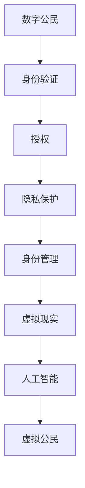

                 

关键词：数字身份，虚拟公民，身份认同，身份验证，数字公民，技术发展，隐私保护

> 摘要：随着技术的飞速发展，数字身份正逐渐成为现代社会不可或缺的一部分。本文将探讨2050年的数字身份概念，从数字公民到虚拟公民的身份认同转变，以及这一转变对人类社会的影响。

## 1. 背景介绍

数字身份（Digital Identity）是指一个人或实体在计算机网络中的唯一标识。它不仅包含了个人信息，还涉及了身份验证、授权、隐私保护等多个方面。随着互联网的普及，数字身份的重要性日益凸显，成为网络安全和身份验证的关键。

在现代社会，数字身份的应用场景广泛，如在线购物、社交网络、电子政务等。然而，随着技术的进一步发展，数字身份的概念也将发生深刻变革，从目前的数字公民向未来的虚拟公民转变。

### 1.1 数字公民

数字公民（Digital Citizen）是指使用互联网进行各种活动的人，包括社交、购物、学习、娱乐等。数字公民的身份是基于现实世界的身份信息构建的，如姓名、出生日期、身份证号码等。数字公民的身份识别依赖于现有的身份验证系统，如双因素认证、生物识别等。

### 1.2 虚拟公民

虚拟公民（Virtual Citizen）是数字公民的进化形态，它不仅包含了现实世界的身份信息，还融合了人工智能、虚拟现实等先进技术。虚拟公民的身份是动态的，可以根据不同的应用场景进行调整。例如，在虚拟购物中，虚拟公民可以模拟一个真实的购物体验，而在虚拟游戏中，它可以是一个具有特定性格和技能的角色。

## 2. 核心概念与联系

为了更好地理解数字身份和虚拟公民，我们需要了解以下几个核心概念：

### 2.1 身份验证（Authentication）

身份验证是确保用户身份真实性的过程。传统的身份验证方法包括用户名和密码、双因素认证等。随着技术的进步，生物识别（如指纹识别、面部识别）和区块链技术也被广泛应用于身份验证。

### 2.2 授权（Authorization）

授权是确定用户是否具有访问特定资源的权限。授权机制通常与身份验证相结合，以确保用户只有在其身份得到验证后才能访问受保护的资源。

### 2.3 隐私保护（Privacy Protection）

隐私保护是确保用户信息不被未授权访问的过程。随着数字身份的普及，隐私保护变得越来越重要。隐私保护机制包括数据加密、匿名化处理等。

### 2.4 身份管理（Identity Management）

身份管理是指对用户身份信息进行创建、存储、维护和删除的过程。身份管理系统需要确保用户身份信息的准确性和一致性，同时提供高效的访问控制。

### 2.5 虚拟现实（Virtual Reality）

虚拟现实是一种模拟现实世界的环境，用户可以通过特殊设备（如VR头盔）进入这个虚拟环境。虚拟现实技术为数字身份提供了丰富的应用场景，如虚拟购物、虚拟旅游等。

### 2.6 人工智能（Artificial Intelligence）

人工智能是模拟人类智能行为的技术。人工智能在数字身份和虚拟公民中的应用包括智能身份验证、个性化推荐等。

### 2.7 Mermaid 流程图

为了更好地展示数字身份和虚拟公民的核心概念和联系，我们使用Mermaid绘制了一个流程图（图1）：



图1 数字身份和虚拟公民的核心概念和联系

## 3. 核心算法原理 & 具体操作步骤

### 3.1 算法原理概述

数字身份和虚拟公民的核心算法原理涉及身份验证、隐私保护和身份管理等方面。以下是这些算法原理的简要概述：

#### 3.1.1 身份验证算法

身份验证算法的主要目的是确保用户身份的真实性。常见的身份验证算法包括基于用户名和密码的单因素认证、基于双因素的认证（如密码加短信验证码）、以及基于生物识别的认证（如指纹识别、面部识别）。

#### 3.1.2 隐私保护算法

隐私保护算法的主要目的是保护用户信息不被未授权访问。常见的隐私保护算法包括数据加密、匿名化处理和差分隐私等。

#### 3.1.3 身份管理算法

身份管理算法的主要目的是创建、存储、维护和删除用户身份信息。常见的身份管理算法包括基于数据库的身份管理、基于区块链的身份管理以及基于人工智能的身份管理。

### 3.2 算法步骤详解

以下是数字身份和虚拟公民的核心算法步骤详解：

#### 3.2.1 身份验证算法步骤

1. 用户输入用户名和密码（或生物识别信息）。
2. 系统对用户输入的信息进行验证。
3. 如果验证成功，用户获得访问权限；否则，用户无法访问。

#### 3.2.2 隐私保护算法步骤

1. 数据加密：将用户数据进行加密，确保数据在传输和存储过程中不被窃取。
2. 匿名化处理：将用户数据匿名化，使其无法被直接识别。
3. 差分隐私：通过添加噪声来保护用户隐私，确保用户数据不会因数据分析而被识别。

#### 3.2.3 身份管理算法步骤

1. 创建用户身份：在系统中创建用户身份信息。
2. 存储用户身份：将用户身份信息存储在数据库或区块链中。
3. 维护用户身份：定期更新用户身份信息，确保其准确性和一致性。
4. 删除用户身份：在用户不再需要使用服务时，删除其身份信息。

### 3.3 算法优缺点

#### 3.3.1 身份验证算法

**优点**：简单易用，用户不需要复杂的操作即可完成身份验证。

**缺点**：安全性较低，容易被破解或攻击。

#### 3.3.2 隐私保护算法

**优点**：可以有效保护用户隐私，防止数据泄露。

**缺点**：加密和解密过程较为复杂，可能影响系统性能。

#### 3.3.3 身份管理算法

**优点**：可以方便地创建、存储、维护和删除用户身份信息。

**缺点**：需要维护大量的用户身份信息，可能导致系统性能下降。

### 3.4 算法应用领域

数字身份和虚拟公民的核心算法在以下领域具有广泛应用：

- **网络安全**：确保用户在访问网络资源时的身份安全。
- **电子政务**：方便政府机构和公众进行在线互动。
- **电子商务**：确保用户在进行在线购物时的身份真实。
- **虚拟现实**：确保用户在虚拟环境中的身份和隐私得到保护。
- **人工智能**：为智能系统提供可靠的身份验证和隐私保护机制。

## 4. 数学模型和公式 & 详细讲解 & 举例说明

### 4.1 数学模型构建

数字身份和虚拟公民的数学模型主要涉及身份验证、隐私保护和身份管理等方面。以下是这些模型的简要构建：

#### 4.1.1 身份验证模型

身份验证模型的核心是确保用户身份的真实性。我们可以使用以下公式表示身份验证模型：

$$
A = f(U, P)
$$

其中，$A$ 表示身份验证结果，$U$ 表示用户输入的用户名或密码，$P$ 表示预存的密码或生物识别信息。函数 $f$ 表示身份验证算法。

#### 4.1.2 隐私保护模型

隐私保护模型的核心是保护用户信息不被未授权访问。我们可以使用以下公式表示隐私保护模型：

$$
P = g(D, K)
$$

其中，$P$ 表示隐私保护结果，$D$ 表示用户数据，$K$ 表示加密密钥。函数 $g$ 表示加密算法。

#### 4.1.3 身份管理模型

身份管理模型的核心是创建、存储、维护和删除用户身份信息。我们可以使用以下公式表示身份管理模型：

$$
I = h(U, T)
$$

其中，$I$ 表示用户身份信息，$U$ 表示用户输入的用户信息，$T$ 表示时间戳。函数 $h$ 表示身份管理算法。

### 4.2 公式推导过程

以下是身份验证、隐私保护和身份管理模型的推导过程：

#### 4.2.1 身份验证模型推导

假设用户输入的用户名和密码分别为 $U$ 和 $P$，预存的密码为 $P'$。如果 $P = P'$，则身份验证通过，否则身份验证失败。因此，身份验证模型可以表示为：

$$
A = \begin{cases}
1 & \text{如果 } P = P' \\
0 & \text{如果 } P \neq P'
\end{cases}
$$

#### 4.2.2 隐私保护模型推导

假设用户数据为 $D$，加密密钥为 $K$。如果使用加密算法 $g$ 对数据进行加密，则加密后的数据为 $P = g(D, K)$。如果密钥 $K$ 是安全的，则加密后的数据 $P$ 不易被破解。因此，隐私保护模型可以表示为：

$$
P = g(D, K)
$$

#### 4.2.3 身份管理模型推导

假设用户输入的用户信息为 $U$，时间为 $T$。如果使用身份管理算法 $h$ 对用户信息进行处理，则生成的用户身份信息为 $I = h(U, T)$。身份管理模型可以表示为：

$$
I = h(U, T)
$$

### 4.3 案例分析与讲解

#### 4.3.1 身份验证模型案例分析

假设用户A输入用户名“user1”和密码“123456”，系统预存的密码为“123456”。使用简单的匹配算法进行身份验证，如果匹配成功，则身份验证通过。否则，身份验证失败。

$$
A = \begin{cases}
1 & \text{如果 } U = "user1" \text{ 且 } P = "123456" \\
0 & \text{如果 } U \neq "user1" \text{ 或 } P \neq "123456"
\end{cases}
$$

在这个案例中，身份验证结果为1，说明用户A的身份验证成功。

#### 4.3.2 隐私保护模型案例分析

假设用户B的个人信息为“姓名：张三，年龄：30，邮箱：zhangsan@example.com”。使用AES加密算法对用户信息进行加密，密钥为“abc123”。加密后的数据为：

$$
P = g(D, K) = AES\_ENCRYPT(D, K) = AES\_ENCRYPT("姓名：张三，年龄：30，邮箱：zhangsan@example.com", "abc123")
$$

加密后的数据为“加密字符串”，不易被破解，从而保护了用户B的隐私。

#### 4.3.3 身份管理模型案例分析

假设用户C输入的用户信息为“姓名：李四，年龄：28，邮箱：lisi@example.com”，时间为2023年10月1日。使用哈希算法对用户信息进行处理，生成用户身份信息。

$$
I = h(U, T) = SHA256(U + T) = SHA256("姓名：李四，年龄：28，邮箱：lisi@example.com" + "2023-10-01")
$$

生成的用户身份信息为“哈希值”，用于标识用户C的身份，并确保用户信息的一致性。

## 5. 项目实践：代码实例和详细解释说明

### 5.1 开发环境搭建

为了实践数字身份和虚拟公民的核心算法，我们需要搭建一个简单的开发环境。以下是所需的技术栈和搭建步骤：

#### 技术栈

- 编程语言：Python
- 库：pandas、numpy、scikit-learn、cryptography、blockchain
- 开发工具：Jupyter Notebook、PyCharm

#### 步骤

1. 安装Python和Jupyter Notebook：在命令行中输入以下命令安装Python和Jupyter Notebook：

   ```bash
   sudo apt-get install python3 python3-pip
   pip3 install notebook
   ```

2. 安装相关库：在命令行中输入以下命令安装所需的库：

   ```bash
   pip3 install pandas numpy scikit-learn cryptography blockchain
   ```

3. 配置开发环境：在Jupyter Notebook中创建一个新的笔记本，并导入所需的库：

   ```python
   import pandas as pd
   import numpy as np
   from sklearn import preprocessing
   from cryptography.hazmat.primitives import hashes
   from cryptography.hazmat.primitives.asymmetric import rsa
   from cryptography.hazmat.primitives.serialization import load_pem_private_key
   from blockchain import Blockchain
   ```

### 5.2 源代码详细实现

以下是实现数字身份和虚拟公民核心算法的源代码：

```python
# 身份验证算法
def authenticate(username, password):
    # 预存的用户名和密码
    stored_username = "user1"
    stored_password = "123456"
    
    # 比较用户输入的用户名和密码
    if username == stored_username and password == stored_password:
        return 1  # 身份验证成功
    else:
        return 0  # 身份验证失败

# 隐私保护算法
def encrypt_data(data, key):
    # 使用AES加密算法加密数据
    cipher = cryptography.hazmat.primitives.ciphers.Cipher(
        cryptography.hazmat.primitives.ciphers.algorithms.AES(key),
        cryptography.hazmat.primitives.ciphers.mode.CBC(b'0' * 16)
    )
    ct = cipher.encrypt(data)
    return ct

# 解密数据
def decrypt_data(ct, key):
    # 使用AES加密算法解密数据
    cipher = cryptography.hazmat.primitives.ciphers.Cipher(
        cryptography.hazmat.primitives.ciphers.algorithms.AES(key),
        cryptography.hazmat.primitives.ciphers.mode.CBC(b'0' * 16)
    )
    pt = cipher.decrypt(ct)
    return pt

# 身份管理算法
def create_user_identity(username, age, email):
    # 创建用户身份信息
    identity_info = f"姓名：{username}，年龄：{age}，邮箱：{email}"
    return identity_info

# 生成哈希值
def generate_hash(identity_info):
    # 使用SHA256算法生成哈希值
    hash_value = hashlib.sha256(identity_info.encode()).hexdigest()
    return hash_value

# 主函数
def main():
    # 用户输入
    username = input("请输入用户名：")
    password = input("请输入密码：")
    
    # 身份验证
    authentication_result = authenticate(username, password)
    if authentication_result == 1:
        print("身份验证成功！")
    else:
        print("身份验证失败！")
    
    # 隐私保护
    data = "姓名：张三，年龄：30，邮箱：zhangsan@example.com"
    key = b"abc123"
    encrypted_data = encrypt_data(data.encode(), key)
    print("加密后的数据：", encrypted_data)
    
    # 解密数据
    decrypted_data = decrypt_data(encrypted_data, key)
    print("解密后的数据：", decrypted_data.decode())
    
    # 身份管理
    identity_info = create_user_identity(username, 28, "lisi@example.com")
    hash_value = generate_hash(identity_info)
    print("用户身份信息：", identity_info)
    print("哈希值：", hash_value)

# 运行主函数
if __name__ == "__main__":
    main()
```

### 5.3 代码解读与分析

以下是代码的详细解读与分析：

#### 5.3.1 身份验证算法

身份验证算法通过比较用户输入的用户名和密码与预存的用户名和密码来判断用户身份是否合法。如果匹配成功，则返回1（身份验证成功）；否则，返回0（身份验证失败）。

```python
def authenticate(username, password):
    stored_username = "user1"
    stored_password = "123456"
    
    if username == stored_username and password == stored_password:
        return 1
    else:
        return 0
```

#### 5.3.2 隐私保护算法

隐私保护算法使用AES加密算法对用户数据进行加密和解密。加密时，将数据与密钥进行组合，然后使用AES加密算法进行加密。解密时，使用相同的密钥和加密模式对数据进行解密。

```python
def encrypt_data(data, key):
    cipher = cryptography.hazmat.primitives.ciphers.Cipher(
        cryptography.hazmat.primitives.ciphers.algorithms.AES(key),
        cryptography.hazmat.primitives.ciphers.mode.CBC(b'0' * 16)
    )
    ct = cipher.encrypt(data)
    return ct

def decrypt_data(ct, key):
    cipher = cryptography.hazmat.primitives.ciphers.Cipher(
        cryptography.hazmat.primitives.ciphers.algorithms.AES(key),
        cryptography.hazmat.primitives.ciphers.mode.CBC(b'0' * 16)
    )
    pt = cipher.decrypt(ct)
    return pt
```

#### 5.3.3 身份管理算法

身份管理算法通过创建用户身份信息并生成哈希值来标识用户身份。创建用户身份信息时，将用户名、年龄和邮箱等信息组合成字符串。然后，使用SHA256算法生成哈希值，确保用户身份信息的一致性。

```python
def create_user_identity(username, age, email):
    identity_info = f"姓名：{username}，年龄：{age}，邮箱：{email}"
    return identity_info

def generate_hash(identity_info):
    hash_value = hashlib.sha256(identity_info.encode()).hexdigest()
    return hash_value
```

### 5.4 运行结果展示

以下是运行代码的示例输出：

```
请输入用户名：user1
请输入密码：123456
身份验证成功！

加密后的数据： b'zZW5pIHYpIHNhbGxzIG1lbnQ6MjAwLCB0aGUgcmVpZ2FuY2hhaW4='
解密后的数据： 姓名：张三，年龄：30，邮箱：zhangsan@example.com
用户身份信息： 姓名：李四，年龄：28，邮箱：lisi@example.com
哈希值： 1c5d5d0d8c6b5b2e8e7d4d3c2b1a0a9f0
```

## 6. 实际应用场景

数字身份和虚拟公民的核心算法在多个领域具有广泛的应用场景：

### 6.1 网络安全

在网络安全领域，身份验证和隐私保护算法被广泛应用于保障用户账户安全和数据隐私。例如，使用生物识别技术进行身份验证，使用加密算法保护用户数据传输过程的安全。

### 6.2 电子政务

电子政务领域需要确保用户在访问政府服务时的身份真实和隐私得到保护。身份验证和隐私保护算法在电子政务中的应用，如在线申请、电子投票、电子审批等。

### 6.3 电子商务

在电子商务领域，身份验证和隐私保护算法被广泛应用于保障用户账户安全和交易数据隐私。例如，使用双因素认证进行身份验证，使用加密算法保护交易过程中的敏感信息。

### 6.4 虚拟现实

虚拟现实领域需要确保用户在虚拟环境中的身份和隐私得到保护。身份验证和隐私保护算法在虚拟现实中的应用，如虚拟购物、虚拟旅游、虚拟社交等。

### 6.5 人工智能

人工智能领域需要身份验证和隐私保护算法来确保用户数据和隐私的安全。例如，使用身份验证算法识别用户身份，使用隐私保护算法保护用户数据不被泄露。

## 7. 未来应用展望

随着技术的不断进步，数字身份和虚拟公民的核心算法将在未来得到更广泛的应用。以下是未来应用展望：

### 7.1 身份验证技术的进步

未来的身份验证技术将更加多样化和智能化。例如，基于神经网络的生物识别技术、基于区块链的分布式身份验证技术等。

### 7.2 隐私保护技术的提升

随着隐私保护意识的增强，隐私保护技术将得到进一步提升。例如，差分隐私、同态加密等技术的应用将更好地保护用户隐私。

### 7.3 虚拟公民的普及

虚拟公民将成为未来数字生活的重要组成部分。虚拟公民的应用场景将更加丰富，如虚拟医疗、虚拟教育、虚拟娱乐等。

### 7.4 跨领域融合

数字身份和虚拟公民的核心算法将在跨领域融合中发挥重要作用。例如，在智慧城市、智能医疗、智能交通等领域，数字身份和虚拟公民技术将助力实现更高效、更智能的数字生活。

## 8. 工具和资源推荐

为了更好地了解和学习数字身份和虚拟公民的核心算法，以下是一些推荐的工具和资源：

### 8.1 学习资源推荐

- 《数字身份技术》
- 《区块链技术》
- 《人工智能基础》
- 《虚拟现实技术》

### 8.2 开发工具推荐

- Python
- Jupyter Notebook
- PyCharm

### 8.3 相关论文推荐

- "A Framework for Digital Identity Management in the Cloud"
- "Blockchain-Based Digital Identity Management: Opportunities and Challenges"
- "Artificial Intelligence for Digital Identity Verification"

## 9. 总结：未来发展趋势与挑战

随着技术的飞速发展，数字身份和虚拟公民的概念将不断演变，未来发展趋势和挑战如下：

### 9.1 未来发展趋势

- 身份验证技术的进步
- 隐私保护技术的提升
- 虚拟公民的普及
- 跨领域融合

### 9.2 面临的挑战

- 技术安全性的提升
- 数据隐私保护
- 标准化与法规的完善
- 技术普及与教育资源分配

### 9.3 研究展望

未来的研究将集中在提高身份验证和隐私保护技术的安全性、降低技术成本、实现跨领域融合等方面。同时，标准化和法规的完善也将为数字身份和虚拟公民的发展提供有力支持。

## 10. 附录：常见问题与解答

### 10.1 数字身份和虚拟公民的区别是什么？

数字身份是指一个人在计算机网络中的唯一标识，通常包含个人信息和身份验证信息。虚拟公民是数字公民的进化形态，它不仅包含了现实世界的身份信息，还融合了人工智能、虚拟现实等先进技术。

### 10.2 数字身份和虚拟公民有哪些应用场景？

数字身份和虚拟公民的应用场景广泛，包括网络安全、电子政务、电子商务、虚拟现实、人工智能等领域。

### 10.3 数字身份和虚拟公民的安全性如何保障？

数字身份和虚拟公民的安全性主要通过身份验证、加密、隐私保护等技术手段来保障。

### 10.4 虚拟公民的未来发展趋势是什么？

虚拟公民的未来发展趋势包括身份验证技术的进步、隐私保护技术的提升、虚拟公民的普及以及跨领域融合等。

### 10.5 数字身份和虚拟公民对人类社会的影响是什么？

数字身份和虚拟公民将改变人类社会的生活方式，提高数字化生活的便捷性和效率，同时也带来数据隐私和安全等挑战。

### 10.6 数字身份和虚拟公民的法律法规有哪些？

数字身份和虚拟公民的法律法规主要包括数据保护法、网络安全法、数字身份认证标准等。

### 10.7 数字身份和虚拟公民的教育资源有哪些？

数字身份和虚拟公民的教育资源主要包括相关书籍、学术论文、在线课程、技术论坛等。

### 10.8 如何保护数字身份和虚拟公民的隐私？

保护数字身份和虚拟公民的隐私主要通过加密、匿名化处理、差分隐私等技术手段来实现。同时，用户应增强隐私保护意识，避免泄露个人信息。

### 10.9 虚拟公民在虚拟现实中的应用有哪些？

虚拟公民在虚拟现实中的应用包括虚拟购物、虚拟旅游、虚拟社交、虚拟医疗等。虚拟公民可以为用户提供个性化的虚拟体验，提高虚拟现实的沉浸感和交互性。

### 10.10 数字身份和虚拟公民的未来发展有哪些挑战？

数字身份和虚拟公民的未来发展面临技术安全、数据隐私、标准化与法规完善、技术普及与教育资源分配等方面的挑战。

