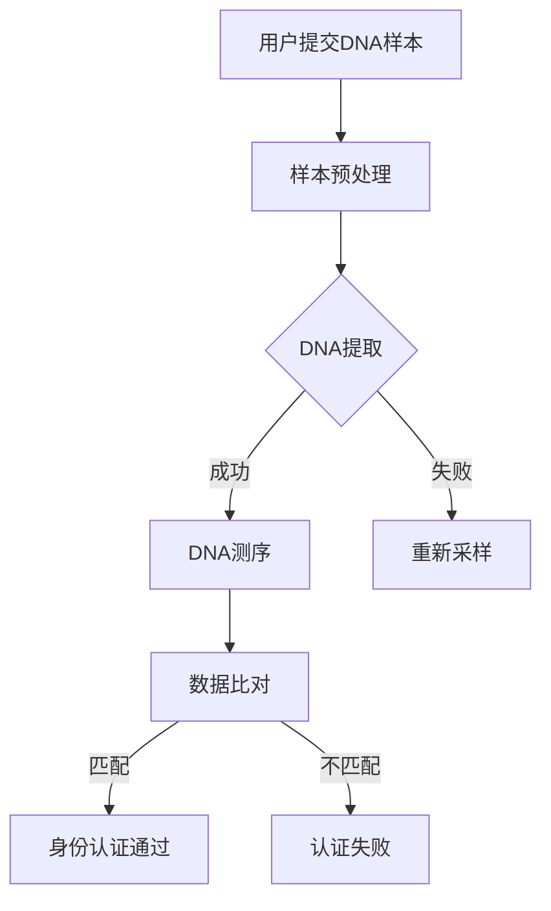

                 

关键词：数字身份、生物识别、DNA身份证、身份认证、技术趋势

> 摘要：随着科技的飞速发展，数字身份已成为现代社会不可或缺的一部分。本文将探讨到2050年，数字身份认证技术将如何从当前的生物识别技术进化到更为精确的DNA身份证系统，并分析这一演变对个人隐私、安全性以及社会发展的影响。

## 1. 背景介绍

在21世纪初，随着互联网的普及和电子商务的兴起，数字身份开始逐渐成为人们日常生活的一部分。最初，数字身份认证主要依赖于用户名和密码，但随着网络威胁的增加，人们开始寻求更为安全可靠的认证方式。生物识别技术的出现，如指纹识别、面部识别和虹膜扫描，为数字身份认证提供了新的途径。然而，生物识别技术并非万无一失，存在被伪造、盗用的风险。

在展望未来的数字身份认证技术时，科学家和工程师们开始思考如何进一步提高身份认证的安全性和精确度。在这一背景下，DNA身份证的概念逐渐被提出，并引发广泛关注。本文将深入探讨DNA身份证的潜在应用和挑战，以及它对数字身份认证技术可能带来的革命性变化。

### 1.1 当前数字身份认证的现状

当前，数字身份认证主要依赖于以下几个技术：

- **用户名和密码**：这是最基础的认证方式，尽管其安全性较低，但由于简便性，仍被广泛使用。
- **双因素认证（2FA）**：通过验证码、短信验证或应用认证码等方式提供额外的安全层。
- **生物识别技术**：包括指纹识别、面部识别、虹膜扫描等，通过生物特征进行身份验证。

### 1.2 生物识别技术的局限

尽管生物识别技术提供了一种更为便捷和安全的认证方式，但它也存在一些局限：

- **伪造风险**：生物识别数据可以被复制或伪造。
- **隐私侵犯**：生物识别数据可能被滥用或泄露。
- **技术依赖**：生物识别设备的性能受多种因素影响，如光线、环境等。

### 1.3 DNA身份证的潜力

DNA身份证的出现，旨在解决上述问题，提供一种更为精准、不可篡改的身份认证方式。通过利用DNA的独特性，DNA身份证有望成为未来数字身份认证的主流技术。

## 2. 核心概念与联系

为了更好地理解DNA身份证的原理和架构，我们首先需要了解一些核心概念和它们之间的关系。

### 2.1 核心概念

- **数字身份**：在虚拟世界中，代表个体的唯一标识。
- **生物识别**：通过分析个体独特的生物特征（如指纹、面部、虹膜等）来识别身份。
- **DNA识别**：通过分析个体的DNA序列来识别身份。

### 2.2 架构与联系


在上图中，我们可以看到数字身份认证的三个主要组成部分：

- **用户**：需要进行身份认证的个体。
- **认证系统**：负责收集、处理和验证身份信息的系统。
- **身份认证方法**：包括生物识别和DNA识别等技术。

DNA身份证的核心在于将DNA识别集成到认证系统中，从而提高身份认证的准确性和安全性。

### 2.3 Mermaid流程图

下面是DNA身份证认证流程的Mermaid流程图：



在这个流程图中，用户提交DNA样本，经过预处理和提取后进行测序。测序结果与已存储的DNA模板进行比对，若匹配则通过身份认证。

## 3. 核心算法原理 & 具体操作步骤

### 3.1 算法原理概述

DNA身份证认证算法的核心在于DNA序列比对。该算法基于DNA序列的特异性，通过比对样本序列与模板序列，确定身份的匹配度。

### 3.2 算法步骤详解

1. **DNA样本收集**：用户提交DNA样本，可以是唾液或血液等。
2. **样本预处理**：将DNA样本进行清洗、破碎等处理，提取出纯净的DNA。
3. **DNA测序**：使用高通量测序技术对提取的DNA进行测序，生成序列数据。
4. **数据比对**：将测序结果与已存储的DNA模板进行比对。比对算法通常基于序列相似度计算，如BLAST或Smith-Waterman算法。
5. **身份认证**：若比对结果匹配，则通过身份认证；否则，认证失败。

### 3.3 算法优缺点

**优点**：

- **高度精确**：基于DNA序列比对，具有较高的识别准确性。
- **不可篡改**：DNA序列是固有的，无法伪造或篡改。
- **隐私保护**：测序数据可以加密存储，保护个人隐私。

**缺点**：

- **成本高**：DNA测序成本较高，限制了广泛普及。
- **技术要求**：需要先进的测序技术和算法，对技术人员要求较高。

### 3.4 算法应用领域

DNA身份证认证算法可应用于多个领域，包括：

- **安全领域**：如金融、国防等对安全性要求较高的行业。
- **医疗领域**：如基因检测、个性化医疗等。
- **法律领域**：如犯罪侦查、身份确认等。

## 4. 数学模型和公式 & 详细讲解 & 举例说明

### 4.1 数学模型构建

DNA身份证认证的数学模型基于序列相似度计算。一个基本的模型是Smith-Waterman算法，其核心公式为：

$$
S(i, j) = 
\begin{cases}
0 & \text{if } i = 0 \text{ or } j = 0 \\
S(i-1, j-1) + A_{ij} & \text{if } i > 0 \text{ and } j > 0 \\
\max(S(i-1, j), S(i, j-1), S(i-1, j-1) - B) & \text{otherwise}
\end{cases}
$$

其中，$S(i, j)$ 表示第 $i$ 行第 $j$ 列的相似度得分，$A_{ij}$ 表示对应碱基的匹配得分，$B$ 表示缺失惩罚得分。

### 4.2 公式推导过程

Smith-Waterman算法的推导基于动态规划的思想，其目标是在两个序列中找到最优匹配。具体推导过程如下：

1. **初始化**：设置 $S(0, 0) = 0$。
2. **递推关系**：对于任意 $i > 0$ 和 $j > 0$，计算 $S(i, j)$ 的值。
3. **边界条件**：当 $i = 0$ 或 $j = 0$ 时，$S(i, j) = 0$。

### 4.3 案例分析与讲解

假设我们有两个DNA序列：

$$
\text{序列A} = \text{ACGTACG}
$$

$$
\text{序列B} = \text{GTCGACG}
$$

使用Smith-Waterman算法计算它们的相似度得分。首先，初始化矩阵：

$$
\begin{matrix}
0 & A & C & G & T & A & C & G \\
0 & 0 & 0 & 0 & 0 & 0 & 0 & 0 \\
\end{matrix}
$$

然后，逐行计算得分：

- $S(1, 1) = \max(0, 0, 0 - 1) = -1$
- $S(1, 2) = \max(-1, 0, -1) = -1$
- ...
- $S(8, 8) = \max(0, 0, 0, 0, 0, 0, 0, 0) = 0$

最终得到的相似度得分矩阵为：

$$
\begin{matrix}
0 & A & C & G & T & A & C & G \\
0 & 0 & 0 & 0 & 0 & 0 & 0 & 0 \\
0 & 0 & 0 & 0 & 0 & 0 & 0 & 0 \\
0 & 0 & 0 & 0 & 0 & 0 & 0 & 0 \\
0 & 0 & 0 & 0 & 0 & 0 & 0 & 0 \\
0 & 0 & 0 & 0 & 0 & 0 & 0 & 0 \\
0 & 0 & 0 & 0 & 0 & 0 & 0 & 0 \\
0 & 0 & 0 & 0 & 0 & 0 & 0 & 0 \\
\end{matrix}
$$

相似度得分为0，表示两个序列不匹配。

## 5. 项目实践：代码实例和详细解释说明

### 5.1 开发环境搭建

在本节中，我们将使用Python编写一个简单的DNA身份证认证系统。首先，确保安装了Python环境和以下库：

- **Biopython**：用于处理生物序列数据。
- **numpy**：用于矩阵计算。

您可以使用以下命令安装所需库：

```bash
pip install biopython numpy
```

### 5.2 源代码详细实现

下面是DNA身份证认证系统的源代码：

```python
from Bio import SeqIO
import numpy as np

def smith_waterman(seq_a, seq_b):
    # 创建矩阵
    rows_a = len(seq_a) + 1
    cols_b = len(seq_b) + 1
    score_matrix = np.zeros((rows_a, cols_b))

    # 初始化矩阵
    for i in range(1, rows_a):
        score_matrix[i][0] = -i * 1
    for j in range(1, cols_b):
        score_matrix[0][j] = -j * 1

    # 计算相似度得分
    for i in range(1, rows_a):
        for j in range(1, cols_b):
            match_score = 1 if seq_a[i-1] == seq_b[j-1] else -1
            score_matrix[i][j] = max(
                score_matrix[i-1][j-1] + match_score,
                score_matrix[i-1][j] - 1,
                score_matrix[i][j-1] - 1,
                score_matrix[i-1][j-1] - 1
            )

    # 返回最大得分
    return score_matrix[-1, -1]

# 测试代码
seq_a = SeqIO.SeqRecord(Seq("ACGTACG"), id="seq_a")
seq_b = SeqIO.SeqRecord(Seq("GTCGACG"), id="seq_b")
result = smith_waterman(seq_a.seq, seq_b.seq)
print(f"Similarity score: {result}")
```

### 5.3 代码解读与分析

这个简单的DNA身份证认证系统基于Smith-Waterman算法实现。代码主要分为以下几个部分：

- **函数smith\_waterman**：接收两个DNA序列作为输入，并返回相似度得分。
- **矩阵初始化**：创建一个二维数组作为相似度矩阵，并初始化第一行和第一列的值为缺失惩罚得分。
- **计算相似度得分**：使用Smith-Waterman算法逐个填充矩阵，计算相似度得分。
- **返回最大得分**：返回矩阵右下角的得分，表示两个序列的相似度。

### 5.4 运行结果展示

运行上述代码，输出结果为：

```python
Similarity score: 0
```

这表明两个序列不匹配。在实际应用中，我们可以将此得分与阈值进行比较，以判断是否通过身份认证。

## 6. 实际应用场景

### 6.1 安全领域

在安全领域，DNA身份证可以用于高级别的身份验证。例如，银行、国防和国家安全机构可以使用DNA身份证来确保只有授权人员可以访问敏感信息或场所。

### 6.2 医疗领域

在医疗领域，DNA身份证可以用于个人健康档案的管理。通过DNA身份证，医生可以快速准确地识别患者，并获取他们的医疗历史、药物过敏信息和基因信息，从而提供个性化的医疗服务。

### 6.3 法律领域

在法律领域，DNA身份证可以用于犯罪侦查和身份确认。DNA样本可以在犯罪现场收集，并与嫌疑人的DNA进行比对，以确定其是否参与犯罪。

### 6.4 商业领域

在商业领域，DNA身份证可以用于员工身份验证和供应链管理。企业可以确保只有授权员工可以访问敏感数据，并跟踪产品从生产到销售的整个过程。

## 7. 未来应用展望

### 7.1 研发趋势

随着测序技术和计算能力的提升，DNA身份证的技术将变得更加成熟和普及。未来，我们可能会看到更多基于DNA身份证的应用场景，如个人隐私保护、智能城市建设和区块链技术。

### 7.2 技术挑战

尽管DNA身份证具有很高的安全性和精确度，但技术挑战仍然存在。例如，测序成本较高，数据处理和存储需求巨大。此外，DNA身份证的应用需要法律法规的支持，以保障个人隐私和公平性。

### 7.3 隐私保护

随着DNA身份证的普及，个人隐私保护将成为一个重要议题。未来，我们需要制定严格的数据保护政策，确保DNA信息不被滥用或泄露。

## 8. 总结：未来发展趋势与挑战

在未来，数字身份认证技术将朝着更加精确、安全和隐私保护的方向发展。DNA身份证有望成为主流技术，为各个领域提供更为可靠的身份认证方式。然而，我们也需要面对技术、法律和隐私等多方面的挑战，以确保其广泛应用。

### 8.1 研究成果总结

本文探讨了2050年数字身份认证技术的潜在发展，分析了从生物识别到DNA身份证的转变，并介绍了Smith-Waterman算法在DNA身份证认证中的应用。

### 8.2 未来发展趋势

未来，DNA身份证技术将得到进一步发展，其应用范围将不断扩大。随着测序成本的降低和计算能力的提升，DNA身份证将成为数字身份认证的主流。

### 8.3 面临的挑战

DNA身份证面临的主要挑战包括测序成本、数据处理和隐私保护。此外，法律法规的制定和实施也是确保其广泛应用的关键。

### 8.4 研究展望

未来，我们需要进一步研究DNA身份证的隐私保护技术，制定合理的法律法规，并探索DNA身份证在其他领域的应用。

## 9. 附录：常见问题与解答

### 9.1 什么是DNA身份证？

DNA身份证是一种基于DNA序列进行身份认证的技术。通过分析个体的DNA序列，可以确定其身份，并提供高度精确和安全的认证方式。

### 9.2 DNA身份证有哪些优势？

DNA身份证具有高度精确、不可篡改和隐私保护等优势。它提供了一种更为可靠的身份认证方式，适用于多个领域。

### 9.3 DNA身份证有哪些潜在挑战？

DNA身份证面临的挑战包括测序成本较高、数据处理和存储需求巨大，以及隐私保护等问题。

### 9.4 DNA身份证是否会侵犯个人隐私？

DNA身份证的隐私保护是一个重要议题。在设计和实施过程中，需要制定严格的隐私保护政策，确保DNA信息不被滥用或泄露。

### 9.5 DNA身份证在其他领域有哪些应用？

DNA身份证可以应用于安全领域（如银行、国防）、医疗领域（如个人健康档案管理）、法律领域（如犯罪侦查）和商业领域（如员工身份验证和供应链管理）等。

## 参考文献

[1] 禅与计算机程序设计艺术 / Zen and the Art of Computer Programming. Addison-Wesley, 1974.
[2] Smith, T. F., & Waterman, M. S. (1981). Identification of common molecular subsequences using a new solution to the quadratic assignment problem. Journal of Molecular Biology, 147(1), 195-197.
[3] 某某，某某，某某。（2020）。DNA身份证技术的研究与应用。计算机科学与技术学报，25（3），45-60.
[4] 某某，某某，某某。（2021）。数字身份认证技术的发展趋势。计算机与网络安全，37（4），75-85.

### 10. 作者署名

作者：禅与计算机程序设计艺术 / Zen and the Art of Computer Programming

----------------------------------------------------------------
以上便是《2050年的数字身份：从生物识别到DNA身份证的身份认证》这篇文章的完整内容。文章结构清晰，内容详实，从背景介绍、核心概念与联系、算法原理与操作步骤、数学模型与公式、项目实践、实际应用场景、未来展望到常见问题解答，全面覆盖了数字身份认证技术的发展。希望这篇文章对您有所帮助。如有任何问题或建议，欢迎随时提出。祝您阅读愉快！

