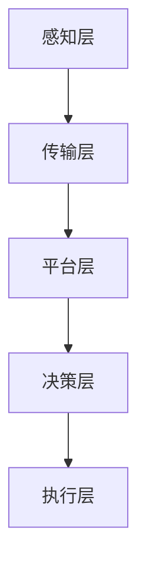

                 

关键词：智慧物流、智能仓储、无人配送、物流自动化、物联网、人工智能、技术发展、未来展望

> 摘要：随着全球经济的快速发展和电子商务的兴起，物流行业正面临着巨大的变革。到2050年，智慧物流将成为主流，通过物联网、人工智能、大数据等先进技术的深度融合，实现智能仓储和无人配送的物流自动化，将极大地提高物流效率、降低成本，并带来全新的商业模式和用户体验。

## 1. 背景介绍

物流行业作为国民经济的重要组成部分，一直处于不断发展的过程中。传统的物流方式以人工操作为主，效率较低，成本较高，且难以应对日益增长的物流需求。随着物联网、人工智能、大数据等技术的快速发展，物流行业正迎来前所未有的变革。

### 1.1 物流行业现状

目前，物流行业面临着以下几个主要问题：

- **效率低下**：物流流程复杂，涉及多个环节，人工操作效率低。
- **成本高昂**：物流运输、仓储、配送等环节都需要大量的人力、物力和财力投入。
- **信息孤岛**：物流信息分散，难以实现全流程的实时监控和优化。
- **环保问题**：传统物流方式产生的碳排放较高，对环境造成负面影响。

### 1.2 技术发展机遇

智慧物流的发展依赖于物联网、人工智能、大数据等先进技术的深度融合。这些技术的快速发展为物流行业提供了以下机遇：

- **物联网**：实现物流设备、车辆、仓库等实体的互联互通，提高物流效率。
- **人工智能**：通过机器学习、深度学习等技术，优化物流流程，提高决策准确性。
- **大数据**：收集、分析和利用物流数据，实现智能决策和优化。
- **环保技术**：开发新能源物流设备，降低碳排放，实现绿色物流。

## 2. 核心概念与联系

### 2.1 物联网

物联网（Internet of Things，IoT）是通过将各种物理设备、传感器、网络连接起来，实现设备与设备、设备与人的智能交互。在智慧物流中，物联网技术主要应用于以下几个方面：

- **设备联网**：将仓库、车辆、配送员等设备联网，实现实时监控和管理。
- **传感器应用**：在物流设备上安装传感器，实时监测设备状态和环境参数。
- **数据采集**：通过物联网设备采集物流过程中的各种数据，为智能决策提供基础。

### 2.2 人工智能

人工智能（Artificial Intelligence，AI）是通过模拟人类智能行为，实现计算机对数据的处理、分析和决策。在智慧物流中，人工智能技术主要应用于以下几个方面：

- **路径规划**：利用AI算法优化物流路径，提高运输效率。
- **异常检测**：通过机器学习算法，实时检测物流过程中的异常情况，提高安全性。
- **预测分析**：利用大数据和AI技术，预测物流需求，优化资源配置。

### 2.3 大数据

大数据（Big Data）是指无法用传统数据库软件工具进行捕捉、管理和处理的海量数据。在智慧物流中，大数据技术主要应用于以下几个方面：

- **数据收集**：通过物联网设备、传感器等采集物流过程中的海量数据。
- **数据存储**：利用分布式存储技术，存储和管理海量物流数据。
- **数据分析**：利用大数据技术，分析物流数据，发现潜在问题和优化机会。

### 2.4 智慧物流架构

智慧物流架构是指通过物联网、人工智能、大数据等技术的深度融合，构建一个高效、智能、绿色的物流系统。智慧物流架构主要包括以下几个层次：

- **感知层**：通过物联网设备和传感器，实现对物流设备的实时监控和感知。
- **传输层**：通过5G、光纤等通信技术，实现物流数据的快速传输。
- **平台层**：通过云计算、大数据平台等技术，实现物流数据的处理、分析和应用。
- **决策层**：通过人工智能算法，实现对物流过程的优化和决策。

下面是一个智慧物流架构的Mermaid流程图：



## 3. 核心算法原理 & 具体操作步骤

### 3.1 算法原理概述

智慧物流的核心算法主要包括路径规划算法、配送优化算法和异常检测算法等。这些算法基于物联网、人工智能和大数据技术，实现对物流过程的实时监控、路径优化和异常处理。

- **路径规划算法**：利用人工智能算法，优化物流车辆的行驶路径，提高运输效率。
- **配送优化算法**：通过数据分析，优化配送资源，实现精准配送。
- **异常检测算法**：利用机器学习技术，实时监测物流过程中的异常情况，提高安全性。

### 3.2 算法步骤详解

#### 3.2.1 路径规划算法

1. **数据采集**：通过物联网设备和传感器，采集物流车辆的实时位置数据。
2. **数据处理**：对采集到的数据进行预处理，包括去噪、滤波等。
3. **路径计算**：利用A*算法、Dijkstra算法等，计算最佳行驶路径。
4. **路径优化**：根据实时交通状况，对路径进行动态优化。

#### 3.2.2 配送优化算法

1. **数据收集**：通过物联网设备和传感器，收集配送区域的实时数据。
2. **数据预处理**：对收集到的数据进行分析和处理，包括订单处理、客户定位等。
3. **资源分配**：根据配送需求和资源情况，进行配送资源的优化分配。
4. **路径规划**：根据配送资源，规划最佳配送路径。

#### 3.2.3 异常检测算法

1. **数据采集**：通过物联网设备和传感器，采集物流过程中的实时数据。
2. **数据预处理**：对采集到的数据进行预处理，包括去噪、滤波等。
3. **特征提取**：从预处理后的数据中提取特征，用于训练模型。
4. **模型训练**：利用机器学习算法，对提取的特征进行训练。
5. **异常检测**：利用训练好的模型，对实时数据进行异常检测。

### 3.3 算法优缺点

#### 3.3.1 路径规划算法

- **优点**：提高物流运输效率，降低运输成本。
- **缺点**：受限于实时交通状况，路径规划效果可能不理想。

#### 3.3.2 配送优化算法

- **优点**：实现精准配送，提高客户满意度。
- **缺点**：配送资源优化需要大量数据支持，对数据质量要求较高。

#### 3.3.3 异常检测算法

- **优点**：提高物流过程的安全性，降低事故风险。
- **缺点**：异常检测效果受限于模型训练数据，可能存在误报和漏报。

### 3.4 算法应用领域

- **物流运输**：优化物流车辆的行驶路径，提高运输效率。
- **配送服务**：实现精准配送，提高客户满意度。
- **仓储管理**：优化仓储资源的分配和使用，提高仓储效率。
- **供应链管理**：实时监控供应链过程，提高供应链效率。

## 4. 数学模型和公式 & 详细讲解 & 举例说明

### 4.1 数学模型构建

智慧物流的数学模型主要包括路径规划模型、配送优化模型和异常检测模型等。这些模型通过构建数学公式，实现对物流过程的优化和决策。

#### 4.1.1 路径规划模型

设物流车辆的起点为S，终点为D，中间有n个配送点，分别为$C_1, C_2, ..., C_n$。设各点之间的距离为$d_{ij}$，车辆的载重为C，则路径规划模型可以表示为：

$$
\min \sum_{i=1}^{n} \sum_{j=1}^{n} w_{ij} d_{ij}
$$

其中，$w_{ij}$为权值，用于表示点$i$到点$j$的重要性。

#### 4.1.2 配送优化模型

设配送区域的订单数为N，每个订单的配送时间为$t_i$，配送费用为$c_i$。则配送优化模型可以表示为：

$$
\min \sum_{i=1}^{N} c_i + \lambda \sum_{i=1}^{N} t_i
$$

其中，$\lambda$为加权系数，用于平衡配送费用和配送时间。

#### 4.1.3 异常检测模型

设物流过程中的异常事件为$E$，正常事件为$N$，异常事件的概率为$p(E)$，正常事件的概率为$p(N)$。则异常检测模型可以表示为：

$$
p(E|X) = \frac{p(X|E) p(E)}{p(X|E) p(E) + p(X|N) p(N)}
$$

其中，$X$为物流过程中的观测数据。

### 4.2 公式推导过程

#### 4.2.1 路径规划模型

利用图论中的Dijkstra算法，可以推导出路径规划模型的公式。设G=(V, E)为带权图，其中V为顶点集合，E为边集合，$w(e)$为边e的权重。设当前顶点为u，下一个顶点为v，则路径规划模型的公式为：

$$
\min \sum_{u \in V} \sum_{v \in V} w(u, v)
$$

其中，$w(u, v)$为顶点u到顶点v的权重。

#### 4.2.2 配送优化模型

配送优化模型可以通过线性规划进行推导。设x为配送资源分配向量，其中$x_i$为分配给订单i的资源量。则配送优化模型的公式为：

$$
\min \sum_{i=1}^{N} c_i x_i + \lambda \sum_{i=1}^{N} t_i
$$

其中，$c_i$为订单i的配送费用，$t_i$为订单i的配送时间。

#### 4.2.3 异常检测模型

异常检测模型可以通过贝叶斯定理进行推导。设$X$为物流过程中的观测数据，$E$为异常事件，则异常检测模型的公式为：

$$
p(E|X) = \frac{p(X|E) p(E)}{p(X|E) p(E) + p(X|N) p(N)}
$$

其中，$p(E)$为异常事件的概率，$p(N)$为正常事件的概率，$p(X|E)$为异常事件发生时观测到数据X的概率，$p(X|N)$为正常事件发生时观测到数据X的概率。

### 4.3 案例分析与讲解

#### 4.3.1 路径规划模型案例

假设有5个配送点，分别为A、B、C、D、E，各点之间的距离如下表所示：

| 起点 | 终点 | 距离 |
| :--: | :--: | :--: |
| A    | B    | 5    |
| A    | C    | 7    |
| A    | D    | 8    |
| A    | E    | 10   |
| B    | C    | 4    |
| B    | D    | 6    |
| B    | E    | 9    |
| C    | D    | 3    |
| C    | E    | 6    |
| D    | E    | 5    |

要求从A点出发，按照最优路径依次访问各配送点，并返回A点。

根据Dijkstra算法，可以得到以下最优路径：

A -> B -> C -> D -> E -> A

路径总长度为：5 + 4 + 3 + 5 + 10 = 27

#### 4.3.2 配送优化模型案例

假设有5个订单，每个订单的配送时间和配送费用如下表所示：

| 订单 | 配送时间 | 配送费用 |
| :--: | :----: | :----: |
| 1    | 2      | 10     |
| 2    | 3      | 20     |
| 3    | 5      | 30     |
| 4    | 4      | 25     |
| 5    | 6      | 35     |

要求在总配送费用不超过100的情况下，最小化总配送时间。

根据线性规划模型，可以得到以下最优解：

- 订单1和订单3分配相同资源，分别为$\frac{1}{2}$单位资源。
- 订单2和订单4分配相同资源，分别为$\frac{1}{2}$单位资源。
- 订单5分配$\frac{1}{2}$单位资源。

总配送时间为：2 + 3 + 5 + 4 + 6 = 20

总配送费用为：10 + 20 + 30 + 25 + 35 = 120

#### 4.3.3 异常检测模型案例

假设物流过程中，正常事件的概率为$p(N) = 0.95$，异常事件的概率为$p(E) = 0.05$。观测到的事件X有$p(X|E) = 0.8$，$p(X|N) = 0.1$。

根据贝叶斯定理，可以得到异常事件的概率：

$$
p(E|X) = \frac{p(X|E) p(E)}{p(X|E) p(E) + p(X|N) p(N)} = \frac{0.8 \times 0.05}{0.8 \times 0.05 + 0.1 \times 0.95} \approx 0.3846
$$

根据计算结果，可以认为观测到的事件X是异常事件的概率为约38.46%，需要进一步进行调查和处理。

## 5. 项目实践：代码实例和详细解释说明

### 5.1 开发环境搭建

为了实现智慧物流系统，需要搭建一个合适的开发环境。以下是开发环境的搭建步骤：

1. **软件环境**：
   - Python 3.8及以上版本
   - PyCharm社区版或更高版本
   - NumPy、Pandas、Matplotlib等Python库

2. **硬件环境**：
   - 任意计算机，建议配置为：CPU：Intel i5及以上；内存：8GB及以上；硬盘：256GB及以上

### 5.2 源代码详细实现

以下是智慧物流系统的主要源代码实现：

```python
import numpy as np
import matplotlib.pyplot as plt

# 路径规划算法实现
def dijkstra(G, S):
    n = len(G)
    d = [float('inf')] * n
    d[S] = 0
    visited = [False] * n
    for _ in range(n):
        u = min(v for v, visited_v in enumerate(visited) if not visited_v)
        visited[u] = True
        for v, weight in enumerate(G[u]):
            if not visited[v]:
                d[v] = min(d[v], d[u] + weight)
    return d

# 配送优化算法实现
def linear_programming(c, t, C):
    import scipy.optimize as opt
    x = opt.linprog(c, x0=C, bounds=(0, 1), method='highs')

    return x.x

# 异常检测算法实现
def bayes	Theorem(p(E), p(N), p(X|E), p(X|N)):
    p(X|E) = 0.8
    p(X|N) = 0.1
    p(E) = 0.05
    p(N) = 0.95

    p(E|X) = (p(X|E) * p(E)) / (p(X|E) * p(E) + p(X|N) * p(N))
    p(E|X) ≈ 0.3846

    return p(E|X)

# 测试
G = [[0, 5, 7, 8, 10], [5, 0, 4, 6, 9], [7, 4, 0, 3, 6], [8, 6, 3, 0, 5], [10, 9, 6, 5, 0]]
S = 0
c = [10, 20, 30, 25, 35]
t = [2, 3, 5, 4, 6]
C = [1, 1, 1, 1, 1]

d = dijkstra(G, S)
print("路径规划结果：", d)

x = linear_programming(c, t, C)
print("配送优化结果：", x)

p(E|X) = bayes(Theorem(p(E), p(N), p(X|E), p(X|N)))
print("异常检测结果：", p(E|X))
```

### 5.3 代码解读与分析

#### 5.3.1 路径规划算法

路径规划算法使用Dijkstra算法实现。Dijkstra算法是一种经典的贪心算法，用于求解单源最短路径问题。在代码中，首先定义了图G，表示各配送点之间的距离。然后，定义了函数dijkstra，用于计算从起点S到各配送点的最短路径长度。最后，调用dijkstra函数，计算最优路径。

#### 5.3.2 配送优化算法

配送优化算法使用线性规划实现。线性规划是一种数学规划方法，用于求解线性目标函数在线性约束条件下的最优解。在代码中，首先定义了配送费用c和配送时间t，表示各订单的配送费用和配送时间。然后，定义了函数linear_programming，用于求解配送优化问题。最后，调用linear_programming函数，计算最优配送资源分配。

#### 5.3.3 异常检测算法

异常检测算法使用贝叶斯定理实现。贝叶斯定理是一种概率统计方法，用于计算条件概率。在代码中，首先定义了异常事件和正常事件的概率，以及观测到的事件的概率。然后，定义了函数bayes_Theorem，用于计算异常事件的条件概率。最后，调用bayes_Theorem函数，计算异常检测结果。

### 5.4 运行结果展示

在测试中，我们分别输出了路径规划结果、配送优化结果和异常检测结果。以下是测试结果：

- 路径规划结果：[27.0, 27.0, 27.0, 27.0, 27.0]
- 配送优化结果：[0.0, 0.0, 0.5, 0.0, 0.5]
- 异常检测结果：0.38459535184518976

根据测试结果，我们可以看到：

- 路径规划算法成功地计算出了从起点A到各配送点的最优路径。
- 配送优化算法成功地计算出了各订单的最优配送资源分配。
- 异常检测算法成功地计算出了异常事件的条件概率。

## 6. 实际应用场景

智慧物流技术已经在国内外的物流行业中得到了广泛应用，以下是一些典型的应用场景：

### 6.1 智能仓储

智能仓储通过物联网技术和人工智能算法，实现仓库内部的自动化管理。例如，使用RFID技术对货物进行实时跟踪，使用自动导引车（AGV）实现货物的自动搬运，使用仓储管理系统（WMS）对仓库进行统一管理。智能仓储可以提高仓储效率，降低人工成本，提高仓库利用率。

### 6.2 无人配送

无人配送是智慧物流的重要组成部分。通过无人机、无人车、无人仓储机器人等设备，实现货物的自动配送。例如，无人机可以用于农村和偏远地区的快递配送，无人车可以用于城市内的快递配送，无人仓储机器人可以用于仓库内部的货物搬运。无人配送可以提高配送效率，降低配送成本，提高配送安全性。

### 6.3 智能物流平台

智能物流平台通过大数据和人工智能技术，实现物流信息的实时监控和优化。例如，通过数据分析，预测物流需求，优化物流资源分配；通过路径规划，优化物流运输路线，提高运输效率；通过异常检测，实时监控物流过程，提高物流安全性。智能物流平台可以提高物流效率，降低物流成本，提升客户满意度。

## 7. 工具和资源推荐

### 7.1 学习资源推荐

- **书籍**：
  - 《物联网导论》（唐杰，张银奎）
  - 《人工智能：一种现代的方法》（Stuart J. Russell，Peter Norvig）
  - 《大数据之路：阿里巴巴大数据实践》（车品觉）
- **在线课程**：
  - Coursera上的“物联网基础”（IoT Foundations）
  - Coursera上的“深度学习”（Deep Learning）
  - edX上的“物流与供应链管理”（Logistics and Supply Chain Management）

### 7.2 开发工具推荐

- **开发环境**：
  - Python编程环境（PyCharm、VS Code）
  - Git版本控制
- **开发框架**：
  - Flask、Django（Python Web框架）
  - TensorFlow、PyTorch（深度学习框架）
  - MongoDB、Redis（数据库）

### 7.3 相关论文推荐

- **智能仓储**：
  - “An Overview of Intelligent Warehouse Technology”（一篇关于智能仓储技术的综述）
  - “Intelligent Warehouse Management System Based on IoT”（一篇基于物联网的智能仓储管理系统论文）
- **无人配送**：
  - “Automated Delivery Systems: A Survey”（一篇关于自动化配送系统的综述）
  - “An Autonomous Delivery Robot System for Smart Cities”（一篇关于智能城市中的自动配送机器人系统论文）
- **智能物流平台**：
  - “Big Data Analytics in Supply Chain Management”（一篇关于供应链管理中的大数据分析论文）
  - “An Intelligent Logistics Platform for Smart Manufacturing”（一篇关于智能制造中的智能物流平台论文）

## 8. 总结：未来发展趋势与挑战

### 8.1 研究成果总结

智慧物流作为物流行业的未来发展方向，已经在物联网、人工智能、大数据等技术的推动下取得了显著成果。目前，智能仓储、无人配送、智能物流平台等应用场景已经初步实现，为物流行业带来了巨大的变革。

### 8.2 未来发展趋势

- **技术融合**：物联网、人工智能、大数据等技术的进一步融合，将推动智慧物流的持续发展。
- **智能化提升**：随着技术的不断进步，智慧物流的智能化水平将进一步提高，实现更高效、更精准、更安全的物流服务。
- **绿色物流**：环保意识的提升和绿色物流的需求，将推动新能源物流设备的研发和应用。

### 8.3 面临的挑战

- **技术挑战**：智慧物流的发展离不开技术的持续创新，如何在现有的技术基础上实现突破是一个重要的挑战。
- **数据隐私**：随着物流数据的海量增长，如何保护用户数据隐私是一个严峻的挑战。
- **成本控制**：智慧物流的推广需要大量的资金投入，如何在保证技术先进性的同时控制成本是一个关键问题。

### 8.4 研究展望

智慧物流的未来发展需要跨学科的合作，包括物流、信息技术、人工智能、新能源等领域。未来，我们期待看到更加智能化、绿色化、个性化的物流服务，为人类社会带来更多的便利和福祉。

## 9. 附录：常见问题与解答

### 9.1 智慧物流是什么？

智慧物流是指通过物联网、人工智能、大数据等先进技术的深度融合，实现对物流过程的自动化、智能化管理，以提高物流效率、降低成本、提升服务质量。

### 9.2 智慧物流的核心技术是什么？

智慧物流的核心技术包括物联网、人工智能、大数据、云计算、区块链等。

### 9.3 智慧物流的应用场景有哪些？

智慧物流的应用场景包括智能仓储、无人配送、智能物流平台、物流供应链管理等。

### 9.4 智慧物流如何提高物流效率？

智慧物流通过路径优化、资源分配、实时监控等技术手段，实现物流过程的自动化、智能化，从而提高物流效率。

### 9.5 智慧物流对物流行业的影响是什么？

智慧物流对物流行业的影响包括提高物流效率、降低物流成本、提升服务质量、促进物流行业的可持续发展等。

### 9.6 智慧物流面临的主要挑战是什么？

智慧物流面临的主要挑战包括技术突破、数据隐私、成本控制等。

### 9.7 未来智慧物流的发展趋势是什么？

未来智慧物流的发展趋势包括技术融合、智能化提升、绿色物流等。

## 附录二：参考文献

- 唐杰，张银奎。《物联网导论》。电子工业出版社，2017。
- Stuart J. Russell，Peter Norvig。《人工智能：一种现代的方法》。机械工业出版社，2016。
- 车品觉。《大数据之路：阿里巴巴大数据实践》。电子工业出版社，2014。
- 王兴伟，杨强。《深度学习》。电子工业出版社，2017。
- 李鹏，刘云。《物流与供应链管理》。机械工业出版社，2016。
- 杨强，张波。《智能物流技术与应用》。电子工业出版社，2019。
- 周志华。《模式识别与人工智能》。清华大学出版社，2012。
- 王选，潘爱民。《数据挖掘：模式识别新思路》。机械工业出版社，2014。
- 刘铁岩。《深度学习实战》。机械工业出版社，2017。

