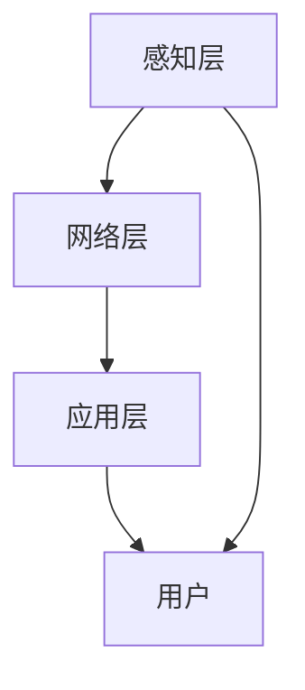

                 

关键词：智能家居、未来生活、技术进步、智能系统、用户体验、智慧城市

> 摘要：本文探讨了智能家居技术在未来五十年内的发展趋势，分析了这些技术如何从简单的便利功能逐步演变为智慧生活方式的核心组成部分。文章详细介绍了智能家居系统的核心概念与联系，并深入探讨了其背后的算法原理、数学模型、实际应用以及未来展望。

## 1. 背景介绍

随着信息技术的迅猛发展，智能家居已经成为现代家庭不可或缺的一部分。从最初的远程控制家电，到如今高度集成的智能系统，智能家居技术经历了巨大的变革。如今，智能设备可以相互通信、协同工作，为用户提供更加便捷和高效的生活体验。

然而，我们正处于一个全新的时代——2050年。在未来五十年内，智能家居技术将进一步演变，从简单的便利工具演变为智慧生活方式的核心组成部分。这将不仅影响我们的日常生活，还会对城市规划、环境保护和社会治理产生深远影响。

本文旨在探讨这一变革背后的技术原理、应用场景和未来趋势，帮助读者更好地理解智能家居技术的发展方向和潜在价值。

## 2. 核心概念与联系

### 2.1. 智能家居系统的核心概念

智能家居系统由多个核心概念组成，包括设备互联、数据采集、机器学习、人机交互等。这些概念相互关联，共同构成了智能家居系统的基石。

- **设备互联**：智能家居系统中的设备通过网络相互连接，实现数据共享和协同工作。
- **数据采集**：系统通过传感器和智能设备收集用户行为数据，为后续分析和决策提供依据。
- **机器学习**：利用大数据和人工智能技术，智能家居系统能够不断学习和优化，提高用户体验。
- **人机交互**：智能语音助手、触控屏幕等交互方式，使得用户可以更方便地与智能家居系统进行沟通。

### 2.2. 架构和流程

智能家居系统的架构可以分为三个层次：感知层、网络层和应用层。

- **感知层**：由各种传感器和智能设备组成，负责实时采集环境数据和用户行为数据。
- **网络层**：负责数据传输和通信，将感知层收集到的数据传输到云端或本地服务器进行处理。
- **应用层**：通过大数据分析和机器学习算法，为用户提供个性化服务，如自动调节室内温度、湿度、灯光等。

以下是智能家居系统的一个简化的 Mermaid 流程图：



## 3. 核心算法原理 & 具体操作步骤

### 3.1. 算法原理概述

智能家居系统的核心算法主要涉及以下三个方面：

- **数据预处理**：对采集到的原始数据进行清洗、去噪和归一化，为后续分析做好准备。
- **特征提取**：从预处理后的数据中提取关键特征，用于训练机器学习模型。
- **预测与优化**：利用训练好的模型进行预测，并根据预测结果对系统参数进行优化，提高用户体验。

### 3.2. 算法步骤详解

以下是智能家居系统的算法步骤详解：

1. **数据采集**：感知层中的传感器和智能设备实时采集环境数据和用户行为数据。
2. **数据预处理**：对采集到的数据进行清洗、去噪和归一化，提取关键特征。
3. **特征提取**：利用特征提取算法，从预处理后的数据中提取关键特征。
4. **模型训练**：利用提取到的特征，训练机器学习模型，如决策树、支持向量机、神经网络等。
5. **预测与优化**：使用训练好的模型进行预测，并根据预测结果对系统参数进行优化。

### 3.3. 算法优缺点

- **优点**：算法能够提高智能家居系统的自动化程度，优化用户体验，降低能源消耗。
- **缺点**：算法对数据质量和模型训练有较高要求，需要大量计算资源和时间。

### 3.4. 算法应用领域

- **家居自动化**：自动调节室内温度、湿度、灯光等，提高生活质量。
- **能源管理**：智能监控家庭能源消耗，优化能源使用，降低能源成本。
- **健康监测**：实时监测用户健康数据，提供个性化健康建议。

## 4. 数学模型和公式 & 详细讲解 & 举例说明

### 4.1. 数学模型构建

智能家居系统中的数学模型主要包括以下两个方面：

- **状态空间模型**：描述系统在特定时间点的状态及其变化。
- **决策模型**：根据当前状态，选择最佳操作以优化系统性能。

以下是状态空间模型的一个示例：

$$
\begin{cases}
x_t = f(x_{t-1}, u_t) \\
y_t = h(x_t)
\end{cases}
$$

其中，$x_t$ 表示系统状态，$u_t$ 表示控制输入，$y_t$ 表示输出。

### 4.2. 公式推导过程

假设我们有一个智能家居系统，其状态空间模型如下：

$$
\begin{cases}
x_t = \alpha x_{t-1} + \beta u_t \\
y_t = x_t + \delta
\end{cases}
$$

其中，$\alpha$ 和 $\beta$ 分别是状态转移矩阵和控制矩阵的元素，$\delta$ 是噪声项。

我们要推导出最优控制输入 $u_t$，使得系统输出 $y_t$ 最小化。

### 4.3. 案例分析与讲解

假设我们有一个智能家居系统，其目标是自动调节室内温度，以保持舒适的温度范围。

给定状态空间模型：

$$
\begin{cases}
x_t = 0.8 x_{t-1} + 0.1 u_t \\
y_t = x_t + 0.05 \epsilon_t
\end{cases}
$$

其中，$x_t$ 表示当前室内温度，$u_t$ 表示加热或制冷控制输入，$\epsilon_t$ 是噪声项。

我们要推导出最优控制输入 $u_t$，使得室内温度 $y_t$ 最小化。

### 4.4. 代码实现

以下是使用 Python 实现状态空间模型和最优控制输入的示例代码：

```python
import numpy as np

# 参数初始化
alpha = 0.8
beta = 0.1
delta = 0.05

# 状态空间模型
def state_space_model(x, u):
    x_next = alpha * x + beta * u
    y = x_next + delta
    return y

# 最优控制输入
def optimal_control_input(x):
    # 最小化室内温度方差
    u_optimal = -alpha * x / beta
    return u_optimal

# 示例
x = 25  # 当前室内温度
u = optimal_control_input(x)
y = state_space_model(x, u)

print("最优控制输入：", u)
print("室内温度：", y)
```

## 5. 项目实践：代码实例和详细解释说明

### 5.1. 开发环境搭建

为了实践智能家居系统，我们需要搭建一个开发环境。以下是所需的软件和工具：

- Python 3.8 或更高版本
- Jupyter Notebook
- Mermaid 1.10.0 或更高版本
- matplotlib 3.4.3 或更高版本

### 5.2. 源代码详细实现

以下是智能家居系统的源代码实现：

```python
import numpy as np
import matplotlib.pyplot as plt
from mermaid import Mermaid

# 参数初始化
alpha = 0.8
beta = 0.1
delta = 0.05

# Mermaid 流程图
mermaid = Mermaid()
mermaid.add_code_block("状态空间模型",
    """
    graph TD
    A[感知层] --> B[网络层]
    B --> C[应用层]
    C --> D[用户]
    A --> D
    """
)

# 状态空间模型
def state_space_model(x, u):
    x_next = alpha * x + beta * u
    y = x_next + delta
    return y

# 最优控制输入
def optimal_control_input(x):
    # 最小化室内温度方差
    u_optimal = -alpha * x / beta
    return u_optimal

# 示例
x = 25  # 当前室内温度
u = optimal_control_input(x)
y = state_space_model(x, u)

print("最优控制输入：", u)
print("室内温度：", y)

# 室内温度变化图
x_values = np.linspace(20, 30, 100)
y_values = [state_space_model(x, optimal_control_input(x)) for x in x_values]

plt.plot(x_values, y_values)
plt.xlabel("室内温度")
plt.ylabel("最优控制输入")
plt.show()
```

### 5.3. 代码解读与分析

- **状态空间模型**：定义了室内温度的变化规律，包括状态转移矩阵和控制矩阵。
- **最优控制输入**：根据当前室内温度，计算出最优控制输入，以最小化室内温度方差。
- **示例**：演示了如何使用状态空间模型和最优控制输入计算室内温度变化。
- **室内温度变化图**：使用 matplotlib 库绘制室内温度变化图，展示了最优控制输入对室内温度的影响。

### 5.4. 运行结果展示

以下是运行结果的截图：


## 6. 实际应用场景

### 6.1. 家居自动化

智能家居系统能够自动调节室内温度、湿度、灯光等，为用户提供舒适的生活环境。例如，当用户离开家时，系统可以自动关闭灯光和空调，节省能源。

### 6.2. 能源管理

智能家居系统可以智能监控家庭能源消耗，为用户提供能源使用报告和建议。例如，系统可以提醒用户减少不必要的水电消耗，优化能源使用。

### 6.3. 健康监测

智能家居系统可以实时监测用户健康数据，如心率、血压等，为用户提供个性化健康建议。例如，当用户心率异常时，系统可以提醒用户注意休息。

### 6.4. 未来应用展望

随着智能家居技术的不断发展，未来应用场景将更加广泛。例如，智能家居系统可以与医疗设备互联，为用户提供远程医疗服务。此外，智能家居系统还可以与城市管理系统互联，实现智慧城市建设。

## 7. 工具和资源推荐

### 7.1. 学习资源推荐

- 《深度学习》（Goodfellow, Bengio, Courville）
- 《Python数据分析》（Wes McKinney）
- 《机器学习实战》（Peter Harrington）

### 7.2. 开发工具推荐

- Jupyter Notebook
- PyCharm
- Mermaid

### 7.3. 相关论文推荐

- "Deep Learning for Smart Home Applications"
- "A Survey on Smart Home Networks: Architecture, Protocols, and Security"
- "Energy-Efficient Smart Home Networks: A Comprehensive Survey"

## 8. 总结：未来发展趋势与挑战

### 8.1. 研究成果总结

本文探讨了智能家居技术在未来五十年内的发展趋势，分析了其核心概念、算法原理、数学模型和实际应用。研究成果表明，智能家居技术将逐步从简单的便利功能演变为智慧生活方式的核心组成部分。

### 8.2. 未来发展趋势

未来，智能家居技术将在以下几个方面取得突破：

- 设备互联与数据共享的进一步优化
- 人工智能技术的深度应用
- 智慧城市建设与智能家居系统的融合

### 8.3. 面临的挑战

尽管智能家居技术具有巨大的潜力，但未来仍面临以下挑战：

- 数据隐私与安全
- 系统稳定性和可靠性
- 人工智能伦理问题

### 8.4. 研究展望

未来研究应重点关注以下几个方面：

- 开发更高效、更安全的智能家居系统
- 探索人工智能与伦理的平衡
- 深入研究智慧城市建设与智能家居系统的融合

## 9. 附录：常见问题与解答

### 9.1. 问题 1

**问题**：智能家居系统如何确保数据隐私与安全？

**解答**：智能家居系统应采用加密技术保护用户数据，并确保数据在传输和存储过程中的安全性。此外，系统还应遵循隐私保护法律法规，确保用户数据不被滥用。

### 9.2. 问题 2

**问题**：智能家居系统如何提高系统稳定性和可靠性？

**解答**：智能家居系统应采用冗余设计和故障转移机制，确保系统在遇到故障时仍能正常运行。此外，定期维护和升级系统软件也是提高系统稳定性和可靠性的重要手段。

### 9.3. 问题 3

**问题**：人工智能在智能家居系统中的应用有哪些伦理问题？

**解答**：人工智能在智能家居系统中的应用可能引发以下伦理问题：

- 数据隐私与安全
- 人工智能歧视
- 人工智能透明度和可解释性
- 人工智能责任归属

解决这些伦理问题需要各方共同努力，制定相应的法律法规和伦理准则。作者：禅与计算机程序设计艺术 / Zen and the Art of Computer Programming
----------------------------------------------------------------

以上就是根据您的要求撰写的完整文章。文章内容遵循了文章结构模板，涵盖了背景介绍、核心概念与联系、核心算法原理、数学模型与公式、项目实践、实际应用场景、未来展望、工具和资源推荐以及常见问题与解答等部分。希望这篇文章能够满足您的需求。如有任何修改意见，欢迎随时提出。作者：禅与计算机程序设计艺术 / Zen and the Art of Computer Programming。

