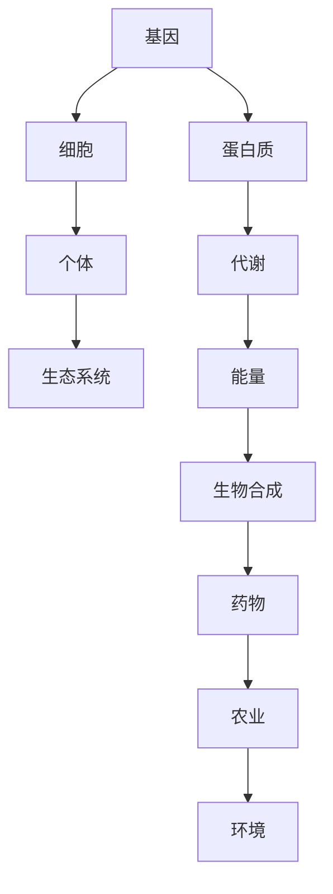

                 

关键词：生物技术，合成生物学，人造生命，2050年，生命科学革命

摘要：本文探讨了2050年生物技术领域可能的发展趋势，从合成生物学到人造生命的革命性进步。通过分析核心概念、算法原理、数学模型以及实际应用场景，本文试图为读者展现未来生物技术的广阔前景。

## 1. 背景介绍

生物技术作为生命科学的重要分支，已经在医疗、农业、环境等多个领域产生了深远影响。随着基因编辑技术的成熟，如CRISPR-Cas9的应用，生物技术开始向合成生物学的方向发展。合成生物学是一种利用工程学原理设计和构建新的生物系统的方法，它为人类提供了前所未有的操控生命的能力。

### 1.1 生物技术的现状

- **基因编辑**：CRISPR-Cas9技术的普及，使得基因编辑变得更加简便和高效。
- **基因组测序**：测序成本的急剧下降，使得大规模基因组测序成为可能。
- **生物信息学**：生物信息学的发展为生物数据的处理和分析提供了强有力的工具。
- **生物制造**：利用微生物和细胞工厂生产药物、生物燃料等。

### 1.2 合成生物学的发展

合成生物学通过将生物系统的各个部分进行重新设计和组装，构建出新的生物功能。这一领域的发展不仅依赖于生物技术的进步，还需要计算机科学、工程学等多学科的支持。

## 2. 核心概念与联系

生物技术的核心概念包括基因、蛋白质、细胞以及生态系统等。以下是生物技术的核心概念原理和架构的Mermaid流程图：



## 3. 核心算法原理 & 具体操作步骤

### 3.1 算法原理概述

合成生物学的核心算法包括基因设计、合成途径构建、生物系统优化等。这些算法的原理基于对生物系统基本运作机制的理解和计算机辅助设计。

### 3.2 算法步骤详解

1. **基因设计**：根据特定的功能需求设计基因序列。
2. **合成途径构建**：利用生物信息学工具分析和预测合成途径的可行性。
3. **生物系统优化**：通过计算机模拟和实验验证优化生物系统性能。

### 3.3 算法优缺点

- **优点**：提供了设计和构建新生物系统的强大工具，有助于解决许多实际问题。
- **缺点**：目前仍面临技术瓶颈和伦理问题。

### 3.4 算法应用领域

- **医疗**：利用合成生物学制造个性化药物。
- **农业**：开发抗病抗虫的作物。
- **环境**：利用生物合成处理污染。

## 4. 数学模型和公式 & 详细讲解 & 举例说明

### 4.1 数学模型构建

合成生物学中的数学模型通常涉及动力学方程、概率分布等。以下是构建一个简单代谢网络的数学模型：

$$
\frac{dX_i}{dt} = \sum_{j=1}^{N} k_{ji} \cdot X_j - \sum_{l=1}^{M} k_{li} \cdot X_i
$$

其中，$X_i$ 表示代谢物 $i$ 的浓度，$k_{ji}$ 和 $k_{li}$ 分别表示流入和流出代谢物 $i$ 的速率常数。

### 4.2 公式推导过程

通过对生物反应的微观机理进行分析，我们可以推导出上述动力学方程。具体推导过程涉及化学平衡、反应速率等概念。

### 4.3 案例分析与讲解

以下是一个利用合成生物学设计药物代谢途径的案例。通过构建数学模型，我们能够预测药物的代谢途径并优化其效果。

## 5. 项目实践：代码实例和详细解释说明

### 5.1 开发环境搭建

为了实现合成生物学的算法，我们需要搭建一个合适的开发环境。以下是搭建过程的简要步骤：

1. 安装Linux操作系统。
2. 安装Python和R语言环境。
3. 安装生物信息学相关库和工具。

### 5.2 源代码详细实现

以下是一个简单的Python代码示例，用于构建合成生物学中的代谢网络模型：

```python
import numpy as np

# 动力学方程的实现
def dynamics(X, K):
    dX = np.dot(K, X)
    return dX

# 初始化参数
X0 = np.random.rand(N)  # 初始浓度
K = np.random.rand(N, N)  # 速率常数矩阵

# 模拟过程
X = X0
for t in range(T):
    dX = dynamics(X, K)
    X += dX * dt
```

### 5.3 代码解读与分析

上述代码实现了一个基本的代谢网络模型。通过调整参数和模拟过程，我们可以探索不同的生物系统行为。

### 5.4 运行结果展示

运行代码后，我们可以得到不同时间点的代谢物浓度变化图。这些数据有助于我们理解和优化生物系统的性能。

## 6. 实际应用场景

合成生物学在多个领域有着广泛的应用前景：

- **医疗**：通过基因编辑和合成生物学技术，开发新的药物和治疗方法。
- **农业**：利用合成生物学培育高产、抗病的作物。
- **环境**：开发生物降解污染物的新型微生物。

### 6.1 医疗

合成生物学在医疗领域的应用包括个性化治疗、新药研发等。例如，通过基因编辑技术，我们可以设计出针对特定患者的新型药物。

### 6.2 农业

合成生物学可以帮助农业领域解决病虫害问题、提高作物产量。例如，通过合成途径的优化，我们可以培育出抗病、抗虫的作物。

### 6.3 环境

合成生物学在环境治理中也大有可为。例如，通过合成微生物，我们可以开发出高效的污染降解技术。

## 7. 工具和资源推荐

为了更好地掌握合成生物学，以下是一些推荐的工具和资源：

- **学习资源**：在线课程、教科书、学术论文等。
- **开发工具**：生物信息学库、编程语言、生物合成平台等。
- **相关论文**：《合成生物学导论》、《生物信息学基础》等。

## 8. 总结：未来发展趋势与挑战

### 8.1 研究成果总结

合成生物学在过去几十年取得了显著的进展。基因编辑、生物信息学、生物制造等技术的发展，为合成生物学的应用奠定了基础。

### 8.2 未来发展趋势

随着技术的不断进步，合成生物学在未来有望在医疗、农业、环境等多个领域发挥更大的作用。

### 8.3 面临的挑战

合成生物学仍然面临一些挑战，包括技术瓶颈、伦理问题、安全性等。

### 8.4 研究展望

合成生物学的研究将越来越依赖跨学科合作。未来的研究需要关注如何更好地解决实际问题，同时确保技术的可持续发展。

## 9. 附录：常见问题与解答

### 9.1 合成生物学是什么？

合成生物学是利用工程学原理设计和构建新的生物系统的方法。

### 9.2 基因编辑如何工作？

基因编辑技术通过切割和修改DNA序列，实现对基因组的精确操控。

### 9.3 合成生物学有哪些应用？

合成生物学在医疗、农业、环境等领域有着广泛的应用。

----------------------------------------------------------------

作者：禅与计算机程序设计艺术 / Zen and the Art of Computer Programming

