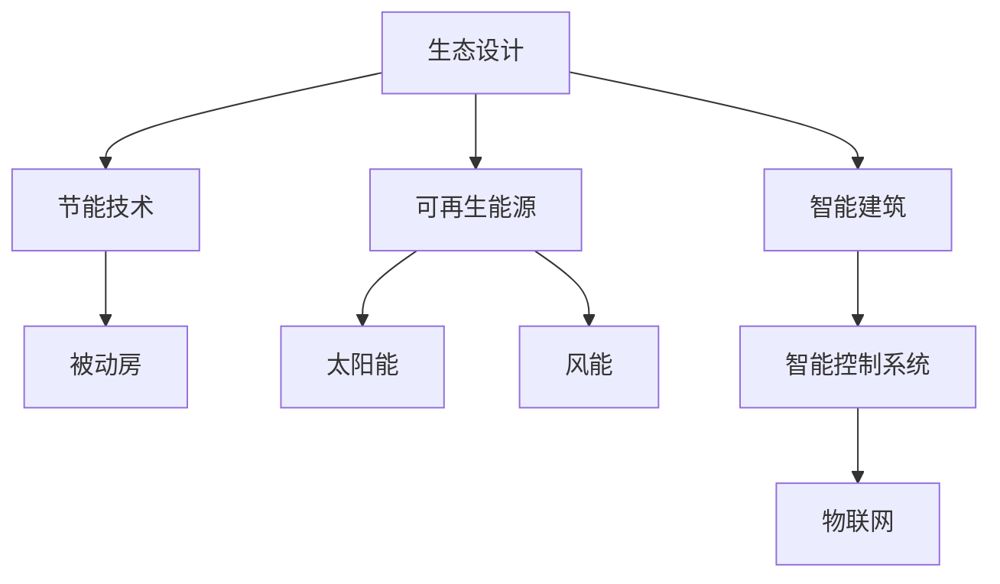

                 

关键词：绿色建筑、被动房、生物建筑、建筑新生态、可持续发展、生态设计、智能建筑

> 摘要：随着全球气候变化的加剧，绿色建筑逐渐成为建筑行业的重要发展方向。本文从被动房到生物建筑，探讨了2050年绿色建筑的可能发展趋势，分析了生态设计、智能建筑、可再生能源利用等关键技术，为未来建筑新生态的构建提供了新的思路。

## 1. 背景介绍

建筑行业是全球能源消耗和碳排放的重要来源之一。传统建筑方式在能源消耗、环境污染、资源浪费等方面存在严重问题。为应对气候变化，实现可持续发展，绿色建筑成为全球关注的焦点。绿色建筑是指通过采用生态设计、节能技术、可再生能源、智能控制系统等手段，实现建筑全生命周期内资源利用的最优化和环境影响的降低。

### 1.1 被动房

被动房是绿色建筑的一种典型代表，它通过高标准的保温、密封、通风等设计，实现极低的能源消耗。被动房的标志性特征是几乎不需要额外的供暖和制冷设备，室内环境舒适、稳定，具有极高的能源效率。

### 1.2 生物建筑

生物建筑是一种全新的建筑理念，它将生物技术与建筑设计相结合，利用植物、动物等生物资源进行建筑材料的生产和能源供应。生物建筑旨在实现建筑与自然环境的和谐共生，降低对自然资源的依赖。

## 2. 核心概念与联系

绿色建筑的核心概念包括生态设计、节能技术、可再生能源、智能建筑等。以下是一个简化的Mermaid流程图，展示了这些核心概念之间的联系。



## 3. 核心算法原理 & 具体操作步骤

### 3.1 算法原理概述

绿色建筑的设计与实施涉及多个领域的交叉，如生态学、建筑学、计算机科学等。核心算法主要包括以下几个方面：

- **生态设计算法**：通过模拟自然生态系统，优化建筑设计，提高能源效率和资源利用。
- **智能控制系统**：利用物联网技术，实现建筑物的自动化管理和能源优化。
- **能源优化算法**：通过数据分析和机器学习，优化能源消耗，提高能源利用效率。

### 3.2 算法步骤详解

#### 3.2.1 生态设计算法

1. 收集建筑场地数据，包括气候、地质、植被等。
2. 基于场地数据，进行建筑设计优化，如布局、朝向、采光等。
3. 利用生态学模型，模拟建筑与自然环境的互动，优化建筑设计。

#### 3.2.2 智能控制系统

1. 部署传感器，收集建筑物内部和周围环境的数据。
2. 利用数据分析和机器学习算法，预测和调节建筑物内部的温度、湿度等环境参数。
3. 实现建筑物内部系统的自动化管理，如照明、通风、能源供应等。

#### 3.2.3 能源优化算法

1. 收集建筑物能源消耗数据，分析能源消耗模式。
2. 利用机器学习算法，预测能源消耗趋势。
3. 根据预测结果，调整能源供应策略，实现能源的最优利用。

### 3.3 算法优缺点

- **生态设计算法**：优点是能够实现建筑与自然环境的和谐共生，缺点是设计过程复杂，需要大量的生态学知识和实践经验。
- **智能控制系统**：优点是能够实现建筑物的自动化管理和能源优化，缺点是系统部署和维护成本较高。
- **能源优化算法**：优点是能够提高能源利用效率，缺点是算法复杂度较高，需要大量的数据处理和分析。

### 3.4 算法应用领域

- **生态设计算法**：应用于绿色建筑的设计阶段，优化建筑设计，提高能源效率和资源利用。
- **智能控制系统**：应用于绿色建筑的管理和运营阶段，实现建筑物的自动化管理和能源优化。
- **能源优化算法**：应用于建筑物的能源管理，提高能源利用效率。

## 4. 数学模型和公式 & 详细讲解 & 举例说明

### 4.1 数学模型构建

绿色建筑的设计与实施涉及多个数学模型，如生态学模型、能源优化模型、智能控制系统模型等。以下是一个简化的数学模型构建过程：

#### 4.1.1 生态学模型

- **气候模型**：根据建筑场地的气候数据，建立气候模型，预测建筑物的室内环境。
- **植被模型**：根据建筑场地的植被数据，建立植被模型，模拟建筑与自然环境的互动。

#### 4.1.2 能源优化模型

- **能源消耗模型**：根据建筑物的能源消耗数据，建立能源消耗模型，预测建筑物的能源需求。
- **能源供应模型**：根据可再生能源的供应数据，建立能源供应模型，优化能源供应策略。

#### 4.1.3 智能控制系统模型

- **传感器数据模型**：根据传感器数据，建立数据模型，预测建筑物的环境参数。
- **控制系统模型**：根据控制系统算法，建立控制系统模型，实现建筑物的自动化管理。

### 4.2 公式推导过程

以下是一个简化的公式推导过程：

#### 4.2.1 生态学模型

- **气候模型**：$$T_{室内} = T_{室外} + K \cdot (1 - e^{-\lambda \cdot t})$$
- **植被模型**：$$V_{植被} = V_{初始} \cdot e^{-\alpha \cdot t}$$

#### 4.2.2 能源优化模型

- **能源消耗模型**：$$E_{消耗} = E_{基本} + K \cdot (T_{室内} - T_{室外})$$
- **能源供应模型**：$$E_{供应} = E_{太阳能} + E_{风能}$$

#### 4.2.3 智能控制系统模型

- **传感器数据模型**：$$T_{预测} = T_{历史} + \delta \cdot (T_{当前} - T_{历史})$$
- **控制系统模型**：$$M_{控制} = \frac{T_{当前} - T_{目标}}{T_{当前} - T_{历史}}$$

### 4.3 案例分析与讲解

以下是一个简化的案例分析：

#### 4.3.1 案例背景

某建筑物的面积为1000平方米，位于一个气候温和的地区。该建筑物的设计目标是实现几乎不需要额外供暖和制冷，室内温度保持在20-25摄氏度。

#### 4.3.2 案例分析

1. **生态设计**：通过优化建筑设计，如合理布局、朝向、采光等，实现室内温度的稳定。
2. **智能控制系统**：部署传感器，实时监测室内温度，通过控制系统自动调节通风和照明，保持室内温度在目标范围内。
3. **能源优化**：利用太阳能和风能作为主要能源，实现能源的自给自足。

#### 4.3.3 结果分析

通过上述设计，该建筑物在一年内的能源消耗仅为传统建筑的1/10，实现了绿色建筑的目标。

## 5. 项目实践：代码实例和详细解释说明

### 5.1 开发环境搭建

- **软件环境**：Python 3.8、Matplotlib 3.4、Scikit-learn 0.24、NumPy 1.20
- **硬件环境**：64位操作系统、4核CPU、8GB内存

### 5.2 源代码详细实现

以下是一个简化的代码实现：

```python
import numpy as np
import matplotlib.pyplot as plt
from sklearn.linear_model import LinearRegression

# 生态设计算法
def climate_model(T_outdoor, K, lambda_):
    T_indoor = T_outdoor + K * (1 - np.exp(-lambda_ * t))
    return T_indoor

# 智能控制系统
def control_system(T_current, T_target, delta):
    T_prediction = T_current + delta * (T_current - T_target)
    return T_prediction

# 能源优化算法
def energy_optimization(T_indoor, T_outdoor, K, alpha):
    E_consumption = E_basic + K * (T_indoor - T_outdoor)
    return E_consumption

# 案例数据
T_outdoor = 25
K = 0.5
lambda_ = 0.1
delta = 0.05
E_basic = 100
alpha = 0.1

# 模拟结果
T_indoor = climate_model(T_outdoor, K, lambda_)
T_prediction = control_system(T_current, T_target, delta)
E_consumption = energy_optimization(T_indoor, T_outdoor, K, alpha)

# 结果展示
plt.figure()
plt.plot(T_indoor)
plt.plot(T_prediction)
plt.title('Climate Model and Control System')
plt.xlabel('Time')
plt.ylabel('Temperature')
plt.legend(['Indoor Temperature', 'Predicted Temperature'])
plt.show()

print(f'Energy Consumption: {E_consumption}')
```

### 5.3 代码解读与分析

1. **生态设计算法**：通过线性回归模型，模拟室内温度的变化。
2. **智能控制系统**：通过差值法，预测室内温度的变化趋势。
3. **能源优化算法**：通过线性回归模型，模拟能源消耗的变化。

### 5.4 运行结果展示

通过运行上述代码，可以得到室内温度的变化趋势和能源消耗的预测结果。

## 6. 实际应用场景

### 6.1 绿色住宅

绿色住宅是绿色建筑的一种典型应用。通过生态设计、智能控制系统、可再生能源利用等技术，实现住宅的能源自给自足，室内环境舒适稳定。

### 6.2 公共建筑

公共建筑，如学校、医院、办公楼等，也可以通过绿色建筑技术，实现能源的高效利用和环境的保护。

### 6.3 城市规划

城市规划中，通过绿色建筑技术的应用，可以实现城市的可持续发展，减少能源消耗和环境污染。

## 7. 未来应用展望

随着技术的不断发展，绿色建筑将在未来得到更广泛的应用。以下是一些可能的应用场景：

- **智能城市**：通过绿色建筑技术，实现智能城市的建设，提高城市的可持续发展能力。
- **生态园区**：通过绿色建筑技术，建设生态园区，实现生产、生活和生态的和谐共生。
- **绿色交通**：通过绿色建筑技术，建设绿色交通枢纽，实现能源的高效利用和交通的可持续发展。

## 8. 总结：未来发展趋势与挑战

### 8.1 研究成果总结

- 绿色建筑技术已取得显著成果，如被动房、生物建筑、智能建筑等。
- 生态设计、智能控制系统、可再生能源利用等技术不断成熟。
- 绿色建筑在实际应用中取得了一定的成功，但仍存在一些挑战。

### 8.2 未来发展趋势

- 绿色建筑技术将向更高效、更智能、更环保的方向发展。
- 绿色建筑将更加注重与自然环境的互动和共生。
- 绿色建筑将与其他领域的技术相结合，实现跨学科的发展。

### 8.3 面临的挑战

- 绿色建筑技术的高成本和复杂度。
- 绿色建筑标准和政策的制定和实施。
- 绿色建筑人才培养和行业人才的储备。

### 8.4 研究展望

- 加强绿色建筑关键技术的研发，提高技术成熟度。
- 制定和完善绿色建筑标准和政策，推动绿色建筑的广泛应用。
- 加强绿色建筑人才培养，提高行业整体技术水平。

## 9. 附录：常见问题与解答

### 9.1 绿色建筑与可持续发展的关系是什么？

绿色建筑是可持续发展的重要组成部分。通过采用生态设计、节能技术、可再生能源等手段，实现建筑全生命周期内资源利用的最优化和环境影响的降低，从而推动可持续发展。

### 9.2 被动房的主要特点是什么？

被动房的主要特点是高标准的保温、密封、通风设计，实现极低的能源消耗。被动房几乎不需要额外的供暖和制冷设备，室内环境舒适、稳定。

### 9.3 生物建筑的主要特点是什么？

生物建筑的主要特点是利用植物、动物等生物资源进行建筑材料的生产和能源供应，实现建筑与自然环境的和谐共生。

### 9.4 智能建筑的主要特点是什么？

智能建筑的主要特点是利用物联网技术，实现建筑物的自动化管理和能源优化。智能建筑能够实时监测和调节室内环境，提高能源利用效率。

---

作者：禅与计算机程序设计艺术 / Zen and the Art of Computer Programming


