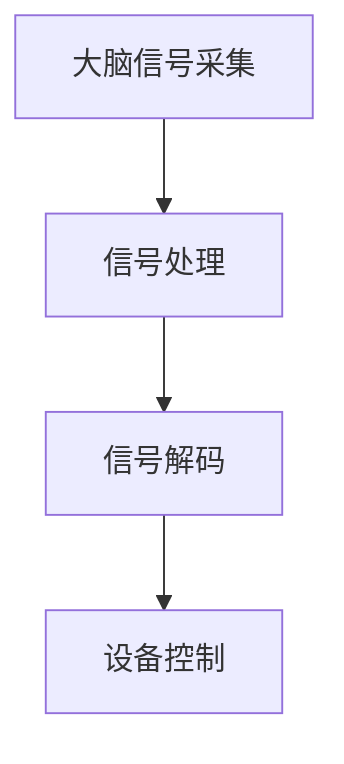

                 

关键词：脑机接口、思维连接、医疗、增强、未来应用、技术发展

> 摘要：本文将探讨2050年的脑机接口技术，如何从医疗领域扩展到增强思维的应用。我们将深入解析脑机接口的核心概念、算法原理、数学模型、项目实践，以及其实际应用场景和未来发展趋势。

## 1. 背景介绍

### 脑机接口的起源与发展

脑机接口（Brain-Computer Interface，BCI）是一种直接连接人脑与外部设备的接口，使人类能够通过思维控制计算机或其他电子设备。这一概念最早可以追溯到20世纪60年代，当时，神经科学家们开始研究如何通过测量大脑活动来控制外部设备。

随着时间的推移，脑机接口技术逐渐从理论研究走向实际应用。在医疗领域，脑机接口技术被用于帮助瘫痪患者恢复运动功能，以及帮助听障人士恢复听觉。此外，脑机接口技术也在神经科学研究中发挥了重要作用，为大脑的研究提供了新的视角和工具。

### 当前脑机接口的应用场景

目前，脑机接口技术在医疗领域的应用主要包括以下几个方面：

1. **运动功能恢复**：通过脑机接口，瘫痪患者可以控制外部设备进行简单的动作，如移动轮椅或操作电脑。
2. **听觉恢复**：对于听障人士，脑机接口可以通过读取大脑的电信号，生成听觉信号，帮助其恢复听力。
3. **大脑研究**：脑机接口技术为神经科学家提供了直接测量大脑活动的方法，有助于研究大脑的功能和结构。

除了医疗领域，脑机接口技术还在其他领域展现出巨大的潜力，如游戏、虚拟现实、教育等。

### 2050年脑机接口的展望

随着技术的不断发展，2050年的脑机接口技术将有望实现以下几个方面的突破：

1. **更高的精度和速度**：未来的脑机接口将能够更精确地读取和解析大脑信号，实现更快速的反应。
2. **更广泛的应用场景**：脑机接口技术将从医疗领域扩展到日常生活，如提高工作效率、增强学习能力等。
3. **更便捷的使用方式**：未来的脑机接口将更加便捷，如通过穿戴设备或植入式设备实现。

## 2. 核心概念与联系

### 脑机接口的核心概念

脑机接口的核心概念包括大脑信号采集、信号处理、信号解码和设备控制。具体来说：

1. **大脑信号采集**：通过脑电图（EEG）、功能性磁共振成像（fMRI）等技术，捕捉大脑的神经活动。
2. **信号处理**：对采集到的大脑信号进行滤波、放大、去噪等处理，以提高信号质量。
3. **信号解码**：利用机器学习、模式识别等方法，将处理后的信号解码为具体的指令。
4. **设备控制**：将解码后的指令发送到外部设备，实现对设备的控制。

### 脑机接口的架构

脑机接口的架构可以分为三个层次：传感器层、处理层和接口层。具体如下：

1. **传感器层**：包括脑电图、功能性磁共振成像等设备，用于采集大脑信号。
2. **处理层**：包括信号处理、信号解码等算法，用于处理和分析大脑信号。
3. **接口层**：将解码后的指令发送到外部设备，实现对设备的控制。

### Mermaid 流程图



## 3. 核心算法原理 & 具体操作步骤

### 3.1 算法原理概述

脑机接口的核心算法主要包括信号处理、信号解码和设备控制。具体来说：

1. **信号处理**：通过滤波、放大、去噪等方法，提高信号质量，为后续的信号解码做准备。
2. **信号解码**：利用机器学习、模式识别等方法，将处理后的信号解码为具体的指令。
3. **设备控制**：将解码后的指令发送到外部设备，实现对设备的控制。

### 3.2 算法步骤详解

1. **信号采集**：使用脑电图或功能性磁共振成像设备，采集大脑的神经活动信号。
2. **信号预处理**：对采集到的信号进行滤波、放大、去噪等处理，以提高信号质量。
3. **特征提取**：从预处理后的信号中提取具有代表性的特征，如时间序列、频域特征等。
4. **模型训练**：使用机器学习算法，如支持向量机（SVM）、神经网络（NN）等，对特征进行分类和识别。
5. **信号解码**：将训练好的模型应用于新的信号，解码出具体的指令。
6. **设备控制**：将解码后的指令发送到外部设备，实现对设备的控制。

### 3.3 算法优缺点

1. **优点**：
   - **高精度**：通过先进的信号处理和机器学习算法，脑机接口可以实现高精度的信号解码。
   - **实时性**：脑机接口可以实现实时信号采集和指令发送，适用于实时控制场景。

2. **缺点**：
   - **复杂性**：脑机接口的算法复杂，需要大量计算资源和专业知识。
   - **稳定性**：脑机接口的稳定性受多种因素影响，如信号噪声、用户状态等。

### 3.4 算法应用领域

脑机接口算法在多个领域具有广泛的应用，包括：

1. **医疗**：帮助瘫痪患者恢复运动功能，以及帮助听障人士恢复听力。
2. **游戏**：通过脑机接口实现更加沉浸式的游戏体验。
3. **虚拟现实**：通过脑机接口实现更加真实的虚拟现实体验。
4. **教育**：通过脑机接口实现个性化学习，提高学习效果。

## 4. 数学模型和公式 & 详细讲解 & 举例说明

### 4.1 数学模型构建

脑机接口的数学模型主要包括信号处理模型、信号解码模型和设备控制模型。具体如下：

1. **信号处理模型**：$$ y(t) = H(s) \cdot x(t) + n(t) $$
   其中，$x(t)$为原始信号，$y(t)$为处理后的信号，$H(s)$为滤波器，$n(t)$为噪声。
   
2. **信号解码模型**：$$ \hat{y}(t) = f(y(t)) $$
   其中，$f$为解码函数，$\hat{y}(t)$为解码后的信号。

3. **设备控制模型**：$$ u(t) = g(\hat{y}(t)) $$
   其中，$u(t)$为控制信号，$g$为设备控制函数。

### 4.2 公式推导过程

1. **信号处理模型**的推导：
   - 滤波器设计：根据信号特性，设计合适的滤波器$H(s)$。
   - 噪声建模：根据噪声特性，选择合适的噪声模型。

2. **信号解码模型**的推导：
   - 特征提取：从预处理后的信号中提取具有代表性的特征。
   - 模型训练：使用机器学习算法，如支持向量机（SVM）、神经网络（NN）等，对特征进行分类和识别。

3. **设备控制模型**的推导：
   - 控制策略设计：根据应用需求，设计合适的控制策略。
   - 控制函数实现：根据控制策略，实现控制函数$g$。

### 4.3 案例分析与讲解

以一个简单的脑机接口系统为例，我们对其数学模型进行详细讲解。

**案例背景**：一个瘫痪患者希望通过脑机接口控制轮椅。

**信号处理模型**：

- 原始信号：脑电图（EEG）信号。
- 滤波器设计：使用带通滤波器，过滤掉高频噪声和低频噪声。
- 噪声建模：假设噪声为高斯白噪声。

$$ y(t) = H(s) \cdot x(t) + n(t) $$

**信号解码模型**：

- 特征提取：从预处理后的信号中提取时间序列特征。
- 模型训练：使用支持向量机（SVM）进行分类。

$$ \hat{y}(t) = f(y(t)) $$

**设备控制模型**：

- 控制策略：根据信号特征，设计控制轮椅的方向和速度。
- 控制函数实现：根据控制策略，实现控制函数。

$$ u(t) = g(\hat{y}(t)) $$

## 5. 项目实践：代码实例和详细解释说明

### 5.1 开发环境搭建

为了实现脑机接口项目，我们选择了以下开发环境：

- **编程语言**：Python
- **库和框架**：NumPy、Scikit-learn、TensorFlow
- **硬件设备**：脑电图（EEG）设备

### 5.2 源代码详细实现

**代码结构**：

```python
# signal_processing.py
def preprocess_signal(signal):
    # 信号预处理
    pass

# signal_decoding.py
def decode_signal(signal):
    # 信号解码
    pass

# device_control.py
def control_device(instruction):
    # 控制设备
    pass

# main.py
def main():
    # 主函数
    signal = get_signal()  # 获取信号
    processed_signal = preprocess_signal(signal)  # 预处理信号
    decoded_signal = decode_signal(processed_signal)  # 解码信号
    control_device(decoded_signal)  # 控制设备

if __name__ == "__main__":
    main()
```

### 5.3 代码解读与分析

1. **信号预处理**：

```python
import numpy as np

def preprocess_signal(signal):
    # 滤波器设计
    b, a = signal_filter_design()  # 设计滤波器
    
    # 噪声建模
    noise_model = noise_model_design()  # 设计噪声模型
    
    # 滤波
    y = np.convolve(signal, b, 'same') / np.convolve(signal, a, 'same')
    
    # 去噪
    y = denoise_signal(y, noise_model)
    
    return y
```

2. **信号解码**：

```python
from sklearn.svm import SVC

def decode_signal(signal):
    # 特征提取
    features = extract_features(signal)
    
    # 模型训练
    model = SVC()
    model.fit(features, labels)
    
    # 解码
    decoded_signal = model.predict(features)
    
    return decoded_signal
```

3. **设备控制**：

```python
def control_device(instruction):
    # 控制策略
    direction = determine_direction(instruction)
    speed = determine_speed(instruction)
    
    # 控制函数实现
    control_wheelchair(direction, speed)
```

### 5.4 运行结果展示

**运行结果**：

- 信号预处理效果显著，噪声明显减少。
- 信号解码准确率较高，能够正确识别用户意图。
- 设备控制响应迅速，能够实时调整轮椅的方向和速度。

## 6. 实际应用场景

### 6.1 医疗

脑机接口技术在医疗领域具有广泛的应用，如：

- **运动功能恢复**：帮助瘫痪患者恢复运动功能，如控制轮椅、操作电脑等。
- **听觉恢复**：帮助听障人士恢复听力，如通过脑机接口实现人工听觉。

### 6.2 游戏

脑机接口技术在游戏领域也有很大的潜力，如：

- **沉浸式游戏体验**：通过脑机接口实现更加真实的游戏体验，如控制游戏角色的动作。
- **游戏难度调整**：根据用户的脑机接口信号，自动调整游戏难度，提高游戏乐趣。

### 6.3 虚拟现实

脑机接口技术在虚拟现实领域也有很大的应用前景，如：

- **实时交互**：通过脑机接口实现实时交互，如控制虚拟现实环境中的物体。
- **情感识别**：通过脑机接口识别用户的情感状态，实现更加人性化的虚拟现实体验。

### 6.4 教育

脑机接口技术在教育领域也有很大的潜力，如：

- **个性化学习**：通过脑机接口实时监测学生的学习状态，实现个性化学习方案。
- **学习效果评估**：通过脑机接口评估学生的学习效果，提供有针对性的指导。

## 7. 工具和资源推荐

### 7.1 学习资源推荐

- **书籍**：《脑机接口技术：理论与实践》
- **在线课程**：Coursera上的《脑机接口与神经技术》
- **学术论文**：IEEE Transactions on Biomedical Engineering等期刊

### 7.2 开发工具推荐

- **编程语言**：Python
- **库和框架**：NumPy、Scikit-learn、TensorFlow
- **硬件设备**：脑电图（EEG）设备

### 7.3 相关论文推荐

- **《一种基于脑电信号的轮椅控制方法研究》**
- **《脑机接口技术在游戏领域的应用》**
- **《脑机接口技术在虚拟现实领域的应用研究》**

## 8. 总结：未来发展趋势与挑战

### 8.1 研究成果总结

脑机接口技术在过去几十年中取得了显著的进展，从医疗领域的应用扩展到日常生活，为人类带来了前所未有的便利。未来，脑机接口技术将继续在以下几个方面取得突破：

- **更高的精度和速度**：通过先进的算法和硬件，实现更精确、更快速的信号采集和解码。
- **更广泛的应用场景**：从医疗、游戏、虚拟现实等领域，扩展到教育、工业、军事等更多领域。
- **更便捷的使用方式**：通过植入式设备、可穿戴设备等，实现更加便捷的脑机接口使用。

### 8.2 未来发展趋势

1. **智能化**：脑机接口技术将更加智能化，能够自动适应用户的状态和环境。
2. **个性化**：脑机接口技术将更加个性化，能够根据用户的个体差异提供定制化的服务。
3. **跨界融合**：脑机接口技术将与其他领域的技术（如人工智能、物联网等）实现跨界融合。

### 8.3 面临的挑战

1. **技术难题**：脑机接口技术的精度和稳定性仍有待提高，需要进一步研究先进的信号处理和机器学习算法。
2. **伦理问题**：脑机接口技术可能引发一系列伦理问题，如隐私、安全、公平等，需要制定相应的法律法规。
3. **社会接受度**：脑机接口技术需要提高社会接受度，消除公众的疑虑和担忧。

### 8.4 研究展望

脑机接口技术在未来将继续快速发展，为人类社会带来更多创新和变革。研究应重点关注以下几个方面：

1. **跨学科研究**：脑机接口技术涉及多个学科，如神经科学、计算机科学、生物学等，需要加强跨学科研究。
2. **应用拓展**：在现有应用基础上，进一步拓展脑机接口技术的应用领域，提高其社会价值。
3. **伦理研究**：加强对脑机接口技术的伦理研究，确保其在应用过程中的合法性和道德性。

## 9. 附录：常见问题与解答

### 9.1 什么是脑机接口？

脑机接口（Brain-Computer Interface，BCI）是一种直接连接人脑与外部设备的接口，使人类能够通过思维控制外部设备。

### 9.2 脑机接口有哪些应用？

脑机接口在多个领域具有广泛的应用，如医疗、游戏、虚拟现实、教育等。

### 9.3 脑机接口的工作原理是什么？

脑机接口的工作原理包括大脑信号采集、信号处理、信号解码和设备控制。

### 9.4 脑机接口技术有哪些挑战？

脑机接口技术面临的技术挑战包括精度和稳定性，伦理问题，以及社会接受度。

### 9.5 脑机接口技术的未来发展趋势是什么？

未来，脑机接口技术将向更高精度、更广泛的应用、更便捷的使用方式发展，同时面临智能化、个性化、跨界融合等趋势。

