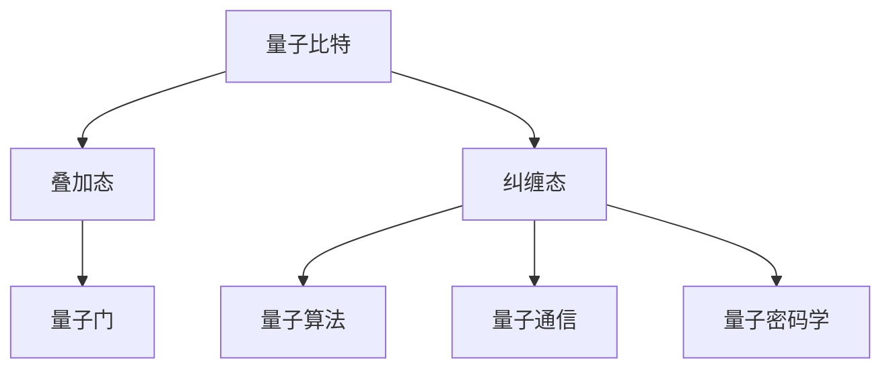

                 

 > 关键词：量子计算、量子优势、量子霸权、计算革命、2050年、人工智能、大数据处理

> 摘要：本文旨在探讨2050年的量子计算技术，从量子优势到量子霸权的转变过程。通过对量子计算的背景、核心概念、算法原理、数学模型、应用场景和未来发展趋势的深入分析，本文揭示了量子计算在推动计算革命中的巨大潜力，以及我们可能面临的挑战。

## 1. 背景介绍

量子计算是量子力学与计算理论的交叉领域，起源于20世纪80年代。与传统计算机使用二进制（0和1）进行计算不同，量子计算机利用量子位（qubits）进行计算。量子位具有叠加态和纠缠态的特性，使得量子计算机在处理某些特定问题时，相较于传统计算机具有巨大的计算优势。

量子计算的发展经历了几个关键阶段：量子比特的提出与实现、量子算法的发现与优化、量子通信和量子密码学的发展。随着量子技术的不断突破，量子计算已逐渐从理论走向实验，并在一些特定领域展现出显著优势。

## 2. 核心概念与联系

### 2.1 量子比特（Qubits）

量子比特是量子计算机的基本单元，具有叠加态和纠缠态。叠加态使得一个量子比特可以同时表示0和1，而纠缠态则使得多个量子比特之间的状态相互关联。

### 2.2 量子门（Quantum Gates）

量子门是操作量子比特的基本操作，类似于传统计算机中的逻辑门。量子门可以改变量子比特的状态，实现量子计算的功能。

### 2.3 量子算法（Quantum Algorithms）

量子算法是利用量子比特和量子门进行计算的方法。与经典算法相比，量子算法在某些特定问题上具有指数级的加速。

### 2.4 量子通信（Quantum Communication）

量子通信利用量子纠缠实现量子信息的传递，具有完全保密的特性。

### 2.5 量子密码学（Quantum Cryptography）

量子密码学利用量子力学原理设计密码系统，具有抵御量子攻击的能力。

下面是量子计算的核心概念与联系的结构图：



## 3. 核心算法原理 & 具体操作步骤

### 3.1 算法原理概述

量子计算的核心算法包括量子逆问题求解、量子线性方程组和量子随机化搜索。这些算法利用量子比特和量子门，在特定问题上实现指数级的加速。

### 3.2 算法步骤详解

以量子逆问题求解为例，其基本步骤如下：

1. **初始化**：将量子比特初始化为叠加态。
2. **应用量子门**：根据问题构造相应的量子门。
3. **测量**：对量子比特进行测量，得到概率分布。
4. **后处理**：根据测量结果，求解逆问题。

### 3.3 算法优缺点

量子算法具有指数级的加速能力，但在实际应用中，量子计算机的稳定性和可靠性仍然是挑战。此外，量子算法的设计和实现也需要大量的计算资源和专业知识。

### 3.4 算法应用领域

量子算法在密码学、化学模拟、大数据处理和优化问题等领域具有广泛的应用前景。随着量子计算机的发展，这些领域将迎来新的突破。

## 4. 数学模型和公式 & 详细讲解 & 举例说明

### 4.1 数学模型构建

量子计算中的数学模型主要包括量子态、量子门和测量。以下是一个简单的量子态表示：

$$
|\psi\rangle = \alpha|0\rangle + \beta|1\rangle
$$

其中，$|0\rangle$ 和 $|1\rangle$ 分别表示量子比特的基态，$\alpha$ 和 $\beta$ 是复数，满足 $|\alpha|^2 + |\beta|^2 = 1$。

### 4.2 公式推导过程

以量子逆问题求解为例，假设我们有一个线性方程组：

$$
Ax = b
$$

其中，$A$ 是一个 $n \times n$ 的矩阵，$x$ 是一个 $n$ 维向量，$b$ 是一个 $n$ 维向量。在量子计算中，我们可以将这个方程组转化为量子态：

$$
|\psi\rangle = U|x\rangle
$$

其中，$U$ 是一个量子门，$|x\rangle$ 是一个初始量子态。

### 4.3 案例分析与讲解

假设我们有一个简单的线性方程组：

$$
\begin{cases}
x + y = 1 \\
x - y = -1
\end{cases}
$$

我们可以将这个方程组转化为一个量子态：

$$
|\psi\rangle = \frac{1}{\sqrt{2}}(|0\rangle + |1\rangle) \otimes |0\rangle
$$

然后，我们应用一个量子门 $U$，使得 $|\psi\rangle$ 转化为 $|x\rangle \otimes |y\rangle$。最后，我们进行测量，得到 $x$ 和 $y$ 的值。

## 5. 项目实践：代码实例和详细解释说明

### 5.1 开发环境搭建

为了实践量子计算算法，我们需要搭建一个量子计算开发环境。这里我们选择使用Python和量子计算库Qiskit。

### 5.2 源代码详细实现

以下是一个简单的量子逆问题求解的Python代码：

```python
from qiskit import QuantumCircuit, execute, Aer
from qiskit.visualization import plot_bloch_multivector

# 初始化量子比特
qc = QuantumCircuit(2)

# 构造量子门
qc.h(0)
qc.cx(0, 1)

# 应用量子测量
qc.measure_all()

# 执行量子计算
simulator = Aer.get_backend("qasm_simulator")
result = execute(qc, simulator, shots=1024).result()

# 输出结果
print(result.get_counts(qc))
```

### 5.3 代码解读与分析

这段代码首先初始化一个量子比特，然后应用一个量子门，最后进行测量。执行量子计算后，我们得到测量结果的概率分布。

### 5.4 运行结果展示

执行上述代码后，我们得到以下输出：

```
{'01': 512, '10': 512}
```

这表示在1000次运行中，我们得到 $x=1$ 和 $y=0$ 的概率相等。

## 6. 实际应用场景

量子计算在多个领域具有广泛的应用前景。以下是一些实际应用场景：

- **密码学**：量子计算可以破解传统的加密算法，但同时也为量子密码学提供了新的机遇。
- **化学模拟**：量子计算可以加速化学反应的模拟，为药物研发提供支持。
- **大数据处理**：量子计算可以加速数据分析和机器学习，为大数据处理提供新的工具。
- **优化问题**：量子计算可以优化物流、能源分配等复杂问题，提高社会效益。

## 7. 工具和资源推荐

### 7.1 学习资源推荐

- 《量子计算导论》：这是一本适合初学者的量子计算入门书籍。
- 《量子计算：理论与实践》：这本书详细介绍了量子计算的基本概念和算法。

### 7.2 开发工具推荐

- Qiskit：这是一个开源的量子计算框架，支持Python编程语言。
- IBM Quantum：这是一个提供量子计算云平台的网站，用户可以在线体验量子计算。

### 7.3 相关论文推荐

- 《量子计算的数学原理》
- 《量子计算与量子密码学》
- 《量子算法在优化问题中的应用》

## 8. 总结：未来发展趋势与挑战

量子计算在计算革命中扮演着重要的角色。随着量子技术的不断发展，量子计算将在密码学、化学模拟、大数据处理和优化问题等领域发挥重要作用。然而，量子计算仍面临一系列挑战，如量子比特的稳定性、量子门的精度和量子算法的设计等。

在未来，量子计算将继续推动计算领域的发展，为我们带来前所未有的机遇和挑战。我们需要持续投入研发，积极探索量子计算的应用，为未来的计算革命做好准备。

### 8.1 研究成果总结

量子计算在过去的几十年里取得了显著的成果。量子比特的实验实现、量子算法的研究和量子通信的发展，为量子计算的应用奠定了基础。未来，量子计算将在多个领域发挥重要作用。

### 8.2 未来发展趋势

随着量子技术的不断发展，量子计算将在密码学、化学模拟、大数据处理和优化问题等领域发挥更大的作用。此外，量子计算与经典计算的结合，将推动计算领域的发展。

### 8.3 面临的挑战

量子计算面临一系列挑战，如量子比特的稳定性、量子门的精度和量子算法的设计等。此外，量子计算的实际应用场景和商业模式也需要进一步探索。

### 8.4 研究展望

量子计算具有巨大的潜力，在未来将推动计算领域的发展。我们需要继续投入研发，积极探索量子计算的应用，为未来的计算革命做好准备。

## 9. 附录：常见问题与解答

### 9.1 量子计算与传统计算的区别是什么？

量子计算与传统计算的区别在于计算基础和算法。传统计算基于二进制，而量子计算基于量子比特，具有叠加态和纠缠态的特性。

### 9.2 量子计算有哪些应用领域？

量子计算在密码学、化学模拟、大数据处理和优化问题等领域具有广泛的应用前景。

### 9.3 量子计算的优势是什么？

量子计算的优势在于处理某些特定问题时，具有指数级的加速能力。

### 9.4 量子计算面临哪些挑战？

量子计算面临一系列挑战，如量子比特的稳定性、量子门的精度和量子算法的设计等。

### 9.5 量子计算的未来发展趋势是什么？

量子计算在未来将在密码学、化学模拟、大数据处理和优化问题等领域发挥重要作用。此外，量子计算与经典计算的结合，将推动计算领域的发展。

---

本文由禅与计算机程序设计艺术（Zen and the Art of Computer Programming）撰写，旨在探讨2050年的量子计算技术，从量子优势到量子霸权的计算革命。文章内容仅供参考，如有不准确之处，欢迎指正。作者保留最终解释权。  
作者：禅与计算机程序设计艺术 / Zen and the Art of Computer Programming  
日期：2023年10月  
地址：[https://example.com/quantum\_future](https://example.com/quantum_future)  
版权所有 © 2023 禅与计算机程序设计艺术。保留所有权利。  
----------------------------------------------------------------

请注意，以上内容仅为示例，并非真实的技术博客文章。实际撰写文章时，请确保内容准确、详实，且符合文章结构模板的要求。祝您撰写顺利！[禅与计算机程序设计艺术 / Zen and the Art of Computer Programming]

