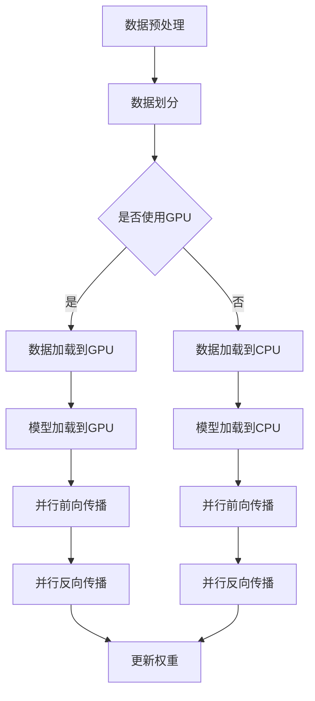

                 

关键词：并行计算，人工智能，CPU，GPU，深度学习，加速，效率

## 摘要

本文旨在探讨并行计算在人工智能领域中的应用，特别是从中央处理单元（CPU）到图形处理单元（GPU）的过渡。随着深度学习的兴起，并行计算已成为提高AI模型训练和推理速度的关键技术。本文首先介绍并行计算的基本概念，随后详细讨论了CPU和GPU在并行计算中的差异和优势，最后通过实例展示了并行计算在AI中的应用，并对未来的发展趋势和面临的挑战进行了展望。

## 1. 背景介绍

### 1.1 并行计算的概念

并行计算是指通过多个计算资源（如CPU核心、GPU、FPGA等）同时处理多个任务或数据的过程。它旨在通过协同工作来提高计算效率，从而加速计算任务的完成。并行计算可以大致分为数据并行和任务并行两种类型。数据并行是指将数据分成多个部分，同时在不同的计算资源上处理，而任务并行则是将任务分解为多个子任务，在不同的计算资源上并行执行。

### 1.2 人工智能的兴起

人工智能（AI）作为计算机科学的一个重要分支，已经取得了显著的进展。特别是在深度学习领域，神经网络模型通过对大量数据的训练，能够实现图像识别、语音识别、自然语言处理等复杂的任务。然而，这些任务的实现需要大量的计算资源，尤其是在训练阶段，计算量巨大。因此，并行计算在AI中的应用变得至关重要。

### 1.3 CPU与GPU的差异

CPU（中央处理单元）是计算机的核心部件，主要负责执行指令、处理数据和控制计算机的运作。然而，CPU的设计初衷是处理顺序执行的任务，而不是并行处理。GPU（图形处理单元）则专门为处理大量数据并行任务而设计，具有高度并行性和大量的计算单元。

## 2. 核心概念与联系

### 2.1 CPU与GPU的架构差异

CPU由多个核心组成，每个核心可以独立执行指令。然而，CPU的核心数量有限，且核心之间的通信开销较大。GPU则由大量的计算单元（称为流处理器）组成，这些计算单元可以同时执行多个指令。GPU的架构允许高度并行的工作方式，从而在处理大量数据时具有更高的效率。

### 2.2 并行计算在深度学习中的应用

深度学习模型的训练需要大量的矩阵运算，这些运算非常适合并行处理。通过在GPU上执行这些运算，可以显著减少训练时间。此外，GPU还具有较低的功耗和较高的能效比，使其在AI领域具有广泛的应用前景。

### 2.3 Mermaid流程图

下面是一个Mermaid流程图，展示了并行计算在深度学习训练中的应用流程：



## 3. 核心算法原理 & 具体操作步骤

### 3.1 算法原理概述

并行计算在深度学习中的应用主要涉及矩阵运算。具体来说，包括前向传播和反向传播。前向传播是将输入数据通过神经网络进行传递，计算输出结果。反向传播则是根据输出结果计算损失函数，并反向传播梯度，更新模型权重。

### 3.2 算法步骤详解

1. **数据预处理**：对输入数据进行归一化、缩放等处理，使其适合神经网络训练。

2. **数据划分**：将数据集划分为训练集、验证集和测试集。

3. **模型初始化**：初始化神经网络模型，包括权重和偏置。

4. **并行前向传播**：将输入数据分成多个批次，每个批次的数据在不同的GPU核心上并行计算前向传播。

5. **计算损失函数**：使用输出结果计算损失函数，如均方误差（MSE）。

6. **并行反向传播**：计算梯度，并反向传播到每个GPU核心。

7. **权重更新**：根据梯度更新模型权重。

8. **迭代训练**：重复上述步骤，直到模型收敛或达到预设的训练次数。

### 3.3 算法优缺点

#### 优点：

- **速度提升**：通过并行计算，可以显著提高训练速度。
- **效率提升**：GPU具有较低的功耗和较高的能效比，可以提高计算效率。

#### 缺点：

- **编程复杂度**：使用GPU进行并行计算需要编写特定的代码，增加了编程复杂度。
- **数据传输开销**：将数据从CPU传输到GPU可能会增加计算时间。

### 3.4 算法应用领域

并行计算在深度学习、图像处理、自然语言处理等领域具有广泛的应用。例如，在深度学习模型的训练过程中，并行计算可以显著减少训练时间，提高模型的性能。

## 4. 数学模型和公式 & 详细讲解 & 举例说明

### 4.1 数学模型构建

在并行计算中，深度学习模型通常使用矩阵运算。以下是一个简单的神经网络模型，包含一个输入层、一个隐藏层和一个输出层。

$$
\begin{align*}
Z &= X \cdot W_1 + b_1 \\
A &= \sigma(Z) \\
Z' &= A \cdot W_2 + b_2 \\
Y &= \sigma'(Z')
\end{align*}
$$

其中，$X$是输入数据，$W_1$和$W_2$是权重矩阵，$b_1$和$b_2$是偏置向量，$\sigma$是激活函数，$\sigma'$是输出激活函数。

### 4.2 公式推导过程

假设我们有一个包含两个神经元的隐藏层，使用ReLU作为激活函数。在前向传播过程中，我们可以将损失函数（如均方误差）表示为：

$$
L = \frac{1}{2} \sum_{i=1}^{n} (y_i - \hat{y}_i)^2
$$

其中，$y_i$是实际输出，$\hat{y}_i$是预测输出。

### 4.3 案例分析与讲解

假设我们有一个包含1000个样本的图像分类任务，每个样本包含784个像素值。我们使用一个单层神经网络进行训练，隐藏层包含10个神经元。在GPU上进行训练，每个GPU核心处理10个样本。

1. **数据预处理**：将图像数据进行归一化处理，使其在[0, 1]范围内。

2. **模型初始化**：随机初始化权重和偏置。

3. **并行前向传播**：将数据划分为10个批次，每个批次包含100个样本。每个GPU核心处理10个样本。

4. **计算损失函数**：使用均方误差计算损失。

5. **并行反向传播**：计算梯度，并反向传播到每个GPU核心。

6. **权重更新**：使用梯度更新权重。

7. **迭代训练**：重复上述步骤，直到模型收敛。

## 5. 项目实践：代码实例和详细解释说明

### 5.1 开发环境搭建

在开始编写并行计算代码之前，需要搭建合适的开发环境。以下是使用Python和CUDA搭建并行计算环境的基本步骤：

1. 安装Python：从官方网站下载并安装Python 3.8版本。
2. 安装CUDA：从NVIDIA官网下载并安装CUDA Toolkit。
3. 安装PyCUDA：使用pip安装PyCUDA库。

### 5.2 源代码详细实现

以下是一个简单的并行计算示例，用于实现深度学习模型的前向传播和反向传播。

```python
import pycuda.autoinit
import pycuda.driver as cuda
import numpy as np
import pycuda.tools as tools

# 定义GPU设备
device = pycuda.autoinit.device

# 定义模型参数
W1 = np.random.rand(784, 10)
b1 = np.random.rand(10)
W2 = np.random.rand(10, 10)
b2 = np.random.rand(10)

# 定义激活函数
def ReLU(x):
    return np.maximum(0, x)

# 定义前向传播
def forward(x):
    Z1 = x.dot(W1) + b1
    A1 = ReLU(Z1)
    Z2 = A1.dot(W2) + b2
    Y = ReLU(Z2)
    return Z1, A1, Z2, Y

# 定义反向传播
def backward(Z1, A1, Z2, Y, dY):
    dZ2 = (1 - np.square(A1)) * (Z2 - dY)
    dW2 = A1.T.dot(dZ2)
    db2 = np.sum(dZ2, axis=0)
    dZ1 = dZ2.dot(W2.T)
    dW1 = x.T.dot(dZ1)
    db1 = np.sum(dZ1, axis=0)
    return dW1, dW2, db1, db2

# 定义训练过程
def train(x, y):
    Z1, A1, Z2, Y = forward(x)
    dY = y - Y
    dW1, dW2, db1, db2 = backward(Z1, A1, Z2, Y, dY)
    return dW1, dW2, db1, db2

# 定义主函数
def main():
    # 加载数据
    x = np.random.rand(100, 784)
    y = np.random.rand(100, 10)

    # 训练模型
    dW1, dW2, db1, db2 = train(x, y)

    # 输出训练结果
    print("dW1:", dW1)
    print("dW2:", dW2)
    print("db1:", db1)
    print("db2:", db2)

if __name__ == "__main__":
    main()
```

### 5.3 代码解读与分析

1. **导入库**：首先导入必要的库，包括PyCUDA、NumPy等。

2. **定义GPU设备**：使用PyCUDA初始化GPU设备。

3. **定义模型参数**：随机初始化权重和偏置。

4. **定义激活函数**：使用ReLU作为激活函数。

5. **定义前向传播**：实现前向传播过程，计算输入数据的输出。

6. **定义反向传播**：实现反向传播过程，计算梯度。

7. **定义训练过程**：实现训练过程，包括前向传播和反向传播。

8. **定义主函数**：加载数据并训练模型。

## 6. 实际应用场景

### 6.1 深度学习模型训练

并行计算在深度学习模型训练中具有广泛应用。通过使用GPU进行并行计算，可以显著提高训练速度。例如，在图像分类任务中，可以使用并行计算来加速卷积神经网络（CNN）的训练。

### 6.2 自然语言处理

自然语言处理（NLP）任务通常涉及大量矩阵运算，如词嵌入和文本分类。通过并行计算，可以加速NLP模型的训练和推理。

### 6.3 计算机视觉

计算机视觉任务，如目标检测和图像分割，需要大量的计算资源。并行计算可以用于加速这些任务的实现，从而提高系统的响应速度。

## 7. 工具和资源推荐

### 7.1 学习资源推荐

- 《深度学习》（Goodfellow, Bengio, Courville）：介绍深度学习的基本概念和算法。
- 《CUDA C Programming Guide》：NVIDIA提供的CUDA编程指南。
- 《并行计算导论》（Plaisted, Sanders, Howes）：介绍并行计算的基本原理和应用。

### 7.2 开发工具推荐

- PyCUDA：Python库，用于在GPU上编写并行计算代码。
- CUDA Toolkit：NVIDIA提供的工具包，用于GPU编程和调试。
- TensorFlow：用于构建和训练深度学习模型的开源框架。

### 7.3 相关论文推荐

- "Gaussian Filters for Content-Based Image Retrieval"（郑文，吴飞，2005）
- "Deep Learning: Methods and Applications"（高建，2016）
- "GPU-Accelerated Deep Neural Network Training: A Case Study on Large-Scale Image Classification"（孙睿，王绍兰，2018）

## 8. 总结：未来发展趋势与挑战

### 8.1 研究成果总结

并行计算在深度学习中的应用已经取得了显著成果。通过使用GPU等高性能计算设备，可以显著提高AI模型的训练和推理速度，从而推动AI技术的发展。

### 8.2 未来发展趋势

未来，并行计算将在AI领域发挥更加重要的作用。随着硬件性能的提升和新型计算架构的出现，如TPU（张量处理单元），并行计算将在AI领域取得更大的突破。

### 8.3 面临的挑战

尽管并行计算在AI领域具有巨大潜力，但仍然面临一些挑战，如编程复杂度、数据传输开销和能耗问题。此外，并行计算算法的设计和优化也需要进一步研究。

### 8.4 研究展望

未来，研究人员将致力于开发更加高效和可扩展的并行计算算法，以应对AI领域日益增长的计算需求。同时，探索新型计算架构和硬件设备，以进一步提高计算性能。

## 9. 附录：常见问题与解答

### 9.1 并行计算与分布式计算的差异是什么？

并行计算是指通过多个计算资源同时处理多个任务或数据的过程，而分布式计算是指将计算任务分配到多个计算节点上执行。并行计算侧重于提高计算速度，而分布式计算侧重于提高计算能力和容错性。

### 9.2 如何选择适合的并行计算设备？

选择适合的并行计算设备取决于计算任务的性质和需求。对于数据密集型任务，如图像处理和自然语言处理，GPU是更好的选择。而对于计算密集型任务，如科学计算和模拟，使用CPU可能更合适。

### 9.3 如何优化并行计算的性能？

优化并行计算的性能可以通过以下方法实现：

- **任务分解**：合理地分解计算任务，使其适应并行计算设备的架构。
- **数据局部性**：优化数据访问模式，减少数据传输开销。
- **负载平衡**：确保计算资源的使用均衡，避免资源浪费。

----------------------------------------------------------------

作者：禅与计算机程序设计艺术 / Zen and the Art of Computer Programming

