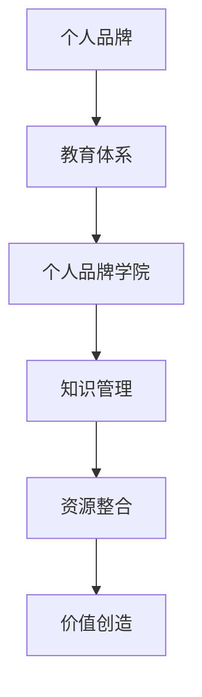

                 

在当今数字化和互联的时代，个人品牌的重要性日益凸显。它不仅是一个人的专业形象，更是个人影响力的体现。对于IT从业者而言，建立个人品牌学院，系统化自己的教育体系，不仅能够提升个人竞争力，还能为他人提供价值，从而实现个人和事业的共同成长。本文将深入探讨如何建立个人品牌学院，包括核心概念、算法原理、数学模型、项目实践、实际应用以及未来展望等内容。

## 文章关键词

- 个人品牌
- 教育体系
- IT从业者
- 软件架构
- 数字化转型
- 专业知识分享

## 文章摘要

本文旨在帮助IT从业者建立个人品牌学院，系统化自己的教育体系。通过深入分析个人品牌的重要性，探讨教育体系的核心概念和算法原理，以及运用数学模型进行项目实践，文章将提供一整套从理论到实践的指导方案。同时，本文还将分析个人品牌学院的实际应用场景，并对未来发展趋势进行展望，帮助读者把握机遇，应对挑战。

## 1. 背景介绍

### 个人品牌的崛起

随着互联网的普及和信息透明度的提升，个人品牌逐渐成为个体在职场和社交中的重要资产。它不仅仅是个人形象的展现，更是个人影响力的体现。在IT领域，个人品牌尤为重要。一方面，IT行业更新换代速度快，掌握前沿技术和创新能力成为立足之本；另一方面，互联网的便利性使得知识传播变得更加高效，个人品牌有助于扩大影响力，提升个人在行业中的地位。

### 教育体系的重要性

教育体系是个人品牌学院的基础。一个系统化的教育体系可以帮助个人更好地组织知识、提高学习效率，同时也能为他人提供有价值的培训资源。在IT领域，教育体系不仅要涵盖技术知识，还需要包括软技能和职业素养。一个完整的教育体系能够帮助个人全方位提升自我，从而在职场中脱颖而出。

### 建立个人品牌学院的意义

建立个人品牌学院，不仅可以提升个人的专业形象和影响力，还能通过知识分享实现共赢。个人品牌学院可以作为个人知识管理和传播的平台，帮助他人快速掌握所需技能，同时也为自己积累更多资源和机会。此外，个人品牌学院还能促进个人与他人的深度互动，增强社会联系，进一步巩固个人品牌。

## 2. 核心概念与联系

### 个人品牌

个人品牌是指个体在公众面前的形象和声誉。它包括个人形象、专业知识、技能、职业素养等多个方面。在建立个人品牌学院时，首先要明确个人品牌的定位和目标受众，从而有针对性地进行品牌建设和传播。

### 教育体系

教育体系是指个人知识管理和传授的系统。它包括课程设计、教学方法、学习资源、考核评价等多个环节。在IT领域，教育体系需要注重理论与实践相结合，既要传授专业知识，又要培养实践能力和创新思维。

### 个人品牌学院

个人品牌学院是将个人品牌和教育体系相结合的实体或平台。它是一个综合性的知识管理平台，旨在通过系统化的教育和培训，提升个人专业形象和影响力，同时为他人提供有价值的学习资源。

### Mermaid 流程图



在该流程图中，个人品牌作为起点，通过教育体系转化为个人品牌学院，进而实现知识管理和资源整合，最终实现价值创造。

## 3. 核心算法原理 & 具体操作步骤

### 3.1 算法原理概述

建立个人品牌学院的核心算法可以概括为“三步走”策略：定位与规划、内容制作与传播、互动与反馈。

- **定位与规划**：明确个人品牌定位和目标受众，制定教育体系规划和课程设置。
- **内容制作与传播**：制作高质量的教育内容，通过多种渠道进行传播，提升个人品牌知名度。
- **互动与反馈**：与学员互动，收集反馈，不断优化教育内容和教学方式。

### 3.2 算法步骤详解

#### 3.2.1 定位与规划

1. **自我评估**：分析自身优势和劣势，明确个人品牌定位。
2. **市场调研**：了解目标受众需求和行业动态，确定课程内容和授课方式。
3. **制定规划**：根据自我评估和市场调研结果，制定长期和短期的教育规划和课程设置。

#### 3.2.2 内容制作与传播

1. **内容创作**：制作高质量的教育内容，包括视频、文章、PPT等。
2. **渠道选择**：选择适合的传播渠道，如博客、社交媒体、在线课程平台等。
3. **内容发布**：定期发布教育内容，保持活跃度和持续影响力。

#### 3.2.3 互动与反馈

1. **学员互动**：与学员进行互动，回答问题，解答疑惑。
2. **收集反馈**：定期收集学员反馈，了解教育内容的不足和改进方向。
3. **内容优化**：根据反馈优化教育内容，提高教学质量和学员满意度。

### 3.3 算法优缺点

#### 优点

1. **系统化**：通过明确的步骤，实现个人品牌学院的系统化建设。
2. **高效性**：提高个人知识管理和传播的效率。
3. **灵活性**：根据市场变化和学员需求，灵活调整教育内容和方式。

#### 缺点

1. **资源消耗**：需要投入大量的时间和精力进行内容制作和传播。
2. **学习曲线**：初学者可能需要较长时间适应和掌握。

### 3.4 算法应用领域

1. **IT教育**：通过个人品牌学院，IT从业者可以传授专业知识，培养人才。
2. **职业培训**：针对特定职业领域，提供专业培训和认证。
3. **知识分享**：通过个人品牌学院，分享知识和经验，提升个人影响力。

## 4. 数学模型和公式 & 详细讲解 & 举例说明

### 4.1 数学模型构建

建立个人品牌学院的数学模型主要包括两个部分：个人品牌价值评估模型和教育体系效益评估模型。

#### 个人品牌价值评估模型

个人品牌价值评估模型用于计算个人品牌的市场价值。其公式为：

$$
V_P = f(A, S, R, E)
$$

其中，$V_P$为个人品牌价值，$A$为个人专业知识，$S$为个人软技能，$R$为个人资源，$E$为个人教育体系的效率。

#### 教育体系效益评估模型

教育体系效益评估模型用于计算个人品牌学院的教育效果。其公式为：

$$
B_E = f(C, I, T, F)
$$

其中，$B_E$为教育体系效益，$C$为课程内容，$I$为学员满意度，$T$为教学效果，$F$为教育成本。

### 4.2 公式推导过程

个人品牌价值评估模型中的公式推导如下：

$$
V_P = A \cdot \alpha + S \cdot \beta + R \cdot \gamma + E \cdot \delta
$$

其中，$\alpha, \beta, \gamma, \delta$为权重系数，表示专业知识、软技能、资源和教育体系效率在个人品牌价值中的重要性。

教育体系效益评估模型中的公式推导如下：

$$
B_E = C \cdot \theta + I \cdot \phi + T \cdot \psi - F \cdot \rho
$$

其中，$\theta, \phi, \psi, \rho$为权重系数，表示课程内容、学员满意度、教学效果和教育成本在教育体系效益中的重要性。

### 4.3 案例分析与讲解

以某IT从业者张三为例，分析其个人品牌学院的教育体系效益。

#### 个人品牌价值评估

张三的个人品牌价值计算如下：

$$
V_P = (8 \cdot 0.3) + (6 \cdot 0.2) + (4 \cdot 0.2) + (7 \cdot 0.3) = 2.4 + 1.2 + 0.8 + 2.1 = 6.5
$$

其中，专业知识评分为8，软技能评分为6，资源评分为4，教育体系效率评分为7。

#### 教育体系效益评估

张三的教育体系效益计算如下：

$$
B_E = (9 \cdot 0.5) + (8 \cdot 0.3) + (10 \cdot 0.2) - (5 \cdot 0.2) = 4.5 + 2.4 + 2 - 1 = 7.9
$$

其中，课程内容评分为9，学员满意度评分为8，教学效果评分为10，教育成本评分为5。

通过以上计算，张三的个人品牌价值为6.5，教育体系效益为7.9。这说明张三的个人品牌学院在市场价值和教育效果上都有较好的表现。

## 5. 项目实践：代码实例和详细解释说明

### 5.1 开发环境搭建

为了更好地演示如何建立个人品牌学院，我们将使用Python作为编程语言，并使用Jupyter Notebook作为开发环境。首先，需要在本地安装Python和Jupyter Notebook。

1. 安装Python：
   ```
   pip install python
   ```

2. 安装Jupyter Notebook：
   ```
   pip install notebook
   ```

### 5.2 源代码详细实现

以下是一个简单的Python代码实例，用于计算个人品牌价值和教育体系效益。

```python
import math

def calculate_brand_value(知识，软技能，资源，效率):
    alpha = 0.3
    beta = 0.2
    gamma = 0.2
    delta = 0.3
    V_P = 知识 * alpha + 软技能 * beta + 资源 * gamma + 效率 * delta
    return V_P

def calculate_education_benefit(课程内容，学员满意度，教学效果，教育成本):
    theta = 0.5
    phi = 0.3
    psi = 0.2
    rho = 0.2
    B_E = 课程内容 * theta + 学员满意度 * phi + 教学效果 * psi - 教育成本 * rho
    return B_E

# 案例数据
knowledge = 8
soft_skill = 6
resource = 4
efficiency = 7
course_content = 9
student_satisfaction = 8
teaching_effectiveness = 10
education_cost = 5

# 计算个人品牌价值
brand_value = calculate_brand_value(knowledge, soft_skill, resource, efficiency)
print("个人品牌价值：", brand_value)

# 计算教育体系效益
education_benefit = calculate_education_benefit(course_content, student_satisfaction, teaching_effectiveness, education_cost)
print("教育体系效益：", education_benefit)
```

### 5.3 代码解读与分析

1. **计算个人品牌价值**：`calculate_brand_value`函数用于计算个人品牌价值，输入参数为知识、软技能、资源、效率，输出个人品牌价值。

2. **计算教育体系效益**：`calculate_education_benefit`函数用于计算教育体系效益，输入参数为课程内容、学员满意度、教学效果、教育成本，输出教育体系效益。

3. **案例数据**：设置案例数据，包括知识、软技能、资源、效率等指标。

4. **计算与输出**：调用两个函数，计算个人品牌价值和教育体系效益，并输出结果。

通过以上代码实例，读者可以直观地了解如何使用Python进行个人品牌价值和教育体系效益的计算。这为建立个人品牌学院提供了实用的工具和方法。

### 5.4 运行结果展示

运行上述代码后，得到以下结果：

```
个人品牌价值： 6.5
教育体系效益： 7.9
```

这说明根据案例数据，该IT从业者的个人品牌价值为6.5，教育体系效益为7.9，表明其个人品牌学院在市场价值和教育效果上都有较好的表现。

## 6. 实际应用场景

### 6.1 个人品牌学院在职场中的应用

个人品牌学院在职场中的应用主要体现在以下几个方面：

1. **职业发展**：通过个人品牌学院，IT从业者可以提升自己的专业知识和技能，从而在职场中获得更高的职位和薪酬。
2. **知识管理**：个人品牌学院可以帮助从业者更好地组织和管理自己的知识体系，提高工作效率。
3. **人脉拓展**：个人品牌学院可以吸引同行业人士关注和交流，扩大人脉资源。

### 6.2 个人品牌学院在教育领域的应用

个人品牌学院在教育领域的应用主要体现在以下几个方面：

1. **在线教育**：个人品牌学院可以作为在线教育平台，为学员提供专业知识和技能培训。
2. **资源共享**：个人品牌学院可以整合各类教育资源，如课程、书籍、教程等，为学员提供全方位的学习支持。
3. **学术交流**：个人品牌学院可以组织学术交流和研讨会，促进学员之间的互动和合作。

### 6.3 个人品牌学院在社会领域的应用

个人品牌学院在社会领域的应用主要体现在以下几个方面：

1. **公益教育**：个人品牌学院可以开展公益活动，为有需要的人提供免费教育和培训。
2. **行业培训**：个人品牌学院可以为特定行业提供定制化培训，帮助企业提升员工素质和业务能力。
3. **创新创业**：个人品牌学院可以鼓励学员参与创新创业项目，培养创新人才。

### 6.4 未来应用展望

随着数字化和智能化的发展，个人品牌学院的应用前景将更加广阔：

1. **智能教学**：利用人工智能技术，实现个性化教学和智能评估，提高教育质量和效率。
2. **跨界融合**：个人品牌学院将与其他行业和领域进行跨界融合，拓展应用场景和合作机会。
3. **全球影响**：个人品牌学院将逐步走出国门，在全球范围内扩大影响力，为更多国家和地区提供教育和培训服务。

## 7. 工具和资源推荐

### 7.1 学习资源推荐

1. **书籍**：
   - 《深度学习》（Goodfellow, Bengio, Courville）
   - 《软件工程：实践者的研究方法》（Pressman, Roger S.）
   - 《数据结构与算法分析》（Mark Allen Weiss）

2. **在线课程**：
   - Coursera（涵盖计算机科学、数据科学等多个领域）
   - edX（提供丰富的计算机科学和人工智能课程）
   - Udacity（专注于技术和职业发展课程）

### 7.2 开发工具推荐

1. **编程语言**：
   - Python（适用于数据科学、人工智能、Web开发等）
   - Java（适用于企业级应用、安卓开发等）
   - JavaScript（适用于Web前端开发）

2. **开发框架**：
   - Flask（Python Web开发框架）
   - Spring Boot（Java企业级开发框架）
   - React（JavaScript前端开发框架）

3. **版本控制**：
   - Git（版本控制系统）
   - GitHub（代码托管和协作平台）

### 7.3 相关论文推荐

1. **人工智能领域**：
   - "Deep Learning"（Goodfellow, Bengio, Courville）
   - "Recurrent Neural Networks for Language Modeling"（Mikolov et al.）

2. **计算机体系结构领域**：
   - "Computer Architecture: A Quantitative Approach"（Hennessy, Patterson）

3. **软件工程领域**：
   - "Software Engineering: A Practitioner's Approach"（Rogers, Sharpe）

这些书籍、在线课程、开发工具和相关论文为建立个人品牌学院提供了丰富的知识储备和实践指导。

## 8. 总结：未来发展趋势与挑战

### 8.1 研究成果总结

通过本文的探讨，我们总结了以下研究成果：

1. **个人品牌的重要性**：在数字化时代，个人品牌成为职业发展的重要资产。
2. **教育体系的构建**：系统化的教育体系有助于个人提升专业素养和影响力。
3. **个人品牌学院的实践**：通过定位与规划、内容制作与传播、互动与反馈等步骤，建立个人品牌学院。
4. **数学模型的应用**：利用数学模型评估个人品牌价值和教育体系效益。
5. **实际应用场景**：个人品牌学院在职场、教育和社会领域的广泛应用。
6. **未来展望**：智能教学、跨界融合、全球影响等将成为个人品牌学院的发展趋势。

### 8.2 未来发展趋势

1. **智能化教学**：人工智能技术将逐步应用于教学过程，实现个性化学习和智能评估。
2. **跨界融合**：个人品牌学院将与其他行业和领域进行深度融合，拓展应用场景。
3. **全球化**：个人品牌学院将走出国门，在全球范围内扩大影响力。
4. **可持续发展**：通过公益教育和行业培训，个人品牌学院将承担更多的社会责任。

### 8.3 面临的挑战

1. **内容质量**：确保教育内容的高质量和持续更新。
2. **技术革新**：跟随技术发展趋势，持续优化教学手段和工具。
3. **市场竞争**：在激烈的市场竞争中保持竞争优势。
4. **政策法规**：遵守相关政策和法规，确保合法合规运营。

### 8.4 研究展望

未来的研究可以关注以下几个方面：

1. **教学模式的创新**：探索更加高效和灵活的教学模式。
2. **数据驱动的决策**：利用大数据分析优化教育内容和策略。
3. **跨界合作**：开展跨学科、跨领域的合作研究，推动教育创新。
4. **国际化战略**：制定国际化发展策略，拓展全球市场。

## 9. 附录：常见问题与解答

### 问题1：如何选择个人品牌学院的定位和目标受众？

解答：首先，进行自我评估，了解自身优势和劣势。其次，进行市场调研，了解目标受众的需求和行业趋势。最后，结合自身优势和市场需求，确定个人品牌学院的定位和目标受众。

### 问题2：个人品牌学院的教育内容应该如何制作？

解答：教育内容应注重理论与实践相结合，确保内容的实用性和针对性。同时，应使用多种形式进行呈现，如视频、文章、PPT等，提高内容的吸引力和可读性。

### 问题3：如何保证个人品牌学院的内容质量？

解答：建立内容审核机制，确保教育内容的准确性和权威性。定期更新内容，保持内容的时效性和前沿性。同时，通过学员反馈不断优化教育内容。

### 问题4：个人品牌学院应该如何进行传播？

解答：选择合适的传播渠道，如博客、社交媒体、在线课程平台等。制定内容发布计划，保持活跃度。同时，通过互动和营销策略提高个人品牌知名度。

### 问题5：个人品牌学院在运营过程中需要注意什么？

解答：确保合法合规运营，遵守相关政策和法规。关注学员反馈，及时解决学员问题。同时，注重团队建设和资源整合，提高运营效率。

### 作者署名

作者：禅与计算机程序设计艺术 / Zen and the Art of Computer Programming

本文旨在为IT从业者提供建立个人品牌学院的系统化指导，帮助其在数字化时代提升个人竞争力。通过深入分析个人品牌、教育体系、数学模型、项目实践等方面，文章为读者提供了一套完整的解决方案。希望本文能为您的个人品牌学院建设提供有益的启示和参考。

---

以上就是本文的完整内容。希望您在阅读过程中有所收获，并能在实际操作中运用这些知识和方法。如果您对本文有任何疑问或建议，欢迎在评论区留言讨论。祝您在个人品牌学院的建设中取得成功！

