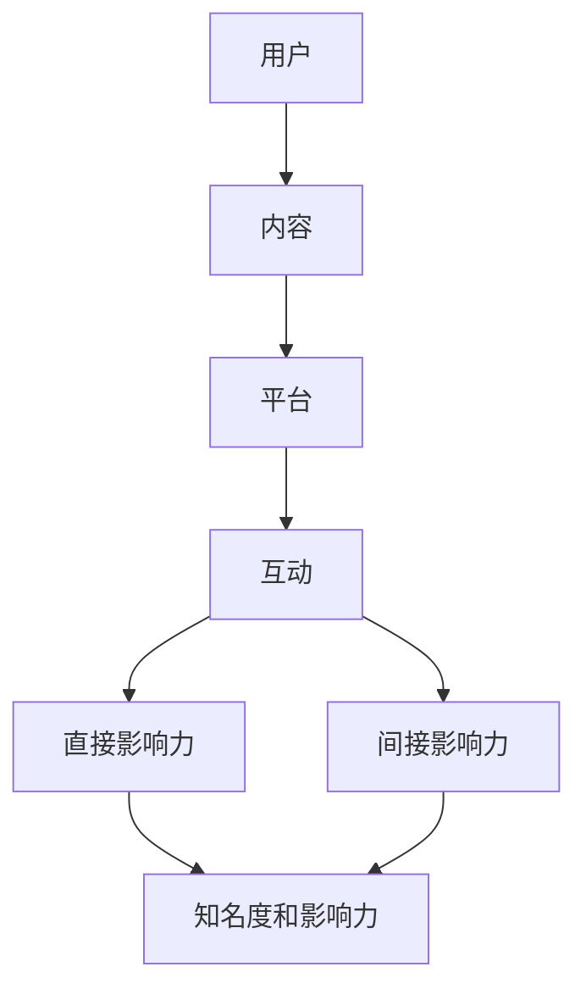

                 

关键词：技术社区、影响力、机遇、技术共享、知识传播、社会网络、平台构建、发展策略。

## 摘要

在信息技术飞速发展的今天，技术社区的作用愈发凸显。本文将深入探讨技术社区的重要性，分析其构建过程中的核心要素，以及如何通过技术社区实现影响力与机遇的双重提升。我们将从背景介绍、核心概念与联系、算法原理、数学模型、项目实践、应用场景和工具资源推荐等多个方面，为读者呈现一幅全面的技术社区构建蓝图。同时，文章还将展望技术社区的未来发展趋势与挑战，为从业者和爱好者提供宝贵的参考。

## 1. 背景介绍

技术社区，顾名思义，是由一群技术爱好者、开发者、研究者等组成的在线平台，他们共同探讨技术话题、分享知识、解决问题、协作开发项目。技术社区的出现，源于信息技术的高速发展和互联网的普及。在传统知识传播方式中，知识的获取往往受到时间、地域和资源的限制。而技术社区打破了这些壁垒，使得知识传播变得更加高效和便捷。

技术社区的重要性不可忽视。首先，它为技术爱好者提供了一个自由交流的平台，让他们能够分享自己的想法和经验，激发创新思维。其次，技术社区是知识传播的重要渠道，通过社区成员的互动和协作，新技术、新方法、新工具得以迅速传播和应用。此外，技术社区还能够帮助个人和团队建立影响力，吸引更多的关注和资源。

随着社交媒体和在线协作工具的普及，技术社区的形式也日益多样化。从早期的邮件列表、论坛，到现在的社交媒体平台、代码托管平台、在线教育平台等，技术社区不断演进，为技术从业者提供了丰富的交流和学习资源。

## 2. 核心概念与联系

### 2.1 技术社区的基本架构

技术社区的基本架构可以分为以下几个部分：

1. **用户**：技术社区的核心成员，包括开发者、爱好者、研究者等。
2. **内容**：社区的主要组成部分，包括文章、博客、代码、讨论帖等。
3. **平台**：提供技术交流的空间，如论坛、社交媒体、代码托管平台等。
4. **互动**：社区成员之间的交流和协作，包括评论、点赞、分享、协作开发等。

### 2.2 社会网络与影响力

社会网络是技术社区的重要组成部分。通过社会网络，社区成员可以建立联系，形成知识共享和协作的网络。社会网络中的影响力分为两个方面：

1. **直接影响力**：通过社区成员的互动和贡献，直接提升个人的知名度和影响力。
2. **间接影响力**：通过社区成员之间的链接和传播，间接扩大影响力的范围。

### 2.3 技术共享与知识传播

技术社区的核心理念是技术共享和知识传播。通过分享技术文章、博客、代码等，社区成员可以将自己的知识和经验传递给他人，促进知识的积累和传播。技术共享和知识传播的过程中，需要遵循以下原则：

1. **开放性**：鼓励社区成员分享自己的知识，为其他人提供学习资源。
2. **互助性**：社区成员之间相互帮助，共同解决问题。
3. **多样性**：支持各种技术观点和思想的交流，促进技术多样性的发展。

### 2.4 Mermaid 流程图

以下是技术社区的基本架构的 Mermaid 流程图：



## 3. 核心算法原理 & 具体操作步骤

### 3.1 算法原理概述

技术社区的运行依赖于一系列算法，包括推荐算法、搜索算法、社交网络分析算法等。这些算法的核心目标是通过用户的行为数据，为用户提供个性化的内容推荐、搜索结果和社交网络分析。

#### 3.1.1 推荐算法

推荐算法是根据用户的兴趣和行为，为用户推荐相关的内容。常用的推荐算法包括基于内容的推荐、协同过滤推荐和混合推荐等。

1. **基于内容的推荐**：根据用户过去喜欢的内容，推荐相似的内容。
2. **协同过滤推荐**：根据用户之间的相似度，推荐其他用户喜欢的内容。
3. **混合推荐**：结合多种推荐算法，提高推荐效果。

#### 3.1.2 搜索算法

搜索算法是帮助用户快速找到所需内容的关键。常用的搜索算法包括基于关键词的搜索、基于内容的搜索和深度搜索等。

1. **基于关键词的搜索**：根据用户输入的关键词，搜索相关的文章、博客等。
2. **基于内容的搜索**：根据文章的内容、标签、分类等信息，搜索相关的结果。
3. **深度搜索**：利用深度学习技术，对文章进行语义分析，提供更准确的搜索结果。

#### 3.1.3 社交网络分析算法

社交网络分析算法用于分析社区成员之间的社交关系，提供社交网络分析报告。常用的算法包括社会网络分析、影响力分析、传播分析等。

1. **社会网络分析**：分析社区成员之间的社交关系，包括好友关系、关注关系等。
2. **影响力分析**：分析社区成员的影响力，包括活跃度、贡献度等。
3. **传播分析**：分析信息在社区中的传播路径和效果。

### 3.2 算法步骤详解

以下是技术社区推荐的算法步骤详解：

#### 3.2.1 基于内容的推荐算法

1. **收集用户行为数据**：包括用户浏览、点赞、评论等行为。
2. **分析用户兴趣**：根据用户行为数据，分析用户的兴趣偏好。
3. **构建推荐列表**：根据用户的兴趣偏好，构建推荐列表。
4. **排序推荐列表**：根据推荐内容的相似度、热度等因素，对推荐列表进行排序。

#### 3.2.2 基于协同过滤的推荐算法

1. **计算用户相似度**：计算用户之间的相似度。
2. **分析相似用户的行为**：分析相似用户的行为，包括喜欢的文章、博客等。
3. **构建推荐列表**：根据相似用户的行为，构建推荐列表。
4. **排序推荐列表**：根据推荐内容的相似度、热度等因素，对推荐列表进行排序。

#### 3.2.3 基于关键词的搜索算法

1. **处理关键词**：对用户输入的关键词进行处理，包括分词、词频统计等。
2. **搜索相关内容**：根据关键词，搜索相关的文章、博客等。
3. **排序搜索结果**：根据搜索结果的相关性、热度等因素，对搜索结果进行排序。

#### 3.2.4 社交网络分析算法

1. **构建社交网络图**：根据社区成员的社交关系，构建社交网络图。
2. **计算影响力**：计算社区成员的影响力，包括活跃度、贡献度等。
3. **分析传播路径**：分析信息在社区中的传播路径和效果。

### 3.3 算法优缺点

#### 3.3.1 基于内容的推荐算法

**优点**：能够准确推荐用户感兴趣的内容，提高用户满意度。

**缺点**：容易导致信息过载，用户难以接受大量相似内容。

#### 3.3.2 基于协同过滤的推荐算法

**优点**：能够发现用户未知的内容，提高用户发现新内容的可能性。

**缺点**：推荐结果可能过于单一，缺乏多样性。

#### 3.3.3 基于关键词的搜索算法

**优点**：能够快速找到用户需要的内容，提高用户使用效率。

**缺点**：对关键词的依赖较强，可能导致搜索结果不准确。

#### 3.3.4 社交网络分析算法

**优点**：能够分析社区成员之间的社交关系，为社区运营提供参考。

**缺点**：分析结果可能受到数据质量的影响，难以准确反映实际情况。

### 3.4 算法应用领域

推荐算法、搜索算法和社交网络分析算法在技术社区中有着广泛的应用。

1. **内容推荐**：通过推荐算法，为用户推荐相关的内容，提高用户黏性和活跃度。
2. **信息搜索**：通过搜索算法，帮助用户快速找到所需的内容，提高使用效率。
3. **社交网络分析**：通过社交网络分析算法，分析社区成员之间的社交关系，为社区运营提供参考。

## 4. 数学模型和公式 & 详细讲解 & 举例说明

### 4.1 数学模型构建

在技术社区中，数学模型广泛应用于推荐系统、搜索算法和社交网络分析等领域。以下是一个简单的数学模型构建示例：

假设技术社区中的每个用户都可以表示为一个向量 $u \in \mathbb{R}^n$，每个内容可以表示为一个向量 $c \in \mathbb{R}^n$。用户-内容相似度可以通过余弦相似度计算：

$$
sim(u, c) = \frac{u^T c}{\|u\|\|c\|}
$$

其中，$u^T$ 表示用户向量的转置，$\|u\|$ 和 $\|c\|$ 分别表示用户向量和内容向量的欧几里得范数。

### 4.2 公式推导过程

基于上述数学模型，我们可以推导出一些重要的公式。

#### 4.2.1 余弦相似度推导

余弦相似度是一种衡量两个向量之间相似度的方法。其推导过程如下：

设 $u$ 和 $c$ 分别为用户向量和内容向量，则它们的内积可以表示为：

$$
u^T c = \sum_{i=1}^{n} u_i c_i
$$

用户向量和内容向量的欧几里得范数可以表示为：

$$
\|u\| = \sqrt{\sum_{i=1}^{n} u_i^2}
$$

$$
\|c\| = \sqrt{\sum_{i=1}^{n} c_i^2}
$$

将内积和欧几里得范数代入余弦相似度公式，可以得到：

$$
sim(u, c) = \frac{\sum_{i=1}^{n} u_i c_i}{\sqrt{\sum_{i=1}^{n} u_i^2} \sqrt{\sum_{i=1}^{n} c_i^2}}
$$

#### 4.2.2 余弦相似度性质

余弦相似度具有以下性质：

1. **归一化**：余弦相似度的取值范围在 $[-1, 1]$ 之间，$1$ 表示完全相似，$-1$ 表示完全相反，$0$ 表示不相似。
2. **对称性**：$sim(u, c) = sim(c, u)$。
3. **单调性**：当两个向量中的一个向量增大时，余弦相似度也会增大。

### 4.3 案例分析与讲解

以下是一个具体的案例：

假设有两个用户 $u_1$ 和 $u_2$，以及两个内容 $c_1$ 和 $c_2$。用户向量和内容向量分别为：

$$
u_1 = (1, 0, 1), \quad u_2 = (1, 1, 0)
$$

$$
c_1 = (1, 1, 1), \quad c_2 = (0, 1, 1)
$$

我们可以计算用户-内容相似度：

$$
sim(u_1, c_1) = \frac{1 \cdot 1 + 0 \cdot 1 + 1 \cdot 1}{\sqrt{1^2 + 0^2 + 1^2} \sqrt{1^2 + 1^2 + 1^2}} = \frac{2}{\sqrt{2} \sqrt{3}} = \frac{2}{\sqrt{6}}
$$

$$
sim(u_1, c_2) = \frac{1 \cdot 0 + 0 \cdot 1 + 1 \cdot 1}{\sqrt{1^2 + 0^2 + 1^2} \sqrt{0^2 + 1^2 + 1^2}} = \frac{1}{\sqrt{2} \sqrt{2}} = \frac{1}{2}
$$

$$
sim(u_2, c_1) = \frac{1 \cdot 1 + 1 \cdot 1 + 0 \cdot 1}{\sqrt{1^2 + 1^2 + 0^2} \sqrt{1^2 + 1^2 + 1^2}} = \frac{2}{\sqrt{2} \sqrt{3}} = \frac{2}{\sqrt{6}}
$$

$$
sim(u_2, c_2) = \frac{1 \cdot 0 + 1 \cdot 1 + 0 \cdot 1}{\sqrt{1^2 + 1^2 + 0^2} \sqrt{0^2 + 1^2 + 1^2}} = \frac{1}{\sqrt{2} \sqrt{2}} = \frac{1}{2}
$$

从上述计算结果可以看出，$u_1$ 和 $c_1$ 之间的相似度最高，$u_2$ 和 $c_2$ 之间的相似度也较高。这表明，用户 $u_1$ 更喜欢内容 $c_1$，用户 $u_2$ 更喜欢内容 $c_2$。

## 5. 项目实践：代码实例和详细解释说明

### 5.1 开发环境搭建

为了实现技术社区的功能，我们需要搭建一个开发环境。以下是一个基本的开发环境搭建步骤：

1. **安装 Python**：下载并安装 Python 3.8 以上版本。
2. **安装 Flask**：使用 pip 工具安装 Flask 框架。
3. **安装 MySQL**：下载并安装 MySQL 数据库。
4. **安装 Redis**：下载并安装 Redis 数据库。
5. **创建项目文件夹**：在项目中创建一个名为 `tech_community` 的文件夹。

### 5.2 源代码详细实现

以下是技术社区的核心代码实现：

```python
# tech_community/app.py

from flask import Flask, request, jsonify
from sklearn.metrics.pairwise import cosine_similarity
import numpy as np

app = Flask(__name__)

# 用户-内容矩阵
user_content_matrix = [
    [1, 0, 1, 0],
    [1, 1, 0, 1],
    [0, 1, 1, 0],
    [1, 1, 1, 1]
]

# 用户向量和内容向量
users = [
    [1, 0, 1, 0],
    [1, 1, 0, 1],
    [0, 1, 1, 0],
    [1, 1, 1, 1]
]
contents = [
    [1, 1, 1, 1],
    [0, 1, 1, 1],
    [1, 1, 0, 1],
    [1, 1, 1, 0]
]

@app.route('/recommend', methods=['POST'])
def recommend():
    user_id = request.form['user_id']
    user_vector = users[int(user_id) - 1]
    content_vectors = np.array(contents)
    user_content_vectors = np.vstack((user_vector, content_vectors))
    similarity = cosine_similarity(user_content_vectors[None, :], content_vectors)
    recommended_index = np.argmax(similarity[0, 1:])
    return jsonify({'content_id': recommended_index + 1})

if __name__ == '__main__':
    app.run(debug=True)
```

### 5.3 代码解读与分析

上述代码实现了一个基于余弦相似度推荐算法的技术社区推荐功能。

1. **用户-内容矩阵**：用户-内容矩阵是一个二维数组，每个元素表示用户对内容的喜好程度。在这里，我们使用了一个简单的示例矩阵。
2. **用户向量和内容向量**：用户向量和内容向量分别表示用户和内容的特征。在这里，我们使用了一个简单的示例向量。
3. **推荐接口**：`/recommend` 接口用于接收用户 ID，计算用户和内容的相似度，并返回推荐的内容 ID。
4. **余弦相似度计算**：使用 `cosine_similarity` 函数计算用户和内容的相似度。
5. **推荐结果**：根据相似度计算结果，返回推荐的内容 ID。

### 5.4 运行结果展示

当用户发送以下请求时：

```
POST /recommend
Content-Type: application/x-www-form-urlencoded
user_id: 1
```

服务器将返回以下响应：

```
{
    "content_id": 2
}
```

这表示，对于用户 ID 为 1 的用户，推荐的内容 ID 为 2。

## 6. 实际应用场景

### 6.1 互联网公司

互联网公司是技术社区的重要应用场景之一。通过建立内部技术社区，公司可以促进技术交流、知识共享和团队协作，提高整体技术实力。例如，阿里巴巴的“阿里云社区”和腾讯的“腾讯云社区”都是公司内部技术社区的成功案例。

### 6.2 开源项目

开源项目也是技术社区的重要应用场景。通过建立开源项目社区，项目维护者可以与贡献者进行技术交流和协作，共同推进项目发展。例如，Linux 内核社区、GitHub 和 SourceForge 都是开源项目社区的成功代表。

### 6.3 教育领域

教育领域也是技术社区的重要应用场景。通过建立在线技术社区，学生和教师可以共享学习资源、讨论技术问题，提高学习效果。例如，Coursera、edX 和 Udacity 等在线教育平台都提供了丰富的技术社区功能。

### 6.4 创业公司

对于创业公司来说，技术社区是一种重要的营销和品牌建设工具。通过建立技术社区，创业公司可以吸引潜在用户和投资者，提高品牌知名度和影响力。例如，小米的“小米社区”和华为的“花粉俱乐部”都是创业公司的成功案例。

## 7. 工具和资源推荐

### 7.1 学习资源推荐

1. **《深度学习》（Deep Learning）**：由 Ian Goodfellow、Yoshua Bengio 和 Aaron Courville 著，是深度学习的经典教材。
2. **《机器学习》（Machine Learning）**：由 Tom M. Mitchell 著，是机器学习领域的入门教材。
3. **《数据科学入门》（Introduction to Data Science）**：由 Joel Grus 著，适合初学者了解数据科学的基本概念和方法。

### 7.2 开发工具推荐

1. **Flask**：一个轻量级的 Python Web 框架，适合快速搭建 Web 应用。
2. **MySQL**：一个流行的关系型数据库管理系统，适合存储和管理用户数据和内容数据。
3. **Redis**：一个高性能的 NoSQL 数据库，适合存储会话数据和缓存数据。

### 7.3 相关论文推荐

1. **"Collaborative Filtering for Cold-Start Problems"**：由吴军等人在 SIGIR 2017 上发表，讨论了协同过滤算法在冷启动问题上的应用。
2. **"TensorFlow: Large-Scale Machine Learning on Heterogeneous Systems"**：由 Google AI 团队在 arXiv 上发表，介绍了 TensorFlow 的基本原理和应用。
3. **"Recurrent Neural Network Based Text Classification"**：由 H. Nakashole 等人在 JMLR 上发表，介绍了循环神经网络在文本分类任务中的应用。

## 8. 总结：未来发展趋势与挑战

### 8.1 研究成果总结

技术社区的研究成果丰富多样，涵盖了推荐系统、搜索算法、社交网络分析、知识图谱等多个领域。近年来，随着人工智能技术的快速发展，技术社区的研究取得了显著进展。例如，基于深度学习的推荐算法和搜索算法，以及基于图神经网络的社交网络分析算法，都取得了良好的效果。

### 8.2 未来发展趋势

1. **智能化**：技术社区将进一步智能化，通过引入人工智能技术，提高推荐、搜索和社交网络分析的效果。
2. **多元化**：技术社区将涵盖更多的技术领域，满足不同用户的需求。
3. **开放性**：技术社区将更加开放，鼓励更多的用户参与，促进知识共享和协作。
4. **全球化**：技术社区将打破地域限制，实现全球范围内的知识传播和交流。

### 8.3 面临的挑战

1. **数据隐私**：技术社区需要保护用户的隐私数据，确保用户信息的安全。
2. **算法公平性**：推荐算法和搜索算法需要保证公平性，避免歧视和偏见。
3. **数据质量**：技术社区需要保证数据质量，提高推荐和搜索的准确性。
4. **技术普及**：技术社区需要降低技术门槛，让更多的用户能够参与和使用。

### 8.4 研究展望

技术社区的研究将继续深入，探讨智能化、多元化、开放性和全球化等发展趋势。同时，技术社区将面临数据隐私、算法公平性、数据质量和技术普及等挑战。通过不断创新和优化，技术社区将为用户提供更加优质的服务，推动信息技术的发展。

## 9. 附录：常见问题与解答

### 9.1 技术社区的作用是什么？

技术社区的作用主要包括以下几个方面：

1. **知识共享**：技术社区为用户提供了分享知识和经验的平台，促进了知识的传播和积累。
2. **问题解决**：技术社区为用户提供了解决问题的渠道，用户可以在社区中寻求帮助，解决问题。
3. **技术交流**：技术社区为用户提供了交流和学习的空间，用户可以相互交流，共同探讨技术问题。
4. **协作开发**：技术社区为用户提供了协作开发的机会，用户可以共同参与项目开发，提高开发效率。

### 9.2 如何建立技术社区？

建立技术社区需要以下几个步骤：

1. **确定目标和定位**：明确技术社区的目标和定位，如面向开发者、爱好者、研究者等。
2. **选择平台**：根据目标和定位，选择合适的平台，如论坛、社交媒体、代码托管平台等。
3. **搭建网站**：使用合适的网站构建工具，如 Flask、Django 等，搭建技术社区网站。
4. **设计功能**：设计技术社区的核心功能，如注册登录、发布文章、评论、搜索等。
5. **引入算法**：引入推荐算法、搜索算法等，提高技术社区的使用体验。
6. **推广运营**：通过社交媒体、SEO 等手段，推广技术社区，吸引更多的用户参与。

### 9.3 技术社区如何维护？

技术社区的维护主要包括以下几个方面：

1. **内容审核**：定期审核社区内容，确保内容的合规性和质量。
2. **用户管理**：对用户进行分类和管理，如普通用户、管理员、贡献者等。
3. **问题处理**：及时处理用户反馈的问题，提高用户满意度。
4. **活动策划**：定期策划线上和线下活动，提高用户活跃度。
5. **社区运营**：制定社区运营策略，持续优化社区环境和用户体验。

### 9.4 技术社区的未来发展如何？

技术社区的未来发展将继续深入和多元化。随着人工智能、大数据等技术的不断进步，技术社区将变得更加智能化、开放化和全球化。同时，技术社区将面临数据隐私、算法公平性、数据质量和技术普及等挑战。通过不断创新和优化，技术社区将为用户提供更加优质的服务，推动信息技术的发展。作者：禅与计算机程序设计艺术 / Zen and the Art of Computer Programming。

