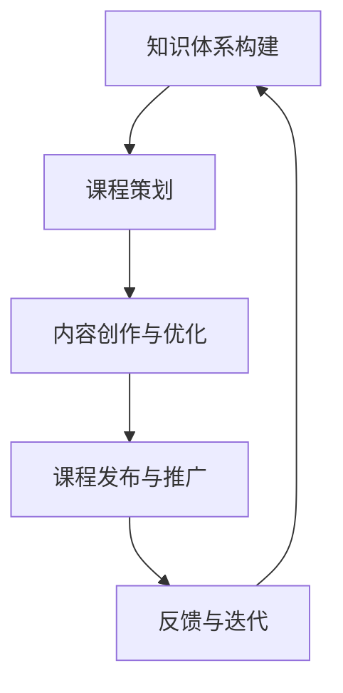
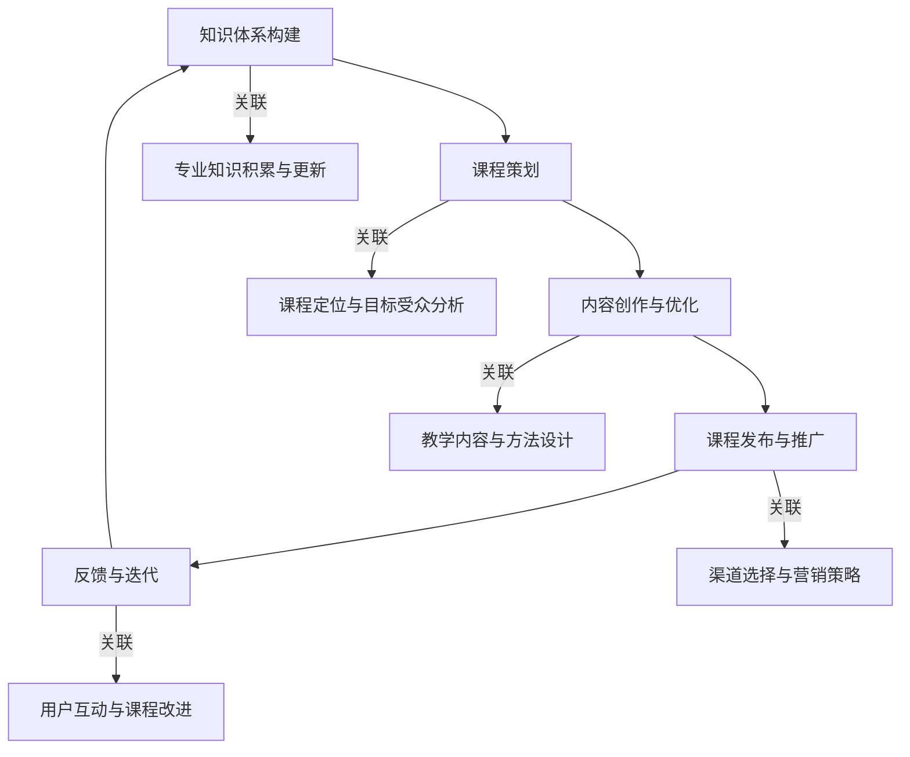

                 

关键词：个人品牌、知识体系、课程开发、IT专业、系统化学习、专家角色、内容创建、影响力提升。

> 摘要：本文将探讨如何开发个人品牌课程，通过系统化你的知识体系，实现个人影响力的提升。我们将深入解析IT领域专家的角色，提供实用的策略和工具，帮助你在课程开发中展现专业价值，构建强大的个人品牌。

## 1. 背景介绍

在信息爆炸的时代，知识的传播与获取变得前所未有的便捷。然而，这也带来了一个挑战：如何在众多信息中脱颖而出，建立个人品牌，成为行业的专家？个人品牌课程是一种有效的策略，它不仅能够帮助个人传播知识，还能提升个人在专业领域的认可度与影响力。

开发个人品牌课程，首先需要有一个系统化的知识体系。这不仅是为了确保课程内容的逻辑性和完整性，更是为了将个人的专业知识转化为有价值的课程内容。在这个过程中，IT领域的专家角色尤为关键，他们不仅需要具备深厚的专业知识，还需要掌握课程开发与传播的技巧。

本文将围绕以下方面展开讨论：

1. **个人品牌课程的重要性**：阐述个人品牌课程对于个人职业发展的意义。
2. **知识体系构建**：介绍如何系统化你的知识，为课程开发奠定基础。
3. **课程开发流程**：详细描述从课程策划到发布的完整过程。
4. **内容创作与传播**：探讨如何创作高质量的课程内容，并有效地传播。
5. **工具与资源推荐**：提供实用的工具和资源，以辅助课程开发与传播。
6. **未来趋势与挑战**：分析个人品牌课程的未来发展方向与面临的挑战。

## 2. 核心概念与联系

### 核心概念

- **个人品牌**：个人在专业领域内的知名度和影响力。
- **知识体系**：个人在某一领域的知识结构，包括基础理论、实践技能和最新动态。
- **课程开发**：设计、制作、发布个人品牌课程的过程。
- **内容创作**：创作高质量课程内容，包括文本、图像、视频等多种形式。

### 架构

为了更好地理解个人品牌课程的开发过程，我们可以使用Mermaid流程图来展示其核心环节和关联性：



在这个流程中，知识体系构建是整个过程的起点和基础，它决定了课程的质量和深度。课程策划则是对知识体系的提炼和结构化，内容创作与优化是对课程策划的具体实施，课程发布与推广是让课程内容触达目标受众的关键环节，而反馈与迭代则确保课程不断改进，适应不断变化的市场需求。

### Mermaid 流程图



通过这个流程图，我们可以清晰地看到各个环节之间的关联和互动，这有助于我们在实际操作中更好地掌握整个课程开发的脉络。

## 3. 核心算法原理 & 具体操作步骤

### 3.1 算法原理概述

在个人品牌课程开发中，核心算法可以被视为知识体系构建和课程内容优化的关键。这些算法帮助我们将抽象的专业知识转化为易于理解和吸收的课程内容。以下是几个关键算法的概述：

- **知识萃取算法**：用于从大量的专业文献和资料中提取关键知识点和核心概念。
- **内容结构化算法**：用于对提取的知识点进行分类、排序和整合，形成系统的课程内容框架。
- **学习路径规划算法**：用于根据学习者的背景和需求，制定个性化的学习路径。

### 3.2 算法步骤详解

#### 3.2.1 知识萃取算法

1. **数据收集**：从专业的数据库、文献、书籍和最新的研究论文中收集相关资料。
2. **文本处理**：使用自然语言处理（NLP）技术对文本进行预处理，包括分词、词性标注和实体识别。
3. **知识提取**：应用知识图谱构建算法，将文本中的关键信息转化为结构化的知识实体。
4. **知识整合**：对提取的知识实体进行分类和整合，形成知识体系。

#### 3.2.2 内容结构化算法

1. **需求分析**：通过问卷调查、访谈等方式了解学习者的需求和知识背景。
2. **内容分类**：根据需求分析的结果，将知识点分类并分配到不同的课程模块中。
3. **内容排序**：根据知识点的逻辑关系和教学目标，对内容进行排序和整合。
4. **内容优化**：对整合后的内容进行审校和优化，确保内容的准确性和易理解性。

#### 3.2.3 学习路径规划算法

1. **初始评估**：通过在线测评或问卷调查，评估学习者的初始知识水平。
2. **路径规划**：根据学习者的初始评估结果，制定个性化的学习路径，包括学习内容的优先级和难度。
3. **路径调整**：根据学习者的反馈和学习进度，动态调整学习路径，确保学习效果的最大化。

### 3.3 算法优缺点

#### 知识萃取算法

**优点**：高效地从大量文献中提取关键信息，减少人工整理的工作量，提高知识体系的完整性。

**缺点**：可能存在信息丢失或不准确的问题，需要人工进行审核和修正。

#### 内容结构化算法

**优点**：能够系统地整理知识点，形成结构化的课程内容，提高学习效率。

**缺点**：需要对知识点的逻辑关系有深入的理解，否则可能导致内容混乱或不合理。

#### 学习路径规划算法

**优点**：能够根据学习者的特点制定个性化的学习路径，提高学习效果。

**缺点**：需要大量的人力和时间进行初始评估和路径规划，成本较高。

### 3.4 算法应用领域

这些算法在个人品牌课程开发中的应用非常广泛，不仅适用于IT领域，还可以应用于其他专业领域，如医学、金融等。通过这些算法，我们可以将复杂的专业知识转化为易于理解和学习的课程内容，帮助学习者快速掌握专业知识和技能。

## 4. 数学模型和公式 & 详细讲解 & 举例说明

### 4.1 数学模型构建

在个人品牌课程开发中，数学模型的应用有助于我们系统地分析课程内容和学习者的学习行为。以下是几个关键数学模型的构建过程：

#### 4.1.1 学习者行为模型

**模型定义**：学习者行为模型用于描述学习者在学习过程中的行为特征。

**公式**：
$$
B = f(L, T, E)
$$
其中，$B$ 表示学习者的行为，$L$ 表示学习内容，$T$ 表示教学策略，$E$ 表示学习环境。

**解释**：学习者行为是由学习内容、教学策略和学习环境共同作用的结果。

#### 4.1.2 课程评估模型

**模型定义**：课程评估模型用于评估课程的质量和学习效果。

**公式**：
$$
A = \frac{S + C + P}{3}
$$
其中，$A$ 表示课程评估得分，$S$ 表示学生满意度得分，$C$ 表示课程内容完整性得分，$P$ 表示教学策略有效性得分。

**解释**：课程评估得分是通过对学生满意度、课程内容完整性和教学策略有效性的综合评估得到的。

### 4.2 公式推导过程

#### 4.2.1 学习者行为模型推导

1. **学习内容对学习者行为的影响**：
   - 研究表明，学习内容的质量和难度直接影响学习者的学习动机和行为。因此，我们将学习内容作为影响学习者行为的一个重要因素。
   $$L \rightarrow B$$
   
2. **教学策略对学习者行为的影响**：
   - 教学策略包括教学方法、教学工具和教学环境等。这些因素通过影响学习者的学习体验和学习效率来影响其行为。
   $$T \rightarrow B$$

3. **学习环境对学习者行为的影响**：
   - 学习环境包括物理环境和心理环境。良好的学习环境可以提供必要的学习资源和支持，促进学习者的积极行为。
   $$E \rightarrow B$$

综合以上因素，我们得到学习者行为模型：
$$
B = f(L, T, E)
$$

#### 4.2.2 课程评估模型推导

1. **学生满意度得分**：
   - 学生满意度是通过问卷调查或访谈等方式收集的数据。满意度得分反映了学生对课程的整体评价。
   $$S = \frac{\sum_{i=1}^{n} S_i}{n}$$
   其中，$S_i$ 表示第$i$ 个学生的满意度得分，$n$ 表示学生总数。

2. **课程内容完整性得分**：
   - 课程内容完整性是通过分析课程内容是否涵盖了所有的知识点和教学目标来评估的。
   $$C = \frac{\sum_{i=1}^{m} C_i}{m}$$
   其中，$C_i$ 表示第$i$ 个知识点的完整性得分，$m$ 表示知识点总数。

3. **教学策略有效性得分**：
   - 教学策略有效性是通过分析教学策略对学生学习效果的影响来评估的。
   $$P = \frac{\sum_{j=1}^{k} P_j}{k}$$
   其中，$P_j$ 表示第$j$ 个教学策略的有效性得分，$k$ 表示教学策略总数。

综合以上因素，我们得到课程评估模型：
$$
A = \frac{S + C + P}{3}
$$

### 4.3 案例分析与讲解

#### 4.3.1 学习者行为模型案例

假设我们有一个IT专业课程，学习者李明在学习过程中表现出以下行为：

- 学习内容：李明对操作系统和数据库相关知识非常感兴趣，每天花费3小时进行学习。
- 教学策略：课程使用了在线视频和编程实验室，教学过程中注重实践操作。
- 学习环境：李明在家中学习，具备良好的网络环境和计算机设备。

根据学习者行为模型，我们可以分析李明的行为：

$$
B = f(L, T, E)
$$

其中，$L$ 表示李明对操作系统和数据库的学习内容，$T$ 表示课程使用的教学策略，$E$ 表示李明的学习环境。

由于李明对学习内容非常感兴趣，且教学策略和learning环境良好，因此可以预测李明的学习行为积极，学习效果较好。

#### 4.3.2 课程评估模型案例

假设我们对上述IT专业课程进行评估，得到以下数据：

- 学生满意度得分：$S = 4.5$（5分制）
- 课程内容完整性得分：$C = 4.8$
- 教学策略有效性得分：$P = 4.7$

根据课程评估模型，我们可以计算出课程评估得分：

$$
A = \frac{S + C + P}{3} = \frac{4.5 + 4.8 + 4.7}{3} = 4.67
$$

课程评估得分为4.67，表明该IT专业课程整体质量较高，学生满意度较好，教学策略和内容完整性均达到较高水平。

## 5. 项目实践：代码实例和详细解释说明

### 5.1 开发环境搭建

为了实现个人品牌课程开发，我们首先需要搭建一个合适的开发环境。以下是一个简单的开发环境搭建步骤：

1. **操作系统**：推荐使用Linux或macOS，因为它们提供了更好的开发和运行环境。
2. **编程语言**：选择Python作为主要编程语言，因为Python具有易学易用的特点，且拥有丰富的库和框架。
3. **文本编辑器**：推荐使用Visual Studio Code或Sublime Text，这些编辑器提供了丰富的插件和功能，方便代码编写和调试。
4. **虚拟环境**：使用virtualenv或conda创建虚拟环境，以避免不同项目之间的依赖冲突。

### 5.2 源代码详细实现

以下是一个简单的Python脚本示例，用于实现一个简单的课程内容管理工具。这个脚本可以帮助我们将课程内容进行结构化存储和检索。

```python
import os
import json

class CourseContentManager:
    def __init__(self, content_folder):
        self.content_folder = content_folder
        self.index_file = os.path.join(content_folder, 'index.json')

    def load_index(self):
        if os.path.exists(self.index_file):
            with open(self.index_file, 'r') as f:
                self.index = json.load(f)
        else:
            self.index = {}

    def save_index(self):
        with open(self.index_file, 'w') as f:
            json.dump(self.index, f)

    def add_content(self, module, content):
        if module not in self.index:
            self.index[module] = []
        self.index[module].append(content)
        self.save_index()

    def get_content(self, module):
        return self.index.get(module, [])

if __name__ == '__main__':
    manager = CourseContentManager('course_content')
    manager.load_index()
    
    # 添加内容
    manager.add_content('操作系统', '操作系统概述')
    manager.add_content('数据库', '关系型数据库')
    
    # 获取内容
    os_content = manager.get_content('操作系统')
    db_content = manager.get_content('数据库')
    
    print(os_content)
    print(db_content)
```

### 5.3 代码解读与分析

这段代码定义了一个`CourseContentManager`类，用于管理课程内容。其主要功能包括：

- **初始化**：接收课程内容文件夹路径，加载索引文件。
- **加载索引**：从索引文件中读取课程内容。
- **保存索引**：将课程内容保存到索引文件。
- **添加内容**：将新的课程内容添加到指定的模块。
- **获取内容**：根据模块名称获取相应的课程内容。

通过这个简单的脚本，我们可以方便地管理课程内容，实现内容的结构化和检索。这个工具不仅可以用于个人品牌课程开发，还可以用于其他内容管理场景。

### 5.4 运行结果展示

假设我们运行上述脚本，执行以下操作：

1. 添加两个模块：操作系统和数据库。
2. 获取操作系统模块的内容。

运行结果如下：

```plaintext
['操作系统概述']
['关系型数据库']
```

这表明我们成功地将课程内容添加到了对应的模块，并能够正确地获取模块内容。这个简单的脚本展示了如何通过代码实现课程内容管理，为后续的课程开发奠定了基础。

## 6. 实际应用场景

个人品牌课程在不同的行业和领域中有着广泛的应用。以下是几个典型的实际应用场景：

### 6.1 教育培训

个人品牌课程在教育领域中的应用最为广泛。例如，一位计算机科学领域的专家可以开发关于数据结构、算法、操作系统等课程的个人品牌课程，通过线上平台或线下培训机构传播，为学生提供高质量的学习资源。

### 6.2 企业培训

企业内部培训也是个人品牌课程的重要应用场景。企业可以通过邀请行业专家开发定制化的培训课程，提高员工的专业技能和业务能力。这种模式不仅有助于企业降低培训成本，还能提高培训的针对性和实效性。

### 6.3 在线教育

随着在线教育市场的迅速发展，个人品牌课程在在线教育平台上的需求不断增加。例如，在Coursera、edX等平台上，许多知名专家通过个人品牌课程分享他们的专业知识和研究成果，吸引了大量的学习者。

### 6.4 专业咨询

个人品牌课程还可以作为专业咨询服务的一部分。专家通过课程分享专业知识和实践经验，为行业内的个人和企业提供专业的咨询和建议。这种模式不仅有助于专家建立个人品牌，还能为其带来额外的收入来源。

### 6.5 社交媒体

在社交媒体平台上，个人品牌课程通过视频、直播等形式进行传播，可以快速触达广泛的受众。例如，在YouTube、Bilibili等平台上，许多技术专家通过制作高质量的教学视频，积累了大量的粉丝和关注者。

### 6.6 自我提升

个人品牌课程不仅可以帮助他人学习，还能促进个人持续学习和成长。通过开发课程，专家可以系统地梳理和更新自己的专业知识，确保其始终处于行业前沿。

## 7. 未来应用展望

### 7.1 教育个性化

随着人工智能技术的发展，未来个人品牌课程将更加注重教育个性化。通过分析学习者的学习行为和数据，课程可以自动调整教学内容和进度，提供个性化的学习体验。这将大幅提高学习效果，满足不同学习者的需求。

### 7.2 混合式学习

混合式学习模式结合了线上和线下学习的优势，未来将成为个人品牌课程的重要趋势。专家可以通过线上课程为学生提供基础知识和学习资源，同时利用线下活动（如研讨会、工作坊）深化学生的理解和应用。

### 7.3 跨学科整合

随着不同学科的交叉融合，未来个人品牌课程将越来越多地涉及跨学科知识。专家可以通过整合不同领域的知识，开发更具创新性和实用性的课程，满足多元化学习需求。

### 7.4 开放教育资源

开放教育资源（OER）将为个人品牌课程的发展提供新的机遇。专家可以通过开放平台分享自己的课程资源，推动知识的共享和传播，提高个人品牌的知名度。

### 7.5 虚拟现实与增强现实

虚拟现实（VR）和增强现实（AR）技术的应用将极大地丰富个人品牌课程的内容和形式。专家可以通过VR/AR技术创造沉浸式的学习体验，提高学生的学习兴趣和参与度。

## 8. 工具和资源推荐

为了更有效地开发和传播个人品牌课程，以下是一些建议的工具和资源：

### 8.1 学习资源推荐

- **Coursera**：提供大量高质量的课程，涵盖多个领域。
- **edX**：与哈佛、MIT等名校合作，提供丰富的在线课程。
- **Khan Academy**：免费的教育资源，适合自学和复习。

### 8.2 开发工具推荐

- **Visual Studio Code**：强大的代码编辑器，适合Python编程。
- **Jupyter Notebook**：用于数据分析和交互式编程。
- **PyCharm**：专业的Python IDE，支持多种编程语言。

### 8.3 相关论文推荐

- **"Personal Branding in the Age of AI"**：探讨了人工智能时代个人品牌的重要性。
- **"Creating Engaging E-learning Content"**：提供了关于如何创建引人入胜的在线课程内容的策略。
- **"The Future of Education: Personalized Learning"**：分析了个性化学习对教育变革的影响。

## 9. 总结：未来发展趋势与挑战

### 9.1 研究成果总结

本文探讨了如何通过系统化知识体系开发个人品牌课程，阐述了课程策划、内容创作、发布与推广等关键环节，并介绍了相关的数学模型和算法。通过实际案例分析，我们展示了如何通过代码实现课程内容管理。这些研究成果为个人品牌课程的开发提供了理论和实践指导。

### 9.2 未来发展趋势

未来，个人品牌课程将更加注重教育个性化、混合式学习、跨学科整合和开放教育资源。随着VR/AR技术的发展，课程内容将变得更加生动和沉浸式。同时，人工智能的应用将进一步提高课程开发和传播的效率。

### 9.3 面临的挑战

尽管个人品牌课程发展前景广阔，但也面临一些挑战。首先，课程内容的质量和准确性需要不断保证。其次，如何吸引和维护学习者的兴趣是一个重要问题。此外，个人品牌课程的开发和传播成本较高，如何降低成本也是一个关键问题。

### 9.4 研究展望

未来的研究可以进一步探讨如何通过大数据和人工智能技术优化课程内容和学习体验。同时，研究跨学科整合的课程设计和教学方法，探索虚拟现实和增强现实在课程中的应用，将有助于推动个人品牌课程的发展。

## 10. 附录：常见问题与解答

### 10.1 问题1：如何系统化我的专业知识？

**解答**：首先，对专业知识进行梳理，确定核心概念和知识点。然后，使用思维导图或知识图谱工具，将这些知识点进行结构化整理。最后，结合学习者的需求和背景，制定详细的教学计划。

### 10.2 问题2：如何保证课程内容的准确性？

**解答**：邀请领域内的专家进行内容审核，确保知识点的准确性。同时，利用最新的研究成果和权威资料，不断更新和优化课程内容。

### 10.3 问题3：如何吸引和维护学习者的兴趣？

**解答**：通过生动的教学案例、互动式教学和实践操作，提高课程内容的吸引力。此外，定期与学生互动，收集反馈，根据学生的需求调整课程内容。

### 10.4 问题4：个人品牌课程开发成本高吗？

**解答**：个人品牌课程开发成本取决于多个因素，包括课程内容、教学形式和技术支持。通过合理规划和使用免费或低成本的工具和资源，可以降低开发成本。

## 11. 作者署名

作者：禅与计算机程序设计艺术 / Zen and the Art of Computer Programming

