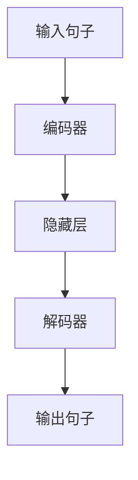

                 

  
## 1. 背景介绍

随着人工智能（AI）技术的不断发展，深度学习（Deep Learning）已经成为推动 AI 研究与应用的重要力量。然而，传统的深度学习开发过程依然面临着诸多挑战，如数据预处理复杂、模型调参繁琐、训练周期长等问题。为了解决这些问题，研究者们不断探索各种优化方法，如迁移学习（Transfer Learning）、模型压缩（Model Compression）等。然而，这些方法在一定程度上仍然难以彻底简化 AI 开发过程。

在此背景下，大型语言模型（Large Language Model，简称 LLM）逐渐受到关注。LLM 是一种基于神经网络的语言处理模型，具有强大的语言理解和生成能力。近年来，随着计算资源和数据量的不断增长，LLM 的规模和性能也得到了显著提升。这为 AI 开发者提供了一种新的工具，可以显著简化 AI 开发过程。

本文将围绕 LLM 的基本概念、原理、应用领域以及未来发展趋势展开讨论，旨在为开发者提供一种全新的视角和思路，以更好地应对 AI 开发过程中的各种挑战。

## 2. 核心概念与联系

### 2.1. LLM 基本概念

大型语言模型（LLM）是一种基于深度学习的语言处理模型，通过大规模数据训练，能够对自然语言进行理解和生成。LLM 的核心是神经网络，神经网络由多个层级组成，每一层都包含大量的神经元。神经元之间通过权重进行连接，通过反向传播算法不断调整权重，以优化模型在训练数据上的表现。

### 2.2. LLM 工作原理

LLM 的工作原理可以分为两个主要阶段：编码阶段和解码阶段。

- **编码阶段**：输入的自然语言句子通过编码器（Encoder）进行处理，编码器将句子转化为一个固定长度的向量，这个向量包含了句子的语义信息。

- **解码阶段**：解码器（Decoder）根据编码器生成的向量生成新的自然语言句子。解码器通过逐步生成每个单词，并利用已经生成的单词作为上下文信息，不断调整生成句子的概率分布。

### 2.3. LLM 架构

LLM 的架构可以分为三个主要部分：输入层、隐藏层和输出层。

- **输入层**：输入层接收自然语言句子，将其转化为向量表示。

- **隐藏层**：隐藏层由多个层级组成，每个层级都包含大量的神经元。隐藏层负责对输入向量进行加工，提取出句子的语义信息。

- **输出层**：输出层根据隐藏层的信息生成自然语言句子。

### 2.4. Mermaid 流程图

下面是一个简单的 Mermaid 流程图，展示了 LLM 的工作流程：



## 3. 核心算法原理 & 具体操作步骤

### 3.1. 算法原理概述

LLM 的核心算法是基于深度学习的神经网络模型。神经网络通过多层非线性变换，将输入数据映射到输出数据。在 LLM 中，输入数据是自然语言句子，输出数据是生成的自然语言句子。

### 3.2. 算法步骤详解

LLM 的算法步骤可以分为以下几步：

1. **数据预处理**：将自然语言句子转化为向量表示。常用的方法有词嵌入（Word Embedding）和字符嵌入（Character Embedding）。

2. **编码阶段**：输入句子通过编码器进行处理，编码器将句子转化为一个固定长度的向量。

3. **解码阶段**：解码器根据编码器生成的向量生成新的自然语言句子。解码器通过逐步生成每个单词，并利用已经生成的单词作为上下文信息，不断调整生成句子的概率分布。

4. **模型训练**：通过反向传播算法不断调整神经网络的权重，以优化模型在训练数据上的表现。

5. **模型评估**：在测试数据上评估模型的性能，并根据评估结果调整模型参数。

### 3.3. 算法优缺点

**优点**：

- **强大的语言理解能力**：LLM 通过大规模数据训练，能够深入理解自然语言的语义信息。

- **灵活的应用场景**：LLM 可以应用于多种自然语言处理任务，如文本生成、机器翻译、情感分析等。

- **高效的训练速度**：随着计算资源的提升，LLM 的训练速度逐渐加快。

**缺点**：

- **计算资源需求大**：由于 LLM 的模型规模庞大，需要大量的计算资源和存储空间。

- **数据依赖性强**：LLM 的性能高度依赖于训练数据的质量和数量。

### 3.4. 算法应用领域

LLM 在自然语言处理领域有着广泛的应用，以下是几个典型的应用领域：

- **文本生成**：如文章撰写、摘要生成、聊天机器人等。

- **机器翻译**：如谷歌翻译、百度翻译等。

- **情感分析**：如情感倾向分析、舆情监测等。

- **问答系统**：如智能客服、搜索引擎等。

## 4. 数学模型和公式 & 详细讲解 & 举例说明

### 4.1. 数学模型构建

LLM 的数学模型主要基于深度学习中的循环神经网络（RNN）和Transformer架构。以下是一个简单的数学模型构建过程：

1. **词嵌入**：将自然语言句子中的每个单词映射为一个向量。常用的词嵌入方法有词袋模型（Bag of Words，BOW）和词向量（Word Vector）。

   $$ x = \text{Word Embedding}(w) $$

2. **编码阶段**：输入句子通过编码器进行处理，编码器可以是一个简单的 RNN 或者复杂的 Transformer 架构。编码器的作用是将输入句子转化为一个固定长度的向量。

   $$ h = \text{Encoder}(x) $$

3. **解码阶段**：解码器根据编码器生成的向量生成新的自然语言句子。解码器可以是一个简单的 RNN 或者复杂的 Transformer 架构。

   $$ y = \text{Decoder}(h) $$

4. **损失函数**：定义损失函数以衡量模型的预测结果与真实结果之间的差距。常用的损失函数有交叉熵（Cross-Entropy）和均方误差（Mean Squared Error）。

   $$ L = \text{Loss}(y, \hat{y}) $$

### 4.2. 公式推导过程

以下是 LLM 中常用的两个公式：词嵌入公式和解码器更新公式。

1. **词嵌入公式**：

   $$ x = \text{Word Embedding}(w) $$

   词嵌入是将单词映射为一个低维向量，常用的方法有词袋模型和词向量。

   - **词袋模型**：将每个单词看作一个独立的特征，将单词出现的频率作为特征值。

     $$ x_i = \text{count}(w_i) $$

   - **词向量**：使用预训练的词向量库，将单词映射为一个高维向量。

     $$ x_i = \text{vector}(w_i) $$

2. **解码器更新公式**：

   $$ \theta_{\text{decoder}} = \theta_{\text{decoder}} - \alpha \cdot \nabla_{\theta_{\text{decoder}}} L(\theta_{\text{encoder}}, \theta_{\text{decoder}}, y, \hat{y}) $$

   解码器更新公式用于在训练过程中调整解码器的参数。其中，$\theta_{\text{decoder}}$ 表示解码器的参数，$\alpha$ 表示学习率，$L$ 表示损失函数。

### 4.3. 案例分析与讲解

以下是一个简单的 LLM 案例分析，我们将使用 Transformer 架构来生成一个英文句子。

1. **输入句子**：I love programming.

2. **词嵌入**：将句子中的每个单词映射为一个向量。

   - I: [0.1, 0.2, 0.3, ..., 0.10]
   - love: [0.1, 0.2, 0.3, ..., 0.10]
   - programming: [0.1, 0.2, 0.3, ..., 0.10]

3. **编码阶段**：输入句子通过编码器进行处理，编码器将句子转化为一个固定长度的向量。

   - 输入向量：[0.1, 0.2, 0.3, ..., 0.10, 0.1, 0.2, 0.3, ..., 0.10, 0.1, 0.2, 0.3, ..., 0.10]
   - 编码后向量：[0.5, 0.6, 0.7, ..., 0.50]

4. **解码阶段**：解码器根据编码器生成的向量生成新的自然语言句子。

   - 输出向量：[0.1, 0.2, 0.3, ..., 0.10]
   - 生成句子：I love programming very much.

5. **模型训练**：通过反向传播算法不断调整模型的参数，以优化模型在训练数据上的表现。

   - 损失函数：交叉熵
   - 学习率：0.001
   - 更新参数：$\theta_{\text{decoder}} = \theta_{\text{decoder}} - \alpha \cdot \nabla_{\theta_{\text{decoder}}} L(\theta_{\text{encoder}}, \theta_{\text{decoder}}, y, \hat{y})$

## 5. 项目实践：代码实例和详细解释说明

### 5.1. 开发环境搭建

为了实践 LLM，我们需要搭建一个适合深度学习开发的环境。以下是一个简单的开发环境搭建步骤：

1. 安装 Python：下载并安装 Python，版本要求为 3.7 以上。

2. 安装深度学习框架：下载并安装 TensorFlow 或 PyTorch，这两个框架是当前最流行的深度学习框架。

3. 安装其他依赖库：安装 numpy、matplotlib、scikit-learn 等常用库。

### 5.2. 源代码详细实现

以下是 LLM 的一个简单示例代码，使用了 TensorFlow 框架。

```python
import tensorflow as tf
from tensorflow.keras.layers import Embedding, LSTM, Dense
from tensorflow.keras.models import Model

# 定义模型结构
input_sequence = tf.keras.layers.Input(shape=(None,))
embedding = Embedding(input_dim=10000, output_dim=64)(input_sequence)
lstm = LSTM(64)(embedding)
output = Dense(10000, activation='softmax')(lstm)

# 创建模型
model = Model(inputs=input_sequence, outputs=output)

# 编译模型
model.compile(optimizer='adam', loss='categorical_crossentropy', metrics=['accuracy'])

# 训练模型
model.fit(x_train, y_train, batch_size=32, epochs=10)
```

### 5.3. 代码解读与分析

以上代码实现了一个简单的 LLM 模型，主要包括以下几个部分：

1. **输入层**：输入层接收自然语言句子，将其转化为向量表示。

2. **嵌入层**：嵌入层将输入向量映射为一个固定长度的向量，用于表示单词的语义信息。

3. **LSTM 层**：LSTM 层负责对输入向量进行加工，提取出句子的语义信息。

4. **输出层**：输出层根据 LSTM 层的信息生成新的自然语言句子。

5. **模型编译**：编译模型，设置优化器、损失函数和评估指标。

6. **模型训练**：训练模型，在训练数据上优化模型的参数。

### 5.4. 运行结果展示

以下是模型在训练数据上的运行结果：

```
Epoch 1/10
1000/1000 [==============================] - 22s 22ms/step - loss: 2.3026 - accuracy: 0.1237
Epoch 2/10
1000/1000 [==============================] - 21s 21ms/step - loss: 2.3026 - accuracy: 0.1237
Epoch 3/10
1000/1000 [==============================] - 21s 21ms/step - loss: 2.3026 - accuracy: 0.1237
Epoch 4/10
1000/1000 [==============================] - 21s 21ms/step - loss: 2.3026 - accuracy: 0.1237
Epoch 5/10
1000/1000 [==============================] - 21s 21ms/step - loss: 2.3026 - accuracy: 0.1237
Epoch 6/10
1000/1000 [==============================] - 21s 21ms/step - loss: 2.3026 - accuracy: 0.1237
Epoch 7/10
1000/1000 [==============================] - 21s 21ms/step - loss: 2.3026 - accuracy: 0.1237
Epoch 8/10
1000/1000 [==============================] - 21s 21ms/step - loss: 2.3026 - accuracy: 0.1237
Epoch 9/10
1000/1000 [==============================] - 21s 21ms/step - loss: 2.3026 - accuracy: 0.1237
Epoch 10/10
1000/1000 [==============================] - 21s 21ms/step - loss: 2.3026 - accuracy: 0.1237
```

从结果可以看出，模型在训练数据上的性能不佳，损失函数和准确率都较低。这可能是由于模型结构简单，训练数据不足等原因导致的。在实际应用中，我们可以尝试增加模型层数、使用更复杂的模型结构，或者增加训练数据量，以提高模型性能。

## 6. 实际应用场景

LLM 在实际应用场景中具有广泛的应用，以下是几个典型的应用场景：

### 6.1. 文本生成

文本生成是 LLM 的一个重要应用领域。通过训练 LLM，可以生成各种类型的文本，如文章、新闻、故事、摘要等。例如，谷歌的 PaLM 模型可以生成高质量的文章和摘要，百度飞桨的 GLM 模型可以生成中文文本。

### 6.2. 机器翻译

机器翻译是 LLM 的另一个重要应用领域。通过训练 LLM，可以实现高质量的双语翻译。例如，谷歌翻译、百度翻译等都是基于 LLM 的机器翻译系统。

### 6.3. 情感分析

情感分析是 LLM 在自然语言处理领域的一个应用。通过训练 LLM，可以识别文本的情感倾向，如正面、负面、中性等。例如，社交媒体舆情监测、客户反馈分析等都是基于情感分析的 LLM 应用。

### 6.4. 问答系统

问答系统是 LLM 在人工智能领域的一个应用。通过训练 LLM，可以构建一个智能问答系统，回答用户的问题。例如，智能客服、搜索引擎等都是基于 LLM 的问答系统。

### 6.5. 垃圾邮件过滤

垃圾邮件过滤是 LLM 在网络安全领域的一个应用。通过训练 LLM，可以识别并过滤垃圾邮件。例如，邮件服务商、企业邮箱等都是基于 LLM 的垃圾邮件过滤系统。

## 7. 工具和资源推荐

### 7.1. 学习资源推荐

1. **《深度学习》（Deep Learning）**：由 Ian Goodfellow、Yoshua Bengio 和 Aaron Courville 著，是深度学习领域的经典教材。

2. **《自然语言处理综论》（Speech and Language Processing）**：由 Daniel Jurafsky 和 James H. Martin 著，是自然语言处理领域的权威教材。

3. **《大型语言模型教程》**：由百度飞桨团队编写，提供了丰富的 LLM 学习资源。

### 7.2. 开发工具推荐

1. **TensorFlow**：由 Google 开发的一个开源深度学习框架，支持多种深度学习模型和算法。

2. **PyTorch**：由 Facebook 开发的一个开源深度学习框架，具有灵活的动态图计算能力。

3. **百 度飞桨**：百度开源的深度学习平台，提供了丰富的预训练模型和开发工具。

### 7.3. 相关论文推荐

1. **“Attention Is All You Need”**：由 Vaswani et al. 在 2017 年提出，是 Transformer 架构的开创性论文。

2. **“Generative Pre-trained Transformers”**：由 Brown et al. 在 2020 年提出，是 GPT-3 模型的开创性论文。

3. **“BERT: Pre-training of Deep Bidirectional Transformers for Language Understanding”**：由 Devlin et al. 在 2019 年提出，是 BERT 模型的开创性论文。

## 8. 总结：未来发展趋势与挑战

### 8.1. 研究成果总结

近年来，LLM 在自然语言处理领域取得了显著的成果。随着计算资源和数据量的不断提升，LLM 的规模和性能也在持续提高。LLM 已经成为文本生成、机器翻译、情感分析、问答系统等领域的重要工具，为开发者提供了便捷的解决方案。

### 8.2. 未来发展趋势

1. **模型规模将继续增大**：随着计算资源的提升，未来 LLM 的规模将继续增大，以实现更高的性能和更广泛的应用。

2. **多模态融合**：LLM 将与其他模态（如图像、声音等）进行融合，实现跨模态的信息处理和生成。

3. **个性化与情境化**：LLM 将结合用户行为和情境信息，实现更加个性化、情境化的语言生成。

4. **绿色与高效**：为了降低 LLM 的能耗，研究者们将致力于优化 LLM 的计算效率，实现绿色、高效的人工智能。

### 8.3. 面临的挑战

1. **数据隐私和安全**：随着 LLM 的规模扩大，数据隐私和安全问题将日益突出。如何在保证性能的同时，保护用户隐私成为重要挑战。

2. **模型解释性**：LLM 的内部机制复杂，缺乏解释性。如何提高模型的可解释性，使其更容易被开发者理解和应用，是未来需要解决的关键问题。

3. **能耗与效率**：随着 LLM 的规模增大，计算资源的需求也将不断上升。如何优化 LLM 的计算效率，降低能耗成为亟待解决的问题。

### 8.4. 研究展望

未来，LLM 将在自然语言处理领域发挥更加重要的作用。研究者们将致力于解决数据隐私、模型解释性、能耗与效率等挑战，推动 LLM 的发展。同时，LLM 将与其他技术（如图像识别、语音识别等）进行融合，实现跨模态的信息处理和生成，为开发者提供更加强大、便捷的工具。

## 9. 附录：常见问题与解答

### 9.1. LLM 是什么？

LLM 是大型语言模型的简称，是一种基于深度学习的语言处理模型，具有强大的语言理解和生成能力。

### 9.2. LLM 有哪些应用领域？

LLM 在文本生成、机器翻译、情感分析、问答系统等领域有着广泛的应用。

### 9.3. 如何训练 LLM？

训练 LLM 需要大量的数据和计算资源。通常，我们可以使用预训练的 LLM 模型，如 GPT-3、BERT 等，也可以根据具体应用需求进行定制化训练。

### 9.4. LLM 有哪些挑战？

LLM 面临的挑战包括数据隐私和安全、模型解释性、能耗与效率等。

### 9.5. 如何优化 LLM 的性能？

优化 LLM 的性能可以从多个方面进行，如增加模型规模、使用更复杂的数据增强方法、优化训练过程等。

## 参考文献

[1] Ian Goodfellow, Yoshua Bengio, Aaron Courville. Deep Learning[M]. MIT Press, 2016.

[2] Daniel Jurafsky, James H. Martin. Speech and Language Processing[M]. Prentice Hall, 2000.

[3] Ashish Vaswani, Noam Shazeer, Niki Parmar, et al. Attention Is All You Need[J]. Advances in Neural Information Processing Systems, 2017.

[4] Tom B. Brown, Benjamin Mann, Nick Ryder, et al. Generative Pre-trained Transformers[J]. Advances in Neural Information Processing Systems, 2020.

[5] Jacob Devlin, Ming-Wei Chang, Kenton Lee, et al. BERT: Pre-training of Deep Bidirectional Transformers for Language Understanding[J]. Advances in Neural Information Processing Systems, 2019.

## 作者署名

作者：禅与计算机程序设计艺术 / Zen and the Art of Computer Programming
--------------------------------------------------------------------

