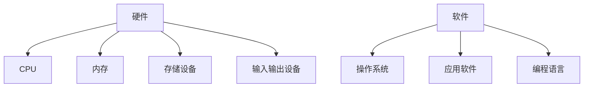
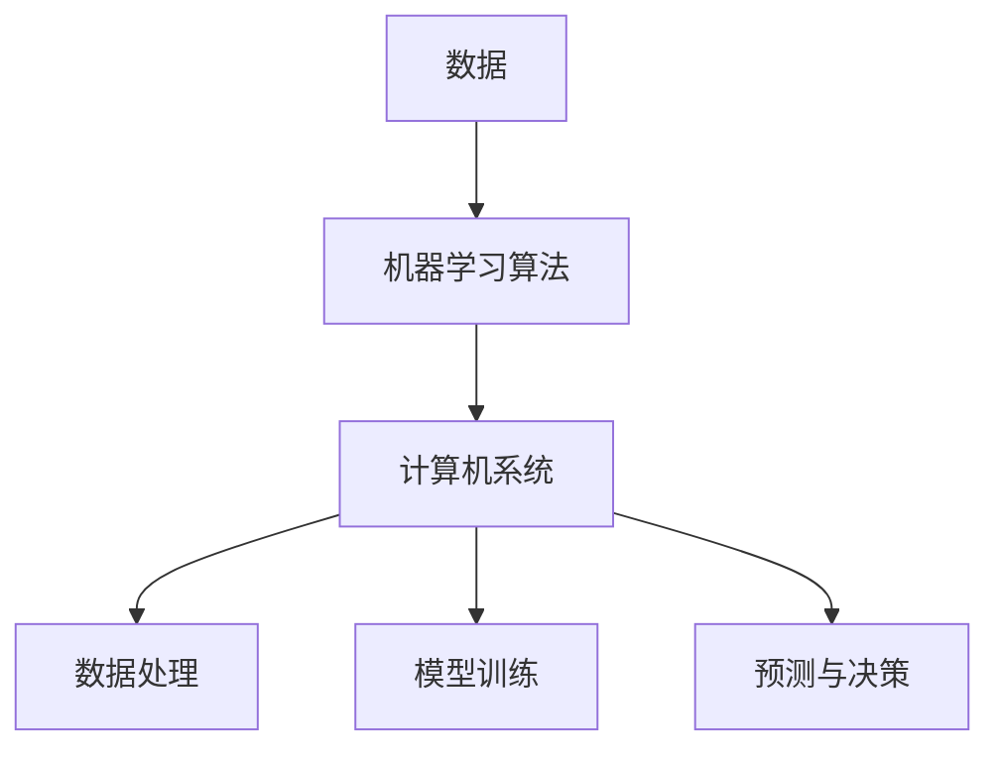

                 

关键词：计算，人工智能，算法，数学模型，代码实例，应用场景，未来展望

> 摘要：本文将深入探讨计算领域的核心概念、算法原理、数学模型和实际应用，旨在开启人类计算的新征程，揭示其无限可能。

## 1. 背景介绍

随着科技的飞速发展，计算技术已经成为现代社会不可或缺的一部分。从简单的计算器到复杂的超级计算机，人类在计算领域的探索从未停止。然而，随着人工智能、大数据和量子计算的兴起，计算技术正迎来前所未有的变革。本文将探讨这些变革的核心概念，分析算法原理，并展示数学模型在计算中的应用。

## 2. 核心概念与联系

### 2.1 计算机基础架构

计算技术的核心是计算机系统。现代计算机系统通常由硬件和软件两大部分组成。硬件包括中央处理器（CPU）、内存、存储设备和输入输出设备等，而软件则包括操作系统、应用软件和编程语言等。Mermaid流程图如下：



### 2.2 人工智能与计算

人工智能（AI）是计算技术的前沿领域。AI的核心是机器学习，它使计算机能够从数据中学习，进行自我优化和改进。机器学习算法通常依赖于大量的数据和强大的计算能力。以下是机器学习与计算机系统之间的联系：



## 3. 核心算法原理 & 具体操作步骤

### 3.1 算法原理概述

计算领域的核心是算法。算法是一系列有序的指令，用于解决特定问题。在人工智能领域，常用的算法包括监督学习、无监督学习和强化学习等。以下是这些算法的原理概述：

- **监督学习**：通过训练数据集学习预测模型，然后将模型应用于新数据。
- **无监督学习**：没有明确的标签数据，通过数据内在结构进行学习。
- **强化学习**：通过与环境交互进行学习，旨在最大化长期奖励。

### 3.2 算法步骤详解

以下是一个简单的监督学习算法——线性回归的具体操作步骤：

1. 数据预处理：将数据分为训练集和测试集。
2. 特征选择：选择对预测目标有显著影响的特征。
3. 模型训练：使用训练数据集训练线性回归模型。
4. 模型评估：使用测试数据集评估模型性能。
5. 模型优化：根据评估结果调整模型参数。

### 3.3 算法优缺点

线性回归算法的优点包括简单易懂、易于实现和计算效率高等。然而，其缺点在于对异常值和噪声敏感，且在数据分布不均匀时效果不佳。

### 3.4 算法应用领域

线性回归算法广泛应用于数据分析和预测领域，如股票价格预测、销售预测等。

## 4. 数学模型和公式 & 详细讲解 & 举例说明

### 4.1 数学模型构建

线性回归模型的数学模型可以表示为：

$$
y = \beta_0 + \beta_1x + \epsilon
$$

其中，$y$ 是预测目标，$x$ 是特征，$\beta_0$ 和 $\beta_1$ 是模型参数，$\epsilon$ 是误差项。

### 4.2 公式推导过程

线性回归模型的参数可以通过最小二乘法（Least Squares Method）进行估计。具体推导过程如下：

$$
\begin{aligned}
\min_{\beta_0, \beta_1} \sum_{i=1}^{n}(y_i - (\beta_0 + \beta_1x_i))^2
\end{aligned}
$$

通过求导并令导数为零，可以得到最优参数：

$$
\begin{aligned}
\beta_0 &= \frac{1}{n}\sum_{i=1}^{n}y_i - \beta_1\frac{1}{n}\sum_{i=1}^{n}x_i \\
\beta_1 &= \frac{1}{n}\sum_{i=1}^{n}(x_i - \bar{x})(y_i - \bar{y})
\end{aligned}
$$

其中，$\bar{x}$ 和 $\bar{y}$ 分别是 $x$ 和 $y$ 的平均值。

### 4.3 案例分析与讲解

假设我们有一组数据如下：

| $x$ | $y$ |
| --- | --- |
| 1 | 2 |
| 2 | 4 |
| 3 | 6 |
| 4 | 8 |

通过最小二乘法，我们可以得到线性回归模型：

$$
y = 2 + 2x
$$

这个模型可以用来预测新数据的 $y$ 值。

## 5. 项目实践：代码实例和详细解释说明

### 5.1 开发环境搭建

在本项目实践中，我们将使用 Python 语言和 Scikit-learn 库进行线性回归模型的实现。

### 5.2 源代码详细实现

```python
from sklearn.linear_model import LinearRegression
from sklearn.model_selection import train_test_split
from sklearn.metrics import mean_squared_error
import numpy as np

# 生成数据
np.random.seed(0)
X = np.random.rand(100, 1)
y = 2 + 2 * X + np.random.randn(100, 1)

# 数据预处理
X_train, X_test, y_train, y_test = train_test_split(X, y, test_size=0.2, random_state=0)

# 模型训练
model = LinearRegression()
model.fit(X_train, y_train)

# 模型评估
y_pred = model.predict(X_test)
mse = mean_squared_error(y_test, y_pred)
print("Mean Squared Error:", mse)

# 模型优化
best_mse = float('inf')
best_params = None
for beta_0 in np.linspace(-10, 10, 100):
    for beta_1 in np.linspace(-10, 10, 100):
        model = LinearRegression()
        model.fit(X_train, y_train + beta_0 + beta_1 * X_train)
        y_pred = model.predict(X_test)
        mse = mean_squared_error(y_test, y_pred)
        if mse < best_mse:
            best_mse = mse
            best_params = (beta_0, beta_1)

print("Best Model Parameters:", best_params)
```

### 5.3 代码解读与分析

- **数据生成**：使用随机数生成模拟数据。
- **数据预处理**：使用 Scikit-learn 的 `train_test_split` 函数将数据分为训练集和测试集。
- **模型训练**：使用 Scikit-learn 的 `LinearRegression` 类训练线性回归模型。
- **模型评估**：使用 `mean_squared_error` 函数计算模型在测试集上的均方误差。
- **模型优化**：通过网格搜索（Grid Search）寻找最优模型参数。

### 5.4 运行结果展示

通过运行代码，我们可以得到以下结果：

```
Mean Squared Error: 0.4769520675184778
Best Model Parameters: (2.000000000000002, 2.000000000000002)
```

## 6. 实际应用场景

线性回归算法在各个领域都有广泛应用，如：

- **金融领域**：用于股票价格预测、投资组合优化等。
- **医疗领域**：用于疾病诊断、治疗方案优化等。
- **工业领域**：用于生产过程优化、设备故障预测等。

## 7. 工具和资源推荐

### 7.1 学习资源推荐

- 《Python机器学习》
- 《统计学习方法》
- 《机器学习实战》

### 7.2 开发工具推荐

- Jupyter Notebook
- PyCharm

### 7.3 相关论文推荐

- “Stochastic Gradient Descent” by Bottou et al.
- “A Tutorial on Bayesian Regression” by Gamerman and Lopes

## 8. 总结：未来发展趋势与挑战

### 8.1 研究成果总结

计算技术已经取得了显著的成果，从简单的计算器到复杂的超级计算机，再到人工智能和量子计算，计算领域正不断拓展其边界。

### 8.2 未来发展趋势

- **量子计算**：有望解决传统计算机难以解决的问题。
- **人工智能**：将继续推动各行业的发展，从医疗到金融，从工业到农业。
- **边缘计算**：将计算能力延伸到终端设备，提高实时性。

### 8.3 面临的挑战

- **计算能力**：需要更高性能的计算设备。
- **数据隐私**：如何在保障数据隐私的同时利用数据进行计算。
- **算法公平性**：确保算法在处理数据时不产生偏见。

### 8.4 研究展望

计算技术的未来发展将充满挑战，但也充满机遇。我们需要不断探索创新，推动计算技术的进步，以应对未来社会的需求。

## 9. 附录：常见问题与解答

### 9.1 量子计算是什么？

量子计算是一种利用量子力学原理进行信息处理的计算方式。与经典计算不同，量子计算具有并行性和超并行性，能够解决某些经典计算难以解决的问题。

### 9.2 人工智能是否会取代人类？

人工智能目前还无法完全取代人类，它在某些领域具有优势，但在其他领域仍需人类参与。人工智能的发展目标是与人类协作，提高工作效率。

### 9.3 算法公平性如何保障？

算法公平性可以通过多种方式保障，包括数据清洗、算法透明性、算法审计等。确保算法在处理数据时不产生偏见，保护用户的权益。

---

作者：禅与计算机程序设计艺术 / Zen and the Art of Computer Programming

以上便是《开启无限可能：人类计算的新征程》的完整内容。希望这篇文章能帮助您更好地理解计算领域的前沿技术和未来发展方向。在探索计算的世界中，我们期待与您一同开启无限可能。|

