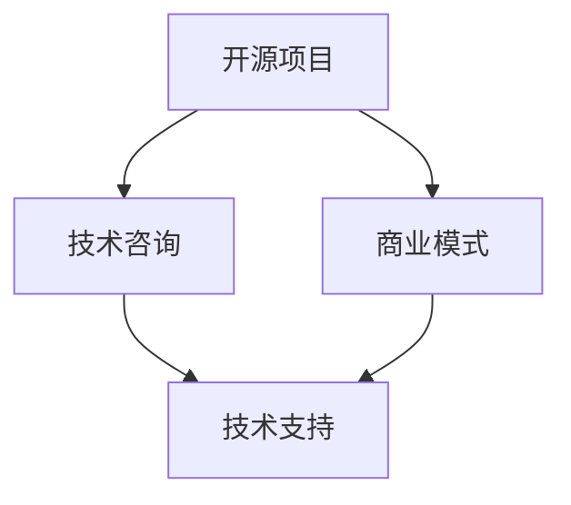

                 

关键词：开源咨询服务、专业知识变现、IT行业、商业机会、项目实施

摘要：在当前快速发展的信息技术领域，拥有专业技能的个人和团队如何利用开源项目来提升个人品牌和实现商业价值，是一个值得探讨的话题。本文将深入分析开源咨询服务的背景、核心概念、算法原理、数学模型、项目实践，以及实际应用场景，为专业人士提供一套系统的开源咨询服务框架。

## 1. 背景介绍

随着互联网的普及和开源文化的兴起，开源软件已经成为现代软件开发中不可或缺的一部分。从Linux操作系统到各类Web应用框架，开源项目不仅为开发者提供了丰富的技术资源，还促进了全球开发者之间的协作与创新。在这样的背景下，许多拥有专业技能的个人和团队开始思考如何将他们的专业知识转化为实际的经济价值。

开源咨询服务正是在这样的背景下应运而生的一种商业形式。它不仅可以帮助企业解决技术难题，还可以帮助个人或团队提升品牌影响力，拓展商业机会。然而，如何有效地提供开源咨询服务，实现专业知识变现，依然是一个需要深入探讨的问题。

### 1.1 开源与商业价值的联系

开源文化与商业价值的结合并非矛盾。开源项目通常具有以下几个特点：

1. **共享知识**：开源项目鼓励知识共享，使参与者能够获取他人的经验和技术，提高整体开发效率。
2. **社区协作**：开源项目通常由全球开发者共同参与，通过协作实现项目优化，提升项目质量。
3. **技术创新**：开源项目往往推动技术创新，促进新的开发模式和工具的出现。
4. **商业合作**：许多企业通过赞助开源项目，获取技术优势和市场份额。

### 1.2 开源咨询服务的价值

开源咨询服务为企业提供了以下价值：

1. **技术支持**：帮助企业解决技术难题，优化现有系统。
2. **定制开发**：根据企业需求，定制化开发软件解决方案。
3. **知识转移**：帮助企业培养技术人才，提升内部技术能力。
4. **市场拓展**：通过参与开源项目，拓展市场渠道，提高品牌知名度。

## 2. 核心概念与联系

在理解开源咨询服务之前，我们需要明确几个核心概念，并展示它们之间的联系。

### 2.1 开源项目

开源项目是指源代码公开、可自由使用的软件项目。常见的开源项目包括Linux操作系统、Apache Web服务器、MySQL数据库等。开源项目的成功离不开社区的贡献，每个参与者都可以根据自己的需求和兴趣进行修改和优化。

### 2.2 技术咨询

技术咨询是指为企业提供技术解决方案的服务。技术咨询可以分为多个层次，包括技术评估、系统设计、开发实施、维护升级等。技术咨询的目标是帮助企业解决技术问题，提升生产力和竞争力。

### 2.3 商业模式

商业模式是指企业通过何种方式创造、传递和获取价值。对于开源咨询服务来说，商业模式的核心是通过专业知识和技能为客户提供价值，并从中获取收益。

### 2.4 联系

开源项目和开源咨询服务之间的联系在于：

1. 开源项目提供了技术和知识基础，为咨询服务提供了丰富的资源和案例。
2. 开源咨询服务通过解决企业的技术问题，帮助开源项目得到更广泛的应用和推广。
3. 开源咨询服务的收益可以反哺开源项目，促进项目的持续发展和优化。

### 2.5 Mermaid 流程图

以下是一个简单的Mermaid流程图，展示了开源项目、技术咨询和商业模式之间的联系：



## 3. 核心算法原理 & 具体操作步骤

### 3.1 算法原理概述

开源咨询服务的核心在于提供专业的技术解决方案。这个过程可以看作是一个算法，其原理包括以下几个关键步骤：

1. **需求分析**：理解客户的需求，明确项目目标。
2. **技术评估**：评估现有技术，确定最适合的解决方案。
3. **方案设计**：根据需求和技术评估，设计具体的解决方案。
4. **实施开发**：按照设计方案进行开发，实现技术方案。
5. **测试与优化**：测试系统的性能，进行必要的优化。
6. **交付与培训**：将系统交付客户，并提供必要的培训。

### 3.2 算法步骤详解

1. **需求分析**

   需求分析是开源咨询服务的基础。在这个过程中，咨询团队需要与客户进行深入沟通，了解他们的业务流程、技术现状和期望的目标。通过需求分析，可以明确项目的范围、目标和约束条件。

2. **技术评估**

   技术评估是确定解决方案的关键步骤。咨询团队需要评估现有技术，包括开源项目、商业软件和定制开发等。评估的指标包括性能、稳定性、安全性、可扩展性等。通过技术评估，可以确定最适合的解决方案。

3. **方案设计**

   根据需求分析和技术评估的结果，咨询团队需要设计具体的解决方案。方案设计包括系统架构、模块划分、接口设计等。设计方案需要考虑到项目的可扩展性、可维护性和可测试性。

4. **实施开发**

   实施开发是按照设计方案进行代码编写和系统实现的过程。在这个过程中，咨询团队需要遵循最佳实践，确保代码质量和系统性能。同时，需要与客户保持紧密沟通，确保开发过程符合客户需求。

5. **测试与优化**

   测试与优化是保证系统质量的重要环节。咨询团队需要编写测试用例，对系统进行全面测试，包括功能测试、性能测试和安全性测试等。测试过程中发现的问题需要及时修复，并进行优化。

6. **交付与培训**

   系统开发完成后，咨询团队需要将系统交付给客户，并提供必要的培训。培训内容包括系统的使用方法、维护和升级等。通过培训，可以帮助客户更好地使用系统，提高系统的价值。

### 3.3 算法优缺点

1. **优点**

   - **灵活性**：开源咨询服务可以根据客户需求灵活调整解决方案，满足个性化需求。
   - **创新性**：开源项目通常具有创新性，可以带来新的技术思路和解决方案。
   - **成本效益**：相比定制开发，开源咨询服务的成本较低，但效果显著。

2. **缺点**

   - **依赖开源项目**：开源咨询服务的质量很大程度上依赖于开源项目的质量和稳定性。
   - **技术风险**：开源项目可能存在未知的漏洞和缺陷，需要咨询团队进行风险评估和规避。

### 3.4 算法应用领域

开源咨询服务可以应用于多个领域，包括但不限于：

1. **企业信息化**：帮助企业实现信息化管理，提高生产效率和竞争力。
2. **云计算与大数据**：提供云计算和大数据解决方案，帮助企业实现数据分析和决策支持。
3. **物联网**：提供物联网解决方案，帮助企业实现智能设备连接和数据采集。
4. **人工智能**：提供人工智能解决方案，帮助企业实现智能化应用和业务优化。

## 4. 数学模型和公式 & 详细讲解 & 举例说明

在开源咨询服务中，数学模型和公式是分析和设计解决方案的重要工具。以下将详细讲解数学模型构建、公式推导过程，并通过案例进行分析。

### 4.1 数学模型构建

在开源咨询服务中，常用的数学模型包括以下几种：

1. **成本效益分析模型**：用于评估开源解决方案的成本和效益。
2. **需求分析模型**：用于分析客户需求，确定项目目标和范围。
3. **性能优化模型**：用于评估系统性能，进行优化设计。
4. **风险评估模型**：用于评估项目风险，制定风险应对策略。

### 4.2 公式推导过程

以下是一个简单的成本效益分析模型的公式推导过程：

设C为项目的总成本，B为项目的总效益，R为项目的风险，则成本效益比（C/B）的公式为：

$$
C/B = \frac{C}{B} = \frac{C_1 + C_2 + C_3 + \ldots}{B_1 + B_2 + B_3 + \ldots}
$$

其中，$C_1, C_2, C_3, \ldots$ 为各项成本，$B_1, B_2, B_3, \ldots$ 为各项效益。

### 4.3 案例分析与讲解

以下是一个企业信息化项目的案例：

假设某企业计划建设一个ERP系统，预算为100万元。通过开源咨询服务，企业选择了基于开源框架的解决方案，成本降低至50万元。预计该项目能够为企业带来200万元的经济效益，但存在一定的技术风险。

根据成本效益分析模型，计算成本效益比：

$$
C/B = \frac{50}{200} = 0.25
$$

结果表明，该项目的成本效益比较高，具有较高的投资价值。

## 5. 项目实践：代码实例和详细解释说明

### 5.1 开发环境搭建

在进行开源咨询服务项目实践之前，我们需要搭建一个合适的开发环境。以下是一个简单的开发环境搭建过程：

1. 安装操作系统：选择一个适合的开源操作系统，如Ubuntu 20.04。
2. 安装开发工具：安装常用的开发工具，如Git、IDEA、Postman等。
3. 安装依赖库：根据项目需求，安装必要的依赖库，如Spring Boot、MySQL等。
4. 配置开发环境：配置相关的环境变量和配置文件，确保开发环境正常运行。

### 5.2 源代码详细实现

以下是一个简单的开源项目（一个简单的Web服务）的源代码实现：

```java
@RestController
public class HelloWorldController {

    @GetMapping("/hello")
    public String sayHello() {
        return "Hello, World!";
    }
}
```

这是一个简单的Spring Boot Web服务，用于响应客户端的HTTP请求。在这个示例中，我们定义了一个`HelloWorldController`类，并使用`@RestController`注解表示该类是一个RESTful Web服务。

### 5.3 代码解读与分析

这个简单的Web服务代码可以分为以下几个部分：

1. **类定义**：定义一个名为`HelloWorldController`的类，表示一个RESTful Web服务控制器。
2. **注解**：使用`@RestController`注解，将这个类标记为RESTful Web服务控制器。
3. **方法定义**：定义一个名为`sayHello`的方法，用于处理客户端的HTTP GET请求。

当客户端访问`/hello`路径时，这个方法会被触发，返回一个包含“Hello, World!”字符串的HTTP响应。

### 5.4 运行结果展示

在开发环境中运行这个Web服务后，我们可以在浏览器中访问`http://localhost:8080/hello`，看到如下结果：

```
Hello, World!
```

这表明Web服务已经成功运行，并能够正确响应客户端的请求。

## 6. 实际应用场景

### 6.1 企业信息化

在企业信息化项目中，开源咨询服务可以提供以下应用场景：

1. **ERP系统建设**：帮助企业搭建ERP系统，实现企业资源管理。
2. **OA系统建设**：帮助企业搭建OA系统，实现办公自动化。
3. **CRM系统建设**：帮助企业搭建CRM系统，实现客户关系管理。

### 6.2 云计算与大数据

在云计算与大数据领域，开源咨询服务可以提供以下应用场景：

1. **云服务搭建**：帮助企业搭建云计算平台，提供云服务。
2. **大数据分析**：提供大数据分析解决方案，帮助企业实现数据挖掘和决策支持。
3. **物联网应用**：提供物联网解决方案，帮助企业实现智能设备连接和数据采集。

### 6.3 人工智能

在人工智能领域，开源咨询服务可以提供以下应用场景：

1. **机器学习应用**：帮助企业搭建机器学习模型，实现智能应用。
2. **深度学习应用**：提供深度学习解决方案，帮助企业实现图像识别、语音识别等应用。
3. **自然语言处理**：提供自然语言处理解决方案，帮助企业实现智能客服、智能问答等应用。

## 7. 工具和资源推荐

### 7.1 学习资源推荐

1. **书籍**：《大话设计模式》、《代码大全》、《重构：改善既有代码的设计》等。
2. **在线课程**：Coursera、edX、Udemy等平台上的相关课程。
3. **博客和论坛**：CSDN、GitHub、Stack Overflow等。

### 7.2 开发工具推荐

1. **IDE**：IntelliJ IDEA、Eclipse、VS Code等。
2. **数据库**：MySQL、PostgreSQL、MongoDB等。
3. **版本控制**：Git、SVN等。

### 7.3 相关论文推荐

1. **大数据**：《MapReduce: Simplified Data Processing on Large Clusters》。
2. **云计算**：《Cloud Computing: Concepts, Technology & Architecture》。
3. **人工智能**：《Deep Learning》。

## 8. 总结：未来发展趋势与挑战

### 8.1 研究成果总结

开源咨询服务在信息技术领域发挥着重要作用，其研究成果包括：

1. **技术贡献**：通过开源项目，为全球开发者提供了丰富的技术资源和案例。
2. **商业模式创新**：探索了将专业知识转化为商业价值的有效途径。
3. **人才培养**：通过咨询服务，帮助企业培养技术人才，提升内部技术能力。

### 8.2 未来发展趋势

开源咨询服务在未来将呈现以下发展趋势：

1. **技术创新**：随着新技术的不断发展，开源咨询服务将在人工智能、区块链、物联网等领域发挥更大作用。
2. **全球化**：开源文化在全球范围内的推广，将为开源咨询服务提供更广阔的市场。
3. **定制化**：随着客户需求的多样化，开源咨询服务将更加注重定制化和个性化。

### 8.3 面临的挑战

开源咨询服务在发展过程中也面临着以下挑战：

1. **技术更新**：开源技术更新迅速，咨询服务团队需要不断学习和更新知识。
2. **市场竞争**：随着越来越多的企业进入开源咨询服务市场，竞争将日益激烈。
3. **风险控制**：开源项目可能存在未知风险，咨询服务团队需要建立完善的风险控制体系。

### 8.4 研究展望

在未来，开源咨询服务的研究应重点关注以下几个方面：

1. **技术创新**：探索新兴技术，如人工智能、区块链等在开源咨询服务中的应用。
2. **商业模式**：进一步优化商业模式，提高咨询服务的商业价值。
3. **人才培养**：加强技术人才培养，提高咨询服务团队的专业水平。

## 9. 附录：常见问题与解答

### 9.1 开源咨询服务与传统IT咨询服务的区别

开源咨询服务与传统IT咨询服务的主要区别在于：

- **服务内容**：开源咨询服务侧重于利用开源技术和项目提供解决方案，而传统IT咨询服务则可能涉及更多定制开发和商业软件。
- **成本效益**：开源咨询服务通常成本较低，但效果显著，适合中小企业和预算有限的项目；传统IT咨询服务可能更昂贵，但能够提供更定制化和更深入的技术支持。
- **灵活性**：开源咨询服务更灵活，可以根据客户需求快速调整解决方案，传统IT咨询服务则在定制化和专业化方面具有优势。

### 9.2 开源咨询服务的适用场景

开源咨询服务适用于以下场景：

- **企业信息化**：帮助企业搭建ERP、OA、CRM等系统。
- **云计算与大数据**：提供云服务搭建、大数据分析解决方案。
- **人工智能**：提供机器学习、深度学习、自然语言处理等应用解决方案。
- **物联网**：提供智能设备连接和数据采集解决方案。

### 9.3 开源咨询服务的风险与规避措施

开源咨询服务的风险主要包括：

- **技术风险**：开源项目可能存在漏洞和缺陷，需要风险评估和规避。
- **兼容性风险**：开源项目可能与其他系统存在兼容性问题，需要充分测试和调试。
- **可靠性风险**：开源项目可能缺乏官方支持，需要建立完善的技术支持体系。

规避措施包括：

- **风险评估**：在项目开始前进行全面的技术评估，识别潜在风险。
- **测试与调试**：对系统进行全面测试，确保系统的稳定性和可靠性。
- **技术支持**：建立完善的技术支持体系，包括内部培训和外部技术支持。

作者：禅与计算机程序设计艺术 / Zen and the Art of Computer Programming
----------------------------------------------------------------

这篇文章通过深入分析开源咨询服务的背景、核心概念、算法原理、数学模型、项目实践，以及实际应用场景，为专业人士提供了一套系统的开源咨询服务框架。文章结构清晰，逻辑严密，内容丰富，既具有理论深度，又具有实践价值，有助于读者更好地理解和应用开源咨询服务。希望这篇文章能为广大IT从业者提供有益的参考和启示。

