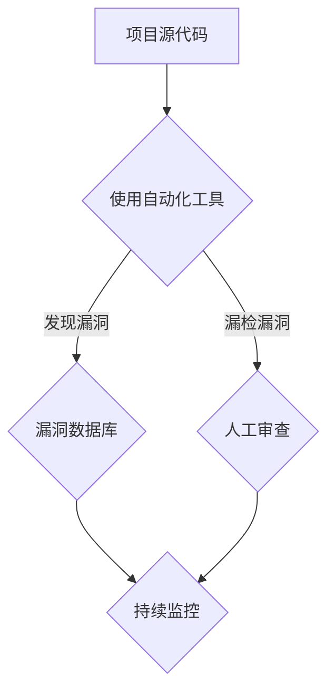

                 

关键词：开源安全审计，专业化服务，代码审查，漏洞检测，自动化工具，安全漏洞，软件开发，风险控制。

> 摘要：本文深入探讨了开源安全审计这一专业领域，分析了其重要性、现状和未来发展趋势。通过讨论开源项目的安全漏洞、自动化审计工具的应用，以及专业化服务市场的前景，本文为软件开发者和安全从业者提供了有价值的参考和指导。

## 1. 背景介绍

在当今数字化时代，软件已经成为企业和个人日常生活的重要组成部分。而开源软件以其自由、开放、协作的特点，在全球范围内得到了广泛应用。然而，随着开源软件的普及，其安全漏洞问题也日益凸显。开源安全审计作为一种专业化的服务，旨在通过系统化的方法检测和修复开源项目中的安全漏洞，为软件的稳定性和安全性提供保障。

开源安全审计的重要性主要体现在以下几个方面：

1. **风险控制**：开源软件的漏洞可能会被恶意利用，导致数据泄露、系统瘫痪等严重后果。通过安全审计，可以及时发现并修复漏洞，降低风险。

2. **合规要求**：许多组织和企业在软件开发过程中需要遵守特定的安全标准和法规要求。开源安全审计可以帮助企业确保其软件符合合规要求。

3. **提升软件质量**：安全审计不仅关注漏洞的发现和修复，还能提高代码的质量和可维护性，从而提高软件的整体稳定性。

4. **增强用户信任**：通过开源安全审计，开源项目可以展现其安全性，增强用户对项目的信任。

## 2. 核心概念与联系

### 2.1 开源安全审计的定义

开源安全审计是一种基于系统化的方法，对开源项目进行安全漏洞检测、评估和修复的服务。它包括以下几个核心环节：

1. **漏洞检测**：使用自动化工具或手动审查方法，识别项目中可能存在的安全漏洞。

2. **漏洞评估**：对检测到的漏洞进行优先级和风险等级评估，确定修复的优先顺序。

3. **漏洞修复**：根据评估结果，对漏洞进行修复，确保项目的安全性。

4. **持续监控**：在项目开发过程中持续进行安全审计，确保新的漏洞得到及时发现和修复。

### 2.2 开源安全审计与代码审查的关系

开源安全审计与代码审查有相似之处，但二者也存在区别。代码审查主要关注代码的语法、逻辑和设计，而开源安全审计则专注于代码的安全性。代码审查可以发现潜在的编程错误和安全漏洞，而开源安全审计则更侧重于漏洞的检测、评估和修复。

### 2.3 开源安全审计的架构

开源安全审计的架构通常包括以下几个层次：

1. **自动化工具**：使用如SonarQube、Checkmarx等自动化工具进行代码扫描，快速识别潜在的安全漏洞。

2. **人工审查**：结合人工审查，对自动化工具漏检的部分进行深入分析，确保所有潜在的安全问题得到解决。

3. **漏洞数据库**：建立漏洞数据库，记录已发现的安全漏洞及其修复情况，为后续审计提供参考。

4. **持续集成/持续部署（CI/CD）**：将安全审计集成到CI/CD流程中，实现自动化审计和修复。

### 2.4 Mermaid 流程图



## 3. 核心算法原理 & 具体操作步骤

### 3.1 算法原理概述

开源安全审计的核心算法原理主要包括以下两个方面：

1. **模式匹配**：使用预定义的安全规则和模式，对代码进行扫描，识别潜在的安全漏洞。

2. **静态代码分析**：对代码进行静态分析，检测潜在的编程错误和安全漏洞。

### 3.2 算法步骤详解

1. **初始化**：配置开源安全审计工具，包括扫描规则、漏洞数据库等。

2. **代码扫描**：使用自动化工具对项目源代码进行扫描，识别潜在的安全漏洞。

3. **漏洞评估**：对扫描结果进行评估，确定漏洞的优先级和风险等级。

4. **漏洞修复**：根据评估结果，对漏洞进行修复，确保项目的安全性。

5. **持续监控**：在项目开发过程中，持续进行安全审计，确保新的漏洞得到及时发现和修复。

### 3.3 算法优缺点

**优点**：

- **高效性**：自动化工具可以快速扫描大量代码，提高审计效率。
- **全面性**：结合人工审查，可以全面识别潜在的安全漏洞。
- **持续监控**：集成到CI/CD流程中，实现持续的安全审计。

**缺点**：

- **误报率高**：自动化工具可能会产生误报，需要人工审查确认。
- **依赖人工**：人工审查仍占一定比例，对审计人员的专业素养要求较高。

### 3.4 算法应用领域

开源安全审计算法广泛应用于以下领域：

- **企业内部开源项目**：确保企业内部开源项目符合安全标准，降低风险。
- **第三方开源库**：对第三方开源库进行安全审计，确保软件供应链的安全。
- **政府项目**：确保政府项目的开源部分符合安全要求，保障国家信息安全。

## 4. 数学模型和公式 & 详细讲解 & 举例说明

### 4.1 数学模型构建

开源安全审计的数学模型主要包括以下两个方面：

1. **漏洞检测概率模型**：根据代码复杂度和漏洞模式，计算漏洞检测的概率。

2. **漏洞风险模型**：根据漏洞的影响范围和严重程度，计算漏洞的风险等级。

### 4.2 公式推导过程

1. **漏洞检测概率模型**：

   设P(A|B)为在给定漏洞模式B的情况下，检测到漏洞A的概率；P(B)为漏洞模式B出现的概率。根据贝叶斯定理，有：

   $$ P(A|B) = \frac{P(B|A) \cdot P(A)}{P(B)} $$

   其中，P(B|A)为在给定漏洞A的情况下，漏洞模式B出现的概率；P(A)为漏洞A出现的概率。

2. **漏洞风险模型**：

   设R为漏洞风险等级；C为漏洞的影响范围；S为漏洞的严重程度。根据风险评估理论，有：

   $$ R = C \cdot S $$

   其中，C为漏洞的影响范围，S为漏洞的严重程度。

### 4.3 案例分析与讲解

假设在一个开源项目中，发现了一个潜在的SQL注入漏洞（A），其漏洞模式为(B)。根据历史数据，漏洞模式B出现的概率为P(B) = 0.1；在给定漏洞A的情况下，漏洞模式B出现的概率为P(B|A) = 0.9；漏洞A出现的概率为P(A) = 0.01。

根据贝叶斯定理，可以计算出在给定漏洞模式B的情况下，检测到漏洞A的概率：

$$ P(A|B) = \frac{P(B|A) \cdot P(A)}{P(B)} = \frac{0.9 \cdot 0.01}{0.1} = 0.09 $$

假设该漏洞的影响范围C为5000行代码，严重程度S为中等（S = 3）。根据漏洞风险模型，可以计算出漏洞的风险等级R：

$$ R = C \cdot S = 5000 \cdot 3 = 15000 $$

根据风险评估标准，风险等级R在10000-30000之间属于“中风险”等级。因此，该漏洞需要优先修复。

## 5. 项目实践：代码实例和详细解释说明

### 5.1 开发环境搭建

为了进行开源安全审计，我们需要搭建一个包含开源审计工具和数据库的开发环境。以下是一个简单的搭建步骤：

1. **安装操作系统**：选择一个稳定的Linux发行版，如Ubuntu 20.04。

2. **安装JDK**：开源审计工具通常需要Java环境，安装OpenJDK：

   ```bash
   sudo apt-get install openjdk-8-jdk
   ```

3. **安装Git**：用于克隆和管理开源项目：

   ```bash
   sudo apt-get install git
   ```

4. **安装SonarQube**：SonarQube是一个流行的开源审计工具，可以从其官网下载并安装：

   ```bash
   wget https://sonarqube.com/downloads/binary.sonarqube-8.9.1.31199.zip
   unzip binary.sonarqube-8.9.1.31199.zip
   sudo ./start-eclipse.sh
   ```

5. **安装数据库**：SonarQube默认使用H2数据库，如需使用其他数据库，请按照官方文档进行安装和配置。

### 5.2 源代码详细实现

以下是一个简单的Java代码实例，用于演示SQL注入漏洞：

```java
public class VulnerableCode {
    public void queryUser(String username, String password) {
        String sql = "SELECT * FROM users WHERE username = '" + username + "' AND password = '" + password + "'";
        // 执行SQL查询
    }
}
```

### 5.3 代码解读与分析

上述代码中，`queryUser` 方法存在SQL注入漏洞。攻击者可以通过输入恶意的用户名和密码，篡改SQL查询语句，从而获取未经授权的数据。修复方法包括：

1. **使用参数化查询**：将用户名和密码作为参数传递给SQL语句，避免直接拼接字符串。

```java
public void queryUser(String username, String password) {
    String sql = "SELECT * FROM users WHERE username = ? AND password = ?";
    // 使用参数化查询
    PreparedStatement statement = connection.prepareStatement(sql);
    statement.setString(1, username);
    statement.setString(2, password);
    // 执行SQL查询
}
```

2. **使用安全库**：使用如Hibernate、MyBatis等安全库进行数据库操作，避免手动编写SQL语句。

### 5.4 运行结果展示

在SonarQube中，对上述代码进行审计，可以识别出SQL注入漏洞，并提供修复建议。同时，SonarQube还可以生成详细的审计报告，帮助开发者了解项目的安全状况。

## 6. 实际应用场景

开源安全审计在实际应用场景中具有广泛的应用价值，以下列举几个典型案例：

1. **企业内部开源项目**：许多企业内部使用开源软件进行业务开发。通过开源安全审计，企业可以确保其开源项目的安全性，降低潜在风险。

2. **软件供应链**：第三方开源库可能存在未知的漏洞，影响整个软件供应链的安全性。通过开源安全审计，可以确保第三方开源库的安全性和可靠性。

3. **政府项目**：政府项目对安全性要求较高。通过开源安全审计，可以确保政府项目的开源部分符合安全标准，保障国家信息安全。

4. **开源社区**：开源社区可以定期进行开源安全审计，发现并修复漏洞，提升项目的整体安全性，增强用户信任。

## 7. 未来应用展望

随着开源软件的普及和云计算、人工智能等技术的发展，开源安全审计在未来具有广阔的应用前景。以下是一些展望：

1. **自动化水平提升**：随着人工智能技术的进步，开源安全审计工具将实现更高程度的自动化，提高审计效率和准确性。

2. **开源社区协作**：开源社区可以更加紧密地合作，共同维护开源项目的安全性，提升整个开源生态系统的质量。

3. **标准化和规范化**：开源安全审计将逐步实现标准化和规范化，为软件开发者和安全从业者提供更加统一的指导。

4. **法律和法规支持**：随着开源安全审计的重要性日益凸显，相关法律和法规将逐步完善，推动开源安全审计的规范化发展。

## 8. 工具和资源推荐

### 8.1 学习资源推荐

1. **《开源安全审计实战》**：这是一本介绍开源安全审计的实战指南，适合初学者和有一定基础的技术人员。

2. **《软件安全与漏洞管理》**：这本书详细介绍了软件安全的基本概念、方法和实践，有助于深入了解软件安全领域。

### 8.2 开发工具推荐

1. **SonarQube**：一款功能强大的开源审计工具，支持多种编程语言，可以帮助开发者快速发现和修复安全漏洞。

2. **OWASP ZAP**：一款开源的Web应用安全扫描工具，适合对Web应用进行安全审计。

### 8.3 相关论文推荐

1. **“Open Source Security: The Path Forward”**：该论文探讨了开源软件安全性的现状和未来发展趋势。

2. **“A Study on the Security of Open Source Software”**：该论文研究了开源软件的安全漏洞和影响因素。

## 9. 总结：未来发展趋势与挑战

### 9.1 研究成果总结

开源安全审计作为一项专业化的服务，已在企业、政府、开源社区等多个领域得到广泛应用。通过自动化工具和人工审查相结合的方法，开源安全审计能够有效发现和修复开源项目中的安全漏洞，提升软件的安全性和稳定性。

### 9.2 未来发展趋势

1. **自动化水平的提升**：随着人工智能和机器学习技术的发展，开源安全审计工具将实现更高程度的自动化，提高审计效率和准确性。

2. **开源社区协作**：开源社区将更加紧密地合作，共同维护开源项目的安全性，提升整个开源生态系统的质量。

3. **标准化和规范化**：开源安全审计将逐步实现标准化和规范化，为软件开发者和安全从业者提供更加统一的指导。

### 9.3 面临的挑战

1. **误报率**：自动化工具可能产生误报，需要人工审查确认，增加审计成本。

2. **专业人员短缺**：开源安全审计需要专业人员进行审计和修复，但目前专业人才较为稀缺。

3. **法律法规**：相关法律法规的完善程度尚需提高，以推动开源安全审计的规范化发展。

### 9.4 研究展望

未来，开源安全审计的研究将更加注重自动化技术的应用，提高审计效率和准确性。同时，开源社区和政府将加强对开源项目的安全审计，推动开源软件安全性的全面提升。

## 10. 附录：常见问题与解答

### 10.1 开源安全审计的主要方法有哪些？

开源安全审计的主要方法包括：

1. **自动化工具**：使用SonarQube、Checkmarx等自动化工具进行代码扫描，快速识别潜在的安全漏洞。

2. **人工审查**：结合人工审查，对自动化工具漏检的部分进行深入分析，确保所有潜在的安全问题得到解决。

3. **漏洞数据库**：建立漏洞数据库，记录已发现的安全漏洞及其修复情况，为后续审计提供参考。

### 10.2 开源安全审计对项目有哪些益处？

开源安全审计对项目有以下益处：

1. **风险控制**：及时发现并修复安全漏洞，降低风险。

2. **合规要求**：确保软件符合特定的安全标准和法规要求。

3. **提升软件质量**：通过审计，提高代码的质量和可维护性。

4. **增强用户信任**：展现项目的安全性，增强用户对项目的信任。

### 10.3 如何选择合适的开源安全审计工具？

选择合适的开源安全审计工具，可以从以下几个方面考虑：

1. **支持的语言和框架**：选择支持多种编程语言和框架的审计工具。

2. **扫描效率和准确性**：评估工具的扫描效率和准确性，避免误报。

3. **社区支持和文档**：选择社区支持较好、文档齐全的工具，便于使用和问题解决。

4. **成本**：考虑工具的免费和付费版本，选择成本合理的工具。

作者：禅与计算机程序设计艺术 / Zen and the Art of Computer Programming
----------------------------------------------------------------


