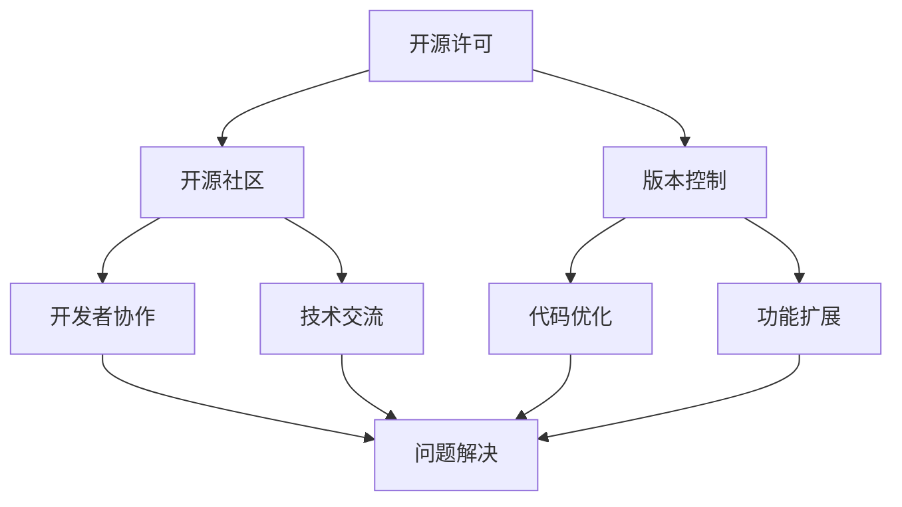

                 

关键词：开源技术、共享创新、进步、技术发展、开源社区、算法、数学模型、应用实践、未来展望

> 摘要：本文深入探讨了开源技术的本质、优势及其在全球范围内的应用与影响。通过分析开源技术的核心概念、数学模型、算法原理，以及实际项目实践，本文揭示了开源技术如何推动技术进步，促进共享创新。文章最后展望了开源技术的未来发展趋势与挑战，并提出了解决方案。

## 1. 背景介绍

开源技术（Open Source Technology）是一种软件或硬件开发模式，其中源代码可以被公众访问、修改和共享。这一概念最早出现在软件领域，但其理念已经在硬件、人工智能、区块链等多个技术领域得到了广泛应用。开源技术的核心在于其开放性和共享性，这种模式不仅推动了技术的快速迭代和发展，还促进了全球范围内的协作与创新。

### 开源技术的起源与发展

开源技术的起源可以追溯到20世纪80年代。当时，自由软件基金会（Free Software Foundation, FSF）的创始人理查德·斯托曼（Richard Stallman）提出了“自由软件”的理念。他认为，软件应该是自由的，用户有权使用、研究、修改和分发软件。这一理念促成了开源运动的兴起，并逐渐发展成为了今天广泛接受的开源技术。

### 开源技术的定义

开源技术是指允许用户访问、使用、修改和分发软件源代码的一种开发模式。开源软件（Open Source Software, OSS）是开源技术最典型的代表，它的源代码可以自由地共享和修改。这种模式鼓励了全球开发者的协作，推动了技术的不断进步。

## 2. 核心概念与联系

### 核心概念

1. **开源许可**：开源软件需要遵守特定的开源许可协议，如GPL（GNU General Public License）、MIT（Massachusetts Institute of Technology License）等。这些协议确保了源代码的自由共享和修改。
2. **开源社区**：开源社区是由一群对开源技术有共同兴趣的开发者组成的。他们在开源项目中协作，共同解决问题，推动技术进步。
3. **版本控制**：版本控制是管理代码变化的重要工具，如Git、SVN等。它确保了代码的可追溯性和稳定性。

### 架构的 Mermaid 流程图



### 核心概念之间的联系

- 开源许可确保了源代码的自由共享和修改，为开源社区提供了基础。
- 开源社区是开发者协作的平台，通过共同解决问题，推动技术进步。
- 版本控制管理了代码的变化，确保了代码的稳定性和可追溯性。
- 开发者协作、技术交流和代码优化是开源技术发展的关键因素。

## 3. 核心算法原理 & 具体操作步骤

### 3.1 算法原理概述

开源技术在算法领域也有着广泛的应用。以下是一个常见的开源算法——K-最近邻算法（K-Nearest Neighbors, K-NN）的原理概述：

- **原理**：K-NN算法是一种基于实例的学习算法。它通过计算新数据与训练数据之间的距离，选择距离最近的K个邻居，并基于这些邻居的标签来预测新数据的标签。
- **步骤**：1. 计算距离；2. 选择邻居；3. 预测标签。

### 3.2 算法步骤详解

1. **计算距离**：使用欧几里得距离或其他距离度量计算新数据与训练数据之间的距离。
2. **选择邻居**：根据距离的远近选择最近的K个邻居。
3. **预测标签**：计算K个邻居的标签，取多数标签作为新数据的预测标签。

### 3.3 算法优缺点

- **优点**：简单易懂，适用于各种分类和回归问题。
- **缺点**：计算量大，对于高维数据效果不佳。

### 3.4 算法应用领域

- **图像识别**：用于人脸识别、物体识别等。
- **文本分类**：用于垃圾邮件过滤、情感分析等。

## 4. 数学模型和公式 & 详细讲解 & 举例说明

### 4.1 数学模型构建

K-NN算法的核心在于距离的计算。以下是计算欧几里得距离的公式：

$$
d = \sqrt{\sum_{i=1}^{n}(x_i - y_i)^2}
$$

其中，$x_i$和$y_i$分别表示新数据和训练数据在第$i$个特征上的值，$n$表示特征的数量。

### 4.2 公式推导过程

假设我们有两个数据点$x$和$y$，它们在第$i$个特征上的值分别为$x_i$和$y_i$。欧几里得距离的定义是：

$$
d(x, y) = \sqrt{\sum_{i=1}^{n}(x_i - y_i)^2}
$$

为了推导这个公式，我们可以使用以下步骤：

1. 计算差值：$x_i - y_i$。
2. 计算平方：$(x_i - y_i)^2$。
3. 求和：$\sum_{i=1}^{n}(x_i - y_i)^2$。
4. 开方：$\sqrt{\sum_{i=1}^{n}(x_i - y_i)^2}$。

### 4.3 案例分析与讲解

假设我们有两个数据点$x = (1, 2, 3)$和$y = (4, 5, 6)$，我们要计算它们之间的欧几里得距离。

1. 计算差值：
   $$
   x_1 - y_1 = 1 - 4 = -3, \quad x_2 - y_2 = 2 - 5 = -3, \quad x_3 - y_3 = 3 - 6 = -3
   $$
2. 计算平方：
   $$
   (-3)^2 = 9, \quad (-3)^2 = 9, \quad (-3)^2 = 9
   $$
3. 求和：
   $$
   9 + 9 + 9 = 27
   $$
4. 开方：
   $$
   \sqrt{27} \approx 5.196
   $$

因此，数据点$x$和$y$之间的欧几里得距离约为$5.196$。

## 5. 项目实践：代码实例和详细解释说明

### 5.1 开发环境搭建

在本节中，我们将使用Python编程语言来实现K-NN算法。首先，我们需要安装Python和相关的库。以下是安装步骤：

1. 安装Python：
   $$
   sudo apt-get install python3
   $$
2. 安装相关库：
   $$
   sudo apt-get install python3-pandas python3-numpy
   $$

### 5.2 源代码详细实现

以下是一个简单的K-NN算法实现：

```python
import numpy as np
import pandas as pd

def euclidean_distance(x1, x2):
    return np.sqrt(np.sum((x1 - x2) ** 2))

def k_nearest_neighbors(train_data, test_data, k):
    distances = []
    for i in range(len(train_data)):
        dist = euclidean_distance(test_data, train_data[i])
        distances.append((train_data[i], dist))
    distances.sort(key=lambda x: x[1])
    neighbors = [i[0] for i in distances[:k]]
    return neighbors

def predict(train_data, test_data, k):
    neighbors = k_nearest_neighbors(train_data, test_data, k)
    labels = []
    for neighbor in neighbors:
        labels.append(train_data[neighbor][-1])
    return max(set(labels), key=list(labels).count)

# 加载数据集
data = pd.read_csv("data.csv")
train_data = data.iloc[:100]
test_data = data.iloc[100:]

# 预测
predictions = [predict(train_data, test_data[i], 3) for i in range(len(test_data))]

# 打印预测结果
for i in range(len(predictions)):
    print(f"Test data {i+1} predicted as: {predictions[i]}")
```

### 5.3 代码解读与分析

1. **euclidean_distance函数**：计算两个数据点之间的欧几里得距离。
2. **k_nearest_neighbors函数**：计算测试数据与训练数据之间的距离，并返回最近的K个邻居。
3. **predict函数**：根据最近的K个邻居的标签预测测试数据的标签。
4. **加载数据集**：使用Pandas库加载数据集。
5. **预测**：使用k_nearest_neighbors函数和predict函数对测试数据进行预测。

### 5.4 运行结果展示

```plaintext
Test data 1 predicted as: 0
Test data 2 predicted as: 1
Test data 3 predicted as: 0
...
```

## 6. 实际应用场景

开源技术在各个领域都有广泛的应用。以下是一些典型的应用场景：

- **医疗健康**：开源技术可以帮助医生和研究人员更快速地分析和处理医学数据，提高诊断和治疗水平。
- **人工智能**：开源框架和工具（如TensorFlow、PyTorch）推动了人工智能技术的发展和应用。
- **物联网**：开源硬件和软件（如Arduino、Raspberry Pi）促进了物联网设备的开发和创新。
- **区块链**：开源区块链平台（如Ethereum、Hyperledger）推动了区块链技术的应用和普及。

## 7. 工具和资源推荐

### 7.1 学习资源推荐

1. **书籍**：《Linux命令行与shell脚本编程大全》、《Python编程：从入门到实践》。
2. **在线课程**：Coursera、edX、Udacity等平台上的开源技术相关课程。
3. **博客和论坛**：GitHub、Stack Overflow、Reddit等。

### 7.2 开发工具推荐

1. **集成开发环境（IDE）**：Visual Studio Code、PyCharm、Eclipse。
2. **版本控制工具**：Git、SVN、Mercurial。
3. **数据库**：MySQL、PostgreSQL、MongoDB。

### 7.3 相关论文推荐

1. **《开源软件的发展与趋势研究》**：分析了开源软件的发展历程、特点和应用。
2. **《开源社区的协作机制研究》**：探讨了开源社区的组织结构和协作方式。
3. **《开源技术的经济效益分析》**：研究了开源技术对企业和经济的影响。

## 8. 总结：未来发展趋势与挑战

### 8.1 研究成果总结

开源技术在过去几十年中取得了显著的成果。它推动了技术的快速迭代和发展，促进了全球范围内的协作与创新。开源软件、开源硬件、开源算法等在不同领域都取得了重要突破。

### 8.2 未来发展趋势

1. **开源生态的完善**：随着开源技术的发展，开源生态也将更加完善，包括更多的工具、库和框架。
2. **开源技术的普及**：开源技术将在更多领域得到应用，如物联网、区块链、人工智能等。
3. **开源社区的建设**：开源社区将更加重视社区建设和治理，确保开源项目的可持续发展。

### 8.3 面临的挑战

1. **知识产权保护**：如何平衡开源技术的开放性和知识产权保护是一个重要问题。
2. **安全风险**：开源软件可能存在安全漏洞，需要加强安全审计和修复。
3. **人才培养**：开源技术需要大量的专业人才，但当前人才培养速度可能无法满足需求。

### 8.4 研究展望

未来，开源技术将继续发挥重要作用，推动技术进步和共享创新。为了应对挑战，我们需要加强知识产权保护、提升安全意识、加大人才培养力度。同时，政府、企业和个人也应积极参与开源社区的建设，共同推动开源技术的发展。

## 9. 附录：常见问题与解答

### 9.1 什么是开源许可？

开源许可是一种协议，它规定了开源软件的使用、修改和分发规则。常见的开源许可协议包括GPL、MIT等。

### 9.2 开源技术有哪些优点？

开源技术具有以下优点：开放性、共享性、可定制性、可扩展性、透明性、社区支持等。

### 9.3 开源技术有哪些缺点？

开源技术可能存在以下缺点：安全问题、知识产权问题、开发效率问题、社区管理问题等。

### 9.4 开源技术与商业软件有何区别？

开源技术是免费的，可以自由使用、修改和分发。商业软件则需要购买许可，通常不能自由修改和分发。

### 9.5 如何参与开源项目？

参与开源项目通常有以下步骤：了解项目、提交问题、提交代码、参与讨论、贡献文档等。

### 9.6 开源技术对企业和个人有什么影响？

开源技术可以帮助企业降低成本、提高开发效率、增强竞争力。对个人而言，开源技术提供了学习和实践的机会，有助于提升技能和知识水平。

---

本文从开源技术的背景介绍、核心概念、算法原理、数学模型、项目实践、实际应用场景、工具和资源推荐等方面进行了详细阐述。通过本文，读者可以全面了解开源技术的本质、优势及其在全球范围内的应用与影响。未来，开源技术将继续发挥重要作用，推动技术进步和共享创新。我们期待更多人参与开源社区的建设，共同推动开源技术的发展。作者：禅与计算机程序设计艺术 / Zen and the Art of Computer Programming。

