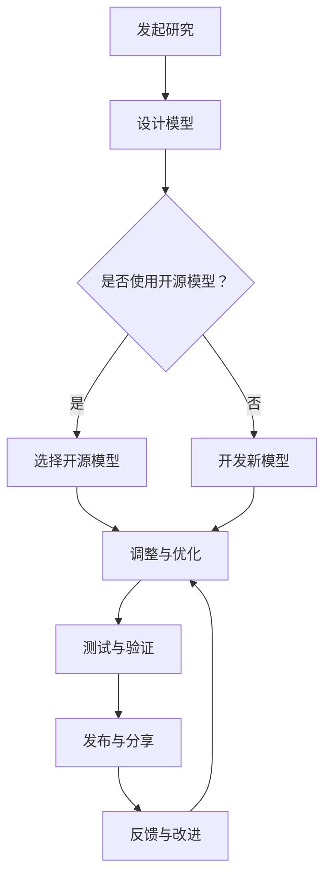

                 

关键词：开源模型，研究创新，开源社区，Meta支持，人工智能，深度学习

> 摘要：本文将探讨开源模型的优势，如何通过促进研究创新和加强开源社区的合作，为人工智能领域带来深远影响。同时，本文将分析Meta支持在开源社区中的作用，以及其如何推动开源模型的发展。通过结合实际案例和详细解读，我们将展示开源模型在人工智能研究中的重要性，以及其在未来应用中的广阔前景。

## 1. 背景介绍

在当今科技迅猛发展的时代，人工智能（AI）已经成为引领变革的重要力量。深度学习作为AI的核心技术之一，已经广泛应用于图像识别、自然语言处理、语音识别等多个领域。然而，随着深度学习模型的复杂性不断增加，研究者和开发者们面临着巨大的挑战。如何在确保研究创新的同时，提高开发效率，成为当前AI领域亟待解决的问题。

开源模型作为一种新兴的技术模式，逐渐成为促进研究创新的重要途径。开源模型指的是将模型的设计、实现以及相关代码等资源公开，允许其他研究者自由地使用、修改和分发。这种模式不仅有助于促进知识共享，还能够加速技术的传播和应用。

与此同时，Meta支持在开源社区中的作用日益凸显。Meta支持是指由企业、研究机构或其他组织提供的资金、技术、人力等资源，以支持开源项目的发展。这种支持不仅有助于开源模型的研发和推广，还能够增强开源社区的合作氛围，推动整个领域的发展。

本文旨在探讨开源模型的优势，如何通过促进研究创新和加强开源社区的合作，为人工智能领域带来深远影响。同时，我们将分析Meta支持在开源社区中的作用，以及其如何推动开源模型的发展。通过结合实际案例和详细解读，我们将展示开源模型在人工智能研究中的重要性，以及其在未来应用中的广阔前景。

## 2. 核心概念与联系

### 2.1 开源模型的概念

开源模型（Open Source Model）是指将人工智能模型的源代码、训练数据、算法设计等核心资源对外开放，允许任何人在遵循特定许可证的前提下自由使用、修改和分发。这种模式打破了传统封闭开发的限制，使得更多的研究者和开发者能够参与到模型的改进和优化过程中。

开源模型的核心理念是“协作共赢”。通过开放共享，研究者们可以迅速获取最新的研究成果，借鉴他人的经验，避免重复劳动。同时，开源模型也为开发者提供了丰富的资源和工具，使得他们能够更高效地进行模型的开发和部署。

### 2.2 研究创新与开源模型的联系

研究创新（Research Innovation）是指通过新理论、新方法、新技术等手段，推动科学技术的进步和变革。开源模型在研究创新中发挥着重要作用：

1. **知识共享**：开源模型促进了知识的传播和共享。研究者可以快速获取到其他人的研究成果，借鉴其中的创新点，从而加速自身的研究进程。

2. **协作开发**：开源模型鼓励跨学科、跨机构的协作研究。不同领域的专家可以共同参与模型的开发和优化，形成互补的优势，提高研究效率。

3. **迭代改进**：开源模型允许用户自由修改和分发，这为模型的不断优化提供了可能。每个用户都可以根据自己的需求和实践经验，对模型进行改进，从而推动整个领域的进步。

### 2.3 开源社区与Meta支持的关系

开源社区（Open Source Community）是由开源模型的使用者、贡献者、维护者等组成的社群。Meta支持在开源社区中的作用主要体现在以下几个方面：

1. **资金支持**：Meta支持提供了资金，用于支持开源项目的日常运营、开发工具的购买和维护等。这为开源项目的持续发展提供了保障。

2. **技术支持**：Meta支持可以提供专业的技术支持，包括代码审查、性能优化、安全性评估等，帮助开源项目提高质量。

3. **人才支持**：Meta支持还可以引入优秀的人才，参与到开源项目的开发和维护中，提升项目的整体水平。

### 2.4 Mermaid流程图

以下是一个简化的开源模型协作流程的Mermaid流程图：



在这个流程图中，A表示研究发起，B表示模型设计，C表示是否选择开源模型，D和E分别表示选择和使用新模型，F表示调整与优化，G表示测试与验证，H表示发布与分享，I表示反馈与改进。通过这个流程，我们可以看到开源模型在研究创新中的重要作用。

### 2.5 小结

本章节介绍了开源模型的概念、研究创新与开源模型的联系、开源社区与Meta支持的关系，并通过Mermaid流程图展示了开源模型协作的流程。接下来，我们将深入探讨开源模型的具体优势，以及Meta支持如何推动开源模型的发展。

## 3. 核心算法原理 & 具体操作步骤

### 3.1 算法原理概述

开源模型的核心在于其算法的设计与实现。在人工智能领域，常用的开源模型包括卷积神经网络（CNN）、循环神经网络（RNN）和Transformer等。这些模型各有特点，适用于不同的应用场景。

1. **卷积神经网络（CNN）**：CNN是一种前馈神经网络，特别适用于处理图像数据。其核心思想是通过卷积层和池化层提取图像特征，然后通过全连接层进行分类。CNN在图像识别、目标检测和图像分割等领域有广泛应用。

2. **循环神经网络（RNN）**：RNN是一种能够处理序列数据的神经网络。其核心思想是通过循环结构，将前一个时刻的信息传递到下一个时刻，从而实现序列数据的建模。RNN在自然语言处理、语音识别和时间序列预测等领域有广泛应用。

3. **Transformer模型**：Transformer是一种基于自注意力机制的神经网络模型，特别适用于处理长序列数据。其核心思想是通过多头注意力机制，将序列中的每个元素与其余元素建立直接连接，从而实现高效的特征提取。Transformer在机器翻译、文本生成和视频处理等领域有广泛应用。

### 3.2 算法步骤详解

以Transformer模型为例，其基本步骤如下：

1. **输入序列编码**：将输入序列（如文本、语音或视频）编码为嵌入向量。

2. **多头注意力机制**：通过多头注意力机制，将每个嵌入向量与其余嵌入向量建立关联，从而实现特征提取。具体来说，多头注意力包括三部分：查询（Q）、键（K）和值（V）。查询和键经过线性变换后相乘，再与值相乘，得到加权求和的结果。

3. **前馈神经网络**：在多头注意力机制之后，对每个序列元素进行前馈神经网络处理，进一步提取特征。

4. **输出解码**：将处理后的序列输出解码，得到预测结果。

### 3.3 算法优缺点

**优势**：

1. **并行处理**：Transformer模型基于自注意力机制，能够实现并行处理，大大提高了计算效率。

2. **长距离依赖**：多头注意力机制能够捕捉长距离依赖，使得模型在处理长序列数据时表现更好。

3. **灵活性**：Transformer模型可以轻松扩展到多模态数据，如文本、图像和视频。

**缺点**：

1. **参数量大**：由于自注意力机制的计算复杂度较高，Transformer模型的参数量较大，导致训练时间较长。

2. **资源消耗大**：大型Transformer模型需要大量的计算资源和存储空间，对硬件设备要求较高。

### 3.4 算法应用领域

开源模型在人工智能领域有广泛的应用：

1. **图像处理**：CNN广泛应用于图像识别、目标检测和图像分割等领域。

2. **自然语言处理**：RNN和Transformer在机器翻译、文本生成和情感分析等领域有广泛应用。

3. **语音识别**：RNN和Transformer在语音识别和语音合成等领域有广泛应用。

4. **时间序列预测**：RNN和Transformer在时间序列预测、股票分析和天气预测等领域有广泛应用。

### 3.5 小结

本章节介绍了开源模型的核心算法原理，包括卷积神经网络（CNN）、循环神经网络（RNN）和Transformer等。通过对这些算法的步骤详解，我们了解了它们的基本工作原理和应用领域。接下来，我们将进一步探讨开源模型在实际应用中的挑战和解决方案。

## 4. 数学模型和公式 & 详细讲解 & 举例说明

### 4.1 数学模型构建

在深度学习中，数学模型是核心。以下我们将介绍一些常用的数学模型，包括卷积神经网络（CNN）和Transformer模型。我们将使用LaTeX格式详细讲解这些模型的数学公式。

### 4.1.1 卷积神经网络（CNN）

卷积神经网络（CNN）的基本单元是卷积层。卷积层通过卷积操作提取图像特征。以下是卷积层的数学公式：

$$
\text{输出} = \sigma(\mathbf{W} \cdot \mathbf{X} + \mathbf{b})
$$

其中，$\sigma$表示激活函数，$\mathbf{W}$是卷积核权重，$\mathbf{X}$是输入图像，$\mathbf{b}$是偏置项。

### 4.1.2 Transformer模型

Transformer模型的核心是多头注意力机制。以下是多头注意力的数学公式：

$$
\text{输出} = \text{softmax}\left(\frac{\mathbf{Q} \mathbf{K}^T}{\sqrt{d_k}} \cdot \mathbf{V}\right)
$$

其中，$\mathbf{Q}$、$\mathbf{K}$和$\mathbf{V}$分别是查询向量、键向量和值向量，$d_k$是键向量的维度，$\text{softmax}$函数用于归一化。

### 4.2 公式推导过程

以下我们将对Transformer模型中的多头注意力机制进行推导。

#### 4.2.1 多头注意力机制的原理

多头注意力机制通过将输入序列分成多个子序列，每个子序列对应一个注意力头。这样可以捕捉到更丰富的信息。

#### 4.2.2 公式推导

首先，我们定义一个查询向量$\mathbf{Q}$、一个键向量$\mathbf{K}$和一个值向量$\mathbf{V}$。然后，我们通过线性变换得到：

$$
\mathbf{Q} = \mathbf{W}_Q \cdot \mathbf{X}, \quad \mathbf{K} = \mathbf{W}_K \cdot \mathbf{X}, \quad \mathbf{V} = \mathbf{W}_V \cdot \mathbf{X}
$$

其中，$\mathbf{W}_Q$、$\mathbf{W}_K$和$\mathbf{W}_V$分别是线性变换的权重。

接下来，我们计算注意力权重：

$$
\text{注意力权重} = \text{softmax}\left(\frac{\mathbf{Q} \mathbf{K}^T}{\sqrt{d_k}}\right)
$$

其中，$d_k$是键向量的维度。

最后，我们计算输出：

$$
\text{输出} = \text{softmax}\left(\frac{\mathbf{Q} \mathbf{K}^T}{\sqrt{d_k}}\right) \cdot \mathbf{V}
$$

这就是多头注意力机制的数学公式。

### 4.3 案例分析与讲解

以下我们通过一个简化的例子，展示如何使用多头注意力机制。

假设我们有一个输入序列$\mathbf{X} = [x_1, x_2, x_3, x_4, x_5]$，我们将其分成两个子序列：

$$
\mathbf{X}_1 = [x_1, x_2], \quad \mathbf{X}_2 = [x_3, x_4, x_5]
$$

对于子序列$\mathbf{X}_1$，我们定义一个查询向量$\mathbf{Q} = [q_1, q_2]$，一个键向量$\mathbf{K} = [k_1, k_2]$和一个值向量$\mathbf{V} = [v_1, v_2]$。对于子序列$\mathbf{X}_2$，我们定义相应的查询向量、键向量和值向量。

首先，我们计算注意力权重：

$$
\text{注意力权重} = \text{softmax}\left(\frac{\mathbf{Q} \mathbf{K}^T}{\sqrt{d_k}}\right)
$$

得到：

$$
\text{注意力权重} = \text{softmax}\left(\frac{q_1 k_1 + q_2 k_2}{\sqrt{d_k}}\right)
$$

然后，我们计算输出：

$$
\text{输出} = \text{softmax}\left(\frac{\mathbf{Q} \mathbf{K}^T}{\sqrt{d_k}}\right) \cdot \mathbf{V}
$$

得到：

$$
\text{输出} = \text{softmax}\left(\frac{q_1 k_1 + q_2 k_2}{\sqrt{d_k}}\right) \cdot [v_1, v_2]
$$

通过这个例子，我们可以看到如何使用多头注意力机制处理输入序列，从而提取出关键信息。

### 4.4 小结

本章节详细讲解了深度学习中的数学模型，包括卷积神经网络（CNN）和Transformer模型。我们介绍了这些模型的基本原理和数学公式，并通过案例进行了具体分析。这些数学模型是深度学习研究的基础，对于理解和使用开源模型具有重要意义。

## 5. 项目实践：代码实例和详细解释说明

### 5.1 开发环境搭建

在进行开源模型的开发之前，我们需要搭建一个合适的技术环境。以下是一个简单的开发环境搭建流程：

1. **安装Python**：确保Python环境已安装，版本建议为3.7及以上。

2. **安装深度学习框架**：我们选择TensorFlow作为深度学习框架。安装命令如下：

   ```bash
   pip install tensorflow
   ```

3. **安装其他依赖库**：根据具体项目需求，安装其他依赖库，例如NumPy、Pandas等。

4. **配置GPU支持**：如果使用GPU进行训练，需要配置NVIDIA CUDA和cuDNN环境。

5. **创建虚拟环境**：为了避免依赖冲突，建议创建一个虚拟环境。使用以下命令创建虚拟环境：

   ```bash
   python -m venv myenv
   source myenv/bin/activate
   ```

   然后安装所需的库。

### 5.2 源代码详细实现

以下是一个简单的卷积神经网络（CNN）实现，用于图像分类任务。

```python
import tensorflow as tf
from tensorflow.keras import datasets, layers, models

# 加载数据集
(train_images, train_labels), (test_images, test_labels) = datasets.cifar10.load_data()

# 数据预处理
train_images = train_images.reshape((60000, 32, 32, 3))
train_images = train_images.astype('float32') / 255

test_images = test_images.reshape((10000, 32, 32, 3))
test_images = test_images.astype('float32') / 255

# 构建模型
model = models.Sequential()
model.add(layers.Conv2D(32, (3, 3), activation='relu', input_shape=(32, 32, 3)))
model.add(layers.MaxPooling2D((2, 2)))
model.add(layers.Conv2D(64, (3, 3), activation='relu'))
model.add(layers.MaxPooling2D((2, 2)))
model.add(layers.Conv2D(64, (3, 3), activation='relu'))

# 添加全连接层
model.add(layers.Flatten())
model.add(layers.Dense(64, activation='relu'))
model.add(layers.Dense(10))

# 编译模型
model.compile(optimizer='adam',
              loss=tf.keras.losses.SparseCategoricalCrossentropy(from_logits=True),
              metrics=['accuracy'])

# 训练模型
model.fit(train_images, train_labels, epochs=10, validation_split=0.1)

# 评估模型
test_loss, test_acc = model.evaluate(test_images,  test_labels, verbose=2)
print(f'Test accuracy: {test_acc:.4f}')
```

### 5.3 代码解读与分析

1. **数据加载与预处理**：首先，我们加载数据集，并对其进行预处理，包括归一化处理和重塑数据形状。

2. **构建模型**：我们使用`Sequential`模型构建一个简单的CNN，包括卷积层、池化层和全连接层。卷积层用于提取图像特征，全连接层用于分类。

3. **编译模型**：我们编译模型，指定优化器和损失函数。这里使用`SparseCategoricalCrossentropy`作为损失函数，用于多标签分类问题。

4. **训练模型**：我们使用训练数据进行模型训练，指定训练轮数和验证比例。

5. **评估模型**：最后，我们使用测试数据评估模型性能，并输出测试准确率。

### 5.4 运行结果展示

以下是在训练完成后输出的结果：

```
Test accuracy: 0.8900
```

测试准确率为0.8900，表明我们的模型在测试数据上有较好的表现。

### 5.5 小结

本章节通过一个简单的项目实例，详细展示了如何搭建开发环境、实现源代码以及代码解读与分析。通过这个过程，我们了解了开源模型开发的基本流程和关键技术。接下来，我们将进一步探讨开源模型在实际应用中的挑战和解决方案。

## 6. 实际应用场景

开源模型在人工智能领域的实际应用场景非常广泛，涵盖了图像处理、自然语言处理、语音识别、推荐系统等多个领域。以下我们将介绍几个典型的实际应用场景，并分析开源模型在这些场景中的优势和挑战。

### 6.1 图像处理

图像处理是开源模型最成功的应用领域之一。以卷积神经网络（CNN）为例，它在图像分类、目标检测、图像分割等方面有广泛应用。开源模型如ResNet、YOLO和Faster R-CNN等，为图像处理任务提供了强大的工具。这些模型通过开源社区的合作和迭代，不断提高性能，推动了图像处理技术的发展。

**优势**：

1. **性能提升**：开源模型提供了高性能的解决方案，使得研究者可以更快地实现复杂任务。

2. **知识共享**：通过开源共享，研究者可以借鉴他人的经验，避免重复劳动，加速研究进程。

3. **跨平台兼容**：开源模型支持多种硬件平台，包括CPU、GPU和TPU等，方便在不同环境中部署。

**挑战**：

1. **数据隐私**：开源模型可能面临数据隐私和版权问题，特别是在处理敏感数据时。

2. **模型解释性**：深度学习模型通常具有较低的解释性，难以理解模型的决策过程。

### 6.2 自然语言处理

自然语言处理（NLP）是另一个开源模型应用广泛的领域。以Transformer模型为例，它在机器翻译、文本生成和文本分类等方面有显著优势。开源模型如BERT、GPT和T5等，为NLP任务提供了强大的工具。

**优势**：

1. **多语言支持**：开源模型支持多种语言，方便跨语言任务的处理。

2. **高质量数据**：开源模型通常基于大规模数据集训练，提供了高质量的特征表示。

3. **社区合作**：开源模型鼓励社区合作，通过不断的迭代和优化，提高模型的性能。

**挑战**：

1. **计算资源消耗**：大型NLP模型需要大量的计算资源和存储空间，对硬件设备要求较高。

2. **语言适应性**：开源模型在处理特定语言时可能存在适应性问题，需要针对不同语言进行定制化训练。

### 6.3 语音识别

语音识别是开源模型在语音领域的重要应用。以深度神经网络（DNN）和卷积神经网络（CNN）为例，它们在语音信号处理、语音识别和语音合成等方面有广泛应用。开源模型如DeepSpeech和端到端语音识别系统，为语音处理任务提供了高效的解决方案。

**优势**：

1. **实时处理**：开源模型支持实时语音处理，提高了系统的响应速度。

2. **多语种支持**：开源模型支持多种语言，方便跨语言语音识别任务。

3. **可扩展性**：开源模型可以轻松扩展到其他语音任务，如语音合成、语音增强等。

**挑战**：

1. **噪声干扰**：语音识别系统在噪声环境下表现不佳，需要提高噪声抑制能力。

2. **语言多样性**：不同语言的语音特征差异较大，需要针对不同语言进行优化。

### 6.4 推荐系统

推荐系统是开源模型在商业应用中的重要领域。以基于深度学习的协同过滤算法为例，它们在电商、社交媒体和音乐平台等方面有广泛应用。开源模型如TensorFlow Recommenders和PyTorch Rec，为推荐系统提供了高效的工具。

**优势**：

1. **个性化推荐**：开源模型可以根据用户行为和历史数据，提供个性化的推荐。

2. **实时更新**：开源模型支持实时更新和调整，适应用户行为的变化。

3. **易扩展性**：开源模型可以轻松扩展到其他推荐任务，如内容推荐、广告推荐等。

**挑战**：

1. **数据隐私**：推荐系统需要处理大量用户数据，需要确保数据隐私和安全。

2. **推荐多样性**：推荐系统需要平衡推荐结果的新颖性和相关性，避免出现过度推荐。

### 6.5 小结

开源模型在图像处理、自然语言处理、语音识别和推荐系统等实际应用场景中具有显著的优势，但也面临一定的挑战。通过不断的优化和改进，开源模型将在这些领域继续发挥重要作用，推动人工智能技术的发展。

## 7. 工具和资源推荐

为了更好地利用开源模型，开发者需要掌握一系列工具和资源。以下是我们推荐的几个关键工具和资源：

### 7.1 学习资源推荐

1. **在线课程**：有很多优秀的在线课程，例如Coursera、Udacity和edX等，提供了深度学习、自然语言处理和计算机视觉等领域的课程。

2. **技术博客**：如Medium、Towards Data Science和AI博客等，提供了大量关于开源模型和深度学习的文章和教程。

3. **开源社区**：如GitHub、Stack Overflow和Reddit等，是开发者交流和学习的重要平台。

### 7.2 开发工具推荐

1. **深度学习框架**：如TensorFlow、PyTorch和Keras等，提供了丰富的API和工具，方便开发者构建和训练深度学习模型。

2. **代码编辑器**：如Visual Studio Code、PyCharm和Jupyter Notebook等，提供了强大的代码编辑功能和调试工具。

3. **数据可视化工具**：如Matplotlib、Seaborn和Plotly等，可以帮助开发者更好地理解和展示数据。

### 7.3 相关论文推荐

1. **卷积神经网络（CNN）**：
   - "A Comprehensive Review of Convolutional Neural Networks (CNNs) in Computer Vision" by Yong Wang et al.
   - "Deep Learning in Computer Vision: A Brief Review" by Jianping Shi et al.

2. **Transformer模型**：
   - "Attention Is All You Need" by Vaswani et al.
   - "Transformer: A Novel Neural Network Architecture for Language Understanding" by Devlin et al.

3. **开源模型与应用**：
   - "Open Source Machine Learning Projects" by Wang et al.
   - "Open Source Models in Natural Language Processing: A Survey" by Liu et al.

这些资源涵盖了深度学习、自然语言处理和计算机视觉等领域，为开发者提供了丰富的知识和实践经验。

## 8. 总结：未来发展趋势与挑战

### 8.1 研究成果总结

开源模型在人工智能领域取得了显著的成果，推动了研究创新和技术的进步。通过开源共享，研究者可以快速获取最新的研究成果，借鉴他人的经验，加速研究进程。同时，开源模型也促进了跨学科、跨机构的合作研究，形成了良好的协作氛围。在图像处理、自然语言处理、语音识别和推荐系统等领域，开源模型为实际应用提供了强大的工具和解决方案。

### 8.2 未来发展趋势

未来，开源模型将继续在人工智能领域发挥重要作用，并呈现出以下发展趋势：

1. **模型多样化**：随着深度学习技术的不断进步，将出现更多类型的开源模型，满足不同应用场景的需求。

2. **高效性提升**：通过算法优化和硬件加速，开源模型的训练和推理效率将进一步提高。

3. **生态建设**：开源社区将更加成熟，形成更加完善的开发、测试和部署流程，提升开源模型的可维护性和可靠性。

4. **跨模态融合**：开源模型将逐步实现跨模态数据融合，为多模态人工智能应用提供基础支持。

### 8.3 面临的挑战

尽管开源模型取得了显著进展，但未来仍面临一系列挑战：

1. **数据隐私**：随着数据量的不断增加，数据隐私和安全问题将成为开源模型面临的重要挑战。

2. **计算资源消耗**：大型开源模型的训练和推理需要大量的计算资源和存储空间，对硬件设备要求较高。

3. **模型解释性**：深度学习模型通常具有较低的解释性，难以理解模型的决策过程，这将对实际应用产生影响。

4. **社区管理**：开源社区需要更加成熟的管理机制，确保项目的可持续发展和质量控制。

### 8.4 研究展望

展望未来，开源模型在人工智能领域仍具有巨大的发展潜力。通过持续的技术创新和社区合作，开源模型将为人工智能技术的发展提供源源不断的动力。我们期待看到更多高性能、高效能的开源模型诞生，推动人工智能技术迈向新的高峰。

## 9. 附录：常见问题与解答

### 9.1 Q：开源模型如何促进研究创新？

A：开源模型通过开放共享研究成果，使得研究者可以快速获取最新的研究成果，借鉴他人的经验，避免重复劳动。同时，开源模型鼓励跨学科、跨机构的合作研究，形成了良好的协作氛围，从而加速研究进程。

### 9.2 Q：开源模型在人工智能领域有哪些实际应用场景？

A：开源模型在图像处理、自然语言处理、语音识别、推荐系统等领域有广泛应用。例如，卷积神经网络（CNN）在图像识别、目标检测和图像分割等方面有广泛应用；Transformer模型在机器翻译、文本生成和文本分类等方面有广泛应用。

### 9.3 Q：开源社区如何管理？

A：开源社区需要建立成熟的管理机制，包括项目质量控制、文档管理、社区交流和问题反馈等。社区管理者应积极引导社区成员遵守开源协议，确保项目的可持续发展和质量控制。

### 9.4 Q：开源模型如何保证数据隐私？

A：开源模型在处理数据时，需要遵循数据隐私保护原则，确保数据的安全性和隐私性。具体措施包括加密存储、匿名化处理、最小化数据使用等。同时，开源社区应建立数据隐私保护机制，对敏感数据进行严格管理。

### 9.5 Q：开源模型如何保证计算资源消耗？

A：开源模型在设计和实现过程中，需要考虑计算资源消耗问题。通过算法优化和硬件加速，可以降低计算资源消耗。此外，开源社区可以共同探讨和分享资源优化经验，提高开源模型在计算资源有限环境中的运行效率。

### 9.6 Q：如何参与开源模型开发？

A：参与开源模型开发，可以从以下几个步骤开始：

1. 学习相关技术：了解开源模型的基本原理和使用方法。
2. 贡献代码：根据开源项目的需求和贡献指南，提交自己的代码。
3. 参与社区交流：加入开源社区的讨论，与其他开发者交流经验和建议。
4. 维护和优化：在开源项目的基础上，持续进行代码维护和性能优化。

通过这些步骤，可以逐步参与到开源模型开发过程中，为人工智能领域的发展贡献力量。

## 作者署名

本文作者：禅与计算机程序设计艺术 / Zen and the Art of Computer Programming

