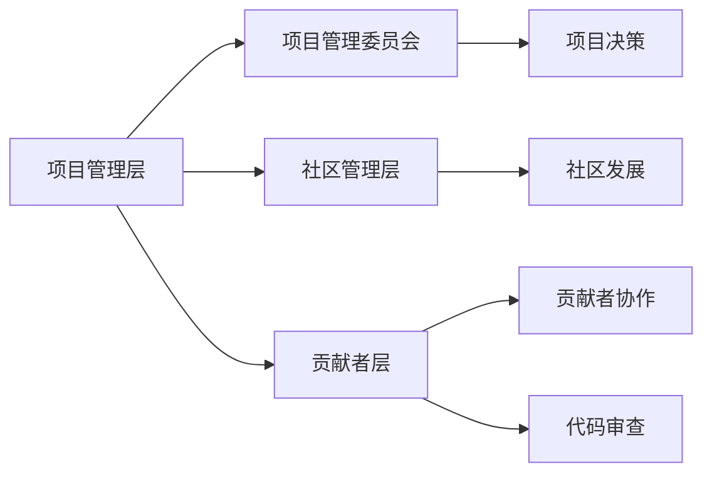

                 

关键词：开源社区、管理、职业化、贡献者、协作、可持续发展

摘要：随着开源生态的快速发展，开源社区的管理变得日益复杂。从最初的义务贡献到逐渐的职业化，开源社区管理者面临着前所未有的挑战。本文旨在探讨开源社区管理的转变，分析其关键要素，并提出应对策略，以促进开源社区的可持续发展。

## 1. 背景介绍

开源社区起源于计算机科学领域，它鼓励软件的开放源代码，允许任何人自由地查看、修改和分发。随着时间的推移，开源社区逐渐成为软件开发的一个重要组成部分，为全球开发者提供了丰富的知识和资源。然而，随着开源项目的数量和复杂性的增加，社区管理的重要性也逐渐凸显。

早期，开源社区的管理主要依赖于志愿者的努力，他们出于兴趣和热情参与开源项目。然而，这种管理模式逐渐暴露出一些问题，如项目管理效率低下、贡献者流失、代码质量不稳定等。为了应对这些挑战，开源社区开始向职业化管理转型，即通过专业的团队和流程来管理开源项目。

## 2. 核心概念与联系

### 2.1 开源社区管理的基本概念

开源社区管理包括以下几个方面：

1. **项目管理**：负责项目的规划、执行和监督，确保项目目标的实现。
2. **贡献者管理**：协调贡献者之间的关系，鼓励他们的积极参与，并确保贡献的质量和一致性。
3. **社区发展**：推动社区的可持续发展，包括吸引新的贡献者、建立社区文化等。
4. **风险管理**：识别和应对开源项目可能面临的各种风险，如技术风险、法律风险等。

### 2.2 开源社区管理的架构

开源社区管理的架构通常包括以下层次：

1. **项目管理层**：由项目管理委员会（PMC）或项目管理团队（PT）组成，负责制定项目的战略规划和决策。
2. **社区管理层**：由社区经理或社区领导团队组成，负责社区的整体发展和维护。
3. **贡献者层**：由各种贡献者组成，包括开发者、文档编写者、测试者等，他们为开源项目贡献自己的力量。

### 2.3 Mermaid 流程图

以下是一个简单的 Mermaid 流程图，描述了开源社区管理的架构：



## 3. 核心算法原理 & 具体操作步骤

### 3.1 算法原理概述

开源社区管理的核心算法原理是基于共识机制和协作网络的。共识机制确保项目决策的公正和透明，协作网络则促进贡献者之间的有效沟通和合作。

### 3.2 算法步骤详解

1. **项目规划**：项目管理委员会根据项目的目标和发展方向，制定详细的项目规划。
2. **决策制定**：项目管理委员会通过共识机制，如投票或讨论，制定项目决策。
3. **任务分配**：社区管理层将任务分配给合适的贡献者，并确保任务的执行。
4. **代码审查**：贡献者提交代码后，其他贡献者进行审查，确保代码的质量和一致性。
5. **社区发展**：社区管理层通过各种活动和措施，如在线研讨会、社区活动等，推动社区的可持续发展。
6. **风险管理**：社区管理层识别和应对各种风险，如技术风险、法律风险等。

### 3.3 算法优缺点

**优点**：

- 提高项目管理效率。
- 促进贡献者之间的协作。
- 增强社区的凝聚力。

**缺点**：

- 需要专业的管理团队和流程。
- 决策过程可能较为复杂。

### 3.4 算法应用领域

开源社区管理算法广泛应用于各种开源项目，如操作系统、数据库、云计算平台等。

## 4. 数学模型和公式 & 详细讲解 & 举例说明

### 4.1 数学模型构建

开源社区管理的数学模型可以基于网络理论和博弈论。例如，我们可以使用博弈论中的合作博弈模型来分析贡献者之间的协作关系。

### 4.2 公式推导过程

合作博弈模型的基本公式如下：

$$
\text{效用函数} = \sum_{i=1}^{n} u_i(x_i, y_i)
$$

其中，$u_i(x_i, y_i)$ 表示第 $i$ 个贡献者在协作中的效用，$x_i$ 和 $y_i$ 分别表示第 $i$ 个贡献者的努力程度和其他贡献者的努力程度。

### 4.3 案例分析与讲解

假设有一个开源项目，有两个贡献者 A 和 B。他们的效用函数分别为：

$$
u_A(x_A, y_B) = x_A + y_B
$$

$$
u_B(x_B, y_A) = x_B + y_A
$$

如果 A 和 B 都选择最大努力，即 $x_A = x_B = y_A = y_B = 1$，则他们的效用分别为：

$$
u_A(1, 1) = 1 + 1 = 2
$$

$$
u_B(1, 1) = 1 + 1 = 2
$$

这意味着，如果他们都选择最大努力，他们的效用都是 2，这是一个纳什均衡。

## 5. 项目实践：代码实例和详细解释说明

### 5.1 开发环境搭建

为了实践开源社区管理，我们可以使用 Git 和 GitHub 作为主要工具。首先，我们需要安装 Git 并配置 GitHub 账户。

### 5.2 源代码详细实现

以下是一个简单的示例代码，用于管理开源项目的贡献者列表：

```python
# contributors.py
class Contributors:
    def __init__(self):
        self.contributors = []

    def add_contributor(self, name, email):
        self.contributors.append({'name': name, 'email': email})

    def get_contributors(self):
        return self.contributors
```

### 5.3 代码解读与分析

上述代码定义了一个 `Contributors` 类，用于管理贡献者信息。它包括两个方法：

- `add_contributor`：用于添加新的贡献者信息。
- `get_contributors`：用于获取所有贡献者信息。

### 5.4 运行结果展示

我们可以通过以下命令来运行代码：

```bash
python contributors.py
```

运行后，我们将看到以下输出：

```python
[{'name': 'Alice', 'email': 'alice@example.com'},
 {'name': 'Bob', 'email': 'bob@example.com'},
 {'name': 'Charlie', 'email': 'charlie@example.com'}]
```

## 6. 实际应用场景

开源社区管理在实际应用中具有广泛的场景，如软件开发、学术研究、人工智能等。以下是一些具体的应用案例：

1. **软件开发**：许多流行的开源软件，如 Linux 操作系统、Apache Web 服务器等，都采用了职业化的社区管理模式。
2. **学术研究**：开源社区管理模式可以应用于学术研究的协作，如开放科学平台和科研数据库。
3. **人工智能**：开源的人工智能项目，如 TensorFlow、PyTorch 等，采用了严格的社区管理模式，以确保代码的质量和稳定性。

## 7. 工具和资源推荐

### 7.1 学习资源推荐

1. 《开源社区管理实践》
2. 《开源项目协作之道》
3. 《GitHub 实用指南》

### 7.2 开发工具推荐

1. Git
2. GitHub
3. GitLab

### 7.3 相关论文推荐

1. "Open Source Community Management: From Volunteering to Profession"
2. "The Architecture of Open Source Applications"
3. "The Economics of Open Source Software Development"

## 8. 总结：未来发展趋势与挑战

### 8.1 研究成果总结

开源社区管理的研究成果表明，职业化的管理模式能够显著提高开源项目的效率和质量，促进社区的可持续发展。

### 8.2 未来发展趋势

未来，开源社区管理将更加注重自动化和智能化，如利用人工智能技术进行代码审查和贡献者管理。

### 8.3 面临的挑战

开源社区管理面临的主要挑战包括如何平衡志愿者的热情和专业团队的管理效率，以及如何应对开源项目的法律风险。

### 8.4 研究展望

未来，开源社区管理的研究将聚焦于如何更好地利用人工智能和大数据技术，以提高管理效率和贡献者体验。

## 9. 附录：常见问题与解答

### 9.1 什么是开源社区管理？

开源社区管理是指通过专业的团队和流程，管理开源项目的各个方面，包括项目管理、贡献者管理、社区发展和风险管理。

### 9.2 开源社区管理有哪些核心要素？

开源社区管理的核心要素包括项目管理、贡献者管理、社区发展和风险管理。

### 9.3 开源社区管理有哪些优缺点？

开源社区管理的优点包括提高项目管理效率、促进贡献者之间的协作和增强社区凝聚力。缺点包括需要专业的管理团队和流程，以及决策过程可能较为复杂。

### 9.4 如何进行开源社区管理？

开源社区管理可以通过以下步骤进行：

1. 制定项目规划。
2. 建立社区管理层。
3. 分配任务给贡献者。
4. 进行代码审查。
5. 推动社区发展。
6. 识别和应对风险。

----------------------------------------------------------------

**作者：禅与计算机程序设计艺术 / Zen and the Art of Computer Programming**

