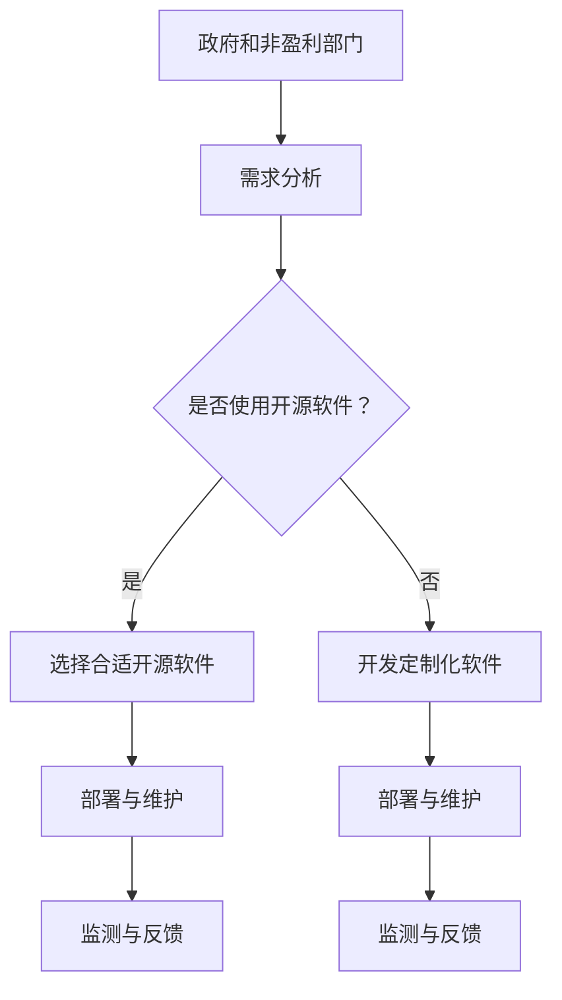

                 

关键词：开源软件、政府机构、非盈利组织、合作、技术共享、创新、成本效益

> 摘要：本文探讨了开源软件在政府和非盈利部门的应用价值，分析了开源贡献在这些领域的机遇和挑战，并提出了具体的实践建议和未来发展趋势。

## 1. 背景介绍

在当今信息时代，软件技术已经成为现代社会不可或缺的一部分。从政府机构到非盈利组织，各种组织在日常运营中都依赖于软件系统来提高效率和实现目标。然而，传统的商业软件在成本、定制化程度和适应性方面往往存在局限，而开源软件则提供了一种更为灵活和成本效益的解决方案。

开源软件是指其源代码可以被公众自由地查看、修改和分发的软件。这种软件模式的核心理念是合作、共享和创新。近年来，随着开源软件的普及和技术的进步，其在政府和非盈利部门的应用越来越广泛，成为推动数字化变革的重要力量。

本文旨在探讨开源软件在政府和非盈利部门的应用机会，分析开源贡献在这些领域的价值和挑战，并探讨未来的发展趋势。

## 2. 核心概念与联系

### 2.1 开源软件的概念

开源软件（Open Source Software，OSS）最早由自由软件运动倡导，其核心理念是开放性和共享性。开源软件的源代码是公开的，任何人都可以自由地下载、使用、修改和分发。这种模式不同于传统的封闭软件，后者通常由单一厂商拥有和掌控，用户只能被动地接受软件的功能和限制。

开源软件的核心特点包括：

- **开放性**：源代码公开，便于社区成员参与和审查。
- **透明性**：软件的开发过程是公开的，任何人都可查看。
- **共享性**：用户可以自由地修改和分发软件。
- **协作性**：鼓励全球开发者共同参与，协作解决问题。

### 2.2 开源贡献的概念

开源贡献（Open Source Contribution）是指个人或组织向开源项目提交代码、文档、测试用例或其他形式的贡献。这种贡献可以是直接编写代码，也可以是改进文档、提供测试报告或参与社区讨论。开源贡献有助于增强项目的质量、可靠性和可持续性。

### 2.3 开源软件与政府和非盈利部门的关系

政府和非盈利部门在运营中面临着诸多挑战，如预算限制、技术升级需求、用户满意度等。开源软件提供了一种解决这些问题的有效途径：

- **成本效益**：开源软件无需支付许可费用，可以显著降低成本。
- **定制化**：用户可以根据自身需求对软件进行修改和定制。
- **可靠性**：社区成员可以共同维护和改进软件，提高其可靠性。
- **适应性**：开源软件可以快速适应新技术和市场需求。

### 2.4 Mermaid 流程图



## 3. 核心算法原理 & 具体操作步骤

### 3.1 算法原理概述

开源软件在政府和非盈利部门的应用涉及多个核心算法和原理，主要包括：

- **需求分析算法**：用于确定组织的技术需求和开源软件的适用性。
- **选择算法**：用于从众多开源项目中选择最适合的项目。
- **部署和维护算法**：用于部署开源软件并确保其稳定运行。
- **监测与反馈算法**：用于监控软件性能并收集用户反馈。

### 3.2 算法步骤详解

#### 3.2.1 需求分析

1. **收集需求**：通过与各部门沟通，了解他们的具体需求和痛点。
2. **评估现有软件**：评估现有软件是否满足需求，以及是否存在改进空间。
3. **需求优先级排序**：根据需求的重要性和紧迫性进行排序。

#### 3.2.2 选择开源软件

1. **确定开源项目**：通过搜索和评估，选择符合需求的开源项目。
2. **评估项目健康状况**：检查项目的活跃度、社区支持和文档完整性。
3. **评估兼容性**：确保开源软件与组织的其他系统兼容。

#### 3.2.3 部署与维护

1. **安装和配置**：按照项目文档安装和配置开源软件。
2. **集成测试**：确保开源软件与组织的其他系统无缝集成。
3. **持续维护**：定期更新和修复软件漏洞，确保其持续稳定运行。

#### 3.2.4 监测与反馈

1. **性能监控**：使用工具监控软件性能，如响应时间、错误率等。
2. **用户反馈**：收集用户反馈，了解软件的使用情况和用户满意度。
3. **改进措施**：根据性能监控和用户反馈，制定改进措施。

### 3.3 算法优缺点

#### 优点：

- **成本低**：无需支付许可费用，节约预算。
- **灵活性强**：可以根据需求进行定制化修改。
- **可靠性高**：社区成员共同维护，可靠性更高。
- **适应性**：可以快速适应新技术和市场需求。

#### 缺点：

- **安全性**：开源软件可能存在安全隐患，需要严格审查和监控。
- **支持问题**：可能缺乏官方支持，需要依靠社区解决。

### 3.4 算法应用领域

开源软件在政府和非盈利部门的应用范围广泛，包括但不限于：

- **政务信息化**：政府门户网站、电子政务平台等。
- **公共服务**：智慧城市、智能交通、健康医疗等。
- **非盈利组织**：慈善机构、公益组织、教育机构等。

## 4. 数学模型和公式 & 详细讲解 & 举例说明

### 4.1 数学模型构建

在开源软件选择过程中，可以使用以下数学模型进行评估：

$$
R = \frac{C \cdot M \cdot S}{P}
$$

其中：

- \( R \)：项目选择评分
- \( C \)：兼容性评分
- \( M \)：维护性评分
- \( S \)：社区支持评分
- \( P \)：成本评分

### 4.2 公式推导过程

公式的推导基于以下考虑：

- **兼容性**：评估开源软件与组织现有系统的兼容程度。
- **维护性**：评估软件的维护难度和成本。
- **社区支持**：评估项目的社区活跃度和支持程度。
- **成本**：评估项目的成本效益。

通过加权各项指标，得出一个综合评分 \( R \)，用于评估项目的整体适合度。

### 4.3 案例分析与讲解

假设有四个开源项目 A、B、C、D，我们需要根据上述公式评估其选择评分。

- **兼容性**：项目 A、B、C、D 分别为 0.8、0.7、0.9、0.6。
- **维护性**：项目 A、B、C、D 分别为 0.9、0.8、0.7、0.8。
- **社区支持**：项目 A、B、C、D 分别为 0.9、0.8、0.7、0.6。
- **成本**：项目 A、B、C、D 分别为 0.6、0.5、0.7、0.8。

根据公式，计算各项目的选择评分：

- **项目 A**：\( R_A = \frac{0.8 \cdot 0.9 \cdot 0.9}{0.6} = 1.215 \)
- **项目 B**：\( R_B = \frac{0.7 \cdot 0.8 \cdot 0.8}{0.5} = 1.088 \)
- **项目 C**：\( R_C = \frac{0.9 \cdot 0.7 \cdot 0.7}{0.7} = 0.945 \)
- **项目 D**：\( R_D = \frac{0.6 \cdot 0.8 \cdot 0.6}{0.8} = 0.540 \)

根据评分，选择评分最高的项目 A 作为最佳选择。

## 5. 项目实践：代码实例和详细解释说明

### 5.1 开发环境搭建

在本项目实践中，我们将使用 Python 语言和 Flask 框架开发一个简单的政府门户网站。以下是开发环境的搭建步骤：

1. 安装 Python 3.8 或更高版本。
2. 安装 Flask 框架：`pip install Flask`。
3. 安装必要的依赖库，如 Jinja2、Werkzeug 等。

### 5.2 源代码详细实现

以下是一个简单的 Flask 应用程序，实现了一个政府门户网站的基础功能：

```python
from flask import Flask, render_template, request

app = Flask(__name__)

@app.route('/')
def home():
    return render_template('home.html')

@app.route('/about')
def about():
    return render_template('about.html')

@app.route('/contact', methods=['GET', 'POST'])
def contact():
    if request.method == 'POST':
        name = request.form['name']
        email = request.form['email']
        message = request.form['message']
        # 这里可以添加发送邮件的逻辑
        return 'Thank you for your message!'
    return render_template('contact.html')

if __name__ == '__main__':
    app.run(debug=True)
```

### 5.3 代码解读与分析

上述代码是一个简单的 Flask 应用程序，包括三个主要部分：

1. **路由和视图函数**：定义了三个路由和对应的视图函数，分别用于处理首页、关于页面和联系页面。
2. **模板渲染**：使用 Jinja2 模板引擎渲染 HTML 页面。
3. **表单处理**：使用 Flask 的 `request` 对象处理表单提交的数据。

### 5.4 运行结果展示

运行上述代码后，访问应用程序的首页，可以看到一个简单的政府门户网站界面：


访问关于页面和联系页面，可以查看相应的信息。

## 6. 实际应用场景

开源软件在政府和非盈利部门的应用场景广泛，以下是一些典型的应用案例：

- **政务信息化**：政府门户网站、电子政务平台、在线政务服务等。
- **公共服务**：智慧城市、智能交通、健康医疗、环境保护等。
- **非盈利组织**：慈善机构、公益组织、教育机构、志愿者管理等。

### 6.1 应用案例

#### 6.1.1 政务信息化

某市政府利用开源软件构建了政务信息化平台，实现了政务数据的集中管理、分析和展示，提高了政府工作效率和公共服务质量。

#### 6.1.2 公共服务

某市交通局利用开源软件开发了智慧交通系统，通过实时数据分析和智能调度，提高了城市交通管理水平，减少了交通拥堵。

#### 6.1.3 非盈利组织

某慈善机构利用开源软件建立了捐赠管理系统，实现了捐赠流程的在线化和自动化，提高了捐赠效率和透明度。

## 7. 工具和资源推荐

### 7.1 学习资源推荐

- 《精通开源软件管理》（Open Source Software Management）
- 《开源软件项目管理》（Open Source Software Project Management）
- 《开源之道》（The Open Source Way）

### 7.2 开发工具推荐

- GitHub：最流行的开源代码托管平台。
- Git：分布式版本控制系统。
- Docker：容器化技术，简化应用部署和运维。

### 7.3 相关论文推荐

- "Open Source Software: The Model for the Future" by John H. Clippinger
- "The Economic Case for Open Source" by Red Hat

## 8. 总结：未来发展趋势与挑战

### 8.1 研究成果总结

开源软件在政府和非盈利部门的应用已取得显著成果，降低了成本、提高了效率，促进了技术创新。开源贡献也推动了社区协作和知识共享，成为信息技术发展的重要驱动力。

### 8.2 未来发展趋势

- **开源标准化**：推动开源软件的标准化，提高其可互操作性。
- **开源生态建设**：构建更完善的开源生态系统，支持开源项目的可持续发展。
- **智能化**：结合人工智能技术，提升开源软件的智能水平和应用能力。

### 8.3 面临的挑战

- **安全性**：开源软件可能存在安全隐患，需要加强安全审查和监控。
- **支持问题**：开源软件可能缺乏官方支持，需要依靠社区解决。
- **人才短缺**：开源项目需要大量技术人才支持，但开源社区的人才储备有限。

### 8.4 研究展望

未来，开源软件在政府和非盈利部门的广泛应用仍具有巨大潜力。通过加强开源标准化、生态建设和人才培养，我们可以进一步发挥开源软件的优势，推动社会数字化进程。

## 9. 附录：常见问题与解答

### 9.1 问题 1

**问：开源软件是否安全？**

**答：开源软件的安全问题是一个常见顾虑。虽然开源软件的源代码是公开的，但这也意味着其安全性可以受到更广泛的审查。然而，不安全的问题可能会存在，特别是在没有足够的审查和维护的情况下。因此，政府和非盈利部门在选择开源软件时，应确保遵循以下原则：**

1. 选择活跃的开源项目，这些项目通常有更稳定的社区支持。
2. 定期更新软件，以修复已知的安全漏洞。
3. 审查源代码，确保其遵循安全编码实践。
4. 寻求专业安全评估，以识别潜在的安全风险。

### 9.2 问题 2

**问：开源软件需要官方支持吗？**

**答：并非所有开源软件都需要官方支持，但某些情况下，官方支持确实能够提供额外的保障。对于政府和非盈利部门来说，以下是一些考虑因素：**

1. **项目规模**：对于大型和关键系统的开源项目，官方支持可能更加必要。
2. **复杂度**：对于高度复杂的系统，官方支持可以帮助解决技术难题。
3. **社区支持**：一些开源项目拥有强大的社区支持，这可以作为官方支持的替代。

在评估开源软件时，应综合考虑官方支持和社区支持的优势，以确定最适合项目的支持方式。

---

# 结束语

作者：禅与计算机程序设计艺术 / Zen and the Art of Computer Programming

本文探讨了开源软件在政府和非盈利部门的应用价值，分析了开源贡献在这些领域的机遇和挑战，并提出了具体的实践建议和未来发展趋势。开源软件作为一种创新的模式，不仅降低了成本，提高了效率，还促进了技术创新和社会进步。在未来，我们期待看到更多政府和非盈利部门拥抱开源，共同构建一个更加开放、共享和可持续的数字世界。

