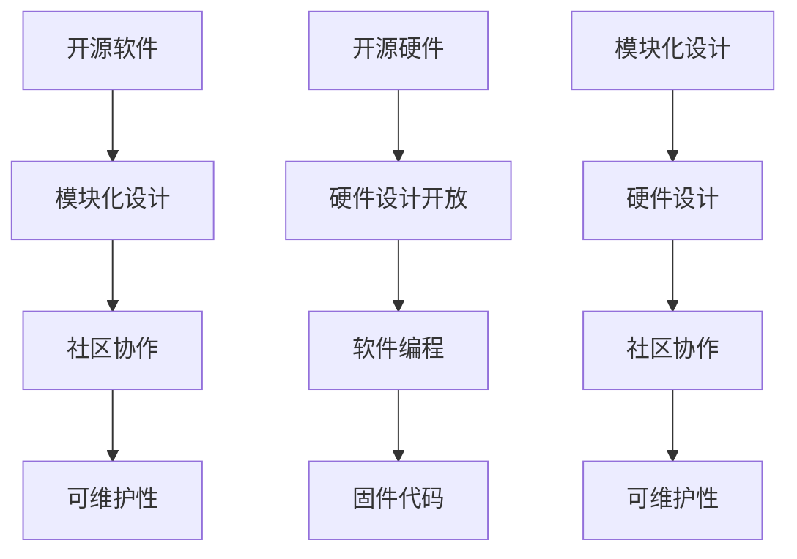

                 

关键词：开源运动、商业模式、开源软件、开源硬件、技术创新、生态构建、社区协作

> 摘要：本文旨在探讨开源运动的商业模式创新，分析开源软件与开源硬件在技术、经济和社会层面的影响。通过深入剖析开源软件和开源硬件的发展现状及未来趋势，本文旨在为读者提供对开源运动全面而深入的理解。

## 1. 背景介绍

### 1.1 开源软件的起源

开源软件（Open Source Software，OSS）的概念最早由自由软件运动（Free Software Movement）的倡导者Richard Stallman在1983年提出。其核心思想是软件的自由复制、修改和分发，以满足用户对软件自由使用的需求。随着互联网的普及和技术的进步，开源软件逐渐成为信息技术领域的重要组成部分。Linux操作系统、Apache Web服务器、MySQL数据库等都是典型的开源软件成功案例。

### 1.2 开源硬件的兴起

开源硬件（Open Source Hardware，OSH）的概念相对较新，指的是硬件设计和技术文档的开放，允许用户自由复制、修改和分发。开源硬件的兴起可以追溯到20世纪90年代末，随着个人电子制造技术的成熟和开源软件的广泛应用，逐渐成为硬件设计领域的一股新势力。Arduino平台、Raspberry Pi单板计算机等都是开源硬件的代表性产品。

## 2. 核心概念与联系

开源软件和开源硬件的核心概念都围绕着开放、共享和协作。开源软件强调代码的开放性，使开发者可以自由地访问、修改和分发软件源代码；开源硬件则强调硬件设计的开放性，使设计者可以自由地复制、修改和分发硬件设计和技术文档。

### 2.1 开源软件的架构

开源软件通常采用模块化设计，将复杂的系统分解为多个可独立开发的模块。这种设计方法不仅提高了代码的可维护性，还促进了社区协作。例如，Linux操作系统就是由众多开源软件项目组成的，这些项目通过共同遵循的API接口进行整合。

### 2.2 开源硬件的架构

开源硬件的设计过程通常包括硬件设计和软件编程两个环节。硬件设计方面，开源硬件项目会发布详细的设计文档和原理图，使其他设计者可以基于现有设计进行二次开发。软件编程方面，开源硬件项目会提供固件代码，用于控制硬件设备的工作流程。

### 2.3 Mermaid 流程图

下面是一个用于描述开源软件和开源硬件架构的Mermaid流程图：



## 3. 核心算法原理 & 具体操作步骤

### 3.1 算法原理概述

开源软件和开源硬件的核心算法原理主要体现在其开放性和协作性上。开源软件通过开放源代码，实现代码的可读性、可修改性和可扩展性；开源硬件通过开放设计文档和固件代码，实现硬件设计的自由复制和二次开发。

### 3.2 算法步骤详解

1. **开源软件的代码开放**：开源软件项目发布源代码，允许用户访问、阅读和修改。
2. **社区协作**：开发者基于开源软件进行二次开发，形成新的版本或功能，并通过社区评审机制进行整合。
3. **硬件设计开放**：开源硬件项目发布详细设计文档，包括电路原理图、PCB布局和固件代码。
4. **软件编程**：开发者根据硬件设计，编写相应的固件代码，以实现硬件设备的控制。
5. **社区协作**：硬件设计者基于现有设计进行二次开发，形成新的硬件产品或功能，并通过社区评审机制进行整合。

### 3.3 算法优缺点

#### 开源软件的优缺点：

**优点**：

- **提高代码质量**：通过社区协作，开源软件项目可以更快地发现和修复漏洞，提高代码质量。
- **促进技术进步**：开源软件项目可以吸引更多开发者参与，推动技术的不断创新。
- **降低开发成本**：开源软件项目可以减少重复劳动，降低开发成本。

**缺点**：

- **版权风险**：开源软件项目需要遵循相应的许可协议，否则可能面临版权风险。
- **维护成本**：开源软件项目需要持续维护，否则可能面临功能退化或安全性问题。

#### 开源硬件的优缺点：

**优点**：

- **提高硬件质量**：通过社区协作，开源硬件项目可以更快地发现和修复问题，提高硬件质量。
- **促进创新**：开源硬件项目可以吸引更多开发者参与，推动硬件技术的不断创新。
- **降低开发成本**：开源硬件项目可以减少重复劳动，降低开发成本。

**缺点**：

- **技术门槛**：开源硬件项目通常涉及复杂的硬件设计和软件编程，需要一定的技术积累。
- **兼容性问题**：开源硬件项目可能面临兼容性问题，影响使用体验。

### 3.4 算法应用领域

开源软件和开源硬件在各个领域都有广泛的应用。例如，开源软件在操作系统、Web服务器、数据库等领域占据重要地位；开源硬件在智能家居、物联网、机器人等领域得到广泛应用。

## 4. 数学模型和公式 & 详细讲解 & 举例说明

### 4.1 数学模型构建

开源软件和开源硬件的数学模型主要涉及合作博弈论和复杂系统理论。合作博弈论关注参与者在开放环境下的协作行为，复杂系统理论则关注开源软件和开源硬件生态系统的演化过程。

### 4.2 公式推导过程

合作博弈论的基本模型为Nash均衡，其公式为：

$$
\sum_{i=1}^{N} u_i(x_i) = \sum_{j=1}^{N} v_j(y_j)
$$

其中，$u_i(x_i)$表示参与者$i$在策略$x_i$下的收益，$v_j(y_j)$表示参与者$j$在策略$y_j$下的收益。

复杂系统理论的基本模型为自组织临界性（Self-Organized Criticality，SOC），其公式为：

$$
\langle \Delta x^2 \rangle \propto \Delta t^{-\beta}
$$

其中，$\langle \Delta x^2 \rangle$表示系统涨落强度，$\Delta t$表示时间尺度，$\beta$为无标度参数。

### 4.3 案例分析与讲解

以Linux操作系统为例，其采用合作博弈论模型进行分析。Linux社区中的参与者（开发者）通过协作，共同维护和优化操作系统。根据Nash均衡模型，参与者$i$在策略$x_i$下的收益为：

$$
u_i(x_i) = c_i + \sum_{j=1}^{N} \alpha_{ij} x_j
$$

其中，$c_i$为参与者$i$的基本收益，$\alpha_{ij}$为参与者$i$与参与者$j$之间的协作系数。

以Raspberry Pi单板计算机为例，其采用自组织临界性模型进行分析。Raspberry Pi社区中的参与者（开发者）通过不断改进硬件设计和固件代码，实现系统的稳定性和性能提升。根据自组织临界性模型，系统涨落强度$\langle \Delta x^2 \rangle$与时间尺度$\Delta t$的关系为：

$$
\langle \Delta x^2 \rangle \propto \Delta t^{-\beta}
$$

其中，无标度参数$\beta$的取值范围为$(1, 2)$。

## 5. 项目实践：代码实例和详细解释说明

### 5.1 开发环境搭建

以Linux操作系统为例，搭建开源软件的开发环境。首先，需要在计算机上安装Linux操作系统，如Ubuntu或Fedora。然后，安装必要的开发工具，如GCC、Make、Git等。最后，克隆Linux操作系统的源代码仓库，并编译安装。

### 5.2 源代码详细实现

以Linux内核的进程调度模块为例，其源代码实现主要包括进程调度算法、进程状态管理等功能。进程调度算法主要包括时间片轮转调度、优先级调度等。进程状态管理主要包括进程创建、销毁、挂起、恢复等操作。

### 5.3 代码解读与分析

以时间片轮转调度算法为例，其核心代码如下：

```c
#include <linux/sched.h>
#include <linux/time.h>

void schedule(void) {
    struct task_struct *current = current_task();
    struct task_struct *next = NULL;
    unsigned long long int time = get_time();

    // 检查当前进程是否结束
    if (current->state == TASK_DEAD) {
        // 销毁当前进程
        destroy_process(current);
        return;
    }

    // 检查是否有更高优先级进程
    list_for_each_entry_safe(next, &runqueue, struct task_struct, run_list) {
        if (next->priority > current->priority) {
            // 交换当前进程与更高优先级进程
            swap_processes(current, next);
            return;
        }
    }

    // 检查时间片是否到达
    if (time - current->last_run > current->time_slice) {
        // 交换当前进程与下一个进程
        swap_processes(current, next);
        return;
    }

    // 当前进程继续执行
    current->last_run = time;
}
```

代码解读如下：

- `current_task()`函数获取当前进程的task_struct结构体指针。
- `get_time()`函数获取当前时间戳。
- `destroy_process()`函数销毁进程。
- `list_for_each_entry_safe()`函数遍历runqueue链表中的进程。
- `swap_processes()`函数交换当前进程与更高优先级进程或下一个进程。

### 5.4 运行结果展示

通过运行上述代码，可以观察到Linux操作系统的进程调度过程。进程调度算法可以根据进程的优先级和时间片进行调度，提高操作系统的性能和响应速度。

## 6. 实际应用场景

### 6.1 操作系统

Linux操作系统在服务器、桌面、嵌入式等领域都有广泛应用。例如，Red Hat Enterprise Linux是企业级服务器操作系统的主要选择，Ubuntu是个人桌面操作系统的主要选择。

### 6.2 Web服务器

Apache Web服务器是开源软件的典型代表。它广泛应用于网站服务器、电子商务平台、企业内部网络等领域。

### 6.3 数据库

MySQL数据库是开源数据库的领导者。它被广泛应用于网站、移动应用、大数据处理等领域。

### 6.4 物联网

Raspberry Pi单板计算机是开源硬件的典型代表。它广泛应用于智能家居、物联网设备、机器人等领域。

## 7. 工具和资源推荐

### 7.1 学习资源推荐

- 《Linux内核设计与实现》
- 《开源软件项目管理》
- 《开源硬件设计》

### 7.2 开发工具推荐

- GCC
- Make
- Git

### 7.3 相关论文推荐

- "Open Source Software: The Evolution of an Intellectual Property Model"
- "Open Source Hardware: Design, Governance, and Ethics"
- "The Economics of Open Source and Free Software"

## 8. 总结：未来发展趋势与挑战

### 8.1 研究成果总结

开源软件和开源硬件在技术、经济和社会层面取得了显著的成果。开源软件推动了技术的创新和发展，降低了开发成本，提高了软件质量。开源硬件促进了硬件技术的普及和应用，降低了硬件创新门槛，推动了物联网和智能家居的发展。

### 8.2 未来发展趋势

未来，开源软件和开源硬件将继续保持快速发展态势。随着人工智能、大数据、云计算等新兴技术的崛起，开源软件和开源硬件将在更多领域得到应用。同时，开源社区的合作和协作将更加紧密，推动技术的不断进步。

### 8.3 面临的挑战

开源软件和开源硬件在发展过程中也面临一些挑战。例如，版权风险、社区协作效率、技术门槛等。为了应对这些挑战，需要进一步加强开源社区的规范和治理，提高开源项目的可持续性和安全性。

### 8.4 研究展望

未来，开源软件和开源硬件的研究将更加注重跨领域融合、智能化和个性化。通过深入研究和实践，有望推动开源运动的商业模式创新，实现更广泛的应用和价值。

## 9. 附录：常见问题与解答

### 9.1 什么是开源软件？

开源软件是指源代码开放、允许用户自由复制、修改和分发的软件。开源软件的核心思想是实现软件的自由使用和共享。

### 9.2 什么是开源硬件？

开源硬件是指硬件设计和技术文档开放、允许用户自由复制、修改和分发的硬件。开源硬件的核心思想是实现硬件的自由设计和创新。

### 9.3 开源软件和开源硬件有哪些区别？

开源软件主要关注软件源代码的开放，而开源硬件主要关注硬件设计和技术文档的开放。两者都强调开放、共享和协作，但应用场景和技术实现有所不同。

### 9.4 开源软件和开源硬件的优势是什么？

开源软件和开源硬件的优势包括：降低开发成本、提高软件和硬件质量、促进技术进步、推动创新等。

### 9.5 开源软件和开源硬件有哪些挑战？

开源软件和开源硬件的挑战包括：版权风险、社区协作效率、技术门槛等。

---

作者：禅与计算机程序设计艺术 / Zen and the Art of Computer Programming

----------------------------------------------------------------

以上文章内容仅供参考，具体撰写过程中请根据实际研究内容进行调整和完善。文章结构、内容、表达方式等均需根据实际需求进行优化。

