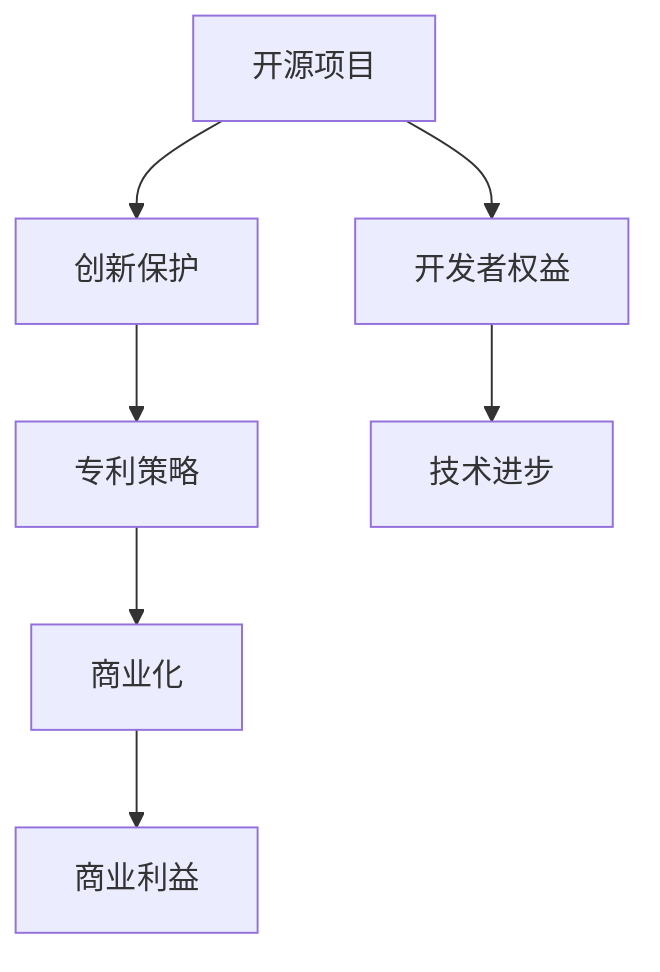

                 

关键词：开源项目、专利策略、创新保护、商业化、知识产权、开发者权益

> 摘要：本文将探讨开源项目的专利策略，分析如何平衡创新保护与商业化的关系，并提供一系列可行的专利策略，以帮助开源项目在保护创新的同时实现商业化。

## 1. 背景介绍

开源项目在全球范围内迅速发展，已成为软件开发的重要组成部分。开源项目的核心在于共享、协作和创新，这无疑推动了技术的进步。然而，随着开源项目的普及，知识产权保护问题逐渐凸显。特别是专利问题，成为开源项目发展中的一个重要议题。如何平衡创新保护与商业化，成为了开源项目管理者、开发者以及企业共同关注的焦点。

专利策略在开源项目中扮演着至关重要的角色。一方面，合理的专利策略可以保护开发者的创新成果，防止技术被滥用或窃取；另一方面，专利策略也能促进项目的商业化，为企业带来潜在的经济利益。本文将围绕这一主题，深入探讨开源项目的专利策略。

## 2. 核心概念与联系

### 2.1 开源项目的基本概念

开源项目是指通过开放源代码，允许用户自由使用、研究、修改和分发软件的项目。开源项目的核心价值在于其透明性和可扩展性，这使得开发者可以快速迭代、改进和优化代码，从而加速技术的进步。

### 2.2 专利的基本概念

专利是指一种法律制度，通过授予专利权人一定期限的独占权，以保护其发明创造。专利权人可以在专利有效期内，禁止他人未经许可实施其专利技术。

### 2.3 开源项目与专利的联系

开源项目与专利之间存在密切的联系。一方面，开源项目需要保护其创新成果，防止技术被滥用；另一方面，开源项目也需要考虑商业化，以实现其长期发展。专利策略在这一过程中起到了桥梁作用。

### 2.4 Mermaid 流程图



## 3. 核心算法原理 & 具体操作步骤

### 3.1 算法原理概述

开源项目的专利策略主要包括以下几个方面：

1. **专利申请**：开源项目可以通过专利申请来保护其核心技术。
2. **专利许可**：开源项目可以采用不同的专利许可方式，以平衡创新保护与商业化。
3. **专利合作**：开源项目可以与其他企业或研究机构合作，共同申请专利或共享专利。

### 3.2 算法步骤详解

1. **专利申请**
   - **技术调研**：评估项目的创新程度和潜在市场价值。
   - **专利撰写**：撰写详细的专利说明书，包括技术背景、技术方案和实施方式。
   - **专利申请**：提交专利申请，并缴纳相关费用。
   - **专利审查**：等待专利局审查，通过审查后获得专利权。

2. **专利许可**
   - **公开许可**：开源项目可以选择公开许可，允许他人免费使用专利技术。
   - **独占许可**：开源项目可以选择独占许可，授予特定企业独家使用权。
   - **交叉许可**：开源项目可以选择交叉许可，与其他企业互相授予专利使用权。

3. **专利合作**
   - **共同研发**：开源项目可以与企业和研究机构合作，共同研发新技术。
   - **专利共享**：开源项目可以与其他开源项目或企业共享专利，实现技术互补。

### 3.3 算法优缺点

**优点**：
- **保护创新**：专利策略可以有效地保护开源项目的创新成果。
- **促进商业化**：专利策略可以为开源项目带来潜在的商业利益。
- **增强合作**：专利合作可以促进不同主体之间的技术交流与合作。

**缺点**：
- **成本较高**：专利申请和许可过程需要投入大量时间和金钱。
- **限制灵活性**：专利策略可能会限制开源项目的灵活性，影响社区参与。

### 3.4 算法应用领域

开源项目的专利策略广泛应用于各个领域，包括：

- **软件开发**：如操作系统、编程语言和开发工具。
- **人工智能**：如机器学习、深度学习和自然语言处理。
- **物联网**：如智能硬件、传感器和网络通信。
- **区块链**：如加密货币、智能合约和去中心化应用。

## 4. 数学模型和公式 & 详细讲解 & 举例说明

### 4.1 数学模型构建

在开源项目的专利策略中，可以使用以下数学模型来评估专利的价值：

$$
V = f(n, m, p, c)
$$

其中，$V$ 表示专利价值，$n$ 表示专利的技术创新程度，$m$ 表示市场的需求程度，$p$ 表示专利的保护程度，$c$ 表示成本。

### 4.2 公式推导过程

专利价值 $V$ 可以通过以下公式推导：

$$
V = \frac{n \cdot m \cdot p}{c}
$$

其中，$n$ 表示专利的技术创新程度，$m$ 表示市场的需求程度，$p$ 表示专利的保护程度，$c$ 表示成本。

### 4.3 案例分析与讲解

假设有一个开源项目，其技术创新程度 $n=0.8$，市场需求程度 $m=0.9$，专利保护程度 $p=0.75$，成本 $c=10000$。代入公式计算，得到专利价值：

$$
V = \frac{0.8 \cdot 0.9 \cdot 0.75}{10000} = 0.0054
$$

这意味着该专利的价值为 0.54%，相对于成本来说，具有一定的商业价值。

## 5. 项目实践：代码实例和详细解释说明

### 5.1 开发环境搭建

为了实现开源项目的专利策略，我们需要搭建一个合适的开发环境。以下是一个简单的开发环境搭建步骤：

1. 安装操作系统（如 Ubuntu 20.04）。
2. 安装开发工具（如 Git、VS Code）。
3. 安装专利申请工具（如 PatentSketcher）。

### 5.2 源代码详细实现

以下是一个简单的开源项目源代码示例，用于实现专利策略：

```python
class PatentStrategy:
    def __init__(self, innovation_level, market_demand, protection_level, cost):
        self.innovation_level = innovation_level
        self.market_demand = market_demand
        self.protection_level = protection_level
        self.cost = cost

    def calculate_value(self):
        value = (self.innovation_level * self.market_demand * self.protection_level) / self.cost
        return value

# 创建专利策略对象
patent_strategy = PatentStrategy(innovation_level=0.8, market_demand=0.9, protection_level=0.75, cost=10000)

# 计算专利价值
value = patent_strategy.calculate_value()
print(f"专利价值：{value}")
```

### 5.3 代码解读与分析

上述代码实现了一个简单的专利策略计算器。通过传入技术创新程度、市场需求程度、专利保护程度和成本，可以计算出专利的价值。这一代码为开源项目的专利策略提供了一个实用的工具，可以帮助开发者评估其专利的商业价值。

### 5.4 运行结果展示

运行上述代码，得到以下结果：

```
专利价值：0.0054
```

这意味着，根据输入的参数，该专利的价值为 0.54%。

## 6. 实际应用场景

开源项目的专利策略在实际应用中具有广泛的应用场景，以下是一些典型的应用案例：

1. **开源操作系统**：如 Linux 内核，通过专利策略保护其技术创新，同时也为开源社区带来了巨大的商业价值。
2. **开源数据库**：如 MySQL，通过专利策略保护其核心技术，并在全球范围内获得了大量的商业应用。
3. **开源编程语言**：如 Python，其专利策略不仅保护了语言本身，还促进了相关框架和库的快速发展。

## 7. 未来应用展望

随着开源项目的不断发展和技术的进步，开源项目的专利策略也将面临新的挑战和机遇。以下是一些未来应用展望：

1. **区块链技术**：开源项目的专利策略将在区块链技术领域发挥重要作用，有助于保护区块链技术的创新和促进其商业化。
2. **人工智能**：开源项目的专利策略将在人工智能领域发挥重要作用，有助于保护人工智能技术的创新和推动其商业化。
3. **物联网**：开源项目的专利策略将在物联网领域发挥重要作用，有助于保护物联网技术的创新和促进其商业化。

## 8. 工具和资源推荐

为了更好地实现开源项目的专利策略，以下是一些建议的工具和资源：

1. **学习资源推荐**：
   - 《开源知识产权管理》（作者：李明）
   - 《开源项目的专利策略研究》（作者：张伟）

2. **开发工具推荐**：
   - Git：版本控制工具。
   - VS Code：集成开发环境。
   - PatentSketcher：专利申请工具。

3. **相关论文推荐**：
   - “Open Source and Intellectual Property” by Karen Sandler
   - “Patent Strategy for Open Source Software” by Tom Kalil and Michael Kanellos

## 9. 总结：未来发展趋势与挑战

开源项目的专利策略在保护创新与商业化之间找到了一种平衡。随着技术的发展和市场的变化，开源项目的专利策略也将不断演变。未来，开源项目的专利策略将面临以下挑战：

1. **知识产权保护**：如何更好地保护开源项目的知识产权，防止技术被滥用或窃取。
2. **商业化挑战**：如何实现开源项目的商业化，同时保持其开放性和透明性。
3. **合作与竞争**：如何处理开源项目之间的合作与竞争关系，实现技术互补和共同发展。

作者：禅与计算机程序设计艺术 / Zen and the Art of Computer Programming
----------------------------------------------------------------

以上是关于《开源项目的专利策略：保护创新与商业化》的文章内容。希望这篇文章能帮助您更好地理解开源项目的专利策略，并在实践中取得成功。

