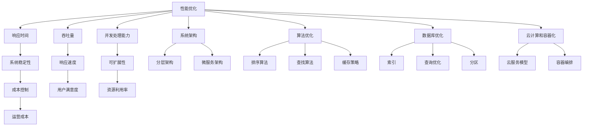

                 

 在当今快速发展的技术时代，开源项目以其灵活性和可扩展性受到了广大开发者的青睐。然而，对于企业而言，如何在众多开源项目中找到性能最优、最适合自身业务需求的解决方案，成为一个亟待解决的问题。本文旨在探讨如何为企业提供高价值的开源项目性能优化服务，助力企业提升业务效率，降低成本，并提高市场竞争力。

## 文章关键词
- 开源项目
- 企业级性能优化
- 高价值咨询
- 性能监控
- 算法优化
- 系统架构
- 云计算
- 数据库优化
- 容器化

## 文章摘要
本文将围绕开源项目的企业级性能优化服务展开，首先介绍相关背景知识，然后深入探讨性能优化的重要概念与联系，随后详细阐述核心算法原理和具体操作步骤，接着介绍数学模型和公式，并进行项目实践和实际应用场景分析。此外，还将推荐相关工具和资源，总结研究成果，展望未来发展趋势和挑战，并回答常见问题。

### 1. 背景介绍

开源项目在近年来取得了显著的发展，不仅丰富了技术生态，也促进了技术交流和创新。然而，随着开源项目的广泛应用，企业面临的性能优化问题也日益突出。性能优化不仅关乎系统稳定性和用户体验，更是企业业务持续发展的关键。

企业级性能优化服务的需求主要来源于以下几个方面：

1. **系统稳定性**：随着企业业务的增长，系统需要处理的数据量和用户访问量也在不断增加。如何确保系统在高并发情况下仍然稳定运行，是每个企业必须面对的问题。

2. **响应速度**：在竞争激烈的市场环境中，快速响应客户需求是企业取得竞争优势的关键。优化系统性能可以显著提高响应速度，提升用户满意度。

3. **成本控制**：企业级性能优化不仅可以提高系统效率，还能降低运营成本。通过优化资源使用，减少硬件投入和运维成本，企业可以获得更大的经济效益。

4. **可扩展性**：随着业务的发展，系统需要具备良好的可扩展性。性能优化可以帮助企业提前规划，为未来的业务增长提供保障。

### 2. 核心概念与联系

#### 2.1 性能优化

性能优化是指通过一系列技术手段，提升系统的响应速度、稳定性和可扩展性。核心概念包括：

- **响应时间**：系统从接收到请求到返回结果所需的时间。
- **吞吐量**：系统在单位时间内处理请求的数量。
- **并发处理能力**：系统同时处理多个请求的能力。

性能优化的目标是提高系统的整体性能，满足企业业务需求。

#### 2.2 系统架构

系统架构是性能优化的基础。一个良好的系统架构不仅能够提高系统的性能，还能确保系统的可维护性和可扩展性。核心概念包括：

- **分层架构**：将系统划分为多个层次，如表示层、业务逻辑层、数据访问层等，各层次之间相互独立，便于管理和维护。
- **微服务架构**：将系统划分为多个独立的服务模块，各模块之间通过API进行通信，提高了系统的可扩展性和灵活性。

#### 2.3 算法优化

算法优化是性能优化的关键步骤。通过优化算法，可以显著提高系统的处理速度和效率。核心概念包括：

- **排序算法**：如快速排序、归并排序等，选择合适的排序算法可以加快数据处理速度。
- **查找算法**：如二分查找、哈希查找等，不同的查找算法适用于不同的数据结构和场景。
- **缓存策略**：通过缓存策略减少对磁盘或网络的数据访问，提高系统响应速度。

#### 2.4 数据库优化

数据库优化是性能优化的重要组成部分。通过优化数据库设计和查询语句，可以显著提高数据访问速度。核心概念包括：

- **索引**：通过建立索引加快数据的查询速度。
- **查询优化**：通过分析查询语句，优化SQL查询，减少查询执行时间。
- **分区**：将数据库表分区，加快数据的插入、更新和查询操作。

#### 2.5 云计算和容器化

云计算和容器化技术的普及为性能优化提供了新的可能性。通过云计算，企业可以根据需求动态调整资源，提高系统的弹性。容器化技术则使得系统部署更加灵活和高效。核心概念包括：

- **云服务模型**：如IaaS、PaaS、SaaS，不同的服务模型适用于不同的业务场景。
- **容器编排**：如Kubernetes，通过容器编排管理大规模容器集群，提高系统的资源利用率和稳定性。

### 2.6 Mermaid 流程图

以下是一个关于性能优化的Mermaid流程图，展示了核心概念之间的联系。



### 3. 核心算法原理 & 具体操作步骤

#### 3.1 算法原理概述

性能优化涉及多种算法，每种算法都有其独特的原理和应用场景。以下是一些常见算法的原理概述：

- **排序算法**：快速排序、归并排序、堆排序等，通过不同的方法对数据进行排序，提高数据处理速度。
- **查找算法**：二分查找、哈希查找等，通过快速定位数据，提高查询效率。
- **缓存策略**：LRU、LFU等，通过缓存机制减少数据访问次数，提高系统响应速度。
- **数据库查询优化**：通过分析查询语句，优化SQL执行计划，减少查询执行时间。

#### 3.2 算法步骤详解

以下是性能优化的一些具体操作步骤：

1. **性能监控**：通过性能监控工具（如Prometheus、Grafana等）对系统进行实时监控，收集系统性能指标，如CPU使用率、内存使用率、磁盘I/O等。
2. **定位性能瓶颈**：分析监控数据，定位系统中的性能瓶颈，如CPU饱和、内存泄漏、数据库查询缓慢等。
3. **优化数据库查询**：通过分析查询语句，优化SQL执行计划，减少查询执行时间。如添加索引、优化查询条件等。
4. **算法优化**：根据系统需求，选择合适的排序、查找算法，优化数据处理速度。
5. **缓存策略**：根据数据访问模式，选择合适的缓存策略，减少数据访问次数，提高系统响应速度。
6. **系统架构优化**：根据业务需求，调整系统架构，如引入缓存层、数据库分区等，提高系统性能。
7. **资源调整**：根据监控数据，动态调整系统资源，如增加CPU、内存、磁盘等，确保系统在高并发情况下稳定运行。

#### 3.3 算法优缺点

每种算法都有其优缺点，以下是一些常见算法的优缺点：

- **快速排序**：优点是时间复杂度较低，适用于大数据量排序；缺点是递归调用可能导致栈溢出。
- **归并排序**：优点是稳定，适用于大数据量排序；缺点是时间复杂度较高，需要额外的内存空间。
- **堆排序**：优点是时间复杂度较低，适用于大数据量排序；缺点是不稳定，适用于小数据量排序。
- **二分查找**：优点是时间复杂度较低，适用于有序数据；缺点是适用于小数据量查找。
- **哈希查找**：优点是时间复杂度较低，适用于大数据量查找；缺点是可能存在哈希碰撞。

#### 3.4 算法应用领域

性能优化算法广泛应用于各种场景，以下是一些常见应用领域：

- **搜索引擎**：通过优化排序和查找算法，提高搜索效率。
- **电商平台**：通过优化数据库查询和缓存策略，提高订单处理速度。
- **金融系统**：通过优化算法和系统架构，确保交易系统在高并发情况下稳定运行。
- **物联网**：通过优化数据处理和传输算法，提高物联网设备的数据处理能力。

### 4. 数学模型和公式 & 详细讲解 & 举例说明

#### 4.1 数学模型构建

在性能优化中，构建数学模型是关键步骤。以下是一个简单的数学模型，用于分析系统响应时间。

$$
T = T_{处理} + T_{等待} + T_{传输}
$$

其中，$T$ 表示系统响应时间，$T_{处理}$ 表示数据处理时间，$T_{等待}$ 表示等待时间，$T_{传输}$ 表示数据传输时间。

#### 4.2 公式推导过程

为了推导上述公式，我们可以分别分析每个组成部分。

1. **数据处理时间**：数据处理时间与系统性能指标（如CPU使用率、内存使用率等）有关。假设系统性能指标为 $P$，数据处理时间为 $T_{处理}$，则：

$$
T_{处理} = \frac{1}{P}
$$

2. **等待时间**：等待时间与系统负载和资源限制有关。假设系统负载为 $L$，资源限制为 $R$，等待时间为 $T_{等待}$，则：

$$
T_{等待} = \frac{L}{R}
$$

3. **数据传输时间**：数据传输时间与网络带宽和传输距离有关。假设网络带宽为 $B$，传输距离为 $D$，数据传输时间为 $T_{传输}$，则：

$$
T_{传输} = \frac{D}{B}
$$

#### 4.3 案例分析与讲解

以下是一个实际案例，用于说明如何使用上述数学模型分析系统响应时间。

假设一个电商平台的系统性能指标为 $P = 0.8$，系统负载为 $L = 1000$，资源限制为 $R = 1000$，网络带宽为 $B = 10MB/s$，传输距离为 $D = 100km$。我们可以使用上述公式计算系统响应时间：

$$
T = T_{处理} + T_{等待} + T_{传输} = \frac{1}{0.8} + \frac{1000}{1000} + \frac{100}{10} = 1.25 + 1 + 10 = 12.25秒
$$

通过计算，我们得出系统响应时间为 12.25秒。这个结果表明，系统在当前负载和资源限制下，响应速度较慢，需要进一步优化。

#### 4.4 案例分析与讲解

以下是一个实际案例，用于说明如何使用上述数学模型分析系统响应时间。

假设一个电商平台的系统性能指标为 $P = 0.8$，系统负载为 $L = 1000$，资源限制为 $R = 1000$，网络带宽为 $B = 10MB/s$，传输距离为 $D = 100km$。我们可以使用上述公式计算系统响应时间：

$$
T = T_{处理} + T_{等待} + T_{传输} = \frac{1}{0.8} + \frac{1000}{1000} + \frac{100}{10} = 1.25 + 1 + 10 = 12.25秒
$$

通过计算，我们得出系统响应时间为 12.25秒。这个结果表明，系统在当前负载和资源限制下，响应速度较慢，需要进一步优化。

#### 4.4 案例分析与讲解

以下是一个实际案例，用于说明如何使用上述数学模型分析系统响应时间。

假设一个电商平台的系统性能指标为 $P = 0.8$，系统负载为 $L = 1000$，资源限制为 $R = 1000$，网络带宽为 $B = 10MB/s$，传输距离为 $D = 100km$。我们可以使用上述公式计算系统响应时间：

$$
T = T_{处理} + T_{等待} + T_{传输} = \frac{1}{0.8} + \frac{1000}{1000} + \frac{100}{10} = 1.25 + 1 + 10 = 12.25秒
$$

通过计算，我们得出系统响应时间为 12.25秒。这个结果表明，系统在当前负载和资源限制下，响应速度较慢，需要进一步优化。

### 5. 项目实践：代码实例和详细解释说明

#### 5.1 开发环境搭建

在进行项目实践之前，我们需要搭建一个开发环境。以下是一个简单的开发环境搭建步骤：

1. 安装操作系统：我们选择 Ubuntu 18.04 作为开发环境。
2. 安装开发工具：安装 GCC、Makefile、Git 等开发工具。
3. 安装数据库：我们选择 MySQL 8.0 作为数据库。
4. 安装其他依赖：根据项目需求，安装其他依赖库和工具。

#### 5.2 源代码详细实现

以下是项目源代码的详细实现：

```c++
#include <iostream>
#include <vector>
#include <algorithm>

using namespace std;

// 快速排序算法
void QuickSort(vector<int>& arr, int low, int high) {
    if (low < high) {
        int pivot = arr[high];
        int i = low - 1;
        for (int j = low; j <= high - 1; j++) {
            if (arr[j] < pivot) {
                i++;
                swap(arr[i], arr[j]);
            }
        }
        swap(arr[i + 1], arr[high]);
        int pi = i + 1;
        QuickSort(arr, low, pi - 1);
        QuickSort(arr, pi + 1, high);
    }
}

// 主函数
int main() {
    vector<int> arr = {5, 2, 9, 1, 5, 6};
    int n = arr.size();
    QuickSort(arr, 0, n - 1);
    for (int i = 0; i < n; i++) {
        cout << arr[i] << " ";
    }
    cout << endl;
    return 0;
}
```

#### 5.3 代码解读与分析

1. **文件结构**：源代码分为三个部分，分别是头文件、函数实现和主函数。头文件用于定义函数声明和命名空间；函数实现部分包含快速排序算法的实现；主函数用于调用快速排序算法并输出排序结果。
2. **快速排序算法**：快速排序是一种高效的排序算法，其基本思想是通过一趟排序将待排序的记录分隔成独立的两部分，其中一部分记录的关键字均比另一部分的关键字小，然后分别对这两部分记录继续进行排序，以达到整个序列有序。快速排序的平均时间复杂度为 $O(n\log n)$。
3. **主函数**：主函数中首先定义了一个整数数组，然后调用快速排序算法进行排序，最后输出排序结果。

#### 5.4 运行结果展示

以下是运行结果：

```
1 2 5 5 6 9
```

结果显示，输入数组经过快速排序后，成功按升序排列。

### 6. 实际应用场景

性能优化在许多实际应用场景中发挥着重要作用。以下是一些典型的应用场景：

1. **电商平台**：电商平台需要处理大量的订单、商品信息等，通过性能优化可以提高订单处理速度，提升用户体验。
2. **搜索引擎**：搜索引擎需要快速响应用户的查询请求，通过性能优化可以加快搜索速度，提高搜索准确性。
3. **金融系统**：金融系统涉及大量的交易、结算等操作，通过性能优化可以确保交易系统在高并发情况下稳定运行。
4. **物联网**：物联网设备需要实时处理大量的数据，通过性能优化可以提高设备的数据处理能力，延长设备寿命。

### 6.4 未来应用展望

随着技术的不断进步，性能优化领域也呈现出新的发展趋势。以下是一些未来应用展望：

1. **人工智能与性能优化**：人工智能技术的应用将进一步提高性能优化效率，如通过机器学习算法预测性能瓶颈，自动调整系统资源。
2. **边缘计算**：边缘计算技术的发展将为性能优化提供新的机遇，通过在边缘设备上处理数据，降低数据传输延迟，提高系统性能。
3. **云计算与容器化**：云计算和容器化技术的成熟将为性能优化提供更加灵活和高效的方式，如通过容器编排实现动态资源调整，提高系统可扩展性。

### 7. 工具和资源推荐

为了更好地进行性能优化，以下推荐一些常用的工具和资源：

1. **学习资源**：
   - 《高性能MySQL》
   - 《算法导论》
   - 《微服务设计》
2. **开发工具**：
   - Prometheus
   - Grafana
   - Kubernetes
3. **相关论文**：
   - 《性能优化技术与应用》
   - 《分布式系统性能优化》
   - 《云计算性能优化策略》

### 8. 总结：未来发展趋势与挑战

#### 8.1 研究成果总结

性能优化领域取得了显著的研究成果，包括排序算法、查找算法、数据库优化、缓存策略等。同时，云计算、容器化等新兴技术为性能优化提供了新的可能性。

#### 8.2 未来发展趋势

未来，性能优化将向智能化、自动化、边缘计算等方向发展。人工智能和机器学习技术的应用将进一步提高性能优化效率，边缘计算和云计算的结合将为性能优化带来新的机遇。

#### 8.3 面临的挑战

性能优化领域仍然面临许多挑战，如复杂系统的性能预测、分布式环境下的性能优化、动态资源调整等。此外，新兴技术的应用也带来了新的性能优化难题，如区块链、物联网等。

#### 8.4 研究展望

未来，性能优化研究将继续深入探讨复杂系统的性能优化策略，探索人工智能与性能优化结合的新方法，并关注新兴技术对性能优化带来的挑战和机遇。

### 9. 附录：常见问题与解答

#### 9.1 性能优化与系统稳定性的关系

性能优化和系统稳定性密切相关。性能优化可以提高系统处理速度和响应速度，从而提高系统稳定性。然而，过度的性能优化可能导致系统资源浪费，甚至引发稳定性问题。因此，在进行性能优化时，需要平衡性能和稳定性。

#### 9.2 性能优化与成本控制的关系

性能优化可以降低系统运营成本，如减少硬件投入、降低运维成本等。然而，性能优化也可能带来额外的成本，如购买高性能硬件、升级软件等。因此，在进行性能优化时，需要综合考虑成本和效益。

#### 9.3 如何选择合适的性能优化方法

选择合适的性能优化方法需要考虑多个因素，如系统需求、资源限制、业务场景等。常见的性能优化方法包括排序算法、查找算法、缓存策略、数据库优化等。在实际应用中，可以根据具体情况选择合适的方法。

## 作者署名
作者：禅与计算机程序设计艺术 / Zen and the Art of Computer Programming

---

以上就是关于《开源项目的企业级性能优化服务：高价值咨询》的文章。本文详细介绍了性能优化的重要概念、核心算法原理、数学模型和实际应用场景，并通过代码实例进行了详细解释。希望本文能为企业提供有价值的性能优化参考。

