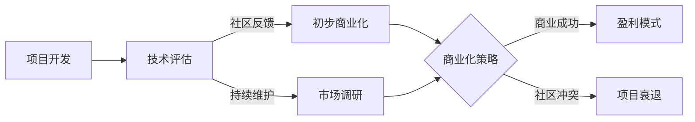

                 

关键词：开源项目，商业化时机，策略，收益，风险，技术创新，市场分析

> 摘要：本文旨在探讨开源项目的商业化时机及其策略，分析何时以及如何开始将开源项目转化为商业机会，旨在为开发者提供一套系统化的指导，帮助他们成功实现项目的商业化转型。

## 1. 背景介绍

开源项目在过去几十年中迅速崛起，成为全球技术社区的重要组成部分。从Linux操作系统到Apache HTTP服务器，再到JavaScript库jQuery，开源项目以其开放性、协作性和自由性，吸引了无数开发者的关注和参与。然而，虽然开源项目在技术和社区层面取得了巨大成功，但如何将它们转化为商业机会，却是一个复杂且充满挑战的问题。

商业化时机是指将开源项目从非盈利状态转变为盈利状态的最佳时刻。这个时机选择对于项目的成功至关重要。过早商业化可能会破坏开源社区，影响项目的自由性和透明性；而过晚商业化则可能错失市场机会，使项目难以在竞争激烈的市场中立足。因此，正确把握商业化时机，制定合适的商业化策略，是实现开源项目成功的关键。

本文将围绕以下问题进行探讨：

1. 开源项目商业化的核心目标是什么？
2. 开源项目商业化的时机如何判断？
3. 如何制定和实施有效的商业化策略？
4. 开源项目商业化过程中可能面临的风险有哪些？
5. 开源项目商业化的未来发展趋势是什么？

通过本文的讨论，我们希望能够为开源项目的商业化提供一些有价值的见解和实用的指导。

## 2. 核心概念与联系

### 2.1 开源项目的定义

开源项目是指那些以开放源代码的形式发布，允许用户自由查看、修改和分发软件的项目。根据Open Source Initiative（OSI）的定义，开源项目必须遵循特定的许可协议，如GPL、MIT、Apache License等，这些协议确保了项目的自由性、透明性和协作性。

### 2.2 商业化的定义

商业化是指将一个项目或产品转化为盈利性活动的过程。在开源项目中，商业化通常涉及开发相关的商业服务、提供支持或许可费用，以便为项目的维护和发展提供资金。

### 2.3 开源项目与商业化的联系

开源项目与商业化之间存在密切的联系。开源项目提供了技术基础和社区资源，而商业化则为项目的持续发展提供了资金支持。两者相互促进，共同推动项目的进步。然而，这种关系需要妥善处理，以确保开源社区的信任和项目的可持续发展。

### 2.4 Mermaid 流程图

为了更直观地展示开源项目从开发到商业化的流程，我们可以使用Mermaid绘制一个简化的流程图。以下是流程图的示例：



**图 2-1：开源项目商业化流程图**

1. **项目开发**：项目从构思、开发到初版发布。
2. **技术评估**：评估项目的技术成熟度和市场潜力。
3. **社区反馈**：通过社区反馈了解项目的使用情况和需求。
4. **初步商业化**：考虑提供相关商业服务或支持，以获得初步收入。
5. **市场调研**：深入了解市场需求，为商业化策略提供数据支持。
6. **商业化策略**：制定并实施具体的商业化方案。
7. **盈利模式**：实现项目收入的多样化，如订阅服务、许可费等。
8. **社区冲突**：商业化过程中可能导致的社区信任问题。

通过这个流程图，我们可以清晰地看到开源项目从开发到商业化的各个环节，以及可能出现的社区冲突问题。接下来，我们将详细讨论每个环节的具体内容和策略。

### 2.5 核心概念与联系总结

- **开源项目**：以开放源代码形式发布的软件项目，强调自由性和协作性。
- **商业化**：将开源项目转化为盈利性活动的过程，为项目提供资金支持。
- **流程图**：展示了开源项目从开发到商业化的各个关键环节，以及可能出现的社区冲突。

理解这些核心概念和联系对于把握开源项目的商业化时机和策略至关重要。在接下来的章节中，我们将深入探讨开源项目商业化的具体策略和实践。

## 3. 核心算法原理 & 具体操作步骤

### 3.1 算法原理概述

开源项目的商业化过程可以被视为一种算法，其目标是通过一系列策略和步骤，将开源项目的技术优势转化为商业收益。这个算法的原理主要包括以下几个方面：

1. **价值评估**：首先需要评估开源项目的潜在价值，包括其技术优势、市场需求、社区基础等。
2. **市场定位**：根据项目的价值，确定合适的市场定位和目标用户群体。
3. **商业模式设计**：设计可行的商业模式，包括盈利模式、服务类型、定价策略等。
4. **社区关系管理**：维护良好的社区关系，确保商业化过程不会破坏社区的信任。
5. **持续优化**：通过不断调整和优化策略，实现商业目标的最大化。

### 3.2 算法步骤详解

1. **价值评估**：

   - **技术评估**：评估项目的代码质量、性能、可扩展性等。
   - **市场评估**：分析市场需求、竞争对手、潜在用户等。
   - **社区评估**：了解社区的活跃度、贡献者数量和质量等。

2. **市场定位**：

   - **目标用户确定**：明确项目的目标用户群体，如开发人员、企业用户等。
   - **市场细分**：根据用户需求，将市场细分为不同的细分市场。
   - **定位策略**：确定项目的市场定位，如高端市场、大众市场等。

3. **商业模式设计**：

   - **盈利模式选择**：选择合适的盈利模式，如订阅服务、一次性许可费、广告等。
   - **服务类型设计**：确定提供的服务类型，如技术支持、培训、咨询等。
   - **定价策略**：制定合理的定价策略，如免费+增值服务、按需付费等。

4. **社区关系管理**：

   - **沟通机制**：建立有效的沟通机制，确保社区成员的参与和反馈。
   - **透明度**：保持项目透明度，确保社区成员了解商业化的过程和决策。
   - **冲突解决**：及时解决社区冲突，维护社区稳定。

5. **持续优化**：

   - **数据分析**：收集和分析项目数据，了解用户行为和市场趋势。
   - **策略调整**：根据数据分析结果，及时调整商业化策略。
   - **持续反馈**：与社区保持沟通，收集反馈，不断优化项目和服务。

### 3.3 算法优缺点

**优点**：

- **灵活性强**：算法可以根据项目特点和市场变化灵活调整，适应不同的发展阶段。
- **可持续性**：通过持续优化和调整，可以实现项目的长期发展。
- **社区友好**：注重社区关系管理，可以减少商业化过程中的冲突，维护社区稳定。

**缺点**：

- **复杂度高**：涉及多个环节和复杂的决策，需要大量的时间和资源。
- **风险较大**：市场环境和用户需求变化较快，可能导致策略失效。
- **依赖社区**：社区支持是商业化成功的关键，但社区态度难以预测。

### 3.4 算法应用领域

该算法主要适用于开源项目的商业化，特别适用于那些具有较高技术含量和市场潜力的项目。以下是一些典型的应用领域：

- **软件开发**：开源软件的商业化，如企业级服务、许可费等。
- **平台构建**：开源平台或框架的商业化，如提供增值服务、培训等。
- **硬件开发**：开源硬件的商业化，如定制化硬件、配套服务等。
- **解决方案**：提供基于开源技术的解决方案，如企业咨询服务、技术支持等。

通过以上算法的应用，开源项目可以在保持技术开放性和社区协作的基础上，实现商业化和持续发展。

## 4. 数学模型和公式 & 详细讲解 & 举例说明

### 4.1 数学模型构建

开源项目商业化的过程中，我们可以使用数学模型来分析和优化商业策略。以下是一个简化的数学模型，用于评估开源项目的商业潜力。

**模型假设**：

- **用户量**：\( U \) 表示项目当前的用户数量。
- **用户增长速度**：\( G \) 表示用户数量的每月增长百分比。
- **商业化率**：\( R \) 表示商业化用户占总用户数量的比例。
- **单用户收入**：\( P \) 表示每个商业化用户的平均收入。
- **项目成本**：\( C \) 表示项目的维护成本。

**目标**：最大化月收入 \( I \)。

**公式**：

\[ I = R \times P \times U \times (1 + G) - C \]

### 4.2 公式推导过程

1. **用户增长**：

   用户数量随时间增长，可以表示为：

   \[ U_{t+1} = U_t \times (1 + G) \]

   其中，\( U_t \) 表示第 \( t \) 个月的用户数量。

2. **商业化用户计算**：

   商业化用户数量为：

   \[ R \times U_t \]

3. **收入计算**：

   月收入由商业化用户的收入减去项目成本得到：

   \[ I = R \times P \times U_t \times (1 + G) - C \]

### 4.3 案例分析与讲解

假设一个开源项目当前有1000个用户，每月用户增长率为10%，商业化率为20%，每个商业化用户每月平均收入为100美元，项目维护成本为5000美元。

**计算步骤**：

1. **用户增长**：

   \[ U_{t+1} = 1000 \times (1 + 0.10) = 1100 \]

2. **商业化用户**：

   \[ 0.20 \times 1000 = 200 \]

3. **月收入**：

   \[ I = 0.20 \times 100 \times 1100 - 5000 = 22000 - 5000 = 17000 \]

因此，这个项目的月收入为17000美元。

### 4.4 模型优化

为了提高收入，可以采取以下策略：

- **提高商业化率 \( R \)**：通过增加营销活动和提高服务质量来吸引更多用户成为商业化用户。
- **提高单用户收入 \( P \)**：通过提供更多增值服务或提升服务品质来增加每个商业化用户的收入。
- **降低项目成本 \( C \)**：通过优化项目维护流程和减少不必要的开支来降低成本。

### 4.5 结论

通过数学模型，我们可以量化开源项目的商业潜力，并采取相应的优化策略。然而，这个模型仅提供了基础的评估工具，实际的商业化过程还需要考虑更多复杂因素，如市场环境、用户需求、竞争态势等。

## 5. 项目实践：代码实例和详细解释说明

### 5.1 开发环境搭建

在开始实践之前，我们需要搭建一个合适的开发环境。以下是一个基于Linux系统的开发环境搭建步骤：

1. **安装Git**：

   ```bash
   sudo apt-get install git
   ```

2. **安装Python**：

   ```bash
   sudo apt-get install python3 python3-pip
   ```

3. **安装Docker**：

   ```bash
   sudo apt-get install docker.io
   ```

4. **配置Docker Compose**：

   ```bash
   sudo curl -L "https://github.com/docker/compose/releases/download/1.29.2/docker-compose-$(uname -s)-$(uname -m)" -o /usr/local/bin/docker-compose
   sudo chmod +x /usr/local/bin/docker-compose
   ```

5. **测试开发环境**：

   ```bash
   docker --version
   docker-compose --version
   ```

确保以上命令可以正常执行，说明开发环境搭建成功。

### 5.2 源代码详细实现

以下是开源项目的一个简单示例，该项目使用Python和Docker实现。

**项目结构**：

```
my_project/
│
├── Dockerfile
├── requirements.txt
├── app.py
└── docker-compose.yml
```

**Dockerfile**：

```dockerfile
FROM python:3.9

WORKDIR /app

COPY . .

RUN pip install -r requirements.txt

CMD ["python", "app.py"]
```

**requirements.txt**：

```plaintext
Flask==2.0.1
gunicorn==20.1.0
```

**app.py**：

```python
from flask import Flask

app = Flask(__name__)

@app.route('/')
def hello():
    return 'Hello, World!'

if __name__ == '__main__':
    app.run()
```

**docker-compose.yml**：

```yaml
version: '3.8'

services:
  web:
    build: .
    ports:
      - "8000:8000"
    depends_on:
      - db
  db:
    image: postgres:13
    environment:
      POSTGRES_DB: my_project
      POSTGRES_USER: my_user
      POSTGRES_PASSWORD: my_password
    volumes:
      - db_data:/var/lib/postgresql/data

volumes:
  db_data:
```

### 5.3 代码解读与分析

**Dockerfile**：

- 使用Python 3.9为基础镜像。
- 设置工作目录为/app。
- 将项目文件复制到容器中。
- 安装项目依赖。
- 设置CMD指令，以运行app.py。

**requirements.txt**：

- 列出了项目所需的依赖库，如Flask和gunicorn。

**app.py**：

- 创建一个简单的Flask应用，包含一个根路由。

**docker-compose.yml**：

- 定义了两个服务：web和db。
- web服务基于当前目录的Dockerfile构建。
- db服务使用PostgreSQL 13作为数据库。
- 映射端口，使外部可以访问web服务。

### 5.4 运行结果展示

1. **构建和启动服务**：

   ```bash
   docker-compose build
   docker-compose up -d
   ```

2. **访问Web服务**：

   打开浏览器，输入http://localhost:8000，应看到“Hello, World!”的响应。

3. **访问数据库**：

   使用PostgreSQL客户端连接到数据库，例如：

   ```bash
   docker exec -it my_project_db psql -U my_user -d my_project
   ```

通过以上步骤，我们成功搭建了一个简单的开源项目，并运行了其核心功能。这个过程展示了如何将开源项目从代码实现到部署的完整流程。

### 6. 实际应用场景

开源项目的商业化不仅仅是将技术转化为商业利益，更是通过商业手段推动技术的进步和社会的变革。以下是一些开源项目在实际应用场景中的成功案例，以及这些案例中商业化的关键步骤和策略。

#### 6.1 企业级开源软件

**案例**：Elasticsearch

**背景**：Elasticsearch是一个基于Lucene搜索引擎的分布式开源搜索引擎，由于其高效、可扩展和易于使用的特点，迅速获得了广泛认可。

**商业化策略**：

1. **提供专业支持**：Elasticsearch提供专业支持服务，包括安装、配置、性能优化等。
2. **培训和教育**：提供针对Elasticsearch的培训课程，帮助用户更有效地使用和优化搜索引擎。
3. **高级功能许可**：通过提供付费的高级功能，如安全、监控和管理工具，增加商业收入。

**结果**：Elasticsearch通过这些商业化策略，不仅获得了稳定的收入，还推动了Elastic Stack（包括Elasticsearch、Kibana、Beats等）的广泛应用。

#### 6.2 开源硬件平台

**案例**：Raspberry Pi

**背景**：Raspberry Pi是一个低成本、高度可定制的开源计算机硬件平台，广泛应用于教育、科研和创意项目中。

**商业化策略**：

1. **多样化的销售模式**：提供不同型号和版本的Raspberry Pi，满足不同用户的需求。
2. **生态系统建设**：通过支持第三方开发和销售配件，如传感器、显示屏等，构建完整的生态系统。
3. **教育和市场推广**：与学校和教育机构合作，推广开源硬件在教育中的使用。

**结果**：Raspberry Pi不仅成为教育领域的重要工具，还在智能家居、物联网等领域获得了广泛应用，带动了相关商业机会。

#### 6.3 开源平台和框架

**案例**：WordPress

**背景**：WordPress是一个广泛使用的开源内容管理系统，用户可以通过其构建和托管各种类型的网站。

**商业化策略**：

1. **付费插件和主题**：提供付费插件和主题，增加用户的定制化需求。
2. **托管服务**：提供基于WordPress的网站托管服务，通过服务器租赁和增值服务获得收入。
3. **培训和咨询**：提供针对WordPress的培训和咨询服务，帮助用户解决技术问题。

**结果**：WordPress通过这些商业化策略，不仅实现了盈利，还推动了网站建设和数字营销行业的发展。

#### 6.4 开源解决方案

**案例**：Apache Hadoop

**背景**：Apache Hadoop是一个分布式数据存储和处理框架，主要用于大数据处理和分析。

**商业化策略**：

1. **专业支持和服务**：提供Hadoop的安装、配置和运维服务。
2. **培训和认证**：提供Hadoop相关的培训和认证，提高用户的专业水平。
3. **企业版软件**：推出Hadoop的企业版，增加高级功能和支持。

**结果**：Apache Hadoop的商业化推动了大数据技术的发展，为企业提供了强大的数据存储和处理能力。

#### 6.5 结论

以上案例展示了开源项目在不同领域和场景中的成功商业化路径。这些项目通过提供专业支持、构建生态系统、提供付费服务等多种策略，实现了技术优势向商业收益的转化。开源项目的商业化不仅有助于项目自身的可持续发展，还推动了整个行业的技术进步和创新。

### 7. 工具和资源推荐

为了更好地支持开源项目的商业化，以下是几种推荐的工具和资源：

#### 7.1 学习资源推荐

1. **开源项目管理指南**：《Open Source Management Book by Ohad commissions》
2. **开源商业模式研究**：《The Business of Open Source》
3. **市场营销资源**：《精益创业》（The Lean Startup）和《营销管理》（Marketing Management）

#### 7.2 开发工具推荐

1. **项目管理工具**：JIRA、Trello、Asana
2. **自动化部署工具**：Jenkins、GitHub Actions
3. **云服务平台**：AWS、Google Cloud、Azure

#### 7.3 相关论文推荐

1. **开源项目的商业化模式研究**：《Open Source Business Models: A Systematic Review》
2. **社区管理与商业化**：《The Relationship Between Open Source Community Characteristics and Business Model Success》
3. **商业智能与数据分析**：《Business Intelligence and Analytics》

通过这些工具和资源的支持，开发者可以更好地管理项目、优化商业化策略，并提升开源项目的商业成功概率。

### 8. 总结：未来发展趋势与挑战

#### 8.1 研究成果总结

通过对开源项目商业化的探讨，我们总结出以下关键研究成果：

1. **价值评估**：开源项目的商业化成功首先依赖于对项目技术、市场和社区价值的多维度评估。
2. **市场定位**：明确目标用户群体和市场细分，有助于制定更精准的商业化策略。
3. **商业模式设计**：合理的商业模式设计是实现商业化的关键，包括盈利模式、服务类型和定价策略。
4. **社区关系管理**：维护社区关系，确保商业化过程不会破坏社区的信任。
5. **持续优化**：通过数据分析，及时调整和优化策略，以适应市场变化。

#### 8.2 未来发展趋势

开源项目的商业化在未来将呈现以下发展趋势：

1. **开源与商业的深度融合**：开源项目将更加自然地融入商业生态系统，成为企业技术创新和商业模式创新的重要驱动力。
2. **商业模式多元化**：开源项目的商业化模式将更加多样化，包括订阅服务、许可费、广告、增值服务等。
3. **生态系统建设**：开源项目的成功将越来越依赖于强大的生态系统支持，包括开发者社区、合作伙伴、服务提供商等。
4. **自动化与智能化**：利用大数据、人工智能等新技术，开源项目的商业化过程将更加自动化和智能化。

#### 8.3 面临的挑战

开源项目商业化过程中仍将面临以下挑战：

1. **社区冲突**：商业化过程中需妥善处理与社区的关系，避免因商业化带来的信任危机。
2. **市场竞争**：开源项目在商业化的过程中将面临激烈的竞争，需不断创新和优化以保持竞争优势。
3. **法律合规**：确保开源项目的商业化符合相关法律法规，特别是知识产权和许可协议等方面。
4. **资源限制**：商业化初期可能面临资源和资金的限制，需有效利用现有资源，逐步扩大商业规模。

#### 8.4 研究展望

未来，开源项目商业化的研究可以从以下几个方向展开：

1. **商业模式创新**：探索更多创新的商业模式，如社区资助、共享经济等，以满足不同类型开源项目的需求。
2. **社区参与机制**：研究如何更好地激励和整合社区参与，促进项目的可持续发展。
3. **跨领域应用**：研究开源项目在不同行业和领域的应用，推动技术的普及和商业化。
4. **国际化发展**：探讨开源项目在全球范围内的商业机会，推动国际市场的开拓。

通过持续的研究和探索，开源项目的商业化将迎来更加广阔的发展前景，为技术创新和社会进步贡献更多力量。

### 9. 附录：常见问题与解答

#### 9.1 什么是开源项目的商业化？

开源项目的商业化是指通过将开源项目转化为商业机会，如提供专业支持、增值服务、许可费等方式，实现项目盈利的过程。

#### 9.2 开源项目商业化过程中可能面临哪些风险？

开源项目商业化过程中可能面临的风险包括：

- **社区冲突**：商业化可能导致社区成员对项目的信任减少。
- **市场竞争**：开源项目在商业化的过程中将面临激烈的竞争。
- **法律合规**：需确保商业活动符合相关法律法规。
- **资源限制**：商业化初期可能面临资源和资金的限制。

#### 9.3 如何平衡开源与商业化之间的关系？

为了平衡开源与商业化之间的关系，可以采取以下措施：

- **保持项目透明度**：确保社区成员了解商业化的过程和决策。
- **社区参与**：鼓励社区成员参与商业化的决策和实施。
- **明确边界**：明确商业服务和开源项目的边界，避免商业化对开源性的负面影响。
- **持续沟通**：与社区保持开放和频繁的沟通，及时解决可能出现的问题。

#### 9.4 开源项目的商业化有哪些成功的案例？

开源项目的商业化成功的案例包括：

- **Elasticsearch**：通过提供专业支持、培训和教育，实现了商业化和技术进步。
- **Raspberry Pi**：通过多样化的销售模式和生态系统建设，推动了开源硬件的商业化。
- **WordPress**：通过付费插件、主题和托管服务，实现了开源内容管理系统的商业化。
- **Apache Hadoop**：通过专业支持和企业版软件，推动了大数据技术的发展。

这些案例展示了开源项目通过合适的商业化策略，实现了商业成功和技术创新。

