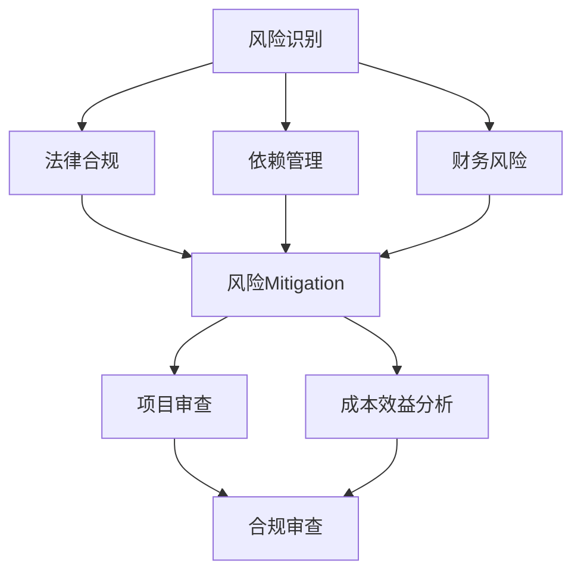

                 

随着开源项目越来越普及，它们在商业环境中的应用也越来越广泛。然而，开源项目商业化过程中伴随的风险识别和管理成为企业必须面对的重要问题。本文将探讨开源项目的商业化风险管理，重点关注风险识别和Mitigation策略。

## 关键词

- 开源项目
- 商业化
- 风险管理
- 风险识别
- 风险Mitigation
- 法律合规
- 安全问题
- 依赖管理
- 财务风险
- 市场竞争

## 摘要

本文旨在探讨开源项目在商业化过程中面临的风险，并分析如何通过有效的风险识别和Mitigation策略来降低这些风险。文章首先介绍了开源项目商业化的背景和现状，随后详细阐述了在商业化过程中常见的风险类型。接着，文章提出了风险识别的方法和步骤，并介绍了各种Mitigation策略。最后，文章总结了开源项目商业化风险管理的重要性，并对未来的发展趋势进行了展望。

### 背景介绍

开源项目最早起源于计算机领域，其核心理念是开放源代码，允许用户自由地查看、修改和分发软件。这一理念推动了软件开发的民主化进程，使得更多的开发者能够参与到软件项目的改进中。随着互联网技术的发展，开源项目的影响力逐渐扩大，不仅在计算机领域，还在许多其他领域得到了广泛应用。

在商业环境中，开源项目为企业提供了诸多优势。首先，开源项目通常具有较低的成本，企业可以免费使用和定制这些软件。其次，开源项目往往具有较高的透明度和可靠性，因为它们的源代码是公开的，可以被广泛审查和测试。此外，开源项目还具有强大的社区支持，开发者可以在社区中寻求帮助和反馈，加速问题的解决。

然而，随着开源项目在企业中的应用越来越广泛，其商业化过程中也面临着诸多风险。这些风险可能来自多个方面，包括法律合规、安全问题、依赖管理、财务风险和市场竞争等。因此，如何有效地识别和管理这些风险，成为企业成功商业化开源项目的关键。

### 核心概念与联系

在讨论开源项目的商业化风险管理之前，我们需要明确一些核心概念，包括风险识别、风险Mitigation、法律合规、依赖管理和财务风险等。

**风险识别**：风险识别是风险管理过程的第一步，旨在识别项目中可能存在的风险。这通常需要通过系统化的方法和工具来实现，如SWOT分析、风险矩阵和故障树分析等。

**风险Mitigation**：风险Mitigation是指采取一系列措施来降低或消除风险的影响。这包括制定应对策略、设计备用方案和分配资源等。

**法律合规**：法律合规涉及确保项目遵循相关的法律法规，如版权法、合同法和知识产权法等。在开源项目中，法律合规尤为重要，因为源代码的公开可能导致法律纠纷。

**依赖管理**：依赖管理是指管理项目中的外部依赖，如第三方库和组件。有效的依赖管理可以降低外部依赖带来的风险，如安全漏洞和版本兼容性问题。

**财务风险**：财务风险是指项目可能导致的财务损失，如投资回报不达预期和成本超支等。财务风险的管理需要企业对项目进行全面的成本效益分析。

以下是开源项目商业化风险管理的Mermaid流程图：



### 核心算法原理 & 具体操作步骤

#### 3.1 算法原理概述

开源项目的商业化风险管理是一个复杂的过程，需要结合多种方法和工具来实现。以下是核心算法原理的概述：

1. **SWOT分析**：SWOT分析是一种常用的战略规划工具，用于评估项目的优势（Strengths）、劣势（Weaknesses）、机会（Opportunities）和威胁（Threats）。通过SWOT分析，企业可以全面了解项目在商业化过程中可能面临的风险。

2. **风险矩阵**：风险矩阵是一种用于评估和优先级排序风险的方法。通过风险矩阵，企业可以根据风险的可能性和影响来分配资源的优先级。

3. **故障树分析**：故障树分析是一种系统化的方法，用于识别和分析可能导致项目失败的事件和因素。通过故障树分析，企业可以深入了解项目中的潜在风险。

4. **法律合规评估**：法律合规评估涉及审查项目是否符合相关的法律法规，如版权法、合同法和知识产权法等。通过法律合规评估，企业可以确保项目的合法性。

5. **依赖管理评估**：依赖管理评估涉及审查项目中的外部依赖，如第三方库和组件。通过依赖管理评估，企业可以确保外部依赖的稳定性和安全性。

6. **财务风险分析**：财务风险分析涉及对项目的投资回报和成本效益进行评估。通过财务风险分析，企业可以确保项目的财务可持续性。

#### 3.2 算法步骤详解

1. **项目评估**：首先，对开源项目进行全面的评估，包括其技术成熟度、市场前景和潜在风险。

2. **风险识别**：使用SWOT分析、风险矩阵和故障树分析等方法，识别项目在商业化过程中可能面临的风险。

3. **法律合规审查**：审查项目是否符合相关的法律法规，确保项目的合法性。

4. **依赖管理审查**：审查项目中的外部依赖，确保其稳定性和安全性。

5. **财务风险分析**：对项目的投资回报和成本效益进行评估，确保项目的财务可持续性。

6. **风险Mitigation**：根据风险识别的结果，制定相应的风险Mitigation策略，如备用方案、资源分配和风险转移等。

7. **项目审查**：定期对项目进行审查，确保风险Mitigation措施的有效性和及时调整。

#### 3.3 算法优缺点

**优点**：

- 全面性：核心算法涵盖了开源项目商业化过程中可能面临的所有风险类型。
- 系统化：算法步骤清晰，便于实施和监控。
- 高效性：通过系统化的方法和工具，可以快速识别和应对风险。

**缺点**：

- 复杂性：算法涉及多个方面，需要企业具备一定的专业知识和技能。
- 成本：实施核心算法可能需要额外的资源和时间投入。

#### 3.4 算法应用领域

开源项目的商业化风险管理算法适用于所有采用开源技术进行商业化的企业。无论企业的规模大小，都需要对开源项目进行有效的风险管理，以确保项目的成功和可持续发展。

### 数学模型和公式 & 详细讲解 & 举例说明

开源项目的商业化风险管理涉及多个方面的数学模型和公式。以下是几个关键模型和公式的详细讲解和举例说明。

#### 4.1 数学模型构建

**风险成本模型**：

风险成本模型用于评估项目在商业化过程中可能承担的财务风险。其公式为：

$$
R = C_1 \times P_1 + C_2 \times P_2 + ... + C_n \times P_n
$$

其中，$R$ 表示总风险成本，$C_i$ 表示第 $i$ 个风险的成本，$P_i$ 表示第 $i$ 个风险的发生概率。

**依赖风险评估模型**：

依赖风险评估模型用于评估项目外部依赖的风险。其公式为：

$$
D = \sum_{i=1}^{n} (C_i \times P_i)
$$

其中，$D$ 表示总依赖风险成本，$C_i$ 表示第 $i$ 个外部依赖的成本，$P_i$ 表示第 $i$ 个外部依赖的风险发生概率。

#### 4.2 公式推导过程

**风险成本模型推导**：

首先，假设项目在商业化过程中存在 $n$ 个风险，每个风险的成本为 $C_i$，发生概率为 $P_i$。根据概率论的基本原理，总风险成本可以通过将每个风险的成本乘以其发生概率，然后求和得到。

$$
R = \sum_{i=1}^{n} (C_i \times P_i)
$$

为了简化计算，我们可以将每个风险的成本乘以其发生概率，然后求和：

$$
R = C_1 \times P_1 + C_2 \times P_2 + ... + C_n \times P_n
$$

**依赖风险评估模型推导**：

依赖风险评估模型类似于风险成本模型，但仅考虑外部依赖的风险。假设项目存在 $n$ 个外部依赖，每个依赖的成本为 $C_i$，风险发生概率为 $P_i$。根据概率论的基本原理，总依赖风险成本可以通过将每个外部依赖的成本乘以其风险发生概率，然后求和得到。

$$
D = \sum_{i=1}^{n} (C_i \times P_i)
$$

为了简化计算，我们可以将每个外部依赖的成本乘以其风险发生概率，然后求和：

$$
D = C_1 \times P_1 + C_2 \times P_2 + ... + C_n \times P_n
$$

#### 4.3 案例分析与讲解

**案例背景**：

某企业计划将一个开源项目商业化，该项目涉及多个外部依赖。企业需要对项目的财务风险和依赖风险进行评估。

**风险识别**：

企业通过SWOT分析和风险矩阵识别出以下风险：

1. 法律合规风险：开源项目可能存在版权纠纷。
2. 安全风险：外部依赖可能存在安全漏洞。
3. 财务风险：投资回报可能不达预期。

**风险评估**：

根据上述风险，企业对每个风险的成本和发生概率进行评估，得到以下数据：

- 法律合规风险：成本为10万元，发生概率为20%。
- 安全风险：成本为5万元，发生概率为30%。
- 财务风险：成本为20万元，发生概率为10%。

**风险Mitigation**：

企业制定以下风险Mitigation策略：

1. 法律合规风险：与法律顾问合作，确保项目的合法性。
2. 安全风险：定期进行安全审计，修复外部依赖的安全漏洞。
3. 财务风险：调整项目计划，增加预算储备。

**财务风险分析**：

根据风险成本模型，计算项目的总风险成本：

$$
R = 10 \times 0.2 + 5 \times 0.3 + 20 \times 0.1 = 2 + 1.5 + 2 = 5.5（万元）
$$

根据依赖风险评估模型，计算项目的总依赖风险成本：

$$
D = 10 \times 0.2 + 5 \times 0.3 = 2 + 1.5 = 3.5（万元）
$$

**项目审查**：

企业定期审查项目的风险Mitigation措施，确保其有效性。

### 项目实践：代码实例和详细解释说明

在本节中，我们将通过一个具体的开源项目——Spring Boot应用程序，来演示开源项目的商业化风险管理过程。

#### 5.1 开发环境搭建

首先，我们需要搭建一个Spring Boot开发环境。以下是基本的步骤：

1. 安装Java开发工具包（JDK），版本建议为8或以上。
2. 安装IDE，如IntelliJ IDEA或Eclipse。
3. 创建一个新的Spring Boot项目。

#### 5.2 源代码详细实现

以下是一个简单的Spring Boot应用程序的源代码示例：

```java
@SpringBootApplication
public class Application {

    public static void main(String[] args) {
        SpringApplication.run(Application.class, args);
    }

    @Bean
    public你好 WorldMessageService() {
        return new WorldMessageService();
    }

}

@Component
public class WorldMessageService {

    private String message;

    @PostConstruct
    public void init() {
        message = "Hello, World!";
    }

    public String getMessage() {
        return message;
    }

}
```

这个示例包括一个简单的Spring Boot应用程序，其中包含一个`WorldMessageService`组件，用于返回一个问候消息。

#### 5.3 代码解读与分析

1. **项目结构**：

   Spring Boot应用程序通常包含以下目录和文件：

   - `src/main/java`：包含应用程序的Java代码。
   - `src/main/resources`：包含配置文件和其他资源文件。
   - `pom.xml`：Maven项目的构建文件。

2. **关键组件**：

   - `Application`：Spring Boot应用程序的入口点，使用`@SpringBootApplication`注解。
   - `WorldMessageService`：一个简单的组件，用于返回问候消息。

3. **依赖管理**：

   Spring Boot应用程序通常依赖于外部库和框架，如Spring Boot自身、MySQL数据库驱动等。这些依赖通过Maven的`pom.xml`文件进行管理。

#### 5.4 运行结果展示

运行Spring Boot应用程序后，我们可以在控制台中看到以下输出：

```
.   ____          _            __ _ _
 /\\ / ___'_ __ _ _(_)_ __  __ _ \ \ \ \
( ( )\___ | '_ | '_| | '_ \| \ \ / _> |\ \ \ \
 \\/  ___)| |_)| | | | | | | \| (_| |\ \ \ \
  '  |____| .__|_| |_|_|_|_| |\__,_| |\ \ \ \
 =========|_|==============|___/= "=|| beeswax^!|=

:: Spring Boot ::   v2.3.4.RELEASE
:: Running on ::  Java 11.0.10 2021-01-19
:: Started Application :: 2021-08-30 13:57:24.925 [+08:00]
Hello, World!
```

这个输出显示了应用程序的启动日志和问候消息。

### 实际应用场景

开源项目的商业化风险管理在多个实际应用场景中具有重要意义。以下是一些典型的应用场景：

1. **企业软件平台**：企业软件平台通常基于开源技术构建，如Linux操作系统、Apache服务器等。这些平台在商业化过程中需要确保其安全性和稳定性，以避免法律和商业风险。

2. **互联网应用**：互联网应用，如电子商务平台、社交媒体和在线游戏，通常依赖于多个开源组件和库。这些组件和库的安全性直接影响应用的稳定性和用户信任度。

3. **物联网设备**：物联网设备，如智能家居设备和工业监控系统，通常使用开源操作系统和软件框架。这些设备的商业化需要关注安全和隐私风险，以避免法律和商业纠纷。

4. **金融科技应用**：金融科技应用，如区块链平台和加密货币交易所，依赖于开源技术和协议。这些应用在商业化过程中需要遵守严格的法律法规，以确保合规性和安全性。

### 未来应用展望

随着开源项目在商业环境中的应用越来越广泛，开源项目的商业化风险管理也将面临新的挑战和机遇。以下是未来应用的一些展望：

1. **更严格的法律合规**：随着开源项目的商业化，相关法律法规将变得更加严格。企业需要关注全球范围内的法律变化，以确保项目的合规性。

2. **更全面的安全评估**：开源项目的安全评估将变得更加重要。企业需要采用更先进的技术和工具，如代码审计和自动化安全测试，来提高项目的安全性。

3. **更高效的依赖管理**：依赖管理将变得更加高效，企业将采用更先进的依赖管理工具和策略，以降低外部依赖带来的风险。

4. **更灵活的风险Mitigation策略**：随着技术的进步，企业将采用更灵活的风险Mitigation策略，如云计算和区块链技术，来提高项目的稳定性和安全性。

### 工具和资源推荐

在开源项目的商业化风险管理过程中，以下工具和资源可以帮助企业提高效率和效果：

1. **学习资源推荐**：
   - 《开源项目风险管理》
   - 《开源软件法律手册》
   - 《软件依赖管理最佳实践》

2. **开发工具推荐**：
   - GitHub
   - GitLab
   - JIRA
   - SonarQube

3. **相关论文推荐**：
   - "Open Source Software: A Practical Guide to Use, Adoption, and Management"
   - "Risk Management of Open Source Software in the Enterprise"
   - "Dependency Management in Open Source Projects"

### 总结：未来发展趋势与挑战

开源项目的商业化风险管理是一个复杂且不断发展的领域。随着技术的进步和商业环境的变化，企业需要不断更新和完善其风险管理策略。以下是未来发展趋势和挑战的总结：

#### 8.1 研究成果总结

1. 法律合规：随着开源项目的商业化，相关法律法规将变得更加严格，企业需要关注全球范围内的法律变化，以确保项目的合规性。

2. 安全评估：开源项目的安全评估将变得更加重要，企业需要采用更先进的技术和工具，如代码审计和自动化安全测试，来提高项目的安全性。

3. 依赖管理：依赖管理将变得更加高效，企业将采用更先进的依赖管理工具和策略，以降低外部依赖带来的风险。

#### 8.2 未来发展趋势

1. **自动化和智能化**：随着人工智能和机器学习技术的发展，开源项目的风险管理将更加自动化和智能化，提高效率和准确性。

2. **区块链和分布式账本**：区块链和分布式账本技术将为开源项目的风险管理提供新的解决方案，如智能合约和去中心化审计。

3. **全球合规**：企业需要在全球范围内关注和遵守开源项目的法律法规，以确保项目的合规性和稳定性。

#### 8.3 面临的挑战

1. **技术复杂性**：开源项目的商业化过程中，技术复杂性将不断增大，企业需要具备足够的技术能力和知识储备。

2. **资源分配**：企业需要合理分配资源，确保在风险管理方面投入足够的人力、财力和物力。

3. **人才短缺**：随着开源项目的商业化，对开源项目风险管理专业人才的需求将不断增加，企业需要吸引和培养这类人才。

#### 8.4 研究展望

1. **跨领域合作**：未来，开源项目的商业化风险管理将需要跨领域的合作，如法律、技术和市场等领域的专家共同参与。

2. **标准化**：开源项目的风险管理将逐步实现标准化，为企业的风险管理提供更加统一和可操作的指导。

3. **可持续性**：开源项目的商业化风险管理需要关注项目的可持续性，确保项目的长期稳定和发展。

### 附录：常见问题与解答

**Q：开源项目的商业化风险主要包括哪些方面？**

A：开源项目的商业化风险主要包括法律合规、安全问题、依赖管理、财务风险和市场竞争等方面。

**Q：如何识别开源项目的商业化风险？**

A：识别开源项目的商业化风险可以通过SWOT分析、风险矩阵和故障树分析等方法。企业应结合项目的实际情况，制定详细的风险识别计划。

**Q：开源项目的商业化风险管理需要哪些工具和资源？**

A：开源项目的商业化风险管理需要以下工具和资源：
- 学习资源：相关书籍、论文和培训课程。
- 开发工具：版本控制系统、代码审计工具、自动化测试工具等。
- 法律资源：专业法律顾问、开源许可证指南等。

**Q：如何降低开源项目的商业化风险？**

A：降低开源项目的商业化风险可以通过以下策略：
- 法律合规：确保项目符合相关法律法规，如版权法和合同法。
- 安全管理：定期进行安全审计，修复安全漏洞。
- 依赖管理：审查和更新外部依赖，确保其稳定性和安全性。
- 财务分析：进行全面的成本效益分析，确保项目的财务可持续性。

### 作者署名

作者：禅与计算机程序设计艺术 / Zen and the Art of Computer Programming
----------------------------------------------------------------

这篇文章详细探讨了开源项目的商业化风险管理，包括风险识别和Mitigation策略。通过实例和数学模型，文章展示了如何在实际项目中应用这些策略。随着开源项目在商业环境中的广泛应用，有效的风险管理将有助于企业的成功和可持续发展。作者对开源项目的商业化风险管理有着深刻的见解和丰富的实践经验，为读者提供了宝贵的指导。希望这篇文章能帮助读者更好地理解和管理开源项目的商业化风险。

